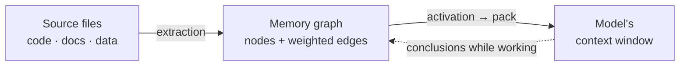

# AMG — Associative Memory Graph

**Persistent associative memory for LLM agents.** A typed knowledge graph in markdown over the filesystem: retrieval by spreading activation (BM25 seeding + Personalized PageRank), Hebbian edge weights with decay, consolidation, and a crash-safe transactional store.

> Documentation: [Theory](docs/en/THEORY.md) · [Architecture](docs/en/architecture/README.md) · [Guide](docs/en/GUIDE.md) · [Install](INSTALL.md) · [Roadmap](docs/en/architecture/11-roadmap.md) · Русский: [README_RU.md](README_RU.md)

> ⚠️ **TESTED ON CLAUDE CODE ONLY.** The installer can also set the memory up in other agent environments: **Codex** — with skills and TOML subagents (`--env codex`, the `.agents`/`.codex` directories); other AGENTS.md agents (Qwen Coder, etc.) — via a portable skill-less block (`--env generic`). But **functionality and stability on any non-Claude-Code environment are NOT yet tested or guaranteed** — all testing so far was on Claude Code. Verification of these environments is roadmap Stage 19.

## What it is

A language model remembers nothing between sessions, and its working memory — the context window — is bounded: when it overflows or the session ends, the accumulated context is lost. AMG gives the model an **external long-term memory shaped as a graph** of linked note-nodes that live as ordinary files on disk.

The idea is to take the best of two familiar approaches and sidestep their weaknesses. **RAG** (retrieval-augmented generation) can automatically find and inject what's relevant into the window, but it does so as a flat top-k: it answers multi-hop questions poorly — the ones whose answer must be assembled from several sources — and accumulates nothing across queries. A **hand-kept wiki** (in the spirit of Andrej Karpathy's llm-wiki) gives human-readable linked pages and explicit structure, but needs manual upkeep and drifts away from the source over time. AMG keeps RAG's automation and the wiki's human-readable structure, but retrieves differently: not by flat similarity, but by **spreading activation along the links** — so the window receives a relevant *neighborhood* of the graph (the node you need together with its context), not a scatter of look-alike fragments.



**The consolidated memory AMG builds is for more than code.** You can feed it **any** information from text files: source code, documentation and notes (Markdown, reStructuredText), plain text, data (JSON/YAML/NDJSON, CSV tables), logs, chat exports, and binary documents — PDF, DOCX, XLSX, PPTX (via optional pure-Python libraries). Each file's type is detected automatically and routed to the right chunker: code by functions, documents by headings, JSON by records (deep nesting is split recursively), logs by episodes, chat by messages. **Python is parsed natively** — by the `ast` module, along its structure (module → classes → functions, with imports and calls), not as flat text; other languages (`.js`, `.ts`, `.php`, `.c`, `.cpp`, `.go`, `.rs`, `.java`, `.rb`, and more) get the same function-level granularity through the optional `tree-sitter`. So one memory holds a codebase's architecture, your text notes, third-party documents, and dumped dialogues alike — linking them into a single graph.

## How it works

**Two planes.** All deterministic work is done by Python scripts: they parse source files into units, store the graph transactionally, and compute retrieval and consolidation — cheap, exact, no model required. On top of that runs a judgment layer — subagents (isolated instances of the model) that add meaning: they write node summaries, attach semantic edges, and estimate salience. The boundary between the planes saves the key resource — tokens: expensive semantic work runs only over the units that actually *changed* (each matched by a content hash), while the structural skeleton can be rebuilt at any time for free.

**A graph, not a tree.** The directory tree encodes only the part/section relation (`part_of`) — a spanning tree for browsing and a namespace. Every other link lives as an **explicit typed, weighted edge** in the frontmatter (the YAML header at the top of a markdown file). So the graph is independent of folder layout, survives renames, and works with git, grep, and editors without extra tooling.

**Retrieval — per request, driven by the model itself.** Before taking on a task — and every time the focus shifts mid-conversation (a new requirement, a different subsystem) — the model assembles a compact context pack from the graph rather than loading the whole project. That is, retrieval happens not once at session start but before each task, initiated by the model as it reasons. The mechanism is **query-biased Personalized PageRank**: the query is seeded lexically (BM25) and, optionally, semantically (embeddings), and activation then spreads over the structural edges. Those edges are **query-independent** — and that is what preserves multi-hop reach: activation mass flows *through* a node that is itself irrelevant to the query toward a relevant neighbor ("bias, don't gate").

**Tiered assembly and an output ceiling.** Activated nodes are packed greedily by abstraction tier under a token budget: *strategic* (hubs and overviews, ≈4000 tokens), *tactical* (relevant modules, ≈10000), *operational* (the leaf nodes in focus, in full, ≈24000), and a *periphery* (a link list to the next ring of neighbors). This is a **ceiling per query, not a mandatory load**: only the activated neighborhood is actually pulled in, so simple queries stay cheap while complex ones get everything relevant. The tier budgets are configurable in `config.yml`.

**Graph growth and forgetting.** The graph itself grows without bound — it is never loaded into the window whole. But to keep retrieval sharp, each branch (a hub's subtree) has its own budget: by default ≈400 nodes or ≈200000 tokens (whichever is hit first). When a branch outgrows it, **staged compaction** kicks in: fold stale episodes into one summary → merge near-duplicates → introduce an intermediate sub-hub → as a last resort, shorten the least valuable. Compaction stops the moment the branch is back under budget, **archives the originals** (forgetting is reversible), and never touches the protected first — decisions, ADRs, and highly connected nodes. The result is a controllable analogue of forgetting unimportant detail while preserving the gist (details — [theory, §10](docs/en/THEORY.md)).

**Capture cheaply, select later.** During a session, decisions, conclusions, open questions, and plans are filed through a safe note API (never by hand-editing nodes). Weighting, merging, compression, and forgetting happen in a separate **consolidation** step, once the full context is available. This mirrors how human memory works (the complementary learning systems theory): a fast, broad capture now; a careful integration into long-term memory later.

**Crash safety.** The truth is the files on disk; the graph is their recoverable projection. Every write goes through a write-ahead journal with declarative redo under a single-writer lock; an interruption at any point — a crash, a closed terminal, a `/clear` — recovers, and re-reconciliation is idempotent: a re-run over unchanged files neither writes nor loses anything. After an unexpected crash nothing is corrupted or lost: the graph heals itself on the next start (even after a hard kill), conclusions filed along the way survive as their own transactions, and an interrupted build resumes where it left off — already-processed nodes are not duplicated (details in the [guide](docs/en/GUIDE.md), "Recovery from failures").

## Conservative defaults

Memory is tuned cautiously, in a "quality first" spirit:

- **Hebbian weight learning is off** (`weights.apply_hebbian: false`). Graph conductance stays static and predictable until a measurement proves an uplift: a direct comparison showed the blind reinforcement rule **hurts** recall on a large sparse graph — reinforced well-trodden links become "highways" that pull activation away from nodes reachable only multi-hop (details — [theory, §8](docs/en/THEORY.md)).
- **Compaction is idle by default** — it compresses nothing while a branch is within budget; when it does compress, it passes an automatic recall check (an eval guard measures recall on a graph clone before and after and rejects a drop) and archives the originals.
- **Embeddings are optional, light enrichment** over BM25, not a replacement; with no backend installed, retrieval stays purely lexical.

## Installation

The engine (`agents/` + `skills/` + the activation block) installs **locally** (into a single project's `<project>/.claude/`) or **globally** (one engine for all projects, in `~/.claude/`); the **graph is always local** — it lives in `<project>/.claude/amg/`, because memory belongs to a specific project. The entry point is the root `CLAUDE.md`: the AMG block is appended to its end between the markers `<!-- AMG:BEGIN -->` and `<!-- AMG:END -->`, your instructions stay above it, and a reinstall replaces only the block. Memory is turned on by the presence of `.claude/amg/config.yml` with `active: true`. The names `.claude`/`CLAUDE.md` are the Claude Code defaults; other environments substitute their own (for Codex — `.agents`/`AGENTS.md`, see "Other environments" below).

**1. Dependencies.** You need Python 3. The one mandatory dependency is `pyyaml`; everything else is optional (embeddings, PDF/DOCX/XLSX extraction, tree-sitter) and installed as needed:
```bash
python3 -m pip install pyyaml                  # mandatory
python3 -m pip install -r requirements.txt     # everything optional at once (if you like)
```

**2. Installation — two ways.** Both do the same thing; pick whichever suits you.

*Via the model (simpler).* Tell the model in Claude Code:

> **install AMG per INSTALL.md**

The model asks a few questions (local/global; agent directory and entry point; mirror and absorb paths; working language; embeddings; automation; what to ignore; whether to activate memory) and calls the installer for you.

*By command.* If you'd rather set everything yourself:
```bash
python install.py --target . --scope local \
    --mirror src,doc --absorb data \
    --set working_language=ru --set active=true
```
The full list of flags and modes (reinstall, uninstall, `--env`, `--build`) is in [INSTALL.md](INSTALL.md).

**3. What's in `config.yml`.** The installer writes the keys for you; here are the main ones and what they mean:
```yaml
active: true                 # the master switch for memory (/amg on · off)
automation: true             # memory runs the loop and session hooks itself
working_language: ru         # the language of summaries and notes
mirror_path: [src, doc]      # live projection: you edit a file, the graph follows it
absorb_path: [data]          # ingest once (the source may be deleted later)
models:                      # model strength per role; rendered into the subagents
  synthesis: {model: opus, reasoning_effort: high}
retrieval:
  embeddings: {enabled: off} # semantic seeding (optional; needs a backend)
agent_dir: .claude           # the environment's directory (.agents for Codex, etc.)
entrypoint: CLAUDE.md        # the entry-point file (AGENTS.md for other envs)
```
The full reference for every key — [09-config](docs/en/architecture/09-config.md).

**4. Activation ≠ building the graph.** `/amg on` (or agreeing during install) only raises the `active` flag; the graph is built by the loop — in a new session before the first task (with `automation: true`) or right away via `/amg sync`. You can choose to build immediately during install (`--build`).

**5. Other environments (`--env`).** Portability is more than renaming a folder: slash commands, hooks, and the digest `@`-import are Claude Code mechanisms, so the installer deploys a different mechanism per environment:
- **Codex** (`--env codex`) — with skills and **TOML subagents** in `.codex/agents` (with a per-role `model` and reasoning effort from the `models` block), a skill-aware `AGENTS.md` block, and no Claude hooks or command;
- **other AGENTS.md environments** (`--env generic`, e.g. Qwen Coder) — a portable block **with no skills**, the same loop via direct script calls (the model reads `agents/*.md` as guidance).

Baseline functionality does not depend on the environment; the set of conveniences does. **These modes are untested** on any non-Claude-Code environment so far — all testing was on Claude Code (verification: roadmap Stage 19).

## First run

From install to memory's first answer is a couple of steps; no manual scripts — the model does the work itself.

**Check.** Look at the state and meet the commands at the same time:
```
/amg status
```
One screen: whether memory is active, graph size, queue, recent operations. Every operation is available through the single `/amg <verb>` command — or the same words in an ordinary request.

**Work.** From here, **just ask the model questions about your project** — it assembles the right context from the graph itself (the strategic surround plus the specifics) and files conclusions as it goes. If you didn't choose to build during install, the graph builds in a new session before the first task (with automation on) or right away via `/amg sync` (the words "build / sync the graph").

## Sources: mirror and absorb

What feeds memory is listed in `config.yml` under two keys; each file's type (code / doc / data) is detected automatically — you don't name folders. The difference between the keys is intent:

- **`mirror_path` — what you edit** (code, docs you maintain). The graph is kept as its **live projection**: file added → node, changed → node updated, removed → node purged. The source stays the single source of truth, and the graph holds a summary and a pointer to it (`path:line`), not a verbatim copy.
- **`absorb_path` — one-off material you don't edit** (chat logs, data dumps, third-party documents). It is **ingested once** into independent nodes, and deleting the source does not erase the knowledge — what was absorbed no longer depends on it. This key is **optional**: you can run mirrors only.
- **`absorb_once_path` — a one-off snapshot you don't want re-synced.** Like `absorb` (deleting the source keeps the node), but later *changes* to the source are ignored too — the node is ingested once and **frozen**. For a report, log, or export pinned to a moment in time.

**A trick for important material.** Absorption keeps a distillate (the gist, not every word), so if you delete an absorbed source only the summary remains. When you need guaranteed access to **all** the detail, declare the material a **mirror** even without editing it: the graph then holds summaries and pointers, while the full text is always reachable via the link in the file itself (the price: the source must stay on disk). This is especially useful for valuable conversations — keeping them as a mirror is safer than absorbing them.

**What gets ignored.** Three git-independent layers filter what enters the graph: the built-in list (caches, dependencies, the agent dir), the repo's `.gitignore` (toggled by `respect_gitignore`), and config globs — the **global `exclude`** plus the per-intent `mirror_exclude` / `absorb_exclude`. An explicitly listed source beats `.gitignore`. Details — in the [guide](docs/en/GUIDE.md).

## Saving sessions

A conversation with the model is memory too: decisions and conclusions that surface in the dialogue would be lost on `/clear`. So at the end of a session the `SessionEnd` hook dumps the transcript to `<store>/sessions/YYYY-MM-DD-HHMM.md` — the turns' text with role markers, **with the model's raw thinking cut out**; tool calls and attachments are not reproduced but marked — one numbered marker each. The dump is then ingested like any other source.

The write policy is set by the **`session_policy`** key — the same one sources use: `absorb` (the default) takes the dialogue in as a distillate (the dump file may be deleted later and the summary stays), while `mirror` keeps it as a live projection (nodes live as long as the file does, so any detail stays retrievable in full — the trick for valuable conversations). The folder defaults to `<store>/sessions` and is correct under any agent directory.

The automatic dump relies on Claude Code's hook and transcript format; in an environment without the hook, capturing notes as you go (`notes.py`) takes its place — and that is the portable "don't lose the dialogue" guarantee in any environment.

## Modes and control

How much memory does on its own is set by the `automation` key in the config (on by default):

- **automatic mode** (`automation: true`) — memory runs itself: the `SessionStart`/`SessionEnd` hooks (a Claude Code mechanism) deterministically heal the graph after crashes, fold weights, and dump the session transcript, while the model's loop gathers context before each task, files conclusions along the way, and runs consolidation at the end;
- **manual mode** (`automation: false`) — memory does nothing on its own, only on a command or an explicit request.

All control goes through one `/amg <verb>` command (and the same words in an ordinary request: the model matches intent and synonyms, not the exact verb):

| Command | Action |
|---|---|
| `/amg status` | state on one screen: active flag, automation, graph size, `stale`, pending operations, lock, queue, last pack and last consolidation |
| `/amg on` · `off` | enable / disable AMG |
| `/amg repair` | restore consistency with disk (`recover` + `verify --repair`) |
| `/amg sync` | build or reconcile the graph with the sources |
| `/amg retrieve <query>` | assemble a context pack |
| `/amg consolidate` | fold weights, file conclusions, compact over-budget branches |

Control verbs (`status`/`on`/`off`/`repair`) are run by a helper script; work verbs (`sync`/`retrieve`/`consolidate`) delegate to the dedicated skills (also invocable directly). Every automatic operation has such a manual counterpart. Note: `on` only enables memory — **the graph is built by `sync`**.

**A digest in every session.** The loop's main failure is "the memory exists but was never consulted." So consolidation keeps a small `digest.md` next to the entry point — 5–10 of the most salient decisions and open questions — loaded into **every** session: the essentials are visible at once, before the first retrieval.

> The `SessionStart`/`SessionEnd` hooks, the `/amg` slash command, and the digest `@`-import are Claude Code mechanisms; in other environments what gets deployed depends on the `--env` chosen at install (Codex / generic) — see "Installation", "Other environments."

## Optional dependencies

The base path runs on the Python standard library; anything missing is **skipped gracefully**, never a crash:

| Capability | Install | Default model / behavior |
|---|---|---|
| Code in other languages (functions + call edges) | `pip install tree-sitter tree-sitter-language-pack` | Python works via the stdlib `ast`, no dependency |
| PDF / DOCX / XLSX extraction | `pip install pypdf python-docx openpyxl` | without the library, the file is skipped |
| Semantic seeding, light (static) | `pip install model2vec` | `potion-retrieval-32M` (en) / `potion-multilingual-128M` (non-en) |
| Semantic seeding, transformers | `pip install sentence-transformers` | `all-MiniLM-L6-v2` / `paraphrase-multilingual-MiniLM-L12-v2` |

For **non-English projects** the engine picks a multilingual default model on its own — just install a backend and enable seeding.

## What's implemented and what's planned

The base path is implemented and stabilized (roadmap stages 0–11): the transactional store, structure extraction with a classifier and a broad set of chunkers (code, Markdown/RST, text, JSON/YAML with recursion, NDJSON, CSV, logs, chat exports, PDF/DOCX/XLSX/PPTX), `mirror`/`absorb`/`absorb_once` reconciliation, retrieval (BM25 + embeddings + Personalized PageRank + a tiered pack), consolidation (weights, salience, compaction under an eval guard), safe note capture, the lifecycle layer (session hooks, `/amg` commands, `automation` modes, an always-on digest), session saving (an auto-dumped dialogue with a write policy), and **packaging with an installer** (`install.py`: local/global, reinstall and uninstall, portability across the agent directory).

Planned ([roadmap](docs/en/architecture/11-roadmap.md)): an index and scaling; a provenance and fact-verification layer; contradiction arbitration; a 3D graph viewer; a team mode over git; an advanced semantic layer (including semantic-drift segmentation of long prose); and the English translation of the documentation.

Version 1.0 fixes a stable data schema and a working install; later stages are additive or come with a migration (under SemVer, breaking the data contract without a migration would be a MAJOR bump).

## Documentation map

- [Theory](docs/en/THEORY.md) — the rationale: memory, associative retrieval, plasticity.
- [Architecture](docs/en/architecture/README.md) — how it's built in code: modules, data formats, algorithms, configuration.
- [Guide](docs/en/GUIDE.md) — how to use every capability.
- [Install](INSTALL.md) — install with the installer (model-driven or by command), reinstall, uninstall.
- [Roadmap](docs/en/architecture/11-roadmap.md) — what's implemented and what's ahead.

## License

AMG is licensed under the **PolyForm Strict License 1.0.0**: noncommercial use is free, but with **no modification, derivative works, or redistribution**; any **commercial** use, as well as any modification or derivative works, requires a separate license from the author (`reghost200@gmail.com`). The software is provided "as is" and used at your own risk. Full text and terms — [LICENSE](LICENSE).
