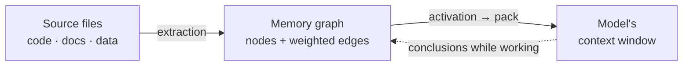

# AMG — Associative Memory Graph

**Persistent associative memory for LLM agents.** A typed knowledge graph in markdown over the filesystem: retrieval by spreading activation (BM25 seeding + Personalized PageRank), Hebbian edge weights with decay, consolidation, and a crash-safe transactional store.

> Documentation: [Theory](docs/en/THEORY.md) · [Architecture](docs/en/architecture/README.md) · [Guide](docs/en/GUIDE.md) · [Install](INSTALL.md) · [Roadmap](docs/en/architecture/11-roadmap.md) · Русский: [README_RU.md](README_RU.md)

> ⚠️ **TESTED ON CLAUDE CODE ONLY.** The installer can also set the memory up in other agent environments: **Codex** — with skills and TOML subagents (`--env codex`, the `.agents`/`.codex` directories); other AGENTS.md agents (Qwen Coder, etc.) — via a portable skill-less block (`--env generic`). But **functionality and stability on any non-Claude-Code environment are NOT yet tested or guaranteed** — all testing so far was on Claude Code. Verifying these environments is a separate roadmap stage still ahead.

## What it is

Every language model today shares one architectural limitation: it remembers nothing between sessions, and its working memory — the context window — is finite, so when it overflows or the session ends, the accumulated context is lost. AMG lifts that limitation with an external long-term memory: **a graph of note-nodes joined by typed, weighted edges**, from which what is needed is fetched by **spreading activation along those links**. The graph lives as ordinary files on disk.

And this memory needs virtually no manual upkeep — it looks after itself. The graph installs itself on a single request to the model and builds itself too, continuously reconciles its nodes and links against the current state of the files, recovers from failures, saves your dialogues with the model and enriches the knowledge with their conclusions, while consolidation keeps it fresh: merging duplicates, resolving contradictions, compacting the overgrown. Your part is the ordinary work on the project; the memory keeps pace on its own.

The idea is to take the best of two familiar approaches and sidestep their weaknesses. **RAG** (retrieval-augmented generation) can automatically find and inject what's relevant into the window, but it does so as a flat top-k: it answers multi-hop questions poorly — the ones whose answer must be assembled from several sources — and accumulates nothing across queries. A **hand-kept wiki** (in the spirit of Andrej Karpathy's llm-wiki) gives human-readable linked pages and explicit structure, but needs manual upkeep and drifts away from the source over time. AMG keeps RAG's automation and the wiki's human-readable structure, but retrieves differently: not by flat similarity, but by **spreading activation along the links** — so the window receives a relevant *neighborhood* of the graph (the node you need together with its context), not a scatter of look-alike fragments.



**The consolidated memory AMG builds is for more than code.** You can feed it **any** information from text files: source code, documentation and notes (Markdown, reStructuredText), plain text, data (JSON/YAML/NDJSON, CSV tables), logs, chat exports, and binary documents — PDF, DOCX, XLSX, PPTX (via optional pure-Python libraries). Each file's type is detected automatically and routed to the right chunker: code by functions, documents by headings, JSON by records (deep nesting is split recursively), logs by episodes, chat by messages. **Python is parsed natively** — by the `ast` module, along its structure (module → classes → functions, with imports and calls), not as flat text; other languages (`.js`, `.ts`, `.php`, `.c`, `.cpp`, `.go`, `.rs`, `.java`, `.rb`, and more) get the same function-level granularity through the optional `tree-sitter`. So one memory holds a codebase's architecture, your text notes, third-party documents, and dumped dialogues alike — linking them into a single graph.

**What sets AMG apart among LLM memory systems:**

- **retrieval by neighborhood, not flat top-k** — Personalized PageRank assembles multi-hop answers that vector search cannot reach, and the advantage is measured by a built-in harness (the hop-recall metric), not merely claimed;
- **two planes** — everything derivable deterministically is done by code (structure, storage, retrieval), the model is spent on meaning only: building and upkeep cost an order of magnitude less than "everything through the LLM" designs;
- **a human-readable canon** — the graph lives as plain markdown files: git, grep, and your editor work with no special tooling, and the memory can be diffed, versioned, and inspected by eye;
- **crash safety** — a write-ahead journal and atomic transactions: an interruption at any point recovers by itself, and an interrupted build resumes where it stopped;
- **a trust layer** — every fact knows its origin and confidence, a code claim is checked against the live source before it is answered, and contradictions are arbitrated by source reliability rather than silenced;
- **selection into memory by value of information** — what gets promoted into long-term knowledge is decided by an auditable salience rubric (novelty, decisions and commitments, bridging, provenance), not a black box: capture stays cheap and broad as you work, selection happens later at consolidation, and the threshold sits on promotion, not deletion;
- **experience transfer by analogy** — a recurring approach, fix, or mistake is generalized into a pattern node linked to its concrete cases: a new similar case surfaces not just the examples but the lesson itself — "we've solved something like this before, this way";
- **dialogue is memory too** — decisions and conclusions from the conversation are captured as notes along the way, the session transcript is dumped automatically, and a digest of the key standing decisions and open questions loads into every session before the first retrieval;
- **reproducible, economical building** — summaries written once restore verbatim from a cache, each unit's text is handed to the builders inside the assignment, and trivial units are summarized by code with no model; every worker records its output in durable checkpoint parts, so an interruption costs minutes of work, never the batch;
- **quality as a number, not a feeling** — recall and graph connectivity are measured by built-in metrics, and compaction passes an automatic recall guard;
- **controlled, reversible forgetting** — memory is compressed only past a branch budget, with originals archived;
- **portability** — the installer deploys the right mechanism per environment (Claude Code, Codex, other AGENTS.md agents; see the warning above), with a 3D graph viewer and a team mode included.

## How it works

**Two planes.** All deterministic work is done by Python scripts: they parse source files into units, store the graph transactionally, and compute retrieval and consolidation — cheap, exact, no model required. On top of that runs a judgment layer — subagents (isolated instances of the model) that add meaning: they write node summaries, attach semantic edges, and estimate salience. The boundary between the planes saves the key resource — tokens: expensive semantic work runs only over the units that actually *changed* (each matched by a content hash) and receives their text right inside the assignment (sources are never re-read), summaries written once are restored verbatim and for free on a rebuild, trivial units are summarized by code with no model at all, and the structural skeleton — calls, imports, containment, inheritance — is rebuilt by code at any time, exactly and with no model. Cross-domain connectivity (document ↔ code ↔ example) is completed by a separate global linking pass over the summary layer, and build quality is a number — a built-in connectivity report.

**A graph, not a tree.** The directory tree encodes only the part/section relation (`part_of`) — a spanning tree for browsing and a namespace. Every other link lives as an **explicit typed, weighted edge** in the frontmatter (the YAML header at the top of a markdown file). So the graph is independent of folder layout, survives renames, and works with git, grep, and editors without extra tooling.

**Retrieval — per request, driven by the model itself.** Before taking on a task — and every time the focus shifts mid-conversation (a new requirement, a different subsystem) — the model assembles a compact context pack from the graph rather than loading the whole project. That is, retrieval happens not once at session start but before each task, initiated by the model as it reasons. A complex, multi-part request is **decomposed**: each distinct topic gets its own retrieval as the model turns to it, and the retrieved branches of the graph together form the task's context. The graph is the **primary source** — everything it can give is taken from it first (sources are opened point-wise from the pack's `path:line` pointers), and only then does the model decide what remains to be searched in the files directly. The mechanism is **query-biased Personalized PageRank**: the query is seeded lexically (BM25) and, optionally, semantically (embeddings), and activation then spreads over the structural edges. Those edges are **query-independent** — and that is what preserves multi-hop reach: activation mass flows *through* a node that is itself irrelevant to the query toward a relevant neighbor ("bias, don't gate").

**Tiered assembly and an output ceiling.** Activated nodes are packed greedily by abstraction tier under a token budget: *strategic* (hubs and overviews, ≈4000 tokens), *tactical* (relevant modules, ≈10000), *operational* (the leaf nodes in focus, in full, ≈24000), and a *periphery* (a link list to the next ring of neighbors). This is a **ceiling per query, not a mandatory load**: only the activated neighborhood is actually pulled in, so simple queries stay cheap while complex ones get everything relevant. The tier budgets are configurable in `config.yml`.

**Graph growth and forgetting.** The graph itself grows without bound — it is never loaded into the window whole. But to keep retrieval sharp, each branch (a hub's subtree) has its own budget: by default ≈400 nodes or ≈200000 tokens (whichever is hit first). When a branch outgrows it, **staged compaction** kicks in: fold stale episodes into one summary → merge near-duplicates → introduce an intermediate sub-hub → as a last resort, shorten the least valuable. Compaction stops the moment the branch is back under budget, **archives the originals** (forgetting is reversible), and never touches the protected first — decisions, ADRs, and highly connected nodes. The result is a controllable analogue of forgetting unimportant detail while preserving the gist (details — [theory, §10](docs/en/THEORY.md)).

**Capture cheaply, select later.** During a session, decisions, conclusions, open questions, and plans are filed through a safe note API (never by hand-editing nodes). Weighting, merging, compression, and forgetting happen in a separate **consolidation** step, once the full context is available. This mirrors how human memory works (the complementary learning systems theory): a fast, broad capture now; a careful integration into long-term memory later.

**Crash safety.** The truth is the files on disk; the graph is their recoverable projection. Every write goes through a write-ahead journal with declarative redo under a single-writer lock; an interruption at any point — a crash, a closed terminal, a `/clear` — recovers, and re-reconciliation is idempotent: a re-run over unchanged files neither writes nor loses anything. After an unexpected crash nothing is corrupted or lost: the graph heals itself on the next start (even after a hard kill), conclusions filed along the way survive as their own transactions, and an interrupted build resumes where it left off — already-processed nodes are not duplicated (details in the [guide](docs/en/GUIDE.md), "Recovery from failures").

## Conservative defaults

Memory is tuned cautiously, in a "quality first" spirit:

- **Hebbian weight learning is off** (`weights.apply_hebbian: false`). The blind reinforcement rule **hurt** recall on a large sparse graph (reinforced links become "highways" that pull activation away from multi-hop nodes); the improved rule — reinforcing by the **real task outcome** rather than mere co-display — already **raises** recall on the same graph, but the default stays off until the uplift is confirmed on real usage. When to enable — see the [guide](docs/en/GUIDE.md); details — [theory, §8](docs/en/THEORY.md).
- **Compaction is idle by default** — it compresses nothing while a branch is within budget; when it does compress, it passes an automatic recall check (an eval guard measures recall on a graph clone before and after and rejects a drop) and archives the originals.
- **Embeddings are optional, light enrichment** over BM25, not a replacement; with no backend installed, retrieval stays purely lexical.
- **Semantic enrichment is eager** (`derivation: eager`): summaries and semantic edges are built for every node right at build time, so the memory is complete from the first query. The lazy mode (`lazy`) — build only the structural map up front and finish detail on first touch — exists as an explicit choice for very large graphs queried in small part; on an ordinary project it buys nothing (see the [guide](docs/en/GUIDE.md)).

## Installation

The engine (`agents/` + `skills/` + the activation block) installs **locally** (into a single project's `<project>/.claude/`) or **globally** (one engine for all projects, in `~/.claude/`); the **graph is always local** — it lives in `<project>/.claude/amg/`, because memory belongs to a specific project. You install **from the unpacked AMG folder, kept outside the project** (the engine is copied into the agent directory, so the source folder is not needed afterwards); a global install additionally sets up a global config of personal defaults (`~/.claude/amg/config.yml` — model tiering, embeddings) that each project's local config inherits per key. The entry point is the root `CLAUDE.md`: the AMG block is appended to its end between the markers `<!-- AMG:BEGIN -->` and `<!-- AMG:END -->`, your instructions stay above it, and a reinstall replaces only the block. Memory is turned on by the presence of `.claude/amg/config.yml` with `active: true`. The names `.claude`/`CLAUDE.md` are the Claude Code defaults; other environments substitute their own (for Codex — `.agents`/`AGENTS.md`, see "Other environments" below).

**1. Dependencies.** You need Python 3. The one mandatory dependency is `pyyaml`; everything else is optional (embeddings, PDF/DOCX/XLSX extraction, tree-sitter) and installed as needed:
```bash
python3 -m pip install pyyaml                  # mandatory
python3 -m pip install -r requirements.txt     # everything optional at once (if you like)
```

**2. Installation — two ways.** Both do the same thing; pick whichever suits you. Unpack AMG into any folder **outside the project** — the engine is copied during the install, and the source folder is not needed afterwards.

*Via the model (simpler).* In a session inside your project, say:

> **install AMG per `<path-to-AMG>/INSTALL.md`**

The model reads the instructions, surveys the project and proposes a folder classification (what to mirror, what to absorb, what to exclude), asks the full question list one by one (local/global; environment; mirror and absorb paths; excludes; working language; embeddings; automation; session policy; budgets; dependencies; activation), shows the existing settings on a reinstall — and calls the installer for you. Two questions are key and worth deciding before the first build: the **working language** (a later change re-summarizes nothing by itself — summaries and the cache are keyed by language) and **embeddings** (the build-time linking pass finds cross-domain links by their vectors). Everything else is safe to adjust in `config.yml` at any time — changes apply on the next run; see [INSTALL.md](INSTALL.md), "Cheap to change later vs decide before building".

*By command.* If you'd rather set everything yourself (run from the AMG folder):
```bash
python install.py --target /path/to/project --scope local \
    --mirror src,doc --absorb data \
    --set working_language=ru --set active=true
```
The full list of flags and modes (reinstall, uninstall, `--env`, `--build`) is in [INSTALL.md](INSTALL.md).

**3. What's in `config.yml`.** The installer writes the keys for you; here are the main ones and what they mean:
```yaml
active: true                 # the master switch for memory (/amg on · off)
automation: true             # memory runs the loop and session hooks itself
working_language: ru         # the language of summaries and notes
mirror_path: [src, doc]      # live projection: you edit a file, the graph follows it
absorb_path: [data]          # ingest once (the source may be deleted later)
models:                      # model strength per role; rendered into the subagents
  discovery:      {model: haiku,  reasoning_effort: low}   # read-only classify/assemble — cheap
  module_summary: sonnet                                   # bulk summaries (they feed retrieval)
  synthesis:      {model: opus,   reasoning_effort: high}  # synthesis, gaps, judgment
retrieval:
  embeddings: {enabled: off} # semantic seeding (optional; needs a backend)
agent_dir: .claude           # the environment's directory (.agents for Codex, etc.)
entrypoint: CLAUDE.md        # the entry-point file (AGENTS.md for other envs)
```
A `model` is not limited to the aliases: it is any string your environment accepts — a pinned identifier (`claude-opus-4-8`) or another provider's model (`gpt-5.5`) when the environment points at a gateway/Bedrock/Vertex; AMG passes it through and does no provider routing of its own. Note also that the install flow asks only the most important parameters — for full control over the rest (weights, compaction, batch sizes, the viewer, thresholds) the simplest way is to **edit the template `<amg-dir>/config.yml` beforehand**: the installer writes the project config from it — or to edit `<project>/.claude/amg/config.yml` after the install. Config edits take effect in three classes, and none needs a session restart: **most keys** (tier budgets, thresholds, weights, batch sizes, `automation`, `active`) act from the next operation — every run reads the config afresh; **`working_language` and embeddings** are decided before the first build, and changing them afterwards means `/amg sync` (a language change — a full re-derivation); **`models`, `agent_dir`, `entrypoint`** take effect through a reinstall — the installer renders them. The full reference for every key — [09-config](docs/en/architecture/09-config.md).

**4. Activation ≠ building the graph.** `/amg on` (or agreeing during install) only raises the `active` flag; the graph is built by the loop in a **new session** — before the first task (with `automation: true`) or via `/amg sync`. Restart the session after the install: the environment registers skills and the `/amg` command at session start. To have the structural skeleton ready at once, build during install (`--build`).

**5. Other environments (`--env`).** Portability is more than renaming a folder: slash commands, hooks, and the digest `@`-import are Claude Code mechanisms, so the installer deploys a different mechanism per environment:
- **Codex** (`--env codex`) — with skills and **TOML subagents** in `.codex/agents` (with a per-role `model` and reasoning effort from the `models` block), a skill-aware `AGENTS.md` block, and no Claude hooks or command;
- **other AGENTS.md environments** (`--env generic`, e.g. Qwen Coder) — a portable block **with no skills**, the same loop via direct script calls (the model reads `agents/*.md` as guidance).

Baseline functionality does not depend on the environment; the set of conveniences does. **These modes are untested** on any non-Claude-Code environment so far — all testing was on Claude Code (verifying them is a separate roadmap stage still ahead).

**Updating the engine — without losing the graph.** A new version installs the same way the first one did: unpack the fresh AMG into any folder **outside the project** and run a reinstall — with `python install.py --target /path/to/project`, or in words: "reinstall/update AMG per `<path-to-AMG>/INSTALL.md`". A reinstall is idempotent and **never touches the graph**: only the `amg-*` skills and agents, the activation block between its markers, and the hooks are updated; your `config.yml` is never overwritten — the installer shows the values in force on its `in force:` line. After the update, restart the session and run `/amg sync`: it brings the graph up to the new version cheaply — the unchanged costs not a token, and deterministic-layer improvements (link repair, for example) apply by themselves, with no rebuild.

## First run and the build

From install to memory's first answer is a couple of steps; no manual scripts — the model does the work itself.

**YOU MUST RESTART THE SESSION** after the install — this is a requirement, not a tip. Skills and the `/amg` command register only at session start: in the installing session they do not work, and any build attempted there would run not through the standard pipeline but as the model's improvisation — without the batching and checkpoint discipline such a graph cannot be built properly. Do not start the build before the restart, by command or by request; the install itself is already complete and intact.

**Check.** In the new session, look at the state and meet the commands at the same time:
```
/amg status
```
One screen: whether memory is active, graph size, queue, recent operations. Every operation is available through the single `/amg <verb>` command — or the same words in an ordinary request.

**Build.** The main one-time step: **`/amg sync`** (the words "build / sync the memory graph") runs the full first build — the structural skeleton, the summaries, the hubs, and the linking pass. With `automation: true` the loop starts it by itself before the first task. From then on `sync` is incremental: it finds the files changed since last time and **finishes them itself** — refreshes the skeleton, re-summarizes the changed units, completes the links; the unchanged is untouched and costs not a token.

**The cost of the first build.** The full first build is the memory's most expensive operation: on a real project of about a megabyte of sources the count runs to millions of tokens (mostly cheap cache reads — but plan limits count those too), and hitting a limit is routine. What makes it cheaper:

- **run the build session on an inexpensive environment model** — the main session only coordinates (prepares batches, spawns the workers, applies results), yet every one of its turns re-sends its whole context, and in a field measurement it accounted for about two thirds of the total spend; lowering *this* session's model does not touch summary quality — summaries are written by the subagents with their own models from the `models` block;
- **model tiering** (`config.yml → models`): the `discovery` and `module_summary` roles go cheaper, `synthesis` stays strong; do not lower `module_summary` without measuring — its summaries feed retrieval;
- **batch sizes** (`builder.batch_units`, `linker.batch_nodes`) are already tuned near the optimum — larger batches save almost nothing (the overhead is already amortized) while the cost of losing an interrupted batch grows;
- **`derivation: lazy`** — start working sooner: only the structural map is built up front and detail is finished as it is touched, but that finishing spreads across working sessions (see the [guide](docs/en/GUIDE.md)).

**Work.** From here, **just ask the model questions about your project** — it assembles the right context from the graph itself (the strategic surround plus the specifics) and files conclusions as it goes. Memory upkeep: the deterministic half (signal folding, the digest, the transcript dump) is done by the hooks at every session's start and end; the judgment half — selecting conclusions into long-term memory, merging duplicates, compacting overgrown branches — is run by the loop at the end of work, and manually by **`/amg consolidate`**.

## Sources: mirror and absorb

What feeds memory is listed in `config.yml` under two keys; each file's type (code / doc / data) is detected automatically — you don't name folders. The difference between the keys is intent:

- **`mirror_path` — what you edit** (code, docs you maintain). The graph is kept as its **live projection**: file added → node, changed → node updated, removed → node purged. The source stays the single source of truth, and the graph holds a summary and a pointer to it (`path:line`), not a verbatim copy.
- **`absorb_path` — one-off material you don't edit** (chat logs, data dumps, third-party documents). It is **ingested once** into independent nodes, and deleting the source does not erase the knowledge — what was absorbed no longer depends on it. This key is **optional**: you can run mirrors only.
- **`absorb_once_path` — a one-off snapshot you don't want re-synced.** Exactly one thing separates it from `absorb_path`: while the absorbed file sits on disk, `absorb` keeps **re-reconciling its changes** (like a mirror), whereas `absorb_once` tracks nothing — ingested once and **frozen**, later edits to the file never reach the memory. Deleting the source erases the knowledge in neither case. For a report, log, or export pinned to a moment in time while the file itself lives on.

**A trick for important material.** Absorption keeps a distillate (the gist, not every word), so if you delete an absorbed source only the summary remains. When you need guaranteed access to **all** the detail, declare the material a **mirror** even without editing it: the graph then holds summaries and pointers, while the full text is always reachable via the link in the file itself (the price: the source must stay on disk). This is especially useful for valuable conversations — keeping them as a mirror is safer than absorbing them.

**What gets ignored.** Three git-independent layers filter what enters the graph: the built-in list (caches, dependencies, the agent dir), the repo's `.gitignore` (honored faithfully, the way git itself reads it — `!` re-include rules included; toggled by `respect_gitignore`), and config globs — the **global `exclude`** plus the per-intent `mirror_exclude` / `absorb_exclude`. An explicitly listed source beats `.gitignore`. Details — in the [guide](docs/en/GUIDE.md).

## Saving sessions

A conversation with the model is memory too: decisions and conclusions that surface in the dialogue would be lost on `/clear`. So at the end of a session the `SessionEnd` hook dumps the transcript to `<store>/sessions/YYYY-MM-DD-HHMM.md` — the turns' text with role markers, **with the model's raw thinking cut out**; tool calls and attachments are not reproduced but marked — one numbered marker each. The dump is then ingested like any other source.

A dialogue reaches the memory in three steps: the `SessionEnd` hook writes the transcript when the session closes normally; it becomes graph nodes on the **next** `sync` (the loop runs one at the start of the new session); consolidation then selects what of it deserves long-term memory. A hard kill — a killed terminal, a severed process — leaves no dump: the insurance for that case is the notes captured along the way; a session closed normally (including right before a rate limit) gets its transcript.

The write policy is set by the **`session_policy`** key — the same one sources use: `absorb` (the default) takes the dialogue in as a distillate (the dump file may be deleted later and the summary stays), while `mirror` keeps it as a live projection (nodes live as long as the file does, so any detail stays retrievable in full — the trick for valuable conversations). The folder defaults to `<store>/sessions` and is correct under any agent directory.

The automatic dump relies on Claude Code's hook and transcript format; in an environment without the hook, capturing notes as you go (`notes.py`) takes its place — and that is the portable "don't lose the dialogue" guarantee in any environment.

## Modes and control

How much memory does on its own is set by the `automation` key in the config (on by default):

- **automatic mode** (`automation: true`) — memory runs itself: the `SessionStart`/`SessionEnd` hooks (a Claude Code mechanism) deterministically heal the graph after crashes, fold weights, and dump the session transcript, while the model's loop gathers context before each task, files conclusions along the way, and runs consolidation at the end;
- **manual mode** (`automation: false`) — memory does nothing on its own, only on a command or an explicit request.

Who starts which operation, and when (note: hooks do only the deterministic steps — a hook cannot spawn a subagent):

| Operation | Started by | When |
|---|---|---|
| Crash recovery | the `SessionStart` hook; manually — `/amg repair` | every session start |
| Build / reconcile (`sync`) | **the model's loop** or a command — a hook does **not** run it | the first build once; then at session start when sources changed |
| Context pack (`retrieve`) | the loop before a task; manually — `/amg retrieve` | before each task and on a focus shift |
| Consolidation, the deterministic half (weight folding, digest, transcript dump) | the `SessionEnd` hook | every session end |
| Consolidation, the judgment half (selection into long-term memory, duplicate merging, branch compaction) | the loop at session end (before `/clear`/exit); manually — `/amg consolidate` | session end / on request (a focus shift does NOT trigger it — that only re-runs retrieval) |

In environments without hooks (Codex, the generic mode) the two "hook" rows are also driven by the model's loop — by the activation block's discipline under `automation: true`. On rate limits: hooks are plain scripts with no model — they spend no tokens and cannot hit a plan limit, so on a normal session close the deterministic half always runs, even with the limit exhausted. The judgment half is model work: with the limit gone, the loop simply cannot run it — and that is safe: the notes are already committed transactionally, the hook has done the dump and the weights, and the selection is non-destructively deferred to `/amg consolidate` in any later session.

**`sync` and `consolidate` own different axes — and neither calls the other.** `sync` keeps the graph equal to the **sources**, and that is not "structure only": a content change in a file at the same path is caught by the content hash, the node is updated, its summary is re-derived, its links are completed — `sync` finishes the whole semantics of what changed (summaries, hubs, linking) by itself, needing no consolidation for it. `consolidate` maintains the **memory itself**, regardless of the project files: it folds the accumulated usage signals into weights, selects the dialogues' conclusions into long-term memory, merges duplicates, compacts over-budget branches, arbitrates contradictions. It changes nodes and edges too — but its input is not the sources, it is the accumulated experience of working with the memory (the logs, the notes, the overgrown branches). The short formula: `sync` is "graph ↔ files", `consolidate` is "graph ↔ its own experience".

All control goes through one `/amg <verb>` command (and the same words in an ordinary request: the model matches intent and synonyms, not the exact verb; a verbal request counts as a memory operation only when it explicitly names the memory, the memory graph, or AMG):

| Command | Action |
|---|---|
| `/amg status` | state on one screen: active flag, automation, graph size, `stale`, pending operations, lock, queue, last pack and last consolidation |
| `/amg on` · `off` | enable / disable AMG |
| `/amg repair` | restore consistency with disk (`recover` + `verify --repair`) |
| `/amg sync` | build or reconcile the graph with the sources |
| `/amg retrieve <query>` | assemble a context pack |
| `/amg consolidate` | fold weights, file conclusions, compact over-budget branches |
| `/amg view` | open the 3D graph viewer — an offline HTML, read-only (the words "open / show the memory graph", "visualize the memory") |

Control verbs (`status`/`on`/`off`/`repair`) are run by a helper script; work verbs (`sync`/`retrieve`/`consolidate`) delegate to the dedicated skills (also invocable directly); `view` is a direct run of the exporter, no model involved. Every automatic operation has such a manual counterpart. Note: `on` only enables memory — **the graph is built by `sync`**. `on`/`off` write the `active` flag straight into the config and take effect **immediately**, no session restart — handy for switching the memory off over a run of simple tasks and back on. A single task can bypass the memory with plain words too ("skip AMG for this one") — the loop obeys a direct request.

**A digest in every session.** The loop's main failure is "the memory exists but was never consulted." So consolidation keeps a small `digest.md` next to the entry point — 5–10 of the most salient decisions and open questions — loaded into **every** session: the essentials are visible at once, before the first retrieval.

> The `SessionStart`/`SessionEnd` hooks, the `/amg` slash command, and the digest `@`-import are Claude Code mechanisms; in other environments what gets deployed depends on the `--env` chosen at install (Codex / generic) — see "Installation", "Other environments."

## 3D graph viewer

You can open the memory's structure as a **self-contained, offline HTML page** with a 3D visualization — by the command below, the `amg-retrieve` skill, `/amg view`, or the words "open the memory graph":

```bash
python .claude/skills/amg-retrieve/scripts/export_graph.py --store .claude/amg --open
```

This is a working diagnostic instrument, not a showpiece — always one command away when you want to *see* your memory. What it lets you spot:

- **the project at a glance** — the hubs and key nodes with their links; thematic clusters stand apart in color, node size reflects connectivity (hubs read large), edge thickness the link strength;
- **the health of the knowledge — by status highlighting**: `disputed` (amber) — an open contradiction, two claims disagree and deserve a ruling; `rejected` (red) — a claim found false; `superseded` (gray) — displaced by something fresher; `stale` (dimmed) — the summary may lag a changed source. Contested and outdated knowledge is found by eye in seconds;
- **build problems — literally by the graph's shape**: an island floating away from the main graph; an isolated node with no links at all; a documentation cluster hanging apart from the code it should describe. Each is a linking gap that a re-run of `/amg sync` closes. Dangling (broken) edges are not drawn — they surface exactly as islands and loners, and their precise count is the `connectivity` line of `/amg status`.

**The legend** — node color follows the **content** category, not the project's folders and not the source policy:

| Color bucket | What it holds |
|---|---|
| code | functions, classes, modules — tests are code too, whatever folder they live in |
| docs | document sections (an absorbed markdown is a doc, not "data"); session dialogues land here as well |
| data | structured records: JSON/YAML, CSV/XLSX sheets |
| notes | authored captures — decisions, conclusions, open questions, plans |
| hubs | the synthesized strategic layer — overviews and topics |

The file is self-contained — the graph data and the visualization library are inlined — so it opens by double-click, with no server and no internet, **read-only**. Also on board: rotate/zoom/pan and a click-open side panel (summary, frontmatter, edges); **filters** by type, status, and bucket and **search** by id and summary; **cluster coloring**; a **large-graph mode** — start from the hubs and expand on click, so a big graph never becomes a hairball or stalls; adjustable render **quality** and a **light/dark theme**. Behavior is set by the `viewer` block in `config.yml` (the large-graph threshold, quality, hiding weak edges, and a pass-through to the library). Besides the viewer, `--json` exports the graph for external analysis tools. Full detail — the [guide](docs/en/GUIDE.md) and the [config reference](docs/en/architecture/09-config.md).

## Team work

You can run the memory as a team without complicating the single-user mode. The graph is plain markdown files, so you can share it two ways, and AMG only **reads** the project's existing git (the memory keeps no version control of its own):

- **A shared folder** — one graph on a shared or synced disk: writes are serialized by a single lock (turn-taking, low concurrency), reads are lock-free. The lock is host-aware and never steals a teammate's live lock from another machine; while the lock is held, automatic upkeep skips gracefully instead of crashing.
- **The graph in git** — keep the canon (`nodes/*.md`, `config.yml`, `digest.md`) under git, and each branch carries its own memory: `git checkout` swaps the nodes, and merging branches is an ordinary git merge of markdown. A conflict in a single node does not break the graph (that node is skipped for now) and is surfaced by `/amg status` and `/amg repair`; once you resolve it, `/amg sync` rebuilds the graph. After a `git pull`, `verify_claims --by-commit` cheaply shows which nodes went stale by git history.

`/amg status` shows the current branch and commit, and every fact records the commit it was ingested at. Comparing memory between branches is read-only (a `git diff` of the nodes, or `export_graph --json` on two branches). For the detail — the recommended `.gitignore` and a frank rundown of the mode's limits — see the [guide](docs/en/GUIDE.md), section "Team work".

## Optional dependencies

The base path runs on the Python standard library; anything missing is **skipped gracefully**, never a crash:

| Capability | Install | Default model / behavior |
|---|---|---|
| Code in other languages (functions + call edges) | `pip install tree-sitter tree-sitter-language-pack` | Python works via the stdlib `ast`, no dependency |
| PDF / DOCX / XLSX extraction | `pip install pypdf python-docx openpyxl` | without the library, the file is skipped |
| Semantic seeding, light (static) | `pip install model2vec` | `potion-retrieval-32M` (en) / `potion-multilingual-128M` (non-en) |
| Semantic seeding, transformers | `pip install sentence-transformers` | `all-MiniLM-L6-v2` / `paraphrase-multilingual-MiniLM-L12-v2` |

For **non-English projects** the engine picks a multilingual default model on its own — just install a backend and enable seeding.

## What's implemented

The memory mechanism is implemented in full — from the store to the trust layer:

- **Store** — a transactional file core: atomic writes, a write-ahead journal, crash recovery, a single writer lock.
- **Ingest** — a type classifier and a broad set of chunkers: code (Python natively, other languages via tree-sitter), Markdown/RST, plain text, JSON/YAML with recursion, NDJSON, CSV, logs, chat exports, PDF/DOCX/XLSX/PPTX; the `mirror` / `absorb` / `absorb_once` source policies.
- **Graph building** — a deterministic edge backbone (calls resolved across files, containment and inheritance extracted by code), a global semantic linking pass across domains, an apply step resilient to malformed items, and an acceptance connectivity report; the derivation cache makes a rebuild verbatim and nearly free.
- **Build economy and resilience** — each unit's text travels to the builders inside the work queue (sources are never re-read), trivial units are summarized by code with no model call, the global passes work from prepared one-file inputs, and every worker — the builders, the linker, the synthesis pass — writes its output in checkpoint parts applied in one batched call; an interrupted build resumes where it left off, and agents report status and progress honestly. The savings come from eliminating repeated work, never from thinning the meaning.
- **Retrieval** — BM25 seeding + optional embeddings + Personalized PageRank + a tiered pack under a token budget.
- **Consolidation** — weight folding, the salience rubric, staged compaction under an eval guard, safe note capture as you work.
- **Trust layer and arbitration** — provenance and confidence on every fact; code claims checked against the live source, with unverified, stale, and contested nodes flagged in the pack; contradictions resolved by source reliability, freshness, and confidence rather than query frequency (non-destructive verdicts, a visible audit trail, intent-driven surfacing of retired and disputed facts); usage provenance accumulates as an honest substrate for weight learning, and the improved rule reinforces edges by the real task outcome, not blind co-activation.
- **Lifecycle** — session hooks, the single `/amg` command, `automation` modes, an always-on digest; the session transcript auto-dumped with a write policy.
- **Installation** — `install.py`: local and global, reinstall and uninstall, portability across the agent directory and environments (Claude Code / Codex / other AGENTS.md environments), two configuration layers.
- **Performance** — a generated read-index under retrieval on large graphs, subagent model tiering, speed benchmarks.
- **Advanced semantic layer** — project-local pattern nodes (architectural pattern, recurring fix, anti-pattern, migration recipe — transferring experience and analogies within the project) and optional lazy derivation for very large, sparsely-queried graphs (off by default, `derivation: eager`).
- **A 3D graph viewer** and **team work** (a shared folder and an optional graph-in-git) — covered in their own sections above.

Version 1.0 fixed a stable data schema and a working install; later releases are additive or come with a migration (under SemVer, breaking the data contract without a migration would be a MAJOR bump).

## License

AMG is licensed under the **PolyForm Strict License 1.0.0**: noncommercial use is free, but with **no modification, derivative works, or redistribution**; any **commercial** use, as well as any modification or derivative works, requires a separate license from the author (`reghost200@gmail.com`). The software is provided "as is" and used at your own risk. Full text and terms — [LICENSE](LICENSE).

## Documentation map

- [Theory](docs/en/THEORY.md) — the rationale: memory, associative retrieval, plasticity.
- [Architecture](docs/en/architecture/README.md) — how it's built in code: modules, data formats, algorithms, configuration.
- [Guide](docs/en/GUIDE.md) — how to use every capability.
- [Install](INSTALL.md) — install with the installer (model-driven or by command), reinstall, uninstall.
- [Roadmap](docs/en/architecture/11-roadmap.md) — what's implemented and what's ahead.
