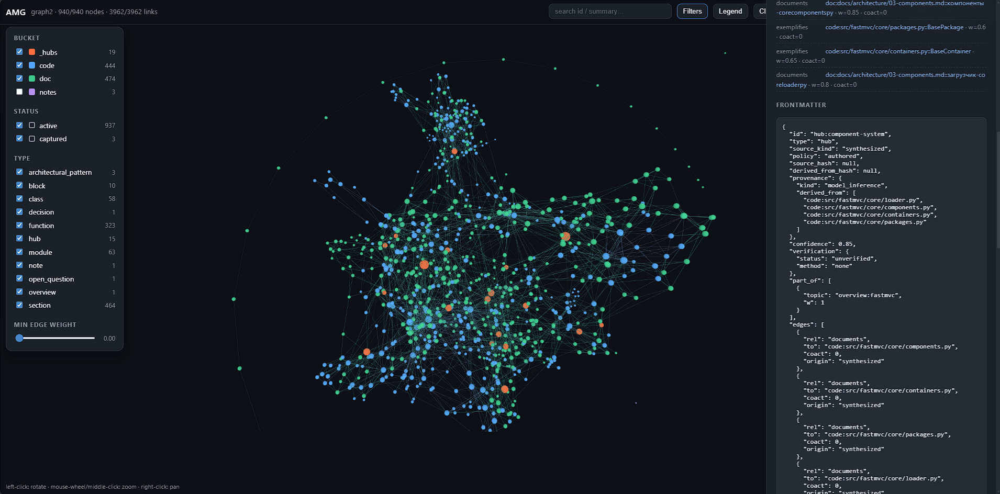
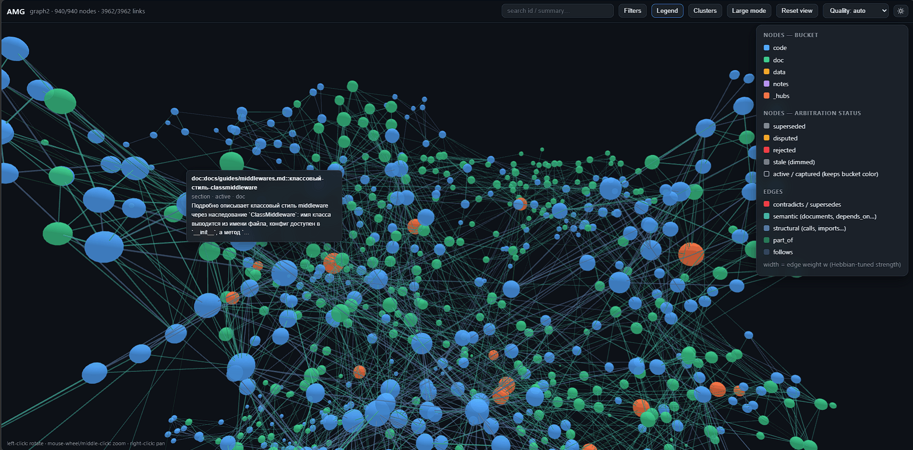
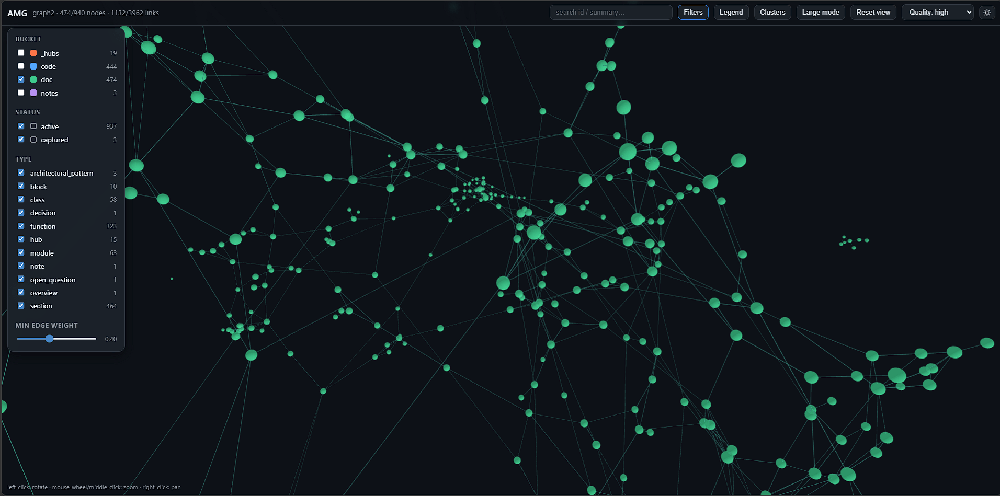
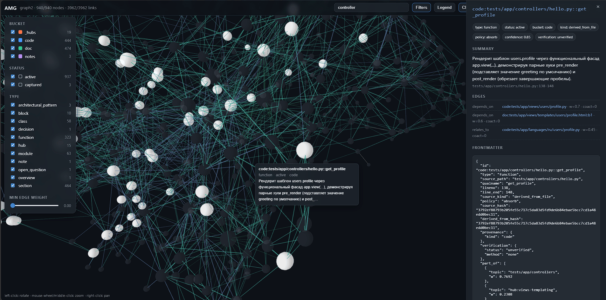
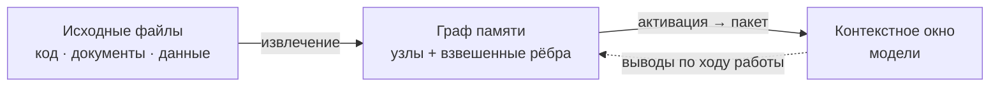

# AMG — Associative Memory Graph

**Постоянная ассоциативная память для LLM-агентов.** Типизированный граф знаний в markdown поверх файловой системы: извлечение через распространение активации (засев BM25 + Personalized PageRank), хеббовы веса с затуханием, консолидация и устойчивое к сбоям транзакционное хранилище.

> Документация: [Теория](docs/ru/THEORY.md) · [Архитектура](docs/ru/architecture/README.md) · [Руководство](docs/ru/GUIDE.md) · [Установка](INSTALL_RU.md) · [Дорожная карта](docs/ru/architecture/11-roadmap.md) · English: [README.md](README.md)

⚠️ **ПОЛНОСТЬЮ ПРОВЕРЕНО В CLAUDE CODE; OPENCODE ПОДТВЕРЖДЁН ЖИВЫМИ ПРОГОНАМИ.** Установщик ставит память под каждую среду своим режимом: **OpenCode** (скиллы находятся средой сами + субагенты + событийный плагин) — полный цикл памяти; **Codex** (скиллы + TOML-субагенты + хуки через `/hooks`), **Qwen Code** (скиллы + субагенты + сессионные хуки) и **неизвестная AGENTS.md-среда** (`generic`, переносимый блок без скиллов) — собраны по проверенным поверхностям этих сред.

<div align="center">

[](docs/images/img1.png) &nbsp;&nbsp;&nbsp;&nbsp; [](docs/images/img2.png)

[](docs/images/img3.png) &nbsp;&nbsp;&nbsp;&nbsp; [](docs/images/img4.png)

</div>

> [DONATE - Стать спонсором](https://donate.trybit.com/OBWAHQDQ)

> Или поделитесь ссылкой на проект со своими друзьями и коллегами. Любая помощь и обсуждения в сети говорят, что усилия на создание и разработку AMG были затрачены не зря. Автор благодарит вас за поддержку.

## Что это

У всех сегодняшних языковых моделей есть общее архитектурное ограничение: между сессиями они не помнят ничего, а их рабочая память — контекстное окно — конечна по объёму, и при переполнении или завершении сессии накопленный контекст теряется. AMG снимает это ограничение внешней долговременной памятью: **графом узлов-заметок, связанных типизированными взвешенными рёбрами**, из которого нужное достаётся **распространением активации по этим связям**. Граф лежит обычными файлами на диске.

И эта память практически не требует ручного обслуживания — она следит за собой сама. Граф сам устанавливается по одной просьбе к модели и сам же строится, постоянно сверяет узлы и связи с текущим состоянием файлов, восстанавливается после сбоев, сохраняет ваши диалоги с моделью и обогащает знание их выводами, а консолидация держит его свежим: сливает дубли, разрешает противоречия, сжимает разросшееся. Ваше участие — обычная работа над проектом; память успевает за ней сама.

Замысел — взять лучшее у двух привычных подходов и обойти их слабости. **RAG** (retrieval-augmented generation — генерация с подключённым поиском) умеет автоматически находить и подмешивать в окно релевантное, но делает это плоским top-k: он плохо отвечает на многошаговые вопросы, где ответ нужно собрать из нескольких источников, и ничего не накапливает между запросами. **Рукотворная вики** (в духе llm-wiki Андрея Карпатого) даёт человекочитаемые связанные страницы и явную структуру, но требует ручного сопровождения и со временем расходится с первоисточником. AMG сохраняет автоматизм RAG и человекочитаемую структуру вики, но извлекает иначе: не по плоскому сходству, а **распространением активации по связям**, — поэтому в окно попадает релевантная *окрестность* графа (нужный узел вместе с его контекстом), а не разрозненные похожие фрагменты.



**Разрабатываемая консолидированная память применима не только для кода.** В AMG можно подавать **любую** информацию из текстовых файлов: исходный код, документацию и заметки (markdown, reStructuredText), обычный текст, данные (JSON/YAML/NDJSON, таблицы CSV), журналы, выгрузки переписки, а также бинарные документы — PDF, DOCX, XLSX, PPTX (через опциональные чисто-Python библиотеки). Тип каждого файла определяется автоматически, и под каждый вид подбирается свой нарезатель на единицы: код — по функциям, документы — по заголовкам, JSON — по записям (глубокая вложенность разбирается рекурсивно), журналы — по эпизодам, чат — по сообщениям. При этом **Python-код разбирается нативно** — модулем `ast` по структуре (модуль → классы → функции, с импортами и вызовами), а не как плоский текст; для прочих языков (`.js`, `.ts`, `.php`, `.c`, `.cpp`, `.go`, `.rs`, `.java`, `.rb` и других) ту же функциональную зернистость даёт опциональный `tree-sitter`. Так одна и та же память хранит и архитектуру кодовой базы, и текстовые заметки, и сторонние документы, и выгруженные диалоги — связывая их в единый граф.

**Особенно полезна такая память моделям послабее.** Сильная модель способна раз за разом восстанавливать картину проекта эмпирически — обшаривать структуру поиском и чтением, пусть и с пропусками и за дорогую цену; слабая на том же пути теряется и упускает существенное. Из графа же любая модель получает готовые объективные данные — суть каждой части проекта и её место среди остальных, — а не свои догадки по обрывкам поиска: слабой модели память возвращает ориентировку, которой ей не хватает, сильной — экономит цену повторной разведки.

**Чем AMG выделяется среди систем памяти для LLM:**

- **извлечение окрестностью, а не плоским top-k** — Personalized PageRank собирает многошаговые ответы, которые векторный поиск не достаёт, и это преимущество измеряется встроенным стендом (метрика hop-recall), а не постулируется;
- **извлечение суждением, а не только сырым контекстом** — память умеет отвечать не материалом, а выводом: копия помощника, знающая весь текущий разговор, прочитывает найденное за пределами рабочего окна и возвращает короткое заключение — что память добавляет, что подтверждает, чему противоречит; окно остаётся лёгким, а ответ учитывает разом и сессию, и граф (в Claude Code);
- **две плоскости** — всё детерминируемое делает код (структура, хранение, извлечение), модель тратится только на смысл: сборка и сопровождение на порядок дешевле подходов «всё через LLM»;
- **человекочитаемый канон** — граф лежит обычными markdown-файлами: git, grep и редактор работают без специальных инструментов, память диффится, версионируется и правится глазами;
- **устойчивость к сбоям** — журнал упреждающей записи и атомарные транзакции: обрыв в любой точке восстанавливается сам, прерванная сборка продолжается с места;
- **слой доверия** — каждый факт знает происхождение и уверенность, утверждение о коде проверяется по живому источнику до ответа, а противоречия разрешаются арбитражем по надёжности источника, не замалчиваются;
- **отбор в память — по ценности информации** — что повысить в долговременное знание, решает аудируемая рубрика значимости (новизна, решения и обязательства, связность, происхождение), а не «чёрный ящик»: захват по ходу работы дёшев и широк, отбор происходит позже, на консолидации, и порог стоит на повышении, а не на удалении;
- **перенос опыта по аналогии** — повторяющийся приём, фикс или ошибка обобщаются в узел-паттерн, связанный с конкретными случаями: новый похожий случай поднимает не только примеры, но и сам урок — «похожее уже решали вот так»;
- **диалоги — тоже память** — решения и выводы из разговора фиксируются заметками по ходу, стенограмма сессии выгружается автоматически, а дайджест ключевых решений и открытых вопросов загружается в каждую сессию ещё до первого обращения к памяти;
- **воспроизводимая и экономная сборка** — однажды написанные сводки восстанавливаются из кэша дословно, текст единиц подаётся сборщикам прямо в задании, тривиальное сводится кодом без модели; каждый исполнитель фиксирует результат долговечными контрольными частями, поэтому обрыв стоит минут работы, а не целой партии;
- **качество — число, а не ощущение** — полнота и связность графа меряются встроенными метриками, сжатие проходит автоматический предохранитель полноты;
- **забывание управляемое и обратимое** — память сжимается только сверх бюджета ветви, оригиналы уходят в архив;
- **переносимость** — установщик разворачивает механизм под среду (Claude Code, Codex, OpenCode, Qwen Code, прочие AGENTS.md-агенты; см. предупреждение выше), в комплекте 3D-просмотр графа и командный режим.

## Как устроено

**Две плоскости.** Всю детерминированную работу делают скрипты на Python: они разбирают исходные файлы на единицы, хранят граф транзакционно и считают извлечение и консолидацию — это дёшево, точно и не требует модели. Поверх работает слой суждения — субагенты (изолированные экземпляры модели), которые добавляют смысл: пишут сводки узлов, проставляют смысловые рёбра, оценивают значимость. Граница между слоями экономит главный ресурс — токены: дорогая смысловая работа выполняется только над *изменившимися* единицами (каждая сверяется по контентному хешу) и получает их текст прямо в задании (исходники не перечитываются), однажды написанные сводки восстанавливаются при пересборке из кэша дословно и бесплатно, тривиальные единицы сводятся кодом вовсе без модели, а структурный скелет — вызовы, импорты, принадлежность, наследование — перестраивается кодом в любой момент, точно и без модели. Связность между доменами (документ ↔ код ↔ пример) достраивает отдельный глобальный проход линковки по слою сводок, а качество сборки видно числом — встроенным отчётом связности.

**Граф, а не дерево.** Дерево каталогов кодирует только отношение «часть/раздел» (`part_of`) — это остов для просмотра и пространство имён. Все остальные связи живут **явными типизированными взвешенными рёбрами** во frontmatter (так называют YAML-заголовок в начале markdown-файла). Поэтому граф не зависит от структуры папок, переживает переименования и работает с git, grep и редакторами без отдельных инструментов.

**Извлечение — на каждый запрос и силами самой модели.** Прежде чем взяться за задачу — и каждый раз, когда по ходу диалога смещается фокус (новое требование, другая подсистема), — модель собирает из графа компактный пакет контекста, а не загружает проект целиком. То есть выборка идёт не один раз на старте, а перед каждой задачей, и инициирует её сама модель в ходе рассуждения. Сложный многочастный запрос **декомпозируется**: каждая самостоятельная тема получает своё обращение к графу по мере того, как модель к ней переходит, и собранные ветви графа вместе образуют контекст задачи. 

Граф — **первичный источник**: всё, что он может дать, берётся из него сначала (исходники открываются точечно по указателям `путь:строка` из пакета), и лишь затем модель решает, что осталось искать по файлам напрямую. Размер пакета тоже следует за запросом: точечный указательный вопрос («где лежит X») выполняется **компактным профилем** — указательные строки в долю полного объёма, — а вход в незнакомую подсистему получает пакет полной глубины. Механизм — **Personalized PageRank со смещением по запросу**: запрос засевается лексически (BM25) и опционально семантически (эмбеддинги), после чего активация растекается по структурным рёбрам. Эти рёбра **не зависят от запроса** — именно это сохраняет многошаговость: масса активации протекает *сквозь* сам по себе нерелевантный узел к релевантному соседу («смещать, а не запирать»).

**Сборка по ярусам и потолок выдачи.** Активированные узлы укладываются жадно по ярусам абстракции под бюджет токенов: *стратегический* (хабы и обзоры, ≈4000 токенов), *тактический* (релевантные модули, ≈10000), *оперативный* (листовые узлы в фокусе целиком, ≈24000) и *периферия* (список ссылок на следующее кольцо соседей). Это **потолок на запрос, а не обязательная нагрузка**: фактически подтягивается лишь активированная окрестность, поэтому простые запросы остаются дешёвыми, а сложные получают всё относящееся к задаче. Бюджеты ярусов настраиваются в `config.yml`.

**Рост графа и забывание.** Сам граф растёт неограниченно — целиком в окно он не грузится никогда. Но чтобы извлечение оставалось точным, у каждой ветви (поддерева хаба) есть собственный бюджет: по умолчанию ≈400 узлов или ≈200000 токенов (что превышено раньше). Когда ветвь его перерастает, запускается **поэтапное сжатие**: свернуть устаревшие эпизоды в одну сводку → слить почти-дубли → ввести промежуточный под-хаб → в последнюю очередь укоротить наименее ценное. Сжатие останавливается, едва ветвь вернулась под бюджет, **архивирует оригиналы** (забывание обратимо) и никогда не трогает защищённое первым — решения, ADR и сильно связанные узлы. Получается управляемый аналог забывания неважных деталей с сохранением сути (подробнее — [теория, §10](docs/ru/THEORY.md)).

**Захват дёшево, отбор позже.** По ходу сессии решения, выводы, открытые вопросы и планы фиксируются безопасным API заметок (а не правкой узлов руками). Взвешивание, слияние, сжатие и забывание выполняются отдельным шагом **консолидации**, когда доступен полный контекст. Это воспроизводит устройство памяти человека (теория комплементарных систем обучения): быстрый широкий захват сейчас, аккуратная интеграция в долговременную память потом.

**Устойчивость к сбоям.** Истина — это файлы на диске; граф — их восстановимая проекция. Каждая запись идёт через журнал упреждающей записи с декларативным повтором под единой блокировкой на запись; прерывание в любой точке — сбой, закрытый терминал, `/clear` — восстановимо, а повторная сверка идемпотентна: повторный прогон на неизменных файлах не делает и не теряет ничего. При непредвиденном падении ничего не повреждается и не теряется: на следующем старте граф восстанавливается сам (даже если завершение было жёстким), зафиксированные по ходу заметки уцелевают отдельными транзакциями, а прерванная сборка возобновляется с места — уже обработанные узлы не дублируются (подробнее — [руководство](docs/ru/GUIDE.md), «Восстановление при сбоях»).

## Консервативные умолчания

Память настроена осторожно, в духе «качество превыше всего»:

- **Хеббово обучение весов выключено** (`weights.apply_hebbian: false`). Во включённом состоянии память постепенно усиливает связи, которые реально пригодились вам в рабочих сессиях, и гасит те, что лишь мелькали в выдаче, — поэтому на большом разрежённом графе, где ответ собирается через несколько связей, нужные узлы со временем всплывают надёжнее. По умолчанию оно выключено, потому что на обычном хорошо связанном графе проекта включение измеримо не меняет ничего: правильную окрестность находит сам запрос, и веса остаются инертными, — а выключенное состояние сохраняет силу связей статичной и предсказуемой. Включение безопасно и лишних модельных токенов не тратит — веса сворачивает скрипт в конце сессии, без участия модели. Когда включать — в [руководстве](docs/ru/GUIDE.md); подробно — [теория, §8](docs/ru/THEORY.md).
- **Компрессия по умолчанию бездействует** — ничего не сжимает, пока ветвь в пределах бюджета; когда всё же сжимает, проходит автоматическую проверку полноты (eval-предохранитель меряет recall на копии графа до и после и отклоняет просадку) и архивирует оригиналы.
- **Эмбеддинги — опциональное лёгкое обогащение** поверх BM25, а не замена; без установленного бэкенда извлечение остаётся чисто лексическим.
- **Семантическое обогащение — жадное** (`derivation: eager`): сводки и смысловые рёбра строятся для всех узлов сразу при сборке, поэтому память полна с первого запроса. Ленивый режим (`lazy`) — сразу строится только структурная карта, а детали доводятся при первом обращении — существует как явный выбор для очень больших графов, опрашиваемых малой частью; на обычном проекте выгоды он не даёт (см. [руководство](docs/ru/GUIDE.md)).

## Установка

Движок (`agents/` + `skills/` + блок активации) ставится **локально** (в один проект, в его `<проект>/.claude/`) или **глобально** (один на все проекты, в `~/.claude/`); **граф всегда локальный** — он лежит в `<проект>/.claude/amg/`, потому что память относится к конкретному проекту. Установка ведётся **из распакованного каталога AMG, который держат вне проекта** (движок копируется в каталог агента, после установки исходный каталог не нужен); глобальная установка дополнительно заводит глобальный конфиг личных умолчаний (`~/.claude/amg/config.yml` — тиринг моделей, эмбеддинги), который локальный конфиг проекта наследует по отдельным ключам. Точка входа — корневой `CLAUDE.md`: блок AMG дописывается в его конец между маркерами `<!-- AMG:BEGIN -->` и `<!-- AMG:END -->`, ваши инструкции остаются выше, переустановка меняет только блок. Память включается наличием `.claude/amg/config.yml` с `active: true`. Имена `.claude`/`CLAUDE.md` — умолчания Claude Code; в других средах подставляются их имена (для Codex — `.agents`/`AGENTS.md`, см. «Другие среды» ниже).

**1. Зависимости.** Нужен Python 3. Единственная обязательная зависимость — `pyyaml`; остальное опционально (эмбеддинги, извлечение PDF/DOCX/XLSX, tree-sitter) и ставится по необходимости:
```bash
python3 -m pip install pyyaml                  # обязательное
python3 -m pip install -r requirements.txt     # всё опциональное разом (по желанию)
```

**2. Установка — двумя способами.** Оба делают одно и то же; выбирайте удобный. AMG распаковывается в любой каталог **вне проекта** — движок копируется при установке, и исходный каталог потом не нужен.

*Силами модели (проще).* В сессии внутри проекта скажите:

> **установи AMG по `<путь-к-AMG>/INSTALL.md`**

Модель прочитает инструкцию, определит режим по состоянию проекта (существующий конфиг означает переустановку — она покажет действующие настройки и спросит только об изменениях, а не полный опросник), осмотрит проект и предложит классификацию папок (что в зеркала, что впитать, что исключить), задаст весь список вопросов по одному (локально/глобально; среда; зеркала и впитывание; исключения; рабочий язык; эмбеддинги — с закреплением выбранного бэкенда; автоматика; политика сессий; бюджеты ярусов; оставшиеся зависимости; модели по ролям; компрессия; потолок листа синтеза; активация) — и сама вызовет установщик. 

Два вопроса — ключевые, их стоит решить до первой сборки: **рабочий язык** (поздняя смена сама ничего не пересводит — сводки и кэш ключуются языком) и **эмбеддинги** (по их векторам линковка при сборке ищет кросс-доменные связи). Остальные ключи безопасно донастраивать в `config.yml` в любой момент — изменения подхватываются следующим прогоном; подробнее — [INSTALL_RU.md](INSTALL_RU.md), раздел «Что менять потом дёшево, а что решить до сборки».

*Вручную, командой.* Если хотите задать всё сами (из каталога AMG):
```bash
python install.py --target /путь/к/проекту --scope local \
    --mirror src,doc --absorb data \
    --set working_language=ru --set active=true
```
Полный список флагов и режимов (переустановка, удаление, `--env`, `--build`) — в [INSTALL_RU.md](INSTALL_RU.md).

**3. Что в `config.yml`.** Установщик пишет ключи за вас; вот главные и что они значат:
```yaml
active: true                 # главный выключатель памяти (/amg on · off)
automation: true             # память сама ведёт петлю и хуки сессий
working_language: ru         # язык сводок и заметок
mirror_path: [src, doc]      # живая проекция: правите файл — граф следует за ним
absorb_path: [data]          # впитать один раз (источник потом можно удалить)
models:                      # сила модели по ролям; рендерится в субагентов
  discovery:      {model: haiku,  reasoning_effort: low}   # чтение и классификация — дёшево
  module_summary: sonnet                                   # массовые сводки (питают поиск)
  synthesis:      {model: opus,   reasoning_effort: high}  # синтез, пробелы, суждение
retrieval:
  embeddings: {enabled: off} # семантический засев (опц.; нужен бэкенд)
agent_dir: .claude           # каталог среды (.agents для Codex и прочих)
entrypoint: CLAUDE.md        # файл точки входа (AGENTS.md для иных сред)
```
Ключ `model` не ограничен алиасами. Подойдёт любая строка, которую понимает ваша среда: закреплённый идентификатор вроде `claude-opus-4-8` или модель другого провайдера вроде `gpt-5.5`, если среда направлена на шлюз, Bedrock или Vertex. AMG просто передаёт строку среде и провайдеров сам не выбирает. Следить стоит лишь за форматом записи — он у каждой среды свой: OpenCode ждёт пару `провайдер/модель` (например, `anthropic/claude-sonnet-4-5`), Qwen Code — родные имена вроде `qwen3-coder-plus`, а чужого провайдера — формой с двоеточием `openai:gpt-4o`. Claude-алиасы (`opus`, `sonnet`, `haiku`) понимает только Claude Code: в субагентов других сред установщик их не переносит, и среда берёт свою модель по умолчанию.

Установочный поток намеренно спрашивает только самое важное. Если нужен полный контроль над остальным — весами, компрессией, размерами партий, вьюером, порогами, — проще всего **заранее отредактировать шаблон `<каталог-AMG>/config.yml`**: проектный конфиг установщик пишет именно с него. Второй путь — править `<проект>/.claude/amg/config.yml` уже после установки. Когда правка вступит в силу, зависит от ключа, но перезапуск сессии не нужен ни одному. Большинство ключей — бюджеты ярусов, пороги, веса, размеры партий, `automation`, `active` — действуют со следующей операции: каждый запуск читает конфиг заново. `working_language` и эмбеддинги решаются до первой сборки: смена после неё означает `/amg sync`, а смена языка — полное повторное обогащение. Наконец, `models`, `agent_dir` и `entrypoint` рендерит установщик, поэтому они вступают в силу через переустановку. Полный справочник всех ключей — [09-config](docs/ru/architecture/09-config.md).

**4. Активация ≠ построение графа.** `/amg on` (или согласие при установке) лишь поднимает флаг `active`; граф строит петля в **новой сессии** — перед первой задачей (при `automation: true`) либо по `/amg sync`. После установки перезапустите сессию: среда регистрирует скиллы и команду `/amg` при старте. Чтобы структурный скелет был готов сразу, можно собрать его при установке (`--build`).

**5. Другие среды (`--env`).** Переносимость шире замены имени папки: сам формат скиллов SKILL.md — межинструментный стандарт (Agent Skills), а вот слэш-команда `/amg`, хуки и `@`-импорт дайджеста у каждой среды свои, поэтому установщик разворачивает под среду разный механизм:
- **Codex** (`--env codex`) — со скиллами, **TOML-субагентами** в `.codex/agents` (с выбором `model` и уровня рассуждения из блока `models`), skill-aware блоком `AGENTS.md` **и хуками** в `.codex/hooks.json` (стартовая проверка и гейтованное напоминание); недоверенные хуки Codex не запускает — установка завершается шагом «откройте `/hooks` и доверьте AMG-хуки»;
- **OpenCode** (`--env opencode`) — скиллы в `.agents/skills` среда **находит сама**, субагенты рендерятся в `.opencode/agent` (настоящий идентификатор модели из `models` проходит, Claude-алиас опускается), тот же skill-aware блок, команда `/amg` — в `.opencode/command`, а роль хуков берёт **событийный AMG-плагин** в `.opencode/plugin`: стартовая проверка при создании сессии, гейтованное напоминание и инкрементальный дамп стенограммы по ходу работы;
- **Qwen Code** (`--env qwen`) — каталог `.qwen`, точка входа `QWEN.md`: скиллы, родные markdown-субагенты в `.qwen/agents` (модель из `models` — настоящим идентификатором), команда `/amg` в `.qwen/commands` **и сессионные хуки** в `.qwen/settings.json` — Qwen читает hooks-блок той же формы, что Claude Code;
- **неизвестная AGENTS.md-среда** (`--env generic`) — переносимый блок **без** скиллов, та же петля прямыми вызовами скриптов (`agents/*.md` модель читает как инструкцию); скиллы всё равно ставятся в `.agents/skills`, и блок велит использовать их, если среда их обнаружит.

Базовая работоспособность от среды не зависит, набор удобств — зависит. Живой статус: цикл OpenCode подтверждён полем (см. предупреждение выше); Codex, Qwen Code и generic своей проверки ждут.

**Обновление движка — без потери графа.** Новая версия ставится так же, как первая: распакуйте свежий AMG в любую папку **вне проекта** и запустите переустановку — командой `python install.py --target /путь/к/проекту` или словами «переустанови/обнови AMG по `<путь-к-AMG>/INSTALL.md`». Переустановка идемпотентна и **графа не касается**: обновляются только скиллы и агенты `amg-*`, блок активации между маркерами и хуки; ваш `config.yml` никогда не перезаписывается — установщик покажет действующие значения строкой `in force:`. После обновления перезапустите сессию и выполните `/amg sync`: он дёшево доведёт граф до новой версии — неизменное не стоит ни токена, а улучшения детерминированного слоя (например, починка связей) применяются сами, без пересборки.

## Первый запуск и сборка

От установки до первого ответа памяти — пара шагов; ручные скрипты не нужны, основную работу ведёт сама модель.

**ОБЯЗАТЕЛЬНО ПЕРЕЗАПУСТИТЕ СЕССИЮ** после установки — это условие, а не совет. Скиллы и команда `/amg` регистрируются только при старте сессии: в установочной сессии они не действуют, и любая сборка в ней пойдёт не штатным конвейером, а импровизацией модели — без дисциплины партий и контрольных частей такой граф нормально не собрать. Сборку графа до перезапуска запускать нельзя ни по команде, ни просьбой; сама установка при этом уже завершена и цела.

**Проверка.** В новой сессии загляните в состояние и заодно познакомьтесь с командами:
```
/amg status
```
Один экран: версия движка, активна ли память, размер графа, семантическая очередь (единицы, ждущие обогащения), последние операции. Все операции доступны единой командой `/amg <verb>` — или теми же словами в обычной просьбе.

**Сборка.** Главный разовый шаг: **`/amg sync`** (словами: «построй / синхронизируй граф памяти») выполняет полную первую сборку — структурный скелет, сводки, хабы и проход связывания. При `automation: true` петля запустит её сама перед первой задачей. Дальше `sync` работает инкрементально: находит изменившиеся с прошлого раза файлы и **сам доводит их до конца** — обновляет скелет, заново сводит изменённые единицы, достраивает связи; неизменное не трогается и не стоит ни токена.

**Слабой модели или модели с небольшим окном — уменьшите лист синтеза.** Глобальный проход синтеза (хабы, обзор, отчёт о пробелах) получает весь слой сводок одним подготовленным файлом, и потолок этого файла задаёт ключ `linker.synth_input_max_chars` — значение в символах, по умолчанию 800000. Модель с окном порядка 256 тысяч токенов такой лист не вмещает и начинает терять строки, поэтому для неё поставьте 300000 или ниже: сверх потолка движок сам разделит лист на цельные части и проведёт синтез по частям, ничего не теряя.

**Стоимость первой сборки.** Полная первая сборка — самая дорогая операция памяти: на реальном проекте порядка мегабайта исходников счёт идёт на миллионы токенов (большинство — дешёвое чтение кэша, но лимиты тарифа считают и его), и упереться в лимит — обычное дело. Что её удешевляет:

- **ведите сессию сборки на недорогой модели среды** — главная сессия только координирует (готовит партии, запускает исполнителей, применяет результаты), но каждый её ход переотправляет весь её контекст, и в полевом замере на неё пришлось около двух третей всего расхода; понижение модели именно этой сессии не трогает качество сводок — их пишут субагенты со своими моделями из блока `models`;
- **тиринг моделей** (`config.yml → models`): роли `discovery` и `module_summary` — дешевле, `synthesis` — сильнее; понижать `module_summary` без замера не стоит — его сводки питают поиск;
- **размер партий** (`builder.batch_units`, `linker.batch_nodes`) уже настроен около оптимума — крупнее партии почти не экономят (накладные расходы уже съедены), а цена потери партии при обрыве растёт;
- **`derivation: lazy`** — начать работать раньше: сразу строится только структурная карта, детали доводятся по мере обращения к ним, но достройка размазывается по рабочим сессиям (см. [руководство](docs/ru/GUIDE.md)).

**Работа.** Дальше **просто задавайте модели вопросы по проекту** — она сама соберёт из графа нужный контекст (стратегическое окружение плюс конкретику) и будет фиксировать выводы по ходу. Обслуживание памяти: детерминированную часть (свёртка сигналов, дайджест, выгрузка стенограммы) хуки делают сами в начале и конце каждой сессии; судейскую часть — отбор выводов в долгую память, слияние дублей, сжатие переполненных ветвей — модель запускает по петле в конце работы, а вручную её вызывает **`/amg consolidate`**.

## Источники: зеркало и впитывание

Что подаётся в память, перечисляется в `config.yml` двумя ключами; тип каждого файла (код / документ / данные) определяется автоматически — называть папки не нужно. Различие между ключами — в намерении:

- **`mirror_path` — то, что вы редактируете** (код, поддерживаемая документация). Граф держится его **живой проекцией**: файл добавлен → узел, изменён → узел обновлён, удалён → узел вычищен. Источник остаётся единственным носителем истины, а в графе лежат сводка и указатель на него (`путь:строка`), а не дословная копия.
- **`absorb_path` — разовый материал, который вы не правите** (логи переписки, дампы данных, сторонние документы). Он **впитывается один раз** в независимые узлы, и удаление источника знание не стирает — впитанное от него больше не зависит. Ключ **необязателен**: можно вести только зеркала.
- **`absorb_once_path` — разовый снимок, который не нужно пересинхронизировать.** Отличие от `absorb_path` ровно одно: пока впитанный файл лежит на диске, `absorb` продолжает **пересверять его изменения** (как зеркало), а `absorb_once` не следит ни за чем — впитал один раз и **заморозил**, дальнейшие правки файла в память не попадают. Удаление источника знание не стирает в обоих случаях. Для отчёта, лога или выгрузки, зафиксированных на конкретный момент, пока сам файл продолжает жить своей жизнью.

**Приём для важного материала.** Впитывание хранит дистиллят (суть, не каждое слово), поэтому если впитанный источник удалить, останется только сводка. Когда нужен гарантированный доступ ко **всем** деталям, объявите материал **зеркалом** (`mirror`), даже не редактируя его: тогда граф хранит сводки и указатели, а полный текст всегда доступен по ссылке в самом файле (цена — источник должен оставаться на диске). Это особенно полезно для ценных диалогов: вести их зеркалом надёжнее, чем впитывать.

**Что игнорируется.** Состав графа фильтруют три git-независимых слоя: встроенный список (кэши, зависимости, каталог агента), `.gitignore` проекта (читается честно, по правилам самого git — включая правила-возвраты `!`; отключается ключом `respect_gitignore`) и глоб-шаблоны конфига — **глобальный `exclude`** плюс добавки по намерению `mirror_exclude` / `absorb_exclude`. Явно указанный источник важнее `.gitignore`. Подробно — в [руководстве](docs/ru/GUIDE.md).

## Сохранение сессий

Диалог с моделью — тоже память: решения и выводы из разговора пропали бы на `/clear`. Поэтому в конце сессии хук `SessionEnd` выгружает стенограмму в `<хранилище>/sessions/ГГГГ-ММ-ДД-ЧЧММ.md` — тексты ходов с маркерами ролей, **без сырых размышлений модели**; вызовы инструментов и вложения не воспроизводятся, а помечаются — по отдельному нумерованному маркеру на каждое. Дальше дамп попадает в граф как обычный источник.

Путь диалога в память — три шага: стенограмму пишет хук `SessionEnd` при штатном закрытии сессии; узлами графа она становится на **следующем** `sync` (петля запустит его в начале новой сессии); затем консолидация отбирает из неё ценное в долгую память. Жёсткое завершение — убитый терминал, оборванный процесс — дампа не оставляет: страховка на этот случай — заметки, зафиксированные по ходу работы; сессия, закрытая штатно (в том числе перед исчерпанием лимита), стенограмму получает.

Политику записи задаёт ключ **`session_policy`** — та же, что у источников: `absorb` (по умолчанию) впитывает диалог как дистиллят (файл дампа можно удалить, останется сводка), а `mirror` ведёт его зеркалом (узлы живут, пока есть файл, и любую деталь можно достать целиком — приём для ценных диалогов). Каталог по умолчанию вычисляется как `<хранилище>/sessions` и корректен при любом каталоге агента.

Сессии есть в каждой среде; различается лишь то, насколько среда даёт памяти их *видеть* — наблюдаемый конец и доступную стенограмму, — и выгрузка следует за тем, что даёт каждая. Claude Code даёт и то и другое, поэтому диалог выгружается один раз, при закрытии (хук `SessionEnd`). В Qwen Code тот же хук подключает установщик, а формат стенограммы ещё предстоит подтвердить живой проверкой. OpenCode отдаёт весь диалог через свой плагинный API, но о конце сессии не сигналит — поэтому AMG-плагин выгружает **инкрементально**: стенограмма переписывается в каталог сессий в тихие моменты прямо по ходу работы, и даже убитый терминал теряет максимум последние пару минут. У Codex стенограмма тоже есть, но он информирует лишь о концах ходов, а не сессии — выгрузка там пока не подключена (решение за живым прогоном), и диалог сохраняется переносимым способом. 

Этот переносимый способ — **заметки, фиксируемые по ходу работы** (`notes.py`), — и есть страховка «диалог не потерян» в любой среде: кто умеет выгружать стенограмму — выгружает её, кто нет — сохраняет выводы заметками. Поэтому в средах без выгрузки завершение работы стоит проговаривать явно («завершаем сессию») — по этому сигналу модель сначала фиксирует выводы заметками, затем запускает консолидацию.

## Режимы и управление

Степень самостоятельности памяти задаётся ключом `automation` в конфиге (по умолчанию включён):

- **автоматический режим** (`automation: true`) — память ведёт себя сама: сессионные хуки (механизм Claude Code) детерминированно чинят граф после сбоев, сворачивают веса, выгружают стенограмму сессии и одной строкой — строго по условиям срабатывания — напоминают о неопрошенной памяти по ходу сессии, а модель по петле перед каждой задачей собирает контекст, по ходу фиксирует выводы и в конце запускает консолидацию;
- **ручной режим** (`automation: false`) — память не делает ничего сама, только по команде или явной просьбе.

Кто какую операцию запускает и когда (важно: хуки делают только детерминированные шаги — субагента хук запустить не может):

| Операция | Кто запускает | Когда |
|---|---|---|
| Восстановление после сбоя | хук `SessionStart` (в бесхуковых средах — петля стартовой проверкой); вручную — `/amg repair` | старт каждой сессии |
| Сборка / сверка (`sync`) | **петля модели** или команда — хук её **не** запускает | первая сборка — один раз; дальше по стартовой проверке: бесплатный детерминированный дифф в начале сессии, и при изменениях модель **спрашивает**, синхронизировать сейчас или отложить, — платная половина не стартует молча. Ответили «отложить» — память запоминает отложенный объём и в следующих сессиях не переспрашивает, пока остаток заметно не подрастёт (или пока вы сами не попросите) |
| Поиск по памяти / пакет контекста (`retrieve`) | петля модели перед задачей; вручную — `/amg retrieve` | перед каждой задачей и при смене фокуса |
| Консолидация, детерминированная половина (свёртка весов, дайджест, выгрузка стенограммы) | хук `SessionEnd` (в бесхуковых средах — петля по сигналу завершения) | конец каждой сессии |
| Консолидация, судейская половина (отбор в долгую память, слияние дублей, сжатие веток) | петля — по **вашим словам о завершении работы** («заканчиваем работу», «закрываем сессию»); вручную — `/amg consolidate` | когда вы упоминаете завершение работы / по запросу; если она пропущена несколько сессий подряд, следующая сессия начнётся с однострочного напоминания |

Там, где установщик подключил сессионную автоматику — хуки (в Claude Code и Qwen Code штатно; в Codex — после того как вы доверите их через `/hooks`) или событийный плагин OpenCode, — обе «хуковые» строки таблицы выполняются по событиям, и итог стартовой проверки приходит сам: одной строкой-заметкой вместе с первым сообщением. Лишь generic-режим (и Codex, пока его хуки не доверены) ведёт их дисциплиной блока активации при `automation: true` — но и там начало сессии слов не требует: блок среда загружает в каждую сессию, и стартовую проверку (восстановление хранилища, сверка источников, чтение дайджеста) модель выполняет по нему сама, до первой задачи. А вот **сигнал завершения обязателен в любой среде**: конец сессии модели не предвидеть, поэтому судейская половина консолидации везде ждёт ваших слов; в средах без события конца сессии (Codex, generic) эти же слова — момент, когда выводы записываются заметками, а в OpenCode детерминированную половину плагин уже вёл по ходу работы. 

И о лимитах: хуки и плагин — обычные скрипты без модели, токенов они не тратят и в тарифный лимит упереться не могут, поэтому детерминированная половина выполняется в любом случае. Судейская половина — модельная работа: если лимит кончился, петля её просто не выполнит, и это безопасно — заметки уже зафиксированы транзакционно, дамп и веса сделаны, а отбор неразрушительно откладывается до `/amg consolidate` в любой следующей сессии.

**Консолидация — гигиена, а не сохранение.** Пока вы её пропускаете, ничего не теряется: заметки фиксируются транзакционно по ходу работы, стенограмму выгружает хук. Нужна она, чтобы память не теряла точность: без неё граф понемногу разрастается, а выдача из памяти становится шумнее. Три её фазы: **weights** — детерминированная, без модели: правит рёбра — усиливает те, у которых оба конца реально пригодились в принятой сессии, гасит те, что всплыли в выдаче, но не были использованы, прореживает совсем слабые (логика «что помогло задаче — срастается, что показали и не пригодилось — ослабевает»; само обновление весов действует при включённом `weights.apply_hebbian`, по умолчанию копятся только счётчики); **plan** — только чтение: считает переполнение бюджетов веток, кандидатов в почти-дубликаты, значимость заметок и отдаёт план субагенту; **apply** — судейский проход (повысить / слить / свернуть эпизоды / ужать / отправить в архив) с обратимым архивом оригиналов и кодовой защитой решений. Запускать её стоит после насыщенной решениями сессии или когда выдача из памяти заметно поплыла — не после каждой мелочи.

**`sync` и `consolidate` отвечают за разные оси — и не вызывают друг друга.** `sync` держит граф равным **источникам**, и это не «только структура»: изменение содержимого файла при том же пути ловится контентным хешем, узел обновляется, его сводка пересоставляется, связи достраиваются — всю семантику изменившегося (сводки, хабы, связывание) `sync` доводит сам, консолидация ему для этого не нужна. `consolidate` обслуживает **саму память**, безотносительно файлов проекта: сворачивает накопленные сигналы использования в веса, отбирает выводы диалогов в долгую память, сливает дубли, сжимает переполненные ветки, судит противоречия. Он тоже меняет узлы и рёбра — но его вход не источники, а накопленный опыт работы с памятью (журналы, заметки, разросшиеся ветки). Короткая формула: `sync` — «граф ↔ файлы», `consolidate` — «граф ↔ его собственный опыт».

Всё управление — через единую команду `/amg <verb>` (и теми же словами в обычном запросе: модель ловит намерение и синонимы, а не точный глагол; словесная просьба считается операцией памяти, только когда явно упоминает память, граф памяти или AMG). **Команды работают в любой среде**: там, где слэш-команд нет (Codex, OpenCode, Qwen Code, generic), набранный текстом `/amg status` или та же просьба словами исполняется самой петлёй — блок активации несёт таблицу соответствий, так что синтаксис един везде:

| Команда | Действие |
|---|---|
| `/amg status` | состояние одним экраном (выводится дословно, без пересказа): версия движка, активность, автоматика, размер графа, `stale`, незавершённые операции, блокировка, семантическая очередь (единицы, ждущие обогащения) и отложенный sync, последние sync, пакет и консолидация, связность |
| `/amg version` | версия установленного движка |
| `/amg on` · `off` | включить / выключить AMG |
| `/amg repair` | восстановить согласованность с диском (`recover` + `verify --repair`) и прогнать отчётный аудит хранилища (дубликаты id, расхождения пути и id, лгущая очередь — помечается с образцами, ничего не переписывается) |
| `/amg sync` | построить или свести граф с источниками |
| `/amg retrieve <запрос>` | собрать пакет контекста |
| `/amg consult <запрос>` | консультация с памятью с учётом всей текущей сессии: вместо пакета — заключение (что память добавляет / подтверждает / чему противоречит), окно не раздувается; только Claude Code — см. абзац ниже |
| `/amg consolidate` | свернуть веса, зафиксировать выводы, сжать раздутые ветки |
| `/amg relink` | пересудить именно несвязанные узлы: номинация только для «летающих» без единой связи, их прежние отклонения переоткрываются (обычный `sync` тут честно скажет «нового нет» — эти пары уже рассужены) |
| `/amg view` | открыть 3D-просмотр графа — офлайновый HTML, только на чтение (словами: «открой / покажи граф памяти», «визуализируй память») |
| `/amg help` | список всех глаголов с назначением |

Управляющие глаголы (`status`/`version`/`on`/`off`/`repair`/`help`) выполняет служебный скрипт, рабочие (`sync`/`retrieve`/`consult`/`consolidate`/`relink`) — делегируют профильным скиллам и субагентам (доступным и напрямую), `view` — прямой запуск экспортёра без модели; у каждой автоматической операции есть такой ручной аналог. Важно: `on` лишь включает память — **граф строит `sync`**. `on`/`off` пишут флаг `active` прямо в конфиг и действуют **немедленно**, без перезапуска сессии — ими удобно выключать память на серию простых задач и включать обратно. А разовую задачу можно провести мимо памяти и просто словами («сейчас без AMG») — петля подчиняется прямой просьбе.

**Консультация с памятью (`/amg consult`, только Claude Code).** Обычное извлечение приносит в окно материал; консультация приносит вывод. По команде `/amg consult <вопрос>` (или словами: «сверься с памятью с учётом нашей сессии») запускается копия помощника, унаследовавшая весь текущий разговор: она собирает пакет у себя, сопоставляет его со всем, что сессия уже знает, и возвращает короткое заключение — что память добавляет, что подтверждает, чему противоречит, — не повторяя уже известного окну; сам пакет в основное окно не попадает. Это удобно на любой стадии работы: в начале — плотный ввод в задачу вместо полного пакета, в середине — добор по новой теме без раздувания окна и сверка перед важным решением, в конце — ревизия сделанного против памяти. Цена — кэшевые токены и немного времени (копия переотправляет унаследованный разговор), выгода — плотное и релевантное окно при полностью осведомлённом ответе.

**Дайджест в каждой сессии.** Главный промах петли — «память есть, но к ней не обратились». Поэтому консолидация держит рядом с точкой входа маленький `digest.md` — 5–10 самых значимых решений и открытых вопросов, — который загружается в **каждую** сессию: ключевое видно сразу, ещё до первого извлечения.

> Хуки `SessionStart`/`SessionEnd`/`UserPromptSubmit` и `@`-импорт дайджеста — механизмы Claude Code; хуки той же формы читают Qwen Code и (за ревью доверия `/hooks`) Codex, у OpenCode то же самое закрывает событийный AMG-плагин, а команда `/amg` рендерится в каждую среду с командной поверхностью. Какие именно из этих удобств достаются конкретной среде, определяется режимом установки — подробнее в разделе «Установка», пункт «Другие среды».

## 3D-просмотр графа

Структуру памяти можно открыть как **самодостаточную офлайновую HTML-страницу** с трёхмерной визуализацией — командой ниже, скиллом `amg-retrieve`, командой `/amg view` или словами «открой граф памяти»:

```bash
python .claude/skills/amg-retrieve/scripts/export_graph.py --store .claude/amg --open
```

<div align="center">


</div>

Это рабочий диагностический инструмент, а не украшение — всегда под рукой, когда хочется *увидеть* свою память. Что он позволяет разглядеть:

- **проект одним взглядом** — хабы и ключевые узлы с их связями; тематические кластеры различимы цветом, размер узла отражает связность (хабы читаются крупно), толщина ребра — силу связи;
- **здоровье знания — по подсветке статусов**: `disputed` (янтарный) — открытое противоречие, два утверждения спорят и стоит рассудить; `rejected` (красный) — утверждение признано ложным; `superseded` (серый) — вытеснено более свежим; `stale` (приглушённый) — сводка могла отстать от изменившегося источника. Спорное и устаревшее знание находится глазами за секунды;
- **проблемы сборки — буквально формой графа**: остров, плавающий отдельно от основного графа; изолированный узел без единой связи; кластер документации, повисший в стороне от кода, который должен описывать. Каждый такой случай — пробел связывания, который закрывает повторный `/amg sync`. Оборванные (битые) рёбра вьюер не рисует — они и проявляются островами и одиночками, а их точный счёт даёт строка `connectivity` в `/amg status`.

**Легенда** — цвет узла по категории **содержимого**, а не по папкам проекта и не по политике источника:

| Категория (цвет) | Что это |
|---|---|
| код | функции, классы, модули — тесты тоже код, в какой бы папке ни лежали |
| документы | секции документов (впитанный markdown — документ, а не «данные»); сюда же попадают диалоги сессий |
| данные | структурированные записи: JSON/YAML, листы CSV/XLSX |
| заметки | авторские захваты — решения, выводы, открытые вопросы, планы |
| хабы | синтезированный стратегический слой — обзоры и темы |

Файл самодостаточен — данные графа и библиотека визуализации вшиты внутрь, — поэтому открывается двойным кликом, без сервера и без интернета, **только на чтение**. Также на борту: вращение, зум и панорама, клик по узлу открывает боковую панель (сводка, frontmatter, рёбра); **фильтры** по типу, статусу и категории и **поиск** по id и сводке; **раскраска по кластерам**; **режим большого графа** — старт с хабов с раскрытием по клику, чтобы крупный граф не превратился в «кашу» и не подвис; регулировка **качества** отрисовки и **светлая/тёмная тема**. Поведение настраивается блоком `viewer` в `config.yml` (порог большого графа, качество, скрытие слабых рёбер и сквозной passthrough к библиотеке). Помимо вьюера, `--json` выгружает граф для сторонних инструментов анализа. Подробно — [руководство](docs/ru/GUIDE.md) и [справочник конфигурации](docs/ru/architecture/09-config.md).

## Командная работа

Память можно вести командой, не усложняя одиночный режим. Граф — это обычные markdown-файлы, поэтому делиться им можно двумя способами, и AMG лишь **читает** существующий git проекта (своей системы версий у памяти нет):

- **Общая папка** — один граф на общем или синхронизируемом диске: запись сериализована единственной блокировкой (по очереди, низкая конкурентность), чтения идут без блокировок. Блокировка различает машины и не отнимает живую блокировку коллеги с другого хоста; при занятой блокировке автоматическое обслуживание мягко пропускается, а не падает.
- **Граф в git** — держите канон (`nodes/*.md`, `config.yml`, `digest.md`) под git, и каждая ветка несёт свою память: `git checkout` подменяет узлы, а слияние веток — обычное git-слияние markdown. Конфликт в одном узле не ломает граф (узел временно пропускается) и виден в `/amg status` и `/amg repair`; после разрешения `/amg sync` пересобирает граф. После `git pull` команда `verify_claims --by-commit` дёшево показывает, какие узлы устарели по истории git.

`/amg status` показывает текущую ветку и коммит, а происхождение каждого факта хранит коммит на момент извлечения. Сравнение памяти между ветками — на чтение (`git diff` узлов или `export_graph --json` на двух ветках). Подробно, с рекомендуемым `.gitignore` и разбором границ режима, — в [руководстве](docs/ru/GUIDE.md), раздел «Командная работа».

## Опциональные зависимости

Базовая функциональность работает на стандартной библиотеке Python; недостающее **мягко пропускается**, без сбоя:

| Возможность | Установка | Модель / поведение по умолчанию |
|---|---|---|
| Код прочих языков (функции + рёбра вызовов) | `pip install tree-sitter tree-sitter-language-pack` | Python — через stdlib `ast`, без зависимостей |
| Извлечение PDF / DOCX / XLSX | `pip install pypdf python-docx openpyxl` | без библиотеки файл пропускается |
| Семантический засев, лёгкий (статический) | `pip install model2vec` | `potion-retrieval-32M` (en) / `potion-multilingual-128M` (не-en) |
| Семантический засев, трансформеры | `pip install sentence-transformers` | `all-MiniLM-L6-v2` / `paraphrase-multilingual-MiniLM-L12-v2` |

Для **не-английских проектов (в том числе русских)** движок сам выбирает многоязычную модель по умолчанию — достаточно установить бэкенд и включить засев.

Замечание о скорости: transformer-бэкенд (`sentence-transformers`) загружает модель в каждый процесс извлечения — от секунд до десятков секунд на вызов. Движок сначала пробует локальный кэш моделей (после первой загрузки в сеть не ходит); переменная `HF_HUB_OFFLINE=1` в окружении закрепляет то же поведение для любых бэкендов. Когда важна скорость, поставьте `model2vec`: его статические векторы грузятся почти мгновенно, у него есть мультиязычное умолчание, и в автоматическом порядке бэкендов он стоит первым.

## Что реализовано

Заявленный механизм памяти реализован целиком — от хранилища до слоя доверия:

- **Хранилище** — транзакционное файловое ядро: атомарные записи, журнал упреждающей записи, восстановление после сбоя, единая блокировка на запись.
- **Загрузка данных** — классификатор типов и широкий набор нарезателей: код (Python нативно, прочие языки через tree-sitter), markdown/RST, обычный текст, JSON/YAML с рекурсией, NDJSON, CSV, журналы, чат-экспорты, PDF/DOCX/XLSX/PPTX; политики источников `mirror` / `absorb` / `absorb_once`.
- **Сборка графа** — детерминированный хребет рёбер (вызовы резолвятся между файлами, принадлежность и наследование извлекает код), глобальная смысловая линковка доменов, применение, устойчивое к битым элементам, и приёмочный отчёт связности; кэш обогащения делает пересборку дословной и почти бесплатной.
- **Экономность и устойчивость сборки** — текст каждой единицы подаётся сборщикам прямо в очереди работ (исходники не перечитываются), тривиальные единицы сводятся кодом без модели, глобальные проходы работают от подготовленных однофайловых входов, а каждый исполнитель — сборщики, связыватель, синтез — записывает результат контрольными частями, применяемыми одним пакетным вызовом; прерванная сборка возобновляется с места, агенты честно отчитываются о статусе и прогрессе. Экономия берётся из устранения повторной работы, не из урезания смысла.
- **Извлечение** — засев BM25 + опциональные эмбеддинги + Personalized PageRank + ярусный пакет под бюджет токенов, с компактным указательным профилем для точечных вопросов и консультацией с памятью, осведомлённой о сессии (Claude Code).
- **Консолидация** — свёртка весов, рубрика значимости, поэтапная компрессия под eval-предохранителем, безопасный захват заметок по ходу работы.
- **Слой доверия и арбитраж** — провенанс и уверенность у каждого факта; проверка утверждений о коде по живому источнику с пометкой непроверенного, устаревшего и спорного в пакете; противоречия разрешаются по надёжности источника, свежести и уверенности, а не по частоте обращений (недеструктивные вердикты, видимый аудит-след, подъём снятого и спорного по намерению запроса); провенанс использования копится как честный субстрат для обучения весов, и улучшенное правило усиливает связи по реальному исходу задачи, а не по слепой ко-активации.
- **Жизненный цикл** — хуки сессий, единая команда `/amg`, режимы `automation`, always-on дайджест; авто-выгрузка стенограммы сессии с политикой записи.
- **Установка и переносимость** — `install.py`: локально и глобально, переустановка и удаление, два слоя конфигурации и декларативный реестр сред, разворачивающий под каждую среду её механизм — пять режимов (Claude Code / Codex / OpenCode / Qwen Code / неизвестная AGENTS.md-среда) с родными форматами субагентов, сессионными хуками либо событийным плагином OpenCode и командой `/amg` в родной командной поверхности каждой среды.
- **Производительность** — производный read-индекс под извлечение на больших графах, тиринг моделей субагентов, бенчмарки скорости.
- **Продвинутый семантический слой** — проектные узлы-паттерны (архитектурный паттерн, повторяющийся фикс, анти-паттерн, рецепт миграции — перенос опыта и аналогий внутри проекта) и опциональное ленивое обогащение для очень больших редко-опрашиваемых графов (по умолчанию выключена, `derivation: eager`).
- **3D-просмотр графа** и **командная работа** (общая папка и опциональный граф в git) — им посвящены отдельные разделы выше.

Версия 1.0 зафиксировала стабильную схему данных и рабочую установку; дальнейшие выпуски аддитивны или сопровождаются миграцией (SemVer — слом контракта данных без миграции означал бы MAJOR).

## Что память кладёт на диск

Каталог памяти (`.claude/amg/`) — не чёрный ящик: помимо самих узлов граф ведёт несколько человекочитаемых файлов, в которые полезно заглядывать. Самые ценные:

- **`digest.md`** — живой дайджест: 5–10 самых значимых решений и открытых вопросов, загружается в каждую сессию;
- **`gap-report.md`** — отчёт о пробелах после сборки: недокументированный код, разъехавшиеся ссылки документации, найденные противоречия — готовый список того, что стоит дописать в проекте;
- **`arbitration.md`** — журнал арбитража: каждый вердикт по противоречию с основанием и сравнёнными источниками — видно, почему память считает один факт вытеснившим другой;
- **`actions.log`** — плоский журнал операций: что и когда делали сборка и консолидация;
- **`cache/pack.md`** — последний собранный пакет контекста: что именно память отдала модели;
- **`cache/graph.html`** — последний экспорт 3D-просмотра (раздел выше).

Полная таблица всех файлов и каталогов хранилища — что каждый показывает и что из этого можно безопасно удалять — в [руководстве](docs/ru/GUIDE.md), раздел «Файлы каталога памяти».

## Лицензия

AMG распространяется под лицензией **PolyForm Strict 1.0.0**: некоммерческое использование свободно, но **без модификаций, производных работ и распространения**; любое **коммерческое** использование, а равно модификация или производные работы — по отдельной лицензии от автора (`reghost200@gmail.com`). Программа предоставляется «как есть» и используется на ваш страх и риск. Полный текст и условия — [LICENSE](LICENSE).

## Карта документации

- [Теория](docs/ru/THEORY.md) — научное обоснование: память, ассоциативное извлечение, пластичность.
- [Архитектура](docs/ru/architecture/README.md) — как устроено в коде: модули, форматы данных, алгоритмы, конфигурация.
- [Руководство](docs/ru/GUIDE.md) — как пользоваться всеми возможностями.
- [Установка](INSTALL_RU.md) — установка установщиком (силами модели или командой), переустановка, удаление; исполняемый английский оригинал для модели — [INSTALL.md](INSTALL.md).
- [Дорожная карта](docs/ru/architecture/11-roadmap.md) — что реализовано и что впереди.

> [DONATE - Стать спонсором.](https://donate.trybit.com/OBWAHQDQ) Или поделитесь ссылкой на проект со своими друзьями или коллегами. Это окажет большую помощь в развитии проекта.Любая обратная связь приветствуется.