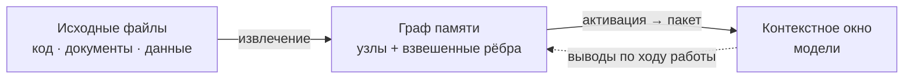

# AMG — Associative Memory Graph

**Постоянная ассоциативная память для LLM-агентов.** Типизированный граф знаний в markdown поверх файловой системы: извлечение через распространение активации (засев BM25 + Personalized PageRank), хеббовы веса с затуханием, консолидация и устойчивое к сбоям транзакционное хранилище.

> Документация: [Теория](docs/ru/THEORY.md) · [Архитектура](docs/ru/architecture/README.md) · [Руководство](docs/ru/GUIDE.md) · [Установка](INSTALL.md) · [Дорожная карта](docs/ru/architecture/11-roadmap.md) · English: [README.md](README.md)

## Что это

Языковая модель не помнит ничего между сессиями, а её рабочая память — контекстное окно — ограничена по объёму: при переполнении или завершении сессии накопленный контекст теряется. AMG даёт модели **внешнюю долговременную память в виде графа** связанных узлов-заметок, лежащих обычными файлами на диске.

Замысел — взять лучшее у двух привычных подходов и обойти их слабости. **RAG** (retrieval-augmented generation — генерация с подключённым поиском) умеет автоматически находить и подмешивать в окно релевантное, но делает это плоским top-k: он плохо отвечает на многошаговые вопросы, где ответ нужно собрать из нескольких источников, и ничего не накапливает между запросами. **Рукотворная вики** (в духе llm-wiki Андрея Карпатого) даёт человекочитаемые связанные страницы и явную структуру, но требует ручного сопровождения и со временем расходится с первоисточником. AMG сохраняет автоматизм RAG и человекочитаемую структуру вики, но извлекает иначе: не по плоскому сходству, а **распространением активации по связям**, — поэтому в окно попадает релевантная *окрестность* графа (нужный узел вместе с его контекстом), а не разрозненные похожие фрагменты.



## Как устроено

**Две плоскости.** Всю детерминированную работу делают скрипты на Python: они разбирают исходные файлы на единицы, хранят граф транзакционно и считают извлечение и консолидацию — это дёшево, точно и не требует модели. Поверх работает слой суждения — субагенты (изолированные экземпляры модели), которые добавляют смысл: пишут сводки узлов, проставляют смысловые рёбра, оценивают значимость. Граница между слоями экономит главный ресурс — токены: дорогая смысловая работа выполняется только над *изменившимися* единицами (каждая сверяется по контентному хешу), а структурный скелет перестраивается в любой момент бесплатно.

**Граф, а не дерево.** Дерево каталогов кодирует только отношение «часть/раздел» (`part_of`) — это остов для просмотра и пространство имён. Все остальные связи живут **явными типизированными взвешенными рёбрами** во frontmatter (так называют YAML-заголовок в начале markdown-файла). Поэтому граф не зависит от структуры папок, переживает переименования и работает с git, grep и редакторами без отдельных инструментов.

**Извлечение — на каждый запрос и силами самой модели.** Прежде чем взяться за задачу — и каждый раз, когда по ходу диалога смещается фокус (новое требование, другая подсистема), — модель собирает из графа компактный пакет контекста, а не загружает проект целиком. То есть выборка идёт не один раз на старте, а перед каждой задачей, и инициирует её сама модель в ходе рассуждения. Механизм — **Personalized PageRank со смещением по запросу**: запрос засевается лексически (BM25) и опционально семантически (эмбеддинги), после чего активация растекается по структурным рёбрам. Эти рёбра **не зависят от запроса** — именно это сохраняет многошаговость: масса активации протекает *сквозь* сам по себе нерелевантный узел к релевантному соседу («смещать, а не запирать»).

**Сборка по ярусам и потолок выдачи.** Активированные узлы укладываются жадно по ярусам абстракции под бюджет токенов: *стратегический* (хабы и обзоры, ≈4000 токенов), *тактический* (релевантные модули, ≈10000), *оперативный* (листовые узлы в фокусе целиком, ≈24000) и *периферия* (список ссылок на следующее кольцо соседей). Это **потолок на запрос, а не обязательная нагрузка**: фактически подтягивается лишь активированная окрестность, поэтому простые запросы остаются дешёвыми, а сложные получают всё относящееся к задаче. Бюджеты ярусов настраиваются в `config.yml`.

**Рост графа и забывание.** Сам граф растёт неограниченно — целиком в окно он не грузится никогда. Но чтобы извлечение оставалось точным, у каждой ветви (поддерева хаба) есть собственный бюджет: по умолчанию ≈400 узлов или ≈200000 токенов (что превышено раньше). Когда ветвь его перерастает, запускается **поэтапное сжатие**: свернуть устаревшие эпизоды в одну сводку → слить почти-дубли → ввести промежуточный под-хаб → в последнюю очередь укоротить наименее ценное. Сжатие останавливается, едва ветвь вернулась под бюджет, **архивирует оригиналы** (забывание обратимо) и никогда не трогает защищённое первым — решения, ADR и сильно связанные узлы. Получается управляемый аналог забывания неважных деталей с сохранением сути (подробнее — [теория, §10](docs/ru/THEORY.md)).

**Захват дёшево, отбор позже.** По ходу сессии решения, выводы, открытые вопросы и планы фиксируются безопасным API заметок (а не правкой узлов руками). Взвешивание, слияние, сжатие и забывание выполняются отдельным шагом **консолидации**, когда доступен полный контекст. Это воспроизводит устройство памяти человека (теория комплементарных систем обучения): быстрый широкий захват сейчас, аккуратная интеграция в долговременную память потом.

**Устойчивость к сбоям.** Истина — это файлы на диске; граф — их восстановимая проекция. Каждая запись идёт через журнал упреждающей записи с декларативным повтором под единой блокировкой на запись; прерывание в любой точке — сбой, закрытый терминал, `/clear` — восстановимо, а повторная сверка идемпотентна: повторный прогон на неизменных файлах не делает и не теряет ничего.

## Консервативные умолчания

Память настроена осторожно, в духе «качество превыше всего»:

- **Хеббово обучение весов выключено** (`weights.apply_hebbian: false`). Проводимость графа остаётся статической и предсказуемой, пока измерение не подтвердит выигрыш: прямой замер показал, что слепое правило усиления **ухудшает** полноту на большом разрежённом графе — усиленные ходовые связи становятся «магистралями» и оттягивают активацию от узлов, достижимых только многошагово (подробно — [теория, §8](docs/ru/THEORY.md)).
- **Компрессия по умолчанию бездействует** — ничего не сжимает, пока ветвь в пределах бюджета; когда всё же сжимает, проходит автоматическую проверку полноты (eval-предохранитель меряет recall на копии графа до и после и отклоняет просадку) и архивирует оригиналы.
- **Эмбеддинги — опциональное лёгкое обогащение** поверх BM25, а не замена; без установленного бэкенда извлечение остаётся чисто лексическим.

## Установка и активация

Движок (каталоги `agents/` и `skills/` плюс блок активации) ставится **локально** — в один проект, в его `<проект>/.claude/`, — или **глобально**, один на все проекты, в `~/.claude/`. В обоих случаях **граф всегда локальный**: он лежит в `<проект>/.claude/amg/`, потому что память относится к конкретному проекту, и между проектами не делится.

Точка входа — корневой **`CLAUDE.md`** проекта: небольшой файл, который модель читает в начале каждой сессии. Блок AMG **дописывается в его конец** между маркерами `<!-- AMG:BEGIN -->` и `<!-- AMG:END -->`, так что ваши собственные инструкции остаются выше, а переустановка заменяет только этот блок. Память включается наличием `.claude/amg/config.yml` с `active: true`.

Имена `.claude` и `CLAUDE.md` — это умолчания **для Claude Code**. Сам движок от среды не зависит: в других агентных средах (например, OpenAI Codex) подставляются их имена — каталог агента `.agents` и точка входа `AGENTS.md`. Команды и пути ниже даны с `.claude`/`CLAUDE.md` как иллюстрация умолчания.

В планах — **автоматический установщик**: он опросит ключевые параметры конфига (локально или глобально; каталог агента и точка входа; пути зеркал и впитывания; рабочий язык; бэкенд эмбеддингов; политика сессий; бюджеты ярусов; режим автоматики) и всё настроит сам. Пока установка ручная — полный порядок в [INSTALL.md](INSTALL.md).

## Быстрый старт

Сценарий полуручной: часть шагов — команды в консоли, часть — просьбы к модели в Claude Code (смысловую часть пишет модель, а не вы).

**Шаг 0 — окружение.** Поставить единственную обязательную зависимость и перейти в корень проекта (туда, где лежит `.claude/`):
```bash
python3 -m pip install pyyaml --break-system-packages
cd /путь/к/проекту
```

**Шаг 1 — источники.** В `config.yml` указать, что подаётся в память, и наполнить эти папки: в `src/` — реальный код, в `doc/` — markdown-документацию (имена папок любые — тип каждого файла память определяет сама):
```yaml
# .claude/amg/config.yml
active: true
working_language: ru
mirror_path: [src, doc]   # зеркало (что редактируется) — граф держится равным
absorb_path: [logs]       # впитывание (разовый материал) — поглощается один раз
```

**Шаг 2 — структурный скелет (`bootstrap`).** Построить граф из источников; это детерминированный шаг без модели:
```bash
python .claude/skills/amg-bootstrap/scripts/reconcile.py bootstrap .
```

**Шаг 3 — семантика (через Claude Code).** Здесь нужна модель. Запустить Claude Code в этой папке и попросить:

> AMG активен. Выполни семантическое обогащение узлов из очереди `work/queue.json`: для каждого напиши сводку и локальные рёбра, затем примени.

По скиллу `amg-bootstrap` модель пачками запускает субагентов `amg-builder` (сводки и рёбра), затем `amg-synth` строит обзор и хабы, кросс-доменные рёбра «код ↔ документация» и **отчёт о пробелах** (недокументированный код, разошедшиеся с кодом документы, противоречия). После применения узлы становятся `active` со сводками.

**Шаг 4 — проверка извлечения.** Убедиться, что пакет собирается, — попросить модель собрать контекст или вручную:
```bash
python .claude/skills/amg-retrieve/scripts/retrieve.py "опиши реальную задачу по части проекта" --store .claude/amg
```

**Шаг 5 — рабочая сессия.** Дальше память ведёт себя сама: после `/clear` дайте задачу — петля активации в `CLAUDE.md` сначала соберёт контекст (`amg-retrieve`), затем начнётся работа. По ходу просите фиксировать выводы и решения как заметки (`notes`).

**Шаг 6 — консолидация (конец сессии).** Замкнуть цикл памяти:
```bash
python .claude/skills/amg-consolidate/scripts/consolidate.py weights .   # свернуть ко-активации, обслужить веса
python .claude/skills/amg-consolidate/scripts/consolidate.py plan .       # разметить план (ветви сверх бюджета, дубли, значимость)
# по скиллу amg-consolidate модель запускает amg-consolidator на план → пишет actions.json, затем:
python .claude/skills/amg-consolidate/scripts/consolidate.py apply .claude/amg/work/actions.json .
```

## Источники: зеркало и впитывание

Что подаётся в память, перечисляется в `config.yml` двумя ключами; тип каждого файла (код / документ / данные) определяется автоматически — называть папки не нужно. Различие между ключами — в намерении:

- **`mirror_path` — то, что вы редактируете** (код, поддерживаемая документация). Граф держится его **живой проекцией**: файл добавлен → узел, изменён → узел обновлён, удалён → узел вычищен. Источник остаётся единственным носителем истины, а в графе лежат сводка и указатель на него (`путь:строка`), а не дословная копия.
- **`absorb_path` — разовый материал, который вы не правите** (логи переписки, дампы данных, сторонние документы). Он **впитывается один раз** в независимые узлы, и удаление источника знание не стирает — впитанное от него больше не зависит. Ключ **необязателен**: можно вести только зеркала.

**Приём для важного материала.** Впитывание хранит дистиллят (суть, не каждое слово), поэтому если впитанный источник удалить, останется только сводка. Когда нужен гарантированный доступ ко **всем** деталям, объявите материал **зеркалом** (`mirror`), даже не редактируя его: тогда граф хранит сводки и указатели, а полный текст всегда доступен по ссылке в самом файле (цена — источник должен оставаться на диске). Это особенно полезно для ценных диалогов: вести их зеркалом надёжнее, чем впитывать.

## Режимы и управление

Степень самостоятельности памяти задаётся в конфиге ключом `automation`:

- **автоматический режим** — модель сама ведёт жизненный цикл: в начале сессии чинит граф после сбоев (проигрывает незавершённые записи, сверяет с диском), перед каждой задачей собирает контекст, по ходу фиксирует выводы, в конце консолидирует и сохраняет сессию;
- **ручной режим** — память не делает ничего сама, только по явной команде или просьбе.

У каждой автоматической операции есть ручной аналог — командой или словами. Управление идёт и короткими командами, и словесными триггерами: `/amg on` и `/amg off` (включить/выключить), `/amg status` (состояние: активность, размер графа, незавершённые операции, устаревшая блокировка), `/amg repair` (восстановить согласованность с диском). Модель ловит и намерение: «включи память», «проверь граф», «почини», «покажи статус памяти». Жизненный цикл, автоматика и команды — на [дорожной карте](docs/ru/architecture/11-roadmap.md) (Этап 8).

## Опциональные зависимости

Базовый тракт работает на стандартной библиотеке Python; недостающее **мягко пропускается**, без сбоя:

| Возможность | Установка | Модель / поведение по умолчанию |
|---|---|---|
| Код прочих языков (функции + рёбра вызовов) | `pip install tree-sitter tree-sitter-language-pack` | Python — через stdlib `ast`, без зависимостей |
| Извлечение PDF / DOCX / XLSX | `pip install pypdf python-docx openpyxl` | без библиотеки файл пропускается |
| Семантический засев, лёгкий (статический) | `pip install model2vec` | `potion-retrieval-32M` (en) / `potion-multilingual-128M` (не-en) |
| Семантический засев, трансформеры | `pip install sentence-transformers` | `all-MiniLM-L6-v2` / `paraphrase-multilingual-MiniLM-L12-v2` |

Для **не-английских проектов (в том числе русских)** движок сам выбирает многоязычную модель по умолчанию — достаточно установить бэкенд и включить засев.

## Что реализовано и что в планах

Реализован и стабилизирован базовый тракт (этапы 0–6 дорожной карты): транзакционное хранилище, извлечение структуры с классификатором и нарезателями, сверка `mirror`/`absorb`, извлечение (BM25 + эмбеддинги + Personalized PageRank + ярусный пакет), консолидация (веса, значимость, компрессия под eval-предохранителем), безопасный захват заметок.

В планах ([дорожная карта](docs/ru/architecture/11-roadmap.md)): автоматический установщик; жизненный цикл, режимы автоматики и команды `/amg`; сохранение сессий; расширение форматов входа; индекс и масштабирование; слой провенанса и верификации фактов; арбитраж противоречий; 3D-просмотр графа; командный режим поверх git; продвинутый семантический слой; перевод документации на английский.

Проект в режиме pre-1.0 (`0.y`): схема данных ещё может меняться, разработка ведётся этапами.

## Карта документации

- [Теория](docs/ru/THEORY.md) — научное обоснование: память, ассоциативное извлечение, пластичность.
- [Архитектура](docs/ru/architecture/README.md) — как устроено в коде: модули, форматы данных, алгоритмы, конфигурация.
- [Руководство](docs/ru/GUIDE.md) — как пользоваться всеми возможностями.
- [Установка](INSTALL.md) — ручная установка (автоматическая — в планах).
- [Дорожная карта](docs/ru/architecture/11-roadmap.md) — что реализовано и что впереди.
