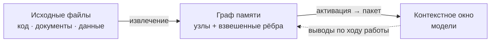

# AMG — Associative Memory Graph

**Постоянная ассоциативная память для LLM-агентов.** Типизированный граф знаний в markdown поверх файловой системы: извлечение через распространение активации (засев BM25 + Personalized PageRank), хеббовы веса с затуханием, консолидация и устойчивое к сбоям транзакционное хранилище.

> Документация: [Теория](docs/ru/THEORY.md) · [Архитектура](docs/ru/architecture/README.md) · [Руководство](docs/ru/GUIDE.md) · [Установка](INSTALL.md) · [Дорожная карта](docs/ru/architecture/11-roadmap.md) · English: [README.md](README.md)

> ⚠️ **ПРОВЕРЕНО ТОЛЬКО В CLAUDE CODE.** Установщик умеет ставить память и в другие агентские среды: **Codex** — со скиллами и TOML-субагентами (`--env codex`, каталоги `.agents`/`.codex`), прочие AGENTS.md-агенты (Qwen Coder и др.) — переносимым блоком без скиллов (`--env generic`). Но **работоспособность и стабильность в любой не-Claude-Code-среде пока НЕ протестированы и НЕ гарантируются** — все тесты проводились в Claude Code. Проверка этих сред — отдельный этап дорожной карты впереди.

## Что это

Языковая модель не помнит ничего между сессиями, а её рабочая память — контекстное окно — ограничена по объёму: при переполнении или завершении сессии накопленный контекст теряется. AMG даёт модели **внешнюю долговременную память в виде графа** связанных узлов-заметок, лежащих обычными файлами на диске.

Замысел — взять лучшее у двух привычных подходов и обойти их слабости. **RAG** (retrieval-augmented generation — генерация с подключённым поиском) умеет автоматически находить и подмешивать в окно релевантное, но делает это плоским top-k: он плохо отвечает на многошаговые вопросы, где ответ нужно собрать из нескольких источников, и ничего не накапливает между запросами. **Рукотворная вики** (в духе llm-wiki Андрея Карпатого) даёт человекочитаемые связанные страницы и явную структуру, но требует ручного сопровождения и со временем расходится с первоисточником. AMG сохраняет автоматизм RAG и человекочитаемую структуру вики, но извлекает иначе: не по плоскому сходству, а **распространением активации по связям**, — поэтому в окно попадает релевантная *окрестность* графа (нужный узел вместе с его контекстом), а не разрозненные похожие фрагменты.



**Разрабатываемая консолидированная память применима не только для кода.** В AMG можно подавать **любую** информацию из текстовых файлов: исходный код, документацию и заметки (markdown, reStructuredText), обычный текст, данные (JSON/YAML/NDJSON, таблицы CSV), журналы, выгрузки переписки, а также бинарные документы — PDF, DOCX, XLSX, PPTX (через опциональные чисто-Python библиотеки). Тип каждого файла определяется автоматически, и под каждый вид подбирается свой нарезатель на единицы: код — по функциям, документы — по заголовкам, JSON — по записям (глубокая вложенность разбирается рекурсивно), журналы — по эпизодам, чат — по сообщениям. При этом **Python-код разбирается нативно** — модулем `ast` по структуре (модуль → классы → функции, с импортами и вызовами), а не как плоский текст; для прочих языков (`.js`, `.ts`, `.php`, `.c`, `.cpp`, `.go`, `.rs`, `.java`, `.rb` и других) ту же функциональную зернистость даёт опциональный `tree-sitter`. Так одна и та же память хранит и архитектуру кодовой базы, и текстовые заметки, и сторонние документы, и выгруженные диалоги — связывая их в единый граф.

## Как устроено

**Две плоскости.** Всю детерминированную работу делают скрипты на Python: они разбирают исходные файлы на единицы, хранят граф транзакционно и считают извлечение и консолидацию — это дёшево, точно и не требует модели. Поверх работает слой суждения — субагенты (изолированные экземпляры модели), которые добавляют смысл: пишут сводки узлов, проставляют смысловые рёбра, оценивают значимость. Граница между слоями экономит главный ресурс — токены: дорогая смысловая работа выполняется только над *изменившимися* единицами (каждая сверяется по контентному хешу), а структурный скелет перестраивается в любой момент бесплатно.

**Граф, а не дерево.** Дерево каталогов кодирует только отношение «часть/раздел» (`part_of`) — это остов для просмотра и пространство имён. Все остальные связи живут **явными типизированными взвешенными рёбрами** во frontmatter (так называют YAML-заголовок в начале markdown-файла). Поэтому граф не зависит от структуры папок, переживает переименования и работает с git, grep и редакторами без отдельных инструментов.

**Извлечение — на каждый запрос и силами самой модели.** Прежде чем взяться за задачу — и каждый раз, когда по ходу диалога смещается фокус (новое требование, другая подсистема), — модель собирает из графа компактный пакет контекста, а не загружает проект целиком. То есть выборка идёт не один раз на старте, а перед каждой задачей, и инициирует её сама модель в ходе рассуждения. Механизм — **Personalized PageRank со смещением по запросу**: запрос засевается лексически (BM25) и опционально семантически (эмбеддинги), после чего активация растекается по структурным рёбрам. Эти рёбра **не зависят от запроса** — именно это сохраняет многошаговость: масса активации протекает *сквозь* сам по себе нерелевантный узел к релевантному соседу («смещать, а не запирать»).

**Сборка по ярусам и потолок выдачи.** Активированные узлы укладываются жадно по ярусам абстракции под бюджет токенов: *стратегический* (хабы и обзоры, ≈4000 токенов), *тактический* (релевантные модули, ≈10000), *оперативный* (листовые узлы в фокусе целиком, ≈24000) и *периферия* (список ссылок на следующее кольцо соседей). Это **потолок на запрос, а не обязательная нагрузка**: фактически подтягивается лишь активированная окрестность, поэтому простые запросы остаются дешёвыми, а сложные получают всё относящееся к задаче. Бюджеты ярусов настраиваются в `config.yml`.

**Рост графа и забывание.** Сам граф растёт неограниченно — целиком в окно он не грузится никогда. Но чтобы извлечение оставалось точным, у каждой ветви (поддерева хаба) есть собственный бюджет: по умолчанию ≈400 узлов или ≈200000 токенов (что превышено раньше). Когда ветвь его перерастает, запускается **поэтапное сжатие**: свернуть устаревшие эпизоды в одну сводку → слить почти-дубли → ввести промежуточный под-хаб → в последнюю очередь укоротить наименее ценное. Сжатие останавливается, едва ветвь вернулась под бюджет, **архивирует оригиналы** (забывание обратимо) и никогда не трогает защищённое первым — решения, ADR и сильно связанные узлы. Получается управляемый аналог забывания неважных деталей с сохранением сути (подробнее — [теория, §10](docs/ru/THEORY.md)).

**Захват дёшево, отбор позже.** По ходу сессии решения, выводы, открытые вопросы и планы фиксируются безопасным API заметок (а не правкой узлов руками). Взвешивание, слияние, сжатие и забывание выполняются отдельным шагом **консолидации**, когда доступен полный контекст. Это воспроизводит устройство памяти человека (теория комплементарных систем обучения): быстрый широкий захват сейчас, аккуратная интеграция в долговременную память потом.

**Устойчивость к сбоям.** Истина — это файлы на диске; граф — их восстановимая проекция. Каждая запись идёт через журнал упреждающей записи с декларативным повтором под единой блокировкой на запись; прерывание в любой точке — сбой, закрытый терминал, `/clear` — восстановимо, а повторная сверка идемпотентна: повторный прогон на неизменных файлах не делает и не теряет ничего. При непредвиденном падении ничего не повреждается и не теряется: на следующем старте граф восстанавливается сам (даже если завершение было жёстким), зафиксированные по ходу заметки уцелевают отдельными транзакциями, а прерванная сборка возобновляется с места — уже обработанные узлы не дублируются (подробнее — [руководство](docs/ru/GUIDE.md), «Восстановление при сбоях»).

## Консервативные умолчания

Память настроена осторожно, в духе «качество превыше всего»:

- **Хеббово обучение весов выключено** (`weights.apply_hebbian: false`). Слепое правило усиления **ухудшало** полноту на большом разрежённом графе («магистрали» оттягивают активацию от многошаговых узлов); улучшенное правило — усиление по **реальному исходу задачи**, а не по совместному показу — на том же графе полноту уже **поднимает**, но дефолт остаётся off, пока выигрыш не подтверждён на реальном использовании. Когда включать — в [руководстве](docs/ru/GUIDE.md); подробно — [теория, §8](docs/ru/THEORY.md).
- **Компрессия по умолчанию бездействует** — ничего не сжимает, пока ветвь в пределах бюджета; когда всё же сжимает, проходит автоматическую проверку полноты (eval-предохранитель меряет recall на копии графа до и после и отклоняет просадку) и архивирует оригиналы.
- **Эмбеддинги — опциональное лёгкое обогащение** поверх BM25, а не замена; без установленного бэкенда извлечение остаётся чисто лексическим.

## Установка

Движок (`agents/` + `skills/` + блок активации) ставится **локально** (в один проект, в его `<проект>/.claude/`) или **глобально** (один на все проекты, в `~/.claude/`); **граф всегда локальный** — он лежит в `<проект>/.claude/amg/`, потому что память относится к конкретному проекту. Установка ведётся **из распакованного каталога AMG, который держат вне проекта** (движок копируется в каталог агента, после установки исходный каталог не нужен); глобальная установка дополнительно заводит глобальный конфиг личных умолчаний (`~/.claude/amg/config.yml` — тиринг моделей, эмбеддинги), который локальный конфиг проекта наследует по отдельным ключам. Точка входа — корневой `CLAUDE.md`: блок AMG дописывается в его конец между маркерами `<!-- AMG:BEGIN -->` и `<!-- AMG:END -->`, ваши инструкции остаются выше, переустановка меняет только блок. Память включается наличием `.claude/amg/config.yml` с `active: true`. Имена `.claude`/`CLAUDE.md` — умолчания Claude Code; в других средах подставляются их имена (для Codex — `.agents`/`AGENTS.md`, см. «Другие среды» ниже).

**1. Зависимости.** Нужен Python 3. Единственная обязательная зависимость — `pyyaml`; остальное опционально (эмбеддинги, извлечение PDF/DOCX/XLSX, tree-sitter) и ставится по необходимости:
```bash
python3 -m pip install pyyaml                  # обязательное
python3 -m pip install -r requirements.txt     # всё опциональное разом (по желанию)
```

**2. Установка — двумя способами.** Оба делают одно и то же; выбирайте удобный. AMG распаковывается в любой каталог **вне проекта** — движок копируется при установке, и исходный каталог потом не нужен.

*Силами модели (проще).* В сессии внутри проекта скажите:

> **установи AMG по `<путь-к-AMG>/INSTALL.md`**

Модель прочитает инструкцию, задаст несколько вопросов (локально/глобально; каталог агента и точка входа; зеркала и впитывание; рабочий язык; эмбеддинги; автоматика; что игнорировать; активировать ли память), покажет существующие настройки при переустановке — и сама вызовет установщик.

*Вручную, командой.* Если хотите задать всё сами (из каталога AMG):
```bash
python install.py --target /путь/к/проекту --scope local \
    --mirror src,doc --absorb data \
    --set working_language=ru --set active=true
```
Полный список флагов и режимов (переустановка, удаление, `--env`, `--build`) — в [INSTALL.md](INSTALL.md).

**3. Что в `config.yml`.** Установщик пишет ключи за вас; вот главные и что они значат:
```yaml
active: true                 # главный выключатель памяти (/amg on · off)
automation: true             # память сама ведёт петлю и хуки сессий
working_language: ru         # язык сводок и заметок
mirror_path: [src, doc]      # живая проекция: правите файл — граф следует за ним
absorb_path: [data]          # впитать один раз (источник потом можно удалить)
models:                      # сила модели по ролям; рендерится в субагентов
  synthesis: {model: opus, reasoning_effort: high}
retrieval:
  embeddings: {enabled: off} # семантический засев (опц.; нужен бэкенд)
agent_dir: .claude           # каталог среды (.agents для Codex и прочих)
entrypoint: CLAUDE.md        # файл точки входа (AGENTS.md для иных сред)
```
Полный справочник всех ключей — [09-config](docs/ru/architecture/09-config.md).

**4. Активация ≠ построение графа.** `/amg on` (или согласие при установке) лишь поднимает флаг `active`; граф строит петля — в новой сессии перед первой задачей (при `automation: true`) либо сразу по `/amg sync`. При установке можно выбрать немедленную сборку (`--build`).

**5. Другие среды (`--env`).** Переносимость шире замены имени папки: слэш-команды, хуки и `@`-импорт дайджеста — механизмы именно Claude Code, поэтому установщик разворачивает под среду разный механизм:
- **Codex** (`--env codex`) — со скиллами и **TOML-субагентами** в `.codex/agents` (с выбором `model` и уровня рассуждения из блока `models`), skill-aware блок `AGENTS.md`, без Claude-хуков и команды;
- **прочие AGENTS.md-среды** (`--env generic`, например Qwen Coder) — переносимый блок **без** скиллов, та же петля прямыми вызовами скриптов (`agents/*.md` модель читает как инструкцию).

Базовая работоспособность от среды не зависит, набор удобств — зависит. **Эти режимы пока не протестированы** в любой не-Claude-Code-среде — все тесты в Claude Code (проверка сред — отдельный этап дорожной карты впереди).

## Первый запуск

От установки до первого ответа памяти — пара шагов; ручные скрипты не нужны, основную работу ведёт сама модель.

**Проверка.** Загляните в состояние и заодно познакомьтесь с командами:
```
/amg status
```
Один экран: активна ли память, размер графа, очередь, последние операции. Все операции доступны единой командой `/amg <verb>` — или теми же словами в обычной просьбе.

**Работа.** Дальше **просто задавайте модели вопросы по проекту** — она сама соберёт из графа нужный контекст (стратегическое окружение плюс конкретику) и будет фиксировать выводы по ходу. Если при установке вы не выбрали немедленную сборку, граф построится в новой сессии перед первой задачей (при включённой автоматике) либо сразу по `/amg sync` (словами: «построй / синхронизируй граф»).

## Источники: зеркало и впитывание

Что подаётся в память, перечисляется в `config.yml` двумя ключами; тип каждого файла (код / документ / данные) определяется автоматически — называть папки не нужно. Различие между ключами — в намерении:

- **`mirror_path` — то, что вы редактируете** (код, поддерживаемая документация). Граф держится его **живой проекцией**: файл добавлен → узел, изменён → узел обновлён, удалён → узел вычищен. Источник остаётся единственным носителем истины, а в графе лежат сводка и указатель на него (`путь:строка`), а не дословная копия.
- **`absorb_path` — разовый материал, который вы не правите** (логи переписки, дампы данных, сторонние документы). Он **впитывается один раз** в независимые узлы, и удаление источника знание не стирает — впитанное от него больше не зависит. Ключ **необязателен**: можно вести только зеркала.
- **`absorb_once_path` — разовый снимок, который не нужно пересинхронизировать.** Как `absorb` (удаление источника знание не стирает), но и последующие изменения источника игнорируются: узел впитывается один раз и **замораживается**. Для отчёта, лога или выгрузки, зафиксированных на конкретный момент.

**Приём для важного материала.** Впитывание хранит дистиллят (суть, не каждое слово), поэтому если впитанный источник удалить, останется только сводка. Когда нужен гарантированный доступ ко **всем** деталям, объявите материал **зеркалом** (`mirror`), даже не редактируя его: тогда граф хранит сводки и указатели, а полный текст всегда доступен по ссылке в самом файле (цена — источник должен оставаться на диске). Это особенно полезно для ценных диалогов: вести их зеркалом надёжнее, чем впитывать.

**Что игнорируется.** Состав графа фильтруют три git-независимых слоя: встроенный список (кэши, зависимости, каталог агента), `.gitignore` проекта (отключается ключом `respect_gitignore`) и глоб-шаблоны конфига — **глобальный `exclude`** плюс добавки по намерению `mirror_exclude` / `absorb_exclude`. Явно указанный источник важнее `.gitignore`. Подробно — в [руководстве](docs/ru/GUIDE.md).

## Сохранение сессий

Диалог с моделью — тоже память: решения и выводы из разговора пропали бы на `/clear`. Поэтому в конце сессии хук `SessionEnd` выгружает стенограмму в `<хранилище>/sessions/ГГГГ-ММ-ДД-ЧЧММ.md` — тексты ходов с маркерами ролей, **без сырых размышлений модели**; вызовы инструментов и вложения не воспроизводятся, а помечаются — по отдельному нумерованному маркеру на каждое. Дальше дамп ингестируется как обычный источник.

Политику записи задаёт ключ **`session_policy`** — та же, что у источников: `absorb` (по умолчанию) впитывает диалог как дистиллят (файл дампа можно удалить, останется сводка), а `mirror` ведёт его зеркалом (узлы живут, пока есть файл, и любую деталь можно достать целиком — приём для ценных диалогов). Каталог по умолчанию вычисляется как `<хранилище>/sessions` и корректен при любом каталоге агента.

Авто-выгрузка опирается на хук и формат стенограммы Claude Code; в среде без хука её заменяет фиксация заметок по ходу (`notes.py`) — она же главная страховка «диалог не потерян» в любой среде.

## Режимы и управление

Степень самостоятельности памяти задаётся ключом `automation` в конфиге (по умолчанию включён):

- **автоматический режим** (`automation: true`) — память ведёт себя сама: хуки `SessionStart`/`SessionEnd` (механизм Claude Code) детерминированно чинят граф после сбоев, сворачивают веса и выгружают стенограмму сессии, а модель по петле перед каждой задачей собирает контекст, по ходу фиксирует выводы и в конце запускает консолидацию;
- **ручной режим** (`automation: false`) — память не делает ничего сама, только по команде или явной просьбе.

Всё управление — через единую команду `/amg <verb>` (и теми же словами в обычном запросе: модель ловит намерение и синонимы, а не точный глагол):

| Команда | Действие |
|---|---|
| `/amg status` | состояние одним экраном: активность, автоматика, размер графа, `stale`, незавершённые операции, блокировка, очередь, последние пакет и консолидация |
| `/amg on` · `off` | включить / выключить AMG |
| `/amg repair` | восстановить согласованность с диском (`recover` + `verify --repair`) |
| `/amg sync` | построить или свести граф с источниками |
| `/amg retrieve <запрос>` | собрать пакет контекста |
| `/amg consolidate` | свернуть веса, зафиксировать выводы, сжать раздутые ветки |

Управляющие глаголы (`status`/`on`/`off`/`repair`) выполняет служебный скрипт, рабочие (`sync`/`retrieve`/`consolidate`) — делегируют профильным скиллам (доступным и напрямую); у каждой автоматической операции есть такой ручной аналог. Важно: `on` лишь включает память — **граф строит `sync`**.

**Дайджест в каждой сессии.** Главный промах петли — «память есть, но к ней не обратились». Поэтому консолидация держит рядом с точкой входа маленький `digest.md` — 5–10 самых значимых решений и открытых вопросов, — который загружается в **каждую** сессию: ключевое видно сразу, ещё до первого извлечения.

> Хуки `SessionStart`/`SessionEnd`, слэш-команда `/amg` и `@`-импорт дайджеста — механизмы именно Claude Code; в других средах их состав зависит от выбранного при установке `--env` (Codex / generic), подробнее — раздел «Установка», пункт «Другие среды».

## 3D-просмотр графа

Структуру памяти можно открыть как **самодостаточную офлайновую HTML-страницу** с трёхмерной визуализацией — командой, скиллом `amg-retrieve`, командой `/amg view` или словами «открой граф»:

```bash
python .claude/skills/amg-retrieve/scripts/export_graph.py --store .claude/amg --open
```

Файл самодостаточен — данные графа и библиотека визуализации вшиты внутрь, — поэтому открывается двойным кликом, без сервера и без интернета, **только на чтение**. Возможности: вращение, зум и панорама; клик по узлу открывает его сводку, frontmatter и рёбра; **цвет по бакету** (код / документы / данные / заметки / хабы) с подсветкой конфликтов; **фильтры** по типу, статусу и бакету и **поиск** по id и сводке; **раскраска по кластерам** — узлы одной темы-хаба получают общий цвет, так видно сообщества; **режим большого графа** — старт с хабов с раскрытием по клику, чтобы крупный граф не превратился в «кашу» и не подвис; регулировка **качества** отрисовки и **светлая/тёмная тема**. Поведение настраивается блоком `viewer` в `config.yml` (порог большого графа, качество, скрытие слабых рёбер и сквозной passthrough к библиотеке). Помимо вьюера, `--json` выгружает граф для сторонних инструментов анализа. Подробно — [руководство](docs/ru/GUIDE.md) и [справочник конфигурации](docs/ru/architecture/09-config.md).

## Командная работа

Память можно вести командой, не усложняя одиночный режим. Граф — это обычные markdown-файлы, поэтому делиться им можно двумя способами, и AMG лишь **читает** существующий git проекта (своей системы версий у памяти нет):

- **Общая папка** — один граф на общем или синхронизируемом диске: запись сериализована единственной блокировкой (по очереди, низкая конкурентность), чтения идут без блокировок. Блокировка различает машины и не отнимает живую блокировку коллеги с другого хоста; при занятой блокировке автоматическое обслуживание мягко пропускается, а не падает.
- **Граф в git** — держите канон (`nodes/*.md`, `config.yml`, `digest.md`) под git, и каждая ветка несёт свою память: `git checkout` подменяет узлы, а слияние веток — обычное git-слияние markdown. Конфликт в одном узле не ломает граф (узел временно пропускается) и виден в `/amg status` и `/amg repair`; после разрешения `/amg sync` пересобирает граф. После `git pull` команда `verify_claims --by-commit` дёшево показывает, какие узлы устарели по истории git.

`/amg status` показывает текущую ветку и коммит, а происхождение каждого факта хранит коммит на момент извлечения. Сравнение памяти между ветками — на чтение (`git diff` узлов или `export_graph --json` на двух ветках). Подробно, с рекомендуемым `.gitignore` и разбором границ режима, — в [руководстве](docs/ru/GUIDE.md), раздел «Командная работа».

## Опциональные зависимости

Базовая функциональность работает на стандартной библиотеке Python; недостающее **мягко пропускается**, без сбоя:

| Возможность | Установка | Модель / поведение по умолчанию |
|---|---|---|
| Код прочих языков (функции + рёбра вызовов) | `pip install tree-sitter tree-sitter-language-pack` | Python — через stdlib `ast`, без зависимостей |
| Извлечение PDF / DOCX / XLSX | `pip install pypdf python-docx openpyxl` | без библиотеки файл пропускается |
| Семантический засев, лёгкий (статический) | `pip install model2vec` | `potion-retrieval-32M` (en) / `potion-multilingual-128M` (не-en) |
| Семантический засев, трансформеры | `pip install sentence-transformers` | `all-MiniLM-L6-v2` / `paraphrase-multilingual-MiniLM-L12-v2` |

Для **не-английских проектов (в том числе русских)** движок сам выбирает многоязычную модель по умолчанию — достаточно установить бэкенд и включить засев.

## Что реализовано и что в планах

Реализован и стабилизирован базовый тракт (этапы 0–14 дорожной карты): транзакционное хранилище, извлечение структуры с классификатором и широким набором нарезателей (код, markdown/RST, текст, JSON/YAML с рекурсией, NDJSON, CSV, журналы, чат-экспорты, PDF/DOCX/XLSX/PPTX), сверка `mirror`/`absorb`/`absorb_once`, извлечение (BM25 + эмбеддинги + Personalized PageRank + ярусный пакет), консолидация (веса, значимость, компрессия под eval-предохранителем), безопасный захват заметок, слой жизненного цикла (хуки сессии, команды `/amg`, режимы `automation`, always-on дайджест), сохранение сессий (авто-выгрузка диалога с политикой записи), **упаковка с установщиком** (`install.py`: локально/глобально, переустановка и удаление, переносимость по каталогу агента), **производительность с масштабированием** (производный read-индекс под извлечение для больших графов, тиринг моделей субагентов, бенчмарки) **слой доверия** (провенанс и уверенность у каждого факта, проверка утверждений о коде по живому источнику `verify_claims` с пометкой непроверенного/устаревшего/спорного в пакете, провенанс использования как честный субстрат для обучения весов) и **эпистемический арбитраж противоречий** (конфликты разрешаются по надёжности источника, свежести и уверенности, а не по частоте обращений: недеструктивные вердикты `supersede`/`dispute`/`reject`/`keep_both`/`ask_user`, видимый аудит-след, surfacing снятого и спорного по намерению запроса; плюс улучшенное правило обучения весов — по реальному исходу задачи, а не слепой ко-активации). Добавлены **3D-просмотр графа** и **командная работа** (общая папка и опциональный граф в git) — отдельные разделы выше. Продвинутый семантический слой добавил **проектные узлы-паттерны** (перенос опыта и аналогий внутри проекта: архитектурный паттерн, повторяющийся фикс, анти-паттерн, рецепт миграции) и опциональную **ленивую/on-demand деривацию** для очень больших редко-опрашиваемых графов (по умолчанию выключена, `derivation: eager`).

В планах ([дорожная карта](docs/ru/architecture/11-roadmap.md)): надёжная и экономная сборка графа на больших реальных проектах (детерминированная связность и воспроизводимость, кратное снижение стоимости построения); перевод документации на английский.

Версия 1.0 фиксирует стабильную схему данных и рабочую установку; дальнейшие этапы аддитивны или сопровождаются миграцией (SemVer — слом контракта данных без миграции означал бы MAJOR).

## Карта документации

- [Теория](docs/ru/THEORY.md) — научное обоснование: память, ассоциативное извлечение, пластичность.
- [Архитектура](docs/ru/architecture/README.md) — как устроено в коде: модули, форматы данных, алгоритмы, конфигурация.
- [Руководство](docs/ru/GUIDE.md) — как пользоваться всеми возможностями.
- [Установка](INSTALL.md) — установка установщиком (силами модели или командой), переустановка, удаление.
- [Дорожная карта](docs/ru/architecture/11-roadmap.md) — что реализовано и что впереди.

## Лицензия

AMG распространяется под лицензией **PolyForm Strict 1.0.0**: некоммерческое использование свободно, но **без модификаций, производных работ и распространения**; любое **коммерческое** использование, а равно модификация или производные работы — по отдельной лицензии от автора (`reghost200@gmail.com`). Программа предоставляется «как есть» и используется на ваш страх и риск. Полный текст и условия — [LICENSE](LICENSE).
