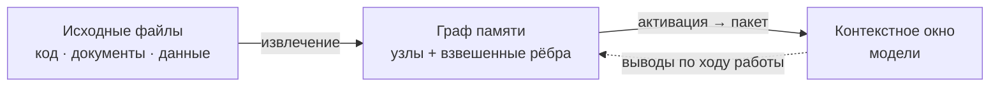

# AMG — Associative Memory Graph

**Постоянная ассоциативная память для LLM-агентов.** Типизированный граф знаний в markdown поверх файловой системы: извлечение через распространение активации (засев BM25 + Personalized PageRank), хеббовы веса с затуханием, консолидация и устойчивое к сбоям транзакционное хранилище.

> Документация: [Теория](docs/ru/THEORY.md) · [Архитектура](docs/ru/architecture/README.md) · [Руководство](docs/ru/GUIDE.md) · [Установка](INSTALL.md) · [Дорожная карта](docs/ru/architecture/11-roadmap.md) · English: [README.md](README.md)

> ⚠️ **ПРОВЕРЕНО ТОЛЬКО В CLAUDE CODE.** Установщик умеет ставить память и в другие агентские среды (Codex, Qwen Coder и прочие, читающие `AGENTS.md`) — переносимым блоком без скиллов. Но **работоспособность и стабильность в Codex и любой иной не-Claude-Code-среде пока НЕ протестированы и НЕ гарантируются** — все тесты проводились в Claude Code. Проверка этих сред — Этап 19 дорожной карты.

## Что это

Языковая модель не помнит ничего между сессиями, а её рабочая память — контекстное окно — ограничена по объёму: при переполнении или завершении сессии накопленный контекст теряется. AMG даёт модели **внешнюю долговременную память в виде графа** связанных узлов-заметок, лежащих обычными файлами на диске.

Замысел — взять лучшее у двух привычных подходов и обойти их слабости. **RAG** (retrieval-augmented generation — генерация с подключённым поиском) умеет автоматически находить и подмешивать в окно релевантное, но делает это плоским top-k: он плохо отвечает на многошаговые вопросы, где ответ нужно собрать из нескольких источников, и ничего не накапливает между запросами. **Рукотворная вики** (в духе llm-wiki Андрея Карпатого) даёт человекочитаемые связанные страницы и явную структуру, но требует ручного сопровождения и со временем расходится с первоисточником. AMG сохраняет автоматизм RAG и человекочитаемую структуру вики, но извлекает иначе: не по плоскому сходству, а **распространением активации по связям**, — поэтому в окно попадает релевантная *окрестность* графа (нужный узел вместе с его контекстом), а не разрозненные похожие фрагменты.



**Разрабатываемая консолидированная память применима не только для кода.** В AMG можно подавать **любую** информацию из текстовых файлов: исходный код, документацию и заметки в markdown, обычный текст, данные в JSON/YAML, а также бинарные документы — PDF, DOCX, XLSX (через опциональные чисто-Python библиотеки). Тип каждого файла определяется автоматически, и под каждый вид подбирается свой нарезатель на единицы. При этом **Python-код разбирается нативно** — модулем `ast` по структуре (модуль → классы → функции, с импортами и вызовами), а не как плоский текст; для прочих языков (`.js`, `.ts`, `.php`, `.c`, `.cpp`, `.go`, `.rs`, `.java`, `.rb` и других) ту же функциональную зернистость даёт опциональный `tree-sitter`. Так одна и та же память хранит и архитектуру кодовой базы, и текстовые заметки, и сторонние документы, и выгруженные диалоги — связывая их в единый граф.

## Как устроено

**Две плоскости.** Всю детерминированную работу делают скрипты на Python: они разбирают исходные файлы на единицы, хранят граф транзакционно и считают извлечение и консолидацию — это дёшево, точно и не требует модели. Поверх работает слой суждения — субагенты (изолированные экземпляры модели), которые добавляют смысл: пишут сводки узлов, проставляют смысловые рёбра, оценивают значимость. Граница между слоями экономит главный ресурс — токены: дорогая смысловая работа выполняется только над *изменившимися* единицами (каждая сверяется по контентному хешу), а структурный скелет перестраивается в любой момент бесплатно.

**Граф, а не дерево.** Дерево каталогов кодирует только отношение «часть/раздел» (`part_of`) — это остов для просмотра и пространство имён. Все остальные связи живут **явными типизированными взвешенными рёбрами** во frontmatter (так называют YAML-заголовок в начале markdown-файла). Поэтому граф не зависит от структуры папок, переживает переименования и работает с git, grep и редакторами без отдельных инструментов.

**Извлечение — на каждый запрос и силами самой модели.** Прежде чем взяться за задачу — и каждый раз, когда по ходу диалога смещается фокус (новое требование, другая подсистема), — модель собирает из графа компактный пакет контекста, а не загружает проект целиком. То есть выборка идёт не один раз на старте, а перед каждой задачей, и инициирует её сама модель в ходе рассуждения. Механизм — **Personalized PageRank со смещением по запросу**: запрос засевается лексически (BM25) и опционально семантически (эмбеддинги), после чего активация растекается по структурным рёбрам. Эти рёбра **не зависят от запроса** — именно это сохраняет многошаговость: масса активации протекает *сквозь* сам по себе нерелевантный узел к релевантному соседу («смещать, а не запирать»).

**Сборка по ярусам и потолок выдачи.** Активированные узлы укладываются жадно по ярусам абстракции под бюджет токенов: *стратегический* (хабы и обзоры, ≈4000 токенов), *тактический* (релевантные модули, ≈10000), *оперативный* (листовые узлы в фокусе целиком, ≈24000) и *периферия* (список ссылок на следующее кольцо соседей). Это **потолок на запрос, а не обязательная нагрузка**: фактически подтягивается лишь активированная окрестность, поэтому простые запросы остаются дешёвыми, а сложные получают всё относящееся к задаче. Бюджеты ярусов настраиваются в `config.yml`.

**Рост графа и забывание.** Сам граф растёт неограниченно — целиком в окно он не грузится никогда. Но чтобы извлечение оставалось точным, у каждой ветви (поддерева хаба) есть собственный бюджет: по умолчанию ≈400 узлов или ≈200000 токенов (что превышено раньше). Когда ветвь его перерастает, запускается **поэтапное сжатие**: свернуть устаревшие эпизоды в одну сводку → слить почти-дубли → ввести промежуточный под-хаб → в последнюю очередь укоротить наименее ценное. Сжатие останавливается, едва ветвь вернулась под бюджет, **архивирует оригиналы** (забывание обратимо) и никогда не трогает защищённое первым — решения, ADR и сильно связанные узлы. Получается управляемый аналог забывания неважных деталей с сохранением сути (подробнее — [теория, §10](docs/ru/THEORY.md)).

**Захват дёшево, отбор позже.** По ходу сессии решения, выводы, открытые вопросы и планы фиксируются безопасным API заметок (а не правкой узлов руками). Взвешивание, слияние, сжатие и забывание выполняются отдельным шагом **консолидации**, когда доступен полный контекст. Это воспроизводит устройство памяти человека (теория комплементарных систем обучения): быстрый широкий захват сейчас, аккуратная интеграция в долговременную память потом.

**Устойчивость к сбоям.** Истина — это файлы на диске; граф — их восстановимая проекция. Каждая запись идёт через журнал упреждающей записи с декларативным повтором под единой блокировкой на запись; прерывание в любой точке — сбой, закрытый терминал, `/clear` — восстановимо, а повторная сверка идемпотентна: повторный прогон на неизменных файлах не делает и не теряет ничего. При непредвиденном падении ничего не повреждается и не теряется: на следующем старте граф восстанавливается сам (даже если завершение было жёстким), зафиксированные по ходу заметки уцелевают отдельными транзакциями, а прерванная сборка возобновляется с места — уже обработанные узлы не дублируются (подробнее — [руководство](docs/ru/GUIDE.md), «Восстановление при сбоях»).

## Консервативные умолчания

Память настроена осторожно, в духе «качество превыше всего»:

- **Хеббово обучение весов выключено** (`weights.apply_hebbian: false`). Проводимость графа остаётся статической и предсказуемой, пока измерение не подтвердит выигрыш: прямой замер показал, что слепое правило усиления **ухудшает** полноту на большом разрежённом графе — усиленные ходовые связи становятся «магистралями» и оттягивают активацию от узлов, достижимых только многошагово (подробно — [теория, §8](docs/ru/THEORY.md)).
- **Компрессия по умолчанию бездействует** — ничего не сжимает, пока ветвь в пределах бюджета; когда всё же сжимает, проходит автоматическую проверку полноты (eval-предохранитель меряет recall на копии графа до и после и отклоняет просадку) и архивирует оригиналы.
- **Эмбеддинги — опциональное лёгкое обогащение** поверх BM25, а не замена; без установленного бэкенда извлечение остаётся чисто лексическим.

## Установка и активация

Движок (каталоги `agents/` и `skills/` плюс блок активации) ставится **локально** — в один проект, в его `<проект>/.claude/`, — или **глобально**, один на все проекты, в `~/.claude/`. В обоих случаях **граф всегда локальный**: он лежит в `<проект>/.claude/amg/`, потому что память относится к конкретному проекту, и между проектами не делится.

Точка входа — корневой **`CLAUDE.md`** проекта: небольшой файл, который модель читает в начале каждой сессии. Блок AMG **дописывается в его конец** между маркерами `<!-- AMG:BEGIN -->` и `<!-- AMG:END -->`, так что ваши собственные инструкции остаются выше, а переустановка заменяет только этот блок. Память включается наличием `.claude/amg/config.yml` с `active: true`.

Имена `.claude` и `CLAUDE.md` — это умолчания **для Claude Code**. Сам движок от среды не зависит: в других агентных средах (например, OpenAI Codex) подставляются их имена — каталог агента `.agents` и точка входа `AGENTS.md`. Команды и пути ниже даны с `.claude`/`CLAUDE.md` как иллюстрация умолчания.

**Установщик** `install.py` опрашивает ключевые параметры (локально или глобально; каталог агента и точка входа; зеркала и впитывание; что игнорировать; рабочий язык; бэкенд эмбеддингов; политика сессий; бюджеты ярусов; автоматика; активировать ли память) и всё настраивает сам: размещает движок, вливает блок между маркерами, пишет `config.yml`, ставит зависимости и проверяет хранилище. Его ведёт сама модель по фразе «установи AMG по INSTALL.md» либо запускают напрямую командой. Переустановка меняет только блок и движок `amg-*`, не трогая ваши инструкции и граф; предусмотрено и удаление (при желании — вместе с графом). Полный порядок, флаги и режимы — в [INSTALL.md](INSTALL.md).

Основные ключи `config.yml`: `active` (вкл/выкл) и `automation` (самостоятельность); `working_language`; источники `mirror_path` / `absorb_path`; что игнорировать — `exclude` / `mirror_exclude` / `absorb_exclude` / `respect_gitignore`; `session_policy`; бюджеты ярусов `retrieval.token_budget`; семантический засев `retrieval.embeddings`; имена среды `agent_dir` / `entrypoint`. Полный справочник — [09-config](docs/ru/architecture/09-config.md).

## Быстрый старт

От установки до первого ответа памяти — пять шагов; ручные скрипты из прежних версий не нужны, основную работу ведёт сама модель.

**Шаг 1 — окружение.** Нужен Python 3. Единственная обязательная зависимость — `pyyaml` (остальное опционально и ставится установщиком):
```bash
python3 -m pip install pyyaml
```

**Шаг 2 — что подаёте в память.** Решите, какие папки память будет вести (установщик о них спросит): **зеркала** (`mirror_path`) — то, что вы редактируете (код, документация); **впитывание** (`absorb_path`) — разовый материал (логи, дампы, экспортированные диалоги). Имена папок любые — тип каждого файла память определяет сама.

**Шаг 3 — установка.** Скажите модели в Claude Code: **«установи AMG по INSTALL.md»**. Она задаст несколько вопросов (локально или глобально, источники из шага 2, рабочий язык, эмбеддинги, автоматика, что игнорировать) и всё настроит. В конце спросит, **активировать ли память** — согласитесь; можно сразу и построить граф. (Запуск без модели — `python install.py …`, см. [INSTALL.md](INSTALL.md).)

**Шаг 4 — проверка.** Загляните в состояние и заодно познакомьтесь с командами:
```
/amg status
```
Это один экран: активна ли память, размер графа, очередь, последние операции. Все операции доступны единой командой `/amg <verb>` — или теми же словами в обычной просьбе.

**Шаг 5 — работа.** Дальше **просто задавайте модели любой вопрос по вашему проекту** — она сама соберёт из графа нужный контекст (стратегическое окружение плюс конкретику) и будет фиксировать выводы по ходу. Ручные команды сборки и извлечения не нужны.

> **`/amg on` ≠ построение графа.** Активация лишь включает память; граф строит петля активации. Если при установке вы не выбрали немедленную сборку, граф построится **в новой сессии** перед первой задачей (при включённой автоматике) либо сразу по `/amg sync` (или словами «построй / синхронизируй / проиндексируй граф»). Поэтому после активации не ждите запуска в той же сессии — начните новую или скажите `sync`.

## Источники: зеркало и впитывание

Что подаётся в память, перечисляется в `config.yml` двумя ключами; тип каждого файла (код / документ / данные) определяется автоматически — называть папки не нужно. Различие между ключами — в намерении:

- **`mirror_path` — то, что вы редактируете** (код, поддерживаемая документация). Граф держится его **живой проекцией**: файл добавлен → узел, изменён → узел обновлён, удалён → узел вычищен. Источник остаётся единственным носителем истины, а в графе лежат сводка и указатель на него (`путь:строка`), а не дословная копия.
- **`absorb_path` — разовый материал, который вы не правите** (логи переписки, дампы данных, сторонние документы). Он **впитывается один раз** в независимые узлы, и удаление источника знание не стирает — впитанное от него больше не зависит. Ключ **необязателен**: можно вести только зеркала.

**Приём для важного материала.** Впитывание хранит дистиллят (суть, не каждое слово), поэтому если впитанный источник удалить, останется только сводка. Когда нужен гарантированный доступ ко **всем** деталям, объявите материал **зеркалом** (`mirror`), даже не редактируя его: тогда граф хранит сводки и указатели, а полный текст всегда доступен по ссылке в самом файле (цена — источник должен оставаться на диске). Это особенно полезно для ценных диалогов: вести их зеркалом надёжнее, чем впитывать.

## Сохранение сессий

Диалог с моделью — тоже память: решения и выводы из разговора пропали бы на `/clear`. Поэтому в конце сессии хук `SessionEnd` выгружает стенограмму в `<хранилище>/sessions/ГГГГ-ММ-ДД-ЧЧММ.md` — тексты ходов с маркерами ролей, **без сырых размышлений модели**; вызовы инструментов и вложения не воспроизводятся, а помечаются — по отдельному нумерованному маркеру на каждое. Дальше дамп ингестируется как обычный источник.

Политику записи задаёт ключ **`session_policy`** — та же, что у источников: `absorb` (по умолчанию) впитывает диалог как дистиллят (файл дампа можно удалить, останется сводка), а `mirror` ведёт его зеркалом (узлы живут, пока есть файл, и любую деталь можно достать целиком — приём для ценных диалогов). Каталог по умолчанию вычисляется как `<хранилище>/sessions` и корректен при любом каталоге агента.

Авто-выгрузка опирается на хук и формат стенограммы Claude Code; в среде без хука её заменяет фиксация заметок по ходу (`notes.py`) — она же главная страховка «диалог не потерян» в любой среде.

## Режимы и управление

Степень самостоятельности памяти задаётся ключом `automation` в конфиге (по умолчанию включён):

- **автоматический режим** (`automation: true`) — память ведёт себя сама: хуки `SessionStart`/`SessionEnd` (механизм Claude Code) детерминированно чинят граф после сбоев, сворачивают веса и выгружают стенограмму сессии, а модель по петле перед каждой задачей собирает контекст, по ходу фиксирует выводы и в конце запускает консолидацию;
- **ручной режим** (`automation: false`) — память не делает ничего сама, только по команде или явной просьбе.

Всё управление — через единую команду `/amg <verb>` (и теми же словами в обычном запросе: модель ловит намерение и синонимы, а не точный глагол):

| Команда | Действие |
|---|---|
| `/amg status` | состояние одним экраном: активность, автоматика, размер графа, `stale`, незавершённые операции, блокировка, очередь, последние пакет и консолидация |
| `/amg on` · `off` | включить / выключить AMG |
| `/amg repair` | восстановить согласованность с диском (`recover` + `verify --repair`) |
| `/amg sync` | построить или свести граф с источниками |
| `/amg retrieve <запрос>` | собрать пакет контекста |
| `/amg consolidate` | свернуть веса, зафиксировать выводы, сжать раздутые ветки |

Управляющие глаголы (`status`/`on`/`off`/`repair`) выполняет служебный скрипт, рабочие (`sync`/`retrieve`/`consolidate`) — делегируют профильным скиллам (доступным и напрямую); у каждой автоматической операции есть такой ручной аналог. Важно: `on` лишь включает память — **граф строит `sync`**.

**Дайджест в каждой сессии.** Главный промах петли — «память есть, но к ней не обратились». Поэтому консолидация держит рядом с точкой входа маленький `digest.md` — 5–10 самых значимых решений и открытых вопросов, — который загружается в **каждую** сессию: ключевое видно сразу, ещё до первого извлечения.

> Переносимость шире замены имени папки: слэш-команды, хуки и `@`-импорт дайджеста — механизмы именно Claude Code, и в других средах (Codex, Qwen Coder и прочие, читающие `AGENTS.md`) их может не быть. Поэтому установщик (`--env generic`) вливает **отдельный блок без скиллов** `AGENTS.md`: та же петля прямыми вызовами скриптов, без хуков/команд (`agents/*.md` модель читает как инструкцию). Базовая работоспособность от среды не зависит, набор удобств — зависит. **Но** этот режим в Codex/Qwen Coder и любой иной не-Claude-Code-среде **не протестирован и стабильность не гарантирована** — тесты только в Claude Code (см. оговорку вверху; проверка — Этап 19).

## Опциональные зависимости

Базовая функциональность работает на стандартной библиотеке Python; недостающее **мягко пропускается**, без сбоя:

| Возможность | Установка | Модель / поведение по умолчанию |
|---|---|---|
| Код прочих языков (функции + рёбра вызовов) | `pip install tree-sitter tree-sitter-language-pack` | Python — через stdlib `ast`, без зависимостей |
| Извлечение PDF / DOCX / XLSX | `pip install pypdf python-docx openpyxl` | без библиотеки файл пропускается |
| Семантический засев, лёгкий (статический) | `pip install model2vec` | `potion-retrieval-32M` (en) / `potion-multilingual-128M` (не-en) |
| Семантический засев, трансформеры | `pip install sentence-transformers` | `all-MiniLM-L6-v2` / `paraphrase-multilingual-MiniLM-L12-v2` |

Для **не-английских проектов (в том числе русских)** движок сам выбирает многоязычную модель по умолчанию — достаточно установить бэкенд и включить засев.

## Что реализовано и что в планах

Реализован и стабилизирован базовый тракт (этапы 0–10 дорожной карты): транзакционное хранилище, извлечение структуры с классификатором и нарезателями, сверка `mirror`/`absorb`, извлечение (BM25 + эмбеддинги + Personalized PageRank + ярусный пакет), консолидация (веса, значимость, компрессия под eval-предохранителем), безопасный захват заметок, слой жизненного цикла (хуки сессии, команды `/amg`, режимы `automation`, always-on дайджест), сохранение сессий (авто-выгрузка диалога с политикой записи) и **упаковка с установщиком** (`install.py`: локально/глобально, переустановка и удаление, переносимость по каталогу агента).

В планах ([дорожная карта](docs/ru/architecture/11-roadmap.md)): расширение форматов входа; индекс и масштабирование; слой провенанса и верификации фактов; арбитраж противоречий; 3D-просмотр графа; командный режим поверх git; продвинутый семантический слой; перевод документации на английский.

Версия 1.0 фиксирует стабильную схему данных и рабочую установку; дальнейшие этапы аддитивны или сопровождаются миграцией (SemVer — слом контракта данных без миграции означал бы MAJOR).

## Карта документации

- [Теория](docs/ru/THEORY.md) — научное обоснование: память, ассоциативное извлечение, пластичность.
- [Архитектура](docs/ru/architecture/README.md) — как устроено в коде: модули, форматы данных, алгоритмы, конфигурация.
- [Руководство](docs/ru/GUIDE.md) — как пользоваться всеми возможностями.
- [Установка](INSTALL.md) — установка установщиком (силами модели или командой), переустановка, удаление.
- [Дорожная карта](docs/ru/architecture/11-roadmap.md) — что реализовано и что впереди.
