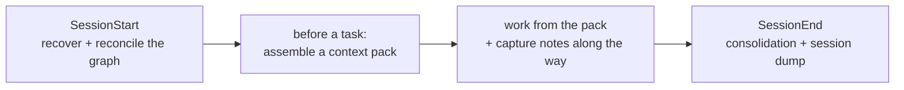

# The AMG user guide

This is the practical guide: how to use every AMG capability — what runs on its own, what gets checked after failures, and what can be run by hand. The theoretical grounding is in the [theory](./THEORY.md); how the system is built inside (the code, functions, prompts) — in the [architecture documentation](./architecture/README.md); this guide is about using it.

AMG (Associative Memory Graph) is persistent associative memory for the model: a typed graph with hierarchical summaries and retrieval by spreading activation, living in `.claude/amg/`. It lets you work on a part of the project in a clean context window while still seeing the strategic surround — the purpose, the related code, the earlier decisions — instead of loading the whole project.

## Installation

This guide covers installation **by capability** — what can be chosen and how to use it; the step-by-step order and the exhaustive flag list are in [INSTALL.md](../../INSTALL.md), the surface overview in the [README](../../README.md).

### Where to install from

The installer runs from the unpacked AMG directory and targets the project with the `--target` flag, so keep that directory **outside the project** (the home folder, a shared tools directory — wherever convenient): the engine is copied into the agent directory, and after the install the source directory can be deleted. There is no need to put it inside the project: it clutters the root and gains nothing (the engine is copied regardless; the system cannot confuse the source directory with the store — store resolution tells them apart by content).

### Locally or globally

The engine (`agents/` + `skills/` + the activation block) installs **locally** — into one project (`<project>/.claude/`) — or **globally**, one for all projects (`~/.claude/`). **The graph is always local** (`<project>/.claude/amg/`): memory belongs to a specific project and is not shared between projects. A local install — when you need one project or your own engine version; a global one — when the engine is shared and each project merely activates. The `--project-only` flag attaches a project to an already existing global install: only the local `config.yml` is written, the engine is untouched.

A global install additionally creates the **global personal-defaults config** (`~/.claude/amg/config.yml`): it holds your machine's settings — model tiering (`models`) and embeddings (`retrieval.embeddings`) — and every project inherits them key by key, overriding them with its local config. Personal preferences thus stay out of the project's git canon, while the project-level settings (sources, language, budgets) remain in the local `config.yml`. Details — [INSTALL.md](../../INSTALL.md), "Local and global".

### Dependencies

You need Python 3 and the single mandatory dependency, `pyyaml`. The rest is optional, and a missing library is **skipped gracefully** (no crash); it installs in groups via `--deps` or `requirements.txt`:
```bash
python3 -m pip install pyyaml                  # mandatory
python3 -m pip install -r requirements.txt     # everything optional at once
```
The groups: `embeddings` (model2vec) / `embeddings-st` (sentence-transformers) — semantic seeding; `text` (pypdf / python-docx / openpyxl) — PDF/DOCX/XLSX extraction; `treesitter` (tree-sitter + language-pack) — code in other languages. What is actually active is shown by `extract_structure.py . --stats`.

### Two ways: model-driven or by command

*Via the model (simpler).* In a session inside your project say "**install AMG per `<path-to-AMG>/INSTALL.md`**" (the path pointing at the AMG directory unpacked outside the project) — the model reads the instructions, surveys the project and proposes a folder classification (mirrors / absorb / excludes), asks **the full question list one at a time** (local/global; the environment, agent directory, and entry point; mirrors and absorb paths, including frozen snapshots; what to ignore; the working language; the embedding backend; automation; the session policy; the tier budgets; dependencies; whether to activate the memory), shows the values in force if a config already exists, and calls the installer with the answers itself. Two questions are marked key — the **working language** and **embeddings**: they are expensive to change after the build (summaries and the derivation cache are keyed by language; the build-time linking pass finds cross-domain links by the embedding vectors). Everything else is safe to adjust in `config.yml` at any time — changes apply on the next run; what is cheap to change later versus what to decide before building — [INSTALL.md](../../INSTALL.md), the section of that name.

*By command.* The same on your own — the installer is non-interactive, all answers travel as flags (run from the AMG directory):
```bash
python install.py --target /path/to/project --scope local \
    --mirror src,doc --absorb data --exclude "*.min.js" \
    --set working_language=ru --set automation=true --set active=true \
    --deps base,embeddings --build
```
The main flags: `--scope local|global`; `--agent-dir`/`--entrypoint` (the environment's directory and entry-point names); `--env` (below); `--mirror`/`--absorb`/`--absorb-once`/`--exclude`; `--set key=value` (any scalar config key, repeatable; a dotted key sets a nested value — `retrieval.embeddings.enabled=auto`); `--set-global` (the same, into the global personal-defaults config); `--deps`; `--build` (build the structural graph right away); `--project-only`; `--no-verify`. The full list and the modes — [INSTALL.md](../../INSTALL.md).

### Environments other than Claude Code (`--env`)

The SKILL.md skill format is a cross-tool standard (Agent Skills) read by Codex, OpenCode, and Qwen Code alike; what differs per environment is the rest of the control surface — hooks, slash commands, the digest `@`-import, the subagent format. So the installer deploys **a different mechanism** per environment, not just substituted paths:

- **`claude-code`** (the default) — the skill-aware block + the `SessionStart`/`SessionEnd`/`UserPromptSubmit` hooks + the `/amg` command; the models render into the `agents/amg-*.md` frontmatter.
- **`codex`** — OpenAI Codex with skills and subagents: the skills go to `.agents/skills`, the subagents as **TOML in `.codex/agents`** (with `model`/`model_reasoning_effort` from the `models` block), the skill-aware `AGENTS.md` block is injected. No hooks are written — Codex's hook surface is unconfirmed and being verified live; the block's start check covers the session halves.
- **`opencode`** — OpenCode discovers the skills in `.agents/skills` **natively**; the subagents render to `.opencode/agent/*.md` (`mode: subagent`; a real model id from `models` passes through, a Claude alias is omitted — OpenCode model ids are `provider/model` strings), and the portable skill-aware block is injected. No hooks (OpenCode's analogue is a JS plugin API — a future adaptation, not needed for the baseline).
- **`qwen`** — Qwen Code, preset `.qwen` / `QWEN.md`: the skills go to `.qwen/skills`, the worker prompts land in `.qwen/agents/*.md` — Qwen's **native markdown subagents** — with the Claude-only frontmatter sanitized (`tools`/`effort` dropped; a Claude-alias model dropped, a real id such as `qwen3-coder-plus` passes through), and the session hooks merge into `.qwen/settings.json`, which Qwen reads in the same shape Claude Code does.
- **`generic`** — an **unknown** AGENTS.md environment: the portable skill-less block, the same loop by direct script calls (the model reads the `agents/*.md` prompts as instructions). The skills still land in `.agents/skills` — the cross-tool location — and the block says to prefer them if the environment turns out to discover them (that is exactly how OpenCode behaved before it had its own mode).

Baseline functionality does not depend on the environment; the set of conveniences does. **Modes other than Claude Code are not yet tested live, stability is not guaranteed** — verifying these environments is the roadmap stage now in progress.

### The key `config.yml` keys

The installer writes them for you; the full reference — [09-config](./architecture/09-config.md). The essentials:
```yaml
active: true                 # the memory switch (/amg on · off)
automation: true             # runs the loop and session hooks itself
working_language: ru         # the language of summaries and notes
mirror_path: [src, doc]      # live projection: you edit a file, the graph follows
absorb_path: [data]          # ingest once (the source may be deleted later)
exclude: []                  # the global ignore; +mirror_exclude/absorb_exclude (per intent), +respect_gitignore
session_policy: absorb       # how session auto-dumps are wired in (absorb | mirror)
models:                      # model strength per role, rendered into the subagents
  synthesis: {model: opus, reasoning_effort: high}
retrieval:
  token_budget: {strategic: 4000, tactical: 10000, operational: 24000}
  embeddings: {enabled: off} # semantic seeding (opt.; needs a backend)
agent_dir: .claude           # the environment's directory (.agents for Codex etc.)
entrypoint: CLAUDE.md        # the entry-point file (AGENTS.md for other envs)
```

Under a global install the personal blocks (`models`, `retrieval.embeddings`) live not here but in the global defaults config and are inherited by the local one key by key (see "Locally or globally" above); the inheritance is keyed on `agent_dir`, which the installer always writes.

### Reinstall, engine updates, and uninstall

**A reinstall** is simply another `install.py` run, idempotent: it replaces only the block between the markers and the `amg-*` engine, and **spares** your instructions in `CLAUDE.md`, the existing `config.yml`, the graph, and foreign skills/hooks. **Updating the engine to a new version is that same reinstall.** Unpack the fresh AMG into any folder outside the project (as for the first install; the source folder is again disposable afterwards) and run `python install.py --target /path/to/project` — or ask the model: "reinstall/update AMG per `<path>/INSTALL.md`". There is no special "update" mode and none is needed: the installer reads the facts on disk — an existing `config.yml` is never rewritten wholesale (the output says `kept existing`, with the values in force on the `in force:` line), but the keys **explicitly passed on the run** — `--set`, `--mirror`, `--absorb`, `--absorb-once`, `--exclude` — are applied to it as surgical line edits and echoed as `updated keys:`, so an answer collected by the install flow lands instead of silently vanishing; everything not passed stays as it was (or change it by editing the file). The `models` block is re-rendered into the agents' frontmatter from **your** config, so the tiering carries over into the updated agents by itself. After the update, restart the session (skills register at start) and run `/amg sync`: unchanged nodes cost not a token, deterministic improvements (link repair and the like) apply by themselves, and you pay only for the files that genuinely changed since the last reconciliation. One consequence of sparing the config: **the fresh version's new template defaults do not reach your config** — if a release changed, say, the batch sizes (`builder.batch_units`, `linker.batch_nodes`), your config keeps the old values; after an update, compare against the new version's template and raise the keys you want by hand. **Uninstall** — `python install.py --target . --uninstall [--scope global] [--purge-graph]`: it cuts out the activation block (your content stays), removes the `amg-*` skills/agents/command and the AMG hooks; the graph is **kept** unless `--purge-graph` is given.

### Activation ≠ building the graph

`/amg on` (or agreeing to activate during the install) only raises the `active` flag; the graph is built by the activation loop in a **new session** — before the first task (with `automation: true`) or via `/amg sync` (verbally: "build / sync the memory graph"). **Restart the session after the install**: the environment registers skills and the `/amg` command at session start, so the installing session does not see them yet — and the first build must not run there (without the `amg-bootstrap` skill the model improvises the pipeline and loses its orchestration discipline: batching, checkpoints, batched application). To have the structural skeleton ready the moment the install finishes — the `--build` flag (the semantic layer is still added by the new session's loop).

## Activation and modes

The system is switched on by the presence of `.claude/amg/config.yml` with `active: true`. From there all control goes through the single `/amg <verb>` command — or the same words in an ordinary request: the model matches **intent and synonyms**, not the exact verb. One restriction: a verbal request triggers a memory operation only when it **explicitly refers to the memory** — mentioning the memory, the memory graph, or AMG. A plain "show the graph" or "let's wrap up" about something else (a diagram, a data structure, the conversation itself) triggers no memory operation.

| Command | Spoken synonyms | Action |
|---|---|---|
| `/amg status` | "memory status", "how's the memory graph" | show the state on one screen (the fields — below) |
| `/amg on` · `/amg off` | "turn on / activate / start AMG" · "turn the memory off" | toggle `active` in `config.yml` |
| `/amg repair` | "repair / check the memory graph" | replay unfinished writes, remove a stale lock (`recover` + `verify --repair`) |
| `/amg sync` | "index the project into memory", "sync / build the memory graph" | build or reconcile the graph with the sources (the `amg-bootstrap` skill) |
| `/amg retrieve <query>` | "gather context on X from memory" | assemble a context pack (the `amg-retrieve` skill) |
| `/amg consolidate` | "let's wrap up and save to memory", "tidy the memory" | fold the weights, record conclusions, compact bloated branches (the `amg-consolidate` skill) |
| `/amg relink` | "re-link the isolated memory nodes" | re-judge exactly the strays: nomination only for nodes with no relation at all (`link_candidates.py --isolated`), their past rejections re-opened — the answer to "the viewer shows floating nodes but `sync` says nothing is new" (those pairs were already ruled on; deleting `work/judged/` remains the full re-open, a last resort) |
| `/amg version` | "which AMG version is installed" | the installed engine version (also printed in the status header) |
| `/amg view` | "open the memory graph", "show the memory" | open the graph in the 3D viewer — a self-contained offline HTML, read-only (see "The 3D graph viewer") |
| `/amg help` | — | the full verb list with what each does |

`/amg` is the front door: the control verbs (`status`/`version`/`on`/`off`/`repair`/`help`) are executed by the `lifecycle.py` helper script, while the work verbs (`sync`/`retrieve`/`consolidate`/`relink`) delegate to the dedicated skills (also available directly — `/amg-bootstrap` etc.). Note: `on` only raises the flag — **the graph is built by `sync`**, not by `on`.

**`sync` and `consolidate` split by axis, not by "structure vs semantics" — and neither calls the other.** `sync` owns the graph's equality to the **sources** in full: the skeleton and the semantics of whatever changed — a content edit at the same path is caught by the content hash, the node is updated, the summary is re-derived, the links are completed; no separate consolidation is needed after editing files. `consolidate` owns the **memory itself**: weights from the accumulated usage signals, selecting the dialogues' conclusions into long-term memory, merging duplicates, compacting over-budget branches, arbitrating contradictions — it changes nodes and edges too, but its input is the accumulated experience (the logs, the notes, the overgrown branches), not the project files. The formula: `sync` is "graph ↔ files", `consolidate` is "graph ↔ its own experience".

**Consolidation is hygiene, not saving.** Nothing is lost while you skip it: notes are committed transactionally as you capture them, and the transcript is dumped by the hook regardless. It exists so the memory keeps its precision — without it the graph gradually swells and retrieval grows noisier. It works in three phases: **weights** — deterministic, no model: it maintains the edges — reinforcing those whose both ends genuinely served an accepted session, fading those surfaced in the output but left unused, pruning the feeble; the logic is "what helped the task wires together, what was shown and unused weakens" (the weight update itself acts only under `weights.apply_hebbian`; by default only the co-activation counters accrue); **plan** — read-only: it counts branch-budget overflows, near-duplicate candidates, and note salience, and hands the plan to the subagent; **apply** — the judgment pass (promote / merge / summarize episodes / introduce a sub-hub / shorten / retire), with the originals archived reversibly and decisions/ADRs protected in code, not only by prompt. Run it after a session dense with decisions, or when retrieval output has noticeably drifted — not after every touch. The deterministic phase runs itself at every session end; the judgment pass waits for a trigger it can observe — your wrap-up words ("let's wrap up and save to memory", `/amg consolidate`), and when it has lapsed for several sessions, the next session start says so in one line and offers it.

**The `automation` flag (default `true`).** It governs the memory's autonomy: with `true` the memory runs itself (the activation loop + the hooks, next section), with `false` nothing happens automatically — only on `/amg …`, a skill, or an explicit request. Every automatic operation has a manual counterpart, so `automation: false` takes nothing away — it merely hands the initiative to you.

> **Environments other than Claude Code.** Portability is more than renaming a folder: the `/amg` slash commands, the session hooks, and the digest `@`-import are Claude Code mechanisms, so the installer deploys a different mechanism per environment (the `--env` flag):
> - **Codex** (`--env codex`) — an environment **with** skills and subagents: the skills go to `.agents/skills`, the subagents render as TOML in `.codex/agents` (with the `model` and `model_reasoning_effort` choices from the `models` block), the skill-aware `AGENTS.md` block is injected; the hooks and `/amg` (Claude Code specifics) are not written — the activation loop takes their role.
> - **Other AGENTS.md environments** (`--env generic`, e.g. Qwen Coder) — **without** skills: the portable skill-less block is injected, the same loop runs by direct script calls (the model reads the `agents/*.md` prompts as instructions and loads the digest and runs consolidation itself).
>
> Baseline functionality does not depend on the environment; the set of conveniences does. **But the Codex and generic modes are not yet tested in any non-Claude-Code environment, stability is not guaranteed** — all testing was on Claude Code (verifying the environments is a separate roadmap stage ahead). The names `.claude` / `CLAUDE.md` here and below are the Claude Code defaults; another environment substitutes its own (for Codex — `.agents` for the skills and the graph, `.codex` for the subagents).

## What happens automatically

When AMG is on and `automation: true`, the memory runs itself — through two complementary mechanisms. The **session hooks** (`SessionStart` / `SessionEnd` / `UserPromptSubmit` — a Claude Code mechanism, written by the installer into the agent directory's `settings.json`) perform the deterministic routine with no model involved. The **activation block in `CLAUDE.md`** drives the part of the loop that needs the model's judgment — a hook cannot launch a subagent. With `automation: false` neither fires on its own (commands and explicit requests only). The loop's steps:



- **At session start (`SessionStart`).** The hook heals the store — replays the previous run's unfinished writes and removes a stale lock (self-healing) — refreshes the digest, and, when the judgment consolidation has lapsed for several sessions, injects a one-line reminder. Then the model runs its **deterministic start check** — one free `reconcile.py plan .` call: it re-syncs the structural skeleton with the sources (exact, no model) and prints what the semantic half still owes. When something changed, the model **asks you** — "sources changed: N added / M changed; sync the semantic layer now (~K units) or defer?" — and never starts the paid half silently; on a defer it says one line and honestly asks again next session. Zero diff — silence, straight to work. Agreeing runs the full reconciliation (the `amg-bootstrap` skill; note that the build is started by **the model's loop**, not by the hook — hooks do only the deterministic steps and cannot spawn a subagent): building from scratch and rebuilding are one and the same crash-safe, idempotent operation. The build proceeds in layers: the deterministic skeleton with the structural edges (imports, calls, containment, inheritance — extracted by code, exactly and for free), then the summaries of the changed units by parallel builders, then the hubs and the **global semantic linking** — a separate pass that joins documents, examples, and code by meaning (without it they would remain islands). Whatever was already derived is restored from the cache for free, so a rebuild over unchanged files spends no model at all. The `amg-synth` subagent also produces the **gap report** `gap-report.md` — one of the most useful outputs: undocumented code (code nodes with no inbound `documents` edge), documents drifted from the code, and contradictions. It is worth reading after the first build and after major changes; the build's final quality shows as the `connectivity` line in `/amg status` (more — "Build quality and cost" below).
- **Before every task and on a focus change.** Before touching the code, the model assembles a context pack for the task from the graph (the `amg-retrieve` skill): seeding → spreading activation → a pack under the budget. The default is the **direct call** — one cheap `retrieve.py` command whose printed pack becomes the working context; the isolated `amg-retriever` subagent is the deliberate exception for when the pack should not enter the main window (a summary question to the memory, an already-crowded context) — a subagent costs its own fixed overhead per step, so routing every retrieval through it would make the memory feel expensive and slow. Retrieval happens **not only at the start**: when the dialogue's focus shifts (a new requirement, a different question, another subsystem), the pack is reassembled for the current query. A complex, multi-topic request is **decomposed** — each distinct part gets its own retrieval as the model turns to it, and the retrieved branches together form the task's context. The graph is the **primary context source**: sources are opened point-wise from the pack's `path:line` pointers, and a direct filesystem search is the fallback for what the pack did not give — the model says so in one line when it happens, and a project-wide sweep excludes the agent directory (the memory store is not sources; its caches and work files would only flood the results). It also names the memory it used ("memory pack on X: N nodes"); whether retrieval really ran is visible in `/amg status` (the `last pack` line), and the pack itself sits in `cache/pack.md`. The whole project is never loaded into the window. The pack's **profile matches the query**: a targeted pointer lookup ("where is X", "which file holds Y") runs with `--compact` — pointer lines instead of unfolded bodies, at roughly a third of the full pack's size — while entering an unfamiliar topic keeps the full profile, whose depth is exactly what such a query needs. And when the loop's discipline slips mid-session, the memory notices **from outside**: a gated `UserPromptSubmit` hook injects one short `AMG: …` line when a task-shaped prompt arrives while the memory has gone unconsulted (no pack this session, or the last one older than ~15 minutes; at most one reminder per ~10 minutes) — on every other prompt it stays silent and costs nothing. The hook is a Claude Code mechanism; in Codex and other environments the same discipline rests on the activation block alone.
- **While working.** Decisions, conclusions, open questions, and plans are recorded through the safe note API `notes.py add` (and **not** by hand-editing the `nodes/` files) — it is cheap, transactional, and needs no rebuild (rebuilds are for source files only):
  ```
  python .claude/skills/amg-bootstrap/scripts/notes.py add --type decision --summary "…" [--body "…"] [--tags "…"]
  ```
  The types: `note` / `decision` / `adr` / `open_question` / `plan`. By default a note gets the `captured` status and is not hidden in the output; selection and promotion into long-term memory happen at consolidation. Extra flags: `--kind user|model_inference` — whose claim it is (a human's word counts as verified at once; the model's conclusion stays unverified until confirmed; the default is `user` for `decision`/`adr`, otherwise `model_inference`); `--confidence 0..1` — override the confidence (the default depends on the type); `--id <identifier>` — a stable id for a "living" note you update with repeated captures (without it the id is content-addressed, and a verbatim repeat creates no duplicate); `--status active` — record as active at once, bypassing `captured`; `--part-of` and `--edges` (JSON lists of `{topic,w}` / `{rel,to,w}`) — membership and links right at capture.
- **At session end (`SessionEnd`).** The hook deterministically folds the co-activation log into the weights (accumulating `coact`; the Hebbian update is off by default — see "Weights are not updated by default" below) and refreshes the digest. The hook also **dumps the dialogue transcript** into the sessions directory (see "Sessions" below) and records **usage provenance** into `work/usage.log` — which memory nodes were not merely retrieved but actually used (their source was edited in the session); this is groundwork for honest weight learning. The full judgment consolidation — selecting the valuable notes into long-term memory and, when needed, compacting bloated branches (the `amg-consolidate` skill, the `amg-consolidator` subagent) — is driven by the model: a hook cannot do it, and the moment of a session's end is invisible to the model until you signal it. So its trigger is **your wrap-up words** ("let's wrap up", "done for today" — the model reads the meaning in any language and runs the pass under `automation: true`); when it lapses anyway, the next session start reminds you in one line, and `/amg consolidate` runs it at any moment. `SessionEnd` fires on `/clear` and on exiting the environment (`exit`/logout alike); on a hard kill (the terminal closed, `kill`) it does not, and that upkeep simply catches up at the next start (see "Recovery from failures"), with the next start reporting the healed crash in a friendly note. Plan limits are no obstacle to the hook: it is a plain script with no model and spends no tokens — closing a session normally right before the limit still writes the dump, the weights, and the digest. The only thing that cannot run in that situation is the judgment half (it is model work): that is safe and non-destructive — the notes are already committed, and the selection simply waits for `/amg consolidate` in any later session.
- **The digest in every session.** On top of the loop runs the insurance against its main failure — "the memory exists but was never consulted". Consolidation writes a small `digest.md` — the 5–10 most salient decisions and open questions — and the entry point imports it into **every** session. The key decisions and unresolved questions are thus visible at once, before any retrieval; and this insurance works independently of the hooks — it is carried by the always-loaded entry-point file itself.

## Trusting the memory: marks and fact checking

The pack is **memory, not the ultimate truth**: a summary can lag the source it points to (refactorings happen between consolidations), and a confidently wrong answer is worse than an honest "I don't know". So every fact carries its origin and confidence, and a claim about code is checked against the live source before the answer (the trust layer; theory — [§15](./THEORY.md)).

**Marks in the pack.** A mark `⟨…⟩` may stand next to a node — an invitation to re-check, **not** a demotion in the output (a freshly edited node is often exactly the one you need, so it is flagged, not hidden):

- `stale` — the summary may lag a changed source;
- `unverified` — a claim about code not yet checked against the source;
- `contradicted` — the check failed (the file or symbol is gone) — a strong warning;
- `disputed` — the node is in an unresolved contradiction: a conflicting claim exists, both sides are worth seeing;
- `rejected` — the memory has found the claim false;
- `low confidence` — the node's confidence estimate is low.

**Checking before answering.** A claim about code is confirmed with one cheap command (read-only — the file exists, the symbol is in place, the content matches what the summary was written against):

```
python .claude/skills/amg-retrieve/scripts/verify_claims.py <node-id> [<id> …] --store .claude/amg
```

It prints `verified` / `stale` / `contradicted` per node. In a conflict the **source** wins (current code > a stale summary). By default it writes nothing; a pass with `--write` stamps the verdict into the node (for a manual or CI audit), `--code` / `--all` check all code nodes / all source nodes of the graph. Behavior is configured by the `verification` block in `config.yml` (the `enabled` switch, the `min_confidence_warn` marking threshold, etc.; see the [Configuration reference](./architecture/09-config.md)).

**Contradictions in memory are resolved, not hushed up.** When two facts are incompatible, consolidation **arbitrates** them: it compares them by source reliability (current code outranks documentation, which outranks old notes), recency, and confidence — and decides: supersede the outdated, reject the false, or, if no winner is clear, mark both sides **disputed** and show them side by side (and raise an important ambiguous case to you). The decisions are non-destructive and reversible, and each is written with its grounds into `<amg>/arbitration.md` — you can see what was decided and why, and dispute it. Superseded and disputed nodes are demoted in ordinary output, but **an intent query lifts them**: ask "what was here before / show the history / show the contradictions" (in your own words, in your language — the model recognizes the intent), and the memory shows the retired material and the conflict neighborhood.

## Recovery from failures

AMG is designed so that an interruption at any point is safe. The truth is the files on disk; the graph is a recoverable projection. At the start of every session recovery runs automatically: unfinished journal transactions are replayed and a stale lock is removed. If something looks inconsistent, recovery can also be run by hand, from the project root:

```
python .claude/skills/amg-bootstrap/scripts/graph_store.py recover
python .claude/skills/amg-bootstrap/scripts/graph_store.py verify --repair
python .claude/skills/amg-bootstrap/scripts/reconcile.py bootstrap .
```

This replays the unfinished write, removes the stale lock, and re-establishes the graph's equality with the code and documents. Repeating is safe: the operation is idempotent.

**What exactly happens on an unexpected crash** — the terminal closed, the process killed, the power lost — so you need not dig into the architecture or guess:

- **The graph is not corrupted.** Any unfinished write sits in the journal and, at the next start, is either played to completion or discarded — the graph always reaches a consistent state; and reads always see a whole file, never a half-written one.
- **Self-healing happens at the next start, by itself.** The `SessionStart` hook (or a manual `/amg repair`) replays the unfinished and removes the hung lock. Even a hard kill that skipped `SessionEnd` is healed here: there is normally nothing to "fix by hand".
- **Notes are not lost.** Everything captured along the way through `notes.py` (decisions, conclusions, questions) is written as separate completed transactions — a crash does not touch them. Which is exactly why you capture as you go rather than "saving it all up for the session's end".
- **An interrupted build/reconciliation resumes where it stopped.** The derivation queue is rebuilt every time from the graph's state: already-processed nodes are skipped (neither duplicated nor re-derived), and only the unfinished are completed. In the worst case the batch of nodes in flight at the moment of the crash is recomputed — but nothing is lost or doubled.
- **What simply gets deferred:** if the crash skipped the session's end, the weight folding and digest refresh run at the next start or on `/amg consolidate` — that is upkeep, not data.

In short: there is nothing to fear — the truth lives in plain files, and the graph is always rebuildable from them.

## Sources: mirror and absorb

Sources are listed in `config.yml` under two keys — `mirror_path` and `absorb_path` (each a string or a list of paths); every file's type is detected automatically, so there is no need to name "code" and "docs" folders.

**What can be fed in.** The memory is not limited to code — **any** information from text files qualifies: source code, markdown and reStructuredText documentation, notes, plain text, JSON/YAML/NDJSON data and CSV/TSV tables, logs (`.log`), correspondence dumps (chat exports), and binary documents — PDF, DOCX, XLSX, PPTX (via optional libraries, see "Optional dependencies"). Each kind is cut into units by its own chunker: code by functions and classes, documents by headings and paragraphs, JSON by records (large nesting recursively by key path, so it does not collapse into one node), tables by a structural description, logs by episodes, chat by messages with the turn order restored. **Python is parsed natively** by the `ast` module — along its structure (module → classes → functions, with imports and calls), not as flat text; other languages (`.js`, `.ts`, `.php`, `.c`, `.cpp`, `.go`, `.rs`, `.java`, `.rb`, and more) get the same function-level granularity through the optional `tree-sitter`. So one graph accommodates a codebase's architecture, text materials, third-party documents, and dumped dialogues alike.

- **`mirror_path` — a live projection.** The graph is kept equal to these paths: file added → a node, changed → updated, deleted → purged. For what you edit (code, maintained guides).
- **`absorb_path` — absorption (the source may be deleted).** The source is taken into independent nodes; while it is on disk its changes are re-reconciled, but **deleting the source does not purge the node** — the knowledge no longer depends on it. This is not "once and frozen" but "survives source deletion". For one-off material (chat logs, data dumps).
- **`absorb_once_path` — ingest once and freeze.** Like `absorb` (deleting the source does not purge the node), but subsequent source **changes** are ignored too — the node is never rebuilt. For a one-off snapshot that must not re-sync even if the original is later edited: a report, log, or export pinned to a moment.

Both a mirror and an absorbed source store **a summary and a pointer** to the source in the graph — the verbatim text is never copied in. The full detail therefore lives in the file itself; for a mirror and an absorbed source alike, you reach it by opening the source while it is on disk.

If one file falls under two roots at once (say, under `mirror_path: .` and `absorb_path: data`), the most preserving policy wins — `absorb_once` outranks `absorb`, which outranks `mirror` — and the overlap itself is not resolved silently: it shows up at reconciliation (the `policy_conflicts` field) and in `extract_structure.py . --stats` (`overlapping_sources` with a hint). A typo in a source path is not hidden either — a nonexistent path surfaces as the `missing_sources` field instead of vanishing behind "added: 0".

**A practical device for important materials and dialogues.** Absorption in the graph is a distillate (the gist, not every word), and if an absorbed source is deleted, only the summary remains. If the material matters and **all** its detail must be guaranteed, declare it a **mirror** even without editing it: the "node exists ⟺ source exists" invariant then holds, and from any node the full text is reachable by opening the file. This is especially useful for valuable dialogues: instead of absorbing a session, run it as a mirror — the detail is preserved whole. The price — the source file must stay on disk.

What enters the graph is bounded by three layers (all git-independent): the built-in directory list (caches, dependencies, the agent directory), the project's `.gitignore` (read as a plain file when present — no git needed; the `respect_gitignore: false` key disables it), and the config globs — `exclude` (for all sources) plus `mirror_exclude` / `absorb_exclude` (per intent, stacked with `exclude`). `.gitignore` is honored faithfully, by git's own rules: the lines apply in file order, the last matching rule wins, and **`!` re-include rules work** — the pair `logs/` + `!logs/keep.md` excludes the logs but brings `keep.md` back into the graph (and an exclusion after the `!` line overrides it again). The one deliberate divergence from git: `!` re-includes a file even under an excluded parent directory — forgiving reading, so explicitly re-included material is never lost silently. And the main guarantee: **an explicitly named source beats `.gitignore`** — if you set `absorb_path: logs` while `logs/` is listed in `.gitignore`, the material still enters the graph (otherwise it would silently vanish; the details and matching mechanics — [04-ingest](./architecture/04-ingest.md), "Ignoring"). These keys are usually empty.

## Sessions

A dialogue with the model is memory too: the decisions and conclusions voiced in the conversation would be lost on `/clear`. So at session end the `SessionEnd` hook **dumps the transcript** into the sessions directory — **`<project>/.claude/amg/sessions/YYYY-MM-DD-HHMM.md`** — and from there it is ingested like any other source.

What enters the dump and what does not:

- **the turn texts** of the human and the assistant, with the role markers `=== Human ===` / `=== Assistant ===`;
- **the model's raw thinking is cut out** — it is not stored;
- tool calls, their results, and attachments are not reproduced: each is marked with its own numbered marker `== Attachment N: <type> ==` (several attachments in one message do not collapse into one counter); service wrappers (slash commands, `!`-bash) are filtered out. The dump keeps the conversation's substance, not its mechanics.

How a saved dialogue attaches to the graph is set by the **`session_policy`** key — the same write policy sources use (see "Sources: mirror and absorb" above):

| `session_policy` | Behavior |
|---|---|
| `absorb` (default) | the session is absorbed as a distillate; the dump file can be deleted later, the knowledge stays as summaries |
| `mirror` | the session is run as a mirror — the nodes live as long as the dump file does, and any detail of the dialogue can be fetched in full |

The same practical device applies to the `sessions/` directory: for important dialogues set `session_policy: mirror` to keep every detail whole, for routine ones leave `absorb`. The directory path defaults to the computed `<store>/sessions` (correct under any agent directory); the `sessions` key exists only to override it.

**Where dialogue material lands, and why repeats do not pile up.** A session dump is chunked into per-turn document sections — in the viewer they sit in the **docs** bucket; the **notes** bucket holds the authored captures (`notes.py` — decisions, conclusions, open questions, plans). Discussing the same thing across sessions does not multiply nodes: an identical note capture is content-addressed (the same id — no duplicate), near-duplicate episodic nodes are merged at consolidation (by a similarity threshold, so paraphrased repeats converge over a consolidation or two rather than instantly), and piled-up chat episodes are folded into one summary when their branch outgrows its budget. Consolidation is also where the visible token spend of `/amg consolidate` goes: the judgment step is a strong-model pass that weighs the plan's candidates (their summaries ride inline in the plan) and reads only the finalists' bodies — the price of selecting what enters long-term memory.

> **Portability.** The auto-dump rests on the `SessionEnd` hook and Claude Code's transcript format. In another agent environment (without such a hook) there is no auto-dump — there, "the dialogue is not lost" is ensured by note capture along the way (`notes.py`), which is also the main insurance in any environment (notes survive even a hard kill). Where the transcript path is known, the dump can also be invoked by hand: `lifecycle.py session-end --transcript <path>`.

**External chat exports.** Beyond its own session dumps, the memory can take in **conversation dumps from other tools**. Structured exports — a JSON array or NDJSON with a message list in the `{role, content}` style (field synonyms are recognized too: `author`/`text`/`timestamp`/`conversation_id` and the like) — go into an ordinary source (`mirror_path`/`absorb_path`/`absorb_once_path`) and are chunked **by message**: the role, time, and thread enter the summary, and adjacent turns of one thread are joined by a weak edge so retrieval assembles a thought from several replies whole. And our own flat format with the `=== Human ===` / `=== Assistant ===` markers, placed as an ordinary source, is also recognized by content and chunked by turns — nothing needs separate configuration. Details — [04-ingest](./architecture/04-ingest.md), "External chat".

## Manual commands

Everything the automation does can be run by hand. Commands are given from the project root.

**The graph and reconciliation** (the `amg-bootstrap` skill; the scripts in `.claude/skills/amg-bootstrap/scripts/`):

| Command | Action |
|---|---|
| `python .claude/skills/amg-bootstrap/scripts/graph_store.py recover` | replay unfinished transactions |
| `python .claude/skills/amg-bootstrap/scripts/graph_store.py verify --repair` | check integrity and remove a stale lock |
| `python .claude/skills/amg-bootstrap/scripts/reconcile.py bootstrap .` | build or reconcile the graph with the disk (emits the derivation queue) |
| `python .claude/skills/amg-bootstrap/scripts/reconcile.py plan .` | the same as `bootstrap` (a synonym) |
| `python .claude/skills/amg-bootstrap/scripts/reconcile.py apply <file.json> .` | fold in a semantic result (summaries and edges) |
| `python .claude/skills/amg-bootstrap/scripts/reconcile.py apply-cached .` | restore the queue's derivations from the cache (bootstrap does this itself too) |
| `python .claude/skills/amg-bootstrap/scripts/reconcile.py metrics .` | the graph connectivity report: components, dangling internal targets, doc nodes without `documents`, the gate verdict |
| `python .claude/skills/amg-bootstrap/scripts/link_candidates.py .` | candidate batches for global linking (`--hubs` — the hub anchors) |
| `python .claude/skills/amg-bootstrap/scripts/extract_structure.py . --stats` | show the file classification and extractor availability |
| `python .claude/skills/amg-bootstrap/scripts/inspect_queue.py .` | the derivation-queue summary (counters by category / subtree / kind) and the build progress percentage |
| `python .claude/skills/amg-bootstrap/scripts/partition_queue.py .` | split the queue into bounded batches for parallel builders: grouping by subtree (`--depth N` — how many leading path segments form a batch, default 2) with caps on unit count and text volume (from the config's `builder` block, or the `--max-units N` / `--max-chars N` flags) |
| `python .claude/skills/amg-bootstrap/scripts/partition_queue.py --priority [--usage] .` | the lazy-derivation mode: separate the priority batch (the structural map — modules, classes, files) from the deferred remainder; `--usage` additionally prioritizes the nodes actually used per `work/usage.log` |
| `python .claude/skills/amg-bootstrap/scripts/migrate_schema.py .` | a one-shot pass bringing a graph built by an older schema version to the current canon (idempotent, one transaction under the lock); right after it, run `reconcile.py bootstrap .` — it fills in the `line/qualifier` pointers for free via drift |

**Retrieval** (the `amg-retrieve` skill; the scripts in `.claude/skills/amg-retrieve/scripts/`):

| Command | Action |
|---|---|
| `python .claude/skills/amg-retrieve/scripts/retrieve.py "<query>" --store .claude/amg` | assemble a context pack (writes `cache/pack.md`) |
| `... retrieve.py "<query>" --top <N> --no-pack` | set the ranking line count and skip writing the pack to disk |
| `... retrieve.py "<query>" --intent history` (or `--intent conflict`) | a query about the past or about contradictions: lift the normally demoted retired/disputed nodes (`conflict` additionally seeds the conflict neighborhood); the intent is recognized by the model from the query's meaning in any language and passed as this flag — there is no keyword list in the code |
| `... retrieve.py "<query>" --compact` | the pointer profile for a targeted lookup ("where is X"): built-in modest budgets, pointer lines instead of unfolded bodies (`decision`/`adr` keep their rationale) — about a third of the full pack's size; entering an unfamiliar topic keeps the full profile |
| `python .claude/skills/amg-retrieve/scripts/verify_claims.py <id> --store .claude/amg` | check a claim about code against the live source (file/symbol/hash); read-only, opt. `--write`/`--code`/`--all`; `--by-commit` — the cheap freshness check by git history (see "Team work") |
| `python .claude/skills/amg-retrieve/scripts/eval_retrieval.py --make-demo <path>` | build the labeled demo graph and measure quality |
| `... eval_retrieval.py --store .claude/amg --cases cases.json --out results.json` | measure recall/precision/hop-recall on your own labels |
| `... eval_retrieval.py --compare-embeddings <path>` (or `--compare-embeddings --store ... --cases ...`) | compare the output with and without semantic seeding — on the built-in cross-lingual demo, or on your own labels |
| `... eval_retrieval.py --pattern-demo <path>` | build the labeled pattern-node demo graph and measure their watchdog metrics (transfer recall, false-analogy rate, stale-pattern rate) |
| `python .claude/skills/amg-retrieve/scripts/inspect_graph.py --grep <string>` | browse the nodes (id, type, summary), pick the `gold_ids` |
| `python .claude/skills/amg-retrieve/scripts/export_graph.py --store .claude/amg --open` | open the graph in the 3D viewer (a self-contained offline HTML; `--json` — the data export) |
| `python .claude/skills/amg-retrieve/scripts/embed.py` | embedding diagnostics: the backends, the model, cross-linguality |
| `python .claude/skills/amg-retrieve/scripts/bench.py --make-bench <path> --nodes N [--seed S]` | generate a synthetic graph of ~N nodes and measure speed |
| `python .claude/skills/amg-retrieve/scripts/bench.py --store .claude/amg [--project .]` | measure on **your own** graph (+ the bootstrap time when `--project` is given) |

`bench.py` prints the **node-load time by scan versus by index** (and how many times faster the index is), `build_adjacency`, a full per-query `retrieve`, and `eval`; embeddings are off during the measurement, every operation is taken as the best of several runs (`--repeats`), and the result can be saved to JSON (`--out`). Its purpose is a **before/after speed regression**: run it before a hot-path change and after. The rig is self-contained (`--make-bench` writes a synthetic graph right into `nodes/`, offline) or points at a real graph (`--store`).

> **The accelerating index takes care of itself.** On large graphs retrieval maintains the generated index `.claude/amg/cache/index.sqlite` on its own (≈15× on node loading): a query reads one SQLite table instead of thousands of `.md` files. It is **disposable and automatic** — nothing to configure, it never changes the output (only the speed), and when in doubt the whole `cache/` can be deleted and it rebuilds. The actual gain at your scale is measured by `bench.py` above.

**Consolidation** (the `amg-consolidate` skill; the scripts in `.claude/skills/amg-consolidate/scripts/`):

| Command | Action |
|---|---|
| `python .claude/skills/amg-consolidate/scripts/consolidate.py weights .` | fold the co-activation log: accumulate `coact` (the default); weight updates only under `weights.apply_hebbian` |
| `python .claude/skills/amg-consolidate/scripts/consolidate.py plan .` | annotate the plan (over-budget branches, duplicates, salience) |
| `python .claude/skills/amg-consolidate/scripts/consolidate.py apply <actions.json> .` | fold in the consolidation actions (archiving the originals) |
| `python .claude/skills/amg-consolidate/scripts/consolidate.py digest .` | regenerate the decisions/questions digest |

**Lifecycle and control** (the `lifecycle.py` script in `.claude/skills/amg-bootstrap/scripts/`; the `/amg` commands are backed by it):

| Command | Action |
|---|---|
| `python .claude/skills/amg-bootstrap/scripts/lifecycle.py status .` | the one-screen state report (the manual counterpart of `/amg status`) |
| `python .claude/skills/amg-bootstrap/scripts/lifecycle.py repair .` | `recover` + `verify --repair` on demand (the manual counterpart of the `SessionStart` healing) |
| `python .claude/skills/amg-bootstrap/scripts/lifecycle.py on` · `off .` | switch AMG on/off (the `active` flag) |
| `python .claude/skills/amg-bootstrap/scripts/lifecycle.py session-start .` | the manual counterpart of the session-start hook: recover the store and refresh the digest; prints a note only when it healed an unfinished write, otherwise stays silent |
| `python .claude/skills/amg-bootstrap/scripts/lifecycle.py session-end . [--transcript <path>]` | the manual counterpart of the session-end hook: fold the co-activation log, refresh the digest, dump the transcript, and record the usage provenance; `--transcript` supplies the transcript path where no hook exists |

Every automatic operation has such a manual counterpart: the hook's healing ↔ `lifecycle.py repair`, the hook's weight folding ↔ `consolidate.py weights`, the digest ↔ `consolidate.py digest`.

The same operations can be invoked verbally — "index the project into memory", "gather context on X from memory", "let's wrap up and save to memory", "show the memory status", "repair the memory graph": the model picks the right skill or command by meaning. The same restriction as with the commands applies: the request must explicitly refer to the memory (mentioning the memory, the memory graph, or AMG), otherwise no operation is triggered.

> **Weights are not updated by default.** `consolidate.py weights` only accumulates the co-activation counter `coact` (it feeds salience-based selection) and does **not** change edge strength — the graph's conductance stays static and predictable. The Hebbian update (reinforcing frequently used links, decay and pruning of unused ones) is enabled explicitly — `weights.apply_hebbian: true` in `config.yml` — and makes sense only once a measurement (`eval_retrieval.py`) confirms it raises recall on your tasks. The off default is a measured conclusion, not a guess: on a well-connected project graph enabling it changes nothing (the seed decides and the weights stay inert), and the gains appear only on large, sparse, multi-hop-heavy graphs (theory, §8.1–8.2). Compaction of bloated branches is switched off separately, by the `compaction.enabled` flag.

## Choosing the subagent models

Model strength is distributed across roles in the config's `models` block — an **operational** setting: the installer renders each role's choice into the subagent definitions (at install and reinstall), and `config.yml` stays the single source of truth. A role's value is a flat model string **or** a `{model, reasoning_effort}` mapping:

```
models:
  discovery:      {model: haiku,  reasoning_effort: low}   # simple read-only tasks — cheap
  module_summary: sonnet                                   # bulk summaries; full effort (they feed retrieval)
  synthesis:      {model: opus,   reasoning_effort: high}  # synthesis, cross-layer edges, gaps
```

- `model` — any string your environment understands: a family alias (`opus`/`sonnet`/`haiku`/`fable`), an exact id (`claude-opus-4-8`), or another provider's model (`gpt-5.5`) when Claude Code is pointed at a gateway/Bedrock/Vertex. AMG only passes the string along — routing to a provider is the deployment's job, not the model name's.
- `reasoning_effort` — the environment-neutral reasoning level `minimal | low | medium | high | xhigh | max`: it reduces to what the environment supports (Claude Code — the `effort` field, `low…max`; Codex — `model_reasoning_effort`, `minimal…xhigh`). Unset — the environment's default applies (Claude Code's is `high`). The model and the level are set separately.

**The default tiering and how to tune it.** The template sets an effort gradient: `low` on the simple read-only roles (`discovery` — classification, pack assembly), full effort on the foundational synthesis (`synthesis`). `module_summary` is kept at full effort **deliberately** — its per-unit summaries feed retrieval (BM25 + embeddings), so the builder's effort is not lowered without a measurement. Pick the tier for your graph by a number, not by eye: take an `eval_retrieval.py` baseline, lower a tier, **rebuild** the summaries, run the eval again, and keep the cheap tier where recall holds; restore the old one where it sagged. The live (paid) measurement is deferred — the template ships sensible defaults and the method (the full protocol — the [configuration reference](./architecture/09-config.md), "Subagent models").

The role-to-subagent map and the Claude Code upstream-bug caveat (the frontmatter `model:` applies only when the model is passed explicitly) — in the [configuration reference](./architecture/09-config.md), "Subagent models".

## The 3D graph viewer

The memory's structure — the clusters, hubs, conflicts, what links to what — can be seen by opening the graph as a **self-contained HTML page** with a 3D visualization:

```
python .claude/skills/amg-retrieve/scripts/export_graph.py --store .claude/amg --open
```

The same — by the `/amg view` command, the `amg-retrieve` skill, or verbally ("open the memory graph"). The file is **offline and self-contained**: the graph data and the visualization library are inlined, so it opens with a double click, no server and no internet — nothing leaves your machine (the memory can hold a project's sensitive knowledge). Viewing is **read-only**: the only write is the `cache/graph.html` file itself (disposable, like all of `cache/`).

**Use it as a diagnostic instrument, not a showpiece.** It gives the project at a glance — the hubs and key nodes with their links, the thematic clusters standing apart in color — and it makes build problems literally visible: an **island** floating away from the main graph, an **isolated node** with no links, a documentation cluster hanging apart from the code it should describe. Each of those is a gap for the linking pass to close (re-run `/amg sync`); the `connectivity` line of `/amg status` states the same verdict as a number (see "Build quality and cost"). Contested knowledge is spotted by eye too: the arbitration verdicts are color-coded.

**Read the legend by content category, not by folder.** The bucket colors follow what a node *is*, not where its file lived and not the source policy: a test file is **code** like any other code; an absorbed markdown is **docs**, not "data"; **data** is structured records (JSON/YAML, CSV/XLSX sheets); **notes** is the authored captures — decisions, conclusions, open questions (session dialogues are chunked into document sections and sit under **docs**); **hubs** is the synthesized strategic layer.

What it shows:

- **rotation, zoom, pan** (the `3d-force-graph` 3D engine); clicking a node opens the side panel with its summary, the `path:line` pointer, the **full frontmatter**, and the edge list (each with its weight `w` and `coact` counter);
- **node color by bucket** (code / docs / data / notes / hubs); the arbitration verdicts are set off on top: `disputed` — amber, `rejected` — red, `superseded` — gray, `stale` — dimmed; node size by link count (hubs are larger); edge thickness by the weight `w` (the very link strength Hebb tunes), the conflicting `contradicts`/`supersedes` edges — red;
- **filters** by type / status / bucket, **search** by id and summary, **cluster coloring** (nodes of one hub topic share a color — communities stand out; the cluster = the node's heaviest `part_of` topic), and a light/dark theme toggle;
- **the large-graph mode**: so a big graph does not turn into an unreadable hairball (or hang the browser), it starts by showing only the hubs and their neighbors, with the rest pulled in on click; plus a weak-edge-hiding slider.

Behavior is configured by the `viewer` block in `config.yml` — a thin layer over the library:

- `quality: auto | high | medium | low` — the node and edge smoothness; `auto` raises it on small graphs and lowers it on big ones;
- `large_graph_mode: auto | on | off` — the large-graph mode at startup (`auto` — by node count; `on` — always, for a graph that would otherwise stall; `off` — show everything at once);
- `large_graph_nodes` — the `auto` threshold (default 1500 nodes);
- `min_edge_weight` — the starting position of the weak-edge-hiding slider;
- `options` — the **pass-through**: any parameter of `3d-force-graph` itself is applied as is, without being restated in our config (the full key list — its [API reference](https://github.com/vasturiano/3d-force-graph#api-reference)).

Beyond the viewer, `export_graph.py --json [path]` exports the graph as **JSON** (`{nodes, links, meta}`) for analysis with external tools (graph libraries, scripts) — the viewer itself does not need it. The key reference — the [Configuration reference](./architecture/09-config.md); the export and viewer architecture — [Evaluation and tools](./architecture/10-eval-tools.md).

## Optional dependencies

The base functionality runs on the Python standard library (Python code is parsed by the `ast` module with no dependencies). The rest is optional, and a missing library is **skipped gracefully** (no crash); what is actually active is shown by `extract_structure.py . --stats`:

| Capability | Install |
|---|---|
| Code in other languages (functions + call edges) | `pip install tree-sitter tree-sitter-language-pack` |
| Extraction from PDF / DOCX / XLSX / PPTX | `pip install pypdf python-docx openpyxl python-pptx` |
| Semantic embedding seeding (light) | `pip install model2vec` |
| Semantic seeding (full transformers) | `pip install sentence-transformers` |

**Cyrillic and other non-English languages.** For a non-English `working_language` the engine **picks a multilingual default model on its own** (`model2vec` → `potion-multilingual-128M`; `sentence-transformers` → `paraphrase-multilingual-MiniLM-L12-v2`) — just install a backend and enable seeding, otherwise cross-language similarity would be poor. English projects get the retrieval-tuned `potion-retrieval-32M` (or `all-MiniLM-L6-v2`). The embedding layer is deliberately a *light* enrichment over BM25, so the defaults are light models, not heavyweight leaderboard leaders. A specific (including a higher-quality) model can be set explicitly:

```
retrieval:
  embeddings:
    enabled: on
    model: Alibaba-NLP/gte-multilingual-base   # "" = the multilingual default by working_language
```

For that case it is convenient to keep a `requirements.txt`:

```
sentence-transformers
pypdf
python-docx
openpyxl
python-pptx
tree-sitter
tree-sitter-language-pack
```

and install everything at once: `pip install -r requirements.txt`. A model's cross-linguality is checked with `python .claude/skills/amg-retrieve/scripts/embed.py`, and what semantic seeding contributes on your graph is measured with `eval_retrieval.py --compare-embeddings` (the output with embeddings against the purely lexical one). Note: with the `sentence-transformers` backend, loading a model may print a Hugging Face warning about a missing token (`HF_TOKEN`) — it is harmless and changes nothing: the models used are public and need no token.

**Latency: a transformer backend loads its model into every call.** Each `retrieve.py` run is a fresh process, and `sentence-transformers` loads torch and the model into it — expect seconds to tens of seconds per retrieval. The engine already tries the local model cache first (no network round-trip once the model is downloaded); setting `HF_HUB_OFFLINE=1` in the environment enforces the same for every backend and library version. When retrieval latency matters, prefer the **model2vec** backend: its static vectors load near-instantly, a multilingual default exists, and it is first in the automatic backend order — so simply having it installed makes retrieval fast, and `--compare-embeddings` tells you what quality, if any, the heavy model would add on your graph.

Take the heavy transformer model instead of the light static one? The Russian cross-lingual check is encouraging: the light `potion-multilingual-128M` pulled up the right Russian node as confidently as the heavy `paraphrase-multilingual-MiniLM-L12-v2`, and both did where pure BM25 missed the target because of a "false friend". But that is **one simple case**, not a general law: a light model is, in essence, a pre-learned vector table with a real quality ceiling compared to a full transformer, so on long, subtle, or ambiguous queries the heavy model is usually more accurate. The rule is therefore simple: start with the light multilingual default — for Russian it is a genuinely workable starting point, not a stopgap — and switch to the heavy model only if `--compare-embeddings` on your own graph shows a real gain, not "just in case".

## Tuning by numbers

Retrieval quality is measured, not eyeballed. Label a handful of real tasks (`cases.json` with a list of `{id, query, gold_ids}`; node identifiers come from `inspect_graph.py`; keep the file **under the store** — `.claude/amg/evals/cases.json`, the `eval_gate.cases` default — because an engine update replaces the skills tree wholesale and would wipe labels kept there, while the store is never touched) and run `eval_retrieval.py` — it compares the output against a lexical baseline on recall, precision, and **hop-recall** (recall on the nodes reachable only over links — what spreading activation adds over flat search). By the numbers, turn the knobs in `config.yml → retrieval`: `damping` (the reach), `activation_threshold` (the pack's density: the **share of the top activation** below which a node is left out of the pack — activations are rescaled to the maximum before assembly, so the threshold is independent of graph size and the pack never empties on a large one), the per-tier `token_budget` (it sizes the **full** profile; a targeted query's `--compact` pointer profile keeps its own built-in modest budgets on purpose, so these knobs never inflate it), `relation_priors` (how strongly each edge type conducts). Compaction safety is checked **automatically**: at consolidation, recall is measured by the same harness on a *clone* of the graph before and after the compression, and the compaction is committed only if recall holds (the automatic recall check, the `eval_gate` block in `config.yml`; `on_fail` sets the reaction to a drop — `reject`/`warn`). By default it is safely inactive until you label your own cases and point `eval_gate.cases` at them.

**Link-weight learning (`weights.apply_hebbian`).** Off by default, and for most projects it should stay so. Enabling it (`apply_hebbian: true`) makes sense when the conditions coincide: the graph is **large and sparse** (answers are often assembled multi-hop — the needed node sits several links from the query rather than matching it by words); the queries are sometimes **semantic or cross-lingual** (embeddings are on); and the project has accumulated a real **`usage.log`** — that is, you genuinely work through the memory in sessions, editing files. The rule then strengthens the links that **actually led to useful work** and fades the ones that merely flashed by in the output. On a small or simple project, with plain word-match queries, or in doubt — leave it `false`: there will be almost no gain. Enabling it is **safe and spends no model tokens** (the weight fold is script work at session end — no model involved): with no accumulated `usage.log` the rule does nothing at all, and when it does act, it reinforces only by the real outcome and never inflates links without bound. Confirm the benefit on your own graph with the same `eval_retrieval.py` (recall with `apply_hebbian` off versus on). For orientation, two measurements frame the expectation. On the large **sparse**-graph rig, the improved rule raised recall over a few folds from about `0.60` to `0.85` and hop-recall from `~0.25` to `~0.70` (under all seedings) — but with a synthetic outcome signal (it proves the rule's correctness, not its average benefit). And on a real, **densely linked** project graph (~1100 nodes, ~5000 edges) with a genuinely accumulated `usage.log` from live sessions, flipping the flag and folding everything moved recall, hop-recall, and pack recall by exactly nothing, in either direction — the dense regime the theory predicts (the seed decides, the weights are inert; [§8.2](./THEORY.md)). Both together give the practical rule its final shape: the flip is harmless everywhere, useful only where answers genuinely travel multi-hop over a sparse graph — and pointless on a well-connected one, which is why the default stays `false`.

Separately from retrieval, the **input chunking** is tunable: the depth and limits of the recursive JSON parse (`json_max_depth`, `json_recurse_min_chars`, `json_max_nodes`) and the log episode window (`log_group_lines`). They rarely need changing — the defaults are sensible; the full annotated list — [09-config](./architecture/09-config.md), "Input chunking".

## Build quality and cost

**Connectivity is a number.** After a build, the `connectivity` line in `/amg status` (or `reconcile.py metrics`) shows whether one connected graph came out: the component count, the largest one's share, the unresolved **internal** edge targets, and the doc nodes without a `documents` edge. The verdict `ok` — all is well; `attention` — usually rerunning the global linking is enough (`/amg sync` finishes the job), and the command prints samples of the problem edges right away. Dangling references to the stdlib and third-party libraries are normal and not counted: the memory faithfully records the fact of an import without pretending to know foreign code.

**A rebuild is free.** Once-written summaries and edges are kept in the derivation cache (`cache/derivations/`) under the content hash: rebuilding the graph from scratch — after a `git clone`, a cleanup, an experiment — restores them verbatim without calling the model, paying only for genuinely new content. This also buys reproducibility: the same input — the same graph. Changing `working_language` properly invalidates the cache (summaries in another language will not be substituted); to force a full re-derivation — the `derivation_cache: false` key or deleting the directory (e.g. after moving to a stronger model).

**Cross-domain links are completed by the linking pass — and the pass converges.** Documents, examples, and code are brought together by a separate pass: code proposes each node its similar candidates from other domains (over the same vectors as semantic seeding; with no backend — by word overlap), and the model only confirms the real links. A false link is worse than a missed one, so doubtful candidates are rejected — and the rejections are **remembered**: a fully judged candidate batch retires into `work/judged/`, and its pairs are never proposed again (without that memory, repeating the pass would slide down the similarity ranking re-rejecting the same pairs forever). Repeating the pass therefore reaches "zero new batches" instead of an endless tail; only a genuinely crashed batch is re-nominated. To re-open old judgments deliberately, delete files from `work/judged/` — it is bookkeeping, like everything under `work/`.

**After the build, verification is stamped in one sweep.** A just-derived summary matches its live source by construction, so the closing `verify_claims.py --all --write` pass (seconds, no model — a hash comparison per file) flips the fresh nodes to `verified`. From then on an `unverified`/`stale` mark in a pack means "changed since the last sweep" — a signal that actually discriminates, instead of burning on every node.

**The build is economical by construction.** Build tokens go mostly not into the summaries themselves but into needless re-reading and context re-sending — and exactly that is eliminated. Each unit's text (a function's, a section's, a record's) is placed right into the work queue, so the builders write summaries from the queue and never open the sources file by file; trivial functions — dunders and one-line getters — are summarized by code with no model at all (their own line of code becomes the summary; the `trivial_unit_max_lines` key sets the threshold, `0` disables it); everything once derived is restored from the derivation cache for free. Quality is not thinned: the summaries' content is the same — only the repeated work is saved.

**The build survives interruptions and reports honestly.** The queue is split into bounded batches (the `builder` block in `config.yml`), and every worker — the builders, the global linker, the synthesis pass — writes its result in parts, checkpoint records as they ripen, so a limit, a dropped connection, or a closed terminal loses at most the last few units, not hours of work. The next run first applies the surviving parts — one `reconcile.py apply-derived .` call consumes every result file at once and moves the applied ones aside — then finishes the remainder (an unfinished unit returns to the queue by itself). The agent must tell success from an interruption — instead of a false "done" it reports "derived N of M", and the system checks those numbers against what was actually applied. One environment habit is worth knowing: the "Done" label on an agent in the interface only marks that its run **ended**, not that it succeeded — the honest signal is the agent's final line (`BATCH COMPLETE: N/M` or `BATCH PARTIAL: N/M`) plus the reconciled counters, and the orchestrator names an interrupted batch explicitly and re-runs only its remainder. Build progress is a percentage: `inspect_queue.py .` shows what share of the nodes is already derived, and the orchestrator reports it after every apply round and after every linking wave.

**What a full build costs — and where its floor lies.** The economy above eliminates the class of **repeated** work — re-reading sources, re-sending content, redoing the lost — and it is that class that shrinks by factors and tens of factors. But the cost also has an irreducible floor, set by the agent environment itself: every step of every subagent re-sends the model the system prompt, the tool schemas, and the whole accumulated input, so on a full build of a real project (about a megabyte of sources) the **cache-read** count runs to millions of tokens under any pipeline design — and plan limits count it like everything else. In the usage panel, watch two figures separately: the **non-cached** tokens (input, output, cache writes — the genuine novelty; an economical build needs an order of magnitude less of them than a naive one) and the **cache reads** (the environment's per-step re-send — a floor identical for any pipeline executed by its subagents). The levers that genuinely lower the bill:

- **an inexpensive model for the build session itself.** The main session only coordinates — prepares batches, spawns worker waves, applies results — yet every one of its turns re-sends its whole accumulated context, and in a field measurement it accounted for about two thirds of the total spend. Lowering *this* session's model does not touch summary quality: summaries are written by the subagents with their own models from the `models` block;
- **model tiering** (`config.yml → models`): `discovery` cheap, `synthesis` strong; do not lower `module_summary` without measuring — its summaries feed both lexical and semantic seeding;
- **batch sizes** (`builder.batch_units` 60, `linker.batch_nodes` 80) are already chosen near the optimum: enlarging batches is what absorbs the environment's fixed overhead, but growing them further is nearly pointless — the saving flattens out while the cost of losing an interrupted batch rises (the ~10-unit checkpoint parts hold the insurance);
- **`derivation: lazy`** — for a very large graph that is queried only in small part (see "Lazy derivation").

## Pattern nodes

Beyond the code/document nodes and the hubs, the memory can hold **pattern nodes** — the generalization of the project's recurring experience: an **architectural pattern**, a **recurring fix**, an **anti-pattern**, a **migration recipe**. Synthesis (`amg-synth`) extracts them when the same device, fix, or mistake occurs in the project more than once, and links them to the concrete cases with an "exemplifies" edge. The payoff is **transfer by analogy within the project**: taking on a new similar task, you see through retrieval not only the concrete examples but the general lesson ("we've solved something like this before, this way"), and the pattern surfaces early (the strategic tier, like a hub). This is knowledge of this project, not a shared base across repositories (the graph is always local). Patterns need no separate configuration; the memory guards their link quality itself (the false-analogy rate in the eval — [10-eval-tools](./architecture/10-eval-tools.md)).

## Lazy derivation (`derivation: lazy`)

By default the memory derives (writes summaries and semantic edges for) **all** nodes right at graph build time — the `derivation: eager` mode, and most projects keep it. The single key `derivation: lazy` enables the **lazy** mode: only the structural "map" is derived at once (modules, classes, packages + the hubs), while the leaf detail (functions, document sections, records) is deferred and filled in **on first touch** — when a query activates such a node, the memory finishes it synchronously before the answer (the first touch is never empty), and a background pass fills in the rest as usage accumulates. The mode trades the build's upfront cost for a quality dip on not-yet-derived nodes and pays off **only on a very large graph queried in small part** (a repository of tens of thousands of nodes with a small share touched). On an ordinary project there is no gain — keep `eager`. It is a deliberate one-key opt-in, not an automatic size-based mode; the safeguards (the map and the important parts are built at once, the first touch is synchronous, deferral loses nothing) guarantee that whatever is asked for always answers in full. More — the [roadmap, §4.10](./architecture/11-roadmap.md).

## The graph as plain files

The graph is a set of markdown files under `.claude/amg/nodes/` (one file per node) plus service directories. It is versioned by git as ordinary text: node history shows in diffs, and rolling back a compaction is trivial (the originals sit in `archive/`, plus git history). The sources (what `mirror_path`/`absorb_path` point at) are changed by the system only when your task changes them — memory upkeep never touches them as a side effect.

## The memory directory's files

Everything the memory keeps lives under one directory (`.claude/amg/`), and none of it is opaque. The rule of thumb: the **canon** — the nodes, the configuration, and your own labeled data — must not be deleted; everything **generated** (the `work/` and `cache/` directories, an idle journal) is rebuildable, and deleting it costs at most a re-computation. The full inventory:

| Path | What it holds and shows | Safe to delete? |
|---|---|---|
| `config.yml` | the configuration and the memory's master switch (`active`) | no — the canon |
| `nodes/<bucket>/*.md` | the graph's nodes — the memory itself, one file each | no — the canon |
| `digest.md` | the always-on digest: the most salient standing decisions and open questions, loaded into every session | regenerated by the next consolidation |
| `gap-report.md` | the post-build gap report: undocumented code, drifted doc references, contradictions | yes — informational; rewritten by the next synthesis |
| `arbitration.md` | the arbitration audit: every contradiction verdict with its reason and compared sources | deleting loses the audit history |
| `actions.log` | the flat operations log (txid-deduped; rotated into `archive/`) | rotation is automatic; deleting loses the local history |
| `journal/` | write-ahead transactions; empty when idle | no — managed by recovery |
| `LOCK` | the single writer lock | managed automatically (`/amg repair` clears a stale one) |
| `sessions/` | auto-dumped session transcripts, ingested as a source | under `absorb` the distillate survives deletion; under `mirror` deleting purges the nodes |
| `evals/cases.json` | your labeled eval cases — what arms the recall gate | no — your data (an engine reinstall never touches the store) |
| `work/queue.json` | the semantic queue: units awaiting enrichment | rebuilt by the next `plan`/`bootstrap` |
| `work/queue-*.json` | builder batches cut from the queue | regenerated by `partition_queue` |
| `work/derived-*.json` | worker checkpoint parts awaiting application | consumed by `apply-derived`; deleting loses unapplied judgments |
| `work/applied/` · `work/invalid/` | consumed parts; quarantined torn files | yes — bookkeeping |
| `work/judged/` | fully judged link batches — the linking pass's **memory of rejections** | deleting deliberately re-opens the judgments (they will be re-judged at model price) |
| `work/link-batch-*.json` | linking nomination batches | regenerated by `link_candidates` |
| `work/hub-candidates.json` · `work/synth-input*.json` | prepared inputs of the global passes (hub anchors; the synthesis sheet, split into `-pNN` parts when over the cap) | regenerated |
| `work/consolidation-plan.json` · `work/actions.json` | the consolidation plan; the judge's actions awaiting apply | plan is regenerated; unapplied actions are the judge's paid output |
| `work/eval-gate-report.json` | the last recall-gate verdict (deltas, regressions, attribution) | yes — informational |
| `work/pack-log.jsonl` | this session's served packs (usage attribution; consumed at session end) | managed automatically |
| `work/coactivation.log` | the exposure signal awaiting the next weight fold | consumed by the fold |
| `work/usage.log` | the outcome signal (nodes co-used in accepted sessions) — the honest Hebbian substrate | consumed when `apply_hebbian` is on; accrues otherwise |
| `work/hint-stamp` · `work/sync-defer.json` | the reminder cooldown; the recorded sync deferral | managed automatically |
| `cache/pack.md` | the last assembled context pack — exactly what the model received | disposable |
| `cache/embeddings.json` | the node-vector cache for semantic seeding | disposable — re-encoded on demand |
| `cache/index.sqlite` | the generated read-index under `load_nodes` | disposable — rebuilt on the next read |
| `cache/graph.html` / `graph.json` | the 3D viewer export / raw JSON | disposable |
| `cache/derivations/` | the derivation cache: applied summaries/edges by content hash — a rebuild restores them verbatim | deletable at the price of re-deriving |
| `archive/` | compaction originals (reversible forgetting) + rotated `coactivation-*` / `usage-*` logs | deleting loses restore and replay ability |

## Team work

The memory can be run **by a team** without complicating the single-user mode (which stays as is). Two independent ways of sharing the graph are supported — a **shared folder** and **git over the markdown canon**; both rest on the nodes being plain files (above). Understand from the start: AMG uses your project's **existing git** and only **reads** it — no auto-commits, no auto-merges; the memory has no version control of its own.

### A shared folder

The simplest shared mode — one graph on a shared or synced disk accessed by several people. Writes are serialized by the **single lock** (the `LOCK` file at the store root), and reads are lock-free: the memory can be viewed simultaneously, while at any moment one person writes. The lock is **host-aware** — on a shared folder it will not "steal" a teammate's live lock from another machine (a foreign lock is released only by its age, not by a local process-liveness probe, meaningless across machines), so simultaneous edits from two machines cannot corrupt the graph.

If a colleague is writing right now, behavior depends on the operation:

- **automatic upkeep** (the start/end-of-session healing, weight folding) **gracefully skips** its cycle and repeats next time — the session does not fail, since the upkeep is idempotent and nothing is lost;
- **an explicit command** (`/amg sync`, a consolidation, a note) ends with the clear message "locked by another writer (pid/host)" — just retry a bit later.

This is a **low-concurrency, turn-taking** mode, not distributed locking: true simultaneous multi-writer access from several machines is deliberately unsupported (we do not build complex multi-writer machinery while there is no real need). A practical caveat: do not sync the service directories `journal/`, `cache/`, and the `LOCK` file between machines through a slow synchronizer (Dropbox and the like) — they are **one** machine's working state; for exchange between machines git is more reliable.

### The graph in git

For branches to carry their own memory and merges to be ordinary git merges, **keep the graph's canon in git**. The canon is the `nodes/*.md` nodes (plus `config.yml` and the `digest.md` digest); everything else in the store is generated and rebuildable, so it does not go into git. The recommended project `.gitignore`:

```gitignore
# The memory canon — committed: .claude/amg/nodes/, .claude/amg/config.yml, .claude/amg/digest.md
# Generated and local — ignored:
.claude/amg/journal/
.claude/amg/cache/
.claude/amg/work/
.claude/amg/archive/
.claude/amg/LOCK
.claude/amg/actions.log
.claude/amg/log.md
```

(`.claude` is the Claude Code default agent directory; in another environment substitute its name, e.g. `.agents`.)

**In team work, the engine is best kept outside the repository.** The list above ignores only the graph's generated directories, but under a **local** install `<project>/.claude/` also holds the engine itself (`skills/`, `agents/`, `settings.json`, `commands/`), and without extra rules it would land in a commit — noise in the history, and in a mixed team (some with a local engine, some global) a second copy of the engine in the project. For a team the **global** install is preferable: the engine in `~/.claude/` outside the repository, with only the graph canon and the local config in git (as a bonus, the personal settings — model tiering, embeddings — stay in the global layer and are not imposed on colleagues). If the engine is installed locally, pick one of two and hold to it as a team: either extend `.gitignore` with the engine (`.claude/skills/`, `.claude/agents/`, `.claude/settings.json`, `.claude/commands/`) and have everyone install it themselves, or deliberately commit the engine — but then identically for everyone.

**Memory follows the branch for free.** With `nodes/*.md` under git, `git checkout` of another branch swaps the nodes too — the memory switches together with the code, with no extra machinery. All it takes is the one-time `.gitignore` setup above, so the working directories do not "jump" on switches.

**Merging.** git merges nodes as ordinary text. Nodes are separate files, so edits to **different** nodes merge cleanly. If the same node was changed in both branches, git may leave conflict markers in its file (`<<<<<<<` … `>>>>>>>`). AMG **skips** such a node (its YAML no longer parses), but the graph keeps working, and the conflict is **visible**: `/amg status` shows the `conflicts` counter, and `/amg repair` and the `/amg sync` build name the specific files. The procedure is simple: resolve the conflict in those files the usual git way, then run `/amg sync` (bootstrap) — it rebuilds the graph and restores its equality with the source.

**After `git pull`.** To quickly see which nodes may have gone stale from others' changes, without re-chunking the whole graph, there is the cheap freshness check by git history:

```bash
python .claude/skills/amg-retrieve/scripts/verify_claims.py --by-commit --store .claude/amg
```

It compares each node's ingest-time commit (`provenance.commit`) with the current HEAD — one `git diff` per such commit — and lists the nodes whose source changed. It is a **complement** to the exact content check (`verify_claims <id>`), not a replacement: the by-commit check is cheap and tells you exactly what to re-check or rebuild.

### Branch awareness

`/amg status` shows the project's current branch and commit — you see at once in which context the memory operates. Every fact's provenance already carries the commit at extraction time (`provenance.commit`), and verification carries the commit of the last check (`last_verified_commit`).

### Comparing memory between branches

Comparison is read-only, with existing tools:

- **the raw node diff:** `git diff <branch-A> <branch-B> -- .claude/amg/nodes/` shows the line-level node changes between branches;
- **the structural view:** export each branch's graph to JSON (`export_graph.py --json` on each `checkout`) and compare the exports — an easier way to see which nodes and links were added or changed.

### The team mode's limits (honestly)

The mode is deliberately light, so it has deliberate limits — almost all about convenience, two about function:

- **turn-taking, not simultaneous:** the lock prevents corrupting the graph with a parallel write, but there is no true simultaneous multi-writer access from several machines (use git for that, not a shared disk);
- **the merge is textual, not semantic:** git does not understand the graph's meaning, so a "cleanly" merged node that mixed two edits is healed by the next build or consolidation (the structure is rebuilt, the summary re-derived), while conflict markers are visible and resolved by hand;
- **per-branch graphs are a pattern, not an auto-mode:** memory isolation by branch is done with the git setup above; AMG does not orchestrate it;
- **AMG never writes to git itself:** no auto-commits, no auto-merges — you commit the store's snapshot with your ordinary git whenever you choose.

> In environments without session hooks (any AGENTS.md agent, Codex included) all of this works the same: the loop is driven by the model through **direct script calls** (`graph_store.py recover` / `verify --repair`, `reconcile.py bootstrap`, `lifecycle.py status`, `verify_claims.py --by-commit`), not by a hook — the graceful degradation under a busy lock and the conflict reporting are built into the scripts themselves.

## Documentation map

- [README](../../README.md) — what AMG is, the overview, and how to start.
- [Theory](./THEORY.md) — the rationale: memory, associative retrieval, plasticity.
- [The architecture documentation](./architecture/README.md) — how the system is built in code: the files, functions, prompts.
- This guide — how to use every capability.
- [INSTALL.md](../../INSTALL.md) (at the repository root) — installing via the model or by command, reinstall, uninstall.
