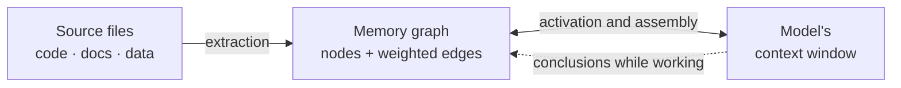
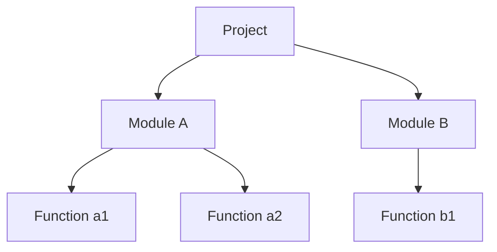
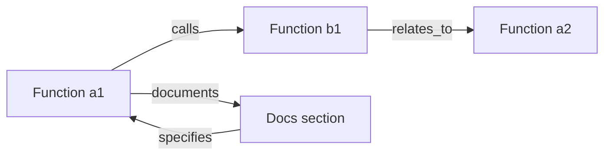
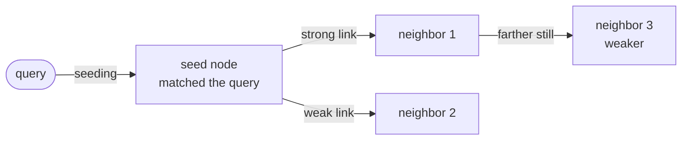
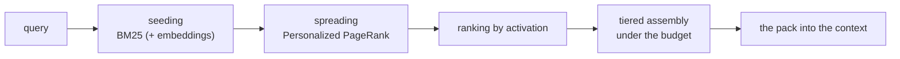
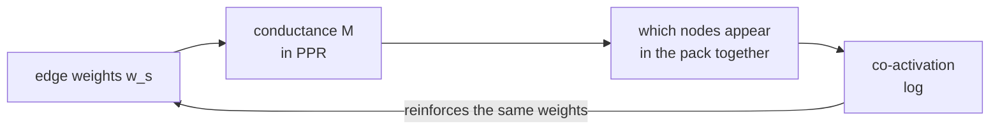
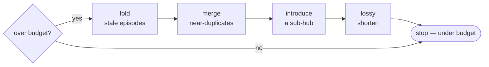
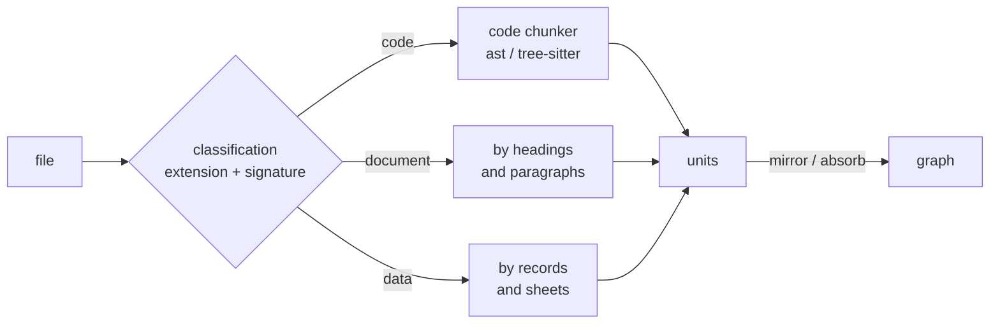
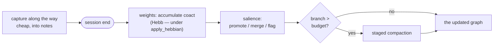

# AMG — Theory and scientific grounding

AMG (Associative Memory Graph) is durable, consolidated long-term memory for language models: a navigable associative knowledge graph laid over the filesystem, with typed weighted edges and retrieval by spreading activation. It is an alternative to the two approaches common today — standard RAG (vector top-k over fragments) and a hand-maintained wiki (Andrej Karpathy's wiki-LLM) — and it borrows the strengths of both.

The most precise characterization of the system is a symbolic-connectionist hybrid. It contains connectionist ideas (a weighted graph; activation that spreads and decays; reinforcement of jointly used links) expressed in a symbolic, human-readable form (Markdown files with a YAML header; explicitly typed edges).

This document describes AMG's theoretical foundations — the model, its mechanisms, and their connection to work in cognitive science, information retrieval, and graph theory. The implementation — file formats, parameters, code — lives in the [architecture documentation](./architecture/README.md).

The methodological frame. AMG's architecture rests on established models from the fields listed. Its numeric constants are tuned empirically; some steps use the language model's judgment (the heuristic component); the main contribution is not any single mechanism but their integration into one system, whose advantage is empirically testable rather than postulated. Properties that admit formal proof (the data-consistency layer) are proven and confirmed by tests; the rest are argued, and this is noted in place.

## Contents

- [0. Problem statement](#0-problem-statement)
- [1. The idea in brief](#1-the-idea-in-brief)
- [2. Three memory layers: complementary learning systems (CLS)](#2-three-memory-layers-complementary-learning-systems-cls)
- [3. Why a graph, not a tree](#3-why-a-graph-not-a-tree)
- [4. Node and edge: the data model](#4-node-and-edge-the-data-model)
  - [4.1. Edge origins: deterministic before the model](#41-edge-origins-deterministic-before-the-model)
  - [4.2. Global semantic linking over the summary layer](#42-global-semantic-linking-over-the-summary-layer)
  - [4.3. Build reproducibility: the derivation cache](#43-build-reproducibility-the-derivation-cache)
  - [4.4. Build economics and resilience](#44-build-economics-and-resilience)
- [5. Principles of human memory: what transfers and what does not](#5-principles-of-human-memory-what-transfers-and-what-does-not)
- [6. Retrieval as spreading activation](#6-retrieval-as-spreading-activation)
  - [6.1. What spreading activation is](#61-what-spreading-activation-is)
  - [6.2. What PageRank and Personalized PageRank are](#62-what-pagerank-and-personalized-pagerank-are)
  - [6.3. AMG's formula (query-biased Personalized PageRank)](#63-amgs-formula-query-biased-personalized-pagerank)
  - [6.4. The key decision: bias, don't gate](#64-the-key-decision-bias-dont-gate)
- [7. Tiered context assembly (general to specific)](#7-tiered-context-assembly-general-to-specific)
- [8. Link weights: Hebbian learning with decay](#8-link-weights-hebbian-learning-with-decay)
- [9. Salience as the value of information](#9-salience-as-the-value-of-information)
- [10. Graph growth: selection into context and compaction](#10-graph-growth-selection-into-context-and-compaction)
  - [10.1. What enters the context](#101-what-enters-the-context)
  - [10.2. Branch compaction](#102-branch-compaction)
  - [10.3. Forgetting as an improvable property, not a copy](#103-forgetting-as-an-improvable-property-not-a-copy)
- [11. Input data: information domains and the classifier](#11-input-data-information-domains-and-the-classifier)
- [12. Two source-processing policies: mirror and absorb](#12-two-source-processing-policies-mirror-and-absorb)
- [13. Consolidation — the plasticity cycle](#13-consolidation--the-plasticity-cycle)
- [14. Evaluation and comparison](#14-evaluation-and-comparison)
  - [14.1. What is derived, what is tuned, what is heuristic](#141-what-is-derived-what-is-tuned-what-is-heuristic)
  - [14.2. Comparison with RAG and with a wiki](#142-comparison-with-rag-and-with-a-wiki)
- [15. The trust model: provenance, confidence, and verification](#15-the-trust-model-provenance-confidence-and-verification)
  - [15.1. The source hierarchy](#151-the-source-hierarchy)
  - [15.2. Provenance: where a fact came from](#152-provenance-where-a-fact-came-from)
  - [15.3. Confidence](#153-confidence)
  - [15.4. Verification: checking before answering](#154-verification-checking-before-answering)
  - [15.5. Usage provenance and breaking the circularity](#155-usage-provenance-and-breaking-the-circularity)
  - [15.6. What is measurable and what is heuristic](#156-what-is-measurable-and-what-is-heuristic)
  - [15.7. Epistemic arbitration: resolving contradictions](#157-epistemic-arbitration-resolving-contradictions)
- [16. The name and the metaphor](#16-the-name-and-the-metaphor)
- [17. Origins: the work AMG builds on](#17-origins-the-work-amg-builds-on)
- [References (selected)](#references-selected)

---

## 0. Problem statement

A language model (LLM) keeps no state between sessions: every new session starts with no memory of the previous ones. Everything the model operates on at any moment sits in the **context window** — a working memory of fixed size, measured in tokens. When the window overflows or the session ends, the accumulated context is lost.

External long-term memory for a model is usually built one of two ways. The first is **RAG** (retrieval-augmented generation): the corpus is cut into fragments, indexed by vector similarity, and for every query the top-k most similar fragments are mixed into the window. The second is a **hand-maintained wiki**: linked pages the model reads as ordinary documents.

Each approach has structural limits (the detailed analysis is in §14). RAG retrieves a flat set of locally similar fragments: it answers poorly the questions that require connecting several sources (multi-hop — where the answer is assembled from several nodes), does not distinguish levels of abstraction, and derives its result afresh on every query, accumulating nothing. A hand-maintained wiki needs constant upkeep and drifts away from its source over time.

**AMG (Associative Memory Graph)** is external memory shaped as a **graph** of linked note-nodes over files on disk. Retrieval rests not on flat similarity but on spreading activation along the links, so the window receives a relevant neighborhood of the graph rather than a scatter of look-alike fragments.



The graph is built from the source files (left), serves the relevant part into the window on request (right), and the conclusions drawn during work are written back into the graph. The whole graph is never loaded into the window — only the activated neighborhood.

---

## 1. The idea in brief

At AMG's core lies one organizing principle of human memory: what gets retrieved is not the whole body of knowledge but the needed fragment together with its closest associative links. When you turn to a task, the relevant facts activate and pull in the adjacent ones; the rest stays dormant. The same mechanism underlies AMG: a query activates the matching nodes, activation spreads along the links to their neighbors, decaying with distance, and only the activated part of the graph is assembled into the window.

Memory is also split into three levels — again reproducing the organization of human memory (§2 in detail): **working** memory (what the model operates on now) — the context window; **episodic** (fresh detailed records) — cheap notes taken during the session; **semantic** (settled, generalized knowledge) — the consolidated graph. The base principle this document returns to in several sections: capture is broad and cheap as you work, while selection, weighting, and compression happen later, at a separate consolidation step, when the full context is available.

---

## 2. Three memory layers: complementary learning systems (CLS)

**The theory's essence.** Complementary Learning Systems (CLS; McClelland, McNaughton & O'Reilly, 1995; updated in Kumaran, Hassabis & McClelland, 2016) explains why the brain's memory is built of *two* complementary systems. The **hippocampus** quickly records individual episodes (what, where, when) — in detail, but disjointedly. The **neocortex** slowly accumulates generalized, structured knowledge. The split exists to avoid *catastrophic forgetting*: if every new impression were written straight into the shared structure immediately, it would destroy what has already been learned. So the new first settles in fast episodic memory and is then gradually and carefully integrated into the semantic. Fast recording and slow integration are two speeds of one system.

**The mapping onto AMG:**

| Cognitive system | AMG layer | Purpose |
|---|---|---|
| Working memory (Baddeley's model) | the context window | the active "here and now" reasoning — the *operational* level |
| Hippocampus — fast episodic recording | cheap notes during the session (append-only) | broad, detailed, loosely structured capture |
| Neocortex — slow semantics | the consolidated node graph | long-term, deduplicated, connected knowledge |
| The semantic network + index | hubs (concentrator nodes) + hierarchical summaries + typed edges | navigation and general-to-specific activation |
| Sleep replay, plasticity | the consolidation step | episode → semantics; link creation and pruning; contradiction resolution |

Hence the base principle of the whole system: capture is cheap and broad as you go; selection, weighting, compression, and forgetting come later, at consolidation. Crucially, *salience does not have to be judged in the moment*: salience is contextual and retrospective — what looks like noise now may later prove key. Since the cost of capture is small and the cost of loss is large, in the moment the system leans toward keeping, and it sorts once the full context is available.

---

## 3. Why a graph, not a tree

This is the central architectural decision.

A **tree** is a strict hierarchy: every element has exactly one parent, like folders in a filesystem. A **graph** is arbitrary links: a node has any number of links in any direction, each with its own weight, sometimes closing into cycles.



A tree expresses only containment. But real knowledge is linked *across* the hierarchy: function `a1` calls `b1` from another module, a documentation section describes `a1`, two functions are related in meaning. A tree physically cannot express this — an element has one parent and there are no cross edges:



**AMG's decision:** the folder tree encodes **only** the part/section relation (`part_of`) — the *spanning tree*, needed for browsing and the namespace (the file's "address" in the hierarchy). All other links live as **explicit typed edges** inside the files, in the **frontmatter** — the YAML header at the top of a markdown file where the node's metadata is stored. The graph is thus independent of the folder layout and works with git, grep, and editors with no extra tooling.

Encoding links in file and folder *names* would be brittle: the system would have to parse names by hand, and any rename would tear the links. Explicit frontmatter edges have no such flaw.

---

## 4. Node and edge: the data model

A **node** is an atomic unit of knowledge: one concept, entity, function, section, or summary. In memory terms a node is closer to an **engram** — a whole memory trace — than to a single neuron (the rationale in §5). Physically a node = one file with frontmatter (metadata) and a body.

An **edge** is a typed, weighted link between two nodes: the relation type (`rel`), the target (`to`), and the strength (`w` ∈ (0, 1]). Edges are stored in the source node's frontmatter.

A node's conceptual shape (the full field schema is in [Data model](./architecture/02-data-model.md)):

```yaml
id: code:src/billing.py::charge_card     # stable identifier
type: function                            # the unit's form
summary: Charges the card ...             # a 1–3 sentence summary (in working_language)
status: active                            # active / stale / superseded
source_path: src/billing.py               # the source (the bearer of truth)
part_of:                                  # home(s) in the hierarchy, weighted
  - {topic: billing, w: 0.7}
edges:                                     # typed links
  - {rel: calls, to: code:src/billing.py::compute_total, w: 0.8}
  - {rel: documents, to: doc:doc/billing.md::overview, w: 1.0}
```

**Edge types** (the full set and their "conductance" are set in `config.yml`, the `relation_priors` block; the complete reference — [Configuration reference](./architecture/09-config.md)). Each type means its own relation and conducts activation differently (the number beside it is the conductance prior β, see §6.3):

- `documents` 0.9 — a documentation node describes a code node;
- `implements` 0.9 — code implements a specification or requirement;
- `specifies` 0.9 — a node sets the specification for another;
- `calls` 0.8 — a function calls a function;
- `depends_on` 0.8 — one node depends on another;
- `inherits` 0.8 — a class inherits from a base class (the subclass–base link is tighter than a call);
- `defines` 0.7 — a module or file defines a function/class, a class defines its methods (the containment backbone);
- `part_of` 0.7 — membership in a topic/hub (the same relation as the spanning tree's);
- `imports` 0.6 — a module import;
- `refines` 0.6 — a refinement or sharpening of another claim (a soft semantic link; set by `amg-builder`);
- `exemplifies` 0.6 — "example → concept": a concrete case illustrates a general rule (set by `amg-builder`);
- `relates_to` 0.5 — a weak "on the same topic" semantic link;
- `supersedes` 0.3 — a new node displaces an outdated one (set by `amg-synth`); it conducts weakly in ordinary search — like `contradicts` — and the displaced node is additionally demoted by the status prior at retrieval;
- `contradicts` 0.3 — a contradiction (conducts weakly in ordinary search, but matters for "where are the contradictions" queries).

For types not listed in the config, the default conductance is 0.5 (`relation_prior_default`).

### 4.1. Edge origins: deterministic before the model

The graph's edges are born in two fundamentally different ways, and the boundary between them is one of the system's load-bearing decisions: **everything derivable from syntax exactly is extracted by code; the model gets only what requires understanding.** Imports, calls, containment (a module defines its functions and classes, a class defines its methods), and inheritance are read from the parsed source deterministically — for free, reproducibly, and without a single model call. Spending judgment on links that can be obtained exactly would mean paying tokens for a worse result: the model answers such questions slower, dearer, and with mistakes that syntactic parsing simply does not make. The judgment layer gets the links of meaning — "this document describes this code", "this example illustrates this rule", "these claims contradict each other" — that is, exactly what syntax does not contain.

The deterministic path has an honesty rule of its own: **a wrong edge is worse than a dangling one.** A dangling edge (whose target does not exist) is simply dropped by retrieval — it is inert; a wrong edge, though, conducts activation the wrong way on every query. So name resolution never guesses: a call binds to a function in another file only through the file's own import table (a name that merely coincides with a module name yields no edge), and the underivable — the language's built-ins, methods of unknown objects, external libraries — never becomes edges at all, so the graph accumulates no noise. The single deliberate exception is an external module import: its edge stays dangling as a record of the import itself.

The same principle continues above the judgment layer's edges as **target canonicalization**: the model says *what* is linked to what, and the code decides *which exact node* is meant. A target written without its full path (the model saw the file but did not know its place in the tree) is bound by a deterministic pass to the single existing node with that path suffix; on ambiguity the target is left alone — "don't guess" again. The judgment layer is thereby also freed from knowing exact identifiers: it needs no directory of all nodes, only to name the link recognizably.

The "deterministic before the model" boundary reaches the summaries themselves. A **trivial** code unit — a one-or-two-line method, a mechanical getter — has no meaning beyond its own text: judgment understands nothing *extra* here, it only retells a line of code at a higher price and with a chance of embellishing. Such a unit's summary is written by code — it becomes the unit's own text — and judgment is spent where there is something to understand. Two exceptions are principled. Protocol methods, whose very presence changes how a class is used (the object is callable; the class is a context manager), go to the model at any size: their semantics is not in the body but in the fact of existence. And a judgment once made is never displaced by the template: if a previous derivation is saved for the unit, restoration returns it verbatim (§4.3) — the deterministic summary covers only what the model has not yet spoken on.

### 4.2. Global semantic linking over the summary layer

Semantic edges are written in two passes, and the reason is an irreducible limit of batch processing. Node summaries are produced by parallel builders, each seeing only its own batch: this makes the build cheap and resilient, but such a builder **cannot, by construction,** deliver cross-domain completeness — it does not know what lies in other batches, and a document, an example, and the code that speak of the same thing remain islands. Completeness of links must come from a separate **global pass**, run after the whole graph's summaries are ready.

The key observation that makes the global pass cheap: **linking does not need the sources — it needs the summary layer.** A summary is precisely the node compressed to its meaning; the whole graph's summary layer fits in hundreds of kilobytes, while the sources run to megabytes. So the "full picture" is achieved not by loading the entire project into one giant context but by feeding the compact semantic layer. Link candidates are proposed by **summary similarity** (over the vectors already computed for seeding, or, without them, by word overlap): two nodes whose summaries speak of the same thing are almost certainly related, and arithmetic can discover that without a model. The model does what arithmetic cannot: it **confirms** the link by meaning, names its type and weight — or rejects a false coincidence of words. The confirmation batches are bounded and parallel, but the completeness is global: candidates come from the whole graph. Already-linked pairs are not re-proposed, so the pass can be run incrementally — as summaries mature it only fills in what is missing.

The order inside the pass is not accidental: **the topic taxonomy must exist before linking.** Sections and examples attach to topic hubs, so the hubs must be born earlier — and born **deterministically**: the topic anchors are derived from the directory structure, and the judgment layer names and refines them instead of inventing the topic set anew on every rebuild. The birth of topics is a global decision with a single owner; hand it to parallel batches and every build would get a different strategic layer.

### 4.3. Build reproducibility: the derivation cache

The model's judgment is non-deterministic: the same unit, submitted twice, gets different summaries, and "the graph is different every time" — even with unchanged sources. Generation settings can reduce the variance, but weaker and dearer than simply **not asking twice**: a derivation once accepted (the summary, the edges, the confidence) is saved under a key made of the unit's content hash, and a from-scratch rebuild restores it verbatim. The same input yields the same graph — reproducibility becomes a practical property, and a re-build costs almost nothing: only genuinely new content is paid for. The key includes the summary language and the derivation contract version — changing either honestly invalidates the cache instead of silently returning summaries in the wrong language or the wrong shape.

### 4.4. Build economics and resilience

The cost of a build performed by an agentic worker is set not so much by the volume of the content as by its **re-sending**: on every turn the worker's entire accumulated context is sent to it again, so one extra "read the file" costs not one file but the whole preceding conversation. Hence two rules. **Data travels to the worker once**: a unit arrives in the assignment together with its text — the very slice its hash was computed over — and the worker has no reason to open the sources. And **the orchestrator operates on aggregates**: its own context, resent on every turn, receives counters and statuses, not content — content is read by the workers in their isolated contexts.

Resilience is the other side of the same discipline. Long non-deterministic work over a large input is interrupted inevitably — by limits, dropped connections, the ceiling on a single response — so batches are bounded up front, and the result is recorded as it ripens in small **completed portions**: an interruption loses the tail after the last portion, not the whole. Finally, **completion is a verifiable claim, not a report**: the worker states "derived N of M", and those numbers are checked against what was actually applied — the system does not take "done" on faith, because torn-off work passed off as finished silently loses units. The crash-safety principle proven for the deterministic layer (§14.1) thus continues onto the judgment layer: there the guarantee comes from the transaction journal, here from durable portions and verifiable counters.

Crucially, all of this economy comes from eliminating **repeated** work — re-reading, re-sending, redoing the lost — not from thinning the meaning: the content of summaries and links does not change, just as with the derivation cache (§4.3), which cheapens a rebuild by the same means — not asking twice.

---

## 5. Principles of human memory: what transfers and what does not

Human memory is an efficient associative store, so borrowing its principles is productive when designing an external memory. But memory runs on a biological substrate, and AMG runs on a filesystem, and not every principle transfers directly. Below, what transfers and shapes the design is separated from what a filesystem must implement differently.

**Transfers and shapes the design:**
- associative organization — a **graph**, not a tree (dense weighted, sometimes cyclic links; §3);
- general-to-specific retrieval — the overview before the details;
- only the relevant subset activates — sparse, query-dependent retrieval;
- the split of working and long-term memory maps onto "window ↔ files";
- link upkeep over time corresponds to synaptic plasticity.

**Implemented differently (a direct transfer is impossible):**
- *The memory unit is not a single neuron.* In the brain, meaning is distributed over populations of neurons, and a single neuron carries almost no meaning. In AMG the unit is a concept node (an engram, a whole memory trace), not a "neuron file"; links between nodes are typed rather than reduced to bare containment.
- *Associations are not encoded in the storage structure.* On a filesystem a link cannot be expressed by a folder name without brittle assumptions (§3); so links live as explicit typed edges.
- *Weights are not learned by gradient descent.* In both biological and artificial neural networks, link strength is tuned by learning (in artificial ones — by gradient descent, backpropagation). In AMG the weights are not learned that way: they are **updated by heuristic rules** — Hebb's, decay, and the model's judgment — with no backpropagation of error. Hence the precise characterization of the system: a **navigable associative knowledge graph with retrieval by spreading activation**, a symbolic-connectionist hybrid — not a trainable neural network.

The design criterion is retrieval quality and maintainability, not biological plausibility.

---

## 6. Retrieval as spreading activation

Retrieval's task: for a query, surface a subgraph that is relevant both strategically and operationally at once — not just locally similar fragments. Below, the mechanism from the ground up.

### 6.1. What spreading activation is

**Spreading activation (Collins & Loftus, 1975; building on Quillian's semantic networks)** is a classic model of memory. Activation starts at the nodes matching the query and flows along the links to neighboring nodes, **decaying with distance**: the farther a node is from the focus, the weaker its activation. In the **ACT-R** cognitive architecture (Anderson) this is formalized: a node's availability = its base level + the activation that flowed in. The result is a ready mathematical apparatus for a node's "activation strength".



A "seed node" is the starting node the activation begins from.

### 6.2. What PageRank and Personalized PageRank are

To compute the settled activation over the whole graph rigorously, AMG uses **PageRank** — the algorithm Google ranked pages with (Page & Brin, 1998). The image: a "random surfer" walks the links forever at random; a page is the more important the more often he lands on it, i.e. the more important pages link to it. Mathematically it is the *stationary distribution* of a random walk over the graph.

Plain PageRank gives "importance in general". We need importance **relative to a query**. That is what **Personalized PageRank** provides (a.k.a. topic-sensitive PageRank; Haveliwala, 2002): from time to time the surfer "teleports" not to a random page but back into a given set of seed nodes. The stationary distribution then expresses importance *relative to those seeds* — that is, relative to the query.

### 6.3. AMG's formula (query-biased Personalized PageRank)

AMG computes the activation `π` iteratively:

```
π = (1 − d) · p  +  d · M · π
```

The symbols:
- `π` — the sought activation of all nodes (what gets ranked);
- `d` — the **damping factor**, `0.85` in the config: how far activation spreads (the "keep walking" share versus "teleport");
- `p` — the **teleport (personalization) vector**: where the surfer returns to, i.e. relevance to the query; the result of **seeding** (§7) goes here;
- `M` — the **transition matrix**: how activation flows over the edges. Its element is the edge conductance `c(u→v) = w_s(u→v) · β(rel)`, where `w_s` is the learned link strength (§8) and `β(rel)` is the edge-type prior from `relation_priors` (§4); the matrix is normalized over each node's outgoing edges.

**Convergence** is guaranteed: for `d < 1` the iteration is a contraction mapping (the Perron–Frobenius theorem), so a few passes converge to a unique `π` regardless of the starting point. In the config, the number of passes is bounded from above (`max_hops: 30`), and nodes below the activation threshold (`activation_threshold: 0.02`) are dropped. The implementation of seeding, the walk, and pack assembly — [Retrieval](./architecture/06-retrieval.md).

The empirical precedent of exactly this construction is **HippoRAG** (Gutiérrez et al., NeurIPS 2024): a knowledge graph plus Personalized PageRank as the computational analogue of hippocampal indexing; on multi-hop questions it convincingly outperforms ordinary RAG.

### 6.4. The key decision: bias, don't gate

Here lies the main subtlety for whose sake the graph makes sense at all.

The naive variant would multiply an edge's conductance by the *target* node's relevance to the query. That **gates** multi-hop paths: a node that is itself irrelevant to the query gets near-zero conductance — and activation cannot flow *through* it to a relevant neighbor. The graph is then useless.

AMG does it differently: query relevance enters **only the teleport vector** `p`. The transition matrix `M` **does not depend** on the query — it is pure structural conductance. Relevance *biases* where activation concentrates but does not *gate* the paths it can take. Multi-hop reach is preserved by construction.

An example. The query is "how are payment failures handled". The `retry_note` node ("retry on gateway error") contains none of the query's words — lexically irrelevant. But it is linked by a `relates_to` edge to `charge_card`, which is relevant to the query and receives teleport mass. That mass flows along the edge and activates `retry_note` — it makes the output, though by words alone it would never be found. This is the graph's edge over flat search.

**Polyhierarchy** (multiple membership, multi-parent) also resolves itself. Let a node have `part_of: {db: 0.7, reporting: 0.3}`. A database query → the DB cluster's nodes are relevant, activation reaches the node "from the DB side" and pulls in the neighbors from there; the "reporting" side stays cold. A reporting query → the mirror image. One and the same node is reached by different paths and pulls in different surroundings depending on the query — no "single parent" ever has to be chosen.

---

## 7. Tiered context assembly (general to specific)

The computed activation must be turned into a pack under the context **budget**. Nodes are laid out by **abstraction tier** — this is the "three levels at once". The tier names come from management planning and are universal: *strategic* — the big picture, *tactical* — the middle level, *operational* — the specifics of day-to-day work; each has its own token budget:

- **strategic** — hubs and overviews (budget `strategic: 4000` tokens);
- **tactical** — summaries of the activated clusters and modules (`tactical: 10000`);
- **operational** — the most active leaf nodes in full (`operational: 24000`): for code this is the `path:line` pointer + the summary, for documentation — the body;
- **periphery** — a list of links (headings) to the next ring of neighbors, not loaded in full (`periphery_links: 60`): the cheap analogue of faint background activation.



**The budget is a ceiling, not a mandatory load.** Per query, the window receives *no more* than the sum of the tier budgets (plus the periphery links), but what actually loads is only the activated neighborhood: if little is relevant, little is pulled in regardless of the ceiling. Weak activation is cut by the `activation_threshold`, so weakly related branches never enter the pack. This ceiling must not be confused with the branch budget of section 10.2: the former bounds the *output volume per query*, the latter the size of a *branch in the graph* before it is compacted.

**Seeding** is the first step: match the query to nodes and give them their initial relevance. By default seeding is **lexical** — BM25 (the classic word-match ranking formula: it weighs a word's frequency in the node against its rarity across the graph). Optionally, **semantic** similarity by embeddings is blended in (the `embeddings` config block; more — [Retrieval](./architecture/06-retrieval.md)): it helps on paraphrased queries but changes **only** the teleport vector — the walk and the assembly are untouched.

**Why greedy packing is near-optimal.** The task "fit the most useful under a budget" is *budgeted maximum coverage*. Utility here is **submodular**, i.e. has diminishing returns: each next node adds the less new the more has already been taken. For such problems the **greedy** algorithm (take nodes by descending activation) carries a proven guarantee — no worse than `(1 − 1/e) ≈ 63 %` of the optimum (Nemhauser, Wolsey & Fisher, 1978). So even the "what fits into the window" step has a rigorous quality bound.

The idea of multi-level, general-to-specific summaries is corroborated by **RAPTOR** (Sarthi et al., 2024 — a recursive summary tree) and **GraphRAG** (Edge et al., 2024, Microsoft — community summaries at several abstraction levels).

---

## 8. Link weights: Hebbian learning with decay

The link strength `w_s ∈ (0, 1]` lives on the edges (not on folders). The intent is to change it by **Hebb's rule** ("what fires together, wires together"): if two nodes often activate in the same queries, the link strengthens; if a link goes long unused, it weakens. New edges start at `default_edge_weight` (`0.5`).

The rule's continuous form is a leaky integrator:

```
dw/dt = η · xᵢ · xⱼ  −  λ · w
```

- `η` — the reinforcement rate (`hebbian_rate: 0.10`): how much co-activation raises the weight;
- `λ` — the decay rate (`decay_rate: 0.02`): how much disuse lowers it;
- the decay term guarantees bounded weights and an analyzable fixed point.

Edges that fall below the threshold (`prune_below: 0.05`) are **pruned** — the analogue of synaptic pruning (the withering of unused synapses). `part_of` membership has a separate simplex constraint (the weights over parents sum to ≤ 1, `part_of_renormalize: true`), so a node's "degree of belonging" to its topics stays coherent; this invariant is maintained **always**, independently of the Hebbian update.

**Two speeds.** To keep retrieval fast and lock-free, co-activation during search is **not written** into the graph immediately — it is only appended to a separate log (append-only). Folding the log, decay, and pruning happen **later**, at consolidation (§13; the implementation — [Consolidation](./architecture/07-consolidation.md)).

### 8.1. Why the Hebbian update is off by default

The Hebbian weight update is **disabled by default** (`weights.apply_hebbian: false`) — a deliberate decision, not an unfinished feature. The reason is the **partial circularity of the co-activation signal**:



An edge's weight affects conductance, conductance affects which nodes end up in the pack together, and "ended up together" is precisely the signal that reinforces the same weight. A rich-get-richer positive feedback loop arises: a strong edge grows stronger merely because it is strong, not because it helps the task. Decay smooths the drift but **proves no benefit**. Uncontrolled Hebb can turn some edges into conductance "highways" and siphon activation mass away from relevant but weakly linked nodes — that is, **silently degrade recall**.

Hence the conservative policy (in the "quality first" spirit of §14 and "evaluation always on"):

- by default, consolidation **only accumulates** the co-activation counter `coact` (it is harmless and feeds the salience rubric, §9) and keeps conductance **static** and predictable (the extraction's structural weights + the initial `default_edge_weight`); a repeated run with no new log changes nothing (idempotency);
- the Hebbian update is enabled **explicitly** (`apply_hebbian: true`) and only after measurement confirms a gain on a **real** graph. Two questions must be distinguished here. The *mechanism's correctness* is testable synthetically: on a graph where the gold node is reachable only over a deliberately weak edge, without reinforcement it misses the output, and after folding the co-activation log it makes it (hop-recall isolates the contribution). But **a synthetic graph rigged in the rule's favor proves only that Hebb *can* help, not that it helps on average** — symmetrically to the possible false negative on a graph whose weights are already optimal. So the *product* decision on the default requires an on/off measurement on a real or representative graph with a genuine log (the recall comparison — §14; the tooling is ready — the eval harness plus configuration comparison). Until such a measurement the default stays `false`: a confidently wrong degradation of recall is more dangerous than a missed optimization;
- an honest, *useful* Hebb requires two changes at once: reinforcement must be *discriminative* — an already-strong edge must not grow for free, or the "highways" are inevitable — and it must feed on a signal *from the task outcome* (the node actually proved useful), not on self-confirming co-activation. How such a rule behaves under measurement, and why the default is still cautious — §8.2.

The principled position: for a language model's memory, **the consolidator's judgment grounded in provenance** (§9) is a more reliable signal of a link's value than the statistics of the system's own outputs. Hebb remains an available instrument, but not the default source of truth.

### 8.2. What the measurement showed

Hebb's idea sounds convincing, which raises the honest question: does it actually help? To avoid answering by guesswork, the blind rule — the one that strengthens a link merely because two nodes "appeared in the same pack" — was tested directly: retrieval recall was compared with the weight update off and on, on graphs of different sizes and under different seedings.

The result proved instructive — and opposite in the two regimes. On a small, densely connected graph, enabling Hebb changed exactly nothing: recall and hop-recall stayed identical to the fourth decimal, no matter how many folds were run. The explanation is simple. When nodes are few and thickly interwoven with edges, spreading activation reaches the whole relevant neighborhood anyway — the outcome is decided by the query seed and the very shape of the graph, not by the exact weight values. Tuning weights in that situation is like turning up the volume where everything is already audible.

But move to a large sparse graph (a couple of hundred nodes strung into long dependency chains — where the needed node is reached multi-hop), and the same Hebb began steadily **degrading** the output. With every fold recall fell: after several passes recall had sagged by roughly a tenth and hop-recall by nearly a seventh, and so under every seeding, lexical and semantic alike. The fall was not a random spike but monotonic: the more folds, the worse.

The cause is exactly the "highways" mechanism the section above fears — now seen in action. The co-activation signal accumulates most on the already-central edges — most outputs pass through them. The blind rule pulls their weight toward the ceiling and they become conductance highways: activation, instead of seeping deep into the graph, drains ever more willingly along these few overloaded links. Meanwhile the nodes reachable only multi-hop — over weak, rarely used edges — are starved of activation mass and drop out of the output. The rich edges get richer at the poor edges' expense, and it is precisely the poor ones that more often lead to the non-obvious but needed knowledge.

The two observations combine into a sharpened principle: **the benefit or harm of the Hebbian update is proportional to how much the answer relies on spreading over edges rather than on the query seed.** When the seed is strong or the graph dense, the seed decides everything — and Hebb is harmless but useless. When the seed is weak or the graph sparse, spreading decides — and then blind reinforcement of the central links actively harms recall. This also explains an earlier deceptive picture: a faint glimmer of benefit once noticed under semantic seeding turned out to be a consequence not of the embeddings as such but of a weakened seed — a deliberately unsuitable model blurred the seed and thereby handed more weight to spreading.

So the conclusion is not "off, just in case" but measured: the blind rule is off by default because in the very regime this memory values most (multi-hop retrieval on a large graph) it makes things worse. For Hebb to help, it needs two changes. First — *discriminative* reinforcement that does not let an already-strong edge grow for free: otherwise highways are inevitable. Second — a signal *from the task outcome* instead of self-confirming co-activation: so that the links that strengthen are the ones that actually helped solve the task, not the ones the system shows itself most often anyway.

**The improved rule and its measurement.** Both changes are implemented — and the same rig where the blind rule did harm showed the opposite. The new rule reinforces an edge only if both its endpoints were *actually used* in an accepted session: the signal comes from a separate usage log (`usage.log`), where the composition of the served packs is intersected with the files the session actually edited. This signal arrives **from outside the retrieval loop**, so reinforcement by it does not self-confirm — the circularity is broken. The reinforcement is *discriminative* — on the headroom to the ceiling, `Δ = hebbian_rate · (1 − w)`: an already-strong edge barely grows, while a weak multi-hop one gets leverage. Symmetrically, an edge that was merely *shown* in packs (co-activation) but never used slowly **fades** — which demotes the very highways the blind rule inflated (a negative outcome, a revert, weakens harder still).

The result on the large sparse graph is the mirror image of the old harm: with every fold recall does not fall but **rises monotonically**, under all three seedings. Over eight folds recall climbed from about `0.60` to `0.85`, and hop-recall from `~0.25` to `~0.70` (BM25, the light static model2vec embeddings, and the multilingual transformer gave a close picture); recall that the blind rule, on the same rig, dropped these same figures monotonically (recall ≈ −0.10, hop-recall ≈ −0.14). On the small dense graph (the dogfood sandbox) the new rule, as expected of a dense graph, barely moves the output — but, unlike the blind one, it does **no harm** either.

An important caveat on the conclusion's status. In both measurements the outcome signal was *synthetic*: each case's gold nodes counted as "used" on success. This honestly verifies that the rule is **correct** and **useful when the usage signal is accurate**, but it does not prove average benefit under a *real* `usage.log`, which is noisier. For that reason — and because weight folding, unlike compaction, is not covered by the automatic recall check — the `apply_hebbian` default stays **`false`**: the rule ships disabled, is safe to enable (with no usage log it simply does nothing, and when acting it is outcome-gated and ceiling-bounded), and is recommended on a project where real usage provenance has accumulated. Flipping the default to `true` awaits a measurement on real usage.

---

## 9. Salience as the value of information

What gets promoted into long-term memory is decided by a **salience** estimate, assembled as **value of information** from several signals; each has its rationale:

- **novelty / surprise** — how much this changes the current model. Formally — *Bayesian surprise*: the Kullback–Leibler (KL) divergence between the "belief before" and the "belief after" (Itti & Baldi, 2009). KL in plain words is a measure of *how strongly the belief changed*. A duplicate → nearly zero (it should be merged); a contradiction or an extension → high;
- **does it carry a decision / constraint / commitment / plan** — these have disproportionately high future value (they get referenced again and again — this is why ADRs, architecture decision records, exist);
- **bridging / connectivity** — does the node join many others, does it bridge clusters (the centrality gain);
- **generality / reusability** — is this a principle valid in future sessions too, or a one-off moment;
- **the cost of reproduction** — a hard-won synthesis is worth storing; a trivially derivable fact not necessarily;
- **the user's signal** — explicit ("remember this") or behavioral (returns to a topic, repetition, recency — the classic markers of memory-trace strength);
- **groundedness / provenance** — does the claim rest on a source (code, docs) or is it an unsupported guess (then it is stored as an "open question", not a "fact"). The origin, confidence, and verification of a fact are carried by a separate layer — the **trust model** (§15).

The signals combine into the final score, and **the threshold sits on promotion into semantic memory, not on deletion.** Hence three safeguards against losing what matters: capture is nearly lossless; promotion is reversible (a later consolidation can raise what proved important in hindsight); forgetting is graduated decay, not erasure. Beyond that, **every node's salience is scored deterministically** — the salience rubric computes the score and writes it into the consolidation plan, so selection is auditable, not a black box (the implementation — [Consolidation](./architecture/07-consolidation.md)). A full-blown *memory decision log* — a separate record with the score and reason for every action — is planned (section 4.3 of the [roadmap](./architecture/11-roadmap.md)); today's action log (`actions.log`) keeps only a transactional audit trail of performed actions (deduped by `txid`, rotated), without scores or reasons.

**Repetition of the same thing.** The same question or fact may surface in different places — this is normal and creates no duplicates. An exact repeat carries near-zero novelty (Bayesian surprise ≈ 0), so consolidation merges close nodes (`merge_near_duplicates`, see section 10.2), preserving all inbound edges. If the repeat carries *new* details, their novelty is above zero: they are woven into the existing node (the summary is extended) or spawn a linked node with an edge, and the repeated reference itself strengthens the edges via Hebb. The result is one topic with all its accumulated details, not several copies.

---

## 10. Graph growth: selection into context and compaction

As the project grows, the graph grows, and the branches (hub subtrees) get larger. Two **independent** mechanisms act here, and they must not be conflated: **selection into context** (what part of the graph enters the window for a specific query) and **compaction** (compression of the graph itself).

### 10.1. What enters the context

What enters the window is determined by retrieval (§6–7), not by the graph's size. Only the activated neighborhood makes it in: strongly activated, relevant branches pass; weakly activated ones (irrelevant to the query) do not — but **they remain in the graph in full**. The volume entering the window is proportional to the size of the activated set, not of the whole graph, so the graph can grow without bound without overloading the window.

The output volume is set by the tier budgets (§7): `strategic` 4000, `tactical` 10000, `operational` 24000 tokens. The defaults are sized for today's large windows (on the order of 10⁶ tokens). This is a **ceiling, not a mandatory load**: the window receives no more than the budget sum, but in fact only the activated neighborhood — so simple queries stay cheap while complex ones get the whole task-relevant neighborhood. The budgets are tuned in `config.yml`: they can be raised (see more at the price of tokens) or lowered.

### 10.2. Branch compaction

Compaction is a separate mechanism, **idle by default** (it compresses nothing while a branch is within budget), that compresses *the graph itself*. It exists not because of the window (the graph is never loaded whole) but to keep retrieval sharp (a bloated branch injects noise into activation) and the walk cheap. A branch is compacted **only** when its **local** budget is exceeded: by default `default_branch_budget_nodes` 400 nodes or `default_branch_budget_tokens` 200000 tokens (whichever is hit first); the threshold can be overridden per branch (the defaults — [Configuration reference](./architecture/09-config.md)). This is the compaction threshold for a *graph branch*; it is unrelated to the per-query output volume of §10.1.

Compression proceeds **stepwise and from the bottom**, stopping as soon as the branch is back under budget (the `steps` config key; the implementation — [Consolidation](./architecture/07-consolidation.md)):



1. `summarize_episodes` — fold stale episodes (old, low-activity notes) into one summary node; the originals go to the archive. This is *semanticization*: the gist stays, the episodic detail departs (Bartlett's schemas, 1932). Decisions and commitments never land here.
2. `merge_near_duplicates` — merge near-duplicates (nodes consolidation flagged as close) into one, keeping all inbound edges.
3. `introduce_subhub` — introduce an intermediate sub-hub (clustering): the branch gets deeper, but every node has fewer direct children — the "width" drops with no node loss.
4. `lossy_shorten` — as the last resort, shorten the bodies and summaries of the least salient nodes down to their gist.

The highly salient is never compressed first: `protect_types: [decision, adr]` (the decisions) and nodes with centrality above `protect_min_centrality: 0.7`, as well as nodes with strong provenance and the recently or frequently activated.

### 10.3. Forgetting as an improvable property, not a copy

Unlike biological memory, whose forgetting is irreversible and involuntary (the forgetting curve — Ebbinghaus, 1885), forgetting here is a **controlled and reversible** choice made for precision and cost:

- by default nothing is compressed;
- a lossy step always **archives the original first** (`archive_dir: archive`): the detail goes to the archive, the gist stays in the graph with a reference; restoration is possible;
- every compression is logged, and its effect is **measured automatically**: before a compaction is applied, retrieval recall is measured by the eval harness on a *clone* of the graph, and the compaction enters the real graph only if recall holds (the automatic recall check, the eval guard). The key metric is whether the gold set makes the *assembled pack* (compaction changes the pack's composition, not just the ranking); on a drop the action is rejected or applied only with a warning. "Evaluation always on" thus becomes a built-in safeguard rather than a manual practice (the implementation, metrics, and thresholds — [Consolidation](./architecture/07-consolidation.md)).

The system thereby removes human memory's main flaw — irretrievable loss. A branch needed later can be restored from the archive, and consolidation can bring back into active memory what hindsight proved important. The graph grows more abstract over time (like memory does), but without irreversible erasure.

---

## 11. Input data: information domains and the classifier

Input information is heterogeneous: it differs in **purpose** and **storage form** — source code; prose (documentation, notes); structured data (JSON, YAML, tables); correspondence logs; binary documents (PDF, DOCX, XLSX). AMG determines each file's **information domain** — the type and purpose of its content (code / document / data) — and routes the file to the corresponding **chunker** (the component that splits a file into unit nodes; the implementation — [Structure extraction](./architecture/04-ingest.md)). The memory engine itself (the store, retrieval, weights, consolidation) is domain-independent: it operates uniformly on nodes, edges, and text.

**Universality.** AMG works with more than code. The memory is **most optimized for code and the documentation accompanying it** (for code it extracts functions/classes and the structural call and import edges, and code and documentation are joined by `documents` edges), but it accepts **any documents**:

- markdown, plain text, and reStructuredText — by headings and paragraphs;
- JSON and YAML — by top-level records, with large nested structures parsed **recursively** by key path so deep nesting does not collapse into one unit; line-delimited JSON (NDJSON) — by lines; CSV tables — as a structural description;
- logs (`.log`) — by episodes: timestamps group lines into windows, so a long log becomes neither one huge node nor a scatter of lines;
- correspondence dumps (chat exports) — by messages, with **turn adjacency** restored (§13);
- PDF, DOCX, XLSX, PPTX — extracted by optional pure-Python libraries (`pypdf`, `python-docx`, `openpyxl`, `python-pptx`); PDF splits by pages, DOCX by heading sections, XLSX as data (the unit is a sheet: its structural description), PPTX by slides. With a library missing, such files are simply skipped, with no failure.



**The sensory-system analogy.** That only the input is domain-dependent while the engine is domain-blind matches the brain's design: it **routes by modality** (the visual, language, motor cortices) and only *then* consolidates everything into one associative memory. The "type-specific vestibule → one graph" arrangement thus matches biology more closely than one undifferentiated stream would.

The same analogy clarifies the "what to ignore" question, which mixes two different tasks:

- **What not to index at all** (caches, `node_modules`, `.venv`, `dist`, binaries) is *not* a job for the model. Running an LLM over tens of thousands of dependency files to be told "skip it" is unjustifiable expense. This is a hygiene question, and hard rules are appropriate here (the industry uses `.gitignore` and linters' ignore lists). The analogue is a **pre-semantic sensory filter**: a single photon is not "comprehended" in order to be discarded. AMG carries a broad built-in ignore list and honors `.gitignore`; the user only adds their own. This control is split by intent (separate lists for mirrors and absorbed sources) and git-independent, and **an explicitly named source overrides the general ban**: if a folder is named a source but listed in `.gitignore`, the explicit intent wins — it is more specific than a generalized convention, and silently losing chosen material would be worse than an extra file.
- **What, of the indexed, matters** — *that* is intelligence's job, and it is the salience rubric of §9, applied *after* the cheap mechanical filter.

The hard ignore is the sensory filter; salience is the value judgment. Both are needed, each in its place.

---

## 12. Two source-processing policies: mirror and absorb

AMG processes any information area under one of two **policies**, and the choice between them is determined not by the data type but by **intent**: will the source be edited, or is it a one-off input. The content's type is detected automatically (§11); the policy cannot be derived automatically, because it is about purpose, not form.

- **mirror** — the graph is the source's *live projection*. Applied to what you edit: source code, the documentation you maintain. Reconciliation maintains the equality of graph and source: file added → a node is created; changed → the node is updated; deleted → the node is purged; **moved or renamed → the earned trace (the summary, edges, weights) follows the content** rather than being lost — a node's identity is content-based (by hash), not address-based, so the memory survives a refactoring of its carrier without re-derivation. The source remains the sole bearer of truth.
- **absorb** — the source is taken into independent nodes but **not frozen**: while it sits on disk, its changes are re-reconciled — just like a mirror's. The principal difference is elsewhere: **deleting the source does not erase the knowledge** — what was absorbed no longer depends on it (the assimilation of a memory trace). Applied to one-off input: correspondence logs, data dumps, third-party documents (say, a PDF report) that you do not maintain. That is, `absorb` is not "once and frozen" but "survives source deletion".

The policy is set at folder level (the `mirror_path` / `absorb_path` keys in `config.yml`) with a sensible default (the reconciliation mechanics — [Reconciliation and semantic derivation](./architecture/05-reconcile.md)). The separation is essential: merging the policies would mean either losing knowledge when a one-off source is deleted, or tolerating the graph silently going stale as code is edited.

The consequence for mirrored sources: **content is stored as a pointer (`path:line`) + a summary + edges, not as a verbatim copy.** The source remains the bearer of truth — this rules out desynchronization under edits and keeps the graph compact. For code this matters especially (a function's body is not duplicated into the graph), but the rule is general for any mirrored material.

Symmetrically — the consequence for absorbed sources: **the graph receives a distillate, not the raw material.** The nodes hold summaries and edges (the body is usually empty), so the graph's volume is markedly smaller than the source material's, and smaller still where similar knowledge exists (close nodes are merged). The gist is preserved, not the verbatim text: a byte-for-byte copy cannot be reconstructed from the graph. An absorbed source can therefore be deleted without losing the knowledge (only the verbatim transcript is lost); it is kept on disk for re-reading, not because the graph references it.

Hence a practical device: if an absorbed source is important and guaranteed access to all its detail is needed, it can be declared a **mirror** even without editing it. The graph then holds summaries and **pointers** to the source, and the full text remains reachable through the reference — the model fetches any detail by opening the source itself. A mirror requires no edits: it merely declares the source canonical and tracked; the price is that the source must stay on disk (its deletion purges the corresponding nodes). Technically both policies keep a pointer to the source, and the difference is the contract: `mirror` holds the source canonical and rebuilds the nodes when it changes, `absorb` permits deleting the source (and then only the distillate remains). So important material that must be kept whole is better run as a `mirror`, and a one-off snapshot as an `absorb`.

**Freezing the absorbed: the third policy, `absorb_once`.** Absorption also has a stricter variant. Ordinary `absorb` re-reconciles the source's changes while it sits on disk; sometimes, though, what is wanted is precisely a **snapshot** — ingest once and no longer react to edits of the original. That is the case when the source is pinned to a moment (a report, a log, an export) while the file itself may keep changing, and those changes must not be pulled into memory. This is the `absorb_once` policy: after the first ingest the node is inert — changes are ignored, as if the source were already deleted — but the node, as with `absorb`, survives deletion. The result is a third point on the "how closely does the graph follow the source" axis: `mirror` follows fully (both edits and deletion), `absorb` follows edits but survives deletion, `absorb_once` follows neither. Choose by intent: do you maintain the source, read it as it changes, or pin its snapshot.

---

## 13. Consolidation — the plasticity cycle

**Capture** and **consolidation** are different operations and must not be confused. *During a session* only cheap capture into notes happens — through a safe transactional API (never by hand-editing graph files) that records notes, decisions, ADRs, open questions, and plans; no heavy graph surgery here. *The consolidation step* (session end, on request, or asynchronously) performs all the "surgery":



At consolidation: fold the co-activation log — by default **accumulate the signal** `coact`, applying the Hebbian weight update only under `apply_hebbian` (§8.1); run the salience rubric and promote, merge, or flag nodes (§9) — including revisiting the **transient** authored states (an open question, a plan): an answered question or a completed plan is promoted into a decision or retired, or else the memory would serve the outdated as current (the same care as with `stale`/`superseded`); resolve contradictions (`contradicts` / `supersedes` + `status`); refresh the summaries up the hierarchy; check the branch budgets and, on overflow, run staged compaction (§10). All of this is performed by **a dedicated subagent in a clean context** — the main dialogue stays light (the implementation — [Consolidation](./architecture/07-consolidation.md); the subagent roles — [Subagents and skills](./architecture/08-agents-skills.md)).

**Two channels of episodic capture.** Capture along the way (the notes) is *selective* fast recording: the model deliberately fixes what it deems worthwhile (a decision, a conclusion, a question). But episodic memory also has a second, *broad* channel — **the dump of the whole session transcript** at the end: a cheap, detailed, loosely structured trace of the entire conversation (exactly the "hippocampal" fast record from the CLS table, §2). Both inputs are episodic: the session dump is ingested like an ordinary source, its turns become episode nodes (type `section`), and consolidation then semanticizes them — folds the accumulated chat, merges near-duplicates, promotes the valuable (§10). The selective notes and the broad dump thus complement each other: some things the model marked deliberately, the rest the dump preserved — and consolidation distills semantics from both. An important hygiene subtlety: **the model's raw hidden reasoning never enters the dump** — what is stored is what was said, not the inner draft of thought. The same broad channel also covers **external correspondence dumps** (chat exports from other tools): they are chunked by message in the same episodic manner.

**Conversation adjacency as the episode's skeleton.** A dumped dialogue — whether our session dump or an external chat export — is not a bag of independent remarks: the turns run in order, and an answer is often spread across several adjacent ones. So when chat is chunked, a **weak adjacency edge** (`follows`) is placed between consecutive turns of one thread: the conversation becomes a connected chain in the graph, and retrieval, having activated one turn, reaches its neighbors — assembling the thought whole instead of plucking out a lone remark. This is the same "retrieve the neighborhood, not a flat top-k" idea (§6) applied to the dialogue's time axis: the structural edge sets the "earlier → later" direction activation flows along, and keeps it query-independent (like all structural edges, §6.4). The edge is deliberately weak — otherwise a long conversation would become a conductance highway, draining mass from the multi-hop periphery (the same effect as over-reinforced weights, §8.1).

Capture and the dump should also be kept apart by **portability**. Selective note capture is universal: it is an ordinary transactional write, works in any agent environment, and survives even a hard kill (each note is its own completed transaction). The transcript auto-dump, though, rests on a specific environment's format and event (in Claude Code — the `SessionEnd` hook with the path to the `.jsonl` transcript). So the portable "the dialogue is not lost" guarantee is precisely the notes along the way; the session auto-dump is a convenient superstructure where the environment provides a transcript. The §12 device applies to a valuable dialogue too: run it as a `mirror` (the `session_policy` key) to keep every detail whole rather than only the distillate.

**The digest as a passive memory channel.** Retrieval has a blind spot: it raises knowledge only *on request*. If the model never turned to the memory (forgot to run a retrieval), what is needed stays invisible — and this is the loop's main practical failure, more dangerous than any ranking miss: the memory exists, but it was not used. So consolidation, beyond weights and salience, produces the **always-on digest** — a small block of the 5–10 most salient standing decisions and open questions, which the entry point loads into *every* session unconditionally. This is the second, **passive** memory channel beside the active query-driven one (§6–7): the key commitments and unresolved questions enter the context on their own, before the first retrieval, and this insurance works even apart from the automation (it is carried by the always-loaded entry-point file itself). Selection into the digest uses the same value-of-information salience rubric (§9) as everywhere; consolidation keeps it fresh (the implementation — [Subagents and skills](./architecture/08-agents-skills.md), the lifecycle layer).

### Pattern nodes: experience transfer and analogy within a project

Beyond the summaries of individual units and the concentrator hubs, the judgment layer produces one more kind of synthesized knowledge — **pattern nodes**: the generalization of a project's recurring experience into a reusable unit. When the same engineering device, fix, or mistake occurs in a project more than once, the memory extracts their shared lesson and stores it as a separate node, so that on a new similar case retrieval raises not only the concrete examples but **the regularity itself**. Four kinds are distinguished: the **architectural pattern** (a recurring solution or structure), the **recurring fix** (the same way of repairing a class of problems), the **anti-pattern** (a recurring mistake worth avoiding), and the **migration recipe** (a reproducible transition from one approach to another).

This is the direct analogue of the neocortex's **semantic generalization** (§2): extract the invariant from many episodes and store it as a generalized rule rather than a scatter of particular cases. Instance nodes are linked to the pattern by the **`exemplifies`** edge — "specific → general"; the pattern itself sits in the strategic tier and surfaces early, like a hub, so when working on a new case the model first sees the general principle and then its examples. This is how **transfer by analogy** works within a project: having activated one case, retrieval reaches along `exemplifies` to the pattern and to its other instances — "we've solved something like this before, this way".

The discipline here is the same as for all judgment (§15): **a false analogy is more dangerous than a missed one**. A pattern is introduced only when several genuine instances exist, and an instance node is linked to it only when it **truly** fits — the quality of these links is watched by the false-analogy-rate measurement. And the patterns are **project-local**: they generalize this repository's experience, not shared memory between projects (the latter is deliberately not built — the graph is always local, see §12).

---

## 14. Evaluation and comparison

### 14.1. What is derived, what is tuned, what is heuristic

Not everything in this field is formally derivable, and the boundaries matter. The field as a whole is grounded architecture + empirical tuning + tests, and AMG belongs to the same category.

- **Derived / formally grounded:** PPR retrieval (convergence via Perron–Frobenius, the power method); the bounded fixed point of Hebb with decay; Bayesian surprise as a defined quantity; the `(1 − 1/e)` greedy-coverage bound; graph-over-tree (a tree is a special case of a graph).
- **Tuned, not derived:** the constants — `damping`, `hebbian_rate`, `decay_rate`, `activation_threshold`, the tier and branch budgets, the weights inside the salience rubric. They are chosen empirically.
- **Heuristic:** the steps involving the model's judgment — summaries, proposed semantic edges, decisions on duplicates and merging, on promotion. Softened by hash checking and provenance, but not eliminated.
- **Provable and proven:** the consistency and crash-safety layer (atomic writes, the write-ahead journal with declarative redo, the single writer lock, lock-free reads). This part admits proof and has been run through tests (see [Storage and transactions](./architecture/03-storage.md) and the formal model `consistency-model.md`).

Crucially, all of the above is **measurable**. The eval harness (a set of labeled queries with gold nodes) asks multi-hop questions and checks whether the needed nodes made the assembled pack (the tools and metrics — [Evaluation and tools](./architecture/10-eval-tools.md)). The metrics:

- **recall** — the share of the gold relevant nodes that made the output;
- **precision** — the share of the output that is actually relevant;
- **hop-recall** — recall over the gold nodes reachable only through a chain of edges (not by direct word match); this is the metric that isolates spreading activation's contribution over flat search.

The system's advantage thereby becomes a measured quantity, not an assertion.

### 14.2. Comparison with RAG and with a wiki

**Against ordinary RAG** (top-k by vector similarity over fragments).

AMG wins on:
- *multi-hop and synthesis* — RAG pulls locally similar fragments and is poor at "connect several sources" tasks;
- *levels of abstraction* — RAG returns flat fragments of one granularity;
- *accumulation* — AMG's links are built ahead of time and accumulate; RAG re-derives its result on every query;
- *consistency with the source* — AMG reconciles against the disk; a RAG index silently goes stale;
- *explainability* — the activation path can be inspected (`retrieve.py --explain` shows, for the top nodes, the edges with the largest inflow of mass), whereas vector similarity cannot be explained;
- *awareness of code structure* — call edges versus blind similarity.

AMG loses, or costs more, on:
- *simplicity and maturity* — RAG is simpler and long since debugged;
- *cold start* — RAG indexes and works immediately; AMG needs the graph built first;
- *upkeep cost* — AMG spends inference on consolidation; RAG spends almost none;
- *raw recall on giant static corpora* (millions of documents) — there vector search is cheaper and hard to beat.

The upshot: AMG is better for bounded, evolving, structured knowledge (a codebase with documentation and decisions) and worse for huge static search. Within AMG itself, RAG is used as a component (seeding before activation), not as the alternative.

**Against a hand-maintained wiki** (the closest analogue).

AMG adds:
- algorithmic graph retrieval (activation) instead of manual index navigation;
- a consistency and crash-safety layer a wiki does not have;
- the "salience → consolidation → forgetting" cycle instead of manual, on-command upkeep;
- automatic reconciliation with the on-disk source.

The wiki wins on:
- simplicity — nothing to build or maintain programmatically;
- full human readability with no tooling at all; the convenience of manual curation and reading.

The upshot: for automatic memory over a changing codebase, AMG's advantages are exactly what a bare wiki lacks; for static material maintained and read by hand, a wiki may suffice.

---

## 15. The trust model: provenance, confidence, and verification

Memory that answers confidently and **wrongly** is more dangerous than empty memory. A summary written three refactorings ago and served as fact will make the model lie convincingly, whereas an empty graph at least stays honestly silent. So on top of associative retrieval sits a separate layer — the **trust model**: every significant fact knows its origin and degree of confidence, and a claim about code is checked against the live source **before** an answer leans on it. This layer does not fight for output completeness (§6–7 owns that) — it fights *confidently-wrong* knowledge.

### 15.1. The source hierarchy

Not all knowledge sources are equal, and when they diverge, the priority is fixed and descends thus:

```txt
current code  >  current documentation  >  ADR (a recorded decision)
              >  a fresh session  >  legacy documentation  >  the model's guess
```

The order's logic is simple: code is what *actually executes*, so in a "summary versus source" conflict the source wins. Documentation expresses intent and usually lags the code; a recorded decision (ADR) is valuable long-term but describes a choice, not the current implementation; a fresh session's conclusion is useful but not yet confirmed; old documentation and an unsupported model guess are the weakest links. This hierarchy is not decoration but a resolution rule: the marking of facts at retrieval rests on it, and so does contradiction arbitration.

### 15.2. Provenance: where a fact came from

**Provenance** is a node's recorded origin. The key implementation principle: a mirror projection's origin **already exists** in its ordinary fields — `source_path` (where from), `source_hash` (exactly what content the summary was built on), `lineno`/`line_end` (which slice of the source). Duplicating them into a separate block would create two diverging sources of truth. So the `provenance` block adds only what the flat fields lack: **`kind`** — the information domain of origin (`code` / `doc` / `data` — by the source's category; `user` / `model_inference` — for authored and synthesized nodes) — and the optional **`commit`** (the git mark at extraction time, groundwork for the team mode). For authored notes, `kind` distinguishes **`user`** (the human said it — grounds for trust) from **`model_inference`** (the model's conclusion, not yet confirmed). For synthesized nodes (hubs) and notes derived from other nodes, the origin is recorded by `provenance.derived_from` — the list of ids the fact was distilled from, since they have no source file of their own. The full field schema — in [Data model](./architecture/02-data-model.md).

### 15.3. Confidence

`confidence` is a number in 0..1 — an estimate of how much a node's summary can be relied on. The judgment layer sets it: the builder (`amg-builder`) scores its summary (≈0.9 for a clear unit, lower where the code is opaque or the conclusion speculative), while authored notes default by type — higher for a recorded decision, lower for an open question. What matters is that **confidence is a displayed signal, not an activation valve**: low confidence *marks* the fact with a warning but does not demote it in the output. The reason is the same as with `stale` (§6, the status prior): a freshly edited node whose summary has not caught up is often exactly the one you need; burying it would do harm, so it is flagged, not penalized.

### 15.4. Verification: checking before answering

Provenance and confidence are *recorded* knowledge about a fact; verification is an *act*: checking a claim against the live source right before uttering it. The light check (`verify_claims`) takes a code node and re-chunks its current file with the same chunker used at structure extraction, then compares:

- the file is gone → `contradicted` (the source vanished);
- no unit with this id in the file → `contradicted` (the symbol/section was removed);
- the content hash diverged from `source_hash` → `stale` (the source changed after the summary was written);
- the hash matches → `verified`.

The value of a *live* check is that it catches drift the graph has not yet seen: the file is edited mid-session, reconciliation has not run — yet the pre-answer check already knows the summary is stale. The method is recorded (`ast` for Python, `grep`-level for other code, `doc` for documents), making the check auditable. Like confidence, verification **flags rather than demotes**: the pack adds a mark to the node (`stale` / `unverified` / `contradicted` / low confidence), and the decision to re-check stays with the model — it confirms only the claims it actually uses, not the whole pack. By default the check only reads (even the read-only retriever can run it); a separate writing pass can stamp the result into the graph for audit.

### 15.5. Usage provenance and breaking the circularity

Memory has a tempting but **circular** signal: "which nodes made the pack together". It is circular because it closes on itself — the weights determine the pack, the pack yields the co-activation pairs, the pairs reinforce the same weights (§8.1); it carries no discriminating information, and blind reinforcement by it only inflates the already-strong "highways". For the weights to learn honestly, a signal is needed **from outside the retrieval loop** — from the task's outcome.

That signal is **usage provenance**: which nodes were not merely retrieved but **actually used** — their source was edited in the session's accepted work. It accumulates in a separate log (the session's pack composition intersected with the actually edited files), deliberately **separated** from the blind co-activation log. The difference is principled: pack membership is generated by the loop itself, while usage comes from outside — from what the human did with the node. Reinforcing the "useful" by such a signal therefore no longer self-confirms. This is the substrate of the honest weight rule (§8.2): when weight learning is on, the rule reinforces the links between nodes co-used in an accepted session and fades only those *shown but not used*; while learning is off by default, the provenance simply accumulates.

### 15.6. What is measurable and what is heuristic

The trust layer is mixed by nature, and this deserves saying plainly. **Verification is measurable**: a file's existence, a hash match, a symbol's presence are deterministic checks with unambiguous outcomes. **Provenance is a recorded fact**: the origin and hash are recorded, not guessed. **Confidence, though, is a heuristic**: a model's estimate, useful as a signal but not a proof. So the trust layer does not *eliminate* the risk of the heuristic steps (summaries, semantic edges, estimates) — it **exposes** it: it flags the unverified, demotes the arbitration-retired, forces a re-check of the stale. The goal is modest and honest: less confidently-wrong knowledge, with the remaining uncertainty visible rather than silent.

### 15.7. Epistemic arbitration: resolving contradictions

The source hierarchy (§15.1) says *who* is right in a conflict; arbitration is the procedure that turns it into a decision. The intent is single: a new fact contradicting an old one must not merely append a "contradicts" edge and leave both sides smoldering in memory as equals. A memory holding two incompatible claims without a verdict will serve both on a query — and again force the model to choose blindly at exactly the moment when the choice was once already possible. A contradiction is therefore not a record but a task to resolve.

It is resolved in three steps, the first two deterministic and the deciding one judgment. First the contradiction must be **noticed**: it is surfaced by an explicit "contradicts"/"supersedes" edge set by the judgment layer at synthesis, and by a failed live check (a node's summary diverged from its source). Then the sides are **compared** along the same axes the trust layer carries — the source's rank in the hierarchy (current code above documentation, that above ADR, and so on), recency, and confidence. And only then is the **verdict** issued — by the model, because rank and recency merely narrow the choice, while recognizing whether *it is the same fact* and whether *it truly contradicts* takes an understanding of meaning. This is AMG's usual division: deterministic code nominates the candidates and applies the decision; the meaning is the model's.

There are five verdicts, in descending definiteness of the conflict:

- **supersession** — one side is clearly stronger (current code against an outdated documentation summary): the losing claim is marked "superseded", stays in memory for history, but is demoted in ordinary output;
- **rejection** — the claim is plainly false (refuted by a stronger source or a live check): marked "rejected" and demoted hardest;
- **dispute** — the conflict is real and the winner not obvious: both sides are marked "disputed" and linked, so retrieval **shows** the conflict rather than hiding it;
- **ask the user** — like a dispute, but the decision matters and the grounds are insufficient: the conflict is raised to the human;
- **keep both with context** — the sides do not actually contradict, each being true under its own conditions: both stay active, merely linked.

The through-principle is **surface, don't resolve silently**. In doubt, a dispute is chosen over a supersession: demoting wrongly means hiding the correct, whereas a dispute merely puts both options side by side. This directly extends §15's stance: the goal is not maximum output but less confidently-wrong. Two consequences follow. First, all verdicts are **reversible** — they change status and add a link but delete nothing, so a mistaken verdict is corrected as easily as it was issued. Second, the old is displaced by **verifiable origin, not by reference frequency**: the winner is the side whose source is fresher and more authoritative, not the one consulted more often — otherwise memory would entrench the habitual instead of the true (the same self-reinforcement trap as the blind weight rule's, §8.1).

Finally, every decision must have a **visible basis**. A memory that silently swaps one fact for another rewrites the past unnoticed; so every verdict lands as a separate record in the audit trail — what was decided, on which nodes, for what reason, and which sources were compared. A human can see *why* the memory considers one fact to have displaced another, and can dispute it. And when history or contradictions are asked about **deliberately** ("what was here before", "show the contradictions"), retrieval temporarily lifts the demotion of superseded and disputed nodes (§6): there is no point hiding the past when the past is exactly what was asked for.

---

## 16. The name and the metaphor

Three labels of different precision could hypothetically be hung on the system; they are distinct and not interchangeable:

- **"Associative Memory Graph" (AMG)** — the accurate name: concept nodes, typed weighted edges, associative retrieval by spreading activation.
- **The long definition** — "a typed knowledge graph with hierarchical summaries and general-to-specific activation over a filesystem" — an expanded, equivalent formulation of the same.
- **"A neural-network architecture for the filesystem"** — a metaphor, not a rigorous term. As a technical name it is incorrect: in a neural network the weights are learned (in an artificial one — by gradient descent), whereas in AMG they are assigned by rules (Hebb + decay + the model's judgment), with no backpropagation training. As a figurative opener with an explicit caveat ("inspired by the principles, implemented differently") it is admissible; as a term in technical text it is not.

### The symbolic canon versus a distributed substrate (hypervectors / VSA)

AMG is a symbolic-connectionist hybrid, but its substrate is deliberately **symbolic and human-readable** (markdown nodes, explicit typed edges). The extreme connectionist alternative is **hyperdimensional computing / vector-symbolic architectures (VSA)**: concepts are encoded as random high-dimensional vectors, and the binding, bundling, and permutation operations perform symbolic acts — the role–filler relation, the analogy "A is to B as C is to what" — directly in distributed vector form. The natural question arises: should such a layer underlie the memory?

The answer is **not as a replacement for the canon, and for now not as a mandatory layer**, for three reasons:

- **The canon must remain the source of truth and stay readable.** AMG's value is that the memory can be opened, diffed, hand-corrected, and checked against the source. A hypervector is unreadable and cannot be restored to its original form — as a foundation it would destroy this invariant. The only admissible role is a **derived, recoverable index** over the graph (like the SQLite retrieval index or the embedding cache), never the canon.
- **The scale does not justify it.** VSA shines at enormous volumes and where a holographic "many-in-one-vector" bundling is needed. AMG's graph is thousands, tens of thousands of nodes; retrieval over it (spreading activation, PPR) is already cheap and precise. A second heavy index for a regime that does not exist is complexity without measurable benefit.
- **There is nothing to measure the benefit on.** The single niche where VSA could contribute — fast **analogy** ("this case resembles that one") over a very large set — is already partly served by the embeddings in seeding (§7) and by **pattern nodes** (experience transfer through explicit edges, the patterns section of §13), readably and verifiably at that.

The conclusion (a recommendation, not a prohibition): a hypervector/VSA layer is possible **only** as an experimental **derived** index over the symbolic graph, and justified only when a concrete measurable pain appears (large-scale analogy), which today does not exist. The symbolic markdown canon remains the foundation — the same "the base is the source of truth" logic as for every generated index in the system.

---

## 17. Origins: the work AMG builds on

AMG is an integration of several long-developed directions; each is responsible for its own part of the system.

**Personal hypertext and knowledge graphs.** The Memex (Bush, 1945), Engelbart's work (1962), Nelson's hypertext, and the Zettelkasten method (Luhmann) — atomic notes with stable identifiers, densely linked, where structure is *emergent* rather than imposed from above (a direct warning against deep rigid hierarchy). Today this is Obsidian, Roam, Logseq — with bidirectional links and a graph view.

**From RAG to graph retrieval.** RAG proper (Lewis et al., 2020). Then GraphRAG (Edge et al., 2024, Microsoft — a knowledge graph with hierarchical community summaries, the answer assembled by walking the levels), RAPTOR (Sarthi et al., 2024 — a recursive summary tree), and HippoRAG (Gutiérrez et al., 2024 — a knowledge graph plus Personalized PageRank as the analogue of hippocampal indexing). HippoRAG is the closest precedent to AMG's activation-based graph retrieval and the grounds for expecting PPR to beat flat top-k on multi-hop.

**Agent memory.** MemGPT / Letta (2023) — an operating-system-style memory hierarchy ("context = RAM, external storage = disk"), where the model itself pages the relevant material into the window — virtual memory for the context. Generative Agents (Park et al., 2023) — a memory stream plus *reflection* (synthesizing higher-level observations from lower ones), which corresponds exactly to AMG's hierarchical consolidation, and retrieval by recency, importance, and relevance.

**Code.** Aider's repo-map already implements half of AMG's "code" part: it builds a repository map via tree-sitter and ranks it with PageRank over the symbol reference graph, to fit only the most relevant into the context. LSP, tree-sitter, the Code Property Graph, and call graphs provide the dependency graph automatically — the `calls` / `imports` / `implements` edges need not be written by hand.

**A parallel.** HNSW (the standard index under vector search) is itself a navigable graph with hierarchical layers and a general-to-specific walk. AMG is, in a sense, the same idea in symbolic, human-readable form.

---

## References (selected)

The sources for the mechanisms mentioned — a reading list, not a claim of novelty for any single element; AMG's contribution is their **integration**. The mechanisms' substance is explained in the text; here, the attribution.

- Anderson, J. R. — *ACT-R*: base-level activation + spreading activation.
- Baddeley, A. — working memory.
- Bartlett, F. C. (1932). *Remembering* — schema theory.
- Bush, V. (1945). *As We May Think* — the Memex.
- Collins, A. M., & Loftus, E. F. (1975). Spreading-activation theory of semantic processing.
- Edge, D., et al. (2024). *GraphRAG* (Microsoft).
- Ebbinghaus, H. (1885). *Über das Gedächtnis* — the forgetting curve.
- Friston, K. — the free-energy principle.
- Gutiérrez, B. J., et al. (2024). *HippoRAG: Neurobiologically Inspired Long-Term Memory for Large Language Models.* NeurIPS 2024. arXiv:2405.14831.
- Haveliwala, T. H. (2002). *Topic-sensitive PageRank.* WWW 2002.
- Itti, L., & Baldi, P. (2009). Bayesian surprise attracts human attention.
- Kumaran, D., Hassabis, D., & McClelland, J. L. (2016). The updated CLS theory.
- Lewis, P., et al. (2020). Retrieval-augmented generation (RAG).
- Luhmann, N. — the Zettelkasten method.
- McClelland, J. L., McNaughton, B. L., & O'Reilly, R. C. (1995). Complementary learning systems in the hippocampus and neocortex.
- Nemhauser, G. L., Wolsey, L. A., & Fisher, M. L. (1978). Submodular maximization and the `(1 − 1/e)` bound.
- Packer, C., et al. (2023). *MemGPT* (Letta).
- Page, L., & Brin, S. (1998). PageRank.
- Park, J. S., et al. (2023). *Generative Agents* — the memory stream + reflection.
- Sarthi, P., et al. (2024). *RAPTOR* — a recursive summary tree.

*The years and venues are given as recorded when this document was prepared; before formal publication they should be checked against the primary sources.*
