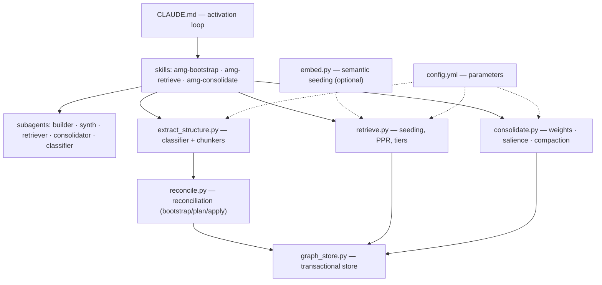
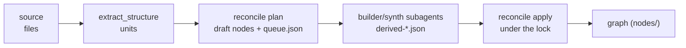
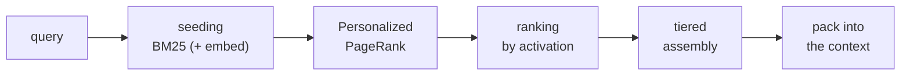
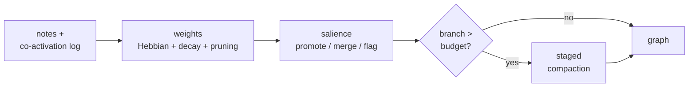

# 01 — The big picture

This document surveys the system as a whole: what modules it consists of, how they interact, and what data flows between them. The details of each module live in the per-module documents (links at the end and in the [documentation map](./README.md)). Here — the bird's-eye view.

## The core principle: a deterministic layer and a judgment layer

AMG is built on splitting the work into two channels that must never be mixed.

**Structure — mechanically, with no model.** Python scripts extract the data skeleton and do all the deterministic processing: parsing files into units (`extract_structure.py`), transactional storage (`graph_store.py`), reconciling the graph with its sources (`reconcile.py`), retrieval via Personalized PageRank (`retrieve.py`), weight recomputation (`consolidate.py`). This layer is cheap, exact, reproducible, and needs no language model.

**Meaning — by the language model.** Subagents (isolated instances of the model, each in its own context) do what requires understanding: node summaries, meaning-bearing edges (`documents`, `depends_on`, `contradicts`), salience estimates, resolving ambiguous classification cases. This layer adds semantics on top of the deterministic skeleton.

The boundary between the layers saves the key resource — model tokens. Expensive semantic work runs only over the units that actually *changed*: every unit is hashed by content, and on a re-run everything unchanged is skipped (the content-hash filter; see [Reconciliation and semantic derivation](./05-reconcile.md)). The skeleton can be rebuilt at any moment for free; the semantics — only where it has gone stale.

## Module map

The modules are grouped by layer: orchestration on top, functional modules in the middle, the transactional store and configuration at the base. Solid arrows are calls and the build flow; dashed ones are parameter reads and optional enrichment.



Each module's purpose and command-line interface (details in the per-module documents):

| Module | File | Role | CLI |
|---|---|---|---|
| Store | `graph_store.py` | transactional node reads/writes, journal, lock, recovery | `init` · `recover` · `verify` |
| Structure extraction | `extract_structure.py` | classifying a file's type and chunking it into units | `<path>` · `--stats` |
| Reconciliation | `reconcile.py` | diffing the graph against the sources, the derivation queue, apply; the derivation cache, connectivity metrics, and the store invariant audit | `bootstrap` · `plan` · `apply` · `apply-cached` · `metrics` · `audit` |
| Note capture | `notes.py` | safe transactional writes of authored nodes (decision / conclusion / plan / open question) | `add` |
| Queue partitioning | `partition_queue.py` | splits `work/queue.json` into bounded batches for parallel builders: grouping by subtree + caps on unit count and text volume | `[<root>]` · `--depth` · `--max-units` · `--max-chars` · `--priority` |
| Queue summary | `inspect_queue.py` | queue counters (category / subtree / kind / with text) + build progress as a percentage | `[<root>]` |
| Linking candidates | `link_candidates.py` | batches of cross-domain edge candidates (summary similarity) and hub anchors for global linking | `[<root>]` · `--hubs` |
| Retrieval | `retrieve.py` | seeding → PPR → tiered pack assembly | `"<query>"` · `--store` |
| Semantic seeding | `embed.py` | optional embedding enrichment of the seed; diagnostics | standalone run (diagnostics) |
| Read index | `index_store.py` | a generated SQLite cache under `load_nodes` (automatic, disposable, rebuildable) | — (internal) |
| Verification | `verify_claims.py` | checking a code claim against the live source (file/symbol/hash) before answering; read-only, optional `--write` | `<id>` · `--store` · `--write` |
| Consolidation | `consolidate.py` | weight folding, salience, branch compaction, digest generation | `weights` · `plan` · `digest` · `apply` |
| Lifecycle | `lifecycle.py` | a thin orchestrator: session hook entry points (recovery, weight folding, digest, transcript dump, the gated mid-session reminder) and the `/amg` control operations; duplicates no graph logic — it calls `graph_store` and `consolidate` | `session-start` · `session-end` · `prompt-hint` · `status` · `on` · `off` · `repair` |
| Schema migration | `migrate_schema.py` | a one-shot pass that brings an old graph to the current schema canon (`source_kind`, grammar-level `type` values, edge `origin`, trust-layer fields) | `[<root>]` |
| Evaluation | `eval_retrieval.py` | recall / precision / hop-recall against a lexical baseline | `--make-demo` · `--cases` |
| Benchmark | `bench.py` | speed at scale: scan vs index, `retrieve`/`eval`/bootstrap | `--make-bench` · `--store` |
| Inspection | `inspect_graph.py` | a node listing (id, type, summary) for labeling and review | `--grep` · `--bucket` |
| Visualization | `export_graph.py` | exports the graph to JSON and a self-contained 3D viewer; read-only | `--open` · `--json` |

Key modules ship with a selftest (`selftest_*.py`) that checks their invariants: `graph_store`, `reconcile`, `retrieve`, `embed`, `consolidate`, `notes`, `migrate_schema`, `lifecycle`, `index_store` (`selftest_index`), `verify_claims` (`selftest_verify`), usage provenance (`selftest_usage`), `bench` (`selftest_bench`), the graph export (`selftest_export`), the queue helpers (`selftest_queue`), the build pipeline (`selftest_build`), the ignore rules (`selftest_ignore`), session saving (`selftest_sessions`), and pattern nodes (`selftest_pattern`); structure extraction is exercised through `selftest_extract_overrides`, `selftest_stage2`, and `selftest_chunkers`. `eval_retrieval.py` and `inspect_graph.py` have no selftest of their own — they are exercised indirectly through `selftest_retrieve`/`selftest_consolidate`. Selftests are not part of the working flow; they are run by hand when things change.

Orchestration is described in [Subagents and skills](./08-agents-skills.md): `CLAUDE.md` defines the activation loop (what to do at the start of a session, along the way, and at the end), skills are procedures (build, retrieve, consolidate), and subagents are the executors of semantic work in isolated contexts.

## Repository structure and orchestration

Physically the system splits into a **control plane** (the portable "engine" — code, skills, subagents, configuration) and a **content plane** (a specific project's graph, created as you work in its `.claude/`). The names `.claude` (the agent directory) and `CLAUDE.md` (the entry point) here and below are the Claude Code defaults; another environment substitutes its configured names (for example, `.agents` / `AGENTS.md`). The control-plane layout:

```
config.yml                       default parameters
CLAUDE.md                        activation loop (template)
agents/                          subagents — one file per role
  amg-builder.md                 summary and meaning-bearing edge generation
  amg-linker.md                  global linking: confirming cross-domain candidates
  amg-classifier.md              resolving ambiguous file types
  amg-consolidator.md            judgment during memory consolidation
  amg-retriever.md               pack assembly (read-only)
  amg-synth.md                   the graph's strategic layer + audit
skills/                          skills — procedures (when and how)
  amg-bootstrap/
    SKILL.md
    references/consistency-model.md     the formal consistency model
    scripts/  extract_structure.py · graph_store.py · reconcile.py · notes.py · lifecycle.py ·
              link_candidates.py · partition_queue.py · inspect_queue.py · migrate_schema.py · selftest_*.py
  amg-retrieve/
    SKILL.md
    scripts/  retrieve.py · embed.py · verify_claims.py · eval_retrieval.py · inspect_graph.py ·
              export_graph.py · index_store.py · bench.py · viewer/ (3D-viewer assets) · selftest_*.py
  amg-consolidate/
    SKILL.md
    scripts/  consolidate.py · selftest_*.py
docs/                            documentation (ru / en)
```

The content plane (the project's graph) is created in `.claude/amg/` and is described in [Data model](./02-data-model.md) and [Storage and transactions](./03-storage.md): the `nodes/`, `journal/`, `work/`, `cache/`, `archive/` directories, the `LOCK` and `actions.log` files, and the local `config.yml`. Initialization creates only `nodes/<bucket>/` and `journal/`; `work/`, `cache/`, `archive/`, `actions.log`, and `LOCK` appear as needed.

The scripts find the store root themselves (the `resolve_amg_root` chain — [Storage](./03-storage.md)): it tells an installed store apart from an unpacked AMG source checkout (a directory named `amg` that carries `skills/` or `install.py` is not a store) and from the global personal-defaults config `~/<agent dir>/amg/config.yml` — an optional layer that a global install places next to the engine and that the project's local `config.yml` overrides key by key ([Configuration reference](./09-config.md), "Two layers").

**Skills are procedures; subagents are the executors of semantic work.** A skill (a `SKILL.md` file) describes *when* and *how* to perform an operation: it runs the deterministic scripts and delegates understanding to subagents. A subagent (a file in `agents/`) is an isolated instance of the model with its own toolset and its own model, working in a separate context. What each skill runs:

| Skill | Runs scripts | Invokes subagents |
|---|---|---|
| `amg-bootstrap` | `graph_store.py`, `extract_structure.py`, `reconcile.py`, `partition_queue.py`, `inspect_queue.py`, `link_candidates.py` | `amg-classifier`, `amg-builder`, `amg-synth`, `amg-linker` |
| `amg-retrieve` | `retrieve.py`, `embed.py`, `verify_claims.py`, `eval_retrieval.py`, `export_graph.py` | `amg-retriever` |
| `amg-consolidate` | `consolidate.py`, `notes.py` (capturing conclusions) | `amg-consolidator` |

The subagent roles (full prompts and instructions — [Subagents and skills](./08-agents-skills.md)):

| Subagent | Model | Tools | Role |
|---|---|---|---|
| `amg-classifier` | haiku | Read, Grep, Glob | assigns a type to files the deterministic classifier flagged as ambiguous |
| `amg-builder` | sonnet | Read, Grep, Glob, Bash, Write | from a batch of queued units, writes a summary and meaning-bearing edges → `derived-*.json` |
| `amg-synth` | opus | Read, Grep, Glob, Bash, Write | builds the top level (hubs from deterministic anchors, strategic-layer edges, weighted multi-membership) and the gap report |
| `amg-linker` | sonnet | Read, Grep, Glob, Bash, Write | global linking after synthesis: confirms cross-domain candidates in batches, in parallel |
| `amg-retriever` | haiku | Read, Grep, Glob, Bash | assembles the pack (read-only), returns its location and a short summary |
| `amg-retriever-fork` | inherits the caller's (a `context: fork` agent, Claude Code only) | inherited | the context-informed memory consult: reads the pack in its own window, returns a short distillate weighed against the session |
| `amg-consolidator` | opus | Read, Grep, Glob, Bash, Write | decides what to promote, merge, summarize, group under a sub-hub, shorten, or retire → an actions JSON |

The workers' `Write` is scoped by their prompts to their **own artifacts** under `work/` (checkpoint parts, the gap report, the actions file) — sources and node files stay read-only; the tool exists because writing JSON through a bash heredoc tears on quotes and apostrophes in real summaries.

## Data flows

The system lives in three processes, each with its own flow. They are independent and run at different moments.

**Structure extraction — building and updating the graph** (runs at startup and when sources change). Sources are read strictly read-only; only the sequential `apply` under the lock changes the graph.



The deterministic part (`extract_structure` → `reconcile plan`) creates the node skeleton and puts the units into the `queue.json` work queue; the semantic part (the subagents) reads the queue and writes its results to separate `derived-*.json` files; then `reconcile apply` folds them into the graph. A re-run reconciles rather than duplicates (the content-hash filter). Details — [Structure extraction](./04-ingest.md) and [Reconciliation and semantic derivation](./05-reconcile.md).

**Retrieval — assembling a pack for a query** (per task). Fully deterministic and lock-free.



The query is seeded lexically (BM25) and, optionally, semantically (`embed.py`); activation spreads over the graph (PPR); nodes are ranked and packed by abstraction tier under the budget. Details — [Retrieval](./06-retrieval.md).

**Consolidation — memory upkeep** (at the end of a session, on request, or asynchronously). Performed by a dedicated subagent in a clean context.



The co-activation log is folded into edge weights; the salience rubric decides what to promote, merge, or flag; when a branch budget is exceeded, staged compaction kicks in. Details — [Consolidation](./07-consolidation.md).

## Control plane and content plane

The system has two "language layers". The **control plane** — the code, skills, subagents, configuration, and this documentation — is kept in English: it is the portable layer, standard for development. The **content plane** — what the memory stores (node summaries, note bodies) — is kept in the project's working language, set by the `working_language` key in `config.yml` (for example, `ru`). The separation lets the engine be published and reused independently of the language of the stored knowledge.

## Crash safety in brief

The truth is the filesystem; the graph is its recoverable projection. Writes to the graph are atomic (write to a temporary file followed by an atomic replace), and the write-ahead journal stores the *declarative target state*, so replaying recovery is idempotent. A single writer lock serializes writes, while reads are lock-free and always see a complete file. Parallel subagents write to *separate* `derived-*.json` files, and only the sequential `apply` under the lock folds them into the graph — no races by construction. The full story and the formal model — [Storage and transactions](./03-storage.md) and `consistency-model.md`.

## Next

- [Documentation map](./README.md) — the architecture table of contents and the way back to the start.
- [02 — Data model](./02-data-model.md) — the node format, edge types, buckets, directories.
- [03 — Storage and transactions](./03-storage.md) — transactions, the journal, recovery.
- [04 — Structure extraction](./04-ingest.md) — the classifier and the chunkers, including PDF/DOCX/XLSX.
- [05 — Reconciliation and semantic derivation](./05-reconcile.md) — the queue, `mirror`/`absorb`, idempotency.
- [06 — Retrieval](./06-retrieval.md) — seeding, embeddings, PPR, tiers.
- [07 — Consolidation](./07-consolidation.md) — weights, salience, compaction.
- [08 — Subagents and skills](./08-agents-skills.md) — subagents, skills, the activation loop.
- [09 — Configuration reference](./09-config.md) — the complete parameter reference.
- [10 — Evaluation and tools](./10-eval-tools.md) — metrics and instruments.
- [11 — Roadmap](./11-roadmap.md) — what is not yet implemented.
