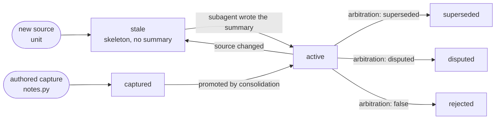
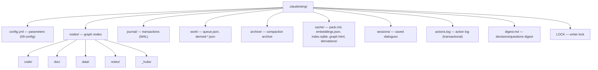

# 02 — Data model

This document describes how knowledge is represented on disk: what a node consists of, how its fields, identifiers, edges, and hierarchy membership work, and how the files are laid out across directories. Everything listed — the node file format, field names, defaults — is taken directly from the code (`graph_store.py`, `reconcile.py`, `extract_structure.py`). The theoretical grounding of the model (why a graph, why typed edges, what a node-as-engram is) — in the [theory](../THEORY.md), sections 3–4.

## A node is a file

Every graph node is a single `.md` file made of two parts: the **frontmatter** (YAML metadata fenced by `---` lines) and the **body** (arbitrary text after the second `---`). The format is fixed by the regular expression `^---\n(.*?)\n---\n?(.*)$`: the first group is the YAML metadata, the second is the body.

Serialization (`serialize_node`) emits the metadata via `yaml.safe_dump` with `sort_keys=False` (key order is preserved as in the dictionary) and `allow_unicode=True` (Cyrillic is written as is, unescaped), then the body:

```
---
id: code:src/billing.py::charge_card
type: function
summary: Charges the card and records the transaction outcome.
...
---
<node body, usually empty>
```

Parsing (`parse_node`) returns the metadata dictionary, adding the body under the `_body` key. Fields prefixed with an underscore (`_body`, `_path`) are **service fields that exist only in memory** and are never written to disk: they are stripped before serialization. `_path` is the node file's relative path (set on load by `load_nodes`); `_body` is the split-off body.

**The node body is, as a rule, empty.** A node's content is represented by the `summary` field and the `source_path` pointer to the source; for code the body is left empty on principle — a function is stored as a `path:line` pointer, not a verbatim copy (see the [theory](../THEORY.md), section 12). Non-empty bodies belong mostly to synthesized hub nodes, where the body carries the overview text.

## Frontmatter fields

The complete set of node fields. The "who sets it" column distinguishes the deterministic layer (`reconcile.py`) from the judgment layer (a subagent); the process itself is detailed in [Reconciliation and semantic derivation](./05-reconcile.md).

| Field | Type | Purpose | Who sets it |
|---|---|---|---|
| `id` | string | stable identifier of the form `category:path::qualifier` (see below) | extraction |
| `type` | string | the node's form; the canonical set — the "Node types" section below | extraction / synthesis / author |
| `source_path` | string | relative path to the source file | extraction |
| `qualname` | string | the unit's qualifier within the file (function/class name, section slug, `p{i}`, sheet name; empty string for file- and module-level nodes) | extraction |
| `lineno` | number | line number where the unit starts in the source; the basis of the `path:line` pointer in the output; silently refreshed when the unit shifts without a content change | extraction |
| `line_end` | number | line number where the unit ends; together with `lineno` it gives the `path:line-line` pointer range and a footing for verification; computed where source lines are real (code, markdown/RST sections, log/session windows), otherwise equals `lineno`; shifts together with `lineno` | extraction |
| `source_kind` | string | the node's class: `derived_from_file` / `synthesized` / `authored` | `reconcile` / subagent |
| `policy` | string | processing policy: `mirror` / `absorb` / `absorb_once` / `authored` | config (per folder) |
| `source_hash` | string \| null | hash of the source unit's content; the basis of the content-hash filter (never re-derive the unchanged); `null` for synthesized nodes | `reconcile` |
| `derived_from_hash` | string \| null | the hash the current summary was built on; becomes equal to `source_hash` after derivation, `null` while no summary has been written | `reconcile` / subagent |
| `confidence` | number \| absent | how much the summary can be relied on, 0..1; set by the judgment layer (builder/synth), defaulted by type for authored notes; a **displayed signal**, not an activation multiplier (see "Trust layer" below) | subagent / `notes` |
| `provenance` | dictionary | the fact's origin beyond the flat fields: `kind` (`code`/`doc`/`data` — the source category for file-projected nodes; `user`/`model_inference` for authored and synthesized ones), optional `commit`, optional `derived_from` (the ids a synthesis/note was distilled from) | `reconcile` / subagent / `notes` |
| `verification` | dictionary | the fact's verification state against the live source: `status` (`unverified`/`verified`/`stale`/`contradicted`), `method` (`ast`/`grep`/`doc`/`user`/`test`/`none`), optional `last_verified_at`, `last_verified_commit` | `reconcile` (default) / `verify_claims` / `notes` |
| `part_of` | list of `{topic, w}` | membership in the spanning-tree hierarchy; the primary home + (after consolidation) shares in other topics | `reconcile` + consolidation |
| `edges` | list of `{rel, to, w, coact, …}` | typed, weighted links to other nodes | `reconcile` (structural) + subagent (semantic) |
| `lang` | string | the working language of the content (the `working_language` value from the config, e.g. `ru`); the source's own language is deliberately not part of the schema — for mirrors it is recoverable from `source_path`, and should the need arise it would be a separate `source_lang` field | config |
| `status` | string | the node's state: `active` / `stale` / `superseded` | `reconcile` / consolidation |
| `summary` | string | the node's summary in 1–3 sentences in the `lang` language; empty until derivation. For a **trivial** code unit (a function a couple of lines long) reconciliation itself writes it deterministically — the unit's own code as one line, no model (see [Reconciliation](./05-reconcile.md), "Auto-summary of trivial units") | subagent / `reconcile` (trivial units) |
| `updated` | string | timestamp of the last change, `YYYY-MM-DDThh:mm:ss` | `reconcile` / `notes` |
| `created` | string | the node's creation timestamp (same format); maintained for **authored** nodes (`notes.py` capture): preserved on a repeated capture, while `updated` moves. Not tracked separately for mirror projections | `notes` |
| `tags` | list of strings | free-form labels on an **authored** note; they join the node's BM25-indexed text, so a note is findable by tag too | `notes` (author) |
| `branch_budget` | number | optional, meaningful on hubs: a personal branch budget **in nodes** instead of `compaction.default_branch_budget_nodes` (a per-branch token budget cannot be set); read by `consolidate.py plan` | author (by hand; the code does not write it yet) |

A user reading this list sees the node's entire composition: there is nothing in the frontmatter beyond what is listed; the trust-layer fields (`confidence` / `provenance` / `verification`) are unpacked in the next subsection.

### The trust layer: `confidence`, `provenance`, `verification`

These three fields form the trust layer (the rationale — [theory, §15](../THEORY.md)). The anchoring principle: confidently-wrong memory is more dangerous than absent memory, so every significant fact knows its origin and degree of confidence, and a claim about code is checked against the live source before it is answered.

**Provenance does not duplicate the flat fields.** For a mirror projection, the origin is **already** recorded by the ordinary fields: `source_path` (where from), `source_hash` (what content the summary was built on), `lineno`/`line_end` (which slice). Copying them into the `provenance` block would create a second source of truth — so the block carries only what the flat fields lack:

- `kind` — the information domain of origin: `code` / `doc` / `data` (for file-projected nodes = the category), `model_inference` (for synthesized nodes and the model's conclusions), `user` (for explicit statements by a human);
- `commit` (optional) — the short git hash at extraction time (best-effort; with no git the field is omitted);
- `derived_from` (optional) — the list of ids the node was distilled from (for hubs and notes derived from other nodes; their "source" is the graph, not a file, so they have no flat `source_path`).

**`confidence`** — a number in 0..1, the judgment layer's estimate: the builder scores its own summary (≈0.9 for a clear unit, lower for an opaque one), synthesis scores its hub, and authored notes default by type (`decision`/`adr` higher, `open_question`/`plan` lower; overridable with the `--confidence` flag). It is a **displayed signal, not an activation multiplier**: low confidence *flags* the node in the pack but does not push it down in the output — the same logic as `stale` (a freshly changed node is often exactly the one you need; see [Retrieval](./06-retrieval.md)). The field appears once the judgment layer writes the summary; the bare structural skeleton does not have it yet.

**`verification`** — the fact's verification state against its source. The default for a new or just-changed node is `{status: unverified, method: none}`: when the source changes (`changed`), the previous verification is reset, because the summary has fallen behind again. The `verify_claims` script (see [Retrieval](./06-retrieval.md)) re-chunks the current file and sets `verified` (file/symbol/hash matched), `stale` (the content changed), or `contradicted` (the file or symbol is gone); `method` records how it was checked (`ast` for Python, `grep` for other code, `doc`, `user` — a human's statement, `test` — reserved). An authored note with `kind: user` is verified immediately as `{verified, user}` — the human's word is the grounds. `verification.status` is a **separate axis** from the node's `status`: `status` reflects the summary's maturity (derivation freshness), while `verification` reflects whether the fact is confirmed against the source.

These fields also flow into the generated read-index in the projection its consumer needs (`confidence`/`verification`/`line_end` are read by retrieval to mark the pack; `provenance` stays in the frontmatter and is not projected by the index — `verify_claims` and reconciliation read it from the full frontmatter). Old graphs are topped up by `migrate_schema.py` (`provenance.kind` by node class, `verification` to `unverified`); `line_end` is filled in by the next `bootstrap` via pointer drift.

## Identifiers

A node's identifier (`id`) is built deterministically from the category, the relative path, and (for sub-file units) the qualifier — the function/class name, the heading slug, the page number, and so on. Identifier stability matters: it is what a node's existence is checked by on a re-run, so it must not drift under insignificant edits.

Identifier forms by unit type (the chunkers are described in [Structure extraction](./04-ingest.md)):

| Unit | `type` | `id` form | Chunker |
|---|---|---|---|
| whole file (fallback) | `file` | `{category}:{path}` | fallback (no grammar for the language) |
| module | `module` | `code:{path}` | `python` (the standard `ast`) |
| class | `class` | `code:{path}::{qual}` | `python` / `treesitter` |
| function, method | `function` | `code:{path}::{qual}` | `python` / `treesitter` |
| document section | `section` | `doc:{path}::{slug}` | `headings` (markdown) / `docx` |
| paragraph block | `block` | `doc:{path}::b{n}` | `paragraphs` (plain text) |
| page | `page` | `doc:{path}::p{i}` | `pdf` |
| record | `record` | `data:{path}::{key}` | `json` / `yaml` (the key is truncated to 48 characters) |
| worksheet | `sheet` | `data:{path}::{sheet_name}` | `xlsx` |
| session turn | `section` | `doc:{path}::m{n}` | `session` (a dialogue dump; n is the turn number) |

The category prefix (`code` / `doc` / `data`) matches the unit's information domain (see the [theory](../THEORY.md), section 11) and determines the storage bucket (below).

Saved sessions introduce no new schema: a dialogue turn is an ordinary doc node of type `section` in the `doc/` bucket (chunker — `session`, see [Structure extraction](./04-ingest.md)); its origin and deletability are set by the `policy` taken from the `session_policy` key (`absorb`/`mirror`), like any other source.

## Node classes and `source_kind`

The `source_kind` field states the node's origin and determines its lifecycle under reconciliation:

- **`derived_from_file`** — the node is projected from a unit of a source file (code, document, data). It has a `source_hash`; it is updated and deleted by the diff against the source (under the `mirror` policy).
- **`synthesized`** — the node was created by the judgment layer as a generalization: a hub (a topic's concentrator node), an overview, a cluster summary. It lives in the `_hubs` bucket, has `source_hash: null` and `policy: authored`, and is created directly in the `active` status. It is **not deleted** by the source diff (its "source" is the graph itself).
- **`authored`** — an authored note: a conclusion the model drew during a session, a recorded decision, a fragment of correspondence. Not deleted by the source diff (see the preservation rule below).

This split implements the node classes from the theory (a mirror projection versus an assimilated trace; see the [theory](../THEORY.md), sections 5 and 12).

## Node types (`type`)

The `type` field describes the node's **form** and carries no origin: origin is what `source_kind` is for (above). The historical `type: derived` on hubs is retired — new nodes never get it, and an old graph is brought to the canon by the `migrate_schema.py` script (run it once, then `reconcile.py bootstrap .` — it restores `lineno`/`qualname` for free via pointer drift). The canonical set by node class:

| Class (`source_kind`) | Types | Who creates them |
|---|---|---|
| `derived_from_file` | `module` / `class` / `function` / `section` / `block` / `page` / `record` / `sheet` / `file` | extraction (id forms — the table above) |
| `synthesized` | `overview` — a top-level architecture overview; `hub` — a concentrator of a cross-cutting topic; `section` — a consolidation-made summary of an episode cluster; **pattern nodes** — `architectural_pattern` / `recurring_fix` / `anti_pattern` / `migration_recipe` (a generalization of the project's recurring experience, ids of the form `pattern:{slug}`) | `amg-synth` (ids of the form `hub:{topic}` / `pattern:{slug}`); the consolidation actions `introduce_subhub` and `summarize_episodes` |
| `authored` | `note` — a note made along the way; `decision` — a recorded decision; `adr` — an architecture decision record; `open_question` — an unresolved question; `plan` — a plan for the future | the model or the user, through the safe note API `notes.py add` (see [Subagents and skills](./08-agents-skills.md)) |

**Tree-sitter units are canonicalized at extraction:** grammar node types are mapped by the `_TS_DEF` table in `extract_structure.py` onto the canonical ones (`function_definition`, `method_declaration`, `function_item`, … → `function`; `class_declaration`, `struct_specifier`, `impl_item`, `interface_declaration`, … → `class`), so non-Python code gets the same pack tiers and `path:line` pointers as Python. Grammar-level `type` values can only occur in a graph built before the canon; they are fixed by the migration (above) or by the next reconciliation (a mirror node's type belongs to extraction and converges via pointer drift).

Types are the working input of the consumers: retrieval lays nodes out across the pack tiers (`hub`, `overview`, and pattern nodes — the strategic tier; see [Retrieval](./06-retrieval.md)), while consolidation grows branches from `hub`/`overview` nodes, counts `decision`/`adr` among the protected types (`protect_types`), and treats `section`/`note` as episodic candidates (see [Consolidation](./07-consolidation.md)).

**Pattern nodes** (`architectural_pattern` / `recurring_fix` / `anti_pattern` / `migration_recipe`) are a synthesized generalization of recurring experience **within the project** (an architectural device, a recurring fix, an anti-pattern, a migration recipe); the rationale — [theory, §13](../THEORY.md) ("Pattern nodes"). Like hubs, they are synthesized (the `_hubs` bucket, `source_kind: synthesized`), sit in the strategic tier (they surface early), and are created by `amg-synth` the same way hubs are (a create item of the derivation). Concrete instance nodes point to the pattern with an `exemplifies` edge (specific → general); the quality of these links is measured by the eval (the false-analogy rate — see [Evaluation and tools](./10-eval-tools.md)).

## Processing policies

The `policy` field defines how a node relates to its source (the full rationale — see the [theory](../THEORY.md), section 12; the diff mechanics — [Reconciliation and semantic derivation](./05-reconcile.md)):

- **`mirror`** — a live projection: the source changed → the node is updated; deleted → the node is purged;
- **`absorb`** — ingested once: while the source is on disk, its changes are re-reconciled, but deleting the source does not touch the node;
- **`absorb_once`** — ingested once and frozen: like `absorb` on deletion (the node survives), but the source's **changes** are ignored too — the node is never rebuilt (a one-off snapshot that must not re-sync);
- **`authored`** — authored content with no external source (notes, synthesized nodes).

**The preservation rule.** The source diff deletes **only** nodes with `source_kind = derived_from_file` and `policy = mirror`. Authored, absorbed (`absorb`), and frozen (`absorb_once`) nodes are deliberately left untouched — losing a source must not mean losing the knowledge.

## Statuses and the node lifecycle

The `status` field reflects the node's maturity:



- **`stale`** — the node was created, or its source changed, but semantic derivation (the summary, the meaning-bearing edges) has not been done yet. On creation the deterministic layer sets `stale` and queues the unit; when the source changes, **the previous summary and edges are kept** and the status returns to `stale` until re-derivation — so no knowledge is lost in the gap. The exception is a trivial code unit: reconciliation writes it a deterministic auto-summary right away, and the node is born `active`, bypassing the queue (see [Reconciliation](./05-reconcile.md)).
- **`active`** — the summary is current; `derived_from_hash` equals `source_hash`.
- **`superseded`** — the node was displaced by another (a resolved contradiction, the `contradicts` / `supersedes` pairing); it stays in the graph for history but is **demoted** in the output by the status prior (`status_prior.superseded` = 0.2 — a multiplier on the final activation; `stale`, by contrast, is not penalized but flagged in the pack, see [Retrieval](./06-retrieval.md)).
- **`disputed`** — the node is in an **unresolved** contradiction: arbitration (see [Consolidation](./07-consolidation.md)) marked both sides this way and linked them with a `contradicts` edge. It stays in the graph and **is shown** (only the `status_prior.disputed` = 0.5 demotion plus a mark in the pack) — the conflict is surfaced, not hidden; a query about contradictions lifts the demotion by intent.
- **`rejected`** — a claim arbitration found **false** (refuted by a stronger source or by a live check). It stays in the graph for audit but is demoted the hardest (`status_prior.rejected` = 0.1).
- The `superseded`/`disputed`/`rejected` statuses are **arbitration verdicts** (epistemic contradiction resolution; theory — [§15.7](../THEORY.md)). All are non-destructive and reversible: only the `status` changes (plus a linking edge), the node is not deleted. When its source changes, the node naturally goes `stale` and is re-evaluated from scratch.
- **`captured`** — an authored note just recorded mid-session through `notes.py` (the default status at capture): the content is already complete (the summary/body is there), but the node has not yet been through consolidation's selection. It is **not** demoted in the output — `captured` is absent from `status_prior`, so the multiplier defaults to 1.0 (a fresh note is findable at once); consolidation may promote it to `active` with the `promote` action. This is the CLS model's "fast episodic write" (see the [theory](../THEORY.md), sections 2 and 13) — a parallel entry path next to `stale` for mirror projections.

## Edges

An edge is an element of the `edges` list in the source node's frontmatter. Edge fields:

| Field | Purpose |
|---|---|
| `rel` | relation type (`calls`, `documents`, `depends_on`, …; the full list and conductance priors — in the [theory](../THEORY.md), section 4, and the [Configuration reference](./09-config.md)) |
| `to` | the target node's identifier |
| `w` | link strength, a number in (0, 1] |
| `coact` | co-activation counter (the input for the Hebbian update; starts at 0) |
| `last_used` | the date of the last significant flow through the edge (set by consolidation; optional) |
| `origin` | the edge's origin: `structural` (deterministic extraction) / `semantic` (derivation) / `synthesized` (edges of created hubs) / `consolidation` (consolidation actions) / `authored` (edges of authored notes from `notes.py`); it determines which edges are rebuilt when the source changes — structural ones are replaced by a fresh extraction, the rest are preserved |

Edges come from two sources:

- **Structural — deterministically** (`_structural_edges` in `reconcile.py`; marked `origin: structural`; the rationale for "deterministic before the model" — [theory, §4.1](../THEORY.md)). From parsed code the extraction yields:
  - `imports`, `w = 0.6` — for an **in-project** module the target resolves to its node id (`code:{path}`) via the "dotted name → path" map; a stdlib or third-party import stays a dotted name (`code:{module}`) — deliberately dangling (it records the fact of the import; retrieval drops it);
  - `defines`, `w = 1.0` — the **containment backbone**: a module defines its top-level functions and classes, a class defines its methods; the targets exist by construction (they are units of the same extraction). Weight 1.0, like the primary `part_of`: containment is definite. These are the edges consolidation walks down from a hub to the branch members;
  - `inherits`, `w = 0.8` — inheritance `class X(Base)`: the subclass–base link is tighter than a call (0.7) but weaker than containment; the base class resolves by the same rules as calls (below), an external base (ABC, `Generic[T]`) yields no edge;
  - `calls`, `w = 0.7` — calls, **resolved only**: a bare name binds to a top-level definition in its own file or through the file's import table (`from util import helper` → the `helper` node in `util`); `self.method`/`cls.method` — to a method of its own class; a dotted chain (`util.helper2`, `pkg.mod.Class.method`) unfolds through the import binding and the module map. Resolution goes **only through the file's own imports**, never by name coincidence (a wrong edge is worse than a dangling one); built-ins, methods of unknown objects, and external calls **produce no edges at all** — noise does not accumulate;
  - `follows`, `w = 0.3` — from a saved chat, to the node of the previous turn in the same thread (deterministic conversation adjacency; see [Structure extraction](./04-ingest.md)).

  These are the initial weights of the edges themselves; do not confuse them with the per-type conductance prior β, which is applied separately at retrieval and set in `relation_priors` (for example, β for `calls` is `0.8`, for `follows` — `0.4`; see the [Configuration reference](./09-config.md)). Edges whose target node does not exist are, as before, simply dropped at retrieval. `(rel, to)` duplicates are collapsed.
- **Semantic — by the judgment layer.** During derivation the subagent adds the edges that require understanding: `documents` (a doc describes code), `depends_on`, `contradicts`, forward links. They are folded in at `apply`, merging by the `(rel, to)` key (`_merge_edges`). A semantic edge's target is **canonicalized**: one written without the full path (`code:core/foo.py::Bar`) is bound to the single existing node with that path suffix (`code:src/pkg/core/foo.py::Bar`) — both at `apply` and by a whole-graph sweep on every reconciliation; on ambiguity the target is left untouched (see [Reconciliation and semantic derivation](./05-reconcile.md)).

`part_of` edges (hierarchy membership) are stored as a **separate** field, not inside `edges` — see the next section.

## Hierarchy membership (`part_of`)

`part_of` is a list of `{topic, w}` stating which topics/hubs a node belongs to and with what share. The primary membership is set deterministically (`_part_of_for`): the topic is the parent directory of `source_path` (or the category itself if the file is at the root), weight `1.0`. This is the node's "home" in the spanning tree, needed for browsing and the namespace.

Weighted **multiple** membership (a node belongs 0.7 to one topic and 0.3 to another) is set by the judgment layer: `amg-synth` adds it during synthesis (multi-membership across cross-cutting topics), and consolidation normalizes it to the simplex (the shares sum to ≤ 1, the `part_of_renormalize` key) and, in the `introduce_subhub` action, **replaces** one parent topic with an intermediate sub-hub while preserving the other memberships (see [Consolidation](./07-consolidation.md)). So `part_of` travels the path "deterministic by path → refined by `amg-synth` → normalized and sub-hubbed by consolidation". It is exactly the weighted multiple membership that makes polyhierarchy possible without picking a single parent (the mechanics — see the [theory](../THEORY.md), section 6.4).

## Buckets: the physical node directories

Nodes are physically laid out across five directories inside `nodes/`. The bucket is determined deterministically by the `_dir_for` function from the unit's category; synthesized nodes always go to `_hubs`:

| Bucket | What lives there | Routing rule |
|---|---|---|
| `nodes/code/` | code nodes | `category == code` |
| `nodes/doc/` | document nodes (markdown, text, PDF, DOCX) | `category == doc` |
| `nodes/data/` | data nodes (JSON, YAML, XLSX) | `category == data` |
| `nodes/notes/` | authored notes and anything outside the three domains above | the default in `_dir_for` |
| `nodes/_hubs/` | synthesized nodes: hubs, overviews, cluster summaries | `source_kind == synthesized` |

The directories define **only** the browsing skeleton (the node's physical "home"); all associative links live in the frontmatter edges, not in the folder structure (see the [theory](../THEORY.md), section 3).

## The node file path

The file path is built from the identifier by the `node_relpath` function:

```
nodes/{bucket}/{slug}-{hash8}.md
```

where the **slug** is the identifier's "tail" after the first `:`, with every character except letters/digits/`.`/`-` replaced by `_`, truncated to 48 characters (or `node` if empty), and **hash8** is the first 8 hex characters of the `sha256` of the full identifier. The slug gives the file a human-readable name; the hash guarantees no collisions when different identifiers share a slug. Example: `code:src/billing.py::charge_card` → `nodes/code/src_billing.py_charge_card-1a2b3c4d.md` (the regular expression `[^\w.-]+` collapses each run of "non-word" characters into a single underscore, so `::` yields one `_`, not two).

## Directory layout

The store root is `.claude/amg/` (`.claude` is the Claude Code default for the agent directory; in another environment it is the configured name, e.g. `.agents`). Initialization (`graph_store.init`) creates only `journal/` and `nodes/<bucket>/` (the five buckets: `code/ doc/ data/ notes/ _hubs/`). Everything else — `work/`, `archive/`, `cache/`, `sessions/` and the `actions.log`, `digest.md` files — is born as needed, on first write.



| Path | Contents | Created |
|---|---|---|
| `config.yml` | configuration (see the [Configuration reference](./09-config.md)) | at install |
| `nodes/<bucket>/*.md` | graph nodes | `init` (the bucket directories) |
| `journal/<txid>/` | transaction records (the write-ahead journal) | `init` (the directory), records as writes happen |
| `work/queue.json` | the queue of units awaiting semantic derivation | as needed |
| `work/derived-*.json` | subagent results before apply | as needed |
| `work/` (the rest) | build and loop artifacts: `link-batch-*.json` / `synth-input.json` / `hub-candidates.json` (prepared global-pass inputs), `applied/` / `invalid/` / `judged/` (consumed, quarantined, and fully judged batches), `pack-log.jsonl` / `coactivation.log` / `usage.log` (retrieval and usage signals), `hint-stamp` (the reminder cooldown) — all machine-local and rebuildable (see [05](./05-reconcile.md), [06](./06-retrieval.md), [08](./08-agents-skills.md)) | as needed |
| `archive/` | originals displaced by compaction (reversibility) | as needed |
| `cache/` | generated caches: the `pack.md` pack, the `embeddings.json` embedding cache, the `index.sqlite` read-index (speeds up `load_nodes` on large graphs; see [Retrieval](./06-retrieval.md)), the self-contained 3D viewer `graph.html` (the graph export; see [Evaluation and tools](./10-eval-tools.md)) — all disposable and rebuildable; plus `derivations/` — the **derivation cache** (applied summaries/edges keyed by content hash: a rebuild restores them verbatim and for free; also deletable, at the price of re-generation — see [Reconciliation](./05-reconcile.md)) | as needed (retrieval / writes / export) |
| `sessions/` | auto-dumped dialogues `YYYY-MM-DD-HHMM.md`; ingested like any other source (see [Structure extraction](./04-ingest.md)) | as needed (session end) |
| `actions.log` | the human-readable action log — a flat log of identically shaped lines, hence no markup (transactional: deduped by `txid`, rotated into `archive/`; written by consolidation and reconciliation; a legacy `log.md` is carried over on first write; see [Storage](./03-storage.md)) | as needed (graph writes) |
| `digest.md` | the auto-generated digest of 5–10 standing decisions and open questions; imported by the entry point into every session as the "memory exists but was never consulted" insurance (see [Subagents and skills](./08-agents-skills.md), the lifecycle layer) | as needed (consolidation) |
| `LOCK` | the single writer-lock file | on first write |

**What to track in git (the team mode).** The memory's canon is the `nodes/*.md` nodes, the `config.yml` configuration, and the `digest.md` digest; everything else in the store (`journal/`, `cache/`, `work/`, `archive/`, `actions.log`, `LOCK`) is **generated and machine-local** and does not go into git — it is rebuildable or belongs to one machine's state. That way a branch carries its own memory (`git checkout` swaps the nodes), and the working directories do not "jump" on switches. The recommended `.gitignore` and the team-work scenarios (a shared folder, merging, comparing branches) — in the [guide](../GUIDE.md), section "Team work".

The mechanics of the journal, the lock, and atomic writes are described in [Storage and transactions](./03-storage.md); the queue and the `derived-*.json` files — in [Reconciliation and semantic derivation](./05-reconcile.md).

## Next

- [Documentation map](./README.md) — the architecture table of contents and the way back to the start.
- [03 — Storage and transactions](./03-storage.md) — atomic writes, the journal, the writer lock, recovery and verification.
- [04 — Structure extraction](./04-ingest.md) — the type classifier and the chunkers, including PDF/DOCX/XLSX.
- [05 — Reconciliation and semantic derivation](./05-reconcile.md) — the `bootstrap`/`plan`/`apply` modes, the queue, the `mirror`/`absorb` policies, idempotency.
- [07 — Consolidation](./07-consolidation.md) — weight folding, multiple membership, compaction.
- [09 — Configuration reference](./09-config.md) — parameters and defaults.
