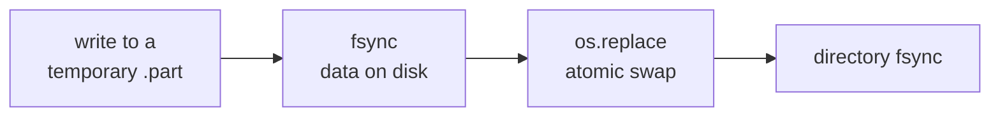
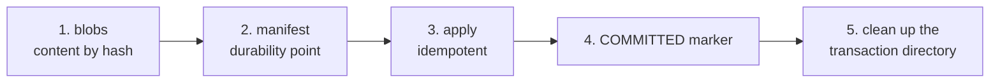
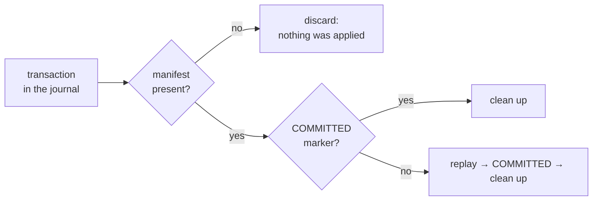
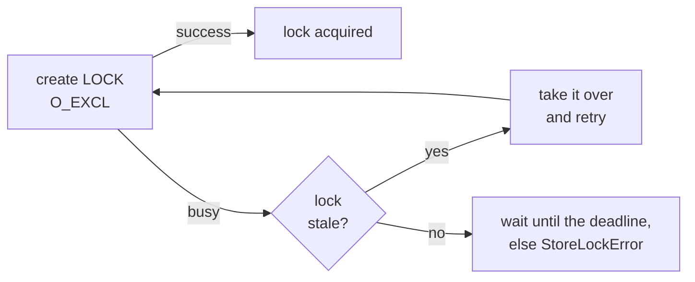

# 03 — Storage and transactions

The storage layer (`graph_store.py`) is the foundation that guarantees data consistency under failures. It deliberately knows nothing about nodes, edges, or language models: it is a general-purpose transactional store over text files in the AMG root (`.claude/amg/`). The layers above (reconciliation, subagents) express *what* should change; this layer guarantees that the change is applied all-or-nothing and that the store can always be brought back to a consistent state after a crash. This is the concrete form of the principle "the truth is the filesystem; the graph is its recoverable projection" (see [The big picture](./01-overview.md)). The full formal treatment lives in `consistency-model.md` (in the `amg-bootstrap/references/` skill directory); here — how the implementation works.

## Location and callers

The `graph_store.py` file lives in `skills/amg-bootstrap/scripts/`. It is the bottom layer: `reconcile.py` imports it (`import graph_store`), and **all** graph writes from reconciliation and consolidation go through it. It calls no other AMG modules and never talks to a language model. It is run directly by the `amg-bootstrap` skill (the `init` / `recover` / `verify` commands) and indirectly by any operation that writes to the graph.

## The four guarantees

Consistency comes from the combination of four properties; each is unpacked below.

1. **Atomic single-file writes.** A file is written to a temporary file next to it, flushed to disk (`fsync`), and atomically renamed over the target (`os.replace`). A reader never sees a half-written file: it sees either the old bytes or the new ones.
2. **A write-ahead journal with declarative redo** (not rollback). A logical change usually touches several files. We record the *desired final state* of every affected file as a content blob, make the intent durable, then apply. Because the journal stores the target content (addressed by hash), replaying it any number of times converges to the same state.
3. **Recovery.** On startup the journal is scanned: a transaction whose intent never became durable is discarded; one that is durable but not marked committed is re-applied (idempotently) and committed; one committed but not cleaned up is simply cleaned.
4. **A single writer lock.** Writes take an exclusive lock (a lock file created with `O_EXCL`, with staleness detection). Reads are lock-free and safe, because every file write is atomic.

## Atomic single-file writes

The base primitives are model-agnostic and operate on bytes.

`atomic_write_bytes(path, data)` creates the parent directory if needed, writes the data to a temporary file with the `.tmp-` prefix and the `.part` suffix in the *same* directory as the target, calls `flush` and `os.fsync` (the data is physically on disk), then `os.replace(tmp, path)` — the atomic swap (atomic on POSIX and within a single Windows volume) — and finally flushes the directory entry (`_fsync_dir`) so that the rename itself survives a power failure. The temporary file is removed in a `finally` block on any error. `atomic_write_text` is a wrapper that encodes a string as UTF-8.

`atomic_delete(path)` removes the file if present and flushes the directory; a missing file is not an error (idempotency). `_fsync_dir` is deliberately best-effort: on some platforms (e.g. Windows) directory fsync is unsupported, and the failure is silently ignored.

Content is addressed by hash: `sha256_bytes` / `sha256_text` produce the hex SHA-256, used both as the blob name and as the idempotency guard (below).

## The write-ahead journal with declarative redo

The key decision is **declarative redo instead of rollback**. A traditional journal stores how to *undo* a partial change; here the journal stores the *target content* of every file, so recovery means "play forward to the target", not "roll back". Such a replay is idempotent by nature: it can be applied any number of times with the same result, and no separate undo log is needed.

Every write is staged as a **blob** — a content-addressed object: a file in the transaction directory `blobs/{sha}`, where `sha` is the SHA-256 of the content. Identical content yields one blob (a repeated blob write is skipped). The whole intent is described by a **manifest** (`manifest.json`) — a list of `ops`, each either `{"op": "write", "path": …, "sha": …}` or `{"op": "delete", "path": …}`.

## A transaction and its commit

The `Transaction` object collects a set of writes and deletes and applies them atomically. Methods: `write(relpath, content)` (a string is encoded as UTF-8; a write cancels a previously planned delete of the same path), `delete(relpath)` (a delete cancels a previously planned write), `is_empty()`, `node_paths()` (returns `(written, deleted)` — the relative paths under `nodes/` the transaction touches). Using `node_paths()`, writers refresh the generated read-index `cache/index.sqlite` after the commit (see [Retrieval](./06-retrieval.md)); the store itself knows nothing about the index — this is just a path filter, and the index logic lives in the retrieval layer. `commit()` performs five steps:

1. Generate a `txid` — a `YYYYMMDDThhmmss` timestamp plus 8 characters of a random UUID — and create the transaction directory with a `blobs/` subdirectory.
2. Stage every write as a blob; assemble the `ops` list.
3. **Write the manifest.** This is the *durability point*: until the `manifest.json` rename happens, nothing in the live store has changed, so a crash here is a clean no-op.
4. Apply the declarative final state (`_apply_manifest`, idempotent).
5. Write the `COMMITTED` marker file, then delete the transaction directory.

An empty transaction returns `None` and does nothing. The apply step (`_apply_manifest`) either writes each blob to its target **with an idempotency guard** (if the target file already holds the wanted `sha`, the apply is skipped) or atomically deletes the file. An unknown op raises an error. There is a test hook, `_fault_after_apply_ops` — it injects an artificial failure after N applied ops (simulating a process crash); it is unused in the working flow.

The all-or-nothing property follows from the fact that **every interruption point converges to a consistent state**:

| Crash moment | State of the live store | Recovery action |
|---|---|---|
| before the manifest is written | untouched (only blobs in the temporary directory) | discard the transaction (no manifest) |
| manifest written, apply not started or partial | some target files updated | replay to the target (idempotent), mark `COMMITTED`, clean up |
| apply finished, no `COMMITTED` marker | the target state is reached | replay (a no-op under the hash guard), mark `COMMITTED`, clean up |
| `COMMITTED` written, cleanup unfinished | the target state is reached | clean up the transaction directory |

## Recovery

`recover()` brings the store to a consistent state and is **safe to re-run at any moment** — it is what turns a crash into a non-event. It walks the journal directories in sorted order and applies one of three decisions to each:

It returns the list of handled transactions tagged `:discarded`, `:cleaned`, or `:redone`. If there is no journal directory, the list is empty.

**When `recover()` runs and what it covers.** It is called by the `recover` / `verify --repair` commands and by every write operation before it starts; in automatic mode the `SessionStart` hook runs it at session start (the manual counterpart is `/amg repair`). This also covers the worst case — a **hard kill** (a closed terminal, `kill`, power loss) — where the `SessionEnd` hook never got to run: the previous run's unfinished write stays in the journal uncommitted and is played to the target (or discarded) on the next `recover`, and a hung lock is released. Authored notes (`notes.py`) captured during the killed session are unharmed — each is written as its own completed transaction (the preservation rule — [Data model](./02-data-model.md)). The end-of-session upkeep the hook missed (weight folding, digest refresh) is not lost, only deferred to the next start or a manual run.

## The single writer lock

Writes are serialized by an exclusive lock; the goal is that exactly one process changes the graph at a time. The context manager `lock(stale_seconds=3600, wait_seconds=0.0)` tries to create a `LOCK` file with `O_CREAT | O_EXCL` (an atomic "create only if absent") and writes into it the `pid`, the `host` (machine name), and `ts` (time). The acquisition logic:

By default `wait_seconds = 0.0` — the lock **does not wait** and fails fast with `StoreLockError` if held by a live process; the error message names the owner (`pid`, `host`) and suggests deleting `LOCK` if the process is dead. The lock is released (the file deleted) in a `finally` block.

Staleness (`_lock_is_stale`) is decided by rules whose order matters:

- an **unreadable or corrupted** lock file counts as stale (it may be taken over);
- **our own lock** (the current process's `pid` and `host` match) is **never considered stale** — otherwise an operation like `verify --repair`, running under the lock, would flag the very lock it took;
- a lock held by a **dead process on the same machine** is stale: liveness is probed by `_pid_alive` via `os.kill(pid, 0)` (the POSIX probe) **only when the `host` matches** — a pid probe is meaningful only on the same machine; `ProcessLookupError` means "dead", `PermissionError` means "alive but not ours", and on platforms without such a probe (e.g. Windows) the process is conservatively assumed alive;
- a lock **from another host** (a shared folder) is taken over **by age only**: probing a foreign pid across machines is meaningless and would falsely steal a teammate's live lock, so a foreign host waits out the `stale_seconds` threshold;
- a lock **older than the `stale_seconds` threshold** is stale.

Store reads take no lock and are safe without one, because every file write is atomic.

## Integrity verification

`verify(repair=False, referenced_paths=None)` checks the store's invariants and returns a dictionary of problems under three keys:

| Key | What it checks | With `repair=True` |
|---|---|---|
| `pending_transactions` | unfinished transactions in the journal | calls `recover()`; adds a `pending_transactions_resolved` key |
| `stale_lock` | a stale lock (the `stale_seconds` threshold is `0` under `repair`, else `3600`) | deletes the lock file |
| `dangling_references` | the passed `referenced_paths` missing on disk | does not fix (that is the reconciliation layer's job, see [Reconciliation and semantic derivation](./05-reconcile.md)) |

The resulting `clean` flag is true when all problem lists are empty (keys with the `_resolved` suffix are not counted). Under `repair=True` the lock staleness threshold drops to zero: repairing under one's own lock is safe thanks to the "our own lock is never stale" rule.

## Path protection

`abspath(relpath)` turns a relative path into an absolute one and **checks that it does not escape the store root**: if the resolved path is not inside the root, a `ValueError` is raised. This is not cosmetics but protection: a mistaken or hostile relative path cannot write a file outside `.claude/amg/`.

## The concurrency model

The model is simple and robust: **a single writing process under the lock plus lock-free reads**. During graph building, parallel workers (subagents) write to *separate* files and never touch the live graph; only the sequential apply under the lock folds anything in. So there are no races by construction — with no complex per-node locking. How the reconciliation layer arranges this — see [Reconciliation and semantic derivation](./05-reconcile.md).

**Team mode.** The same "one writer under the lock" model extends to simple turn-taking team work, with no distributed locking. On a **shared folder** the lock is host-aware (see the staleness rules above) and never steals a teammate's live lock from another host; while the lock is busy, automatic upkeep gracefully skips its cycle (it will repeat idempotently on the next run), and explicit commands report "locked by another writer". The alternative exchange channel is **git over the markdown canon**: branches carry their own memory, merges happen over the `nodes/*.md` files, and a node left with git conflict markers is safely skipped by reads (`load_nodes`) and fixed by resolving the markers plus a `bootstrap`; the detector is `reconcile.find_conflict_markers`, the surfaces are `/amg status`/`repair`/`bootstrap` (the formal model — `consistency-model.md` §9 and §12). True concurrent multi-writer access from several machines is deliberately not built. Source freshness by commit is checked by `verify_claims --by-commit` (see [Retrieval](./06-retrieval.md)).

## The `actions.log` action log — a transactional audit trail

Apart from the low-level `journal/`, the store keeps a human-readable `actions.log` — an audit trail of performed actions. It is a **flat log**: entries share one shape, so the file carries no markup (historically it was named `log.md`, with every line preceded by a `## ` heading that added nothing; on first write the new writer carries over the old `log.md` lines, stripping the prefixes, and never touches it again). The `GraphStore.append_log(source, msg, txid)` method appends one line of the form `[<time>] <txid> <source> | <message>` **through a transaction** (not a plain append): the whole log is staged as a single content-addressed blob, so replaying it during recovery is idempotent. Three properties:

- **deduplication by `txid`:** if a line with this `txid` already exists, the write is a no-op, so replaying an already-committed transaction does not double the line;
- **bounded by rotation:** once the log exceeds the line limit (500 by default), the old lines move to `archive/actions-<time>.log` and the live `actions.log` keeps the tail (100 lines) — a long-lived graph does not rewrite an unboundedly growing file on every write;
- **best-effort:** any write error is swallowed — graph integrity is held by `journal/`, not by the log, so a missing or torn line remains harmless.

Both writing layers write the log: `consolidate.py` (weight folding, applied actions, the eval guard's verdict) and `reconcile.py` (the outcome of `bootstrap`/`apply`, but **only when the diff actually changed the graph**: with an empty diff there is no transaction and no line is added — an unchanged run stays idempotent). The source in the line (`consolidate` / `reconcile`) lets `/amg status` pick the last actual consolidation (`lifecycle._last_consolidation` filters by it). The write happens under the same lock the caller holds and reduces the log to the model "append as part of a committed transaction, deduped by `txid`". `verify_claims.py --write` also appends a line (source `verify_claims`) under its own lock.

**Trust-layer fields and signal logs.** The trust-layer fields (`confidence`, `provenance`, `verification`, `line_end`) live in the node frontmatter and pass through transactions transparently: the store is **domain-blind** — it addresses files by content and does not know what is inside, so new fields survive `recover()` like any others, with no changes to `graph_store`. Separately from the graph, retrieval and session end keep **signal logs** in `work/` — `coactivation.log` (the exposure signal), `pack-log.jsonl` (pack composition), and `usage.log` (usage provenance): best-effort working data **outside** transactions and outside `journal/` (a write error there, like a lost `actions.log` line, is harmless), with no effect on graph integrity; `pack-log` is per-session (consumed at session end), while `usage.log` accumulates as the outcome signal for the weight rule (read by the folding pass when `apply_hebbian` is on; see [Consolidation](./07-consolidation.md)). Details — [Retrieval](./06-retrieval.md) and [Subagents and skills](./08-agents-skills.md).

## The command-line interface

The store root for all engine CLIs (`graph_store.py`, `reconcile.py`, `consolidate.py`, `notes.py`, `lifecycle.py`) is resolved by the **single** `resolve_amg_root` chain (below). `graph_store.py` additionally honors the `AMG_ROOT` variable — an explicit override with the full store path. Thanks to the upward config search, even a globally installed engine (`~/.claude/skills`) heals and reads the project's **local** graph when run from that project's directory (`.claude`/`CLAUDE.md` here are the Claude Code defaults; another environment substitutes its configured names, e.g. `.agents` / `AGENTS.md`).

`resolve_amg_root` (it lives in `graph_store.py`) resolves the root with no hard-coded `.claude` name. The chain — first match wins:

1. an explicit `--root <agent_dir>`;
2. the `AMG_AGENT_DIR` environment variable (same meaning);
3. an upward search from the current directory. At every level the agent-directory presets are checked **first** — `<dir>/.claude/amg/config.yml` and `<dir>/.agents/amg/config.yml` (the unambiguous install layout; this is how a globally installed engine finds a project's graph in either environment) — and only then the "bare" `<dir>/amg/config.yml`, which is accepted as a store **only if initialized** (it contains `nodes/` and `journal/`; the case of running from inside the agent directory itself). The **home-directory level is skipped**: `~/<agent dir>/amg/` carries the global personal-defaults config (a configuration layer, see [12-install](./12-install.md)), not a project store;
4. the engine's own location (`<agent_dir>/skills/…` → `<agent_dir>/amg`) — also only if it is an initialized store: this covers the dev layout and a local install, but does not let a global engine hijack a fresh project's default;
5. the default `.claude/amg`.

**The engine-signature veto.** A candidate `amg/` directory that contains `skills/`, `agents/`, or `install.py` is an unpacked AMG source checkout (its root `config.yml` is a template with example sources), not a store; the resolver rejects it at every search step. The "initialized" check alone is not enough: a single stray run creates `nodes/`+`journal/` right inside the checkout (`plan()` unconditionally calls `init()`), after which a naive check would pass forever — so the veto applies regardless of those directories. That way an engine checkout next to (or inside) a project never hijacks memory operations, and a resolution miss is visible at once: structure extraction with no `config.yml` at the resolved root exits with the "AMG is not installed…" diagnostic naming that root, instead of a silent empty run.

A mirror copy of the same logic lives in `retrieve._default_store` (the default `--store` for `retrieve.py`/`inspect_graph.py`/`export_graph.py`; without importing `graph_store` — the retrieval module is self-contained). Usage details — [Reconciliation and semantic derivation](./05-reconcile.md).

| Command | Action | Lock |
|---|---|---|
| `init` | creates the directory skeleton (`journal/`, `nodes/<bucket>/`) | — |
| `recover` | replays unfinished transactions | under the lock |
| `verify [--repair]` | checks the invariants; with `--repair` fixes what is safely fixable | with `--repair` — under the lock; without — lock-free (a read) |

`verify` exits with code `0` when the store is clean and `1` when problems were found; this makes it usable in scripts and hooks.

## Windows notes

The implementation is designed to run on Windows too, where some POSIX mechanisms behave differently: directory fsync (`_fsync_dir`) is unsupported and done best-effort; `os.replace` is atomic within a single volume; pid-based liveness probing is unavailable, so a process is conservatively assumed alive (a lock will never be wrongly "stolen" from a live writer). Files are opened and written as UTF-8.

## Next

- [Documentation map](./README.md) — the architecture table of contents and the way back to the start.
- [02 — Data model](./02-data-model.md) — what exactly these files store: the node format, edges, buckets, directories.
- [05 — Reconciliation and semantic derivation](./05-reconcile.md) — who forms the transactions and how parallel workers write separately while applies run sequentially.
