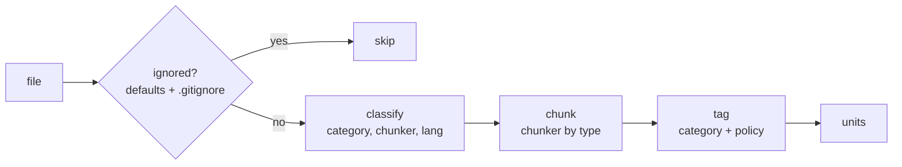
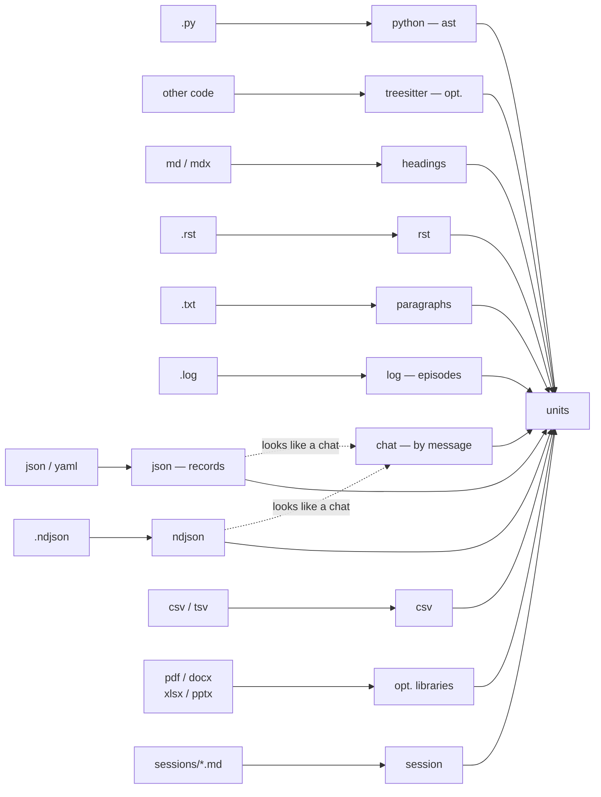

# 04 — Structure extraction

Structure extraction (`extract_structure.py`) is the **only data-type-dependent** layer of the system; the graph engine is domain-blind and stores nodes, edges, and text the same way regardless of where a unit came from (the rationale — in the [theory](../THEORY.md), section 11). Figuratively, it is the "sensory cortex": every file is routed to the right **chunker** (the component that cuts a file into units) by its type, and a single associative graph is built from the result. The layer is fully **deterministic**: there is no language model here (see [The big picture](./01-overview.md)).

Extraction runs a per-file pipeline: **ignore → classify → chunk → tag**.



The result is a list of **units**, each carrying a **content hash**; it is the hash that makes the whole system idempotent (reconciliation compares the hashes against the graph and decides what changed — see [Reconciliation and semantic derivation](./05-reconcile.md)).

## Location and callers

The `extract_structure.py` file lives in `skills/amg-bootstrap/scripts/`. Its `extract` and `load_config` functions are imported by `reconcile.py`; files flagged as ambiguous are handed to the `amg-classifier` subagent for type refinement. It depends on optional libraries (`tree-sitter-language-pack`, `pypdf`, `python-docx`, `openpyxl`) and degrades gracefully without them; it never calls a language model itself. It is run by the `amg-bootstrap` skill.

## Ignoring: hygiene before meaning

Some files are not indexed at all — a matter of hygiene, not salience (a pre-semantic filter, the analogue of sensory filtering; [theory](../THEORY.md), section 11). Hard rules decide this, not the model. There are three ignore layers, and they stack; none requires the project to be a git repository.

**1. The built-in directory list (`DEFAULT_IGNORE_DIRS`).** A file is skipped if *any* part of its path is in the set: `.git`, `.hg`, `.svn`, `.claude`, `.agents`, `node_modules`, `.venv`, `venv`, `env`, `__pycache__`, `.pytest_cache`, `.mypy_cache`, `.ruff_cache`, `.tox`, `dist`, `build`, `target`, `out`, `.next`, `.nuxt`, `.cache`, `vendor`, `site-packages`, `.idea`, `.vscode`, `.gradle`, `coverage`, `.terraform`, `bin`, `obj` — cache, dependency, and build directories. The graph's own directory is here too: **the memory does not index itself.** Both common agent-directory names (`.claude` and `.agents`) are in the set, and the `_effective_ignore_dirs` function adds the **configured** agent directory, computed from the store's location (`<agent_dir>/amg` → the name `<agent_dir>`) — so self-indexing cannot happen under a non-standard directory name either. This layer is hard: naming a source explicitly does **not** override it (otherwise the graph itself could be indexed by accident). The single exception is the internal sessions source, which has its own traversal (see "Sessions").

**2. The project's `.gitignore` — optional and git-independent.** `load_gitignore` reads the root `.gitignore` **as a plain text file, if present** (no file → an empty list, no error; the `git` binary is never invoked, no `.git` directory is needed), dropping comments (`#`) and trimming a trailing `/`; re-include rules (`!pattern`) are kept along with the line order. Matching (`_gitignored`) is **ordered, "the last matching rule wins", the way git itself reads the file**: a pattern counts as matched if it fits the full relative path or the file name (`fnmatch`), if the pattern's name segment occurs anywhere in the path, or if the path fits `pattern/*`; the final verdict comes from the last matching rule, so `logs/` + `!logs/keep.md` brings `keep.md` back into the graph, and an exclusion that comes *after* the `!` rule overrides it again. One deliberate simplification: a `!` rule re-includes a file even under an excluded parent directory (real git does not) — forgiving reading: for a memory, silently losing explicitly re-included material is worse than an extra file. Two refinements make this layer predictable:

- **An explicitly named source beats `.gitignore`.** If the *root* of a `mirror_path`/`absorb_path` itself falls under a `.gitignore` rule (say, `absorb_path: logs` while `.gitignore` has `logs/`), the source is indexed anyway — you chose it deliberately (`_gitignore_for_source` drops, for that source, the rules matching its root). Meanwhile `.gitignore` still trims the junk *inside* broad sources (`mirror_path: .` → `dist/`, `*.log`). Without this rule, a wholly gitignored folder would silently never reach the graph — and silent loss of material is more dangerous than an extra file.
- **The `respect_gitignore` key** (default `true`). With `false`, `.gitignore` is not read at all — ignoring is defined entirely by the config. For projects outside git, or where the graph's composition is kept under strict control.

**3. Configuration: `exclude` and its per-intent variants.** Additional glob patterns (bash-style, like `.gitignore` lines), applied by the same `_gitignored`. There are three keys, all optional and empty by default (behavior is unchanged without configuration):

- `exclude` — for **all** sources;
- `mirror_exclude` — only for mirrors (`mirror_path`);
- `absorb_exclude` — only for absorbed sources (`absorb_path`).

The per-intent lists **stack** with the global `exclude` for sources of their intent (`_excludes_for_policy`), so you can, for example, drop test fixtures from mirrors without touching absorbed dumps. A trailing `/` in patterns is trimmed (as in `.gitignore`), so `raw/scratch/` matches as expected. The full key reference — [Configuration reference](./09-config.md).

## Classification

`classify(path)` returns the tuple `(category, chunker, lang, ambiguity)`, where `category` ∈ `code | doc | data | binary`, `chunker` is a key from the registry (or `skip`), `lang` is the language/format (for code — the grammar name), and the ambiguity flag marks files whose type was set by a guess. The decision is made by extension, and for files with no or unknown extension — by content.

| Extension class | `category` | chunker | `lang` |
|---|---|---|---|
| `.py` | `code` | `python` | `python` |
| other code — the `CODE_LANG_BY_EXT` table (`.js`, `.jsx`, `.mjs`, `.cjs`, `.ts`, `.tsx`, `.php`, `.c`, `.h`, `.cc`, `.cpp`, `.cxx`, `.hpp`, `.hh`, `.java`, `.go`, `.rs`, `.rb`, `.cs`, `.swift`, `.kt`, `.scala`, `.lua`, `.sh`, `.bash`, `.sql`, `.pl`, `.r`, `.dart`, `.ex`, `.exs`) | `code` | `treesitter` | grammar name |
| `.md`, `.mdx`, `.markdown` | `doc` | `headings` | — |
| `.rst` | `doc` | `rst` | — |
| `.txt`, `.text` | `doc` | `paragraphs` | — |
| `.log` | `doc` | `log` | — |
| `.json`, `.yaml`, `.yml` | `data` | `json` | — |
| `.ndjson` | `data` | `ndjson` | — |
| `.csv`, `.tsv` | `data` | `csv` | — |
| `.pdf` | `doc` | `pdf` | `pdf` |
| `.docx` | `doc` | `docx` | `docx` |
| `.pptx` | `doc` | `pptx` | `pptx` |
| `.xlsx`, `.xlsm` | `data` | `xlsx` | `xlsx` |
| binary — the `BINARY_EXT` table (images, archives, media, fonts, executables; the legacy office `.doc`, `.xls`, `.ppt`; `.db`, `.sqlite`, `.pdb`, `.lock`, `.svg`, …) | `binary` | `skip` | — |

**Files with no extension or an unknown one** go through a *content probe*: the first 2048 bytes are read. If the file is unreadable or contains a NUL byte (`\x00`), it is treated as binary and skipped. Otherwise it is readable text of unknown kind: it is treated as prose (`doc`, the `paragraphs` chunker) and **flagged as ambiguous** — the bootstrap skill can then ask the classifier subagent to refine the type (see [Subagents and skills](./08-agents-skills.md)).

An important note on formats. The legacy binary formats `.doc`, `.xls`, `.ppt` (pre-2007) deliberately stay in `BINARY_EXT`: there is no reliable pure-Python library to extract them, and unpacking them would require heavy external tools, which contradicts the "optional pure-Python libraries" principle. The modern office formats, by contrast, are extracted by optional libraries — each with its own chunker: `.pdf` (`pypdf`), `.docx` (`python-docx`), `.xlsx`/`.xlsm` (`openpyxl`), and `.pptx` (`python-pptx`). Without the needed library the file is skipped gracefully, with no error.

The `.rst`, `.ndjson`, `.csv`/`.tsv`, and `.log` formats have **chunkers of their own** (described below): reStructuredText is split by underline headings, line-delimited JSON by lines, CSV tables by a structural description, logs by episodes. They used to take a fallback path (RST collapsed into one section, NDJSON into one file node); now each is parsed on its own terms.

### Overrides: the classifier's verdict, effective in code

The "ambiguous" flag is not a verdict. The deterministic classifier necessarily files extensionless and unknown-extension files under prose, but their true type may differ: `scripts/run` with no extension is a bash script, not prose. So that such a file reaches the right chunker instead of the `paragraphs` default, the classifier subagent `amg-classifier` steps in (see [Subagents and skills](./08-agents-skills.md)): it reads the first lines of the ambiguous files and returns their types. The bootstrap skill writes this verdict to

```
.claude/amg/work/classification-overrides.json
```

in the "path → type" format:

```json
{
  "scripts/run":  {"category": "code", "language": "bash"},
  "README.old":   {"category": "doc",  "language": null}
}
```

where `category` is one of `code` / `doc` / `data`, and `language` is the tree-sitter grammar name for code (or `null`). On the next extraction `extract` reads the overrides **before** its own classification (`load_overrides` → `_classify_path`) and routes the file to the chunker the verdict names: `code` with the `python` grammar goes to the `ast` chunker, `code` with another grammar to tree-sitter, `data` to the record chunker, `doc` to the paragraph one. If no grammar is given for code, tree-sitter falls back gracefully to a single file unit — as with any unavailable grammar.

A few properties of this mechanism are worth keeping in mind. An override is **stronger** than the deterministic guess and applies even to a file with a known extension — this gives manual correction when automatic classification got it wrong (say, a `.txt` that is actually data). A missing overrides file or corrupted JSON inside it is treated as "no overrides" (an empty map): a wrong or forgotten file never blocks bootstrap. And the `--stats` self-diagnostic shows both sides of the picture — which files are already resolved by overrides and which are still ambiguous — adding a hint with the classifier command if unresolved ones remain. This is how `amg-classifier` becomes a working part of the pipeline rather than just a described prompt.

## The chunker registry

The `CHUNKERS` registry maps a chunker key to its implementation: `python`, `treesitter`, `headings`, `rst`, `paragraphs`, `log`, `json`, `ndjson`, `csv`, `pdf`, `docx`, `xlsx`, `pptx`, `session`. For ordinary sources a file is dispatched by the classifier's key. Three cases are decided not by extension but by special driver branches: the session chunker (`session`) — for the saved-sessions directory (the "Sessions" subsection); the external-chat chunker (`_chat_units`) — by a structure probe on top of `json`/`ndjson` (the "External chat" subsection); and a flat marker dump placed into a regular `.md`/`.txt` is routed by content to the same `session`. The `log` and `json` chunkers additionally receive their numeric limits from the config — the episode window and the recursion depth/node caps (the subsections below and the [Configuration reference](./09-config.md)).



### Python — the standard `ast` module (no dependencies)

`_python_units` parses the file with the standard `ast` module, so Python is supported fully and with no third-party libraries. A **module** node is created (`id` = `code:path`, `kind` `module`) with the fields `imports` (a sorted unique list from `import` and `from … import`) and `import_bindings` — the **import bindings**: a "local name → dotted target" map (`import pkg.mod as pm` → `pm: pkg.mod`; `from util import helper as h` → `h: util.helper`) by which reconciliation resolves cross-file calls and base classes through the file's own imports rather than by name coincidence. Then the definitions of functions, async functions, and classes are walked recursively: each yields a unit with `id` = `code:path::qualifier` (nested ones get a dotted prefix, e.g. `Class.method`), `kind` `class` or `function`, the `lineno` line number, and the `calls` field — a sorted list of **dotted chains** of what is called (`helper`, `util.helper2`, `self.ping`); a call whose receiver cannot be reconstructed (a call result, an indexing) is not listed — it could never be bound deterministically anyway. A class additionally collects the `bases` field (base-class chains from `class X(Base)`; non-name bases like `Generic[T]` are skipped). The enclosing unit gets the `defines` field — the qualifiers of its direct definitions (a module — its top-level functions/classes, a class — its methods): reconciliation builds the containment backbone from it. Classes are walked in depth. **Each unit's hash is computed over its own slice of the source:** a function's — over the text of its definition, a class's — over the whole class body, a module's — over the whole file. So editing one function changes the hash of its node and (its slice being nested) the hashes of the enclosing class node and the module node; *neighboring* functions and classes whose text did not change are not re-derived. A syntax error in the file → one file node (no crash).

### Other code — tree-sitter (optional)

`_treesitter_units` gives other languages' functions/classes the same granularity and call edges, but **only if** `tree-sitter-language-pack` is installed and the grammar loaded; otherwise the function returns `None` and the driver gracefully degrades the file to a single file unit (coarser, but no error). It recognizes the definition-node families `_TS_DEF` (function, method, class, struct, `impl`/`trait`, interface, enum — broadly, across grammars) and the call families `_TS_CALL`; each definition yields a unit with `id` = `code:path::name`, a line number, and a `calls` list, and its `kind` is canonicalized by the same `_TS_DEF` map: grammar function types (`function_definition`, `method_declaration`, `function_item`, …) yield `function`, container types (`class_declaration`, `struct_specifier`, `impl_item`, `interface_declaration`, …) yield `class`. The walk tracks definition nesting and, as with Python, fills `defines` (the enclosing definition — or the module node — defines the nested ones), and for classes it collects `bases` best-effort — by probing the grammars' typical inheritance fields and nodes (`superclass`, `class_heritage`, `base_class_clause`, `extends_clause`, …); a grammar without such nodes simply yields no bases. Tree-sitter files have no import table, so their calls resolve only within the file (a bare name → a definition in the same file). Thanks to the canonicalization, non-Python code gets the same retrieval tiers and `path:line` pointers as Python. For the full experience: `pip install tree-sitter tree-sitter-language-pack`. Both generations of the package's binding are supported — the classic one (the py-tree-sitter API: `parse(bytes)`, the `type`/`children`/`text` properties) and the alef rewrite ≥ 1.8 (the method API: `parse(str)`, `kind()`/`child(i)`, byte offsets); the difference is detected on the fly, and grammar node-type names are identical in both.

### Markdown and markup — `headings`

`_markdown_units` splits the file by `#`…`######` headings: one unit per section (`id` = `doc:path::slug`, `kind` `section`, with the starting line number). Lines inside **code fences** do not count as headings: the chunker tracks ``` ``` ``` and `~~~` blocks (3+ characters, indented up to three spaces; only the same character at least as long as the opener closes a block, a foreign marker inside a block closes nothing), so `# install dependencies` inside a bash example does not tear the section and produces no false heading. Text before the first heading becomes the `_preamble` section. Repeated slugs get the `-1`, `-2` suffix. The slug is built by `_slug`: lowercase, characters other than letters/digits/spaces/hyphens removed, runs of spaces and hyphens collapsed into one hyphen, truncated to 60 characters. An empty file → one file node.

### reStructuredText — `rst`

`_rst_units` splits an `.rst` file by **adornments** — the service lines of a repeated punctuation character with which reStructuredText underlines (and sometimes overlines) its headings. A line counts as a heading if the next line is a run of one repeated character (`= - ~ ^ " # * + . : ' \` _`, at least three of them) at least as long as the heading itself (that is RST's rule), with an optional matching overline. The file is then split into sections like markdown: one unit per section (`id` = `doc:path::slug`, `kind` `section`, with the starting line number), text before the first heading — the `_preamble` section, repeated slugs get the `-1`, `-2` suffix. If the file has no adornments at all, it collapses into one file node. This chunker is what removed the old fallback path where `.rst` went to the markdown chunker and, having no `#` headings, collapsed into one solid block of prose.

### Plain text — `paragraphs`

`_text_units` cuts text into blocks at blank lines: one unit per non-empty paragraph block (`id` = `doc:path::b{n}`, `kind` `block`). Blocks are runs of non-blank lines, so each carries **real** `lineno`/`line_end`: the `path:line` pointer for plain text leads to the paragraph itself, not to the file's first line. A block's content — and therefore its hash — matches the old blank-line splitting, so an existing graph converges to the new pointers via cheap drift, with no re-derivation. An empty file → a file node. The same chunker is applied to ambiguous extensionless text files.

### Logs — `log`

`_log_units` parses a `.log` into **episodes**. First the chunker makes sure it is really looking at a log: are there lines starting with a recognizable timestamp (the ISO form `2026-06-18 10:00:00` or with `T`; a "bare" `10:00:00`; the syslog form `Jun 18 10:00:00`)? If there are none, the file is not considered a log and is chunked as ordinary prose (`paragraphs`). If there are, the lines are grouped into windows of `log_group_lines` each (50 by default), and every window becomes one episode unit (`id` = `doc:path::e{n}`, `kind` `block`, with the starting line number). The window removes both extremes at once: a long log becomes neither one huge node nor a scatter of per-line nodes, and continuation lines (stack traces, wrapped messages) travel with their episode. The episode's text goes into the unit's `text` field so the builder reads the slice once. The window size is set by the `log_group_lines` key (see the [Configuration reference](./09-config.md)).

### JSON and YAML — `json` (with recursion into nesting)

`_data_units` parses the file via `yaml.safe_load` (it understands both JSON and YAML). For a dictionary, each top-level pair becomes a unit; for a list, each element (`id` = `data:path::{key}`, the key truncated to 48 characters, `kind` `record`). For small and flat values this behavior is unchanged: an ordinary config or a small array of records is chunked exactly as before, with the same ids and hashes — so the update does not disturb existing graphs.

Large nested structures are no longer lost. If a record's value is a dictionary or list whose serialized JSON exceeds `json_recurse_min_chars` (2048 characters by default) **and** which itself contains nested containers, the chunker **descends inside** and splits it into sub-records by key path (`id` = `data:path::a.b.c` for dictionaries, `a.b[0]` for list elements) — down to a leaf or the depth limit `json_max_depth` (4 by default). A long path folds into a stable qualifier — a readable "head" plus a hash of the full path — so distinct deep paths do not collide after truncation and identifiers do not drift when record order changes. The descent targets **structure** specifically: a large but flat list of scalars (say, ten thousand numbers) has no nested containers and stays one record instead of exploding into a node per number. The total number of units from one file is capped by `json_max_nodes` (500 by default). A value that is neither a dictionary nor a list, or a parse error → one file node. All three limits are configurable (see the [Configuration reference](./09-config.md)).

### NDJSON — `ndjson`

Line-delimited JSON (`.ndjson`) is several independent JSON objects, one per line, with no enclosing list; `yaml.safe_load`, which the `json` chunker rests on, does not understand this format (`.ndjson` used to fall back to one file node). `_ndjson_units` parses each non-empty line separately: one record unit per line (`kind` `record`, `lineno` — the real line number in the file). The identifier is stable: if the object has its own `id`/`key`/`name`/`_id` field, it becomes the qualifier (`id` = `data:path::{that field}`); otherwise the record's ordinal (`L{n}`) is used. Unparseable lines are skipped; a file where no line parsed collapses into one file node. The record count is capped by the same `json_max_nodes`.

### CSV and TSV — `csv`

A table is data, not prose, so `_csv_units` yields **one structural unit per file** (like an XLSX sheet) rather than a node per row: otherwise a ten-thousand-row table would spawn ten thousand nodes. The unit's `text` field carries a structural description — the file name, the row and column counts, the column headers, and up to three sample rows (`id` = `data:path`, `kind` `sheet`). The delimiter is determined by extension (`\t` for `.tsv`) or guessed by the standard `csv.Sniffer` (comma by default). Deep per-row splitting is a job for the recursive/data chunker, not this one.

### PDF, DOCX, XLSX, PPTX — optional pure-Python libraries

These chunkers extract text from binary documents and **carry it in the unit's `text` field**, so the builder subagent can write a summary without reopening the binary file. If the library is missing or the file is unreadable (e.g. a scanned PDF with no text layer), the chunker returns `None` and the file is **skipped** — no error.

- **PDF** (`pypdf`): one unit per **page** with extractable text (`id` = `doc:path::p{i}`, `kind` `page`). Pages without text are skipped; if there are none at all, the whole file is skipped.
- **DOCX** (`python-docx`): split by paragraphs styled "Heading"/"Title" — as in markdown, one unit per section (`id` = `doc:path::slug`, `kind` `section`); text before the first heading → `_preamble`; repeated slugs get a suffix.
- **XLSX/XLSM** (`openpyxl`): one unit per **sheet**, and since a table is data rather than prose, `text` carries a **structural description** (the sheet name, the "rows × columns" size, the column headers, and up to three sample rows), not a dump of all cells (`id` = `data:path::{sheet_name}`, `kind` `sheet`). The workbook is opened read-only.
- **PPTX** (`python-pptx`): one unit per **slide** (`id` = `doc:path::s{i}`, `kind` `section`); `text` collects the text of all the slide's shapes. Slides without text are skipped. The legacy `.ppt` (pre-2007) has no reliable pure-Python reader and stays in `BINARY_EXT`.

### Sessions — `session`

A saved dialogue (the `SessionEnd` dump is described in [Subagents and skills](./08-agents-skills.md), the user-facing side in the [guide](../GUIDE.md)) is a special **internal** source: its auto-dump lives in the `sessions/` directory inside the store itself, not in the project tree. `_session_units` cuts such a dump **by turns**: one unit per turn, the boundaries being the role markers `=== Human ===` / `=== Assistant ===` that the dumper (`lifecycle.py`) writes; frontmatter before the first marker is skipped. Every turn gets `id` = `doc:path::m{n}` (n is the turn's ordinal), `kind` `section`, and `lang` `session`. The `section` type is deliberate: it belongs to `episodic_types` (see the [Configuration reference](./09-config.md)), so accumulated chat is picked up by consolidation — folded and compacted as episodic memory (see the [theory](../THEORY.md), section 13). A dump without markers (e.g. a chat export the dumper never formatted) falls back to one file node.

**The format is a shared contract.** The role markers `=== Human ===` / `=== Assistant ===` are defined in `extract_structure` (`session_role_marker`) and imported by the dumper, so the dump writer and the chunker cannot drift apart. Omitted attachments (tool calls, their results, files) are marked by the dumper with separate numbered markers `== Attachment N: <type> ==` (`session_attachment_marker`) — one per attachment, so several attachments in one message do not collapse into one; the chunker splits only on role markers, so attachment markers stay inside the turn as its content.

**The sessions directory is not discarded by the ignore rules.** The store lives under the agent directory (`.claude`), which is in `DEFAULT_IGNORE_DIRS` and often in `.gitignore`, so the ordinary `iter_source_files` would silently drop all the dumps. Sessions are walked by a separate function, `_iter_session_files`: the sessions directory is an **explicitly chosen internal source**, so the ignore rules apply only to junk *below* its root, not to the prefix; ordinary sources are unaffected (their ignore semantics do not change). The directory's path is **computed** from the resolved store root (`session_dir` → `<store>/sessions`), so it is correct under any agent directory; the `sessions` key is an optional override (see the [Configuration reference](./09-config.md)).

### External chat — `_chat_units`

The sessions above are AMG's internal dumps in the flat marker format. External **chat exports** (conversation dumps from other tools) arrive structured and with metadata, so they have a chunker of their own. `_chat_units` recognizes the most common shape — an OpenAI/Anthropic-style message list: a JSON array of objects, a wrapper object with a `messages` field (or `conversation`/`turns`/…), or line-delimited NDJSON where each line is a message. A record counts as a message if it has a role field **and** a text field; the field names are recognized tolerantly across sources: role — `role`/`author`/`speaker`/`from`/`sender`/`name`; text — `content`/`text`/`message`/`body`/`value`; time — `timestamp`/`created_at`/`create_time`/…; identifier — `id`/`message_id`/`uuid`; thread — `conversation_id`/`thread_id`/`session_id`/…. If the file does not look like a message list (an ordinary array of records), the chunker declines and the file goes to the `json`/`ndjson` chunker — so chat is never confused with ordinary data.

Every message becomes one **episodic** section unit (`kind` `section`, `lang` `chat`). The role, timestamp, and thread are folded into the unit text's header, so the builder writes a summary **with attribution** — who said it, when, in which thread. The identifier comes from the message's own field when present (then it is stable across repeated exports), otherwise the ordinal `m{n}`. When `content` arrives as a list of blocks (the Anthropic/OpenAI style), the text blocks are concatenated and the non-text ones (a tool call, an image) are replaced by the numbered marker `== Attachment N ==` — the same convention as in a session dump.

The main thing this chunker adds is **conversation adjacency**. Every message gets a weak `follows` edge to the previous turn of **the same thread**: the chunker sets the unit's `follows` field, and reconciliation turns it into a structural edge (see [Reconciliation and semantic derivation](./05-reconcile.md)). The turn sequence thus becomes a connected chain in the graph, and at retrieval the activation flows from a found turn to its neighbors — an answer smeared across several replies is assembled whole (this is "retrieve the neighborhood" rather than scattered look-alike fragments; the rationale — [theory](../THEORY.md), section 13). The edge is deliberately weak: the conductance of `follows` is below ordinary semantic links, so a long chain does not drag activation mass across the whole dialogue. Several threads in one file yield several independent chains.

**A flat dump as an external source.** If a valuable dialogue was saved not as structure but in our flat role-marker format (`=== Human ===` / `=== Assistant ===`) and placed into an ordinary source (`mirror_path`/`absorb_path`), the `_has_role_markers` detector picks it up: such an `.md`/`.txt` is routed to the session chunker `_session_units` (by turns) instead of the markdown chunker. So both a structured export and our own dump are chunked by message by the same code, with no duplication.

## Unit fields

Every unit is a dictionary with the following fields (how they become graph-node fields — in [Data model](./02-data-model.md)):

| Field | Purpose |
|---|---|
| `id` | the future node's identifier (`category:path[::qualifier]`) |
| `kind` | the unit's form: `file` / `module` / `class` / `function` / `section` / `block` / `record` / `page` / `sheet` (tree-sitter grammar node types are canonicalized to `function`/`class` at extraction) |
| `source_path` | relative path to the source file |
| `category` | `code` / `doc` / `data` — determines the node's bucket |
| `policy` | `mirror` / `absorb` / `absorb_once` — inherited from the source |
| `qualname` | the qualifier within the file (function name, section slug, `b{n}`, `p{i}`, `e{n}`, `m{n}`, a key or key path, a sheet name) |
| `lineno` | the starting line number in the source — real for code, markdown/RST, logs, sessions, and plain text (NDJSON — the record's actual line); for JSON/YAML records and binary formats a nominal `1` — position there is not line-based |
| `lang` | the source's language/format (`python`, a grammar name, `markdown`, `rst`, `text`, `log`, `json`, `ndjson`, `csv`, `pdf`, `docx`, `xlsx`, `pptx`, `session`, `chat`; may be empty) |
| `content_sha` | the SHA-256 of the unit's content — the idempotency key |
| `imports` | Python module only: the list of imported modules (becomes `imports` edges) |
| `import_bindings` | Python module only: the "local name → dotted target" import map — the table by which reconciliation resolves cross-file `calls`/`bases` |
| `calls` | code only: dotted chains of what is called (`helper`, `util.helper2`, `self.ping`); only targets **resolved** by reconciliation become edges |
| `bases` | class only: base-class chains (`Base`, `mod.Base`) — become `inherits` edges |
| `defines` | module/class: the qualifiers of direct definitions — become `defines` edges (the containment backbone) |
| `follows` | chat only: the id of the previous turn of the same thread (becomes the structural `follows` edge — conversation adjacency) |
| `text` | **the unit's own text** — the exact slice its hash was computed over: a function's or class's source, a section's or paragraph's text, a serialized record fragment, extracted binary-format content, a table's structural description, a log-episode slice, a chat message with attribution. Attached by **every** chunker so the builder writes the summary straight from the queue without opening sources (the slice enters the queue under a threshold — see [Reconciliation and semantic derivation](./05-reconcile.md), "The derivation queue") |

The `part_of` (membership) and `edges` fields are **not computed** here — they are formed by the reconciliation layer and the semantic layer (see [Data model](./02-data-model.md) and [Reconciliation and semantic derivation](./05-reconcile.md)). The `imports`/`import_bindings`/`calls`/`bases`/`defines`/`follows` fields are not ready-made edges but **raw material for reconciliation's deterministic resolver**: it binds them to existing nodes and builds the structural edges, dropping the unresolvable (see [Data model](./02-data-model.md), "Edges").

## The content hash and idempotency

`content_sha` is the SHA-256 of the unit's content. Because code is hashed **at the level of the individual definition**, editing one function changes the hashes of its node, the enclosing class, and the module (their slices include it) but leaves neighboring units untouched; reconciliation compares unit hashes against the graph and re-extracts only what changed, wasting no model calls. This is the foundation of the whole system's idempotency.

## Sources and policies

`resolve_sources(config)` returns a list of `(path, policy)` pairs. The preferred form is the `mirror_path`, `absorb_path`, and `absorb_once_path` keys (each a string or a list of paths); the legacy form `sources: {name: {path, policy}}` is supported for compatibility. The policy (`mirror` / `absorb` / `absorb_once`) is inherited by the source's units; what the policies mean — in the [theory](../THEORY.md) (section 12) and the [Configuration reference](./09-config.md). Source files are walked by `iter_source_files` under all the ignore rules.

**Overlapping sources.** One file can fall under two roots at once — e.g. with `mirror_path: .` and `absorb_path: data`, a file in `data/` is walked twice. The id-level dedup in reconciliation keeps the **last** source in `resolve_sources` order, and the order is arranged so the **most preserving** policy wins: `absorb_once` (ingested and frozen, never deleted) outranks `absorb` (not deleted when the source is deleted), which outranks `mirror` (a live projection, purged with its source). To keep the choice from staying silent, `detect_policy_conflicts` flags such files: in `plan` they surface as the `policy_conflicts` field, in `--stats` as `overlapping_sources` with a hint. The overlap is resolved by narrowing the roots or adding an `exclude` rule.

The saved-sessions directory is a separate, **internal** source: the driver adds it beside `resolve_sources`, with the policy from the `session_policy` key (default `absorb`), and walks it without the prefix ignore (the "Sessions" subsection above). So both the mirrors/absorbed sources from the project tree and the sessions from the store enter the graph through one and the same ingest.

## Self-diagnostics (`--stats`)

The `--stats` mode prints a summary without building the graph: file counts by category (`by_category`) and by language/chunker (`by_language`); file counts **per source** (`by_source`: its policy, whether the path exists, and how many files passed the ignore rules — `files: 0` or `found: false` immediately exposes a silently filtered or nonexistent source, so lost material does not go unnoticed); on overlapping sources — the list of files under two policies (`overlapping_sources`) with the `overlap_hint`; the number of skipped binaries (`skipped_binary`), the number of session dumps found (`sessions`), the list of **still** ambiguous files (`ambiguous_files`, first 20) and the list already resolved by the classifier subagent through overrides (`resolved_by_override`), plus — if unresolved ones remain — the `classifier_hint` with the classifier command and the overrides file path; tree-sitter availability (by actually trying to load a grammar) and PDF/DOCX/XLSX/PPTX extraction availability per format (with a `pip install …` hint when a library is missing). It is the quick way to see what exactly will enter the graph, what still needs type refinement, and which optional libraries are missing.

## Command line

| Command | Action |
|---|---|
| `python extract_structure.py <project_root> [<amg_root>]` | print the units as JSON to standard output |
| `python extract_structure.py <project_root> [<amg_root>] --stats` | print the human-readable summary |

If `amg_root` is not given, the store root is resolved by the same `resolve_amg_root` chain as for the other engine CLIs (the agent-directory presets, the upward search — see [Storage](./03-storage.md)); the configuration is read from `amg_root/config.yml`.

## Future work (planned)

The structure-extraction layer is domain-dependent, so new input types are added exactly here, without touching the engine. The chunkers for reStructuredText, NDJSON, CSV/TSV, logs, and `.pptx` presentations, the recursive parsing of deeply nested JSON, and the external-chat chunker are already implemented — all described above. What remains planned:

- **A semantic-drift segmenter — measured, found unnecessary.** For long unstructured prose (call transcripts, texts with no headings, books) a statistical split into episodes at topic shifts was considered. Measurement showed: the structural chunkers above yield **bounded** units on real prose — blank-line-separated replies ≈60 tokens, paragraphs ≈350, log episodes ≈3200; an oversized unit arises **only** on prose with no breaks at all (a solid "wall" with no blank lines → one unit of ~24,000 tokens), which is a narrow and rare case — and one more reliably handled by a deterministic size/sentence split than by a statistical drift threshold (the latter risks cutting a coherent thought for the sake of a rare input). So the segmenter is **not implemented**: the structural chunkers suffice, and accuracy matters more than token savings. The full analysis and the conditions (should the pain ever materialize) — the [roadmap](./11-roadmap.md), §4.6.
- **Additional code grammars** are enabled by installing `tree-sitter-language-pack`, with no code changes.

The full list of planned work — in the [roadmap](./11-roadmap.md).

## Next

- [Documentation map](./README.md) — the architecture table of contents and the way back to the start.
- [02 — Data model](./02-data-model.md) — how units become nodes: identifiers, types, buckets, edges.
- [05 — Reconciliation and semantic derivation](./05-reconcile.md) — how unit hashes are reconciled with the graph, the derivation queue, the `mirror`/`absorb` policies.
- [08 — Subagents and skills](./08-agents-skills.md) — the classifier subagent refines ambiguous files; the builder writes summaries from the `text` field.
- [09 — Configuration reference](./09-config.md) — `mirror_path`, `absorb_path`, `exclude`, and the other keys.
