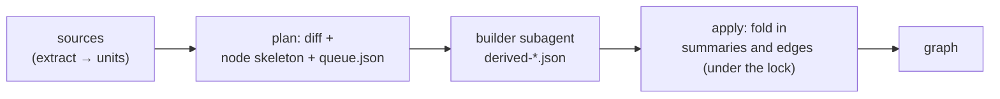
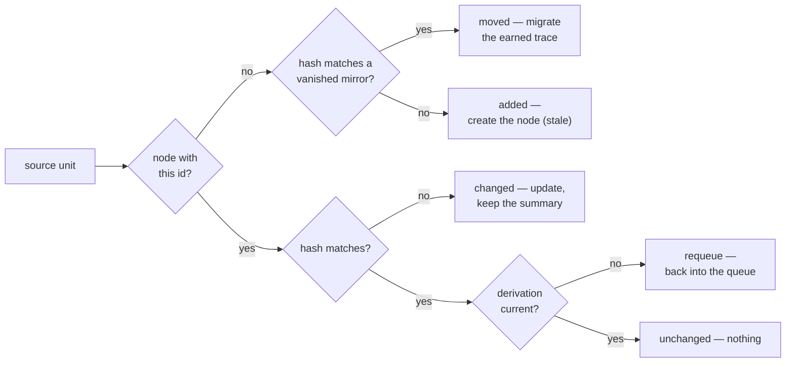
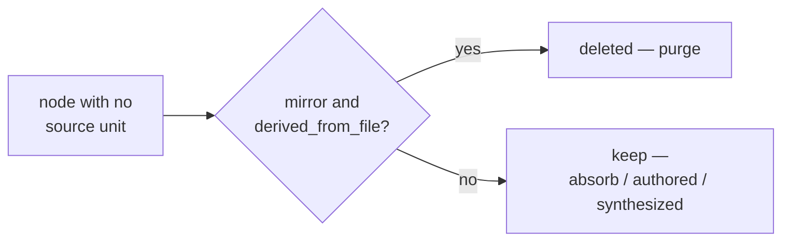

# 05 — Reconciliation and semantic derivation

Reconciliation (`reconcile.py`) is the heart of consistency: it brings the graph into line with the code and documents on disk. All its writes go through store transactions (see [Storage and transactions](./03-storage.md)), so any interruption is recoverable, and content-hash comparison makes it **idempotent**: a re-run with no changes writes nothing and spends not a single model call.

Reconciliation works in **two phases**, split along the "deterministic layer and judgment layer" principle (see [The big picture](./01-overview.md)): first the deterministic part builds the node skeleton and the queue, then the semantic part (a subagent) writes summaries and links, and the result is folded in by a separate command.

Here **semantic derivation** (hence the `derived-*.json` file names) is the meaning-level follow-up extraction: writing a node's summary and meaning-bearing edges with the language model on top of the deterministic skeleton.

## Location and callers

The `reconcile.py` file lives in `skills/amg-bootstrap/scripts/`. It imports `graph_store` (transactions, the lock, recovery) and `extract` / `load_config` from `extract_structure`. The deterministic phase (`plan` / `bootstrap`) and the apply step (`apply`) are run by the `amg-bootstrap` skill; summaries and edges for the queue are written by the `amg-builder` subagent, and the strategic nodes are created by `amg-synth` — their output is folded into the graph by the `apply` command.

## The commands

| Command | Action |
|---|---|
| `python reconcile.py bootstrap [<project_root>] [--root <agent_dir>]` | build or reconcile the graph from any state (+ auto-restore from the derivation cache) |
| `python reconcile.py plan [<project_root>] [--root <agent_dir>]` | the same diff: deterministic writes + the queue |
| `python reconcile.py apply <derivation.json> [<project_root>] [--root <agent_dir>]` | fold in a builder's semantic output |
| `python reconcile.py apply-cached [<project_root>] [--root <agent_dir>]` | restore the queue's derivations from the cache (see "The derivation cache") |
| `python reconcile.py metrics [<project_root>] [--root <agent_dir>]` | the graph connectivity report — the acceptance gate (see "Connectivity metrics") |

`bootstrap` and `plan` call **one and the same** `plan()` function — they are synonyms; "bootstrap" merely expresses the intent "build from scratch", while doing exactly what `plan` does (the graph is built from any state, including empty). `project_root` defaults to the current directory; it is the **sources** root (where units are extracted from), separate from the graph root.

The graph root — `<agent dir>/amg` — is resolved by `graph_store.resolve_amg_root` along a chain (first match wins): an explicit `--root <agent_dir>` → the `AMG_AGENT_DIR` environment variable → an upward search from `project_root` (at every level, first the presets `<dir>/{.claude,.agents}/amg/config.yml` — this is how a globally installed engine finds a project's graph — then the "bare" `<dir>/amg`, only if it is an initialized store) → the engine's own directory, if its `amg/` is an initialized store (the dev layout, a local install) → the default `<project_root>/.claude/amg`. A candidate with the engine signature inside (`skills/`, `agents/`, `install.py`) is rejected as a source checkout, and the home-directory level is skipped — the full rules and rationale are in [Storage and transactions](./03-storage.md). For a typical install the result matches the old behavior: `<project_root>/.claude/amg` (`.claude` is the Claude Code default; in another environment it is the configured agent directory, e.g. `.agents`).

## The diff: reconciliation cases

The `plan()` function compares the units from the sources (see [Structure extraction](./04-ingest.md)) with the graph's nodes. The **content hash** decides (the content-hash filter — skip on a hash match), but not only the source is checked: the derivation's own lag counts too:

| Case | Condition | What it does |
|---|---|---|
| `added` | a unit exists, no node with that `id`, no move recognized | create the node (status `stale`), queue it for derivation |
| `changed` | the node's `source_hash` ≠ the unit's current hash | update the structural fields, **rebuild the structural edges**, status → `stale`, keep the previous summary and semantic edges, queue it |
| `moved` | a vanished mirror node and a new unit with the **same** hash | migrate the earned trace to the new id, redirect inbound references; a derived node arrives `active` and is not queued |
| requeue | the hash matches, but `derived_from_hash` ≠ the hash, or `status: stale` | put the unit back into the queue; the node file is not rewritten |
| pointer drift | the hash matches, but `lineno`/`qualname`/`policy`/`type` diverge from the unit | silently refresh only those fields, no re-derivation (the `pointer_refreshed` counter); a mirror's `type` belongs to extraction — this is how old tree-sitter grammar types converge to the canon |
| `deleted` | a mirror node whose unit vanished and was not recognized as a move | purge the node |
| `unchanged` | hashes match, the derivation is current | nothing — no write, no model call (true idempotency) |
| `frozen` | a node with the `absorb_once` policy already exists | nothing: the source was ingested once and frozen — changes are ignored (no re-derivation, no pointer drift), and deletion does not purge the node |

Deletion is handled by a separate pass over nodes that have no corresponding unit (nodes recognized as moves do not enter it — their old files were already removed by the migration):

The result of `plan()` is the dictionary `{added, changed, moved, deleted, unchanged, requeued_stale, pointer_refreshed, edges_refreshed, frozen, auto_summarized, queued_for_semantic}`; `queued_for_semantic` is the size of the derivation queue (added + changed + requeue + under-derived moved nodes), `frozen` is the number of frozen `absorb_once` nodes whose change was ignored, `edges_refreshed` is the nodes rewritten solely for edge canonicalization (see "The resolver and target canonicalization" below), and `auto_summarized` is the trivial units derived by the deterministic auto-summary with no model and no queue (see "Auto-summary of trivial units"); the `bootstrap`/`plan` CLI adds the `restored_from_cache` field to the summary and subtracts the restored items from `queued_for_semantic` (see "The derivation cache"). Additionally, when present, the diagnostic fields appear: `policy_conflicts` — files that fell under two policies at once (a `mirror`/`absorb`/`absorb_once` overlap), and `missing_sources` — source paths listed in the config but absent on disk, so a typo in `mirror_path` cannot hide behind "added: 0".

## Preservation rules

These are the invariants that protect knowledge from loss (the formal grounding — in `consistency-model.md`):

- **Only mirrors are purged.** The diff deletes exclusively nodes with `source_kind = derived_from_file` **and** `policy = mirror`. `authored` nodes (notes, the model's conclusions), nodes of absorbed sources (`absorb`), and synthesized nodes (hubs) are **never** deleted here — deleting the `data/` folder must not erase absorbed knowledge.
- **A move does not erase the earned trace.** A "vanished mirror + new unit" pair with the same content hash is a move or a rename: the summary, `lang`, the semantic edges with their `coact`, `derived_from_hash`, and the multi-membership migrate to the new id (the primary topic is rewritten from the old directory to the new one); edge targets inside the moved file are switched to the new path, and other nodes' inbound edges and memberships are redirected. A clean move spends not a single model call. Twins (identical content in several files) are paired deterministically by sorted ids; a move combined with a content edit is not recognized (the hashes differ) — that is an ordinary `deleted`+`added`. A move of an absorb source is not recognized either: the diff does not delete its node, so an orphan remains plus a new node, and such near-duplicates are merged by consolidation.
- **On a change, the previous summary is kept.** In the `changed` case the structural fields are updated and the structural edges rebuilt, while the earned summary and semantic edges **remain**; the status merely flips to `stale` until the new derivation is durably recorded. A crash mid-derivation loses nothing: the graph still holds the previous meaningful version.
- **`mirror` and `absorb` behave identically on a source *change*; `absorb_once` does not.** While the source is on disk and its content changed, a `mirror` or `absorb` node is updated and queued for re-derivation **regardless of policy**; the difference between those two shows **only on deletion** of the source (the mirror is purged, the absorbed node survives as an orphaned summary). That is, plain `absorb` is not "once and frozen" but "survives source deletion". The third policy, **`absorb_once`**, is what implements "once and frozen": after the first ingest its node is inert — source changes are ignored (the `frozen` case above), and deletion, as with `absorb`, does not purge the node. `absorb_once` is for a one-off snapshot that must not re-sync even when the original is edited.
- **Saved sessions use the same machinery.** A dialogue dump is ingested like any source (the `session` chunker, see [Structure extraction](./04-ingest.md)), and its policy comes from the `session_policy` key: `absorb` (the default) — the dialogue becomes a distillate and survives deletion of the dump file; `mirror` — the nodes live as long as the file does, and any detail of the dialogue can be fetched in full. Sessions need no special reconciliation code.
- **All writes are transactional.** Before any changes, `plan()` and `apply()` call `recover()` (replaying unfinished transactions), and the changes themselves go as one transaction — an interruption is recoverable (see [Storage and transactions](./03-storage.md)).

## Node creation (the deterministic skeleton)

For the `added` case the new node's fields are set mechanically, with no model: `source_kind` = `derived_from_file`, `policy` inherited from the source, `qualname`, `lineno`, and `line_end` — the unit's pointer and range within the file, `source_hash` = the unit's hash, `derived_from_hash` = `null` (nothing derived yet), `part_of` — the primary membership by parent directory (`_part_of_for`, weight `1.0`), `edges` — the structural edges (`_structural_edges`: `imports` at weight `0.6`, `calls` at `0.7`, and for chat turns `follows` at `0.3` — a link to the previous turn of the same thread; each marked `origin: structural`), `lang` = `working_language` from the config (the language of the future summary), `status` = `stale`, `summary` = an empty string, `updated` = the current time. **The trust layer:** `provenance` is set (`kind` = the unit's category `code`/`doc`/`data`, plus a best-effort git `commit` computed once per run) and `verification` = `{status: unverified, method: none}`; `confidence` is not set at this step — the judgment layer provides it together with the summary (see "Applying the semantics" below). The full field schema — in [Data model](./02-data-model.md). The node body is written empty; the summary and the meaning-bearing edges come with the derivation phase.

### The resolver and target canonicalization

The structural edges are built by a **deterministic resolver** over symbol tables of the whole extraction (`_build_symbols`: the module map, per-file top-level definitions and qualifiers, the import bindings; the principle — [theory, §4.1](../THEORY.md)):

- `imports` — for an **in-project** module the target resolves to its node id via the "dotted name → path" map (`_module_map`): every Python module registers its full dotted path and its suffixes (`src/billing.py` → `src.billing` and `billing`; `pkg/__init__.py` → `pkg`), and an ambiguous suffix — two same-named files in different directories — does not resolve at all: a wrong edge is worse than a dangling one. A stdlib or third-party import stays a dotted name (`code:json`) — deliberately dangling (it records the fact of the import; retrieval drops it);
- `defines` — from the unit's `defines` field; the targets exist by construction;
- `calls` and `inherits` — through `_resolve_symbol`: a bare name → a top-level definition in its own file, then an import binding (`from util import helper`); a qualified reference within the file (`Box.make`) — directly; `self.X`/`cls.X` — a method of its own class; a dotted chain — the head unfolds through the import bindings, then the longest module prefix via the module map, the remainder being the qualifier within that module. **Resolution goes only through the file's own imports** — a name merely coinciding with a module name yields no edge; the unresolvable (builtins, methods of unknown objects, external libraries) **produces no edges at all**.

On top of the resolver runs **target canonicalization** (`_normalize_edges`): the target of any edge that does not name an existing node is repaired by a **unique** path suffix under the same category and qualifier (`code:core/foo.py::Bar` → `code:src/pkg/core/foo.py::Bar`); on ambiguity the target is left alone. Canonicalization applies at `apply` (the judgment layer's edges), in the added/changed/moved branches, and **as a whole-graph sweep on every `plan()`** — including nodes without units (hubs, notes, absorbed orphans). The sweep writes a node only on an actual change, and the edge comparison is order-insensitive (edge order carries no meaning) — so a graph built before the resolver existed is healed by a single `bootstrap` (the `edges_refreshed` counter), while an already-canonical one stays a strict no-op. Along the same path, unchanged units get their structural edges rebuilt too: an extraction improvement (new edge types, removed noise) reaches old graphs without touching the sources.

### Auto-summary of trivial units

Not every unit is worth a model call. A **trivial** function — a dunder like `__repr__`, a one-line getter, a mechanical body a couple of lines long — has no meaning beyond its own text: judgment adds nothing here, and a real project has hundreds of such units. So a code function whose whole definition fits within `trivial_unit_max_lines` lines gets a **deterministic auto-summary**: its own code collapsed into one line (up to 240 characters). Such a summary is language-neutral (identifiers are written verbatim anyway), gives the lexical seed honest tokens, and cannot be hallucinated. The node is created already derived — `derived_from_hash = source_hash`, `status: active` — and never enters the queue; its pointer and structural edges are ordinary. Simply *skipping* such a unit would not work: the requeue rule (`derived_from_hash` lagging or `status: stale`) would return it to the queue forever — which is exactly why the decision is shaped as a summary, not a skip.

Three provisos hold the quality:

- **protocol dunders are not trivial.** Methods whose very presence changes how a class is used — `__call__` (the object is callable), `__enter__`/`__exit__` (a context manager), `__getattr__`/`__getitem__` and the like — go to the model at any size: a template would state the mechanics but miss exactly that semantics;
- **the cache beats the template.** If the unit has a derivation-cache hit, it is queued as usual — the restore returns the judgment layer's earned summary verbatim and for free; the auto-summary applies only on a true miss;
- **no confidence is set.** `confidence` is a judgment-layer estimate; a deterministic summary does not carry one (and is not flagged by the "low confidence" threshold in the pack).

It acts in all diff branches (`added`, `changed`, requeue of the under-derived); the `auto_summarized` counter appears in the `plan()` summary and the log line. The default in code is `0` (off), in the shipped `config.yml` template — `3`: another "code ≠ template" case (see the [Configuration reference](./09-config.md)) — real installs get the savings from the template, while a minimal hand-written config behaves as before. The rationale for the "deterministic before the model" boundary — [theory, §4.1](../THEORY.md).

## Updating on a source change (`changed`)

On `changed`, all the node's structural fields are updated (`source_hash`, `type`, `source_path`, `policy`, `qualname`, `lineno`, `line_end`), and the **structural edges are rebuilt** from a fresh extraction (`_refresh_structural_edges`): the previous `origin: structural` edges are replaced with new ones — a new call yields an edge, a vanished one loses it — and an edge that survived the edit inherits its earned weight and `coact` counter. Edges of other origins are untouched: earned semantics outlives a source edit. The node's `lang` field is deliberately **not** updated — it is the language of the already-written summary and self-corrects on re-derivation. **Verification is reset** (`verification` → `{unverified, none}`): the source changed, so the previous fact check is void (this is the same hash machinery that marks the node `stale`, so no separate "expiry" of verification is needed); `provenance` is re-set (the same `kind`, the current `commit`). On pointer drift (the hash matches, only `lineno`/`qualname` shifted) `line_end` is updated too, and verification is preserved — the content did not change.

An edge's origin is stored in its `origin` field: `structural` — deterministic extraction; `semantic` — derivation edges; `synthesized` — edges of created hubs; `consolidation` — edges created by consolidation actions (see [Data model](./02-data-model.md)). Edges without `origin` (created before the field existed) are treated at rebuild as structural if their type is `imports`/`calls` (the only structural types that existed before the `origin` field; the newer `follows` edge from the chat chunker is always marked `origin: structural` from the start, so it needs no legacy classification); the full labeling of legacy edges is done by `migrate_schema.py`.

## The derivation queue (`queue.json`)

After the diff, `plan()` atomically writes the queue to `work/queue.json` — the input for the semantic phase. Format: `{"generated": <time>, "units": [ … ]}`. Every queue item (`_queue_item`) carries `id`, `kind`, `source_path`, `category`, `content_sha`, the slice pointer `qualname`/`lineno`/`line_end`, and `lang` — the **source language** (`python`, `markdown`, …), not to be confused with the node's `lang` field (the summary language).

The heart of the item is the **`text` field: the unit's own text**, the very slice its hash was computed over (see [Structure extraction](./04-ingest.md) — every chunker attaches it). The builder writes the summary straight from the queue and **never opens the sources at all**: one read of the batch instead of a file-by-file crawl. This is no small thing but the main line item of build economy — every tool read by a subagent resends its whole accumulated context, so inlining the slice into the assignment is many times cheaper than letting the worker re-read the same bytes itself. The `queue_text_max_chars` threshold (20000 characters by default; `0` — a pointers-only queue) guards against anomalously large units — a minified bundle, a "wall" file: text over the threshold is not placed into the queue, and such an item, as before, carries only the pointer — the builder reads the `lineno`–`line_end` slice itself.

The queue is **fully rebuilt by every `plan()` from the graph's state**: it receives the `added` and `changed` cases plus all under-derived nodes (requeue — `derived_from_hash` lagging or `status: stale`). So the queue is written atomically but separately from the node transaction without risk: a crash between the transaction and the queue write (or a lost `queue.json`) self-heals on the very next `bootstrap`. Derived `unchanged` nodes do not enter the queue — that is exactly the model-call savings.

## Applying the semantics (`apply_derivation`)

The builder subagent reads the queue and writes its result to a `derived-*.json` file — a list of items; the `apply` command folds them into the graph. **Two item forms** are supported:

- **Update** — `{id, summary?, lang?, edges?, part_of?, body?, confidence?, content_sha?}` — updates the node with that `id`. Several items may address **the same** node (e.g. `part_of` separately, a `supersedes` edge separately) — each *accumulates* on the node without wiping the previous item's result. The node flips to `active` **only** if the item carries a new `summary` (or the node is not `derived_from_file` — synthesized and authored ones live `active`): then `derived_from_hash` = `source_hash` is set. An item with only edges or `part_of` leaves the source node `stale` — and reconciliation keeps returning it to the queue until a summary appears: a unit counts as "derived" only once its summary is durably recorded. **Confidence:** if the item carries `confidence`, it is clamped to 0..1 and set; if it carries a new `summary` with no explicit confidence, the node gets `default_confidence` (`verification.default_confidence`, 0.7 by default) — so a derived node always has an estimate. Verification is **not** touched by derivation (the builder does not check against the source — that is `verify_claims`'s job).

  **The freshness check (resumable derivation).** An item may carry `content_sha` — the unit hash it was derived against (the builder echoes it, see [Subagents and skills](./08-agents-skills.md)). If `content_sha` is present and **not equal to the node's current** `source_hash` (the source changed since the derivation), the item is **skipped** (`skipped_stale`): applying it would bind the summary to stale content while marking the node derived for the new hash — a blind derivation against a changed source. The node stays `stale`; the next reconciliation returns it to the queue. An item without `content_sha` applies as before (synthesized hubs, backward compatibility).
- **Create** — `{id, type, summary?, lang?, part_of?, edges?, body?, confidence?, derived_from?}` — if no node with that `id` exists, the node is **created**. This is how the synthesis subagent materializes hubs and overviews. It is created with `source_kind` = `synthesized` and `policy` = `authored` in the `_hubs` bucket, so a later reconciliation never purges it as a "vanished source". **The trust layer:** it gets `confidence` (from the item or `default_confidence`), `provenance` = `{kind: model_inference}` plus the optional `derived_from` (the ids it was synthesized from — its "source ids", since a hub has no source file), and `verification` = `{unverified, none}`.

If an update item arrives for an unknown `id` and has **no** `type` field, it is skipped and counted in `skipped_missing` (you cannot update what does not exist, nor tell how to create it). Edges are merged by `_merge_edges` on the `(rel, to)` key: on a match the **greater** weight wins and the co-activation counter `coact` is preserved; a new edge gets `coact = 0` and the default weight `0.5` if none is given. Incoming edges get `origin: semantic` (for created hubs — `synthesized`); an existing edge keeps its `origin` — a structural edge confirmed by the judgment layer stays structural (it can be re-extracted anyway).

Memberships are merged by `_merge_part_of`: topics **accumulate** — a later item does not wipe a membership added by an earlier one; for a matching topic the **new** weight wins (the layer's current judgment — taking the maximum would make weights grow monotonically and block rebalancing); if the weight sum exceeds 1, the shares are normalized to the simplex (under `weights.part_of_renormalize`, the same rule as in consolidation). The command runs under the lock and also calls `recover()` first; the result is `{applied, created, skipped_missing, skipped_stale, skipped_invalid}` (`skipped_stale` — items dropped by the freshness check above; `skipped_invalid` — below).

**Resilience to malformed items.** Every item passes validation/normalization (`_sanitize_item`) and is applied under its own guard — **one broken item never brings down the batch**. What is repaired mechanically: the `confidence`↔`edges` fields swapped in place (an edge list under `confidence`, a number under `edges` — swapped back), a doubled category prefix in a create item's id (`hub:overview:x` with `type: overview` → `overview:x`), malformed edge and membership entries (dropped one by one, the rest of the item applies), a weight outside (0,1] (reset to the default), non-string `summary`/`lang`/`body` (the field is omitted). What cannot be repaired is skipped with the `skipped_invalid` counter and a short reason in the `invalid` field (up to 10 lines): the orchestrator sees the rejects at once without picking through JSON by hand. Item edge targets are canonicalized against the existing nodes (see "The resolver and target canonicalization").

A reliability detail: for an existing node the path and body are read **without stripping** the service fields, so repeated items on the same node accumulate rather than losing the path on the second pass; at write time the service fields (the `_` prefix) are dropped.

## The derivation cache (`cache/derivations/`)

The model's judgment is non-deterministic, so a from-scratch rebuild would produce a different graph every time and charge the full price again (the rationale — [theory, §4.3](../THEORY.md)). Applied derivation items that carry a `content_sha` are saved into a **persistent cache**: `cache/derivations/<sha[:2]>/<sha>.json` — one file per unit content hash, holding `{contract, lang, items}` (the derivation contract version is the `DERIVATION_CONTRACT` constant in `reconcile.py`; `lang` is the `working_language` at write time). Items are stored sanitized but **before** target canonicalization: resolution always runs against the current graph state at restore time.

Restoring: `apply-cached` reads the queue, gathers the items of all units with a hit (hash, contract, and language all match), applies them **through the standard `apply` path** (validation, canonicalization, and the freshness check included), and rewrites the queue with the remainder. The `bootstrap`/`plan` CLI triggers the restore automatically (the `derivation_cache: true` key), so the printed `queued_for_semantic` is the model's real remaining work: a rebuild over unchanged content derives nothing. Changing `working_language` or the contract version invalidates the cache by key; disabling the key or deleting the `cache/derivations/` directory yields a fresh re-derivation (e.g. after switching models).

## Connectivity metrics (`metrics`) — the build acceptance gate

`reconcile.py metrics` (read-only; the same numbers appear as the `connectivity` block in `/amg status`) measures the quality of the built graph: the number of connected components and the largest one's share (over the same symmetric conductance retrieval uses: edges to existing nodes + `part_of` memberships naming a node), isolated nodes, edge resolution — with **internal** dangling edges (unresolved targets of any type except `imports`) separated from **external** `imports` (stdlib/third-party — legitimately dead) — doc nodes without an outgoing `documents` (excluding `stale`; chat turns legitimately lack it — the metric is indicative), and the `stale` count. The `gate: ok | attention` verdict is compared against the config's `connectivity_gate` thresholds and is **advisory**: a skeleton mid-build is legitimately under-linked, so nothing fails — the bootstrap skill reads the verdict as an acceptance check and reacts (rerun global linking, inspect samples). Deferred `stale` nodes are not counted as defects: under lazy derivation an under-derived node is an expected state, and its structural backbone holds connectivity anyway. The metrics live in the reconciliation layer deliberately: `graph_store` is domain-blind and knows nothing of nodes and edges.

## Idempotency and crash safety

Idempotency follows directly from the content-hash filter: a repeated `plan()` with no changes classifies all **derived** units as `unchanged`, makes not a single write, and calls no model; the under-derived ones it merely puts back into the queue (with no graph writes) — not a violation of idempotency but its working form: the queue is derived from the graph's state every time. Rebuilding the graph from any state is safe at any moment.

Crash safety rests on three things: `recover()` at the start of every command replays unfinished transactions; all changes go as one store transaction (the commit is atomic); the queue is written atomically. So a crash at any point is safe: died during derivation — the structural nodes stay `stale` with their previous summaries, the queue is intact, just restart the builder and `apply`; died during `apply` — the transaction is recovered on the next run. Builders, moreover, write their results **in parts** — numbered checkpoint files (`derived-<batch>-p01.json`, `-p02.json`, …) as they go — so even work torn off mid-batch leaves everything already done on disk: the last few units are lost, not hours of work (see [Subagents and skills](./08-agents-skills.md)). The `derived-*.json` files that survived a crash are applied **first** on the next run (the `amg-bootstrap` skill says exactly that): the `content_sha` check skips items whose source has changed, so only the remainder is re-derived, not the whole queue — resumability without token waste.

## Parallel builders

The semantic phase can run in parallel: several builders write to **separate** `derived-*.json` files without touching the graph, and the **sequential** `apply` command folds them in under the lock. So there are no races by construction — the same concurrency model described in [Storage and transactions](./03-storage.md) (a single writing process plus lock-free reads).

## Command line

| Command | Arguments | Lock |
|---|---|---|
| `bootstrap` / `plan` | `[<project_root>] [--root <agent_dir>]` | under the lock (inside `plan()`) |
| `apply` | `<derivation.json> [<project_root>] [--root <agent_dir>]` | under the lock |

Both phases run under the single writer lock and are preceded by recovery. The `--root` flag names the agent directory explicitly; without it the graph root is resolved by the chain described in "The commands".

## Next

- [Documentation map](./README.md) — the architecture table of contents and the way back to the start.
- [02 — Data model](./02-data-model.md) — the full node field schema, identifiers, buckets, statuses, edges.
- [03 — Storage and transactions](./03-storage.md) — the transactions, the lock, and the recovery reconciliation stands on.
- [04 — Structure extraction](./04-ingest.md) — where units come from, the content hash, source policies.
- [07 — Consolidation](./07-consolidation.md) — what happens to weights and summaries after reconciliation.
- [08 — Subagents and skills](./08-agents-skills.md) — the builder and the synthesizer that read the queue and write `derived-*.json`.
