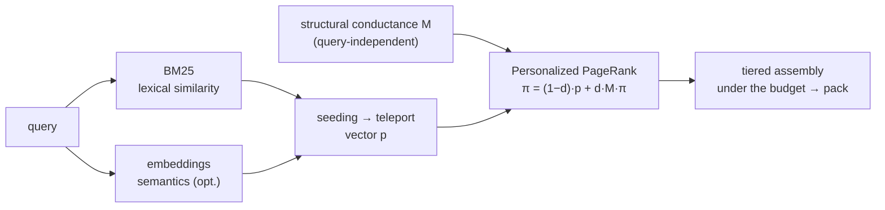
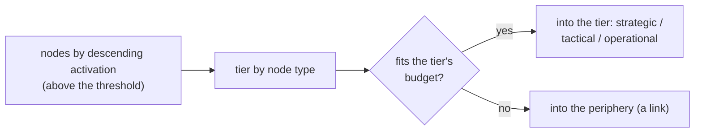

# 06 — Retrieval

Retrieval (`retrieve.py`) assembles, per query, a **context pack** under a budget: the model sees the strategic surround plus the operational detail without loading the whole project. The method is spreading activation, formalized as **query-biased Personalized PageRank** (Haveliwala 2002; the same construction HippoRAG 2024 uses over a knowledge graph); the theoretical grounding — in the [theory](../THEORY.md), sections 6–7.

```
π = (1 − d) · p  +  d · M · π
```

Here `M` is the transition matrix built from the edges' **structural conductance** (query-independent — which is exactly what preserves multi-hop reach), and `p` is the **teleport vector**, encoding relevance to the query. Relevance *biases* the activation distribution toward the right region of the graph **without gating** the edges (the "bias, don't gate" principle from the [theory](../THEORY.md), section 6.4). Retrieval **does not change the graph**: it never touches nodes or edges, writing only its own pack and the co-activation log (below).



## Location and callers

The `retrieve.py` and `embed.py` files live in `skills/amg-retrieve/scripts/`. `retrieve.py` optionally imports `embed` (semantic seeding) and accesses the graph **read-only**; it writes only `cache/pack.md` and `work/coactivation.log`. It is run by the `amg-retrieve` skill — a direct CLI call by default (the printed pack becomes the working context), with the isolated read-only `amg-retriever` subagent as the deliberate exception (see [Subagents and skills](./08-agents-skills.md)). Next to it in the same directory is `eval_retrieval.py` (the quality metrics, see [Evaluation and tools](./10-eval-tools.md)).

## Loading nodes and the searchable text

`load_nodes` reads all the nodes and builds each a "bag of words" for lexical search: the identifier's tail (with `::`, `/`, `_` replaced by spaces), the summary, the `part_of` topics, and the first 600 characters of the body. Tokenization is by **Unicode** words (`\w+` with the Unicode flag): this is critical, because ASCII-only search would silently lose Cyrillic, CJK, and other non-Latin scripts — a Russian-language graph would be invisible to BM25, and any non-Latin query would seed nothing.

## The generated index under `load_nodes` (speed on large graphs)

`load_nodes` is the only per-query hot path, and on large graphs it is expensive: a full walk of `nodes/*.md` with a `yaml.safe_load` of every file (~8 seconds at ~7600 nodes). So next to the pack and the embedding cache lives a **generated read-index**, `cache/index.sqlite` — a disposable, fully rebuildable cache of already-parsed node fields, letting a query read one SQLite table instead of thousands of files. This implements the roadmap decision §4.1 ("markdown is the canon, SQLite is a generated accelerating index"). The module is `index_store.py`, next to `retrieve.py`.

**It stores a projection, not the whole graph.** Per node the index holds exactly what `load_nodes` needs for BM25, pack assembly, and trust marking: `id`, `type`, `status`, `summary`, `source_path`, `lineno`, `line_end`, `confidence`, the ready searchable `text` (the same bag of words), `edges`/`part_of`/`verification` (JSON), and the body. That is **not** the whole frontmatter (no hashes, policy, `qualname`, `lang`, tags, or the `provenance` block — `provenance` is read by `verify_claims` and reconciliation from the full frontmatter; retrieval does not need it) and **not** the source files. Markdown stays the canon; the index is a disposable cache; **only retrieval reads it** (`reconcile`/`consolidate` keep their own full frontmatter walks). The shape of the dictionary `load_nodes` returns does not depend on the index (the scan and the index assemble a node through the shared `_node_from_meta` code), so BM25, `build_adjacency`, and pack assembly know nothing about it; an old index missing new columns raises an sqlite error on read → an unconditional fallback to the scan and a rebuild.

**Speed only, never quality.** The index's output matches the scan byte for byte (tokens are recomputed by the same `WORD_RE`), and on any mismatch, corruption, or missing file `load_nodes` **unconditionally** falls back to the scan — the index never returns a wrong result, only a faster path. Retrieval through the index yields the same ranking and the same pack as the scan (on the `eval --make-demo` demo, hop-recall does not change).

**Freshness by a cheap signature.** Freshness is checked not by reading files but by a stat walk of `nodes/` (path → mtime + size), whose hash is stored **inside** the same SQLite (a meta row — the data and its freshness tag are written atomically, with no companion file that could drift). A query compares the fresh signature with the stored one: match → read the index; no / corruption / no file → scan and rebuild. The signature is taken **before** the scan, so an index built from a scan that raced a write will not be wrongly deemed fresh — the next check rebuilds it.

**The writers themselves maintain it — automatically, with no setup.** After committing a transaction, every graph writer (`reconcile.plan`/`apply_derivation`, `consolidate.fold_weights`/`apply_actions`, `notes.add_note`, `migrate_schema`), under the same lock, does an **incremental** upsert of the changed rows and refreshes the signature — one SQLite transaction, cheap even for a single note (not a full rebuild). If the index does not exist yet, a reader builds it lazily on the first query. **The index has no config key** — it is fully automatic and disposable: "broken — delete it, it rebuilds". No size threshold is introduced: the index is used whenever fresh. The measured `load_nodes` gain is ≈ 15× (7600 nodes: ~8 s → ~0.5 s; a rebuild ~0.15 s); on small graphs the overhead is imperceptible — the index already wins from a few dozen nodes.

## Lexical seeding (BM25)

The base seed is **BM25** (the classic word-match ranking formula): the `BM25` class with the parameters `k1 = 1.5`, `b = 0.75` and the inverse frequency `idf = log(1 + (N − n + 0.5)/(n + 0.5))`. For a query it gives every node a lexical relevance score; the best-matching nodes become the seeds.

## Semantic seeding (embeddings, optional)

The `embed.py` module adds **meaning-level** similarity to the seed — an optional layer over the lexical seed. Lexical search misses paraphrases: the query "how are payment failures handled" and the node "retry on gateway error" barely share words, and the right node is never seeded. Embeddings (numeric vectors of meaning) light up the teleport vector **by meaning, not just by words**. How it works:

- **Backends, light to heavy** (`get_embedder` per the `embeddings` config): `model2vec` — static embeddings, fast, CPU-only, no `torch` (`pip install model2vec`); `sentence-transformers` — full transformer embeddings, heavier, requires `torch`. With `backend: auto`, backends are tried **light to heavy** (`model2vec` first), and the first that loads wins. The default models for an English `working_language` are `minishlab/potion-retrieval-32M` and `all-MiniLM-L6-v2` respectively (non-English projects get multilingual defaults — see "Multilinguality" below); either can be overridden with the `model` key.
- **What gets embedded** (`node_text`): the node's summary plus its identifier (identifiers carry meaning), falling back to the `id` while there is no summary.
- **A hash-filtered cache** (`node_embeddings`): the vectors are stored on disk in `cache/embeddings.json` and recomputed **only for nodes whose embeddable text changed** (the same content-hash trick as everywhere in AMG); entries of deleted nodes are purged. So the cost is paid once per changed node, not per query. The same cache is reused by **global semantic linking** during the build: cross-domain edge candidates are nominated by the similarity of these very vectors (`link_candidates.py` — see [Reconciliation and semantic derivation](./05-reconcile.md) and [Subagents and skills](./08-agents-skills.md)), so the vectors are never paid for twice.
- **The score** (`seed_scores`): the cosine similarity of the query to each node in `[0, 1]` (the vectors are unit-length, so the dot product is the cosine), or `None` if no backend is available.
- **Blending into the teleport vector only.** `retrieve.py` mixes the semantics into the teleport vector with the `blend` coefficient (0 = pure BM25, 1 = pure semantics; default `0.5`), normalizing both scores: `seed = (1 − blend)·BM25ₙ + blend·embeddingsₙ`. The activation spread (PPR) and pack assembly are **unchanged** — the embeddings' effect is isolated and measurable (recall with and without), and a bad embedding model cannot damage the multi-hop structure.
- **Graceful fallback.** If the backend is not installed or the model fails to load, `get_embedder` returns `None` and retrieval stays purely lexical (behavior unchanged).
- **Multilinguality.** The diagnostic command `python embed.py` reports which backends are installed, whether the model loads, and checks cross-linguality (the similarity of `routing`↔`роутинг`). For a non-English `working_language` the engine **picks a multilingual default model on its own** (`model2vec` → `potion-multilingual-128M`; `sentence-transformers` → `paraphrase-multilingual-MiniLM-L12-v2`) — otherwise cross-language semantic similarity would be poor; English projects get the retrieval-tuned `potion-retrieval-32M` (or `all-MiniLM-L6-v2`). The embedding layer is deliberately a *light* enrichment over BM25, so the defaults are light, retrieval- or multilingually-tuned models rather than heavyweight leaderboard leaders; any model can be set with the `model` key. To compare the output with and without embeddings — `eval_retrieval.py --compare-embeddings` (see [Evaluation and tools](./10-eval-tools.md)).

The light-versus-heavy choice deserves a note of its own, because the question comes up immediately. The light multilingual default (`potion-multilingual-128M`) is no toy: on a cross-lingual check (an English query about encryption-key rotation over a Russian summary, next to the English false friend "tire rotation") it confidently pulled up the right Russian node — exactly like the heavy `paraphrase-multilingual-MiniLM-L12-v2`, and where pure BM25 missed. That, however, does **not** prove they are equal in general: one simple case was checked, a static model (in essence a pre-learned vector table) has a real quality ceiling compared to a full transformer, and on longer, subtler, or more ambiguous queries the heavy model usually pulls ahead. So the conclusion is cautious and practical: the light multilingual default is a **sensible starting point even for Russian**, not a knowingly weak option; and whether a switch to the heavy model pays off on your material is answered more honestly by a measurement on your graph (`--compare-embeddings`) than by a general rule.

## The teleport vector

The final teleport vector is the seed plus the `seed_floor` (default `0.0` — pure relevance; a positive value hands every node a base mass). Inside PPR the vector is normalized to sum 1.

## The transition matrix: structural conductance

`build_adjacency` builds the matrix `M` from edge conductance `c(u, v) = w_edge · β(rel)`, where `w_edge` is the learned link strength and `β(rel)` the edge-type prior. Conductance is **symmetrized** (mass flows both ways: association is bidirectional), multiple edges between the same pair are summed, and edges whose target is a nonexistent node are dropped (which is why `part_of` entries that name no node are simply ignored). `part_of` membership also yields edges (with the `part_of` type prior). The key property: the matrix is **query-independent** — that is what preserves reachability along edge chains (multi-hop).

Conductance is rebuilt per query from the loaded nodes and is **not cached separately**: measurement showed `build_adjacency` costs a fraction of a percent of `load_nodes` (tens of ms versus seconds), while serializing a large edge blob on a big graph risks costing more than the rebuild itself. The generated index under `load_nodes` (above) already removes the dominant cost, and conductance is computed over the nodes it loads quickly (the §4.1 decision; if a measurement at tens of thousands of nodes disproves this, the cache returns as a binary format, not JSON).

The `β` priors come from the `relation_priors` config block, with `relation_prior_default = 0.5` for unlisted types; the full list and values — in the [Configuration reference](./09-config.md). Roughly: `documents`/`implements`/`specifies` ≈ 0.9, `calls`/`depends_on`/`inherits` ≈ 0.8, `defines`/`part_of` ≈ 0.7, `imports`/`refines`/`exemplifies` ≈ 0.6, `relates_to` ≈ 0.5, `supersedes`/`contradicts` ≈ 0.3 — strong semantic links conduct activation more readily than weak ones, and a link to a retired or contradicting claim (`supersedes`/`contradicts`) conducts weakly in ordinary search.

## Personalized PageRank

`personalized_pagerank` solves the equation by the **power method** (iteratively): at each step a node hands a share of its mass to its neighbors in proportion to edge conductance (the `d` factor), while the `1 − d` share returns along the teleport vector. **Dead-end nodes** (no outgoing edges) return their mass through teleportation so probability does not "leak". Parameters from the config: `damping` (`d`) `0.85` — how far activation spreads; `max_hops` `30` — the iteration ceiling (more iterations → wider reach); `convergence_tol` `1e-6` — the convergence threshold on the sum of absolute changes. Convergence is guaranteed: for `0 < d < 1` the iteration is a contraction (the Perron–Frobenius theorem), so a few passes converge to a unique distribution regardless of the start. Relevance enters only `p`, and `M` is query-independent — that is "bias, don't gate".

## The status prior and query intent

Before pack assembly, the final activation is multiplied by the node's **status prior** (`status_prior`, the `_apply_status_prior` function). This is a re-ranking by node *validity*, not a gate on edges: the spread has already happened, so multi-hop reach does not suffer. Defaults: `active` and `stale` — `1.0`; `superseded` — `0.2` (a retired claim must not compete as a current fact); `disputed` — `0.5` (an open contradiction, surfaced); `rejected` — `0.1` (found false by arbitration — demoted the hardest). A key subtlety: `stale` (the source changed, the summary lags) is **not penalized** — such a node is often the hottest (freshly edited code); instead of a penalty it is flagged in the pack (below). The values are overridable with the `retrieval.status_prior` key (key by key).

**The query-intent exception.** When a query is deliberately about history/audit or about contradictions, there is nothing to hide — the retired material is exactly what was asked for. So retrieval accepts an intent flag (`--intent history|conflict`), under which the demotion of retired statuses (`superseded`/`disputed`/`rejected`) is **lifted** (multiplier 1.0; the `lift` parameter of `_apply_status_prior`). Under `conflict` a **conflict subgraph** additionally activates: conflict nodes (status `disputed`/`superseded`/`rejected`, a failed verification, or the endpoints of `contradicts`/`supersedes` edges) receive extra mass in the teleport vector **on top of** the query seed — so "show the contradictions" lifts the conflict neighborhood, while a topical query keeps it on topic. Intent is recognized by the **model** (the retriever subagent reads the query in any language) and passed as the flag — there are no language word lists in the code, so the behavior is language-universal (the same "meaning is the model's, mechanics are the code's" principle).

## Tiered pack assembly

`assemble_pack` turns activation into a pack under the budget. Before assembly the activations are **rescaled so the top node reads 1.0** (`_rescale_to_max`, applied right after the status prior), and the `activation_threshold` (`0.02`) reads as a **share of the top activation**: nodes below 2 % of the top are dropped, the rest are ranked by descending activation. The rescale is what makes the cutoff scale-free: PPR mass sums to 1 over the whole graph, so on a large graph even the top node's *absolute* activation falls below any fixed constant while the ranking stays correct — an absolute cutoff would empty the pack exactly where the memory matters most. Ranking order is untouched (a uniform scaling), an all-zero activation stays as is (an unmatched query legitimately yields an empty pack), and the returned `ranked` list carries the rescaled values (the top is always `1.0`, comparable across graphs). Every node lands in a **tier by its type** (`TIER_OF_TYPE`): `hub`/`overview`, the authored rulings `decision`/`adr`, and the **pattern nodes** (`architectural_pattern`/`recurring_fix`/`anti_pattern`/`migration_recipe`) → `strategic` (decisions and reusable patterns are valuable strategic knowledge and surface early, like hubs); `module`/`class`/`package` → `tactical`; `function`/`section`/`file`/`method` → `operational` (the default tier is `operational`). Nodes are added **greedily**: while the tier has budget, the node goes into the tier; otherwise into the **periphery** (as a link list). The periphery is trimmed to `periphery_links`.



The tier budgets come from the config (`token_budget`; the values in force — `strategic` 4000, `tactical` 10000, `operational` 24000, `periphery_links` 60; these are the template's values — the code's built-in fallback is more modest, a "code ≠ template" case, see the [Configuration reference](./09-config.md)). Length is estimated per script band (`_toklen`): ~4 characters per token for ASCII, ~2.2 for other alphabetic scripts (Cyrillic, Greek, Arabic, …), ~1.5 for CJK — a flat 4-chars/token estimate undercounts non-Latin text by ~1.5–2×, silently overflowing every token budget computed with it on a non-English graph (a real field pack shrank by about half at the same budgets once the estimate turned honest; the same estimator bounds the branch token budgets in consolidation). The budgets are deliberately the pack's only size lever: an adaptive stop by accumulated activation mass was measured on a real field graph and rejected — PPR mass sums to 1 over the whole connected graph and stays spread across hundreds of tail nodes, so the ranked prefix never concentrates enough for a mass cutoff to separate signal from tail, while raising the relative threshold trims volume only where it starts costing recall. Rendering depends on the tier: in `operational`, code gets the line `path:line — name — summary` (a pointer, not a body; `line` comes from the `lineno` field, which reconciliation always writes — without it there would be a pointer with no number; with a known `line_end` the pointer widens to the `path:line-line` range so the exact slice can be opened), documents and notes get `### id` + summary + body; in `strategic`/`tactical` — `- id — summary`. The exception is the authored rulings `decision`/`adr` (`DOC_BODY_TYPES`): their rationale body is unfolded **in any tier**, because a decision's value is precisely its reasoning, not a link to it. Greedy packing is near-optimal: the utility is submodular, so the result is no worse than `(1 − 1/e)` of the optimum (see the [theory](../THEORY.md), section 7).

### The compact profile (`--compact`)

On a well-connected graph the full profile's budgets always fill: hundreds of nodes pass the relative threshold, so a targeted lookup — "where is X", "which file holds Y" — would receive the same ceiling-sized pack as entering an unfamiliar subsystem. No statistic of the activations can tell those two queries apart (the mass profile is spread by construction, as above, and field-labeled gold sits as deep as rank ~222 — any scalar cutoff amputates exactly the multi-hop tail), but the **caller** knows which query it is asking. So the choice is the caller's flag: `--compact` in the CLI (the `compact` parameter of `retrieve()`) switches assembly to the **pointer profile**. Its budgets are the built-in modest defaults — strategic 1200 / tactical 2500 / operational 6000 tokens, periphery 40 — deliberately **ignoring** the config's `token_budget`, which serves the full profile; and no bodies are unfolded: a file-backed node in the operational tier renders as the same `path:line — name — summary` pointer line code gets, a node with no source (an authored note) as an `id — summary` line, and only the rulings `decision`/`adr` keep their rationale body in any tier. The pack header reads `# Context pack (compact)`, so the profile in force is visible in `cache/pack.md`.

The trade is depth for size, and it is measured: on the 11 labeled cases of a real field graph (~1130 nodes) the compact pack is about **×3 smaller** (≈128 → ≈42 KB; ≈45k → ≈15k estimated tokens) and holds pack recall — periphery counted — of **0.92** under lexical seeding and **0.81** under the multilingual transformer; what falls out is precisely the deep multi-hop gold beyond the smaller periphery. Hence the usage rule the `amg-retrieve` skill and the activation blocks carry: a targeted pointer question → `--compact`; entering an unfamiliar topic or subsystem → the full profile.

### Trust marks in the pack

Before a node's name/summary the pack may carry a warning note `⟨…⟩` (the `_trust_marks` function) — this is the trust layer (theory — [§15](../THEORY.md)). A mark **does not lower activation** (a demotion would distort multi-hop reach; a freshly edited node is often exactly the one you need) — it merely tells the model to re-check the fact before leaning on it. What gets marked:

- `stale` — the node's status is `stale`: the summary lags a changed source (the mark is unconditional — it works even with verification off);
- `disputed` — the node is in an unresolved contradiction (an arbitration verdict): a conflicting claim exists, show both sides;
- `rejected` — arbitration found the claim false;
- `unverified` — a code node with unverified status (under `verification.enabled` and `warn_on_unverified`): the code claim has not been checked against the source yet;
- `contradicted` — verification failed (the file or symbol is gone) — a strong warning;
- `low confidence` — the node's `confidence` is below the `min_confidence_warn` threshold.

Several reasons fold into one note. The source of truth in a conflict is the live code, so the mark is an invitation to run `verify_claims` (below), not a sentence on the node. With `verification.enabled: false`, only the `stale` flag remains.

### Lazy derivation: the first touch is synchronous

By default derivation is **eager** (`derivation: eager`; see the [Configuration reference](./09-config.md)) — all nodes' summaries and semantic edges are written ahead of time, and everything above describes exactly that. Under the optional `derivation: lazy` the graph may hold nodes **without a summary** — a built structural skeleton awaiting its first touch. In this mode retrieval reports `stale_in_pack` — the list of the pack's activated nodes in the `stale` status (in tier order strategic → periphery, the most visible first). The `amg-retrieve` skill, **before answering**, has the builder finish those nodes (and, if needed, their nearest neighborhood) — the "first touch is synchronous" guarantee: a node that the query itself activated never answers with an empty summary. Under eager derivation `stale_in_pack` is normally empty and retrieval is unchanged. The full specification of the lazy mode and its safeguards — the [roadmap, §4.10](./11-roadmap.md); the first-touch orchestration — [Subagents and skills](./08-agents-skills.md).

## Verifying claims before answering (`verify_claims`)

`verify_claims.py` (next to `retrieve.py`) is the light check of a fact against the live source — the programmatic backbone of the "re-check a code claim before answering" rule (the trust layer; theory — [§15](../THEORY.md)). By default it is **read-only**, so even the read-only retriever can run it. For a file-projected node the script re-chunks the current source with the same chunker structure extraction uses (the hash is computed identically) and compares:

- the file is gone → `contradicted`;
- no unit with this id in the file → `contradicted` (the symbol or section was removed);
- the content hash diverged from `source_hash` → `stale` (the source changed after the summary was written);
- the hash matches → `verified`.

Authored and synthesized nodes are skipped (`skipped`) — they have no source file. The value of a *live* check is that it catches drift the graph has not reconciled yet (a source edited mid-session). The method is recorded (`ast` for Python, `grep` for other code, `doc`). Target nodes are read one file at a time (no full scan), so a "before answering" check over a few nodes is cheap even on a big graph; a group pass (`--all` / `--code`, no ids) does the full walk. The `--write` flag stamps the verdict into the node's `verification` block under the lock (with an index update) — for a manual or CI pass; a plain run does not touch the graph. CLI: `verify_claims.py <id> … --store <agent_dir>/amg [--write | --all | --code | --json | --by-commit]`.

**Source freshness by commit (`--by-commit`).** A separate cheap mode for team work: instead of re-chunking content it consults **git history**. For every file-projected node that carries its ingest-time commit (`provenance.commit`), the mode asks git whether the source changed between that commit and HEAD — one `git diff --name-only --relative` per **distinct** ingest commit (not per node and not by re-chunking), so it scales. It is a **complement** to the exact content check, not a replacement: after a `git pull`, one pass shows which nodes are worth re-checking or rebuilding, without touching the whole graph. With no loss of reliability: no git, or a commit that no longer resolves → the affected nodes land in `unresolved` (rather than being marked changed); a node without `provenance.commit` goes into the `no_commit` counter. The git helpers (`_git_branch`, `_git_changed_since`) live in `reconcile.py` next to `_git_commit`; the branch and current commit are also shown by `/amg status` (see [Subagents and skills](./08-agents-skills.md), the lifecycle layer).

## What retrieval writes (and what it never touches)

With respect to the graph, retrieval is **read-only**: it never changes nodes or edges. Its writes are optional and lock-free:

- **The pack** `cache/pack.md` — an atomic write (the ready context for the model).
- **The co-activation log** `work/coactivation.log` — append-only: pairs of nodes that ended up in the pack together and are joined by an edge are written as a JSON line `{ts, q, coactivated}`. This is the **exposure** signal for consolidation: co-activation by itself no longer **reinforces** weights (the blind circular rule measurably hurt recall — [theory, §8.1](../THEORY.md)) — it serves as the *fade* signal (an edge shown in packs but never leading to use decays) and still feeds the `coact` counter for salience; reinforcement comes from the separate usage log (below). The folding is done by consolidation (see [Consolidation](./07-consolidation.md)); retrieval changes no weights — it only accumulates the signal. **The `--no-pack` coupling:** in the CLI, logging is tied to pack writing (`log_coactivation = write_pack`), so the `--no-pack` flag disables *both* the `cache/pack.md` write *and* this co-activation log. To separate them (a pack without the signal, or vice versa), call `retrieve()` directly with distinct `write_pack`/`log_coactivation`.
- **The pack-composition log** `work/pack-log.jsonl` — append-only, under the same gate as co-activations: per query a line `{ts, q, pack:[{id, source_path}]}` (the nodes in the pack's tiers). This is the input for **usage provenance**: session end intersects the packs' composition with the files actually edited and writes `work/usage.log` — which nodes were not merely retrieved but used (see [Subagents and skills](./08-agents-skills.md), the lifecycle layer). The log is kept **separate** from the blind `coactivation.log` deliberately: pack membership is circular ([theory, §8.1](../THEORY.md)), while usage comes from outside the loop (theory — [§15.5](../THEORY.md)). The improved weight rule reads `usage.log` as the outcome signal under `apply_hebbian` (see [Consolidation](./07-consolidation.md)).
- **The embedding cache** `cache/embeddings.json` — only with semantic seeding enabled; written outside transactions and without `fsync` (acceptable for a recoverable cache), recomputed only for nodes whose embeddable text changed (the content-hash filter).
- **The read-index** `cache/index.sqlite` — lazily and best-effort: if the index is stale or missing, `load_nodes` rebuilds it after the scan (a disposable cache, not the graph; see "The generated index under `load_nodes`" above). Not per query — only after `nodes/` changed; normally the index is already fresh (the writers updated it incrementally) and a query only reads.

## Configuration keys

All keys come from the config's `retrieval` block; absent ones fall back to the built-in defaults (`DEFAULTS`) — the config overrides them **key by key** (`_deep_merge`): a partial nested block (`relation_priors`, `token_budget`, `status_prior`, `embeddings`) overlays the defaults instead of replacing them wholesale, so an unlisted key is never lost. The full reference — the [Configuration reference](./09-config.md).

| Key | Value | Meaning |
|---|---|---|
| `damping` | 0.85 | how far activation spreads |
| `max_hops` | 30 | the iteration ceiling |
| `convergence_tol` | 1e-6 | the convergence threshold |
| `activation_threshold` | 0.02 | the pack cutoff as a **share of the top activation** (activations are rescaled to max = 1 before assembly) |
| `seed_floor` | 0.0 | base mass for every node (0 = pure relevance) |
| `token_budget` | 4000 / 10000 / 24000 / 60 | the tier budgets and the periphery cap (the template's values; the code's built-in fallback is more modest — a "code ≠ template" case, see [09-config](./09-config.md)); the `--compact` profile deliberately uses the built-in values, not this key |
| `relation_priors`, `relation_prior_default` | see above / 0.5 | the `β` conductance priors by edge type |
| `status_prior` | active/stale 1.0, superseded 0.2 | the per-status activation multiplier (validity) |
| `embeddings` | `{enabled, backend, model, blend}` | semantic seeding (optional) |

## Command line

| Command | Action |
|---|---|
| `python retrieve.py "<query>"` | assemble the pack and print it (plus the ranking) |
| `python retrieve.py "<query>" --store <path> --top <N> --no-pack` | set the graph root, the ranking line count, skip writing the pack |
| `python retrieve.py "<query>" --explain` | for the top nodes, show the edges with the largest mass-inflow contribution — activation explainability (`inflow(u→v)=d·π[u]·c/outsum[u]`) |
| `python retrieve.py "<query>" --compact` | the pointer profile for a targeted lookup: built-in modest budgets, operational bodies replaced by `path:line` pointer lines (`decision`/`adr` keep the body) — see "The compact profile" above |
| `python embed.py` | embedding diagnostics: which backends are installed, whether the model loads, cross-linguality |

The default graph root (without `--store`) is resolved by an upward search from the current directory — a mirror of `graph_store.resolve_amg_root` (`retrieve._default_store`: the `{.claude,.agents}/amg` presets first, a "bare" `amg/` only as an initialized store, an AMG source checkout and the home-directory level rejected; the full rules — [Storage](./03-storage.md)) — so from a project directory the **local** graph is found even with a globally installed engine. The retriever subagent passes `--store` explicitly anyway; this default exists for manual runs. (`.claude` is the Claude Code default; another environment uses its configured agent-directory name.)

## Next

- [Documentation map](./README.md) — the architecture table of contents and the way back to the start.
- [02 — Data model](./02-data-model.md) — the nodes and edges the activation flows over; edge types and weights.
- [04 — Structure extraction](./04-ingest.md) — how node text is filled and where the structural edges come from.
- [07 — Consolidation](./07-consolidation.md) — how the co-activation log folds into edge weights.
- [09 — Configuration reference](./09-config.md) — all the `retrieval` block keys and their values.
- [08 — Subagents and skills](./08-agents-skills.md) — the retriever subagent that calls this layer read-only.
