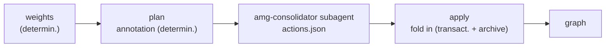
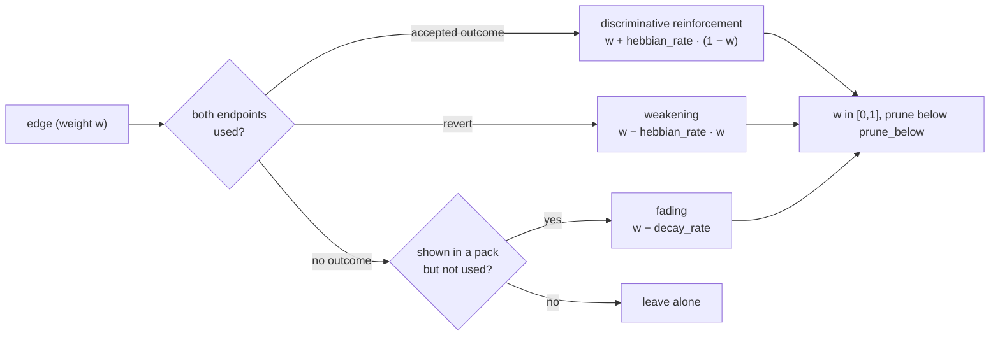
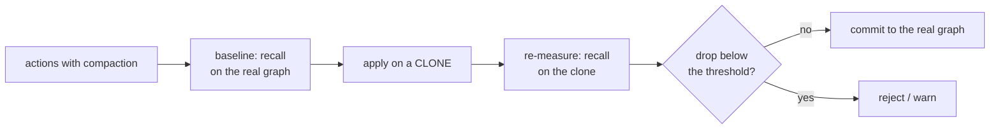

# 07 — Consolidation

Consolidation (`consolidate.py`) closes the memory cycle: it strengthens what was used, selects the session's valuable conclusions into long-term memory, and compacts bloated branches so the graph stays sharp and bounded. As everywhere in AMG, the work is split into a deterministic part (the script) and a judgment part (the `amg-consolidator` subagent); all writes go through the store journal, so an interruption at any point is recoverable. The conceptual grounding — in the [theory](../THEORY.md): Hebbian strengthening and decay (section 8), the salience rubric (section 9), compaction and reversible forgetting (section 10).

## Location and callers

The `consolidate.py` file lives in `skills/amg-consolidate/scripts/`. It imports the transactional store `graph_store` (adding the `amg-bootstrap/scripts/` directory to the path) and calls no language model of its own. It is run by the `amg-consolidate` skill: the deterministic steps (`weights`, `plan`) directly, while judgment is delegated to the `amg-consolidator` subagent, which reads the plan and returns a list of actions; the `apply` command folds them in transactionally. The weight-signal sources are the usage log `work/usage.log` (task outcome, written by `lifecycle.session-end`; provides reinforcement) and the co-activation log `work/coactivation.log` (pack exposure, appended by retrieval; provides fading); details below and in [Retrieval](./06-retrieval.md).

## The three jobs

Consolidation does three things, in order of rising cost and risk: cheap deterministic weights, then plan annotation, then applying the subagent's decisions.

## Weights: signal accumulation, Hebbian rule (optional), decay, pruning

The `weights` step (`fold_weights`) is fully deterministic, no model. First it reads the `work/coactivation.log` and counts how many times each node pair appeared in a pack together (`pair_counts`), remembering the maximum `max_co`. Then, under the lock and after recovery, it processes the edges in one transaction.

**Hebbian weight updates are off by default** (`weights.apply_hebbian: false`). In this mode the step only **accumulates** the co-activation counter (`coact += co` on the edge — it feeds the salience rubric, below) and does **not** change the weight `w`: the graph's conductance stays static and predictable. This is protection against self-reinforcement — the co-activation signal is partially circular (weights → output → pairs → the same weights), so the Hebbian update is enabled only after a measured eval uplift (the rationale — [theory](../THEORY.md), §8.1).

This decision rests not just on caution but on a direct measurement, and the measurement proved eloquent. The off/on recall comparison was run on two graphs. On a small, densely connected graph, updating the weights changed nothing: with few nodes woven tightly by edges, the retrieval outcome is decided by the query seed and the graph's very shape, not by the exact weight values. But on a large sparse graph with long multi-hop paths, the same Hebbian rule **monotonically degraded** the output — with every folding pass recall and hop-recall fell, under every kind of seeding. The cause is the "highways" effect realized: the co-activation signal accumulates most on the already-central edges, blind reinforcement pulls their weight toward the ceiling and turns them into conductance highways, after which activation stops reaching the nodes reachable only over weak, rarely used links — and that is exactly where the multi-hop knowledge lives. In other words, the blind rule does harm precisely in the mode this memory values most, so it is off by default **by measurement**, not out of caution. The same two changes make up the improved rule (described below): *discriminative* reinforcement on the headroom `(1 − w)`, which keeps an already-strong edge from growing for free, and the signal *from the task outcome* (`usage.log`) instead of self-confirming co-activation. On the same large sparse rig the new rule no longer drops recall but **monotonically raises** it under all three seedings (recall ≈ 0.60 → 0.85, hop-recall ≈ 0.25 → 0.70 over eight folds) — the mirror image of the old harm. The `apply_hebbian` default nevertheless stays `false`: the measurement so far used a *synthetic* outcome signal (it proves the rule correct and useful on the graph, not its average benefit under a real `usage.log`), and weight folding sits outside the eval guard. The numbers, their interpretation, and the conditions for enabling — in the [theory](../THEORY.md), §8.2.

When `apply_hebbian: true` **and** an outcome signal exists (a non-empty `usage.log`), the rule is applied to every edge. There are now two sources of different natures: **outcome** (the usage log `usage.log` — which nodes were actually used in an accepted session) provides *reinforcement*, while **exposure** (the co-activation log `coactivation.log` — which edges were merely shown together in packs) provides only *fading*. Co-activation no longer **reinforces**: that was the blind circular rule that measurably hurt recall (below and the [theory](../THEORY.md), §8.1–8.2).

That is: **outcome reinforcement** — if both endpoints of an edge were actually used in an accepted session, the weight grows by `hebbian_rate · (1 − w)` (`0.10`). The `(1 − w)` factor makes the reinforcement **discriminative** ("headroom"): an already-strong edge (`w → 1`) barely grows, while a weak multi-hop one gets leverage — this is what removes the "highways" effect. A **negative outcome** (`reverted`) symmetrically weakens by `hebbian_rate · w`. **Exposure fading** — an edge shown in a pack (`co > 0`) but never used loses `decay_rate` (`0.02`); an edge with no signal at all is untouched. The weight is clamped to `[0, 1]` and rounded; **pruning** removes edges below `prune_below` (`0.05`). A new edge with no explicit weight starts at `default_edge_weight` (`0.5`). The key property: reinforcement comes from `usage.log` — **from outside the retrieval loop** — so it does not self-confirm (the circularity break, [theory §8.1/§15.5](../THEORY.md)).

Weight changes are tied to **the presence of an outcome signal** (a non-empty `usage.log`): without it the weight is untouched, so a repeated `weights` run with no new outcome does not change `w` (semantically idempotent). The co-activation log still accumulates the `coact` counter (feeding salience) and is rotated.

**Membership renormalization** (`part_of_renormalize`) runs **always**, regardless of `apply_hebbian`: if a node's `part_of` weight sum exceeds 1, the weights are divided by the sum so membership shares never exceed one (the simplex) — an invariant, not Hebbian learning, and idempotent. After the pass, the co-activation log is **rotated into the archive** (`archive/coactivation-<time>.log`) and cleared; the usage log `usage.log` is rotated (`archive/usage-<time>.log`) and cleared **only under `apply_hebbian: true`** — an applied outcome signal is counted once, while with the rule off `usage.log` is untouched and accumulates as substrate. The result — `{coact_pairs, reward_pairs, punish_pairs, rewarded_edges, punished_edges, decayed_edges, nodes_updated, hebbian_applied}`. Parameters come from the config's `weights` block.

## The plan: budgets, duplicates, salience

The `plan` step (`make_plan`) is a deterministic analysis of the graph; it does not change the graph but writes the annotation `work/consolidation-plan.json` for the subagent. It computes:

- **Degree centrality** of every node: the number of edges to and from existing nodes (`degree`) and the maximum `max_deg`. Centrality feeds salience and determines which nodes are protected from compaction.
- **Branch membership** (`_branch_members`): for every hub node (`type` `hub`/`overview`) the branch is collected **two ways**. *Upward*: nodes whose `part_of` membership transitively reaches the hub (explicit membership, including weighted multi-membership from synthesis). *Downward*: from the hub, along its containment-ish edges (`HUB_DOWN_RELS` — `documents`/`defines`/`specifies`/`implements`/`contains`), transitively to non-hub nodes (a hub documents a module, a module defines its functions), stopping at any other hub (the branch boundary). The downward path is necessary because a leaf's primary membership names a *directory string* (`src/billing`) that is not a graph node — without it, `over_budget` would stay empty on a real graph.
- **Over-budget branches** (`over_budget`): computed **only under `compaction.enabled`** (with `false` the plan flags no branch — compaction is predictably off). For each hub the budget comes from its `branch_budget` field or from `default_branch_budget_nodes`; the members' total volume is compared against `default_branch_budget_tokens`. The values in force come from the `config.yml` template (`400` nodes / `200000` tokens); the code's built-in defaults differ (`150` / `60000`), but the config overrides them (see the [Configuration reference](./09-config.md)). If the node count or the token count is exceeded, the branch enters the plan with its size, budget, membership, and the compaction step order (`staged_steps`).
- **Merge candidates** (`near_duplicates`): pairs of **episodic** nodes (a type from `episodic_types`, not file-projected — exactly what `merge_near_duplicates` merges) whose lexical Jaccard similarity (over "summary + the first 400 characters of the body") is at least `near_duplicate_sim` (`0.82`). The comparison is narrowed to episodic nodes: the old full pair scan was O(n²) over the whole graph and could propose merging two mirrors — futile, since reconciliation recreates them.
- **Episodic candidates and salience**: nodes with a `type` from `episodic_types` (`section`, `note`, `open_question`, `plan`) that are not file-projected (`source_kind` ≠ `derived_from_file`); each gets a salience score and a "protected" flag (the type is in `protect_types`). The list is sorted by ascending salience (least valuable first) and trimmed to 50.

The result — `{generated, n_nodes, over_budget_branches, near_duplicates, episodic_candidates}`.

## The salience rubric

Salience is a deterministic estimate of the value of information; the soft signals on top of it are judged by the subagent. It is a weighted sum of five signals:

| Signal | Weight | What it measures |
|---|---|---|
| type (`type_score`) | 0.30 | `1.0` if the type is protected (`decision`/`adr`), else `0.4` — decisions and commitments are valuable |
| recency (`rec`) | 0.20 | from the `updated` field: `1 − age_days / (stale_age_days · 4)`, floored at 0 |
| frequency (`freq`) | 0.20 | `min(1, accumulated coact / 10)` — how often the node actually activates |
| bridging (`bridge`) | 0.20 | degree centrality `degree / max_degree` — how much the node ties the graph together |
| provenance (`grounded`) | 0.10 | `1.0` if the node is file-projected, has an **outgoing** `documents`/`implements`/`specifies` edge, **or an inbound one points at it** (someone documents/implements/specifies it), else `0.4` |

The weights sum to one; the result is rounded. Low salience — a candidate for folding or shortening; high — for protection and promotion.

## Applying: transactional and with archiving

The `apply` step (`apply_actions`) folds the subagent's action list in under the lock, in one transaction, and **archives the originals** — nothing is destroyed silently. The helper `archive(id)` writes the node to `archive/<name>.md` and then deletes the original; `redirect_inbound` re-points all edges and `part_of` entries that referenced the removed nodes at the "survivor", and **deduplicates** the affected neighbors' edges by `(rel, to)` (the greater weight, the summed `coact`), dropping any resulting self-loop.

**Two deterministic safeguards act before application** (not only in the subagent's prompt):

- with `compaction.enabled: false`, any compaction action (`summarize_episodes`/`merge`/`introduce_subhub`/`shorten`/`retire`) is **skipped**;
- a protected node — a type from `protect_types` (`decision`/`adr`) or centrality above `protect_min_centrality` — is **never shortened, retired, or archived** (checked for `shorten`/`retire`, the `drop_ids` of `merge`, the `archive_ids` of `summarize_episodes`).

Both are lifted by an explicit `{"force": true}` in the action. The actions:

- **`promote`** — promote a node: change the type (`new_type`), set `status` (default `active`), refresh the timestamp. Not a compaction action — always runs.
- **`retire`** — retire a node: archive it (reversible).
- **`shorten`** — a lossy shortening: **first** save the full version as `archive/<name>.md.full`, then replace the summary and body with the shortened ones. The `.full` write is idempotent — it happens only if the file does not exist yet, so a repeated `apply` never overwrites the original with the shortened version. Recovery is possible from `.full`.
- **`merge`** — merge near-duplicates: keep `keep_id`; merge the edges by `(rel, to)` (the greater weight, the **summed** `coact`), dropping self-loops and edges into `drop_ids`; merge the `part_of` memberships (the simplex); archive the `drop_ids` and redirect inbound links to the survivor.
- **`summarize_episodes`** — fold stale episodes: create a new summary node (`new_id`), archive the originals (`archive_ids`), redirect to the new one.
- **`introduce_subhub`** — introduce an intermediate sub-hub: create a hub node (`hub_id`) and re-parent the members (`member_ids`); in a member, **only** the `parent_topic` topic is replaced with the sub-hub, the other memberships are kept (with renormalization) — grouping never erases earned polyhierarchy.

Created nodes (`summarize_episodes`, `introduce_subhub`) conform to the data model's `synthesized` class: `policy: authored`, `source_hash`/`derived_from_hash` — `null`, `lang` from `working_language`, physically in the `nodes/_hubs/` bucket (see [Data model](./02-data-model.md)). After the commit, the action is appended as a line to `actions.log` — the human-readable audit trail the store keeps **transactionally** (deduplication by `txid`, rotation of old lines into `archive/`; both writing layers write it — consolidation and reconciliation; the full description — [Storage](./03-storage.md), "The action log"). Graph integrity is held by `journal/`, not the log: a failed line write is swallowed and harmless. The `archive_dir` parameter (`archive`) names the archive directory.

## Compaction: when it fires and what is protected

Compaction compresses *the graph itself* (not the window output) and exists so a bloated branch does not inject noise into activation. It **fires only for over-budget branches**: `make_plan` flags them, and the subagent compacts them **stepwise and from the bottom**, in the `steps` order (`summarize_episodes` → `merge_near_duplicates` → `introduce_subhub` → `lossy_shorten`), stopping as soon as the branch is back under budget — the minimum necessary compression. The `compaction.enabled` flag (default `true`) is a **working switch**: with `false` the plan flags no branches and `apply` skips compaction actions (absent an explicit `force`), so the graph predictably stays uncompressed. With the flag on, compaction still fires only on budget overflow — with generous budgets the graph is untouched.

The most valuable is never compressed first, and this is **guaranteed by code** (the safeguards in "Applying"), not just by the subagent's instructions: the `protect_types` types (`decision`, `adr`) and nodes with centrality above `protect_min_centrality` (`0.7`) are protected; the salience rubric additionally spares strongly grounded, recent, and frequently activated nodes. Forgetting is reversible: the originals go to the archive (see the [theory](../THEORY.md), section 10.3), from which a branch can be restored. On top of that, compaction passes an **automatic recall check** (the eval guard) — it measures the result on a clone of the graph and commits to the real graph only if recall holds (next section).

## The automatic recall check (the eval guard)

Compaction changes the graph itself, so it must not silently degrade retrieval. Before applying compaction actions, `apply` measures recall **on a clone of the graph** and touches the real graph only if recall held.

The mechanism (`_eval_gate` inside `apply_actions`):

- the **baseline** is measured on the real graph under the lock, before the transaction is built, by the `eval_retrieval` harness (see [Evaluation and tools](./10-eval-tools.md));
- the **candidate state** — the same actions are applied to a temporary **clone** of the graph (`_clone_for_eval`; a recursive `apply` with the guard off), and recall is measured on it. The real graph does not change until the check passes — so a "rollback of the already applied" is unnecessary and deliberately not implemented (it would be brittle: merging and inbound redirection would already have rewritten the neighbors);
- the **metrics** — `pack_recall` (the share of the gold set in the *assembled pack*: compaction changes the pack's composition, not just top-K ranking) under the `min_recall_delta` threshold, and the aggregate `hop_recall` under `min_hop_recall_delta`; the "after − before" delta is compared;
- the **`on_fail` reaction**: `reject` — no transaction is built, the graph is intact; `warn` — the changes are committed but the drop is recorded in the log and the report; `revert` — a synonym of `reject` (by construction there is nothing to roll back);
- the **report** `work/eval-gate-report.json` — the status, deltas, thresholds, and `regressions`: per case, which gold nodes fell out of the pack and which actions touched them (attribution).

The guard is **robust to missing labels**: if the cases file (`eval_gate.cases`) is absent, empty, or none of its `gold_ids` exist in the graph, the check is **skipped** with a `skipped` mark — compaction is never falsely blocked. The shipped `cases.json` is a neutral template (its `gold_ids` do not resolve), so an install without labels is safely inactive until the user labels their own cases (ids from `inspect_graph.py`) or points `eval_gate.cases` at their file. The guard runs only when there is an **actually applied** compaction action. The `eval_gate` block keys — in the [Configuration reference](./09-config.md).

## Contradiction arbitration

Beyond compaction, consolidation resolves **contradictions** — incompatible claims in memory (the rationale — [theory, §15.7](../THEORY.md)). As everywhere, this is the judgment layer: code detects the candidates and applies the verdict; the `amg-consolidator` subagent decides.

**Detection (`make_plan`).** The plan additionally carries two lists. `contradictions` — node pairs linked by a `contradicts`/`supersedes` edge (`CONFLICT_RELS`), each side with its comparison inputs (`_node_arb_info`): the source rank `source_rank` (per the §15.1 hierarchy: `code` 6 > `doc`/`data`/`user` 5 > `adr`/`decision` 4 > `chat` 3 > `model_inference` 1), `confidence`, the `updated` recency, `verification.status`, `provenance.kind`. `source_contradicted` — nodes whose live check failed (`verification.status: contradicted`): the source moved on, the node is a candidate for supersession or rejection. Code only nominates candidates; the verdict is the model's.

**Verdicts (`apply_actions`).** Five actions, all **non-destructive** — they change status and, where needed, add a linking edge (`origin: consolidation`), but archive and delete nothing. They are therefore reversible and pass through **neither** the `compaction.enabled` gate, nor type protection, nor the eval guard (that one watches compaction, and a status mark does not cut pack recall):

- `supersede` (`winner_id`/`loser_id`) — the loser → `status: superseded`, a `supersedes` edge winner→loser is added;
- `reject` (`id`) — the node → `status: rejected`;
- `dispute` (`ids`) — all sides → `status: disputed`, linked with a `contradicts` edge;
- `ask_user` (`ids`) — like `dispute`, but a `NEEDS USER` mark goes into the audit;
- `keep_both_with_context` (`ids`) — the statuses do not change (both sides stay `active`), only a linking `contradicts` edge is added.

**The audit trail.** Every verdict is appended as a line to `<amg>/arbitration.md` **in the same transaction** as the status changes (atomic and crash-safe): the time, the action, the nodes, the reason (`reason`), and the compared sources (`sources`) from the subagent's action. This is the decision's visible grounds — memory never swaps a fact silently. The file is human-readable and is not rotated (verdicts are rare).

**Statuses.** `disputed`/`rejected` join the node lifecycle alongside `superseded` (see [Data model](./02-data-model.md)) and receive the status multiplier at retrieval (`status_prior`: `disputed` 0.5, `rejected` 0.1; `superseded` 0.2), while a query about history or contradictions lifts the demotion by intent (see [Retrieval](./06-retrieval.md)).

## The `amg-consolidator` subagent

The judgment over memory's fate is made by the `amg-consolidator` subagent (model `opus`, tools Read/Grep/Glob/Bash). It reads the plan and the relevant node bodies, applies the value-of-information rubric to the soft signals, respects branch budgets and protected types, and returns an action list as JSON. It does **not** edit the graph — the script applies the actions transactionally (which is why everything is crash-safe and reversible). The full prompt — in [Subagents and skills](./08-agents-skills.md).

## Configuration keys

Parameters come from the config's `weights` and `compaction` blocks (plus the module's top-level keys); absent ones fall back to the defaults (`DEFAULTS`), which the config overrides. The full reference — the [Configuration reference](./09-config.md).

| Key | Value | Meaning |
|---|---|---|
| `weights.apply_hebbian` | false | enable weight (`w`) updates (Hebbian + decay + pruning); with `false` the step only accumulates `coact` (above and the [theory](../THEORY.md) §8.1) |
| `weights.default_edge_weight` | 0.5 | the starting weight of an edge with no explicit `w` (used both at retrieval and when building conductance) |
| `weights.hebbian_rate` | 0.10 | the outcome reinforcement strength: an edge grows by `rate · (1 − w)` (the discriminative headroom; active under `apply_hebbian`) |
| `weights.decay_rate` | 0.02 | the fading of an edge shown in packs but never used (active under `apply_hebbian` with an outcome signal) |
| `weights.prune_below` | 0.05 | the pruning threshold for weakened edges (active under `apply_hebbian`) |
| `weights.part_of_renormalize` | true | keep membership shares summing to ≤ 1 (always, regardless of `apply_hebbian`) |
| `compaction.enabled` | true | the working compaction switch: `false` disables branch flagging and compaction actions |
| `compaction.default_branch_budget_nodes` | 400 | the branch budget in nodes (the template; the code default is 150) |
| `compaction.default_branch_budget_tokens` | 200000 | the branch budget in tokens (the template; the code default is 60000) |
| `compaction.protect_types` | `[decision, adr]` | types protected in code from compaction/retirement |
| `compaction.protect_min_centrality` | 0.7 | the centrality threshold for code-level protection |
| `compaction.archive_dir` | `archive` | the archive directory for originals |
| `compaction.steps` | 4 steps | the staged compaction order |
| `near_duplicate_sim` | 0.82 | the Jaccard similarity threshold for merging (read from the config) |
| `episodic_types` | `[section, note, open_question, plan]` | the episodic candidate types (read from the config; `open_question`/`plan` are transient authored states, revisited by consolidation) |
| `stale_age_days` | 30 | the base of the recency estimate (read from the config) |
| `eval_gate.enabled` | true | enable the automatic recall check before compaction |
| `eval_gate.cases` | a path | the labeled cases; unresolvable/missing → the check is skipped |
| `eval_gate.min_recall_delta` | −0.02 | the allowed `pack_recall` drop (after − before) |
| `eval_gate.min_hop_recall_delta` | −0.02 | the allowed `hop_recall` drop |
| `eval_gate.on_fail` | reject | `reject` (do not commit) / `warn` (commit + record) / `revert` (≡ reject) |

## Command line

| Command | Action | Lock |
|---|---|---|
| `python consolidate.py weights [<project_root>] [--root <agent_dir>]` | fold the co-activation log into weights | under the lock |
| `python consolidate.py plan [<project_root>] [--root <agent_dir>]` | annotate the plan for the subagent | — (read-only + the plan write) |
| `python consolidate.py digest [<project_root>] [--root <agent_dir>]` | rebuild the always-on digest `<amg>/digest.md` (5–10 salient decisions and open questions; see [Subagents and skills](./08-agents-skills.md)) | — (an atomic write of one file outside `nodes/`) |
| `python consolidate.py apply <actions.json> [<project_root>] [--root <agent_dir>]` | fold in the subagent's actions | under the lock |

The graph root is resolved by the `graph_store.resolve_amg_root` chain (`--root` → `AMG_AGENT_DIR` → the upward config search → the engine's directory → the `.claude` default; see [Storage and transactions](./03-storage.md)) — no `.claude` literal is hard-coded (`.claude` is the Claude Code default; in another environment — the configured agent directory, e.g. `.agents`).

## Next

- [Documentation map](./README.md) — the architecture table of contents and the way back to the start.
- [02 — Data model](./02-data-model.md) — the edges, the `w`/`coact` weights, and the `part_of` membership consolidation works over.
- [06 — Retrieval](./06-retrieval.md) — the source of the co-activation log (the Hebbian signal).
- [08 — Subagents and skills](./08-agents-skills.md) — the full `amg-consolidator` prompt and the `amg-consolidate` skill.
- [09 — Configuration reference](./09-config.md) — all the `weights` and `compaction` block keys.
