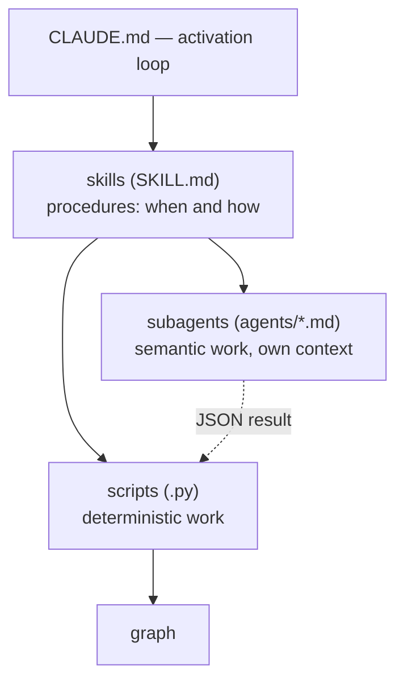

# 08 — Subagents and skills

This section is about the control plane: how the deterministic scripts and the language model are **orchestrated** into one process. Control has three levels: `CLAUDE.md` defines the activation loop (what to do at the start of a session, along the way, and at the end), **skills** are procedures (when and how to perform an operation), and **subagents** are isolated instances of the model doing the semantic work in their own contexts. The key principle: a skill decides *when/how*, runs the scripts, and delegates understanding to a subagent; the subagent works in its own context, returns a short summary, and **never edits the graph** — its output (a JSON file) is folded in transactionally by a script. What the graph stores and how it is built is covered in the other sections; here — who runs it.

## Location

- Skills are `skills/<name>/` directories, each with a `SKILL.md` (the name + a triggering description), `scripts/` (the code), and, where needed, `references/`.
- Subagents are `agents/<name>.md` files (frontmatter with `model` and `tools` plus the prompt).
- `CLAUDE.md` is a small project-memory file loaded at the start of every session (including after `/clear`); at install time its block is appended to the project's root `CLAUDE.md`.

## The three levels of control

A subagent never writes to the graph itself: it hands its result over as a JSON file, and a deterministic script folds it into the graph under the lock (which is why everything is crash-safe and reversible).

## Skills

A skill is a procedure: a folder with a `SKILL.md` whose `description` field says *when* to apply it. It fires on the **meaning** of a request, not an exact word: the model picks the skill itself when the task fits the description. There are three skills.

### `amg-bootstrap` — build or reconcile the graph

Fires on "index the project", "reconcile the graph", "I added/changed/deleted files", "the graph is stale". Runs on the first session in a project, at session start if the sources may have changed, after edits, and after a crash (self-healing). Orchestration is kept **thin**: everything in the orchestrator's context is resent on its every turn, so subagents are handed file **paths** (they read the queue and the results in their own isolated contexts), inspection goes through aggregates only (`inspect_queue.py`, command counters), and per-batch results reduce to a one-line status — raw listings and file contents never enter the conversation. The workflow (from the project root):

1. **Recover.** Replay unfinished writes and clear stale state: `graph_store.py recover`, then `graph_store.py verify --repair`.
2. **Diff and skeleton.** `reconcile.py bootstrap .` — count added/changed/deleted, durably write the structural nodes (with the deterministic edge backbone: `imports`/`defines`/`inherits` + resolver-approved `calls`) and emit the `work/queue.json` queue; derivations already in the cache are restored automatically (`restored_from_cache`), and trivial code units are derived by the deterministic auto-summary on the spot (`auto_summarized`; see [Reconciliation](./05-reconcile.md)) — so `queued_for_semantic` is the model's real remaining work. If it is 0 and the graph is already linked — stop. Beforehand, `extract_structure.py . --stats` shows the classification and tree-sitter availability; if the output lists `ambiguous_files`, their type can (optionally) be refined: run the `amg-classifier` subagent, write its verdict to `work/classification-overrides.json`, and repeat `bootstrap` — extraction reads the overrides **before** its fallback classification and routes the files to the right chunkers. The step is optional: ambiguity never blocks the queue (by default such a file is processed as prose).
3. **Semantic derivation (bulk).** Inspect the queue with the `inspect_queue.py` helper (counters by category/subtree/kind + the `progress` block) without reading `queue.json` into your own context; split it with `partition_queue.py`: it groups by subtree **and bounds every batch** with caps on unit count and estimated volume (`config.yml → builder`), breaking a dense directory into `work/queue-<batch>[-NN].json` parts. Launch one `amg-builder` subagent per batch **in parallel**, handing each its batch path and its output path. Queue units carry their own `text`, so the builder writes summaries straight from the batch without opening sources; it **checkpoints** its result in parts `derived-<batch>-p01.json`, `-p02.json`, … (a written part survives any interruption) and finishes with the line `BATCH COMPLETE: N/M` or `BATCH PARTIAL: N/M` — an honest signal instead of a false "done" (see § `amg-builder` below).
4. **Apply the derivation — and check the counters.** For every produced part file: `reconcile.py apply work/derived-<batch>-p01.json .` — this sets `derived_from_hash = source_hash` and flips the nodes to `active`. A malformed item is repaired or skipped item by item (`skipped_invalid` + reasons), the batch never falls; what was applied lands in the derivation cache (a rebuild restores it for free). The orchestrator does **not** take the builder's word for completion: the sum of `applied + skipped_*` over the batch's parts is checked against its size; a shortfall (or `BATCH PARTIAL`) means a torn batch — finish the remainder with a follow-up builder, or simply repeat step 2 (an under-derived unit returns to the queue by construction, nothing is lost). After every apply round, build progress is a number: `inspect_queue.py .` → `progress.derived_percent`.
5. **Synthesis and the gap report — hubs BEFORE linking.** First `link_candidates.py --hubs .` — deterministic hub anchors from the directory structure (`work/hub-candidates.json`), then a single `amg-synth` subagent: top-level overview nodes and hubs **anchored** to the stable suggested ids (the taxonomy is not reinvented on every rebuild), hub→member edges, weighted multi-membership, **pattern nodes** (when true recurring patterns exist), and the **gap report** (`gap-report.md`). Apply its derivation the same way (step 4); show the report to the user.
6. **Global semantic linking (parallel).** Builders are locked inside their batches, so the cross-domain links (doc↔code, example↔guide, ADR→code) are completed by a global pass: `link_candidates.py .` nominates, for every derived node, its top-K most similar nodes from other domains/files (similarity over the embedding cache; with no backend — a lexical fallback) into bounded batches `work/link-batch-*.json` with the global hub list; one `amg-linker` subagent per batch **in parallel**, output `work/derived-links-<n>.json`, applied as in step 4. The pass is incrementally re-runnable: already-linked pairs are not re-nominated.
7. **The connectivity acceptance gate.** `reconcile.py metrics .` — components, internal dangling targets, doc nodes without `documents`; the verdict `gate: ok | attention`. On `attention` — inspect samples and usually rerun step 6 over the remaining islands; external `imports` (stdlib/third-party) are legitimate and not flagged. The same verdict appears in `/amg status`.

**The derivation strategy (`config.yml → derivation`).** The default is `eager` — derive all queued nodes (steps 3–4 over the whole `queue.json`), then synthesize. The optional `lazy` (sensible only on a graph much larger than what gets queried) builds the structural **map** at once and defers the leaf detail: after step 2 the queue is split by `partition_queue.py --priority .` into a priority batch (module/class/package/file) and a deferred remainder (function/section/record); steps 3–4 run over the priority batch only, and synthesis (step 5) runs **always**. **Safeguards:** the structural skeleton and strategic synthesis are never deferred; a deferred node is derived **on first touch** — when a query activates it, the `amg-retrieve` skill has the builder finish `stale_in_pack` before answering (see [Retrieval](./06-retrieval.md)); background fill goes by `usage.log` (`--priority --usage`). The branching lives at the skill-and-tools level; the engine does not branch on the flag. The full specification — the [roadmap, §4.10](./11-roadmap.md).
8. **The log.** The scripts append a `txid` line to `actions.log`; confirm to the user the final counters, the gap-report digest, and the gate verdict.

The model tiers for the steps are set in `config.yml` (the `models` block) — the installer renders them into the subagent definitions (the `agents/*.md` frontmatter or the Codex TOML; see the [Configuration reference](./09-config.md)). Sources are read-only; a re-run on an unchanged repository is free (the content-hash filter). The full mechanics — [Structure extraction](./04-ingest.md) and [Reconciliation and semantic derivation](./05-reconcile.md).

### `amg-retrieve` — assemble a context pack before a task

Fires on any task naming a function/module/subsystem/feature: "work on / fix / extend X", "how does X work", "what relates to X". Runs **before** touching the code. The workflow:

1. **Formulate the query** — the task plus the concrete identifiers it names.
2. **Launch the `amg-retriever` subagent** — it runs `retrieve.py "<query>" --store .claude/amg`, which writes `cache/pack.md`, and returns the pack's path and a 3–5 line summary.
3. **Read the pack** (`cache/pack.md`) and work from it. Four tiers: *Strategic* (overviews/hubs), *Tactical* (relevant modules), *Operational* (code pointers + the in-focus document/note bodies), *Related* (links to the next ring). For code the pack gives **pointers** `path:line` — edit the real file; the graph is not a copy of the code.
4. If something is missing — widen the query with identifiers and rerun, or follow a *Related* link.

The skill also provides the **eval harness**: `eval_retrieval.py` compares the AMG pack with a lexical (RAG-like) top-k baseline and reports recall, precision, and **hop-recall** (recall on nodes that do not lexically match the query — exactly what spreading activation adds). Modes: `--make-demo <path>` (a reproducible demo labeling) and `--cases cases.json` (your own labeled cases `{id, query, gold_ids}`). The numbers are what you tune `damping`, `activation_threshold`, `token_budget`, `relation_priors` by — not "by eye". The optional semantic seed is enabled in `config.yml` (`retrieval.embeddings`); with no backend, retrieval silently stays purely lexical. Details — [Retrieval](./06-retrieval.md) and [Evaluation and tools](./10-eval-tools.md).

### `amg-consolidate` — memory upkeep

Fires on "consolidate / tidy up / compact the memory", "let's wrap up the session", and on noisy output. Runs at the end of a session (before `/clear`), on a schedule, or on request. The workflow:

1. **Fold the weights** (deterministic): `consolidate.py weights .` — Hebbian reinforcement, decay, pruning, `part_of` renormalization, rotation of the co-activation log into the archive.
2. **Record the session's conclusions** — file decisions, conclusions, open questions, and plans through the safe note API `notes.py add` (and **not** by hand-editing `nodes/`): `notes.py add --type decision --summary "…" [--body "…"] [--tags "…"]`; the types are `note`/`decision`/`adr`/`open_question`/`plan`, the default status is `captured`, the write is transactional and crash-safe. This is the episodic input for the salience step; when in doubt — capture (selection comes later).
3. **The plan** (deterministic): `consolidate.py plan .` — writes `work/consolidation-plan.json` (over-budget branches, duplicate candidates, episodic notes by deterministic salience).
4. **Judgment** — the `amg-consolidator` subagent decides, from the plan, what to promote/retire, what to merge, what to fold, where to introduce a sub-hub, and what to shorten; it returns `work/actions.json`. It does not edit the graph.
5. **Apply** (deterministic, transactional, with archiving): `consolidate.py apply work/actions.json .`

The full mechanics of the weights, the salience rubric, and compaction — in [Consolidation](./07-consolidation.md).

## Subagents

A subagent is an isolated instance of the model (an `agents/<name>.md` file) with its own model, its own toolset, and a narrow prompt. It works in its own context, returns the caller only a short summary, and **never edits the graph or the sources** (read-only); its sole output is a JSON file that a script applies. The summary table:

| Subagent | Model | Tools | When | Output |
|---|---|---|---|---|
| `amg-classifier` | haiku | Read, Grep, Glob | bootstrap, for ambiguous files | JSON: path → `{category, language}` |
| `amg-builder` | sonnet | Read, Grep, Glob, Bash | bootstrap, per queue batch (parallel) | derivation JSON: summaries + edges |
| `amg-synth` | opus | Read, Grep, Glob, Bash | bootstrap, after derivation (hubs — before linking) | derivation JSON (hubs, cross-layer edges) + `gap-report.md` |
| `amg-linker` | sonnet | Read, Grep, Glob, Bash | bootstrap, after synthesis — per candidate batch (parallel) | derivation JSON: confirmed cross-domain edges + hub memberships |
| `amg-retriever` | haiku | Read, Grep, Glob, Bash | at task start | pack path + a 3–5 line summary |
| `amg-consolidator` | opus | Read, Grep, Glob, Bash | consolidation | `actions.json` |

### `amg-builder` (sonnet) — semantic derivation

**Input:** a batch of queue units `{id, kind, source_path, category, content_sha, qualname, lineno, line_end, lang, text?}`, where `lang` is the source language (`python`, `markdown`, …) and `text` is the **unit's own content**, already sliced for the builder (a function's source, a document section, a serialized record, a PDF page, a log slice, a chat message); an output path; the `working_language`. **Does:** summarizes from `text` — nearly every unit has it and it is authoritative, so **sources are never opened when it is present** (re-reading what was already delivered is the top cost item of the build); only for an oversized unit that arrived without `text` (the `queue_text_max_chars` threshold) does it read exactly the `lineno`–`line_end` slice of `source_path`. It writes the **summary** (1–3 sentences on purpose and role, not a retelling; for code, identifiers and signatures verbatim, the prose in `working_language`, no calques) and proposes **edges**: `depends_on` beyond the deterministic ones (imports/calls/defines/inherits are emitted by reconciliation — do not repeat them), `documents` is **mandatory** for a doc unit with a real subject (the connectivity gate counts doc nodes without it), `refines`/`exemplifies`/`relates_to` are softer, `contradicts` only on a real conflict and at low weight; weights in (0,1]: strong ~0.8–1.0, incidental ~0.3–0.5. A target is written with the most specific path it knows — a target without its leading directories gets bound by the resolver to the unique canonical id, but a made-up symbol stays dangling (do not invent); cross-domain completeness is not its job (the global linker provides it after all summaries exist). **Output:** JSON arrays of `{id, summary, lang, confidence, edges, content_sha}`, written as **checkpoint parts** `derived-<batch>-p01.json`, `-p02.json`, … as they are ready (~10 units per part): a written part is durable, so an interruption — a limit, a dropped connection, an output ceiling — loses only the units after the last checkpoint, not the batch (`content_sha` echoes the unit's queue hash: `reconcile apply` skips an item whose source changed since the derivation (`skipped_stale`), so surviving parts apply safely and only the remainder is re-derived — resumability; `confidence` 0..1 is the summary-confidence estimate, absent ones get `default_confidence`). **Rules:** process only your own batch (leave the unchanged alone); when something is unclear — an honest short summary with **low** `confidence` and no speculative edges; the final line is strictly `BATCH COMPLETE: N/M` (every unit covered by written parts) or `BATCH PARTIAL: N/M` naming the last part — **completion is a verifiable claim, not a report**: the orchestrator checks the apply counters against the batch size, so an honest `PARTIAL` is cheap while a false `COMPLETE` would silently lose units.

### `amg-synth` (opus) — the strategic layer and the audit

**Input:** the populated node set (frontmatter), the **hub anchors** `work/hub-candidates.json` (deterministic hints from the directory structure + the existing hubs — written by `link_candidates.py --hubs`), the derivation output path, the gap-report path, the `working_language`. It works on top of the finished summaries, reasoning over the whole graph rather than raw files, and **before** the global linker — hubs must exist before linking. **Produces:** (1) overview and hub nodes (`type: overview` for an overview, `type: hub` for a topic hub; in `nodes/_hubs/`, the origin `source_kind: synthesized` set by the applying script), **anchored to stable ids** (reuse an existing hub when the topic matches, take the candidate's `suggested_id` for a directory topic, invent a new id only for a genuine cross-cutting topic no directory reflects) — so the strategic layer is not rebuilt from scratch on every rebuild; (2) the strategic-layer edges — `documents` from a hub/overview to the modules and key sections it covers (per-node cross-domain linking is `amg-linker`'s job), `part_of` **with weights** for multi-membership (sum ≤ 1; the largest weight is the canonical home), `supersedes`/`contradicts`; (3) **pattern nodes** — on a *genuinely recurring* project pattern: `architectural_pattern` / `recurring_fix` / `anti_pattern` / `migration_recipe` (synthesized, like hubs, ids of the form `pattern:<slug>`), with an `exemplifies` edge **on every instance** (concrete → pattern). Conservatively: a pattern needs several real instances; **never link an instance that does not fit** (a false analogy is worse than a missed one — the `false_analogy_rate` eval catches it). Experience transfer within the project (theory — [§13](../THEORY.md)); (4) the **gap report** (`gap-report.md`): undocumented code (code nodes with no inbound `documents`), drifted docs (describing changed or deleted code), contradictions. **Output:** a derivation JSON (hub ids of the form `hub:<topic>`, pattern ids `pattern:<slug>`; every hub carries `confidence` 0..1 — how well the members support the synthesis — and optionally `derived_from` — the ids it was derived from, its provenance) + the markdown report; on a large graph the derivation is written in **checkpoint parts** as its sections are ready (`derived-synth-p01.json` — hubs, `-p02` — memberships, `-p03` — patterns): a written part survives an interruption, and the parts apply independently. **Rules:** justify every edge; a few high-quality hubs beat many thin ones; read-only; the final message starts with `SYNTH COMPLETE` or `SYNTH PARTIAL` (what is written / what is missing — an interruption is never passed off as success), then a 3–5 line summary and the report counters.

### `amg-linker` (sonnet) — global semantic linking

**Input:** one batch `work/link-batch-<n>.json` — nodes with candidate neighbors nominated by summary similarity over the whole graph (`link_candidates.py`: cosine over the embedding cache, or the lexical fallback), plus the global hub list; the output path `work/derived-links-<n>.json`. **Why:** the builder is locked inside its batch and cannot deliver cross-domain completeness — the linker confirms links across domains and files over the summary layer (it needs no sources — a summary is the node compressed to its meaning; theory — [§4.2](../THEORY.md)). Similarity only **nominates** — it decides. **Does:** confirms real links with the types `documents` (a doc/ADR → code, 0.8–1.0; `specifies` when it prescribes), `exemplifies` (an example → a concept, 0.6–0.8), `depends_on`, `relates_to` (0.4–0.6), `contradicts` (low weight; it does not pick a winner — that is arbitration); rejects accidental word coincidences; for a node clearly belonging to a hub's topic beyond its primary home it adds the membership `{topic: <hub id>, w ≤ 0.3}`. It **does not create** hubs — they already exist (`amg-synth` created them before linking). **Output:** an array of update items (no creates); targets only from the batch and the hub list. **Rules:** a false link is worse than a missed one — when in doubt, skip; instances run in parallel, each strictly over its own batch; the sources and the graph are read-only; to the caller — one line starting `BATCH COMPLETE: judged N/M` with the counters (or `BATCH PARTIAL: judged N/M` if anything cut the work short — an interruption is never passed off as success).

### `amg-classifier` (haiku) — resolving ambiguous types

**Input:** a short list of paths (the `ambiguous_files` from `extract_structure.py --stats`). **Does:** reads the first ~50 lines and picks exactly one — `code` (plus `language` as the tree-sitter grammar name when clear; a shebang is a strong signal), `doc` (prose), or `data` (structured records), by the principle "how is this file best chunked"; when in doubt — `doc` (the safe default the script already uses). **Output:** a compact JSON map `path → {category, language}`, which the skill writes to `work/classification-overrides.json`; the next `extract` reads it **before** the fallback classification (`load_overrides` → `_classify_path`) and routes the files to the right chunkers — `code`+`python` to `ast`, `code`+a grammar to tree-sitter, `data` to the record chunker, `doc` to the paragraph one. An override is stronger than the extension guess, and a missing/corrupted overrides file is treated as an empty map (bootstrap is never blocked). **Rules:** read-only, only the given files, fast.

### `amg-retriever` (haiku) — pack retrieval (read-only)

**Input:** the query string, the store path. **Does:** phrases the query for lexical seeding (adds the concrete identifiers and close synonyms; one line; no unlikely invented terms); runs `retrieve.py "<query>" --store .claude/amg`; skims the ranking and on a miss reruns once (at most two attempts). **Returns:** the `cache/pack.md` path and a 3–5 line summary (which subsystems activated, the top 4–6 nodes, anything notable — say, a decision or a contradiction); it never pastes the whole pack. **Flags untrusted nodes:** if top pack nodes carry the `⟨stale / unverified / contradicted / low confidence⟩` note (the trust layer), it names them so the caller confirms the fact against the source — a code claim is cheaply checked with `verify_claims.py <id> --store <agent_dir>/amg` (file/symbol/hash, read-only). **Rules:** read-only; at most two attempts; if the graph is empty or the path is missing — say so plainly and stop.

### `amg-consolidator` (opus) — judgment during memory upkeep

**Input:** `work/consolidation-plan.json` (over-budget branches, duplicate candidates, episodic notes by salience, the **contradiction candidates** `contradictions`/`source_contradicted`), the relevant node bodies, the `working_language`. **Principles:** value of information, not topic — store and promote decisions, commitments, plans, syntheses, bridges between clusters, reusable principles; demote and compress duplicates, one-off chatter, superseded claims, low-reuse verbosity; ungrounded guesses — as open questions, not facts. **Protection:** never fold or shorten nodes of the protected types (`decision`/`adr`) or highly connected ones; when in doubt — keep (promotion and capture are reversible, loss of meaning is not). **Compaction:** only the plan-flagged branches, stepwise, with a **stop** as soon as the branch is back under budget. **Contradiction arbitration:** for every candidate, compare the sides by the source hierarchy (current code > docs > ADR > session > legacy > a guess), recency, and confidence, verifying code with the live check (`verify_claims.py`) when unsure, and issue a **non-destructive** verdict; when in doubt choose `dispute`, not `supersede`; the grounds (`reason`/`sources`) go into `arbitration.md` (details — [Consolidation](./07-consolidation.md), "Contradiction arbitration"; theory — [§15.7](../THEORY.md)). **Output:** `actions.json` — an array of `promote` / `merge` / `summarize_episodes` / `introduce_subhub` / `shorten` / `retire` actions, plus the arbitration verdicts `supersede` / `dispute` / `reject` / `keep_both_with_context` / `ask_user` (the shapes — in [Consolidation](./07-consolidation.md)); `merge`/`summarize_episodes`/`retire` archive the originals automatically, inbound edges are redirected by the script, and the arbitration verdicts only change status and add a link (deleting nothing). **Returns:** 3–5 lines (counters by action type, which branches were compacted and why, anything notable promoted). Compaction is **automatically checked by the guard**: the applying script measures recall before and after on a clone of the graph and rejects (or applies with a warning) on a drop, so no manual double-check is needed — the subagent proposes the minimum sufficient compaction, and the guard catches the excessive (see [Consolidation](./07-consolidation.md), "The automatic recall check").

## The activation loop (`CLAUDE.md`)

`CLAUDE.md` is a small project-memory file loaded at the start of every session. It carries AMG's activation loop (current behavior):

- **The activation check.** At session start, check whether `.claude/amg/config.yml` exists with `active: true`. Absent or `active: false` → AMG is off, an ordinary Claude Code session, no graph is created. Present and active → follow the loop.
- **The working loop (when on).** (1) **Recover, then sync** — replay any unfinished write (`graph_store.py recover`, `verify --repair`), then, if the sources may have changed or this is the first session, run the `amg-bootstrap` skill before working. (2) **Retrieve before working** — for every task, first assemble context with the `amg-retrieve` skill. (3) **Capture along the way, consolidate at the end** — file decisions, open questions, and plans through `notes.py add` (not by hand-editing `nodes/`; it is cheap and needs no bootstrap, which is for source files only), and at the session's end or before `/clear` run `amg-consolidate` once (conclusions that live only in the chat are lost on `/clear`).
- **The soft barrier: use the memory, do not modify its machinery mid-task.** Using AMG and developing AMG are different modes and must not mix within one task (the activation block sets this off in its own "Boundaries" section). The barrier is threefold: (1) the sources (`mirror_path`/`absorb_path`) are **read-only** during graph upkeep and change only when the user's own task changes them; (2) AMG's own skills, agents, and scripts are infrastructure, not the task surface: **do not edit** them within a task, and report a spotted bug or limitation to the user — the installed copy must match the canonical tested version, and editing the very engine that is currently executing is a straight path to silently corrupting the memory in use; (3) the store's service state (nodes and the disposable `cache/`/`work/` caches) is written only by the scripts, transactionally — on an inconsistency run `repair`/`sync` and let the engine rebuild rather than editing by hand (the caches are generated and safely recreated).
- **Recovery.** On any inconsistency — `recover` + `verify --repair` + `reconcile.py bootstrap .`.

## The lifecycle layer: hooks, commands, and the digest

The activation loop above describes what the **model** does. On top of it sits the lifecycle layer: it performs the routine **deterministically, with no model involved** (via Claude Code hooks) and provides **explicit commands** for manual control. It is held together by one thin orchestrator script — `lifecycle.py` (in `skills/amg-bootstrap/scripts/`): it carries no graph logic of its own, calling the modules already described — `graph_store` for healing and `consolidate` for weight folding and the digest.

### The `automation` flag

The `automation` key in `config.yml` (boolean, default `true`, like `active`) is the master switch of autonomy:

- `true` — the model runs the loop itself, and the `SessionStart`/`SessionEnd` hooks automatically heal the store, fold the weights, refresh the digest, and dump the session transcript;
- `false` — **nothing happens on its own**: only the `/amg …` commands, direct skills, and explicit requests work.

`lifecycle.py` checks the "`active: true` AND `automation: true`" conjunction at the start of every hook operation; if either is false, the hook exits quietly with no action. That is how `automation: false` guarantees a fully manual mode.

### The `SessionStart` / `SessionEnd` hooks

A Claude Code hook is a **shell command** bound to a session event and configured in `settings.json` (which is **not** `config.yml`: different mechanisms; `settings.json` lives in the agent directory). The installer writes two commands there (in the dev sandbox — the manual predecessor `sync_testbed.py`):

- **`SessionStart` → `lifecycle.py session-start`**: replays unfinished writes and removes a stale lock (`recover` + `verify --repair`), then refreshes the digest. Cheap healing at session start that makes an interrupted previous run a non-event. If it healed something, it prints a friendly note about the previous session's unclean end (otherwise it stays silent, with no per-session noise; see below).
- **`SessionEnd` → `lifecycle.py session-end`**: deterministically folds the co-activation log into the weights (`consolidate weights`), refreshes the digest, **dumps the session transcript** into `sessions/` (below), and records **usage provenance** into `work/usage.log` (below).

A principled limitation set by the mechanism itself: **a hook cannot launch a subagent.** So the hooks do only the deterministic half of the upkeep; the "judgment" half of consolidation (the `amg-consolidator` subagent — promotion, merging, compaction) stays with the model, driven by the activation loop, not a hook. The transcript dump, though, is deterministic (a `.jsonl` parse, no model), so it lives right in `session-end`. Under the default `apply_hebbian: false`, hook-driven weight folding is safe: it only accumulates the `coact` counter without touching conductance (see [Consolidation](./07-consolidation.md)).

**When `SessionEnd` fires.** On `/clear` (reason `clear`) and on a clean exit from the environment (`logout` / `prompt_input_exit` / `other`) — the matcher-less `settings.json` entry catches all reasons. A **hard kill** (the terminal window closed, `kill`, an OS failure) does **not** fire `SessionEnd`: the end-of-session upkeep (weight folding, digest refresh, the transcript dump) is simply skipped that time. Nothing is lost — the next `SessionStart` heals the store (`recover` + `verify --repair`, see [Storage and transactions](./03-storage.md)) and refreshes the digest, and the nearest consolidation catches the weights up (non-destructively, merely deferred). The main insurance against losing conclusions is capture along the way through `notes.py add`: every note is its own completed transaction and survives any kill, so `SessionEnd` need not be relied on for preservation.

### The session dump (`SessionEnd`)

At session end, `session-end` saves the dialogue so conclusions are not lost on `/clear`. Claude Code feeds the hook a JSON on stdin with the session transcript path (`transcript_path`) and the end reason; `lifecycle.py` parses that `.jsonl` and writes a markdown dump to `sessions/YYYY-MM-DD-HHMM.md`:

- the **texts** of the human and assistant turns are kept, with the role markers `=== Human ===` / `=== Assistant ===`;
- the model's **raw thinking** (`thinking`) is cut — it is not stored;
- mechanical material (tool calls and their results, attachments) is not reproduced: every attachment gets its own numbered marker `== Attachment N: <type> ==` (so several attachments in one message do not collapse into one counter);
- service wrappers (slash commands, the `!`-bash mode, the environment's meta inserts) are filtered out.

From there the dump is an ordinary source: the next `bootstrap` chunks it by turns (the `session` chunker) and folds it into the graph under the `session_policy` policy (`absorb` by default — the dialogue becomes a distillate; `mirror` — the nodes live as long as the file does; see [Structure extraction](./04-ingest.md) and [Reconciliation](./05-reconcile.md)). The marker format is the shared contract of the dump writer and the chunker.

**Portability.** The `.jsonl` parsing and the `SessionEnd` hook itself are Claude Code mechanisms. In an environment without them there is no auto-dump; the portable "the dialogue is not lost" insurance is note capture along the way (`notes.py`), which survives even a hard kill. The sessions directory is **computed** from the store root, so it is correct under any agent directory; where the transcript path is known, the dump can be invoked by hand: `lifecycle.py session-end --transcript <path>`.

### Usage provenance (`usage.log`)

At session end, `session-end` also records **usage provenance** — which memory nodes were not merely retrieved but **actually used** (theory — [§15.5](../THEORY.md)). From the same transcript it collects the files touched by the editing tools (`Edit`/`Write`/`MultiEdit`/`NotebookEdit`) and intersects them with the session's pack composition (the `work/pack-log.jsonl` log that retrieval writes). Nodes whose `source_path` was among the edits count as used and are appended to `work/usage.log` as a `{used, edited_files, outcome}` line; `pack-log` is per-session, so it is consumed (cleared) at this step.

Why separate from the blind `coactivation.log`: pack membership is circular (weights → pack → pairs → weights, §8.1 of the theory), while usage comes **from outside the loop** — from what the human did with the node. So `usage.log` is the honest, non-self-confirming substrate for the Hebbian rule: the weight folding reads it when `apply_hebbian` is on (the rule is off by default, and the log simply accumulates; see [Consolidation](./07-consolidation.md)). The outcome (`outcome`) is coarse for now (`completed` — the work reached edits under a normal exit); a finer gradation (accepted / merged / reverted) is arbitration's job. Portability matches the dump's: the attribution rests on the Claude Code transcript; without the hook no usage is written, and the portable signal is the notes taken along the way.

### The unclean-shutdown notice

A hard kill skips `SessionEnd`, so the folding/digest/dump are skipped that time and the store self-heals only at the next `SessionStart` — silently. So that this does not go unnoticed, `session-start` and `repair` **detect** a healed crash — replayed unfinished transactions or a removed stale lock (via a read-only check *before* taking the lock: acquiring it steals the stale one itself, and `recover` empties the journal, so the evidence is gone afterwards) — and print a friendly note: "the previous session ended uncleanly: …; recovered, moving on; notes made through `notes.py` are intact". `session-start` prints it **only when it healed something**; a clean start stays silent.

### The `/amg` commands — the single front door

The `/amg <verb>` slash command (the `commands/amg.md` file in the agent directory) is the single front door to every AMG operation. The verbs fall into classes:

- **control** (`status` / `on` / `off` / `repair`) — executed by the `lifecycle.py` script directly:
  - `status` — the one-screen state report (below);
  - `on` / `off` — toggle `active` in `config.yml`. Note: `on` only raises the flag — **the graph is built by `sync`**, not by `on`;
  - `repair` — `recover` + `verify --repair` on demand (the manual counterpart of the `SessionStart` hook; works regardless of `automation`);
- **work** (`sync` / `retrieve` / `consolidate`) — delegate to the corresponding skill (`amg-bootstrap` / `amg-retrieve` / `amg-consolidate`): they need the model's judgment and the subagents, which a script command cannot provide;
- **viewing** (`view`) — a direct run of `export_graph.py --store <agent_dir>/amg --open`: exports the graph into the self-contained offline 3D viewer `cache/graph.html` (read-only; `--json` exports for external tooling); also available through the `amg-retrieve` skill.

The command is marked `disable-model-invocation: true` — **only the user** invokes it (the model does not run the control verbs on its own: switching the memory off or repairing it must be a human's deliberate act, not a guess). The work skills themselves remain both directly invocable (`/amg-bootstrap`, etc.) and triggered by the meaning of a request.

**Flexible verbal triggers.** Beyond the exact commands, the operations are invoked in plain language, and the model matches **intent and synonyms**, not literal verbs: "turn on / activate / start AMG" → `on`; "build / update / sync the graph" → `sync`; "let's wrap up / tidy the memory" → `consolidate`. The fuzzy matching is carried by the operations table in the activation block and by the skills' `description` fields (they fire on meaning). The full "operation → command / skill / verbal cue" table — in the activation block and the [guide](../GUIDE.md).

### `/amg status` — state without reading files

`status` gathers onto one screen what would otherwise be fished out of files: `active` and `automation` (from `config.yml`), the graph root (as resolved by `resolve_amg_root`), the current git branch and commit (`None` outside git), the node count, `stale`, and the per-status breakdown (from `nodes/`), unfinished transactions and a stale lock (`graph_store.verify`), nodes with git conflict markers (`find_conflict_markers`), the queue size (`work/queue.json`), the last pack's time (`cache/pack.md`), the last consolidation (its latest line in `actions.log`), the eval-guard summary (`work/eval-gate-report.json`, if present), and the `connectivity` block — the connectivity metrics with the gate verdict (components, the largest share, isolated nodes, internal dangling edges, doc nodes without `documents`).

### The always-on digest

The memory loop's main failure is **"the memory exists but was never consulted"**: the answer sits in the graph, but the model never ran a retrieval. The insurance against it is a small auto-generated block next to the entry point, loaded into **every** session.

Consolidation produces it: `consolidate.py` (the `write_digest` function, the `digest` command) writes `<agent_dir>/amg/digest.md` — the 5–10 most salient **standing decisions and open questions**. Selection reuses the same salience rubric (`salience`) as the rest of the module: nodes of the types `decision`/`adr`/`open_question` with the status `active`/`captured` are taken (superseded ones excluded), ranked by salience, and up to 6 decisions and up to 4 questions go into the block; if there are none yet — a short placeholder.

The digest is wired in by an **import** at the entry point: the `@.claude/amg/digest.md` line in the activation block — Claude Code expands its contents into the context at every start. This works **before the hooks and besides them**: the digest is loaded by the always-loaded entry-point file itself, even if the hooks are not configured or `automation: false`. It is kept fresh by consolidation (`weights`/`apply` refresh the digest) and by the `SessionStart`/`SessionEnd` hooks.

### Manual and automatic: parity

**Every** automatic operation has a manual counterpart: the hook's healing ↔ `/amg repair`; the hook's weight folding ↔ the `amg-consolidate` skill (or `consolidate.py weights`); the digest ↔ `consolidate.py digest`. So `automation: false` takes nothing away — it merely hands the initiative to the user.

### Portability of the control layer

An important environment caveat: **the `settings.json` hooks, slash commands, and the entry point's `@`-import are Claude Code mechanisms.** Other agent environments (Codex, Qwen Coder, and others that read `AGENTS.md`) may not have them. The portable substrate that works everywhere is the **model-driven activation loop + verbal triggers + direct script calls**: ordinary Python scripts that need no hooks, slash commands, or isolated subagents (`agents/*.md` the model simply reads as instructions in such an environment). Hooks and commands are a convenient Claude Code superstructure over that substrate. The names `.claude` (the agent directory) and `CLAUDE.md` (the entry point) are the Claude Code defaults; another environment uses its own.

So the installer (`install.py`, the `--env` flag) **deploys a mechanism per environment**, not just substituted paths. Three modes:

- **`claude-code`** (the default) — the skill-aware block + the `settings.json` hooks + the `/amg` slash command; the model choices render into the `agents/amg-*.md` frontmatter.
- **`codex`** — OpenAI Codex: an environment **with** skills and subagents but without Claude hooks, the slash command, or the `@`-import. The skills go to `.agents/skills`, the subagents render as **TOML in `.codex/agents`** (with `model`/`model_reasoning_effort` from the `models` block), the skill-aware block from the `entrypoint/AGENTS.codex.md` template is injected; the loop and digest reading are driven by the model.
- **`generic`** — any other AGENTS.md environment **without** skills (e.g. Qwen Coder): the separate skill-less block from `entrypoint/AGENTS.md`; no hooks or command are written.

The **engine prompts themselves are portable**: the installer renders the `.claude` paths in `SKILL.md` and `agents/*.md` (for Codex — in the TOML subagent bodies) for the chosen agent directory, just like the entry-point templates — copying them verbatim would leave wrong paths in another environment. The memory's baseline functionality does not depend on the environment; the set of conveniences does.

**How the loop runs without skills (the `generic` mode).** In the `codex` mode, skills and subagents work as usual — like in Claude Code, only without the hooks and the slash command. In the `generic` mode there are no skills, so the same three operations run model-driven, by direct script calls, with the main model instance playing the subagent roles by reading their prompts as instructions:

- **sync** — `graph_store.py recover` + `verify --repair`, then `reconcile.py bootstrap`; if the queue is non-empty, the model **itself** writes the summaries and meaning-bearing edges from `work/queue.json`, guided by the `agents/amg-builder.md` (per summary) and `agents/amg-synth.md` (the overview, hubs, cross-layer edges, the gap report) prompts, puts the result into `work/derived-*.json`, and folds it in with `reconcile.py apply`;
- **retrieval** — `retrieve.py "<query>" --store <agent_dir>/amg`, then reading `cache/pack.md`;
- **consolidation** — `consolidate.py weights`/`plan`, judgment per `agents/amg-consolidator.md`, then `consolidate.py apply`.

So subagents are replaced by **reading their prompts as instructions**, skills by **direct script calls**, the digest `@`-import hook by the model itself **reading** `<agent_dir>/amg/digest.md` at session start, and the `SessionStart`/`SessionEnd` hooks by **loop discipline** (the model heals at the start and consolidates at the end on its own). The full text — the `entrypoint/AGENTS.md` template. **Note:** this mode is **not yet tested** in non-Claude-Code environments (Codex, Qwen Coder, etc.), stability is not guaranteed — all testing so far was in Claude Code; verifying those environments is a separate roadmap stage still ahead (see also the [roadmap](./11-roadmap.md), §4.9).

## Installing the control layer

The control plane is laid out by the `install.py` installer (in full — [Install](../../../INSTALL.md) and the [roadmap](./11-roadmap.md)). It renders the entry-point templates (`entrypoint/CLAUDE.md` or `entrypoint/AGENTS.codex.md`/`AGENTS.md` per `--env`), `entrypoint/settings.json`, and `entrypoint/commands/amg.md`, as well as the **engine prompts themselves** — `SKILL.md` and `agents/amg-*.md` (for Codex — the TOML subagent bodies in `.codex/agents`) — for the chosen `agent_dir`/`entrypoint`, and injects the **activation block** at the end of the entry-point file between the markers `<!-- AMG:BEGIN -->` and `<!-- AMG:END -->`: the project's own instructions stay above, and a reinstall replaces only the block (no file — one is created with just the block; the template's standard "# Project memory" preamble is trimmed at injection). The `settings.json` hooks are **merged** with existing ones (foreign hooks and keys are intact), the `commands/amg.md` command and an empty `digest.md` are put in place so the digest import resolves before the first consolidation. Under a global install, the engine paths in the block are absolute while the graph and `config.yml` stay local; in environments without hooks and slash commands the portable substrate works — the activation loop and the verbal triggers (see "Portability of the control layer" above).

## Next

- [Documentation map](./README.md) — the architecture table of contents and the way back to the start.
- [01 — The big picture](./01-overview.md) — the orchestration map and the repository structure.
- [04 — Structure extraction](./04-ingest.md) — the input for `amg-classifier` and `amg-builder`.
- [05 — Reconciliation and semantic derivation](./05-reconcile.md) — how the `amg-builder` and `amg-synth` derivations are applied.
- [07 — Consolidation](./07-consolidation.md) — what `amg-consolidator` does and the action shapes.
- [09 — Configuration reference](./09-config.md) — `active`, `models`, `automation`, `session_policy`, and the other keys.
