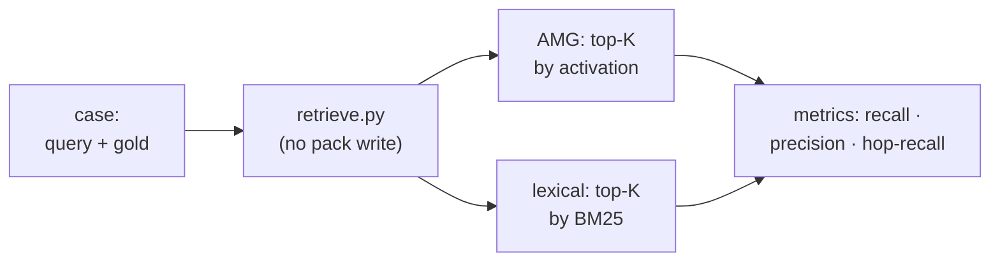

# 10 — Evaluation and tools

Retrieval quality is not a matter of taste — it is measured. Two tools in `skills/amg-retrieve/scripts/` serve that, both **read-only**: `eval_retrieval.py` (measures retrieval recall/precision and compares against a lexical baseline) and `inspect_graph.py` (a node browser, also for picking the gold `gold_ids` for evaluation cases). A third tool in the same place, `bench.py`, measures not quality but **speed** at scale (a section below). A fourth, `export_graph.py`, measures nothing — it **shows** the graph: exports it to JSON and to the self-contained 3D viewer (a section below). What is being measured is the spreading-activation output from [Retrieval](./06-retrieval.md); the eval harness is provided by the `amg-retrieve` skill (see [Subagents and skills](./08-agents-skills.md)).

## Location and callers

Both files live in `skills/amg-retrieve/scripts/` and import `retrieve.py` (reusing the same node loader, `load_config`, and the `retrieve` function), so they measure exactly the path that serves real output. They are run by hand or through the `amg-retrieve` skill. "Read-only" refers to the **existing** graph: the working graph's nodes and edges are never changed. The single exception is the `eval_retrieval.py --make-demo <path>` mode, which **creates** a new labeled demo graph in the given directory (the working graph is untouched).

## Why measure

The goal is to turn "is this better than RAG?" from an opinion into a **number**, and to get a signal for tuning the weights, thresholds, and the salience rubric. So the retrieval knobs (`damping`, `activation_threshold`, `token_budget`, `relation_priors`) are turned by numbers, not "by eye".

## `eval_retrieval.py` — metrics and the baseline comparison

The tool takes **labeled cases** (the gold set — the nodes that *should* appear in the output) and computes three metrics per case:

- **Recall** = the share of the gold set that made the output.
- **Precision** = the share of the output that is in the gold set.
- **Hop-recall** = recall restricted to the gold nodes that **do not lexically match the query** (reachable only over edges). This isolates exactly what spreading activation adds over a plain lexical or vector top-k.

Two retrievers are compared at **equal exposure** K (= the number of gold nodes, R-precision style): the **lexical** one (top-K by BM25 alone — a stand-in for ordinary RAG top-k) and **AMG** (the `retrieve.py` pack based on Personalized PageRank).

For the measurement, `evaluate_case` calls `retrieve` with the pack write and co-activation logging disabled — the measurement pollutes neither the pack nor the Hebbian signal. The top-K of the activation ranking (AMG) and the top-K by BM25 (lexical) are taken; the **hop gold** is the gold nodes that landed below K in the lexical ranking (i.e. lexically unreachable). Additionally, `pack_recall` is computed — whether the *assembled pack* (all tiers) contains the gold — and `missed_by_amg` (what AMG failed to fetch). `run` averages over the cases; `print_report` prints the per-case table and the averages line.

### The demo (`--make-demo`)

The `--make-demo <path>` mode builds a synthetic labeled graph of two subsystems (ids in the `doc:`/`code:` canon) and runs the evaluation at once — a reproducible proof of the hop-recall advantage. The graph is arranged so that in the billing subsystem **two gold nodes are reachable only over edges** (the retry decision via `relates_to`, the total computation via `calls`) and share no words with the query about a "declined card"; next to them sit **distractor nodes** that match the query's words but are unrelated to the payment flow and are not in the gold set (a purely lexical ranker spends its budget on them, crowding out the correct multi-hop nodes); the authentication subsystem is a distractor and must not appear (the precision check). The demo thus shows: the lexical baseline sags on multi-hop nodes, while activation reaches them.

### The embeddings comparison (`--compare-embeddings`)

The `--compare-embeddings <path>` mode builds a **separate** small graph (an isolated cross-lingual pair: a Russian-language gold node against an English "false friend" that matches only by a word) and runs the cases **twice** — with embeddings `off` and `on`, printing both summaries. The semantic seed's contribution thus becomes a number: you see whether it lifts recall (on this graph — recall `0.00 → 1.00`). The embedding graph is kept **separate** from the multi-hop demo deliberately: in a shared graph the connected case would siphon PPR mass from the isolated one through dangling redistribution, distorting the measurement. On your own graph, run the comparison with the same `--store`/`--cases`.

### Pattern-node metrics (`--pattern-demo`)

Pattern nodes (experience transfer within a project; [Data model](./02-data-model.md), [theory §13](../THEORY.md)) are measured by three watchdog metrics (`pattern_metrics`); `--pattern-demo <path>` builds a labeled demo graph (an anti-pattern with correct instances plus a planted false analogy; a migration recipe with all instances retired) and prints them:

- **transfer_recall** — having activated one instance by a query, does the pack surface the pattern itself and its analog neighbors (does transfer by analogy work; higher is better);
- **false_analogy_rate** — the share of `exemplifies` edges NOT in the labeled "correct" set — a false analogy introduced by synthesis (the DoD's main watchdog: false analogies must not pass unnoticed; lower is better; on the demo it catches exactly the planted link — `0.167`);
- **stale_pattern_rate** — the share of patterns most of whose instances are inactive (`stale`/`superseded`/gone): the pattern no longer holds.

On a real graph the "correct" instance set is defined by review (the `pattern-labels.json` file); without labels there is no way to know the false-analogy share — which is the whole point of the watchdog.

### `cases.json` and tuning

On your own graph you measure against your own labels: `cases.json` is a list of `{"id", "query", "gold_ids": [...], "note"?}`. Label a handful of real tasks with the ids that *should* surface (take the ids from `inspect_graph.py`, below). The practice is to measure **before and after**: run the eval, change `damping`/`activation_threshold`/`token_budget`/`relation_priors`, run it again, and compare the delta — tuning by numbers, not by eye. Compaction safety at consolidation is checked by the same harness, also as recall before and after (below).

### Command line

| Command | Action |
|---|---|
| `python eval_retrieval.py --make-demo <path>` | build the labeled demo graph (multi-hop) and run the evaluation |
| `python eval_retrieval.py --compare-embeddings <path>` | compare the output with embeddings `off` versus `on` (on the separate cross-lingual demo, or on your own `--store`/`--cases`) |
| `python eval_retrieval.py --pattern-demo <path>` | build the labeled pattern demo graph and print the metrics (transfer / false-analogy / stale) |
| `python eval_retrieval.py --store <path> --cases cases.json` | run on your own graph and labels |
| `python eval_retrieval.py --store <path> --cases cases.json --out results.json` | the same, saving the report as JSON |

## `inspect_graph.py` — browsing the graph

The tool shows what the graph holds and helps pick the `gold_ids` for cases. It prints, per node, its `id`, type, and summary (for underived nodes — a note that there is no summary yet, the node is `stale`). **The printed `id` is exactly what goes into `gold_ids`.**

| Command | Action |
|---|---|
| `python inspect_graph.py` | all nodes, summaries truncated |
| `python inspect_graph.py --grep <string>` | only nodes whose `id` or summary matches |
| `python inspect_graph.py --bucket <doc\|code\|data\|notes\|_hubs>` | only the bucket's nodes (by the node file's real directory `nodes/<bucket>/`) |
| `python inspect_graph.py --grep <string> --full` | full summaries |

The store path is set with `--store`; by default it is resolved by an upward search from the current directory (`retrieve._default_store` — the mirror of `resolve_amg_root`, see [Storage](./03-storage.md)).

## `bench.py` — speed at scale

`eval_retrieval` measures quality; `bench.py` measures **speed**: what the hot paths cost on a large graph and how much the generated index accelerates them ([Retrieval](./06-retrieval.md)). It too is read-only with respect to the graph (it writes only the disposable `cache/index.sqlite`, which is rebuildable anyway).

It measures (best-of-N, embeddings forced `off` — this is the cost of graph operations, not model loading): `load_nodes` by scan versus reading from the index (the headline metric — the gain shows immediately), `build_adjacency`, a full `retrieve` per query (with writes disabled — it pollutes neither the pack nor the co-activation log), `eval`, and, under the `--project` flag, bootstrap (`reconcile.plan` into a temporary store). Its purpose is a before/after speed regression: run it before a hot-path change and after.

The rig is self-contained: `--make-bench <path> --nodes N --seed S` deterministically generates a synthetic graph of the wanted size right in `nodes/` (offline, reproducible, decoupled from the Hebbian rig `amg-bigtest`), or point `--store` at a real graph. Measured at ~7600 nodes: `load_nodes` scan ~8 s → index ~0.5 s (≈15×).

| Command | Action |
|---|---|
| `python bench.py --make-bench <path> --nodes N` | generate a synthetic graph and measure |
| `python bench.py --store <path> [--project <root>]` | measure on your own graph (+ bootstrap with `--project`) |

## `export_graph.py` — the graph export and 3D viewer

Its purpose is not to measure but to **show** the memory's structure (clusters, hubs, conflicts, links). The script is **read-only** with respect to the graph: it scans `nodes/*.md` and assembles a `{meta, nodes, links}` document; its only write is the output file (by default into the disposable, rebuildable `cache/`). Two outputs from the shared `build_graph_data` core:

- **JSON** (`--json [path]`, default `cache/graph.json`) — the graph data for external analysis tools (graph libraries, scripts);
- **the self-contained HTML viewer** (default `cache/graph.html`; `--open` opens it in the browser) — the graph data, the `3d-force-graph` library, and the glue script are **inlined into one file**, so it works offline and with no server. A subtlety: a `file://` page cannot fetch a neighboring `.json` (CORS), so the data is inlined into a `<script type="application/json">` node (with `</` escaped as `<\/`) rather than loaded by a separate request.

**What the export carries (from the data model).** Unlike `retrieve.load_nodes` (a narrow projection for BM25/PPR), the export reads each node's **full frontmatter** — the viewer's side panel shows it whole. Per node: `id`, `type`, `status`, `summary`, `bucket` (by the real `nodes/<bucket>/` directory), `group` (the clustering key — the heaviest `part_of` topic), `degree` (the incident link count), the body, and the whole frontmatter. The links (`links`) are built from `edges` (carrying `rel`/`w`/`coact`/`origin`) and from `part_of` entries whose topic resolves to an existing hub node; **dangling edges** (the target node is absent — an external import, an unresolved call) are **dropped**, as at retrieval. `meta` carries the counters (`types`/`statuses`/`buckets`/`rels`), the project name, and the config's `viewer` block.

**The viewer** (the `viewer/` directory next to the script: the vendored `3d-force-graph.min.js`, the `viewer.template.html` template, the `viewer.js` glue): node color by bucket with arbitration verdicts highlighted (`disputed` amber / `rejected` red / `superseded` gray / `stale` dimmed), size by `degree` (hubs are larger), edge thickness by `w` with the conflicting `contradicts`/`supersedes` set off; clicking a node → a panel with the full frontmatter and edges; filters (type/status/bucket), search, a light/dark theme; on a large graph — a hubs-first start with expand-on-click, so it never becomes a hairball. Settings — the `viewer` block in `config.yml` (see the [Configuration reference](./09-config.md)): `quality`, `large_graph_mode`, `large_graph_nodes`, `min_edge_weight`, and the `options` pass-through into the library itself. Launched from the CLI, the `amg-retrieve` skill, the `/amg view` command, or verbally ("open the memory graph").

| Command | Action |
|---|---|
| `python export_graph.py --store <path> --open` | build the `cache/graph.html` viewer and open it in the browser |
| `python export_graph.py --store <path> --json [file]` | export the graph as JSON for external tools |

## Build connectivity metrics — `reconcile.py metrics`

The fifth measurement entry point lives not here but in the reconciliation layer (it reads the data model): `reconcile.py metrics` — the **build-quality acceptance gate**. It counts the connected components and the largest one's share, isolated nodes, unresolved **internal** edge targets (separately from the legitimate external `imports`), and doc nodes without `documents`, and issues the advisory `ok | attention` verdict against the `connectivity_gate` thresholds. Graph fragmentation is a number right after the build — not just something to eyeball in the 3D viewer; the same block is shown by `/amg status`. The metric set and semantics — [Reconciliation and semantic derivation](./05-reconcile.md), "Connectivity metrics".

## The role in consolidation

The same harness is the basis of the **automatic recall check** (the eval guard) at compaction. Before applying compaction actions, `consolidate.py apply` measures recall on a **clone** of the graph and commits the changes to the real graph only if recall holds: a `baseline` on the real graph → the same actions on the clone → a re-measurement. The key metric is **`pack_recall`** (does the *assembled pack* contain the gold): compaction changes the pack's composition, not just top-K ranking. For attribution, `evaluate_case` returns `pack_gold` (which gold nodes made the pack), and the report shows which of them dropped out and after which actions. On a drop below the threshold the action is rejected (`reject`), applied with a warning (`warn`), or equivalently rejected (`revert` ≡ `reject` — measuring before the commit makes a rollback unnecessary). The full description — [Consolidation](./07-consolidation.md), "The automatic recall check".

## Next

- [Documentation map](./README.md) — the architecture table of contents and the way back to the start.
- [06 — Retrieval](./06-retrieval.md) — the retrieval pipeline whose quality the harness measures.
- [07 — Consolidation](./07-consolidation.md) — the recall-based compaction safety check.
- [08 — Subagents and skills](./08-agents-skills.md) — the `amg-retrieve` skill that provides access to the evaluation.
