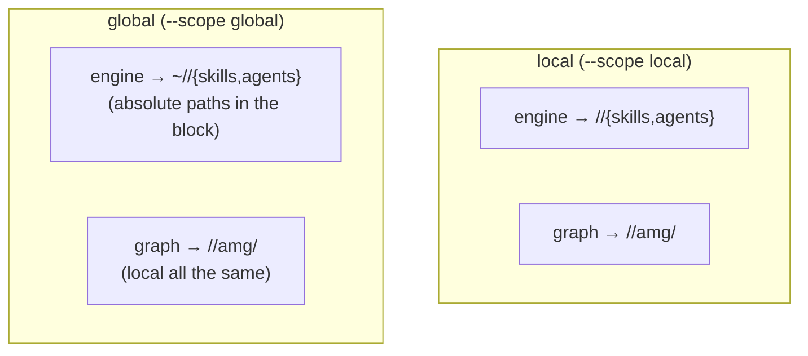
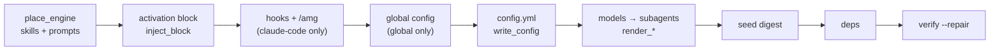

# 12 — The installer (`install.py`)

This document describes the **internals of the installer** `install.py`: how the engine gets into a project, how the templates are rendered per environment, how the activation block is injected into the entry point, and why reinstall and uninstall are safe. This is the "how it is built" view; "how to use it" (the install sequence, the user-facing flags, step-by-step reinstall/uninstall) — in the root [INSTALL.md](../../../INSTALL.md). There is no duplication between them: here — the mechanisms and invariants, there — the recipes.

> **On path names.** `.claude` (the agent directory) and `CLAUDE.md` (the entry point) are the Claude Code defaults; the installer substitutes the configured names (e.g. `.agents` / `AGENTS.md`). In the repository templates these names are written as `.claude`/`CLAUDE.md` and serve as **placeholders** the installer replaces.

## What the installer does

`install.py` is a deterministic, parameter-driven script: the model runs the dialogue per [INSTALL.md](../../../INSTALL.md) and calls it with the answers, while the script does the file work. Step by step it places the engine, renders the entry-point templates and the **engine prompts themselves** for the chosen agent directory, injects the activation block between the markers, merges `settings.json`, writes the **global personal-defaults config** under a global install, writes the local `config.yml`, renders the `models` block into the subagent definitions, seeds an empty `digest.md`, optionally installs dependencies, and verifies the store. It does **not build** the graph — activation remains the user's choice, and the structural build is driven by the loop or `/amg sync` (the `--build` flag is the explicit exception).

The installer is run **from the AMG checkout directory**, which can live anywhere — preferably outside the project being installed: the engine is copied into the agent directory (`REPO = Path(__file__).parent` — the sources are taken from the script's own location), and after the install the checkout is not needed. A checkout inside the project is not dangerous — store resolution tells it apart from an installed store by the engine signature (see "How the engine finds the graph") — but it is not needed either: it only clutters the project.

## Two planes: the engine and the graph

The install distinguishes the **engine** (the portable code: skills, subagents, the config template) from the **graph** (a specific project's memory). The key invariant: **the graph is always local** — it lives in `<project>/<agent_dir>/amg/`, because memory belongs to the project and is not shared between projects. The engine, though, can be installed locally (into the project) or globally (one for all projects).



In code this is handled by three paths in `install()`: `engine_root` (`Path.home()` under `global`/`project_only`, else `target`), `engine_agent_dir = engine_root/agent_dir` (where the engine landed), and `graph_agent_dir = target/agent_dir` (the graph root — always from `target`). The entry point is `engine_root/entrypoint`.

## Install environments: the three `--env` modes

Portability is more than renaming a folder: hooks, slash commands, and the `@`-import are Claude Code mechanisms. So the installer does not just substitute paths — it **deploys a mechanism per environment** (the `_env_kind` classifier):

| `--env` | Environment | What is deployed |
|---|---|---|
| `claude-code` (default) | Claude Code | the skill-aware block + the `settings.json` hooks + the `/amg` slash command; the models → the `agents/amg-*.md` frontmatter |
| `codex` | OpenAI Codex (has skills and subagents) | the skills into `.agents/skills`, the subagents as **TOML in `.codex/agents`** (`model`/`model_reasoning_effort`), the skill-aware `entrypoint/AGENTS.codex.md` block; no hooks or `/amg` are written |
| `generic` | other AGENTS.md environments (Qwen Coder, …) | the portable skill-less block `entrypoint/AGENTS.md`; no hooks or command are written |

The agent directory and the entry point are substituted per environment when not set explicitly: Claude Code → `.claude`/`CLAUDE.md`, otherwise → `.agents`/`AGENTS.md`. **Modes other than Claude Code are not yet tested** (environment verification is a separate roadmap stage).

## The install pipeline



Each mechanism separately below.

### Placing the engine and rendering the prompts (`place_engine`)

**Only** the `amg-*` skills (`SKILL_NAMES`) and the `amg-*` subagents are copied, so in a shared directory (especially the global `~/.claude`) foreign skills and agents stay intact, and a reinstall refreshes AMG alone. A skill is copied whole (`copytree`, without `__pycache__`); its `SKILL.md` and the `agents/amg-*.md` files are then **rendered** by `render_control_text` for the chosen agent directory. A verbatim copy would leave wrong `.claude/...` command paths in another environment, and relative script paths that break under a global install. Reference documents (`references/*.md`) stay as is — they are documentation; their environment-neutralization is a translation matter. For `--env codex` the `agents/*.md` files are **not copied**: the Codex subagents are rendered separately as TOML (below).

### Path rendering (`render_control_text`)

The single placeholder-replacement function for a control file. For a **global** install the engine paths (`.claude/skills`, `.claude/agents`) become **absolute** (the engine is in the home directory), while the graph paths (`.claude/amg`) and the digest import line stay project-local; the `@`-import under global is replaced with a note (a global entry point cannot import a per-project graph). Then `@.claude/amg`→`@<agent_dir>/amg`, `.claude`→`<agent_dir>`, `CLAUDE.md`→`<entrypoint>`. For the Claude Code defaults (`.claude`/`CLAUDE.md`, local) the result matches the source template byte for byte.

### The activation block (`inject_block`, `_block_body`)

The block is injected at the **end** of the entry-point file between the markers `<!-- AMG:BEGIN -->` / `<!-- AMG:END -->`: the user's instructions stay above. `_block_body` trims the template's standard "# Project memory" preamble (needed only for the dev copy), starting from the first `## ` heading. A reinstall replaces **only** the area between the markers (idempotent: a repeated run does not duplicate the block); if the file does not exist, it is created with just the block.

### Hooks and the command (Claude Code only)

For `--env claude-code` the installer merges the `SessionStart`/`SessionEnd` hooks from the `entrypoint/settings.json` template with the existing `settings.json` (`merge_settings`): foreign hooks and keys are preserved, previous AMG hooks are replaced (matched by the `lifecycle.py` signature in the command). The `entrypoint/commands/amg.md` slash command is rendered into `<agent_dir>/commands/`. For `codex`/`generic` neither the hooks nor the command are written — the activation loop takes their role.

### Configuration layers: the global personal-defaults config (`write_global_config`)

Under `--scope global` (and `--project-only` — it attaches to an already existing global install) the installer creates the **global config** `~/<agent_dir>/amg/config.yml` — a layer of personal, per-machine defaults that every installed project inherits key by key. Its content is the `models` and `retrieval.embeddings` blocks with the template's values plus the `--set-global` answers (dotted paths like `retrieval.embeddings.enabled=auto`); a header comment explains the file's role. An existing global config is **never overwritten** (the same rule as for the local one).

For the inheritance to actually work, the local config of a global install is written **without** those two blocks — `_strip_top_block("models")` and `_strip_sub_block("retrieval", "embeddings")` cut the key, its block, and the banner comment above it (a full template would shadow the global layer with its every key). A local install (`--scope local`) is self-sufficient: the full template, no global file, and `--set-global` is ignored with an explanation.

The layers are read by the engine's own loaders (`retrieve` / `consolidate` / `extract_structure` — `load_config`): the global config is laid **under** the local one by a key-by-key merge (`_deep_merge`; nested blocks merge recursively, the local value wins). The global layer's path is derived from the **local** config's `agent_dir` key: it both names the environment's home directory (`~/<agent_dir>/amg/config.yml` — each environment has its own) and serves as the "written by the installer" marker — a minimal hand-written config without `agent_dir` does not read the global layer, which keeps test fixtures and manual experiments hermetic. The `~/<agent_dir>/amg/` directory carries one file and is **not a store**: no graphs are created in it, and store resolution never considers it a candidate (see "How the engine finds the graph"). The installer renders the subagents from the same merged view (`_read_models` merges the global layer under the local), so tiering set globally applies even without a local `models` block.

### Templating `config.yml` (`write_config`)

`config.yml` is copied from the repository template, and the answered keys are then filled in. The edits are surgical and **never touch the comment prose**: `_set_scalar`/`_set_list` edit the real key lines (anchored by `^(# ?)?key:`), not similar phrases in comments. Filled in are `mirror_path`/`absorb_path`/`absorb_once_path` (the `--absorb-once` flag)/`exclude` (as flow lists with quoted elements — globs stay valid YAML), the scalar answers (`--set key=value`; a dotted key — e.g. `retrieval.embeddings.enabled` — is located by the `_set_nested` setter through the parent blocks' indentation and changed with its inline comment preserved), and `agent_dir`/`entrypoint` (they record the choice declaratively and enable global-layer inheritance). For a non-`.claude` directory the single path value `eval_gate.cases` is rendered into the chosen directory too. **An existing `config.yml` is never clobbered** — a reinstall spares the project's config and graph, and so the saved state does not stay invisible, the installer prints the existing config's effective values on the `in force:` line — the install flow shows them to the user for confirmation.

### Model tiering into the subagents (`render_agent_models` / `render_codex_agents`)

The `config.yml → models` block is the single source of truth for model choice. The role → subagent map: `discovery`→{`amg-classifier`,`amg-retriever`}, `module_summary`→{`amg-builder`,`amg-linker`}, `synthesis`→{`amg-synth`,`amg-consolidator`}, `structural_extraction`→no subagent. A role's value is a flat model string or `{model, reasoning_effort}`.

- **Claude Code** (`render_agent_models`): writes the `model`/`effort` fields into the `agents/amg-*.md` frontmatter (a surgical edit preserving `description`/`tools`/the body).
- **Codex** (`render_codex_agents`): renders `agents/amg-*.md` into the TOML subagents `.codex/agents/amg-*.toml` — `name`, `description`, `developer_instructions` (the prompt body, paths rendered to `.agents`), and, from the config, `model_reasoning_effort` plus `model` (only when it is a real id rather than a Claude alias: the default Claude aliases are omitted for Codex — Codex takes the session's model). A reinstall replaces the `amg-*.toml` set without duplication.

`reasoning_effort` is **clamped per environment** (`_clamp_effort`): Claude Code `effort` = `low|medium|high|xhigh|max` (`minimal`→`low`), Codex `model_reasoning_effort` = `minimal|low|medium|high|xhigh` (`max`→`xhigh`); unset — the field is omitted. The full semantics, the clamp, and the Claude Code upstream bug [#44385](https://github.com/anthropics/claude-code/issues/44385) — in the [Configuration reference](./09-config.md), "Subagent models".

### Digest seeding, dependencies, verification

- **`seed_digest`** places an empty `digest.md` (a placeholder) so the digest import/read resolves before the first consolidation; a real digest is never clobbered.
- **`install_deps`** installs the requested groups (`--deps`): `base` (`pyyaml` — the only mandatory one), `embeddings` (`model2vec`), `embeddings-st` (`sentence-transformers`), `text` (`pypdf`/`python-docx`/`openpyxl`), `treesitter` (`tree-sitter`/`tree-sitter-language-pack`); the same groups are documented in `requirements.txt`.
- **`verify_store`** initializes and verifies the **local** graph with the **installed** engine (`graph_store.py init` + `verify --repair`) — **without building the graph**. The `--build` flag additionally builds the structural skeleton (`reconcile.py bootstrap`); semantic derivation stays model-driven.

### The post-install step: restart the session

The control plane the installer just wrote comes alive only in a **new session**: an agent environment reads its skill and command registry at session start, so the installing session sees neither the `amg-*` skills nor `/amg`. This matters beyond convenience — a first build started in the installing session would run **without** the `amg-bootstrap` skill, with the model improvising the pipeline from the instruction text and losing the orchestration discipline the skill enforces (bounded batches, checkpoint parts, batched application). So the model-driven flow (INSTALL.md) ends with an explicit restart instruction, and the first build belongs to the fresh session — via the activation loop or `/amg sync`.

## Reinstall, uninstall, adding a project

- **Reinstall** is simply a repeated `install.py` run, idempotent by construction: `place_engine` replaces only `amg-*`, `inject_block` rewrites the area between the markers, `merge_settings` replaces only the AMG hooks, `write_config` spares the existing config (and prints its effective values), and the model rendering is reapplied. The project's graph is untouched.
- **Uninstall** (`--uninstall [--scope global] [--purge-graph]`) cuts out the activation block (the user's content is intact), removes the `amg-*` skills/agents/command and the Codex TOML subagents (`.codex/agents/amg-*.toml`), and unhooks the AMG hooks from `settings.json`. The graph is **kept** unless `--purge-graph` is given; the global personal-defaults config is kept too (it is the user's preference data — the installer says so and leaves the deletion to the human).
- **`--project-only`** attaches a project to an already existing (usually global) install: only the local `config.yml` + `digest.md` are written (and the global config is created if missing); the engine/block/hooks are untouched.

## How the engine finds the graph

The installer records `agent_dir` in the config declaratively, but the scripts find the working graph root **by location** (`graph_store.resolve_amg_root`): an explicit `--root` → `AMG_AGENT_DIR` → an upward search from the current directory (at every level first the presets `<dir>/{.claude,.agents}/amg/config.yml`, then the "bare" `<dir>/amg` — only if it is an initialized store) → the engine's location → the `.claude` default. A candidate with the engine signature (`skills/`, `agents/`, or `install.py` inside) is rejected as a checkout, and the home-directory level is skipped (the global config lives there, not a store). That is why a global engine heals and reads a project's **local** graph, and an AMG checkout next to a project hijacks nothing. The full rules — [Storage and transactions](./03-storage.md).

## CLI flag reference

```
python install.py --target <project> [--scope local|global]
    [--agent-dir .claude] [--entrypoint CLAUDE.md] [--env claude-code|codex|generic]
    [--mirror a,b] [--absorb c,d] [--absorb-once e,f] [--exclude "*.x,*.y"]
    [--set key=value]...        # a dotted key = nested (retrieval.embeddings.enabled)
    [--set-global key=value]... # into the global personal-defaults config (global/project-only)
    [--deps base,embeddings,text,treesitter]
    [--no-verify] [--build] [--project-only]
python install.py --target <project> --uninstall [--scope global] [--purge-graph]
```

Each flag's purpose and the scenarios — in [INSTALL.md](../../../INSTALL.md).

## Next

- [Documentation map](./README.md) — the architecture table of contents and the way back to the start.
- [08 — Subagents and skills](./08-agents-skills.md) — what gets installed (the skills, subagents, block, loop) and cross-environment portability.
- [09 — Configuration reference](./09-config.md) — the `config.yml` keys, the `models` block, `agent_dir`/`entrypoint`.
- [03 — Storage and transactions](./03-storage.md) — graph-root resolution (`resolve_amg_root`).
- [INSTALL.md](../../../INSTALL.md) — how to use the installer (manual and model-driven install, reinstall, uninstall).
