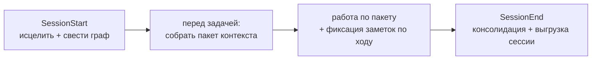

# Руководство пользователя AMG

Это практическое руководство: как пользоваться всеми функциями AMG — что запускается само, что проверяется при сбоях и что можно запускать вручную. Теоретическое обоснование — в [теории](./THEORY.md); как система устроена внутри (код, функции, промпты) — в [документации архитектуры](./architecture/README.md); это руководство — про применение.

AMG (Associative Memory Graph) — постоянная ассоциативная память для модели: типизированный граф с иерархическими сводками и извлечением распространением активации, лежащий в `.claude/amg/`. Он позволяет работать над частью проекта в чистом окне контекста, видя при этом стратегическое окружение — назначение, связанный код, прежние решения — вместо загрузки всего проекта.

## Установка кратко

Устанавливать можно **локально** (в один проект) или **глобально** (движок один на все проекты). В обоих случаях **граф всегда локальный** — он лежит в `<проект>/.claude/amg/`, потому что память относится к конкретному проекту. Блок AMG **дописывается** в корневой `CLAUDE.md` проекта между маркерами `<!-- AMG:BEGIN -->` и `<!-- AMG:END -->` (ваши инструкции остаются первыми; переустановка заменяет только этот блок). Полный порядок установки — в корневом `INSTALL.md`.

## Активация и режимы

Система включается наличием файла `.claude/amg/config.yml` с `active: true`. Управление режимами:

| Команда | Действие |
|---|---|
| `/amg on` | включить AMG для проекта (`active: true`) |
| `/amg off` | выключить — модель ведёт обычную сессию, граф не трогается |
| `/amg status` | показать состояние: активность, размер графа, незавершённые операции |
| `/amg repair` | проиграть незавершённые записи и восстановить согласованность с диском |

Команды срабатывают по смыслу, а не по точному слову: «включи/активируй AMG», «выключи память», «проверь граф», «почини» — модель ловит намерение. Флаг `automation: on | off` в конфиге управляет самостоятельностью: при `off` модель ничего не делает автоматически — только по команде `/amg ...` или явному запросу.

## Что происходит автоматически

Когда AMG включён, модель ведёт память по петле — без ручных команд:



- **В начале сессии (`SessionStart`).** Сначала проигрываются незавершённые записи прошлого прогона (самовосстановление), затем, если файлы-источники могли измениться или это первая сессия, граф сводится с диском (скилл `amg-bootstrap`). Построение с нуля и пересборка — одна и та же операция, крэш-безопасная и идемпотентная.
- **Перед каждой задачей и при смене фокуса.** Прежде чем трогать код, модель собирает из графа пакет контекста по задаче (скилл `amg-retrieve`): засев → распространение активации → пакет под бюджет. Выборка идёт **не только в начале**: когда по ходу диалога фокус смещается (новое требование, другой вопрос, другая подсистема), пакет пересобирается под текущий запрос. Весь проект в окно не загружается.
- **По ходу работы.** Решения, выводы и планы записываются как узлы-заметки (`notes`) — это дёшево и не требует пересборки (пересборка только для файлов-источников).
- **В конце сессии (`SessionEnd`).** Запускается консолидация (скилл `amg-consolidate`): накопление сигнала ко-активаций (хеббовское обновление весов по умолчанию выключено — см. «Веса по умолчанию не обновляются» ниже), отбор ценных заметок в долговременную память, при необходимости — компрессия раздутых веток. Здесь же текущий диалог выгружается в каталог сессий (см. ниже).

## Восстановление при сбоях

AMG спроектирован так, что прерывание в любой точке безопасно. Истина — файлы на диске; граф — восстановимая проекция. В начале каждой сессии автоматически выполняется исцеление: проигрываются недописанные транзакции из журнала и снимается устаревший лок. Если что-то выглядит несогласованным, восстановление запускается и вручную, из корня проекта:

```
python .claude/skills/amg-bootstrap/scripts/graph_store.py recover
python .claude/skills/amg-bootstrap/scripts/graph_store.py verify --repair
python .claude/skills/amg-bootstrap/scripts/reconcile.py bootstrap .
```

Это проигрывает незавершённую запись, чистит устаревший лок и заново устанавливает равенство графа с кодом и документами. Повторять безопасно: операция идемпотентна.

## Источники: зеркало и впитывание

В `config.yml` источники перечисляются под двумя ключами — `mirror_path` и `absorb_path` (каждый — строка или список путей); тип каждого файла определяется автоматически, папки «код» и «документы» называть не нужно.

- **`mirror_path` — живая проекция.** Граф держится равным этим путям: файл добавлен → узел, изменён → обновлён, удалён → вычищен. Для того, что вы редактируете (код, поддерживаемые руководства).
- **`absorb_path` — впитывание один раз.** Источник вбирается в независимые узлы; удаление источника позже узел не вычищает. Для разового сырья (логи чатов, дампы данных).

И зеркало, и впитывание хранят в графе **сводку и указатель** на источник — дословный текст в граф не копируется. Поэтому полные детали лежат в самом файле; и для зеркала, и для впитывания до них добираются, открыв источник, пока он на диске.

**Трюк для важных материалов и диалогов.** Впитывание в графе — это дистиллят (суть, не каждое слово), и если впитанный источник удалить, останется только сводка. Если материал важен и нужно гарантированно сохранить **все** детали, объявите его **зеркалом** (`mirror`), даже не редактируя: тогда действует инвариант «есть узел ⟺ есть источник», и из любого узла можно вытянуть полный текст, открыв файл. Это особенно полезно для ценных диалогов: вместо впитывания сессии её ведут зеркалом — детали сохраняются целиком. Цена — файл-источник должен оставаться на диске.

Дополнительные исключения задаются ключом `exclude` (глоб-шаблоны поверх встроенных умолчаний вроде `node_modules`, `.venv`, `dist` и `.gitignore` проекта); обычно он пуст.

## Сессии

В конце сессии диалог выгружается в каталог сессий: **`<проект>/.claude/amg/sessions/ГГГГ-ММ-ДД-ЧЧММ.md`** — markdown с маркерами ролей (без сырых размышлений модели). Как этот каталог подключается к графу, задаёт ключ `session_policy`:

| `session_policy` | Поведение |
|---|---|
| `absorb` (по умолчанию) | сессия впитывается как дистиллят; файл выгрузки можно потом удалить, знание останется сводкой |
| `mirror` | сессия ведётся как зеркало — узлы существуют, пока существует файл выгрузки, и любую деталь диалога можно достать целиком |

То есть к каталогу `sessions/` применим тот же трюк: для важных диалогов поставьте `session_policy: mirror`, чтобы сохранить все детали, а для рутинных — `absorb`. Путь каталога настраивается ключом `sessions`.

## Ручные команды

Всё, что делает автоматика, можно запускать руками. Команды — из корня проекта.

**Граф и сверка** (скилл `amg-bootstrap`, скрипты в `.claude/skills/amg-bootstrap/scripts/`):

| Команда | Действие |
|---|---|
| `python .claude/skills/amg-bootstrap/scripts/graph_store.py recover` | проиграть незавершённые транзакции |
| `python .claude/skills/amg-bootstrap/scripts/graph_store.py verify --repair` | проверить целостность и снять устаревший лок |
| `python .claude/skills/amg-bootstrap/scripts/reconcile.py bootstrap .` | построить или свести граф с диском (выгружает очередь деривации) |
| `python .claude/skills/amg-bootstrap/scripts/reconcile.py plan .` | то же, что `bootstrap` (синоним) |
| `python .claude/skills/amg-bootstrap/scripts/reconcile.py apply <файл.json> .` | внести семантический результат (сводки и рёбра) |
| `python .claude/skills/amg-bootstrap/scripts/extract_structure.py . --stats` | показать классификацию файлов и доступность извлекателей |

**Извлечение** (скилл `amg-retrieve`, скрипты в `.claude/skills/amg-retrieve/scripts/`):

| Команда | Действие |
|---|---|
| `python .claude/skills/amg-retrieve/scripts/retrieve.py "<запрос>" --store .claude/amg` | собрать пакет контекста (пишет `cache/pack.md`) |
| `... retrieve.py "<запрос>" --top <N> --no-pack` | задать число строк ранжирования и не писать пакет на диск |
| `python .claude/skills/amg-retrieve/scripts/eval_retrieval.py --make-demo <путь>` | построить размеченный демо-граф и измерить качество |
| `... eval_retrieval.py --store .claude/amg --cases cases.json --out results.json` | измерить полноту/точность/hop-recall на своей разметке |
| `python .claude/skills/amg-retrieve/scripts/inspect_graph.py --grep <строка>` | просмотреть узлы (id, тип, сводка), выбрать `gold_ids` |
| `python .claude/skills/amg-retrieve/scripts/embed.py` | диагностика эмбеддингов: бэкенды, модель, кросс-язычность |

**Консолидация** (скилл `amg-consolidate`, скрипты в `.claude/skills/amg-consolidate/scripts/`):

| Команда | Действие |
|---|---|
| `python .claude/skills/amg-consolidate/scripts/consolidate.py weights .` | свернуть журнал ко-активаций: накопить `coact` (по умолчанию); обновление весов — только при `weights.apply_hebbian` |
| `python .claude/skills/amg-consolidate/scripts/consolidate.py plan .` | разметить план (ветки сверх бюджета, дубли, значимость) |
| `python .claude/skills/amg-consolidate/scripts/consolidate.py apply <actions.json> .` | внести действия консолидации (с архивацией оригиналов) |

Те же операции вызываются и словесно — «проиндексируй проект», «собери контекст по X», «подведём итоги сессии»: модель выберет нужный скилл по смыслу.

> **Веса по умолчанию не обновляются.** `consolidate.py weights` лишь накапливает счётчик ко-активаций `coact` (он питает отбор по значимости), но **не меняет** силу рёбер — проводимость графа остаётся статической и предсказуемой. Хеббово обновление (усиление часто используемых связей, затухание и обрезка неиспользуемых) включается явно — `weights.apply_hebbian: true` в `config.yml` — и осмысленно лишь после того, как измерение (`eval_retrieval.py`) подтвердит, что оно повышает полноту выдачи на ваших задачах. Причина осторожности — самоусиление: сигнал «узлы вместе в выдаче» частично порождён самими весами (теория, §8.1). Компрессия раздутых веток выключается отдельным флагом `compaction.enabled`.

## Выбор модели субагентов

Сила модели распределяется по ролям в блоке `models` конфигурации, отдельной структурой с версией и уровнем рассуждения:

```
models:
  discovery:      {model: haiku,  thinking: off}     # лёгкие задачи только на чтение
  module_summary: {model: sonnet, thinking: low}     # массовые посводочные деривации
  synthesis:      {model: opus,   thinking: high}     # синтез, межслойные рёбра, пробелы
```

`model` — семейство или точная версия-строка; `thinking` — уровень рассуждения (`off | low | medium | high`). Модель и уровень рассуждения задаются раздельно: уровень не зашивается в имя модели.

## 3D-просмотр графа

Граф можно открыть как самодостаточную HTML-страницу в браузере с трёхмерной визуализацией: вращение, зум, панорама; клик по узлу показывает его сводку, фронтматтер и рёбра; граф экспортируется в JSON. На больших графах включаются кластеризация и фильтры. Запуск — командой в bash/cmd, скиллом или словесно («открой граф»). Просмотр только на чтение.

## Опциональные зависимости

Базовый тракт работает на стандартной библиотеке Python (Python-код разбирается модулем `ast` без зависимостей). Остальное — опционально и при отсутствии библиотеки **мягко пропускается** (не падает); что именно активно, показывает `extract_structure.py . --stats`:

| Возможность | Установка |
|---|---|
| Код прочих языков (функции + рёбра вызовов) | `pip install tree-sitter tree-sitter-language-pack` |
| Извлечение из PDF / DOCX / XLSX | `pip install pypdf python-docx openpyxl` |
| Семантический засев эмбеддингами (лёгкий) | `pip install model2vec` |
| Семантический засев (полные трансформеры) | `pip install sentence-transformers` |

**Кириллица и другие неанглийские языки.** Для не-английского `working_language` движок **сам выбирает многоязычную модель по умолчанию** (`model2vec` → `potion-multilingual-128M`; `sentence-transformers` → `paraphrase-multilingual-MiniLM-L12-v2`) — достаточно установить бэкенд и включить засев, иначе кросс-язычная близость будет низкой. Для английских проектов берётся retrieval-настроенная `potion-retrieval-32M` (или `all-MiniLM-L6-v2`). Эмбеддинг — намеренно *лёгкое* обогащение поверх BM25, поэтому в умолчания идут лёгкие модели, а не тяжёлые лидеры рейтингов. Конкретную модель (в т. ч. более качественную) можно задать явно:

```
retrieval:
  embeddings:
    enabled: on
    model: Alibaba-NLP/gte-multilingual-base   # "" = многоязычный дефолт по working_language
```

Для этого случая удобно держать `requirements.txt`:

```
sentence-transformers
pypdf
python-docx
openpyxl
tree-sitter
tree-sitter-language-pack
```

и установить всё разом: `pip install -r requirements.txt`. Проверить кросс-язычность модели можно командой `python .claude/skills/amg-retrieve/scripts/embed.py`, а измерить, что даёт семантический засев на вашем графе, — `eval_retrieval.py --compare-embeddings` (выдача с эмбеддингами против чисто-лексической).

## Настройка по числам

Качество извлечения измеряется, а не подбирается на глаз. Разметьте горсть реальных задач (`cases.json` со списком `{id, query, gold_ids}`; идентификаторы узлов берутся из `inspect_graph.py`) и прогоняйте `eval_retrieval.py` — он сравнивает выдачу с лексической базой по полноте, точности и **hop-recall** (полнота на узлах, достижимых только по связям, — то, что добавляет распространение активации над плоским поиском). По числам крутите ручки в `config.yml → retrieval`: `damping` (дальность охвата), `activation_threshold` (плотность пакета), `token_budget` по ярусам, `relation_priors` (как сильно проводит каждый тип ребра). Безопасность компрессии проверяется **автоматически**: при консолидации полнота меряется тем же измерительным стендом на *копии* графа до и после сжатия, и компрессия вносится только при её удержании (автоматическая проверка полноты, блок `eval_gate` в `config.yml`; `on_fail` задаёт реакцию на просадку — `reject`/`warn`). По умолчанию она безопасно неактивна, пока вы не разметите свои случаи и не укажете на них `eval_gate.cases`.

## Граф как обычные файлы

Граф — это набор markdown-файлов под `.claude/amg/nodes/` (один файл на узел) плюс служебные каталоги. Он версионируется git как обычный текст: историю узлов видно в диффах, а откат сжатия тривиален (оригиналы лежат в `archive/`, плюс история git). Источники (то, на что указывают `mirror_path`/`absorb_path`) система меняет только когда их меняет ваша задача — как побочный эффект обслуживания памяти они не трогаются.

## Карта документации

- [README](../../README_RU.md) — что такое AMG, обзор и как начать.
- [Теория](./THEORY.md) — научное обоснование: память, ассоциативное извлечение, пластичность.
- [Документация архитектуры](./architecture/README.md) — как система устроена в коде: файлы, функции, промпты.
- Это руководство — как пользоваться всеми функциями.
- `INSTALL.md` (в корне) — установка вручную и автоматически.
