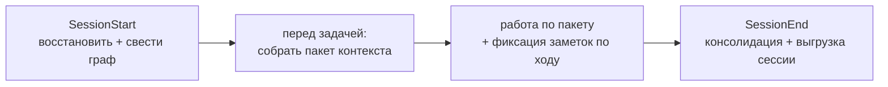

# Руководство пользователя AMG

Это практическое руководство: как пользоваться всеми функциями AMG — что запускается само, что проверяется при сбоях и что можно запускать вручную. Теоретическое обоснование — в [теории](./THEORY.md); как система устроена внутри (код, функции, промпты) — в [документации архитектуры](./architecture/README.md); это руководство — про применение.

AMG (Associative Memory Graph) — постоянная ассоциативная память для модели: типизированный граф с иерархическими сводками и извлечением распространением активации, лежащий в `.claude/amg/`. Он позволяет работать над частью проекта в чистом окне контекста, видя при этом стратегическое окружение — назначение, связанный код, прежние решения — вместо загрузки всего проекта.

## Установка

Это руководство разбирает установку **по возможностям** — что можно выбрать и как этим пользоваться; пошаговый порядок и исчерпывающий список флагов — в [INSTALL_RU.md](../../INSTALL_RU.md), поверхностный обзор — в [README](../../README_RU.md).

### Откуда ставить

Установщик запускается из распакованного каталога AMG и целится в проект флагом `--target`, поэтому держите этот каталог **вне проекта** (домашняя папка, общий каталог инструментов — где удобно): движок копируется в каталог агента, и после установки исходный каталог можно удалить. Класть его внутрь проекта не нужно: он захламляет корень, а пользы не даёт (движок всё равно копируется; перепутать исходный каталог с хранилищем система не может — разрешение store отличает их по содержимому).

### Локально или глобально

Движок (`agents/` + `skills/` + блок активации) ставится **локально** — в один проект (`<проект>/.claude/`) — или **глобально**, один на все проекты (`~/.claude/`). **Граф всегда локальный** (`<проект>/.claude/amg/`): память относится к конкретному проекту и между проектами не делится. Локальная установка — когда нужен один проект или своя версия движка; глобальная — когда движок общий, а каждый проект лишь активируется. Флаг `--project-only` добавляет проект к уже существующей глобальной установке: пишется только локальный `config.yml`, движок не трогается.

Глобальная установка дополнительно заводит **глобальный конфиг личных умолчаний** (`~/.claude/amg/config.yml`): в нём живут настройки вашей машины — тиринг моделей (`models`) и эмбеддинги (`retrieval.embeddings`), — а каждый проект наследует их по отдельным ключам и переопределяет своим локальным конфигом. Так личные предпочтения не попадают в git-канон проекта, а проектное (источники, язык, бюджеты) остаётся в локальном `config.yml`. Подробности — [INSTALL_RU.md](../../INSTALL_RU.md), «Локально и глобально».

### Зависимости

Нужен Python 3 и единственная обязательная зависимость — `pyyaml`. Остальное опционально и при отсутствии библиотеки **мягко пропускается** (не падает); ставится группами через `--deps` или `requirements.txt`:
```bash
python3 -m pip install pyyaml                  # обязательное
python3 -m pip install -r requirements.txt     # всё опциональное разом
```
Группы: `embeddings` (model2vec) / `embeddings-st` (sentence-transformers) — семантический засев; `text` (pypdf / python-docx / openpyxl) — извлечение PDF/DOCX/XLSX; `treesitter` (tree-sitter + language-pack) — код прочих языков. Что именно активно, покажет `extract_structure.py . --stats`.

### Два способа: силами модели или командой

*Силами модели (проще).* В сессии внутри проекта скажите «**установи AMG по `<путь-к-AMG>/INSTALL.md`**» (путь — к распакованному вне проекта каталогу AMG) — модель прочитает инструкцию, осмотрит проект и предложит классификацию папок (зеркала / впитывание / исключения), задаст **весь список вопросов по одному** (локально/глобально; среда, каталог агента и точка входа; зеркала и впитывание, включая замороженные снимки; что игнорировать; рабочий язык; бэкенд эмбеддингов; автоматика; политика сессий; бюджеты ярусов; зависимости; активировать ли память), покажет действующие значения, если конфиг уже существует, и сама вызовет установщик с ответами. Два вопроса помечены ключевыми — **рабочий язык** и **эмбеддинги**: их дорого менять после сборки (сводки и кэш дериваций ключуются языком; по векторам эмбеддингов линковка при сборке ищет кросс-доменные связи). Остальные ключи безопасно донастраивать в `config.yml` в любой момент — они применяются следующим прогоном; что именно дёшево менять потом, а что решить до сборки — [INSTALL_RU.md](../../INSTALL_RU.md), одноимённый раздел.

*Командой.* То же самостоятельно — установщик неинтерактивен, все ответы передаются флагами (запуск из каталога AMG):
```bash
python install.py --target /путь/к/проекту --scope local \
    --mirror src,doc --absorb data --exclude "*.min.js" \
    --set working_language=ru --set automation=true --set active=true \
    --deps base,embeddings --build
```
Основные флаги: `--scope local|global`; `--agent-dir`/`--entrypoint` (имена каталога и точки входа для среды); `--env` (см. ниже); `--mirror`/`--absorb`/`--absorb-once`/`--exclude`; `--set ключ=значение` (любой скалярный ключ конфига, повторяемо; ключ с точками задаёт вложенное значение — `retrieval.embeddings.enabled=auto`); `--set-global` (то же в глобальный конфиг личных умолчаний); `--deps`; `--build` (сразу построить структурный граф); `--project-only`; `--no-verify`. Полный список и режимы — [INSTALL_RU.md](../../INSTALL_RU.md).

### Среды кроме Claude Code (`--env`)

Хуки, слэш-команды и `@`-импорт дайджеста — механизмы именно Claude Code; поэтому установщик разворачивает под среду **разный механизм**, а не только подставляет пути:

- **`claude-code`** (умолчание) — блок со скиллами + хуки `SessionStart`/`SessionEnd` + команда `/amg`; модели рендерятся во frontmatter `agents/amg-*.md`.
- **`codex`** — OpenAI Codex со скиллами и субагентами: скиллы кладутся в `.agents/skills`, субагенты — **TOML в `.codex/agents`** (с `model`/`model_reasoning_effort` из блока `models`), вливается skill-aware блок `AGENTS.md`; Claude-хуки и `/amg` не пишутся — петлю ведёт сама модель.
- **`generic`** — прочие AGENTS.md-среды (Qwen Coder и др.) без скиллов: переносимый блок без скиллов, та же петля прямыми вызовами скриптов (промпты `agents/*.md` модель читает как инструкцию).

Базовая работоспособность от среды не зависит, набор удобств — зависит. **Режимы кроме Claude Code пока не протестированы, стабильность не гарантирована** — все тесты в Claude Code (проверка сред — отдельный этап дорожной карты впереди).

### Ключевые ключи `config.yml`

Установщик пишет их за вас; полный справочник — [09-config](./architecture/09-config.md). Главное:
```yaml
active: true                 # выключатель памяти (/amg on · off)
automation: true             # сама ведёт петлю и хуки сессий
working_language: ru         # язык сводок и заметок
mirror_path: [src, doc]      # живая проекция: правите файл — граф следует
absorb_path: [data]          # впитать один раз (источник потом можно удалить)
exclude: []                  # глобальный игнор; +mirror_exclude/absorb_exclude (по намерению), +respect_gitignore
session_policy: absorb       # как подключать авто-выгрузки сессий (absorb | mirror)
models:                      # сила модели по ролям, рендерится в субагентов
  synthesis: {model: opus, reasoning_effort: high}
retrieval:
  token_budget: {strategic: 4000, tactical: 10000, operational: 24000}
  embeddings: {enabled: off} # семантический засев (опц.; нужен бэкенд)
agent_dir: .claude           # каталог среды (.agents для Codex и прочих)
entrypoint: CLAUDE.md        # файл точки входа (AGENTS.md для иных сред)
```

При глобальной установке личные блоки (`models`, `retrieval.embeddings`) живут не здесь, а в глобальном конфиге умолчаний и наследуются локальным по отдельным ключам (см. «Локально или глобально» выше); наследование включает ключ `agent_dir`, который установщик пишет всегда.

### Переустановка и удаление

**Переустановка** — это просто повторный запуск `install.py`, идемпотентный: он заменяет только блок между маркерами и движок `amg-*`, а ваши инструкции в `CLAUDE.md`, существующий `config.yml`, граф и чужие скиллы/хуки **бережёт**. **Удаление** — `python install.py --target . --uninstall [--scope global] [--purge-graph]`: срезает блок активации (ваш контент остаётся), убирает скиллы/агентов/команду `amg-*` и AMG-хуки; граф **сохраняется**, если не передан `--purge-graph`.

### Активация ≠ построение графа

`/amg on` (или согласие на активацию при установке) лишь поднимает флаг `active`; граф строит петля активации — в новой сессии перед первой задачей (при `automation: true`) либо сразу по `/amg sync` (словами: «построй / синхронизируй граф памяти»). Чтобы построить сразу при установке, не дожидаясь новой сессии, — флаг `--build`.

## Активация и режимы

Система включается наличием файла `.claude/amg/config.yml` с `active: true`. Дальше всё управление идёт через единую команду `/amg <verb>` — или теми же словами в обычном запросе: модель ловит **намерение и синонимы**, а не точный глагол. Одно ограничение: словесная просьба запускает операцию памяти, только когда она **явно относится к памяти** — упоминает память, граф памяти или AMG. Обычное «покажи граф» или «подведём итоги» о чём-то своём (диаграмме, структуре данных, самом разговоре) операцию памяти не запускает.

| Команда | Синонимы в речи | Действие |
|---|---|---|
| `/amg status` | «статус памяти», «что с графом памяти» | показать состояние одним экраном (поля — ниже) |
| `/amg on` · `/amg off` | «включи / активируй / запусти AMG» · «выключи память» | переключить `active` в `config.yml` |
| `/amg repair` | «почини / проверь граф памяти» | проиграть незавершённые записи, снять устаревшую блокировку (`recover` + `verify --repair`) |
| `/amg sync` | «проиндексируй проект в память», «синхронизируй / построй граф памяти» | построить или свести граф с источниками (скилл `amg-bootstrap`) |
| `/amg retrieve <запрос>` | «собери контекст по X из памяти» | собрать пакет контекста (скилл `amg-retrieve`) |
| `/amg consolidate` | «подведём итоги и сохрани в память», «прибери память» | свернуть веса, зафиксировать выводы, сжать раздутые ветки (скилл `amg-consolidate`) |
| `/amg view` | «открой граф памяти», «покажи память» | открыть граф 3D-вьюером — самодостаточный офлайн-HTML, только на чтение (см. «3D-просмотр графа») |

`/amg` — это «парадная дверь»: управляющие глаголы (`status`/`on`/`off`/`repair`) выполняет служебный скрипт `lifecycle.py`, а рабочие (`sync`/`retrieve`/`consolidate`) делегируют профильным скиллам (те доступны и напрямую — `/amg-bootstrap` и т. д.). Важно: `on` лишь поднимает флаг — **граф строит `sync`**, а не `on`.

**Флаг `automation` (по умолчанию `true`).** Управляет самостоятельностью памяти: при `true` память ведёт себя сама (петля активации + хуки, см. следующий раздел), при `false` — ничего не делается автоматически, только по `/amg …`, скиллу или явному запросу. У каждой автоматической операции есть ручной аналог, поэтому `automation: false` ничего не отнимает — лишь передаёт инициативу вам.

> **Среды кроме Claude Code.** Переносимость шире замены имени папки: слэш-команды `/amg`, хуки сессий и `@`-импорт дайджеста — механизмы именно Claude Code, поэтому установщик разворачивает под среду разный механизм (флаг `--env`):
> - **Codex** (`--env codex`) — среда **со** скиллами и субагентами: скиллы кладутся в `.agents/skills`, субагенты рендерятся как TOML в `.codex/agents` (с выбором `model` и `model_reasoning_effort` из блока `models`), вливается skill-aware блок `AGENTS.md`; хуки и `/amg` (специфичные для Claude Code) не пишутся — их роль берёт петля активации.
> - **Прочие AGENTS.md-среды** (`--env generic`, например Qwen Coder) — **без** скиллов: вливается переносимый блок без скиллов, та же петля прямыми вызовами скриптов (промпты `agents/*.md` модель читает как инструкцию, дайджест и консолидацию запускает сама).
>
> Базовая работоспособность от среды не зависит, набор удобств — зависит. **Но режимы Codex и generic в любой не-Claude-Code-среде пока не протестированы, стабильность не гарантирована** — все тесты проводились в Claude Code (проверка сред — отдельный этап дорожной карты впереди). Имена `.claude` / `CLAUDE.md` здесь и далее — умолчания Claude Code; в иной среде подставляются её имена (для Codex — `.agents` для скиллов и графа, `.codex` для субагентов).

## Что происходит автоматически

Когда AMG включён и `automation: true`, память ведёт себя сама — двумя дополняющими механизмами. **Хуки `SessionStart` / `SessionEnd`** (механизм Claude Code, прописываются установщиком в `settings.json` каталога агента) выполняют детерминированную рутину без участия модели. **Блок активации в `CLAUDE.md`** ведёт ту часть петли, что требует суждения модели, — хук субагента запустить не может. При `automation: false` само не срабатывает ни то, ни другое (только команды и явные запросы). Шаги петли:



- **В начале сессии (`SessionStart`).** Хук исцеляет хранилище — проигрывает незавершённые записи прошлого прогона и снимает устаревшую блокировку (самовосстановление) — и обновляет дайджест. Затем, если файлы-источники могли измениться или это первая сессия, модель сводит граф с диском (скилл `amg-bootstrap`): построение с нуля и пересборка — одна и та же операция, устойчивая к сбоям и идемпотентная. Сборка идёт слоями: детерминированный скелет со структурными рёбрами (импорты, вызовы, принадлежность, наследование — их извлекает код, точно и бесплатно), затем сводки изменившихся единиц параллельными сборщиками, затем хабы и **глобальная смысловая линковка** — отдельный проход, который связывает документы, примеры и код между собой по смыслу (без него они остались бы островами). Уже деривированное восстанавливается из кэша бесплатно, поэтому пересборка над неизменными файлами не тратит модель вовсе. Субагент `amg-synth` заодно выдаёт **отчёт о пробелах** `gap-report.md` — один из главных полезных выходов: недокументированный код (узлы кода без входящего ребра `documents`), рассинхронизированные с кодом документы и противоречия. Его стоит просмотреть после первой сборки и после крупных изменений; итоговое качество сборки видно строкой `connectivity` в `/amg status` (подробнее — «Качество и стоимость сборки» ниже).
- **Перед каждой задачей и при смене фокуса.** Прежде чем трогать код, модель собирает из графа пакет контекста по задаче (скилл `amg-retrieve`): засев → распространение активации → пакет под бюджет. Выборка идёт **не только в начале**: когда по ходу диалога фокус смещается (новое требование, другой вопрос, другая подсистема), пакет пересобирается под текущий запрос. Весь проект в окно не загружается.
- **По ходу работы.** Решения, выводы, открытые вопросы и планы фиксируются безопасным API заметок `notes.py add` (а **не** правкой файлов `nodes/` руками) — это дёшево, транзакционно и не требует пересборки (пересборка только для файлов-источников):
  ```
  python .claude/skills/amg-bootstrap/scripts/notes.py add --type decision --summary "…" [--body "…"] [--tags "…"]
  ```
  Типы: `note` / `decision` / `adr` / `open_question` / `plan`. По умолчанию заметка получает статус `captured` и в выдаче не прячется; отбор и повышение в долговременную память происходят на консолидации. Дополнительные флаги: `--kind user|model_inference` — чьё это утверждение (слово человека сразу считается проверенным; вывод модели остаётся непроверенным до подтверждения; по умолчанию `user` у `decision`/`adr`, иначе `model_inference`); `--confidence 0..1` — переопределить уверенность (умолчание зависит от типа); `--id <идентификатор>` — стабильный id для «живой» заметки, которую вы обновляете повторным захватом (без него id контентно-адресуемый, и дословный повтор не создаёт дубля); `--status active` — записать сразу активной, минуя `captured`; `--part-of` и `--edges` (JSON-списки `{topic,w}` / `{rel,to,w}`) — членство и связи прямо при захвате.
- **В конце сессии (`SessionEnd`).** Хук детерминированно сворачивает журнал ко-активаций в веса (накопление `coact`; хеббовское обновление по умолчанию выключено — см. «Веса по умолчанию не обновляются» ниже) и обновляет дайджест. Хук также **выгружает стенограмму диалога** в каталог сессий (см. «Сессии» ниже) и записывает **провенанс использования** `work/usage.log` — какие узлы памяти были не просто извлечены, а реально использованы (их источник правился в сессии); это задел под честное обучение весов, консолидация его пока не трогает. Полную консолидацию с суждением — отбор ценных заметок в долговременную память и при необходимости компрессию раздутых веток (скилл `amg-consolidate`, субагент `amg-consolidator`) — ведёт модель: хук этого сделать не может. `SessionEnd` срабатывает на `/clear` и на выходе из среды (`exit`/logout — одинаково); при жёстком завершении (закрыли терминал, `kill`) — нет, и тогда это обслуживание просто догоняется на следующем старте (см. «Восстановление при сбоях»), а о залеченном сбое следующий старт дружелюбно сообщит.
- **Дайджест в каждой сессии.** Поверх петли работает страховка от её главного промаха — «память есть, но к ней не обратились». Консолидация пишет маленький `digest.md` — 5–10 самых значимых решений и открытых вопросов, — а точка входа импортирует его в **каждую** сессию. Так ключевые решения и нерешённые вопросы видны сразу, ещё до запуска извлечения; и эта страховка работает независимо от хуков — её несёт сам всегда-загружаемый файл точки входа.

## Доверие к памяти: пометки и проверка фактов

Пакет — это **память, а не истина в последней инстанции**: сводка может отстать от источника, на который ссылается (между консолидациями случаются рефакторинги), а уверенно-ложный ответ хуже честного «не знаю». Поэтому у каждого факта есть происхождение и уверенность, а утверждение о коде проверяется по живому источнику до ответа (слой доверия; теория — [§15](./THEORY.md)).

**Пометки в пакете.** Рядом с узлом может стоять приписка `⟨…⟩` — приглашение перепроверить, **а не** понижение узла в выдаче (свежеправленный узел часто и есть самый нужный, поэтому его флагуют, а не прячут):

- `stale` — сводка могла отстать от изменившегося источника;
- `unverified` — утверждение о коде ещё не сверено с источником;
- `contradicted` — проверка не прошла (файл или символ исчез) — сильное предупреждение;
- `disputed` — узел в неразрешённом противоречии: есть конфликтующее утверждение, стоит увидеть обе стороны;
- `rejected` — память признала утверждение ложным;
- `low confidence` — у узла низкая оценка уверенности.

**Проверка перед ответом.** Утверждение о коде подтверждается одной дешёвой командой (только чтение — файл существует, символ на месте, содержимое совпадает с тем, по чему писалась сводка):

```
python .claude/skills/amg-retrieve/scripts/verify_claims.py <id-узла> [<id> …] --store .claude/amg
```

Она печатает по узлу `verified` / `stale` / `contradicted`. При конфликте побеждает **источник** (актуальный код > устаревшая сводка). По умолчанию ничего не пишет; проход с `--write` проставляет вердикт в узел (для ручного или CI-аудита), `--code` / `--all` проверяют все узлы кода / все source-узлы графа. Поведение настраивается блоком `verification` в `config.yml` (выключатель `enabled`, порог пометки `min_confidence_warn` и пр.; см. [Справочник конфигурации](./architecture/09-config.md)).

**Противоречия в памяти разрешаются, а не замалчиваются.** Когда два факта несовместимы, консолидация их **арбитрирует**: сравнивает по надёжности источника (актуальный код важнее документации, та важнее старых заметок), свежести и уверенности — и решает: вытеснить устаревшее, отклонить ложное, либо, если победитель неясен, пометить обе стороны **спорными** и показать рядом (а на важный неоднозначный случай — вынести вопрос вам). Решения недеструктивны, обратимы, и каждое с основанием пишется в `<amg>/arbitration.md` — видно, что и почему решено, и можно оспорить. Снятые и спорные узлы в обычной выдаче понижены, но **запрос намерением их поднимает**: спросите «что было раньше / покажи историю / покажи противоречия» (теми же словами на вашем языке — намерение распознаёт модель), и память покажет снятое и конфликтную окрестность.

## Восстановление при сбоях

AMG спроектирован так, что прерывание в любой точке безопасно. Истина — файлы на диске; граф — восстановимая проекция. В начале каждой сессии автоматически выполняется восстановление: проигрываются недописанные транзакции из журнала и снимается устаревшая блокировка. Если что-то выглядит несогласованным, восстановление запускается и вручную, из корня проекта:

```
python .claude/skills/amg-bootstrap/scripts/graph_store.py recover
python .claude/skills/amg-bootstrap/scripts/graph_store.py verify --repair
python .claude/skills/amg-bootstrap/scripts/reconcile.py bootstrap .
```

Это проигрывает незавершённую запись, снимает устаревшую блокировку и заново устанавливает равенство графа с кодом и документами. Повторять безопасно: операция идемпотентна.

**Что именно происходит при непредвиденном падении** — закрыли терминал, убили процесс, отключилось питание — чтобы не лезть в архитектуру и не гадать:

- **Граф не повреждается.** Любая незавершённая запись лежит в журнале и при следующем старте либо доводится до конца, либо откатывается — граф всегда приходит в согласованное состояние; чтения и так всегда видят целый файл, а не полузаписанный.
- **Самовосстановление — на следующем старте, само.** Хук `SessionStart` (или вручную `/amg repair`) проигрывает недописанное и снимает зависшую блокировку. Даже жёсткое завершение, при котором `SessionEnd` не сработал, лечится здесь: ничего «чинить руками» обычно не нужно.
- **Заметки не теряются.** Всё, что зафиксировано по ходу через `notes.py` (решения, выводы, вопросы), записано отдельными завершёнными транзакциями — падение их не затрагивает. Поэтому и фиксируют по ходу, а не «копят на конец сессии».
- **Прерванная сборка/сверка возобновляется с места.** Очередь обогащения каждый раз пересобирается из состояния графа: уже обработанные узлы пропускаются (не дублируются и не выводятся заново), доделываются только недоведённые. В худшем случае повторно пересчитается та партия узлов, что шла «на лету» в момент падения, — но ничего не теряется и не задваивается.
- **Что просто отложится:** если падение пропустило конец сессии, свёртка весов и обновление дайджеста выполнятся при следующем старте или по `/amg consolidate` — это обслуживание, а не данные.

Коротко: бояться нечего — истина лежит в обычных файлах, а граф из них всегда восстановим.

## Источники: зеркало и впитывание

В `config.yml` источники перечисляются под двумя ключами — `mirror_path` и `absorb_path` (каждый — строка или список путей); тип каждого файла определяется автоматически, папки «код» и «документы» называть не нужно.

**Что можно подавать.** Память не ограничена кодом — в неё годится **любая** информация из текстовых файлов: исходный код, markdown- и reStructuredText-документация, заметки, обычный текст, данные в JSON/YAML/NDJSON и таблицы CSV/TSV, журналы (`.log`), выгрузки переписки (чат-экспорты), а также бинарные документы — PDF, DOCX, XLSX, PPTX (через опциональные библиотеки, см. «Опциональные зависимости»). Каждый вид режется своим нарезателем на единицы: код — по функциям и классам, документы — по заголовкам и абзацам, JSON — по записям (крупная вложенность — рекурсивно по пути ключей, чтобы не свернуться в один узел), таблицы — структурным описанием, журналы — по эпизодам, чат — по сообщениям с восстановлением порядка реплик. **Python-код разбирается нативно** модулем `ast` — по структуре (модуль → классы → функции, с импортами и вызовами), а не как плоский текст; для прочих языков (`.js`, `.ts`, `.php`, `.c`, `.cpp`, `.go`, `.rs`, `.java`, `.rb` и других) ту же функциональную зернистость даёт опциональный `tree-sitter`. Так в одном графе уживаются и архитектура кодовой базы, и текстовые материалы, и сторонние документы, и выгруженные диалоги.

- **`mirror_path` — живая проекция.** Граф держится равным этим путям: файл добавлен → узел, изменён → обновлён, удалён → вычищен. Для того, что вы редактируете (код, поддерживаемые руководства).
- **`absorb_path` — впитывание (источник можно удалить).** Источник вбирается в независимые узлы; пока он на диске, его изменения пересверяются, но **удаление источника узел не вычищает** — знание от него больше не зависит. Это не «один раз и заморожено», а «переживает удаление источника». Для разового материала (логи чатов, дампы данных).
- **`absorb_once_path` — впитать один раз и заморозить.** Как `absorb` (удаление источника узел не вычищает), но и последующие **изменения** источника игнорируются — узел больше не пересобирается. Для разового снимка, который не должен пересинхронизироваться, даже если оригинал потом меняют: отчёт, лог или выгрузка, зафиксированные на конкретный момент.

И зеркало, и впитывание хранят в графе **сводку и указатель** на источник — дословный текст в граф не копируется. Поэтому полные детали лежат в самом файле; и для зеркала, и для впитывания до них добираются, открыв источник, пока он на диске.

Если один файл попал сразу под два корня (например, под `mirror_path: .` и `absorb_path: data`), выигрывает наиболее сохраняющая политика — `absorb_once` важнее `absorb`, та важнее `mirror`, — а само пересечение не разрешается молча: оно видно при сверке (поле `policy_conflicts`) и в `extract_structure.py . --stats` (`overlapping_sources` с подсказкой). Опечатку в пути источника сверка тоже не скрывает — несуществующий путь выходит полем `missing_sources`, а не теряется за «добавлено: 0».

**Практический приём для важных материалов и диалогов.** Впитывание в графе — это дистиллят (суть, не каждое слово), и если впитанный источник удалить, останется только сводка. Если материал важен и нужно гарантированно сохранить **все** детали, объявите его **зеркалом** (`mirror`), даже не редактируя: тогда действует инвариант «есть узел ⟺ есть источник», и из любого узла можно вытянуть полный текст, открыв файл. Это особенно полезно для ценных диалогов: вместо впитывания сессии её ведут зеркалом — детали сохраняются целиком. Цена — файл-источник должен оставаться на диске.

Что попадает в граф, ограничивают три слоя (все git-независимы): встроенный список каталогов (кэши, зависимости, каталог агента), `.gitignore` проекта (читается как обычный файл, если он есть, — git не нужен; ключ `respect_gitignore: false` его отключает) и глоб-шаблоны конфига — `exclude` (для всех источников) плюс `mirror_exclude` / `absorb_exclude` (по намерению, складываются с `exclude`). `.gitignore` при этом трактуется честно, по правилам самого git: строки применяются в порядке файла, побеждает последнее совпавшее правило, и **правила-возвраты `!` действуют** — пара `logs/` + `!logs/keep.md` исключит журналы, но вернёт `keep.md` в граф (а исключение, идущее после `!`-строки, снова его перекроет). Единственное намеренное отличие от git: `!` возвращает файл даже под исключённым родительским каталогом — прощающее чтение, чтобы явно возвращённый материал не терялся молча. И главная гарантия: **явно указанный источник важнее `.gitignore`** — если вы задали `absorb_path: logs`, а `logs/` числится в `.gitignore`, материал всё равно попадёт в граф (иначе он молча пропал бы; детали и механика сопоставления — [04-ingest](./architecture/04-ingest.md), «Игнорирование»). Обычно эти ключи пусты.

## Сессии

Диалог с моделью — это тоже память: решения и выводы, прозвучавшие в разговоре, пропали бы на `/clear`. Поэтому в конце сессии хук `SessionEnd` **выгружает стенограмму** в каталог сессий — **`<проект>/.claude/amg/sessions/ГГГГ-ММ-ДД-ЧЧММ.md`** — а дальше она ингестируется как обычный источник.

Что попадает в дамп, а что нет:

- **тексты ходов** человека и ассистента с маркерами ролей `=== Human ===` / `=== Assistant ===`;
- **сырые размышления модели вырезаются** — они не хранятся;
- вызовы инструментов, их результаты и вложения не воспроизводятся: каждое помечается отдельным нумерованным маркером `== Attachment N: <тип> ==` (несколько вложений из одного сообщения не схлопываются в счётчик); служебные обёртки (слэш-команды, `!`-bash) отфильтровываются. В дампе остаётся суть разговора, а не его механика.

Как сохранённый диалог подключается к графу, задаёт ключ **`session_policy`** — та же политика записи, что у источников (см. «Источники: зеркало и впитывание» выше):

| `session_policy` | Поведение |
|---|---|
| `absorb` (по умолчанию) | сессия впитывается как дистиллят; файл выгрузки можно потом удалить, знание останется сводкой |
| `mirror` | сессия ведётся как зеркало — узлы существуют, пока существует файл выгрузки, и любую деталь диалога можно достать целиком |

То есть к каталогу `sessions/` применим тот же практический приём: для важных диалогов поставьте `session_policy: mirror`, чтобы сохранить все детали целиком, а для рутинных — оставьте `absorb`. Путь каталога по умолчанию вычисляется как `<хранилище>/sessions` (корректен при любом каталоге агента); ключ `sessions` нужен лишь для переопределения.

> **Переносимость.** Авто-выгрузка опирается на хук `SessionEnd` и формат стенограммы Claude Code. В другой агентской среде (без такого хука) авто-дампа нет — там «диалог не теряется» обеспечивает фиксация заметок по ходу (`notes.py`), и она же — главная страховка в любой среде (заметки переживают даже жёсткое завершение). Где путь стенограммы известен, выгрузку можно вызвать и вручную: `lifecycle.py session-end --transcript <путь>`.

**Внешние чат-экспорты.** Помимо собственных дампов сессий, в память можно подать **выгрузки переписки из других инструментов**. Структурные экспорты — JSON-массив или NDJSON со списком сообщений в стиле `{role, content}` (распознаются и синонимы полей: `author`/`text`/`timestamp`/`conversation_id` и подобные) — кладутся в обычный источник (`mirror_path`/`absorb_path`/`absorb_once_path`) и режутся **по сообщениям**: роль, время и тред попадают в сводку, а соседние ходы одного треда связываются слабым ребром, чтобы извлечение собирало мысль из нескольких реплик целиком. А наш собственный плоский формат с маркерами `=== Human ===` / `=== Assistant ===`, положенный обычным источником, тоже распознаётся по содержимому и режется по ходам — отдельно настраивать ничего не нужно. Подробности — [04-ingest](./architecture/04-ingest.md), «Внешний чат».

## Ручные команды

Всё, что делает автоматика, можно запускать руками. Команды — из корня проекта.

**Граф и сверка** (скилл `amg-bootstrap`, скрипты в `.claude/skills/amg-bootstrap/scripts/`):

| Команда | Действие |
|---|---|
| `python .claude/skills/amg-bootstrap/scripts/graph_store.py recover` | проиграть незавершённые транзакции |
| `python .claude/skills/amg-bootstrap/scripts/graph_store.py verify --repair` | проверить целостность и снять устаревшую блокировку |
| `python .claude/skills/amg-bootstrap/scripts/reconcile.py bootstrap .` | построить или свести граф с диском (выгружает очередь обогащения) |
| `python .claude/skills/amg-bootstrap/scripts/reconcile.py plan .` | то же, что `bootstrap` (синоним) |
| `python .claude/skills/amg-bootstrap/scripts/reconcile.py apply <файл.json> .` | внести семантический результат (сводки и рёбра) |
| `python .claude/skills/amg-bootstrap/scripts/reconcile.py apply-cached .` | восстановить деривации очереди из кэша (бут делает это и сам) |
| `python .claude/skills/amg-bootstrap/scripts/reconcile.py metrics .` | отчёт о связности графа: компоненты, висячие внутренние цели, doc-узлы без `documents`, вердикт гейта |
| `python .claude/skills/amg-bootstrap/scripts/link_candidates.py .` | пачки кандидатов для глобальной линковки (`--hubs` — якоря хабов) |
| `python .claude/skills/amg-bootstrap/scripts/extract_structure.py . --stats` | показать классификацию файлов и доступность извлекателей |
| `python .claude/skills/amg-bootstrap/scripts/inspect_queue.py .` | сводка очереди обогащения (счётчики по category / поддереву / kind) и прогресс сборки в процентах |
| `python .claude/skills/amg-bootstrap/scripts/partition_queue.py .` | разбить очередь на ограниченные партии для параллельных сборщиков: группировка по поддеревьям (`--depth N` — сколько ведущих сегментов пути образуют партию, по умолчанию 2) с капами по числу единиц и объёму текста (из блока `builder` конфига либо флагами `--max-units N` / `--max-chars N`) |
| `python .claude/skills/amg-bootstrap/scripts/partition_queue.py --priority [--usage] .` | режим ленивой деривации: отделить приоритетную партию (структурную карту — модули, классы, файлы) от отложенного остатка; `--usage` дополнительно поднимает в приоритет узлы, реально использованные по `work/usage.log` |
| `python .claude/skills/amg-bootstrap/scripts/migrate_schema.py .` | одноразово привести граф, построенный старой версией схемы, к текущему канону (идемпотентно, одной транзакцией под блокировкой); сразу после неё стоит выполнить `reconcile.py bootstrap .` — он бесплатно добирает указатели `строка/квалификатор` по дрейфу |

**Извлечение** (скилл `amg-retrieve`, скрипты в `.claude/skills/amg-retrieve/scripts/`):

| Команда | Действие |
|---|---|
| `python .claude/skills/amg-retrieve/scripts/retrieve.py "<запрос>" --store .claude/amg` | собрать пакет контекста (пишет `cache/pack.md`) |
| `... retrieve.py "<запрос>" --top <N> --no-pack` | задать число строк ранжирования и не писать пакет на диск |
| `... retrieve.py "<запрос>" --intent history` (или `--intent conflict`) | запрос о прошлом или о противоречиях: поднять обычно понижаемые снятые/спорные узлы (`conflict` дополнительно досевает конфликтную окрестность); намерение распознаёт модель по смыслу запроса на любом языке и передаёт этим флагом — списка ключевых слов в коде нет |
| `python .claude/skills/amg-retrieve/scripts/verify_claims.py <id> --store .claude/amg` | проверить утверждение о коде по живому источнику (file/symbol/hash); read-only, опц. `--write`/`--code`/`--all`; `--by-commit` — дешёвая проверка свежести по истории git (см. «Командная работа») |
| `python .claude/skills/amg-retrieve/scripts/eval_retrieval.py --make-demo <путь>` | построить размеченный демо-граф и измерить качество |
| `... eval_retrieval.py --store .claude/amg --cases cases.json --out results.json` | измерить полноту/точность/hop-recall на своей разметке |
| `... eval_retrieval.py --compare-embeddings <путь>` (или `--compare-embeddings --store ... --cases ...`) | сравнить выдачу с семантическим засевом и без него — на встроенном кросс-язычном демо либо на своей разметке |
| `... eval_retrieval.py --pattern-demo <путь>` | построить размеченный демо-граф с узлами-паттернами и измерить их сторожевые метрики (полнота переноса, доля ложных аналогий, доля устаревших паттернов) |
| `python .claude/skills/amg-retrieve/scripts/inspect_graph.py --grep <строка>` | просмотреть узлы (id, тип, сводка), выбрать `gold_ids` |
| `python .claude/skills/amg-retrieve/scripts/export_graph.py --store .claude/amg --open` | открыть граф 3D-вьюером (самодостаточный офлайн-HTML; `--json` — выгрузка данных) |
| `python .claude/skills/amg-retrieve/scripts/embed.py` | диагностика эмбеддингов: бэкенды, модель, кросс-язычность |
| `python .claude/skills/amg-retrieve/scripts/bench.py --make-bench <путь> --nodes N [--seed S]` | сгенерировать синтетический граф из ~N узлов и замерить скорость |
| `python .claude/skills/amg-retrieve/scripts/bench.py --store .claude/amg [--project .]` | замерить на **своём** графе (+ время bootstrap, если задан `--project`) |

`bench.py` печатает время **загрузки узлов сканом против индекса** (и во сколько раз индекс быстрее), `build_adjacency`, полного `retrieve` на запрос и `eval`; эмбеддинги при замере выключены, каждая операция берётся как лучшее из нескольких прогонов (`--repeats`), результат можно сохранить в JSON (`--out`). Назначение — **регрессия скорости «до/после»**: прогнать до изменения горячего пути и после. Стенд самодостаточен (`--make-bench` пишет синтетический граф прямо в `nodes/`, офлайн) либо наводится на реальный граф (`--store`).

> **Ускоряющий индекс — сам по себе.** На больших графах извлечение само держит производный индекс `.claude/amg/cache/index.sqlite` (≈15× к загрузке узлов): запрос читает одну таблицу SQLite вместо тысяч `.md`. Он **одноразовый и автоматический** — настраивать нечего, выдачу не меняет (только скорость), а при сомнении весь `cache/` можно удалить, он пересоберётся. Сам выигрыш на своём масштабе меряет `bench.py` выше.

**Консолидация** (скилл `amg-consolidate`, скрипты в `.claude/skills/amg-consolidate/scripts/`):

| Команда | Действие |
|---|---|
| `python .claude/skills/amg-consolidate/scripts/consolidate.py weights .` | свернуть журнал ко-активаций: накопить `coact` (по умолчанию); обновление весов — только при `weights.apply_hebbian` |
| `python .claude/skills/amg-consolidate/scripts/consolidate.py plan .` | разметить план (ветки сверх бюджета, дубли, значимость) |
| `python .claude/skills/amg-consolidate/scripts/consolidate.py apply <actions.json> .` | внести действия консолидации (с архивацией оригиналов) |
| `python .claude/skills/amg-consolidate/scripts/consolidate.py digest .` | перегенерировать дайджест решений/вопросов |

**Жизненный цикл и управление** (скрипт `lifecycle.py` в `.claude/skills/amg-bootstrap/scripts/`; за командами `/amg` стоит он же):

| Команда | Действие |
|---|---|
| `python .claude/skills/amg-bootstrap/scripts/lifecycle.py status .` | отчёт о состоянии одним экраном (ручной аналог `/amg status`) |
| `python .claude/skills/amg-bootstrap/scripts/lifecycle.py repair .` | `recover` + `verify --repair` по запросу (ручной аналог исцеления хуком `SessionStart`) |
| `python .claude/skills/amg-bootstrap/scripts/lifecycle.py on` · `off .` | включить/выключить AMG (флаг `active`) |
| `python .claude/skills/amg-bootstrap/scripts/lifecycle.py session-start .` | ручной аналог хука начала сессии: восстановить хранилище и обновить дайджест; печатает заметку только если залечил незавершённую запись, иначе молчит |
| `python .claude/skills/amg-bootstrap/scripts/lifecycle.py session-end . [--transcript <путь>]` | ручной аналог хука конца сессии: свернуть журнал ко-активаций, обновить дайджест, выгрузить стенограмму и записать провенанс использования; `--transcript` подаёт путь к стенограмме там, где хука нет |

Каждая автоматическая операция имеет такой ручной аналог: исцеление хука ↔ `lifecycle.py repair`, свёртка весов хука ↔ `consolidate.py weights`, дайджест ↔ `consolidate.py digest`.

Те же операции вызываются и словесно — «проиндексируй проект в память», «собери контекст по X из памяти», «подведём итоги и сохрани в память», «покажи статус памяти», «почини граф памяти»: модель выберет нужный скилл или команду по смыслу. Действует то же ограничение, что и у команд: просьба должна явно относиться к памяти (упоминать память, граф памяти или AMG), иначе операция не запускается.

> **Веса по умолчанию не обновляются.** `consolidate.py weights` лишь накапливает счётчик ко-активаций `coact` (он питает отбор по значимости), но **не меняет** силу рёбер — проводимость графа остаётся статической и предсказуемой. Хеббово обновление (усиление часто используемых связей, затухание и обрезка неиспользуемых) включается явно — `weights.apply_hebbian: true` в `config.yml` — и осмысленно лишь после того, как измерение (`eval_retrieval.py`) подтвердит, что оно повышает полноту выдачи на ваших задачах. И это не просто перестраховка: прямое измерение показало, что слепое правило ничего не меняет на маленьком плотном графе, но **ухудшает** полноту на большом разрежённом — усиленные ходовые связи становятся «магистралями» и оттягивают активацию от узлов, достижимых только многошагово (теория, §8.1–8.2). Поэтому выключенный дефолт — вывод по измерению, а не догадка; полезный Хебб ждёт переработанного правила. Компрессия раздутых веток выключается отдельным флагом `compaction.enabled`.

## Выбор модели субагентов

Сила модели распределяется по ролям в блоке `models` конфигурации — это **рабочая** настройка: установщик рендерит выбор каждой роли в определения субагентов (при установке и переустановке), а `config.yml` остаётся единственным источником правды. Значение роли — плоская строка-модель **или** отображение `{model, reasoning_effort}`:

```
models:
  discovery:      {model: haiku,  reasoning_effort: low}   # простые read-only задачи — дёшево
  module_summary: sonnet                                   # массовые сводки; полный effort (питают извлечение)
  synthesis:      {model: opus,   reasoning_effort: high}  # синтез, межслойные рёбра, пробелы
```

- `model` — любая строка, понятная вашей среде: семейный алиас (`opus`/`sonnet`/`haiku`/`fable`), точный id (`claude-opus-4-8`) или модель другого провайдера (`gpt-5.5`), если Claude Code направлен на шлюз/Bedrock/Vertex. AMG строку лишь пробрасывает — маршрутизацию к провайдеру задаёт развёртывание, а не имя модели.
- `reasoning_effort` — уровень рассуждения `minimal | low | medium | high | xhigh | max`, нейтральный к среде: сводится к тому, что среда поддерживает (Claude Code — поле `effort`, `low…max`; Codex — `model_reasoning_effort`, `minimal…xhigh`). Не задан — действует умолчание среды (у Claude Code `high`). Модель и уровень задаются раздельно.

**Дефолтный тиринг и как его настраивать.** Шаблон задаёт градиент усилия: `low` на простых read-only ролях (`discovery` — классификация, сборка пакета), полное усилие на фундаментальном синтезе (`synthesis`). `module_summary` оставлен на полном усилии **намеренно** — его посводочные сводки питают извлечение (BM25 + эмбеддинги), поэтому усилие билдера не понижают без замера. Подобрать тир под свой граф — числом, не на глаз: снять базу `eval_retrieval.py`, понизить тир, **пересобрать** сводки, прогнать eval снова и оставить дешёвый тир там, где полнота держится; вернуть прежний, где просела. Живой (платный) замер отложен — шаблон несёт разумные дефолты и метод (полный протокол — в [справочнике конфигурации](./architecture/09-config.md), «Модели субагентов»).

Карта ролей → субагенты и оговорка про апстрим-баг Claude Code (frontmatter `model:` применяется только при явной передаче модели) — в [справочнике конфигурации](./architecture/09-config.md), раздел «Модели субагентов».

## 3D-просмотр графа

Структуру памяти — кластеры, хабы, конфликты, что с чем связано — можно увидеть, открыв граф как **самодостаточную HTML-страницу** с трёхмерной визуализацией:

```
python .claude/skills/amg-retrieve/scripts/export_graph.py --store .claude/amg --open
```

То же — командой `/amg view`, скиллом `amg-retrieve` или словесно («открой граф памяти»). Файл **офлайновый и самодостаточный**: данные графа и библиотека визуализации вшиты внутрь, поэтому он открывается двойным кликом без сервера и без интернета — ничего не уходит наружу (память может хранить чувствительное знание проекта). Просмотр **только на чтение**: единственная запись — сам файл `cache/graph.html` (одноразовый, как весь `cache/`).

Что показывает:

- **вращение, зум, панорама** (3D-движок `3d-force-graph`); клик по узлу открывает боковую панель с его сводкой, указателем `путь:строка`, **полным frontmatter** и списком рёбер (у каждого вес `w` и счётчик `coact`);
- **цвет узла — по бакету** (код / документы / данные / заметки / хабы); вердикты арбитража выделяются поверх: `disputed` — янтарный, `rejected` — красный, `superseded` — серый, `stale` — приглушённый; размер узла — по числу связей (хабы крупнее); толщина ребра — по весу `w` (той самой силе связи, что настраивает Хебб), конфликтные рёбра `contradicts`/`supersedes` — красные;
- **фильтры** по типу / статусу / бакету, **поиск** по id и сводке, **раскраска по кластерам** (узлы одной темы-хаба получают общий цвет — так видно сообщества; кластер = самая весомая тема `part_of` узла) и переключатель светлой/тёмной темы;
- **режим большого графа**: чтобы крупный граф не превратился в нечитаемую «кашу» (и не подвесил браузер), он стартует, показывая только хабы и их соседей, а остальное подтягивается по клику; плюс ползунок скрытия слабых рёбер.

Поведение настраивается блоком `viewer` в `config.yml` — тонкий слой над библиотекой:

- `quality: auto | high | medium | low` — гладкость узлов и рёбер; `auto` поднимает её на малых графах и опускает на больших;
- `large_graph_mode: auto | on | off` — режим большого графа на старте (`auto` — по числу узлов; `on` — всегда, для графа, который иначе подвиснет; `off` — показать всё сразу);
- `large_graph_nodes` — порог для `auto` (по умолчанию 1500 узлов);
- `min_edge_weight` — стартовое положение ползунка скрытия слабых рёбер;
- `options` — **сквозной passthrough**: любой параметр самой `3d-force-graph` подставляется как есть, без перечисления в нашем конфиге (полный список ключей — в [её API-справочнике](https://github.com/vasturiano/3d-force-graph#api-reference)).

Помимо вьюера, `export_graph.py --json [путь]` выгружает граф в **JSON** (`{nodes, links, meta}`) для анализа сторонними инструментами (graph-библиотеки, скрипты) — самому вьюеру он не нужен. Справочник ключей — [Справочник конфигурации](./architecture/09-config.md); архитектура экспорта и вьюера — [Измерение и инструменты](./architecture/10-eval-tools.md).

## Опциональные зависимости

Базовая функциональность работает на стандартной библиотеке Python (Python-код разбирается модулем `ast` без зависимостей). Остальное — опционально и при отсутствии библиотеки **мягко пропускается** (не падает); что именно активно, показывает `extract_structure.py . --stats`:

| Возможность | Установка |
|---|---|
| Код прочих языков (функции + рёбра вызовов) | `pip install tree-sitter tree-sitter-language-pack` |
| Извлечение из PDF / DOCX / XLSX / PPTX | `pip install pypdf python-docx openpyxl python-pptx` |
| Семантический засев эмбеддингами (лёгкий) | `pip install model2vec` |
| Семантический засев (полные трансформеры) | `pip install sentence-transformers` |

**Кириллица и другие неанглийские языки.** Для не-английского `working_language` движок **сам выбирает многоязычную модель по умолчанию** (`model2vec` → `potion-multilingual-128M`; `sentence-transformers` → `paraphrase-multilingual-MiniLM-L12-v2`) — достаточно установить бэкенд и включить засев, иначе кросс-язычная близость будет низкой. Для английских проектов берётся retrieval-настроенная `potion-retrieval-32M` (или `all-MiniLM-L6-v2`). Эмбеддинг — намеренно *лёгкое* обогащение поверх BM25, поэтому в умолчания идут лёгкие модели, а не тяжёлые лидеры рейтингов. Конкретную модель (в т. ч. более качественную) можно задать явно:

```
retrieval:
  embeddings:
    enabled: on
    model: Alibaba-NLP/gte-multilingual-base   # "" = многоязычный дефолт по working_language
```

Для этого случая удобно держать `requirements.txt`:

```
sentence-transformers
pypdf
python-docx
openpyxl
python-pptx
tree-sitter
tree-sitter-language-pack
```

и установить всё разом: `pip install -r requirements.txt`. Проверить кросс-язычность модели можно командой `python .claude/skills/amg-retrieve/scripts/embed.py`, а измерить, что даёт семантический засев на вашем графе, — `eval_retrieval.py --compare-embeddings` (выдача с эмбеддингами против чисто-лексической).

Брать ли тяжёлую трансформерную модель вместо лёгкой статической? Проверка на русском кросс-язычном случае обнадёживает: лёгкая `potion-multilingual-128M` вытащила нужный русский узел так же уверенно, как тяжёлая `paraphrase-multilingual-MiniLM-L12-v2`, и обе — там, где чистый BM25 промахивался мимо нужного из-за «ложного друга». Но это **один несложный случай**, а не общий закон: лёгкая модель — по сути заранее выученная таблица векторов, и у неё есть потолок качества по сравнению с полным трансформером, поэтому на длинных, тонких или многозначных запросах тяжёлая модель обычно точнее. Правило поэтому простое: начинайте с лёгкого многоязычного дефолта — для русского он не «затычка», а вполне рабочая отправная точка, — а переходите на тяжёлую модель только если `--compare-embeddings` на вашем собственном графе покажет заметный прирост, а не «на всякий случай».

## Настройка по числам

Качество извлечения измеряется, а не подбирается на глаз. Разметьте горсть реальных задач (`cases.json` со списком `{id, query, gold_ids}`; идентификаторы узлов берутся из `inspect_graph.py`) и прогоняйте `eval_retrieval.py` — он сравнивает выдачу с лексической базой по полноте, точности и **hop-recall** (полнота на узлах, достижимых только по связям, — то, что добавляет распространение активации над плоским поиском). По числам крутите ручки в `config.yml → retrieval`: `damping` (дальность охвата), `activation_threshold` (плотность пакета), `token_budget` по ярусам, `relation_priors` (как сильно проводит каждый тип ребра). Безопасность компрессии проверяется **автоматически**: при консолидации полнота меряется тем же измерительным стендом на *копии* графа до и после сжатия, и компрессия вносится только при её удержании (автоматическая проверка полноты, блок `eval_gate` в `config.yml`; `on_fail` задаёт реакцию на просадку — `reject`/`warn`). По умолчанию она безопасно неактивна, пока вы не разметите свои случаи и не укажете на них `eval_gate.cases`.

**Обучение весов связей (`weights.apply_hebbian`).** По умолчанию **выключено**, и для большинства проектов так и стоит оставить. Включать (`apply_hebbian: true`) имеет смысл, когда совпали условия: граф **большой и разрежённый** (ответы часто собираются многошагово — нужный узел в нескольких связях от запроса, а не находится словами напрямую); запросы бывают **по смыслу или кросс-язычными** (включены эмбеддинги); и в проекте **накопился реальный `usage.log`** — то есть вы действительно работаете через память сессиями, правя файлы. Тогда правило усиливает связи, которые **реально приводили к полезной работе**, и гасит те, что лишь мелькали в выдаче. На малом или простом проекте, при простых словарных запросах или в сомнении — оставьте `false`: выигрыша почти не будет. Включение **безопасно**: без накопленного `usage.log` правило вообще ничего не делает, а когда действует — усиливает только по реальному исходу и не разгоняет связи без меры. Подтвердить пользу на своём графе — тем же `eval_retrieval.py` (полнота при `apply_hebbian` off против on). Для ориентира: на стенде большого разрежённого графа улучшенное правило за несколько свёрток подняло полноту примерно с `0.60` до `0.85`, а hop-recall — с `~0.25` до `~0.72` (по всем засевам). Но это **синтетический** сигнал исхода (он доказывает корректность правила, а не среднюю пользу), поэтому дефолт и остаётся `false`, а на своём проекте выигрыш подтверждают на **реальном** `usage.log`.

Отдельно от извлечения настраивается **нарезка входа**: глубина и пределы рекурсивного разбора JSON (`json_max_depth`, `json_recurse_min_chars`, `json_max_nodes`) и размер окна эпизодов журнала (`log_group_lines`). Менять их обычно не нужно — умолчания разумны; полный список с пояснениями — [09-config](./architecture/09-config.md), «Нарезка входа».

## Качество и стоимость сборки

**Связность видна числом.** После сборки строка `connectivity` в `/amg status` (или `reconcile.py metrics`) показывает, получился ли один связный граф: число компонент, долю крупнейшей, нерезолвнутые **внутренние** цели рёбер и doc-узлы без ребра `documents`. Вердикт `ok` — всё в порядке; `attention` — обычно достаточно повторить глобальную линковку (`/amg sync` доведёт), а образцы проблемных рёбер команда печатает сразу. Висячие ссылки на stdlib и сторонние библиотеки — норма, они не считаются: память честно фиксирует факт импорта, не притворяясь, что знает чужой код.

**Пересборка бесплатна.** Однажды написанные сводки и рёбра сохраняются в кэше дериваций (`cache/derivations/`) под хешом содержимого: пересборка графа с нуля — после `git clone`, чистки, эксперимента — восстанавливает их дословно, не обращаясь к модели, и платит только за действительно новый контент. Заодно это даёт воспроизводимость: тот же вход — тот же граф. Смена `working_language` кэш честно обесценивает (сводки на другом языке не подставятся); принудительно передеривировать всё — ключ `derivation_cache: false` или удаление каталога (например, после перехода на более сильную модель).

**Связи между доменами достраивает линковка.** Документы, примеры и код сводятся вместе отдельным проходом: код предлагает каждому узлу похожих кандидатов из других доменов (по тем же векторам, что и семантический засев; без бэкенда — по совпадению слов), а модель лишь подтверждает реальные связи. Ложная связь хуже пропущенной, поэтому сомнительные кандидаты отклоняются; проход можно повторять — уже связанное не пересматривается.

**Сборка экономна по построению.** Токены при сборке уходят в основном не на сами сводки, а на лишние перечитывания и пересылку контекста — и ровно это устранено. Текст каждой единицы (функции, раздела, записи) кладётся прямо в очередь работ, поэтому сборщики пишут сводки из очереди и не открывают исходники файл за файлом; тривиальные функции — дандеры и однострочные геттеры — сводятся кодом вообще без модели (их сводкой становится их собственная строка кода; порог задаёт ключ `trivial_unit_max_lines`, `0` — выключить); всё однажды выведенное восстанавливается из кэша дериваций бесплатно. Качество при этом не срезается: содержимое сводок то же, экономится только повторная работа.

**Сборка устойчива к обрывам и честно рапортует.** Очередь дробится на ограниченные партии (блок `builder` в `config.yml`), и каждый сборщик записывает результат частями — контрольными записями по мере готовности, — поэтому лимит, разрыв связи или закрытый терминал теряют максимум несколько последних единиц, а не часы работы: следующий запуск сначала применяет уцелевшие части, потом доводит остаток (недоведённая единица сама возвращается в очередь). Агент обязан отличать успех от обрыва — вместо ложного «готово» он отчитывается «выведено N из M», и система сверяет эти числа с фактически применённым. Ход сборки виден в процентах: `inspect_queue.py .` показывает, какая доля узлов уже выведена.

## Узлы-паттерны

Помимо узлов кода/документов и хабов память может держать **узлы-паттерны** — обобщение повторяющегося опыта проекта: **архитектурный паттерн**, **повторяющийся фикс**, **анти-паттерн**, **рецепт миграции**. Их выделяет синтез (`amg-synth`), когда один и тот же приём, фикс или ошибка встречаются в проекте не раз, и связывает с конкретными случаями ребром «иллюстрирует». Польза — **перенос по аналогии внутри проекта**: берясь за новую похожую задачу, вы через извлечение видите не только конкретные примеры, но и общий урок («похожее уже решали вот так»), причём паттерн всплывает рано (стратегический ярус, как хаб). Это знание данного проекта, а не общая база между репозиториями (граф всегда локален). Отдельной настройки паттерны не требуют; качество их связей память сторожит сама (доля ложных аналогий в eval — [10-eval-tools](./architecture/10-eval-tools.md)).

## Ленивая деривация (`derivation: lazy`)

По умолчанию память деривирует (пишет сводки и смысловые рёбра) **все** узлы сразу при построении графа — это режим `derivation: eager`, и для большинства проектов его и оставляют. Единственный ключ `derivation: lazy` включает **ленивый** режим: сразу деривируется только структурная «карта» (модули, классы, пакеты + хабы), а листовая детализация (функции, разделы документов, записи) откладывается и достраивается **при первом обращении** — когда запрос активирует такой узел, память доводит его до ответа синхронно (первое касание не бывает пустым), а фоновый проход добирает остальное по мере использования. Режим разменивает начальную стоимость сборки на просадку качества у ещё-не-деривированных узлов и окупается **только на очень большом графе, который опрашивается лишь частично** (репозиторий в десятки тысяч узлов, а трогается малая доля). На обычном проекте выигрыша нет — оставляйте `eager`. Это осознанный opt-in одним ключом, а не авто-режим по размеру; предохранители (карта и важное строятся сразу, первое касание синхронно, откладывание ничего не теряет) гарантируют, что запрошенное всегда отвечает полно. Подробнее — [дорожная карта, §4.10](./architecture/11-roadmap.md).

## Граф как обычные файлы

Граф — это набор markdown-файлов под `.claude/amg/nodes/` (один файл на узел) плюс служебные каталоги. Он версионируется git как обычный текст: историю узлов видно в диффах, а откат сжатия тривиален (оригиналы лежат в `archive/`, плюс история git). Источники (то, на что указывают `mirror_path`/`absorb_path`) система меняет только когда их меняет ваша задача — как побочный эффект обслуживания памяти они не трогаются.

## Командная работа

Память можно вести **командой**, не усложняя одиночный режим (он остаётся прежним). Поддержаны два независимых способа делиться графом — **общая папка** и **git поверх markdown-канона**; оба опираются на то, что узлы — обычные файлы (см. выше). Важно понимать с самого начала: AMG использует **существующий git вашего проекта** и только **читает** его — никаких авто-коммитов и авто-слияний, своей системы версий у памяти нет.

### Общая папка

Простейший общий режим — один граф на общем или синхронизируемом диске, к которому обращаются несколько человек. Запись сериализована **единственной блокировкой** (файл `LOCK` в корне хранилища), а чтения идут без блокировок: смотреть память можно одновременно, а пишет в каждый момент кто-то один. Блокировка **различает машины** — на общей папке она не «украдёт» живую блокировку коллеги с другого хоста (чужую освобождает только её возраст, а не локальная проверка живости процесса, бессмысленная между машинами), поэтому одновременная правка с двух машин не повредит граф.

Если коллега как раз пишет, поведение зависит от операции:

- **автоматическое обслуживание** (исцеление на старте и в конце сессии, свёртка весов) **мягко пропускает** цикл и повторит его в следующий раз — сессия не падает, ведь обслуживание идемпотентно и ничего не теряется;
- **явная команда** (`/amg sync`, консолидация, заметка) завершится понятным сообщением «заблокировано другим писателем (pid/host)» — просто повторите чуть позже.

Это режим **низкой конкурентности по очереди**, а не распределённая блокировка: настоящая одновременная многозапись с нескольких машин намеренно не поддержана (сложную многозапись мы не строим, пока в ней нет реальной нужды). Практическая оговорка: не синхронизируйте между машинами служебные каталоги `journal/`, `cache/` и файл `LOCK` через медленный синхронизатор (Dropbox и подобные) — это рабочее состояние **одной** машины; для обмена между машинами надёжнее git.

### Граф в git

Чтобы ветки несли свою память, а слияния были обычными git-слияниями, **держите канон графа в git**. Канон — это узлы `nodes/*.md` (плюс `config.yml` и дайджест `digest.md`); всё остальное в хранилище производно и пересобираемо, поэтому в git его не кладут. Рекомендуемый `.gitignore` проекта:

```gitignore
# Канон памяти — коммитим: .claude/amg/nodes/, .claude/amg/config.yml, .claude/amg/digest.md
# Производное и локальное — игнорируем:
.claude/amg/journal/
.claude/amg/cache/
.claude/amg/work/
.claude/amg/archive/
.claude/amg/LOCK
.claude/amg/actions.log
.claude/amg/log.md
```

(`.claude` — каталог агента по умолчанию для Claude Code; в иной среде подставьте её имя, например `.agents`.)

**Движок при командной работе лучше держать вне репозитория.** Список выше игнорирует только производные каталоги графа, но при **локальной** установке в `<проект>/.claude/` лежит ещё и сам движок (`skills/`, `agents/`, `settings.json`, `commands/`), и без отдельных правил он попал бы в коммит — это шум в истории, а в смешанной команде (у кого-то движок локальный, у кого-то глобальный) ещё и второй экземпляр движка в проекте. Для команды предпочтительна **глобальная** установка: движок в `~/.claude/` вне репозитория, в git идут только канон графа и локальный конфиг (заодно личные настройки — тиринг моделей, эмбеддинги — остаются в глобальном слое и не навязываются коллегам). Если же движок ставится локально, выберите одно из двух и держитесь его всей командой: либо дополнить `.gitignore` движком (`.claude/skills/`, `.claude/agents/`, `.claude/settings.json`, `.claude/commands/`) и ставить его каждому самостоятельно, либо осознанно закоммитить движок — но тогда одинаково у всех.

**Память следует за веткой бесплатно.** Раз `nodes/*.md` под git, `git checkout` другой ветки подменяет и узлы — память переключается вместе с кодом, без отдельной машинерии. Нужна лишь разовая настройка `.gitignore` выше, чтобы рабочие каталоги не «прыгали» при переключении.

**Слияние.** git сливает узлы как обычный текст. Узлы — это отдельные файлы, поэтому правки **разных** узлов сливаются чисто. Если один и тот же узел меняли в обеих ветках, git может оставить в его файле конфликт-маркеры (`<<<<<<<` … `>>>>>>>`). Такой узел AMG **пропускает** (его YAML больше не разбирается), но граф продолжает работать, а сам конфликт **виден**: `/amg status` показывает счётчик `conflicts`, а `/amg repair` и сборка `/amg sync` называют конкретные файлы. Порядок действий простой: разрешите конфликт в этих файлах обычным git-способом, затем выполните `/amg sync` (bootstrap) — он пересоберёт граф и вернёт его равенство с источником.

**После `git pull`.** Чтобы быстро понять, какие узлы могли устареть от чужих изменений, не пере-нарезая весь граф, есть дешёвая проверка актуальности по истории git:

```bash
python .claude/skills/amg-retrieve/scripts/verify_claims.py --by-commit --store .claude/amg
```

Она сверяет коммит на момент извлечения каждого узла (`provenance.commit`) с текущим HEAD — одним `git diff` на каждый такой коммит — и перечисляет узлы, чей источник изменился. Это **дополнение** к точной сверке по содержимому (`verify_claims <id>`), а не замена: проверка по коммиту дёшева и подсказывает, что именно перепроверить или пересобрать.

### Осведомлённость о ветке

`/amg status` показывает текущую ветку и коммит проекта — сразу видно, в каком контексте работает память. Происхождение каждого факта уже несёт коммит на момент извлечения (`provenance.commit`), а верификация — коммит последней проверки (`last_verified_commit`).

### Сравнение памяти между ветками

Сравнение — только на чтение, существующими средствами:

- **сырой дифф узлов:** `git diff <ветка-A> <ветка-B> -- .claude/amg/nodes/` показывает построчные изменения узлов между ветками;
- **структурный взгляд:** выгрузите граф каждой ветки в JSON (`export_graph.py --json` на каждом `checkout`) и сравните выгрузки — так удобнее видеть, какие узлы и связи добавились или изменились.

### Границы командного режима (честно)

Режим намеренно лёгкий, поэтому у него есть осознанные границы — почти все про удобство, две про функциональность:

- **по очереди, не одновременно:** блокировка не даёт повредить граф параллельной записью, но настоящей одновременной многозаписи с нескольких машин нет (для неё используйте git, а не общий диск);
- **слияние текстовое, не семантическое:** git не понимает смысла графа, поэтому «чисто» слитый, но смешавший правки узел лечится следующей сборкой или консолидацией (структура пересобирается, сводка пере-деривируется), а конфликт-маркеры видны и разрешаются вручную;
- **граф по веткам — это паттерн, а не авто-режим:** изоляция памяти по веткам делается git-настройкой выше, AMG её не оркестрирует;
- **AMG не пишет в git сам:** ни авто-коммитов, ни авто-слияний — снимок хранилища вы коммитите своим обычным git, когда захотите.

> В средах без сессионных хуков (любой AGENTS.md-агент, в том числе Codex) всё это работает так же: петлю ведёт модель **прямыми вызовами скриптов** (`graph_store.py recover` / `verify --repair`, `reconcile.py bootstrap`, `lifecycle.py status`, `verify_claims.py --by-commit`), а не хук — мягкая деградация при занятой блокировке и отчёт о конфликтах встроены в сами скрипты.

## Карта документации

- [README](../../README_RU.md) — что такое AMG, обзор и как начать.
- [Теория](./THEORY.md) — научное обоснование: память, ассоциативное извлечение, пластичность.
- [Документация архитектуры](./architecture/README.md) — как система устроена в коде: файлы, функции, промпты.
- Это руководство — как пользоваться всеми функциями.
- [INSTALL_RU.md](../../INSTALL_RU.md) (в корне репозитория) — установка силами модели или командой, переустановка, удаление.
