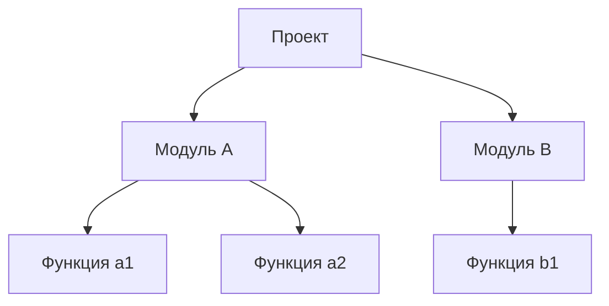
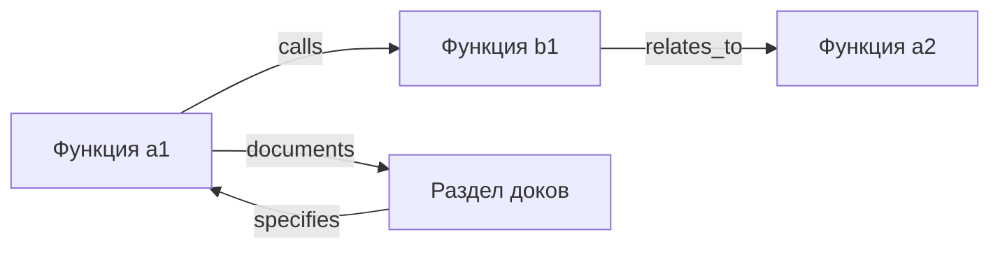
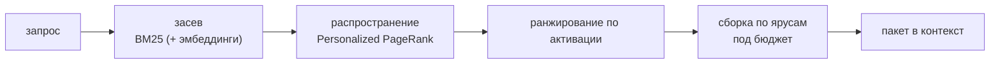
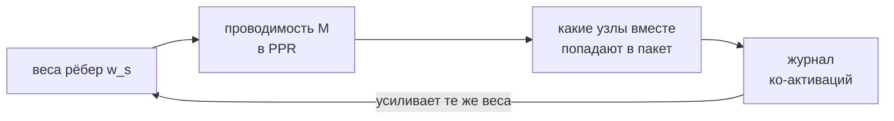
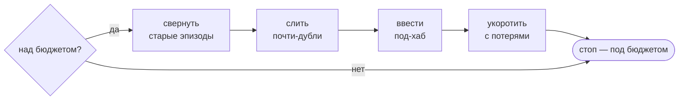
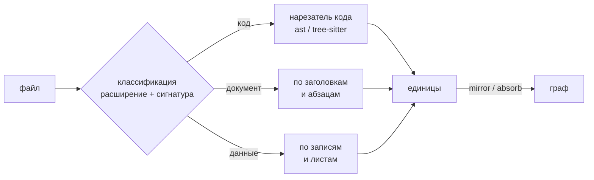

# AMG — Теория и научное обоснование

AMG (Associative Memory Graph — «граф ассоциативной памяти») — устойчивая консолидированная долговременная память для языковых моделей: навигируемый ассоциативный граф знаний, наложенный на файловую систему, с типизированными взвешенными рёбрами и извлечением через распространение активации. Это альтернатива двум распространённым сейчас подходам — стандартному RAG (векторный top-k по фрагментам) и вручную ведомой вики (wiki-LLM Андрея Карпатого), — и она заимствует сильные стороны обоих.

Точнее всего систему характеризует понятие символьно-коннекционистского гибрида. Она содержит коннекционистские идеи (взвешенный граф; активация, которая распространяется и затухает; усиление совместно используемых связей), выраженные в символьной, человекочитаемой форме (файлы Markdown с YAML-заголовком; явно типизированные рёбра).

Документ описывает теоретические основания AMG — модель, её механизмы и связь с работами в когнитивной науке, поиске информации (information retrieval) и теории графов. Реализация — форматы файлов, параметры, код — вынесена в [документацию по архитектуре](./architecture/README.md).

Методологическая рамка. Архитектура AMG опирается на устоявшиеся модели из перечисленных областей. Её числовые константы подбираются эмпирически; часть шагов использует суждение языковой модели (эвристический компонент); основной вклад — не отдельный механизм, а их интеграция в единую систему, преимущество которой является эмпирически проверяемым, а не постулируемым. Свойства, допускающие формальное доказательство (слой согласованности данных), доказаны и подтверждены тестами; остальные обоснованы аргументативно, что отмечается по месту.

## Содержание

- [0. Постановка задачи](#0-постановка-задачи)
- [1. Идея вкратце](#1-идея-вкратце)
- [2. Три слоя памяти: теория комплементарных систем (CLS)](#2-три-слоя-памяти-теория-комплементарных-систем-cls)
- [3. Почему граф, а не дерево](#3-почему-граф-а-не-дерево)
- [4. Узел и ребро: модель данных](#4-узел-и-ребро-модель-данных)
  - [4.1. Происхождение рёбер: детерминированное — прежде модели](#41-происхождение-рёбер-детерминированное--прежде-модели)
  - [4.2. Глобальная смысловая линковка поверх слоя сводок](#42-глобальная-смысловая-линковка-поверх-слоя-сводок)
  - [4.3. Воспроизводимость сборки: кэш дериваций](#43-воспроизводимость-сборки-кэш-дериваций)
  - [4.4. Экономика и устойчивость сборки](#44-экономика-и-устойчивость-сборки)
- [5. Принципы человеческой памяти: что переносимо, а что нет](#5-принципы-человеческой-памяти-что-переносимо-а-что-нет)
- [6. Извлечение как распространение активации](#6-извлечение-как-распространение-активации)
  - [6.1. Что такое распространение активации](#61-что-такое-распространение-активации)
  - [6.2. Что такое PageRank и Personalized PageRank](#62-что-такое-pagerank-и-personalized-pagerank)
  - [6.3. Формула AMG (query-biased Personalized PageRank)](#63-формула-amg-query-biased-personalized-pagerank)
  - [6.4. Ключевое решение: смещать, а не запирать](#64-ключевое-решение-смещать-а-не-запирать)
- [7. Сборка контекста по ярусам (от общего к частному)](#7-сборка-контекста-по-ярусам-от-общего-к-частному)
- [8. Веса связей: обучение по Хеббу с затуханием](#8-веса-связей-обучение-по-хеббу-с-затуханием)
- [9. Значимость как ценность информации](#9-значимость-как-ценность-информации)
- [10. Рост графа: отбор в контекст и компрессия](#10-рост-графа-отбор-в-контекст-и-компрессия)
  - [10.1. Что попадает в контекст](#101-что-попадает-в-контекст)
  - [10.2. Компрессия веток](#102-компрессия-веток)
  - [10.3. Забывание как улучшаемое свойство, а не копия](#103-забывание-как-улучшаемое-свойство-а-не-копия)
- [11. Входные данные: информационные домены и классификатор](#11-входные-данные-информационные-домены-и-классификатор)
- [12. Две политики обработки источника: mirror и absorb](#12-две-политики-обработки-источника-mirror-и-absorb)
- [13. Консолидация — цикл пластичности](#13-консолидация--цикл-пластичности)
- [14. Оценка и сравнение](#14-оценка-и-сравнение)
  - [14.1. Что выведено, что настраивается, что эвристика](#141-что-выведено-что-настраивается-что-эвристика)
  - [14.2. Сравнение с RAG и с вики](#142-сравнение-с-rag-и-с-вики)
- [15. Модель доверия: провенанс, уверенность и верификация](#15-модель-доверия-провенанс-уверенность-и-верификация)
  - [15.1. Иерархия источников](#151-иерархия-источников)
  - [15.2. Провенанс: откуда взялся факт](#152-провенанс-откуда-взялся-факт)
  - [15.3. Уверенность (confidence)](#153-уверенность-confidence)
  - [15.4. Верификация: проверка перед ответом](#154-верификация-проверка-перед-ответом)
  - [15.5. Провенанс использования и разрыв циркулярности](#155-провенанс-использования-и-разрыв-циркулярности)
  - [15.6. Что измеримо, а что эвристика](#156-что-измеримо-а-что-эвристика)
  - [15.7. Эпистемический арбитраж: разрешение противоречий](#157-эпистемический-арбитраж-разрешение-противоречий)
- [16. Имя и метафора](#16-имя-и-метафора)
- [17. Истоки: на какие работы опирается AMG](#17-истоки-на-какие-работы-опирается-amg)
- [Ссылки (избранное)](#ссылки-избранное)

---

## 0. Постановка задачи

Языковая модель (LLM) не сохраняет состояние между сессиями: каждый новый сеанс начинается без памяти о предыдущих. Всё, чем модель оперирует в текущий момент, размещается в **контекстном окне** — рабочей памяти фиксированного объёма, измеряемого в токенах. При переполнении окна или завершении сессии накопленный контекст теряется.

Внешнюю долговременную память для модели обычно реализуют одним из двух способов. Первый — **RAG** (retrieval-augmented generation, генерация с подключённым поиском): корпус режется на фрагменты, индексируется по векторной близости, и на каждый запрос в окно подмешивается top-k наиболее похожих фрагментов. Второй — **вручную ведомая вики**: связанные страницы, которые модель читает как обычные документы.

У каждого подхода есть структурные ограничения (подробный разбор — в §14). RAG извлекает плоский набор локально похожих фрагментов: он плохо отвечает на вопросы, требующие связать несколько источников (multi-hop — «многошаговые», когда ответ собирается из нескольких узлов), не различает уровни абстракции и выводит результат заново на каждый запрос, ничего не накапливая. Вручную ведомая вики требует постоянного сопровождения и со временем расходится с первоисточником.

**AMG (Associative Memory Graph — «граф ассоциативной памяти»)** — внешняя память в виде **графа** связанных узлов-заметок поверх файлов на диске. Извлечение основано не на плоском сходстве, а на распространении активации по связям, поэтому в окно попадает релевантная окрестность графа, а не разрозненные похожие фрагменты.


Граф строится из исходных файлов (слева), по запросу отдаёт в окно релевантную часть (справа), а выводы, сделанные в ходе работы, дописываются обратно в граф. Граф целиком в окно не загружается никогда — только активированная окрестность.

---

## 1. Идея вкратце

В основе AMG лежит один принцип организации человеческой памяти: извлекается не весь объём знаний целиком, а нужный фрагмент вместе с ближайшими ассоциативными связями. При обращении к задаче активируются релевантные факты и тянут за собой смежные; остальное остаётся неактивным. Этот же механизм положен в основу AMG: запрос активирует подходящие узлы, активация распространяется по связям к соседям, затухая с расстоянием, и в окно собирается только активированная часть графа.

Память при этом разделена на три уровня — это также воспроизводит организацию памяти человека (подробно в §2): **рабочая** (то, чем модель оперирует сейчас) — контекстное окно; **эпизодическая** (свежие подробные записи) — дешёвые заметки по ходу сессии; **семантическая** (устоявшееся обобщённое знание) — консолидированный граф. Базовый принцип, к которому документ возвращается в нескольких разделах: захват информации ведётся широко и дёшево по ходу работы, а отбор, взвешивание и сжатие выполняются позже, на отдельном шаге консолидации, когда доступен полный контекст.

---

## 2. Три слоя памяти: теория комплементарных систем (CLS)

**Суть теории.** Complementary Learning Systems (CLS, «комплементарные системы обучения»; McClelland, McNaughton & O'Reilly, 1995; обновление — Kumaran, Hassabis & McClelland, 2016) объясняет, почему память в мозге устроена из *двух* взаимодополняющих систем. **Гиппокамп** быстро записывает отдельные эпизоды (что, где, когда) — подробно, но разрозненно. **Неокортекс** медленно накапливает обобщённое структурированное знание. Разделение нужно, чтобы избежать *катастрофического забывания*: если вписывать каждое новое впечатление прямо в общую структуру немедленно, оно разрушает уже выученное. Поэтому новое сперва оседает в быстрой эпизодической памяти, а затем постепенно и аккуратно интегрируется в семантическую. Быстрая запись и медленная интеграция — две скорости одной системы.

**Отображение на AMG:**

| Когнитивная система | Слой AMG | Назначение |
|---|---|---|
| Рабочая память (модель Бэддели) | контекстное окно | активные рассуждения «здесь и сейчас» — *оперативный* уровень |
| Гиппокамп — быстрая эпизодическая запись | дешёвые заметки по ходу сессии (только дописывание, append-only) | широкий, подробный, слабо структурированный захват |
| Неокортекс — медленная семантика | консолидированный граф узлов | долговременное, дедуплицированное, связное знание |
| Семантическая сеть + индекс | хабы (узлы-концентраторы) + иерархические сводки + типизированные рёбра | навигация и активация «от общего к частному» |
| Реплей во сне, пластичность | шаг консолидации | эпизод → семантика; создание и обрезка связей; разрешение противоречий |

Отсюда базовый принцип всей системы: захват дешёвый и широкий по ходу; отбор, взвешивание, сжатие и забывание — потом, на консолидации. Существенно, что *определять значимость в моменте необязательно*: значимость (salience) контекстна и ретроспективна — то, что сейчас выглядит шумом, позже может оказаться ключевым. Поскольку цена захвата мала, а цена потери велика, в моменте система склоняется к сохранению, а сортирует, когда доступен полный контекст.

---

## 3. Почему граф, а не дерево

Это центральное архитектурное решение.

**Дерево** — строгая иерархия: у каждого элемента ровно один родитель, как у папок в файловой системе. **Граф** — произвольные связи: у узла сколько угодно связей в любые стороны, каждая со своим весом, иногда замкнутые в циклы.



Дерево выражает только вложенность. Но реальные знания связаны *поперёк* иерархии: функция `a1` вызывает `b1` из другого модуля, раздел документации описывает `a1`, две функции связаны по смыслу. Дерево этого физически не выражает — у элемента один родитель, поперечных рёбер нет:



**Решение AMG:** дерево папок кодирует **только** отношение «часть/раздел» (`part_of`) — это *остов* (spanning tree), нужный для просмотра и пространства имён (namespace — «адрес» файла в иерархии). Все прочие связи живут **явными типизированными рёбрами** внутри файлов, во **frontmatter** — так называют YAML-заголовок в начале markdown-файла, где хранятся метаданные узла. Так граф не зависит от структуры папок и работает с git, grep и редакторами без дополнительных инструментов.

Кодировать связи в *именах* файлов и папок было бы хрупко: систему пришлось бы заставлять разбирать имена вручную, а любое переименование рвало бы связи. Явные рёбра во frontmatter лишены этого недостатка.

---

## 4. Узел и ребро: модель данных

**Узел** — атомарная единица знания: одно понятие, сущность, функция, раздел или сводка. В терминах памяти узел ближе к **энграмме** — цельному следу памяти, — чем к отдельному нейрону (обоснование в §5). Физически узел = один файл с frontmatter (метаданные) и телом.

**Ребро** — типизированная взвешенная связь между двумя узлами: тип отношения (`rel`), куда ведёт (`to`) и сила (`w` ∈ (0, 1]). Рёбра хранятся во frontmatter исходного узла.

Концептуальный вид узла (полную схему полей даёт [Модель данных](./architecture/02-data-model.md)):

```yaml
id: code:src/billing.py::charge_card     # стабильный идентификатор
type: function                            # форма единицы
summary: Списывает оплату с карты ...     # сводка в 1–3 фразы (на working_language)
status: active                            # active / stale / superseded
source_path: src/billing.py               # источник (носитель истины)
part_of:                                  # дом(а) в иерархии, с весом
  - {topic: billing, w: 0.7}
edges:                                     # типизированные связи
  - {rel: calls, to: code:src/billing.py::compute_total, w: 0.8}
  - {rel: documents, to: doc:doc/billing.md::overview, w: 1.0}
```

**Типы рёбер** (полный набор и их «проводимость» заданы в `config.yml`, блок `relation_priors`; полный справочник — [Справочник конфигурации](./architecture/09-config.md)). Каждый тип означает своё отношение и по-разному проводит активацию (число рядом — приоритет проводимости β, см. §6.3):

- `documents` 0.9 — узел документации описывает узел кода;
- `implements` 0.9 — код реализует спецификацию или требование;
- `specifies` 0.9 — узел задаёт спецификацию для другого;
- `calls` 0.8 — функция вызывает функцию;
- `depends_on` 0.8 — зависимость одного узла от другого;
- `inherits` 0.8 — класс наследует базовому классу (связь подкласс-база теснее вызова);
- `defines` 0.7 — модуль или файл определяет функцию/класс, класс — свои методы (хребет принадлежности);
- `part_of` 0.7 — членство в теме/хабе (то же отношение, что у остова-дерева);
- `imports` 0.6 — импорт модуля;
- `refines` 0.6 — уточнение или заострение другого утверждения (мягкая смысловая связь; ставит `amg-builder`);
- `exemplifies` 0.6 — «пример → понятие»: конкретный случай иллюстрирует общее правило (ставит `amg-builder`);
- `relates_to` 0.5 — слабая смысловая связь «по теме»;
- `supersedes` 0.3 — новый узел вытесняет устаревший (ставит `amg-synth`); проводит слабо при обычном поиске — как `contradicts`, — а сам вытесненный узел дополнительно понижается статусным приоритетом при извлечении;
- `contradicts` 0.3 — противоречие (проводит слабо при обычном поиске, но важно при запросе вида «где противоречия»).

Для типов, не перечисленных в конфиге, проводимость по умолчанию равна 0.5 (`relation_prior_default`).

### 4.1. Происхождение рёбер: детерминированное — прежде модели

Рёбра графа рождаются двумя принципиально разными путями, и граница между ними — одно из несущих решений системы: **всё, что выводимо из синтаксиса точно, извлекает код; модели остаётся только то, что требует понимания.** Импорты, вызовы, принадлежность (модуль определяет свои функции и классы, класс — свои методы) и наследование читаются из разобранного исходника детерминированно — бесплатно, воспроизводимо и без единого обращения к модели. Тратить суждение на связи, которые можно получить точно, значило бы платить токенами за худший результат: модель отвечает на такие вопросы медленнее, дороже и с ошибками, которых у синтаксического разбора не бывает. Слою суждения достаются связи смысла — «документ описывает этот код», «пример иллюстрирует это правило», «эти утверждения противоречат друг другу», — то есть ровно то, чего в синтаксисе нет.

У детерминированного пути есть собственное правило честности: **неверное ребро хуже висячего.** Висячее ребро (цель которого не существует) извлечение просто отбрасывает — оно инертно; неверное же ребро проводит активацию в ложную сторону при каждом запросе. Поэтому разрешение имён никогда не гадает: вызов связывается с функцией другого файла только через таблицу импортов самого файла (имя, совпавшее с именем модуля случайно, ребра не даёт), а невыводимое — встроенные функции языка, методы неизвестных объектов, внешние библиотеки — не становится рёбрами вовсе, чтобы граф не накапливал шум. Единственное намеренное исключение — импорт внешнего модуля: его ребро остаётся висячим как запись самого факта импорта.

Тот же принцип продолжается и над рёбрами слоя суждения — **канонизацией целей**: модель говорит, *что* с чем связано, а код решает, *какой именно узел* имеется в виду. Цель, записанную без полного пути (модель видела файл, но не знала его места в дереве), детерминированный проход привязывает к единственному существующему узлу с таким хвостом пути; при неоднозначности цель не трогается — снова «не гадать». Так слой суждения освобождается и от знания точных идентификаторов: ему не нужен справочник всех узлов, достаточно назвать связь узнаваемо.

Граница «детерминированное — прежде модели» доходит и до самих сводок. У **тривиальной** единицы кода — метода в одну-две строки, механического геттера — нет смысла сверх её собственного текста: суждение здесь ничего не понимает *дополнительно*, а лишь пересказывает строку кода дороже и с шансом приукрасить. Сводку такой единицы пишет код — ею становится сам её текст, — а суждение тратится там, где есть что понимать. Два исключения принципиальны. Протокольные методы, само наличие которых меняет способ употребления класса (объект вызываем; класс — контекстный менеджер), уходят к модели при любом размере: их семантика не в теле, а в факте существования. И однажды вынесенное суждение шаблоном не вытесняется: если для единицы сохранена прежняя деривация, восстановление возвращает её дословно (§4.3) — детерминированная сводка закрывает лишь то, о чём модель ещё не высказывалась.

### 4.2. Глобальная смысловая линковка поверх слоя сводок

Смысловые рёбра пишутся в два приёма, и причина — в неустранимом ограничении пакетной обработки. Сводки узлов создаются параллельными сборщиками, каждый из которых видит только свою пачку: это делает построение дешёвым и устойчивым, но кросс-доменную полноту такой сборщик дать **не может по построению** — он не знает, что лежит в чужих пачках, и документ, пример и код, говорящие об одном, остаются островами. Полноту связей обязан давать отдельный **глобальный проход**, который выполняется после того, как сводки готовы у всего графа.

Ключевое наблюдение, делающее глобальный проход дешёвым: **линковке не нужны исходники — нужен слой сводок.** Сводка и есть сжатие узла до его смысла; слой сводок целого графа умещается в сотни килобайт, тогда как исходники — в мегабайты. Поэтому «полная картина» достигается не загрузкой всего проекта в один гигантский контекст, а подачей компактного смыслового слоя. Кандидатов на связь предлагает **близость сводок** (по уже посчитанным для засева векторам, а без них — по пересечению слов): два узла, чьи сводки говорят об одном, — почти наверняка связаны, и обнаружить это умеет арифметика, без модели. Модель делает то, чего арифметика не умеет: **подтверждает** связь по смыслу, называет её тип и вес — или отклоняет ложное совпадение слов. Пачки подтверждения ограничены и параллельны, но полнота глобальна: кандидаты приходят со всего графа. Уже связанные пары повторно не предлагаются, поэтому проход можно запускать инкрементально — по мере дозревания сводок он лишь достраивает недостающее.

Чтобы проход **завершался**, нужна ещё одна память — память отклонений. Сам граф помнит только подтверждённую половину каждого суждения: отклонённый кандидат не оставляет следа, и повторный прогон номинировал бы его снова — а с исключёнными подтверждёнными парами похожесть сползала бы по собственному ранжиру ко всё более слабым кандидатам, волна за волной заново отклоняя одно и то же по полной цене. Память о том, что было *рассужено* (а не только принято), превращает «повторять, пока нет нового» из недостижимого идеала в реальное условие остановки прохода. Это та же экономика, что у кэша обогащения (§4.3) — не спрашивать дважды, — распространённая с генерации на суждение: однажды оплаченный вердикт сохраняется, и до судьи доходят только действительно новые пары. Сама память — учёт, а не знание: её удаление переоткрывает суждения ценой пере-суждения, но никогда не ценой корректности.

Порядок внутри прохода не случаен: **таксономия тем должна существовать до линковки.** Секции и примеры привязываются к темам-хабам, значит хабы обязаны родиться раньше — и родиться **детерминированно**: якоря тем выводятся из структуры каталогов, а слой суждения их именует и уточняет, вместо того чтобы изобретать набор тем заново на каждой пересборке. Рождение тем — глобальное решение с единственным владельцем; отдай его параллельным пачкам — и каждая сборка получала бы другой стратегический слой.

### 4.3. Воспроизводимость сборки: кэш дериваций

Суждение модели недетерминировано: одна и та же единица, поданная дважды, получает разные сводки, и «граф каждый раз другой» — даже при неизменных исходниках. Снижать разброс настройками генерации можно, но слабее и дороже, чем просто **не спрашивать дважды**: однажды принятая деривация (сводка, рёбра, уверенность) сохраняется под ключом из хеша содержимого единицы, и пересборка с нуля восстанавливает её дословно. Тот же вход даёт тот же граф — воспроизводимость становится практическим свойством, а повторная сборка почти ничего не стоит: платится только за действительно новый контент. Ключ включает язык сводок и версию контракта деривации — смена любого из них честно обесценивает кэш, вместо того чтобы молча вернуть сводки не на том языке или не той формы.

### 4.4. Экономика и устойчивость сборки

Стоимость сборки агентным исполнителем определяется не столько объёмом содержимого, сколько его **повторной пересылкой**: на каждом ходу исполнителю заново отправляется весь накопленный им контекст, поэтому лишнее обращение «прочитай файл» стоит не один файл, а весь предшествующий разговор. Отсюда два правила. **Данные едут к исполнителю один раз**: единица приходит в задание вместе со своим текстом — тем самым срезом, по которому посчитан её хеш, — и исполнителю незачем открывать источники. И **оркестратор оперирует агрегатами**: в его собственный, переотправляемый на каждом ходу контекст попадают счётчики и статусы, а не содержимое, — содержимое читают исполнители в своих изолированных контекстах.

Та же арифметика переотправки правит **собственными ходами оркестратора** и **глобальными пассами**, а не только по-единичными исполнителями. Каждая команда оркестратора — ход, переотправляющий весь его накопленный разговор, поэтому число ходов — та же валюта, что и объём данных. Результаты, зафиксированные множеством долговечных порций, вносятся поэтому **одним пакетным вызовом**, а не командой на порцию, и раунд исполнителей запускается вместе, а не по одному: у координатора экономия ходов и *есть* экономия токенов. А глобальный пасс — синтез, называющий слой тем, или суждение, консолидирующее память, — получает весь свой вход **одним детерминированно подготовленным файлом**: слой сводок, отжатый и сгруппированный кодом, приходит в задании, вместо того чтобы агент обходил хранилище файл за файлом в собственном контексте, где каждое следующее чтение переотправляет всё прочитанное до него. Глобальный охват даётся подготовкой, а не накоплением внутри агента.

Устойчивость — вторая сторона той же дисциплины. Долгая недетерминированная работа над большим входом прерывается неизбежно — лимитами, обрывами связи, потолком на объём одного ответа, — поэтому партии ограничиваются заранее, а результат фиксируется по мере готовности небольшими **завершёнными порциями**: прерывание теряет хвост после последней порции, а не целое. Наконец, **завершение — проверяемое утверждение, а не рапорт**: исполнитель отчитывается «выведено N из M», и эти числа сверяются с фактически применённым — система не принимает «готово» на слово, потому что оборванная работа, выданная за законченную, молча теряет единицы. Так принцип устойчивости к сбоям, доказанный для детерминированного слоя (§14.1), продолжается на слой суждения: там гарантию даёт журнал транзакций, здесь — долговечные порции и сверяемые счётчики.

Существенно, что вся эта экономия берётся из устранения **повторной** работы — перечитывания, переотправки, переделки потерянного, — а не из урезания смысла: содержимое сводок и связей не меняется, как и у кэша дериваций (§4.3), удешевляющего повторную сборку тем же способом — не спрашивая дважды.

---

## 5. Принципы человеческой памяти: что переносимо, а что нет

Человеческая память — эффективное ассоциативное хранилище, поэтому заимствование её принципов продуктивно при проектировании внешней памяти. Однако память реализована на биологическом субстрате, а AMG — на файловой системе, и не каждый принцип переносится напрямую. Ниже разделено то, что переносимо и определяет дизайн, и то, что на файловой системе реализуется иначе.

**Переносится и определяет дизайн:**
- ассоциативная организация — это **граф**, а не дерево (плотные взвешенные, иногда циклические связи; §3);
- извлечение «от общего к частному» — обзор раньше деталей;
- активируется только релевантное подмножество — разреженное, зависящее от запроса извлечение;
- разделение рабочей и долговременной памяти ложится на «окно ↔ файлы»;
- поддержание связей со временем соответствует синаптической пластичности.

**Реализуется иначе (прямой перенос невозможен):**
- *Единица памяти — не отдельный нейрон.* В мозге смысл распределён по популяциям нейронов, и один нейрон почти не несёт значения. В AMG единица — узел-понятие (энграмма, цельный след памяти), а не «нейрон-файл»; связи между узлами типизированы, а не сводятся к одной вложенности.
- *Ассоциации не кодируются структурой хранения.* В файловой системе связь нельзя выразить именем папки без хрупких допущений (§3); поэтому связи вынесены в явные типизированные рёбра.
- *Веса не обучаются градиентным спуском.* В биологической и в искусственной нейросети сила связей настраивается обучением (в искусственной — градиентным спуском, backpropagation — обратным распространением ошибки). В AMG веса так не выучиваются: они **обновляются эвристическими правилами** — Хебба, затухания и суждением модели, — без обратного распространения ошибки. Поэтому точная характеристика системы — **навигируемый ассоциативный граф знаний с поиском через распространение активации**, символьно-коннекционистский гибрид, а не обучаемая нейросеть.

Критерий проектирования — качество извлечения и поддерживаемость, а не биологическое правдоподобие.

---

## 6. Извлечение как распространение активации

Задача извлечения: по запросу поднять сразу и стратегически, и оперативно релевантный подграф, а не только локально похожие фрагменты. Ниже механизм разобран с нуля.

### 6.1. Что такое распространение активации

**Распространение активации (spreading activation; Collins & Loftus, 1975; на основе семантических сетей Квиллиана)** — классическая модель памяти. Активация начинается на узлах, совпавших с запросом, и течёт по связям к соседним узлам, **затухая с расстоянием**: чем дальше узел от очага, тем слабее он активируется. В когнитивной архитектуре **ACT-R** (Андерсон) это формализовано: доступность узла = его базовый уровень + притёкшая активация. Получается готовый математический аппарат для «силы активации» узла.


«Seed-узел» (от *seed* — «зерно») — узел-затравка, с которого начинается активация.

### 6.2. Что такое PageRank и Personalized PageRank

Чтобы строго посчитать установившуюся активацию по всему графу, AMG использует **PageRank** — алгоритм, которым Google ранжировал страницы (Page & Brin, 1998). Образ: «случайный сёрфер» бесконечно ходит по ссылкам наугад; страница тем важнее, чем чаще он на ней оказывается, то есть чем больше важных страниц на неё ссылается. Математически это *установившееся (стационарное) распределение* случайного блуждания по графу.

Обычный PageRank даёт «важность вообще». Нам же нужна важность **относительно запроса**. Её даёт **Personalized PageRank** (он же topic-sensitive PageRank; Haveliwala, 2002): сёрфер время от времени «телепортируется» не на случайную страницу, а обратно в заданный набор узлов-затравок. Тогда установившееся распределение показывает важность *относительно этих затравок* — то есть относительно запроса.

### 6.3. Формула AMG (query-biased Personalized PageRank)

AMG считает активацию `π` итеративно:

```
π = (1 − d) · p  +  d · M · π
```

Значение символов:
- `π` — искомая активация всех узлов (то, что ранжируется);
- `d` — **коэффициент затухания** (damping), в конфиге `0.85`: насколько далеко растекается активация (доля «продолжить блуждание» против «телепортироваться»);
- `p` — **вектор телепортации** (personalization): куда сёрфер возвращается, то есть релевантность запросу; сюда входит результат **засева** (§7);
- `M` — **матрица переходов**: как активация перетекает по рёбрам. Её элемент — проводимость ребра `c(u→v) = w_s(u→v) · β(rel)`, где `w_s` — выученная сила связи (§8), а `β(rel)` — приоритет типа ребра из `relation_priors` (§4); матрица нормирована по исходящим рёбрам каждого узла.

**Сходимость** гарантирована: при `d < 1` итерация является сжимающим отображением (теорема Перрона–Фробениуса), поэтому несколько проходов сходятся к единственному `π` независимо от начального приближения. В конфиге число проходов ограничено сверху (`max_hops: 30`), а узлы ниже порога активации (`activation_threshold: 0.02`) отбрасываются — порог задан **долей от максимальной активации**, а не абсолютным значением: `π` в сумме равна 1 по всему графу, поэтому абсолютные активации уменьшаются с ростом графа при сохранном смысле ранжирования, и лишь относительное отсечение не зависит от масштаба. Реализация засева, обхода и сборки пакета — [Извлечение из графа](./architecture/06-retrieval.md).

Эмпирический прецедент именно этой конструкции — **HippoRAG** (Gutiérrez et al., NeurIPS 2024): граф знаний + Personalized PageRank как вычислительный аналог индексации гиппокампа; на multi-hop вопросах он уверенно превосходит обычный RAG.

### 6.4. Ключевое решение: смещать, а не запирать

Здесь — главная тонкость, ради которой граф вообще имеет смысл.

Наивный вариант домножал бы проводимость ребра на релевантность *целевого* узла запросу. Это **запирает** многошаговые пути: узел, сам по себе нерелевантный запросу, получает почти нулевую проводимость — и активация не может протечь *сквозь* него к релевантному соседу. Граф тогда бесполезен.

AMG поступает иначе: релевантность запросу входит **только в вектор телепортации** `p`. Матрица переходов `M` от запроса **не зависит** — это чистая структурная проводимость. Релевантность *смещает* (bias) то, где активация концентрируется, но не *запирает* (gate) пути, по которым она может идти. Многошаговость сохраняется по построению.

Пример. Запрос «как обрабатываются сбои оплаты». Узел `retry_note` («повторять при ошибке шлюза») не содержит слов запроса — лексически нерелевантен. Но он связан ребром `relates_to` с узлом `charge_card`, который запросу релевантен и получает массу телепортации. Эта масса протекает по ребру и активирует `retry_note` — он попадёт в выдачу, хотя по словам сам бы не нашёлся. Это и есть выигрыш графа над плоским поиском.

Так же сама собой разрешается **полииерархия** (множественное членство, multi-parent). Пусть узел имеет `part_of: {db: 0.7, reporting: 0.3}`. Запрос про БД → узлы кластера БД релевантны, активация доходит до узла «со стороны БД» и тянет соседей оттуда; сторона «отчётность» остаётся холодной. Запрос про отчётность → зеркально. Один и тот же узел достигается разными путями и тянет разное окружение в зависимости от запроса — выбирать «единственного родителя» не требуется.

---

## 7. Сборка контекста по ярусам (от общего к частному)

Посчитанную активацию нужно превратить в пакет под **бюджет** контекста. Узлы укладываются по **ярусам абстракции** — это и есть «три уровня сразу». Названия ярусов взяты из управленческого планирования и универсальны: *стратегический* — общая картина, *тактический* — средний уровень, *оперативный* — конкретика повседневной работы; ниже у каждого свой бюджет в токенах:

- **стратегический** — хабы и обзоры (бюджет `strategic: 4000` токенов);
- **тактический** — сводки активированных кластеров и модулей (`tactical: 10000`);
- **оперативный** — самые активные листовые узлы целиком (`operational: 24000`): для кода это указатель `path:line` + сводка, для документации — тело;
- **периферия** — список ссылок (заголовков) на следующее кольцо соседей, не загружаемых целиком (`periphery_links: 60`): дешёвый аналог фоновой слабой активации.



**Бюджет — это потолок, а не обязательная нагрузка.** За один запрос в окно попадает *не больше* суммы бюджетов ярусов (плюс ссылки периферии), но фактически грузится только активированная окрестность: если релевантного мало, подтянется мало независимо от потолка. Слабая активация отсекается порогом `activation_threshold`, поэтому слабо связанные ветви в пакет не идут. Этот потолок не следует путать с бюджетом ветки из раздела 10.2: первый ограничивает объём *выдачи на запрос*, второй — размер *ветки в графе* до её сжатия.

Бюджеты к тому же — сознательно **единственный** рычаг размера. Соблазнительное уточнение — прекращать сборку, когда префикс ранжирования уже несёт «почти всю» массу активации, — разбивается об измеренное свойство самого стационарного распределения: на связном графе масса PPR *размазана по построению* (она суммируется к единице по всем узлам, а проводимость держит хвост тёплым), и префикс не концентрируется настолько, чтобы любая отсечка по массе отделила сигнал от хвоста. Фокус живёт в *ранжировании*, а не в профиле массы; объёмом честно правят бюджеты и относительный порог, и ужесточение порога срезает пакет ровно там, где начинает стоить полноты.

**Засев (seeding)** — первый шаг: сопоставить запрос с узлами и задать им начальную релевантность. По умолчанию засев **лексический** — BM25 (классическая формула ранжирования по совпадению слов: учитывает частоту слова в узле и его редкость по графу). Опционально к нему подмешивается **семантическая** близость по эмбеддингам (блок `embeddings` в конфиге; подробнее — [Извлечение из графа](./architecture/06-retrieval.md)): это помогает на перефразированных запросах, но изменяет **только** вектор телепортации — обход и сборка не затрагиваются.

**Почему жадная укладка близка к оптимуму.** Задача «вместить максимум полезного под бюджет» — это *бюджетное максимальное покрытие*. Полезность здесь **субмодулярна**, то есть обладает убывающей отдачей: каждый следующий узел добавляет тем меньше нового, чем больше уже взято. Для таких задач **жадный** алгоритм (брать узлы по убыванию активации) даёт доказанную гарантию — не хуже `(1 − 1/e) ≈ 63 %` от оптимума (Nemhauser, Wolsey & Fisher, 1978). То есть и у шага «что влезет в окно» есть строгая оценка качества.

Идею многоуровневых сводок «от общего к частному» подтверждают **RAPTOR** (Sarthi et al., 2024 — рекурсивное дерево сводок) и **GraphRAG** (Edge et al., 2024, Microsoft — сводки сообществ на нескольких уровнях абстракции).

---

## 8. Веса связей: обучение по Хеббу с затуханием

Сила связи `w_s ∈ (0, 1]` живёт на рёбрах (не на папках). Замысел — менять её по правилу **Хебба** («что срабатывает вместе, то связывается»; neurons that fire together wire together): если два узла часто активируются в одних и тех же запросах, связь усиливается; если связь долго не используется — слабеет. Новые рёбра стартуют с `default_edge_weight` (`0.5`).

Непрерывная форма правила — «дырявый интегратор» (leaky integrator):

```
dw/dt = η · xᵢ · xⱼ  −  λ · w
```

- `η` — скорость усиления (`hebbian_rate: 0.10`): насколько совместная активация поднимает вес;
- `λ` — скорость затухания (`decay_rate: 0.02`): насколько неиспользование ослабляет вес;
- член затухания гарантирует ограниченность весов и анализируемую неподвижную точку.

Рёбра, упавшие ниже порога (`prune_below: 0.05`), **обрезаются** — аналог синаптического прунинга (отмирания неиспользуемых синапсов). У членства `part_of` есть отдельное ограничение-симплекс (сумма весов по родителям ≤ 1, `part_of_renormalize: true`), чтобы «степень принадлежности» узла к темам оставалась согласованной; этот инвариант поддерживается **всегда**, независимо от хеббова обновления.

**Две скорости.** Чтобы извлечение оставалось быстрым и без блокировок, ко-активация при поиске **не пишется** в граф немедленно — она лишь дописывается в отдельный журнал (только добавление). Свёртка журнала, затухание и обрезка выполняются **позже**, на консолидации (§13; реализация — [Консолидация](./architecture/07-consolidation.md)).

### 8.1. Почему хеббово обновление по умолчанию выключено

Хеббово обновление весов **по умолчанию отключено** (`weights.apply_hebbian: false`) — это намеренное решение, а не недоделка. Причина — **частичная цикличность сигнала ко-активации**:



Вес ребра влияет на проводимость, проводимость — на то, какие узлы окажутся в пакете вместе, а «оказались вместе» и есть сигнал, усиливающий тот же вес. Возникает положительная обратная связь «богатые богатеют»: сильное ребро крепнет уже потому, что оно сильное, а не потому, что полезно для задачи. Затухание сглаживает дрейф, но **пользу не доказывает**. Неконтролируемый Хебб способен сделать часть рёбер «магистралями» проводимости и оттянуть массу активации от релевантных, но слабее связанных узлов — то есть **незаметно ухудшить полноту**.

Отсюда консервативная политика (в духе «качество превыше всего», §14, и «измерение всегда включено»):

- по умолчанию консолидация **только накапливает** счётчик ко-активаций `coact` (он безвреден и питает рубрику значимости, §9), а проводимость держит **статической** и предсказуемой (структурные веса извлечения + начальный `default_edge_weight`); повторный прогон без нового журнала ничего не меняет (идемпотентность);
- хеббово обновление включается **явно** (`apply_hebbian: true`) и только после того, как измерение подтвердит выигрыш на **реальном** графе. Здесь важно различать два вопроса. *Корректность механизма* проверяема синтетикой: на графе, где эталонный узел достижим лишь через намеренно слабое ребро, без усиления он не попадает в выдачу, а после свёртки журнала ко-активаций — попадает (вклад изолирует hop-recall). Но **подыгрывающий синтетический граф доказывает лишь, что Хебб *способен* помочь, а не что он помогает в среднем** — симметрично возможной ложноотрицательной ошибке на графе с уже оптимальными весами. Поэтому *продуктовое* решение о дефолте требует измерения «веса on/off» на реальном или репрезентативном графе с настоящим журналом (сравнение полноты — §14; инструмент готов — измерительный стенд плюс сравнение конфигураций). До такого измерения дефолт остаётся `false`: уверенно-ложное ухудшение полноты опаснее упущенной оптимизации;
- честный «полезный» Хебб требует двух изменений сразу: усиление должно быть *различающим* — не давать уже-сильному ребру расти даром, иначе неизбежны «магистрали», — и питаться сигналом *от исхода задачи* (узел реально пригодился), а не само-подтверждающейся ко-активацией. Как ведёт себя такое правило на измерении и почему дефолт всё же осторожен — в §8.2.

Принципиальная позиция: для памяти языковой модели **суждение консолидатора, заземлённое провенансом** (§9), — более надёжный сигнал ценности связи, чем статистика собственных выдач системы. Хебб остаётся доступным инструментом, но не источником истины по умолчанию.

### 8.2. Что показало измерение

Замысел Хебба звучит убедительно, и потому возникает честный вопрос: а помогает ли он на самом деле? Чтобы не отвечать догадкой, слепое правило — то, что усиливает связь просто потому, что два узла «оказались вместе в одном пакете», — проверили напрямую: сравнили полноту извлечения с выключенным и включённым обновлением весов, на графах разного размера и с разным засевом.

Результат оказался поучительным и в двух режимах — противоположным. На небольшом, плотно связанном графе (несколько десятков узлов) включение Хебба не меняло ровно ничего: и recall, и hop-recall оставались теми же до четвёртого знака, сколько свёрток ни делай. Объяснение простое. Когда узлов мало и они густо переплетены рёбрами, распространение активации и так дотягивается до всей релевантной окрестности — исход решают засев запроса и сама форма графа, а не точные значения весов. Подкручивать веса в такой ситуации — всё равно что прибавлять громкость там, где и без того всё слышно.

Но стоило перейти к большому разрежённому графу (около двух сотен узлов, выстроенных в длинные цепочки зависимостей, — где до нужного узла идёшь многошагово), как тот же самый Хебб начал устойчиво **ухудшать** выдачу. С каждой свёрткой полнота падала: после нескольких проходов recall просел примерно на десятую долю, а hop-recall — почти на седьмую, и так при любом засеве, и лексическом, и семантическом. Падение было не случайным выбросом, а монотонным: чем больше свёрток, тем хуже.

Причина — ровно тот механизм «магистралей», которого опасается раздел выше, только теперь увиденный в работе. Сигнал ко-активации сильнее всего накапливается на и без того центральных рёбрах — через них проходит большинство выдач. Слепое правило тянет их вес к потолку, и они превращаются в магистрали проводимости: активация, вместо того чтобы растекаться вглубь графа, всё охотнее стекается по этим немногим перегруженным связям. А узлы, достижимые только многошагово — по слабым, редко используемым рёбрам, — недополучают массу активации и выпадают из выдачи. Богатые рёбра богатеют за счёт бедных, и именно бедные чаще ведут к неочевидному, но нужному знанию.

Из двух наблюдений складывается уточнённый принцип: **польза или вред хеббова обновления пропорциональны тому, насколько ответ опирается на распространение по рёбрам, а не на засев запроса.** Когда засев силён или граф плотный, всё решает засев — и Хебб безвреден, но и бесполезен. Когда засев слаб или граф разрежён, решает распространение — и тогда слепое усиление центральных связей активно вредит полноте. Это, кстати, объясняет и более раннюю обманчивую картину: лёгкий проблеск пользы, замеченный было при семантическом засеве, оказался следствием не эмбеддингов как таковых, а ослабленного засева — намеренно неподходящая модель размывала seed и тем отдавала больше веса распространению.

Поэтому вывод — не «на всякий случай выключим», а именно измеренный: слепое правило по умолчанию выключено, потому что в самом ценном для этой памяти режиме (многошаговое извлечение на большом графе) оно делает хуже. Чтобы Хебб приносил пользу, ему нужны два изменения. Первое — *различающее* усиление, которое не позволяет уже-сильному ребру расти даром: иначе магистрали неизбежны. Второе — сигнал *от исхода задачи* вместо само-подтверждающейся ко-активации: чтобы крепли связи, которые действительно помогли решить задачу, а не те, что система и так чаще показывает себе сама.

**Улучшенное правило и его измерение.** Оба изменения реализованы — и тот же стенд, на котором слепое правило вредило, показал обратное. Новое правило усиливает ребро, только если оба его конца были *реально использованы* в принятой сессии: сигнал берётся из отдельного журнала использования (`usage.log`), где состав выданных пакетов пересечён с файлами, которые в сессии действительно правили. Этот сигнал приходит **извне петли извлечения**, поэтому усиление по нему не само-подтверждается — цикличность разорвана. Усиление при этом *различающее* — на остаток до потолка, `Δ = hebbian_rate · (1 − w)`: уже-сильное ребро почти не растёт, а слабое многошаговое получает рычаг. Симметрично, ребро, которое лишь *показывали* в пакетах (ко-активация), но так и не использовали, медленно **гаснет** — и это демотирует те самые «магистрали», что слепое правило раздувало (отрицательный исход, откат, ослабляет ещё сильнее).

Результат на большом разрежённом графе — зеркальное отражение прежнего: с каждой свёрткой полнота не падает, а **монотонно растёт**, и так при всех трёх засевах. За восемь свёрток recall поднялся примерно с `0.60` до `0.85`, а hop-recall — с `~0.25` до `~0.70` (BM25, лёгкие статические эмбеддинги model2vec и многоязычный трансформер дали близкую картину); напомним, слепое правило на том же стенде эти же величины монотонно роняло (recall ≈ −0.10, hop-recall ≈ −0.14). На малом плотном графе (dogfood-песочница) новое правило, как и ожидалось от плотного графа, почти не двигает выдачу — но, в отличие от слепого, и **не вредит**.

Важная оговорка о статусе вывода. В обоих замерах сигнал исхода был *синтетическим*: «золотые» узлы каждого случая считались «использованными» при успехе. Это честно проверяет, что правило **корректно** и **полезно, когда сигнал использования точен**, но не доказывает средней пользы при *настоящем* `usage.log`, который шумнее.

Замер на реальном использовании с тех пор выполнен — на живом, плотно связанном графе проекта (около тысячи узлов и пяти тысяч рёбер) с журналом использования, честно накопленным рабочими сессиями. Свёртка всего накопленного одним флипом усилила сотни co-used рёбер — и не сдвинула ни полноту, ни hop-recall, ни полноту пакета, ни в одну сторону; реплей накопленного сигнала показа поверх (погашены тысячи показанных-но-неиспользованных рёбер) тоже ничего не изменил. Это тот самый плотный режим, который предсказывает заострённый принцип выше, теперь подтверждённый полем: где граф хорошо связан и засев силён, исход извлечения решают засев и структура, а нюансы весов инертны — флип безвреден и бесполезен одновременно. Два режима вместе придают дефолту окончательную форму: `apply_hebbian` остаётся **`false`**, потому что правило окупается только там, где ответы действительно идут многошагово по разрежённому графу — там применимы числа разрежённого стенда, — а на хорошо связанном тратит усилия впустую. Правило поставляется выключенным, безопасно к включению (без журнала использования оно вовсе бездействует, а действуя — ограничено исходом и потолком) и стоит включения на разрежённых многошаговых графах с накопленным реальным использованием.

---

## 9. Значимость как ценность информации

Что повышать в долговременную память, решает оценка **значимости (salience)**, собранная как **ценность информации (value of information)** из нескольких сигналов; у каждого есть обоснование:

- **новизна / удивление** — насколько это меняет текущую модель. Формально — *байесовское удивление*: расхождение Кульбака–Лейблера (KL) между «убеждением до» и «убеждением после» (Itti & Baldi, 2009). KL простыми словами — мера того, *насколько сильно изменилось убеждение*. Дубликат → почти ноль (его следует слить), противоречие или расширение → высоко;
- **несёт ли решение / ограничение / обязательство / план** — у такого непропорционально высокая будущая ценность (на это ссылаются снова и снова — ради этого существуют ADR, записи об архитектурных решениях);
- **связность / мостовость** — соединяет ли узел много других, мостит ли кластеры (прирост центральности);
- **обобщённость / переиспользуемость** — это принцип, верный и в будущих сессиях, или одноразовый момент;
- **стоимость воспроизведения** — трудно добытый синтез хранить стоит; тривиально выводимый факт — не обязательно;
- **сигнал пользователя** — явный («запомни это») или поведенческий (возвраты к теме, повторение, недавность — классические маркеры силы следа памяти);
- **заземлённость / провенанс** — опирается ли утверждение на источник (код, доки) или это ничем не подкреплённая догадка (тогда хранится как «открытый вопрос», не как «факт»). Происхождение, уверенность и проверка факта вынесены в отдельный слой — **модель доверия** (§15).

Из сигналов складывается итоговая оценка, и **порог стоит на повышении в семантическую память, а не на удалении.** Отсюда три страховки против потери нужного: захват почти без потерь; повышение обратимо (консолидация позже может поднять то, что задним числом оказалось важным); забывание — это градуированное затухание, а не стирание. Сверх того, **значимость каждого узла оценивается детерминированно** — рубрика значимости вычисляет оценку и пишет её в план консолидации, поэтому отбор аудируемый, а не «чёрный ящик» (реализация — [Консолидация](./architecture/07-consolidation.md)). Полноценный *журнал решений памяти* — отдельная запись с оценкой и причиной для каждого действия — запланирован (раздел 4.3 [дорожной карты](./architecture/11-roadmap.md)); сегодняшний журнал действий (`actions.log`) ведёт лишь транзакционный аудит-след выполненных действий (дедуп по `txid`, с ротацией), но без оценки и причины.

**Повторение одного и того же.** Один и тот же вопрос или факт может всплывать в разных местах — это нормально и не порождает дублей. Точный повтор несёт почти нулевую новизну (байесовское удивление ≈ 0), поэтому консолидация сливает близкие узлы (`merge_near_duplicates`, см. раздел 10.2), сохраняя все входящие рёбра. Если же в повторе есть *новые* детали, их новизна выше нуля: они вплетаются в существующий узел (сводка дополняется) либо порождают связанный узел с ребром, а само повторное обращение усиливает рёбра по Хеббу. Итог — одна тема со всеми накопленными деталями, а не несколько копий.

---

## 10. Рост графа: отбор в контекст и компрессия

С ростом проекта граф увеличивается, и ветви (поддеревья хабов) становятся крупнее. Здесь действуют два **независимых** механизма, которые важно не смешивать: **отбор в контекст** (что из графа попадает в окно на конкретный запрос) и **компрессия** (сжатие самого графа).

### 10.1. Что попадает в контекст

Что входит в окно, определяет извлечение (§6–7), а не размер графа. В окно попадает только активированная окрестность: сильно активированные, релевантные ветви проходят; слабо активированные (нерелевантные запросу) — нет, но **в графе они остаются полностью**. Объём, попадающий в окно, пропорционален размеру активированного множества, а не всего графа, поэтому граф может расти неограниченно, не перегружая окно.

Объём выдачи задаётся бюджетами ярусов (§7): `strategic` 4000, `tactical` 10000, `operational` 24000 токенов. Значения по умолчанию подобраны под большие современные окна (порядка 10⁶ токенов). Это **потолок, а не обязательная нагрузка**: в окно попадает не больше суммы бюджетов, но фактически — только активированная окрестность, поэтому простые запросы остаются дешёвыми, а сложные получают всю относящуюся к задаче окрестность. Бюджеты настраиваются в `config.yml`: их можно и поднять (видеть больше ценой токенов), и опустить.

### 10.2. Компрессия веток

Компрессия — отдельный механизм, **по умолчанию бездействующий** (ничего не сжимает, пока ветка в пределах бюджета), сжимающий *сам граф*. Она нужна не из-за окна (граф в окно целиком не грузится), а чтобы извлечение оставалось точным (раздутая ветка вносит шум в активацию) и обход — дешёвым. Ветка сжимается, **только** когда превышен её **локальный** бюджет: по умолчанию `default_branch_budget_nodes` 400 узлов или `default_branch_budget_tokens` 200000 токенов (что превышено раньше); порог переопределяется на конкретной ветке (значения по умолчанию — [Справочник конфигурации](./architecture/09-config.md)). Это порог компрессии для *ветки графа*; он не связан с объёмом выдачи в окно из §10.1.

Сжатие идёт **поэтапно и снизу**, останавливаясь, как только ветка вернулась под бюджет (ключ `steps` в конфиге; реализация — [Консолидация](./architecture/07-consolidation.md)):



1. `summarize_episodes` — свернуть устаревшие эпизоды (старые заметки с низкой активностью) в один узел-сводку; оригиналы — в архив. Это *семантизация*: суть остаётся, эпизодические детали уходят (схемы Бартлетта, 1932). Решения и обязательства сюда не попадают.
2. `merge_near_duplicates` — слить почти-дубли (узлы, помеченные консолидацией как близкие) в один, сохранив все входящие рёбра.
3. `introduce_subhub` — ввести промежуточный под-хаб (кластеризация): ветка становится глубже, но у каждого узла меньше прямых детей — снижается «ширина» без потери узлов.
4. `lossy_shorten` — в последнюю очередь укоротить тела и сводки самых низкозначимых узлов до их сути.

Никогда не сжимается первым высокозначимое: `protect_types: [decision, adr]` (решения) и узлы с центральностью выше `protect_min_centrality: 0.7`, а также узлы с сильным провенансом и недавно либо часто активируемые.

### 10.3. Забывание как улучшаемое свойство, а не копия

В отличие от биологической памяти, забывание в которой необратимо и непроизвольно (кривая забывания — Ebbinghaus, 1885), здесь забывание — **управляемый и обратимый** выбор ради точности и стоимости:

- по умолчанию ничего не сжимается;
- шаг с потерей деталей всегда сначала **архивирует оригинал** (`archive_dir: archive`): деталь уходит в архив, в графе остаётся суть со ссылкой; восстановление возможно;
- каждое сжатие логируется; его эффект **измеряется автоматически**: перед применением компрессии полнота извлечения меряется измерительным стендом на *копии* графа, и сжатие вносится в реальный граф только при её удержании (автоматическая проверка полноты, eval-предохранитель). Ключевая метрика — попадание эталона в *собранный пакет* (compaction меняет состав пакета, а не только ранжирование); при просадке действие отклоняется или применяется лишь с предупреждением. Так измерение «всегда включено» становится не ручной практикой, а встроенной страховкой (реализация, метрики и пороги — [Консолидация](./architecture/07-consolidation.md)).

Так система устраняет главный недостаток человеческой памяти — невозвратную потерю. Понадобившуюся позже ветку можно восстановить из архива, а консолидация может вернуть в активную память то, что задним числом оказалось важным. Граф со временем становится более абстрактным (как память), но без необратимого стирания.

---

## 11. Входные данные: информационные домены и классификатор

Входная информация неоднородна: она различается **назначением** и **формой хранения** — исходный код; проза (документация, заметки); структурированные данные (JSON, YAML, таблицы); журналы переписки; бинарные документы (PDF, DOCX, XLSX). AMG определяет по файлу его **информационный домен** — тип и назначение содержимого (код / документ / данные) — и направляет файл в соответствующий **нарезатель** (компонент, разбивающий файл на узлы-единицы; реализация — [Извлечение структуры](./architecture/04-ingest.md)). Сам движок памяти (хранилище, извлечение, веса, консолидация) от домена не зависит: он одинаково оперирует узлами, рёбрами и текстом.

**Универсальность.** AMG работает не только с кодом. Память **наиболее оптимизирована для кода и сопровождающей его документации** (для кода извлекаются функции/классы и структурные рёбра вызовов и импортов, а код и документация связываются рёбрами `documents`), но принимает **любые документы**:

- markdown, обычный текст и reStructuredText — по заголовкам и абзацам;
- JSON и YAML — по записям верхнего уровня, а крупные вложенные структуры разбираются **рекурсивно** по пути ключей, чтобы глубокая вложенность не свернулась в одну единицу; построчный JSON (NDJSON) — по строкам, таблицы CSV — структурным описанием;
- журналы (`.log`) — по эпизодам: метка времени группирует строки в окна, чтобы длинный лог не стал ни одним огромным узлом, ни россыпью строк;
- выгрузки переписки (чат-экспорты) — по сообщениям, с восстановлением **смежности ходов** (см. §13);
- PDF, DOCX, XLSX, PPTX — извлекаются опциональными чисто-Python-библиотеками (`pypdf`, `python-docx`, `openpyxl`, `python-pptx`); PDF разбивается по страницам, DOCX по заголовкам-разделам, XLSX как данные (единица — лист: его структурное описание), PPTX по слайдам. При отсутствии библиотеки такие файлы просто пропускаются, без сбоя.



**Аналогия с сенсорной системой.** То, что доменно-зависим только вход, а движок доменно-слеп, соответствует устройству мозга: он **маршрутизирует по модальности** (зрительная, языковая, моторная кора) и лишь *затем* всё консолидируется в единую ассоциативную память. Таким образом, «тип-специфичная прихожая → единый граф» точнее соответствует биологии, чем один недифференцированный поток.

Эта же аналогия проясняет вопрос «что игнорировать», где смешиваются две разные задачи:

- **Что вообще не индексировать** (кэши, `node_modules`, `.venv`, `dist`, бинарные файлы) — *не* работа для модели. Запускать LLM на десятки тысяч файлов зависимостей, чтобы получить ответ «пропусти», — неоправданный расход. Это вопрос гигиены, и жёсткие правила здесь уместны (индустрия использует `.gitignore` и ignore-списки линтеров). Аналог — **до-смысловой сенсорный фильтр**: отдельный фотон не «осмысляется», чтобы быть отброшенным. AMG несёт широкий встроенный список игнорируемого и уважает `.gitignore`; пользователь лишь добавляет своё. Этот контроль раздельный по намерению (отдельные списки для зеркал и впитывания) и git-независимый, а **явное указание источника пересиливает общий запрет**: если папка названа источником, но числится в `.gitignore`, побеждает явное намерение — оно конкретнее обобщённой конвенции, и молчаливая потеря выбранного материала была бы хуже лишнего файла.
- **Что из проиндексированного важно** — *это* работа интеллекта, и это рубрика значимости из §9, применяемая *после* дешёвого механического фильтра.

Жёсткий ignore — сенсорный фильтр; salience — оценка значимости. Оба нужны, на своих местах.

---

## 12. Две политики обработки источника: mirror и absorb

Любую информационную область AMG обрабатывает по одной из двух **политик**, и выбор между ними определяется не типом данных, а **намерением**: будет ли источник редактироваться, или это разовый ввод. Тип содержимого определяется автоматически (§11); политику автоматически вывести нельзя, потому что она про назначение, а не про форму.

- **mirror (зеркалирование)** — граф есть *живая проекция* источника. Применяется к тому, что вы правите: исходный код, документация, которую вы ведёте. Сверка поддерживает равенство графа и источника: файл добавлен → создан узел; изменён → узел обновлён; удалён → узел вычищен; **перенесён или переименован → заработанный след (сводка, рёбра, веса) следует за содержимым**, а не теряется — идентичность узла контентная (по хешу), а не адресная, поэтому память переживает рефакторинг носителя без повторного обогащения. Источник остаётся единственным носителем истины.
- **absorb (впитывание)** — источник вбирается в независимые узлы, но **не замораживается**: пока он лежит на диске, его изменения пересверяются — так же, как у зеркала. Принципиальное отличие в другом: **удаление источника знание не стирает** — впитанное от него больше не зависит (ассимиляция следа памяти). Применяется к разовому вводу: журналы переписки, дампы данных, сторонние документы (например, PDF-отчёт), которые вы не ведёте. То есть `absorb` — это не «один раз и заморожено», а «переживает удаление источника».

Политика задаётся на уровне папки (ключи `mirror_path` / `absorb_path` в `config.yml`) с разумным умолчанием (механика сверки — [Сверка и семантическое обогащение](./architecture/05-reconcile.md)). Разделение существенно: при слиянии политик пришлось бы либо терять знание при удалении разового источника, либо допускать молчаливое устаревание графа при правке кода.

Следствие для зеркалируемых источников: **содержимое хранится указателем (`path:line`) + сводка + рёбра, а не дословной копией.** Источник остаётся носителем истины — это исключает рассинхрон при правках и держит граф компактным. Для кода это особенно важно (тело функции не дублируется в граф), но правило общее для любого зеркалируемого материала.

Симметрично — следствие для впитываемых источников: **в граф попадает дистиллят, а не сырой материал.** Узлы хранят сводки и рёбра (тело обычно пустое), поэтому объём графа заметно меньше объёма исходного материала, а при наличии похожего знания — ещё меньше (близкие узлы сливаются). Сохраняется суть, а не дословный текст: побайтовую копию из графа не восстановить. Поэтому впитанный источник можно удалить без потери знания (теряется лишь дословная стенограмма); на диске его держат для перечитывания, а не потому, что граф на него ссылается.

Отсюда практический приём: если впитываемый источник важен и нужен гарантированный доступ ко всем его деталям, его можно объявить **зеркалом** (`mirror`), даже не редактируя. Тогда граф хранит сводки и **указатели** на источник, а полный текст остаётся доступен по ссылке — любую деталь модель достаёт, открыв сам источник. Зеркало не требует правок: оно лишь объявляет источник каноническим и отслеживаемым; цена — источник должен оставаться на диске (его удаление вычистит соответствующие узлы). Технически указатель на источник есть у обеих политик, и разница — в договоре: `mirror` держит источник каноническим и пересобирает узлы при его изменении, `absorb` разрешает источник удалить (и тогда остаётся лишь дистиллят). Поэтому важный материал, который нужно сохранить целиком, разумнее вести как `mirror`, а разовый снимок — как `absorb`.

**Заморозка впитанного: третья политика `absorb_once`.** У впитывания есть и более жёсткий вариант. Обычный `absorb` пересверяет изменения источника, пока тот лежит на диске; иногда же нужен именно **снимок** — впитать один раз и больше не реагировать на правки оригинала. Так бывает, когда источник зафиксирован на конкретный момент (отчёт, лог, выгрузка), а сам файл потом может меняться, и эти изменения в память тянуть не нужно. Это политика `absorb_once`: после первого впитывания узел инертен — изменения игнорируются, как будто источник уже удалён, — но сам узел, как и у `absorb`, переживает удаление. Получается третья точка на оси «насколько граф следует за источником»: `mirror` следует полностью (и за правкой, и за удалением), `absorb` следует за правкой, но переживает удаление, `absorb_once` не следует ни за тем, ни за другим. Выбор — по намерению: ведёте ли вы источник, читаете ли его меняющимся или фиксируете его снимок.

---

## 13. Консолидация — цикл пластичности

**Захват (capture)** и **консолидация (consolidation)** — разные операции, и их нельзя путать. *По ходу сессии* выполняется только дешёвый захват в заметки — безопасным транзакционным API (а не правкой файлов графа руками), которым фиксируются заметки, решения, ADR, открытые вопросы и планы; тяжёлой правки графа здесь нет. *Шаг консолидации* (конец сессии, по запросу или асинхронно) выполняет всю «хирургию»:


На консолидации: свернуть журнал ко-активаций — по умолчанию **накопить сигнал** `coact`, а хеббово обновление весов применить только при `apply_hebbian` (§8.1); прогнать рубрику значимости и повысить, слить либо пометить узлы (§9) — в том числе пересмотреть **транзитные** авторские состояния (открытый вопрос, план): отвеченный вопрос или выполненный план повышаются в решение либо выводятся, иначе память подавала бы устаревшее как актуальное (та же забота, что о `stale`/`superseded`); разрешить противоречия (`contradicts` / `supersedes` + `status`); обновить сводки вверх по иерархии; проверить бюджеты веток и при превышении запустить поэтапную компрессию (§10). Выполняет это **отдельный субагент в чистом контексте** — основной диалог остаётся лёгким (реализация — [Консолидация](./architecture/07-consolidation.md); роли субагентов — [Субагенты и скиллы](./architecture/08-agents-skills.md)).

**Два канала эпизодического захвата.** Захват по ходу (заметки) — это *избирательная* быстрая запись: модель сознательно фиксирует то, что считает стоящим (решение, вывод, вопрос). Но у эпизодической памяти есть и второй, *широкий* канал — **выгрузка всей стенограммы сессии** в конце: дешёвый, подробный, слабо структурированный след всего разговора (ровно «гиппокампальная» быстрая запись из таблицы CLS, §2). Оба входа эпизодические: дамп сессии ингестируется как обычный источник, его ходы становятся узлами-эпизодами (тип `section`), а консолидация затем семантизирует их — сворачивает накопившийся чат, сливает близкие дубли, повышает ценное (§10). Так избирательные заметки и широкий дамп дополняют друг друга: что-то модель отметила намеренно, остальное сохранил дамп — и из обоих консолидация выделяет семантику. Важная тонкость гигиены: **сырые скрытые рассуждения модели в дамп не попадают** — хранится сказанное, а не внутренний черновик мысли. К этому же широкому каналу относятся и **внешние выгрузки переписки** (чат-экспорты из других инструментов): они режутся по сообщениям тем же эпизодическим образом.

**Смежность диалога как скелет эпизода.** Выгруженный диалог — будь то наш дамп сессии или внешний чат-экспорт — это не мешок независимых реплик: ходы идут подряд, и ответ часто распределён по нескольким соседним. Поэтому при нарезке чата между последовательными ходами одного треда ставится **слабое ребро смежности** (`follows`): разговор становится связной цепью в графе, и извлечение, активировав один ход, дотягивается до соседних — собирает мысль целиком, а не выдёргивает одинокую реплику. Это та же идея «извлекать окрестность, а не плоский top-k» (§6), применённая к оси времени диалога: структурное ребро задаёт направление «раньше → позже», по которому течёт активация, и держит его независимым от запроса (как все структурные рёбра, §6.4). Ребро намеренно слабое — иначе длинная беседа превратилась бы в магистраль проводимости, оттягивающую массу с многошаговой периферии (тот же эффект, что у переусиленных весов, §8.1).

Захват и выгрузку стоит развести и по **переносимости**. Избирательный захват заметок универсален: это обычная транзакционная запись, она работает в любой агентской среде и переживает даже жёсткое завершение (каждая заметка — отдельная завершённая транзакция). Авто-выгрузка же стенограммы опирается на формат и событие конкретной среды (в Claude Code — хук `SessionEnd` с путём к `.jsonl`-стенограмме). Поэтому переносимая гарантия «диалог не потерян» — именно заметки по ходу; авто-дамп сессии — удобная надстройка там, где среда отдаёт стенограмму. К ценному диалогу применим и приём из §12: вести его как `mirror` (ключ `session_policy`), чтобы сохранить все детали целиком, а не только дистиллят.

**Дайджест как пассивный канал памяти.** У извлечения есть слепое пятно: оно поднимает знание только *по запросу*. Если модель к памяти не обратилась (забыла запустить извлечение), нужное остаётся невидимым — и это главный практический отказ петли, опаснее любого промаха ранжирования: память есть, но ею не воспользовались. Поэтому консолидация, помимо весов и значимости, производит **always-on дайджест** — маленький блок из 5–10 самых значимых стоящих решений и открытых вопросов, который точка входа загружает в *каждую* сессию безусловно. Это второй, **пассивный** канал памяти рядом с активным запросно-зависимым (§6–7): ключевые обязательства и нерешённые вопросы попадают в контекст сами, ещё до первого извлечения, и эта страховка работает даже помимо автоматики (её несёт сам всегда-загружаемый файл точки входа). Отбор в дайджест — та же рубрика значимости ценности информации (§9), что и везде; обновляет его консолидация (реализация — [Субагенты и скиллы](./architecture/08-agents-skills.md), слой жизненного цикла).

### Узлы-паттерны: перенос опыта и аналогии внутри проекта

Помимо сводок отдельных единиц и хабов-концентраторов, слой суждения производит ещё один вид синтезированного знания — **узлы-паттерны**: обобщение повторяющегося опыта проекта в переиспользуемую единицу. Когда один и тот же инженерный приём, фикс или ошибка встречаются в проекте не раз, память выделяет из них общий урок и хранит его отдельным узлом, чтобы при новом похожем случае поднять не только конкретные примеры, но и **саму закономерность**. Различают четыре вида: **архитектурный паттерн** (повторяющееся решение или структура), **повторяющийся фикс** (один и тот же способ починки класса проблем), **анти-паттерн** (повторяющаяся ошибка, которой стоит избегать) и **рецепт миграции** (воспроизводимый переход от одного подхода к другому).

Это прямой аналог **семантической генерализации** неокортекса (§2): извлечь инвариант из множества эпизодов и хранить его как обобщённое правило, а не как россыпь частных случаев. Узлы-экземпляры связаны с паттерном ребром **«иллюстрирует» (`exemplifies`)** — «частное → общее»; сам паттерн лежит в стратегическом ярусе и всплывает рано, как хаб, поэтому при работе над новым случаем модель сначала видит общий принцип, а затем его примеры. Так внутри проекта работает **перенос по аналогии**: активировав один случай, извлечение дотягивается по `exemplifies` до паттерна и до других его экземпляров — «похожее мы уже решали вот так».

Дисциплина здесь та же, что у всякого суждения (§15): **ложная аналогия опаснее пропущенной**. Паттерн вводится только при нескольких настоящих экземплярах, а узел-экземпляр связывается с ним, лишь если он **действительно** соответствует, — качество этих связей сторожит измерение доли ложных аналогий. И паттерны **внутрипроектны**: это обобщение опыта данного репозитория, а не общая память между проектами (последняя намеренно не делается — граф всегда локален, см. §12).

---

## 14. Оценка и сравнение

### 14.1. Что выведено, что настраивается, что эвристика

Не всё в этой области выводится формально, и важно это разграничить. Область в целом — это обоснованная архитектура + эмпирическая настройка + тесты, и AMG относится к той же категории.

- **Выведено / имеет формальное основание:** PPR-извлечение (сходимость по Перрону–Фробениусу, степенной метод); ограниченная неподвижная точка Хебба с затуханием; байесовское удивление как определённая величина; граница `(1 − 1/e)` жадного покрытия; граф-над-деревом (дерево — частный случай графа).
- **Настраивается, не выводится:** константы — `damping`, `hebbian_rate`, `decay_rate`, `activation_threshold`, бюджеты ярусов и веток, веса внутри рубрики значимости. Их подбирают эмпирически.
- **Эвристика:** шаги с суждением модели — сводки, предлагаемые смысловые рёбра, решения о дубликатах и слиянии, о повышении. Смягчено хеш-сверкой и провенансом, но не устранено.
- **Проверяемо и проверено:** слой согласованности и устойчивости к сбоям (атомарные записи, журнал упреждающей записи с декларативным повтором, единая блокировка на запись, чтения без блокировок). Эта часть допускает доказательство и прогнана тестами (см. [Хранилище и транзакции](./architecture/03-storage.md) и формальную модель `consistency-model.md`).

Существенно, что всё перечисленное **измеримо**. Измерительный стенд (eval-harness — набор размеченных запросов с эталонными узлами) задаёт multi-hop вопросы и проверяет, попали ли в собранный пакет нужные узлы (инструменты и метрики — [Измерение и инструменты](./architecture/10-eval-tools.md)). Метрики:

- **recall (полнота)** — доля эталонных релевантных узлов, попавших в выдачу;
- **precision (точность)** — доля выданных узлов, которые действительно релевантны;
- **hop-recall** — recall по тем эталонным узлам, что достижимы только через цепочку рёбер (а не по прямому совпадению слов); именно эта метрика изолирует вклад распространения активации над плоским поиском.

Преимущество системы тем самым становится измеримой величиной, а не утверждением.

### 14.2. Сравнение с RAG и с вики

**В сравнении с обычным RAG** (top-k по векторной близости над фрагментами).

AMG выигрывает:
- *multi-hop и синтез* — RAG тянет локально похожие фрагменты и плох в задачах «связать несколько источников»;
- *уровни абстракции* — RAG отдаёт плоские фрагменты одной зернистости;
- *накопление* — связи в AMG построены заранее и копятся, RAG выводит результат заново на каждый запрос;
- *согласованность с источником* — AMG сверяется с диском, индекс RAG молча устаревает;
- *объяснимость* — путь активации можно инспектировать (`retrieve.py --explain` показывает для верхних узлов рёбра с наибольшим вкладом перетёкшей массы), тогда как векторную близость объяснить нельзя;
- *учёт структуры кода* — рёбра вызовов против слепого сходства.

AMG проигрывает или обходится дороже:
- *простота и зрелость* — RAG проще и давно отлажен;
- *холодный старт* — RAG индексируется и сразу работает; AMG требует предварительного построения графа;
- *стоимость сопровождения* — AMG расходует инференс на консолидацию, RAG практически нет;
- *сырой recall на гигантских статичных корпусах* (миллионы документов) — там векторный поиск дешевле и его трудно превзойти.

Итог: AMG лучше для ограниченного, эволюционирующего, структурированного знания (кодовая база с документацией и решениями) и хуже для огромного статичного поиска. В самом AMG RAG используется как компонент (засев перед активацией), а не как альтернатива.

**В сравнении с вручную ведомой вики** (ближайший аналог).

AMG добавляет:
- алгоритмическое извлечение по графу (активация) вместо ручной навигации по индексу;
- слой согласованности и устойчивости к сбоям, которого у вики нет;
- цикл «значимость → консолидация → забывание» вместо ручного пополнения по команде;
- автоматическую сверку с первоисточником на диске.

Вики выигрывает:
- простота — нечего строить и сопровождать программно;
- полная человекочитаемость без какого-либо инструментария; удобство ручного курирования и чтения.

Итог: для автоматической памяти над изменяющейся кодовой базой преимущества AMG — именно то, чего недостаёт голой вики; для статичного материала, который ведут и читают вручную, вики может быть достаточно.

---

## 15. Модель доверия: провенанс, уверенность и верификация

Память, которая отвечает уверенно и **неверно**, опаснее пустой. Сводка, написанная три рефакторинга назад и поданная как факт, заставит модель убедительно соврать, тогда как пустой граф хотя бы честно молчит. Поэтому поверх ассоциативного извлечения лежит отдельный слой — **модель доверия**: каждый значимый факт знает своё происхождение и степень уверенности, а утверждение о коде проверяется по живому источнику **до** того, как на него обопрётся ответ. Этот слой не борется за полноту выдачи (за неё отвечают §6–7) — он борется с *уверенно-ложным* знанием.

### 15.1. Иерархия источников

Не все источники знания равноценны, и когда они расходятся, приоритет фиксирован и убывает так:

```txt
актуальный код  >  актуальная документация  >  ADR (зафиксированное решение)
                >  свежая сессия  >  legacy-документация  >  догадка модели
```

Логика порядка простая: код — это то, что *исполняется на самом деле*, поэтому при конфликте «сводка против источника» побеждает источник. Документация выражает намерение и обычно отстаёт от кода; зафиксированное решение (ADR) ценно надолго, но описывает выбор, а не текущую реализацию; вывод свежей сессии полезен, но ещё не подтверждён; старая документация и ничем не подкреплённая догадка модели — самые слабые звенья. Эта иерархия — не украшение, а правило разрешения: на неё опирается и пометка фактов при извлечении, и (на следующем шаге развития) арбитраж противоречий.

### 15.2. Провенанс: откуда взялся факт

**Провенанс** — это записанное происхождение узла. Ключевой принцип реализации: у проекции-зеркала происхождение **уже есть** в её обычных полях — `source_path` (откуда), `source_hash` (какое именно содержимое легло в основу сводки), `lineno`/`line_end` (какой срез источника). Дублировать их в отдельный блок незачем — это создало бы два расходящихся источника правды. Поэтому блок `provenance` добавляет только то, чего в плоских полях нет: **`kind`** — информационный домен происхождения (`code` / `doc` / `data` — по категории источника; `user` / `model_inference` — у авторских и синтезированных узлов) — и опциональный **`commit`** (отметка git на момент извлечения, задел под командный режим). У авторских заметок `kind` различает **`user`** (человек сам это сказал — основание доверия) и **`model_inference`** (вывод модели, ещё не подтверждённый). У синтезированных узлов (хабов) и заметок, выведенных из других узлов, происхождение фиксирует поле `provenance.derived_from` — список id, из которых факт дистиллирован, ведь у них нет собственного файла-источника. Полная схема полей — в [Модели данных](./architecture/02-data-model.md).

### 15.3. Уверенность (confidence)

`confidence` — число в диапазоне 0..1, оценка того, насколько можно полагаться на сводку узла. Её выставляет слой суждения: сборщик (`amg-builder`) оценивает свою сводку (≈0.9 у ясной единицы, ниже там, где код непрозрачен или вывод спекулятивен), а у авторских заметок умолчание зависит от типа — у зафиксированного решения оно выше, у открытого вопроса ниже. Принципиально, что **уверенность — это отображаемый сигнал, а не вентиль активации**: низкая уверенность *помечает* факт предупреждением, но не понижает его в выдаче. Причина — та же, что у `stale` (§6, статусный приоритет): свежеправленный узел с ещё не дописанной сводкой часто и есть самый нужный; зарывать его было бы вредно, поэтому его не штрафуют, а флагуют.

### 15.4. Верификация: проверка перед ответом

Провенанс и уверенность — это *записанное* знание о факте; верификация — это *действие*: сверка утверждения с живым источником непосредственно перед тем, как его произнести. Лёгкая проверка (`verify_claims`) берёт узел кода и пере-нарезает его текущий файл тем же нарезателем, что и при извлечении структуры, после чего сравнивает:

- файла нет → `contradicted` (источник исчез);
- единицы с этим id в файле нет → `contradicted` (символ/раздел удалён);
- контентный хеш разошёлся с `source_hash` → `stale` (источник изменился после написания сводки);
- хеш совпал → `verified`.

Ценность именно *живой* проверки в том, что она ловит дрейф, которого граф ещё не видел: файл правят в середине сессии, сверка ещё не запускалась — а проверка перед ответом уже знает, что сводка устарела. Метод записывается (`ast` для Python, `grep`-уровень для прочего кода, `doc` для документов), что делает проверку аудируемой. Как и уверенность, верификация **помечает, а не понижает**: пакет добавляет к узлу пометку (`stale` / `unverified` / `contradicted` / низкая уверенность), а решение перепроверить остаётся за моделью — она подтверждает только те утверждения, которые реально использует, а не весь пакет. По умолчанию проверка только читает (её может вызвать даже read-only извлекатель); отдельный проход с записью может проставить результат в граф для аудита.

### 15.5. Провенанс использования и разрыв циркулярности

У памяти есть соблазнительный, но **циркулярный** сигнал: «какие узлы вместе попали в пакет». Он циркулярен, потому что замкнут сам на себя — веса определяют пакет, пакет даёт пары совместной активации, пары усиливают те же веса (§8.1); различающей информации в нём нет, и слепое усиление по нему лишь раздувает уже-сильные «магистрали». Чтобы веса учились честно, нужен сигнал **извне петли извлечения** — от исхода задачи.

Таким сигналом служит **провенанс использования**: какие узлы были не просто извлечены, а **реально использованы** — их источник правился в принятой работе сессии. Он накапливается отдельным журналом (пересечение состава пакетов сессии с реально правленными файлами), сознательно **отделённым** от слепого журнала ко-активаций. Разница принципиальна: членство в пакете порождает сама петля, а использование приходит снаружи — от того, что человек с этим узлом сделал. Поэтому усиление «полезного» по такому сигналу больше не само-подтверждается. Это и есть субстрат честного правила весов (§8.2): когда обучение весов включено, правило усиливает связи между узлами, co-used в принятой сессии, и гасит лишь *показанные, но не использованные*; пока обучение по умолчанию выключено, провенанс просто копится.

### 15.6. Что измеримо, а что эвристика

Слой доверия смешан по природе, и это стоит назвать прямо. **Верификация измерима**: существование файла, совпадение хеша, наличие символа — это детерминированные проверки с однозначным исходом. **Провенанс — записанный факт**: происхождение и хеш фиксируются, не угадываются. А вот **уверенность — эвристика**: это оценка модели, полезная как сигнал, но не доказательство. Поэтому слой доверия не *устраняет* риск эвристических шагов (сводок, смысловых рёбер, оценок) — он его **обнажает**: помечает непроверенное, понижает в арбитраже снятое, заставляет перепроверить устаревшее. Цель скромная и честная — чтобы уверенно-ложного знания стало меньше, а оставшаяся неопределённость была видимой, а не молчаливой.

### 15.7. Эпистемический арбитраж: разрешение противоречий

Иерархия источников (§15.1) говорит, *кто* прав при конфликте; арбитраж — это процедура, превращающая её в решение. Замысел в одном: новый факт, противоречащий старому, не должен просто дописать ребро «противоречит» и оставить обе стороны тлеть в памяти как равные. Память, хранящая два несовместимых утверждения без вердикта, на запрос выдаст оба — и снова заставит модель выбирать вслепую ровно тогда, когда выбор однажды уже был возможен. Поэтому противоречие — не запись, а задача на разрешение.

Решается она в три шага, и первые два детерминированы, а решающий — суждение. Сначала противоречие нужно **заметить**: его выдают явное ребро «противоречит»/«вытесняет», поставленное слоем суждения при синтезе, и провал живой проверки (сводка узла разошлась со своим источником). Затем стороны **сравниваются** по тем же осям, что несёт слой доверия, — ранг источника по иерархии (актуальный код выше документации, та выше ADR, и так далее), свежесть и уверенность. И только потом выносится **вердикт**: его принимает модель, потому что ранг и свежесть лишь сужают выбор, а распознать, *тот же ли это факт* и *вправду ли он противоречит*, способно лишь понимание смысла. Это обычное для AMG разделение: детерминированный код намечает кандидатов и применяет решение, смысл — за моделью.

Вердиктов пять, по убыванию определённости конфликта:

- **вытеснение** — одна сторона явно сильнее (актуальный код против устаревшей сводки в документации): проигравшее утверждение помечается «вытесненным», остаётся в памяти ради истории, но в обычной выдаче понижается;
- **отклонение** — утверждение явно ложно (опровергнуто более сильным источником или живой проверкой): помечается «отклонённым» и понижается сильнее всего;
- **спор** — конфликт реален, а победитель не очевиден: обе стороны помечаются «спорными» и связываются, чтобы извлечение **показывало** конфликт, а не прятало;
- **запрос пользователю** — как спор, но решение важно, а оснований не хватает: конфликт выносится человеку;
- **оставить оба с контекстом** — стороны на деле не противоречат, а верны каждая в своих условиях: обе остаются активными, лишь связанными.

Сквозной принцип — **обнажать, а не разрешать молча**. При сомнении выбирается спор, а не вытеснение: понизить ошибочно — значит спрятать верное, тогда как спор лишь ставит оба варианта рядом. Это прямое продолжение установки §15: цель не максимум выдачи, а меньше уверенно-ложного. Отсюда два следствия. Во-первых, все вердикты **обратимы** — они меняют статус и ставят связь, но ничего не удаляют, поэтому ошибочный вердикт исправляется так же легко, как был вынесен. Во-вторых, старое вытесняется **проверяемым происхождением, а не частотой обращений**: побеждает тот, чей источник свежее и авторитетнее, а не тот, к кому чаще обращались, — иначе память закрепляла бы привычное вместо верного (та же ловушка самоусиления, что у слепого правила весов, §8.1).

Наконец, у каждого решения должно быть **видимое основание**. Память, тихо подменившая один факт другим, незаметно переписывает прошлое; поэтому каждый вердикт ложится отдельной записью в аудит-след — что решено, на каких узлах, по какой причине и какие источники сравнивались. Человек может увидеть, *почему* память считает один факт вытеснившим другой, и оспорить это. А когда историю или противоречия спрашивают **намеренно** («что было раньше», «покажи противоречия»), извлечение временно снимает понижение вытесненных и спорных узлов (§6): прятать прошлое незачем, если о нём как раз и спросили.

---

## 16. Имя и метафора

На систему можно гипотетически навесить три обозначения разной точности; они различны и не взаимозаменяемы:

- **«Граф ассоциативной памяти» (AMG)** — точное название: узлы-понятия, типизированные взвешенные рёбра, ассоциативное извлечение распространением активации.
- **Длинное определение** — «типизированный граф знаний с иерархическими сводками и активацией от общего к частному поверх файловой системы» — развёрнутая эквивалентная формулировка того же.
- **«Нейросетевая архитектура файловой системы»** — метафора, а не строгий термин. Как техническое название она некорректна: в нейросети веса выучиваются (в искусственной — градиентным спуском), тогда как в AMG они назначаются по правилам (Хебб + затухание + суждение модели), без обучения с обратным распространением. Как образное вступление с явной оговоркой («вдохновлено принципами, но реализовано иначе») она допустима; как термин в техническом тексте — нет.

### Символьный канон против распределённого субстрата (гипервекторы / VSA)

AMG — символьно-коннекционистский гибрид, но его субстрат намеренно **символьный и человекочитаемый** (markdown-узлы, явные типизированные рёбра). Крайняя коннекционистская альтернатива — **гипервекторные вычисления / векторно-символьные архитектуры (VSA)**: понятия кодируются случайными векторами высокой размерности, а операции связывания (binding), суперпозиции (bundling) и перестановки выполняют символические действия — отношение «роль–значение», аналогию «A относится к B как C к чему-то» — прямо в распределённом векторном виде. Возникает естественный вопрос: не положить ли такой слой в основу памяти?

Ответ — **не как замена канона и пока не как обязательный слой**, по трём причинам:

- **Канон должен оставаться источником истины и быть читаемым.** Ценность AMG в том, что память можно открыть, сравнить дифом, поправить руками и сверить с источником. Гипервектор нечитаем и не восстановим в исходную форму — как основа он разрушил бы этот инвариант. Допустима лишь роль **производного, восстановимого индекса** поверх графа (как SQLite-индекс извлечения или кэш эмбеддингов), но не канона.
- **Масштаб не оправдывает.** VSA раскрывается на огромных объёмах и там, где нужна голографическая «связка многого в одном векторе». Граф AMG — тысячи, десятки тысяч узлов; извлечение по нему (распространение активации, PPR) уже дёшево и точно. Второй тяжёлый индекс ради режима, которого нет, — это сложность без измеримой пользы.
- **Пользу не на чем измерить.** Единственная ниша, где VSA мог бы дать своё, — быстрая **аналогия** («этот случай похож на тот») в очень большом наборе; но эту роль уже частично несут эмбеддинги в засеве (§7) и **узлы-паттерны** (перенос опыта явными рёбрами, §13-раздел о паттернах), причём читаемо и проверяемо.

Вывод (рекомендация, не запрет): гипервекторный/VSA-слой возможен **только** как экспериментальный **производный** индекс поверх символьного графа и оправдан лишь при появлении конкретной измеримой боли (масштабная аналогия), которой сейчас нет. Символьный markdown-канон остаётся основой — та же логика «база есть источник истины», что и у любого генерируемого индекса в системе.

---

## 17. Истоки: на какие работы опирается AMG

AMG — интеграция нескольких давно проработанных направлений; каждое отвечает за свою часть системы.

**Персональный гипертекст и графы знаний.** Memex (Bush, 1945), работы Энгельбарта (Engelbart, 1962), гипертекст Нельсона и метод Zettelkasten (Luhmann) — атомарные заметки со стабильными идентификаторами, плотно связанные ссылками, где структура *эмерджентна*, а не навязана сверху (прямое предостережение против глубокой жёсткой иерархии). Сегодня это Obsidian, Roam, Logseq — с двунаправленными ссылками и графовым представлением.

**От RAG к извлечению по графу.** Собственно RAG (Lewis et al., 2020). Затем GraphRAG (Edge et al., 2024, Microsoft — граф знаний с иерархическими сводками сообществ, ответ собирается обходом уровней), RAPTOR (Sarthi et al., 2024 — рекурсивное дерево сводок) и HippoRAG (Gutiérrez et al., 2024 — граф знаний + Personalized PageRank как аналог индексации гиппокампа). HippoRAG — ближайший прецедент к извлечению AMG через активацию по графу и основание считать, что PPR превосходит плоский top-k на multi-hop.

**Память агентов.** MemGPT / Letta (2023) — иерархия памяти в духе операционной системы («контекст = ОЗУ, внешнее хранилище = диск»), где модель сама подгружает релевантный материал в окно, то есть виртуальная память для контекста. Generative Agents (Park et al., 2023) — поток памяти плюс *reflection* (синтез наблюдений верхнего уровня из нижних), что в точности соответствует иерархической консолидации AMG, и извлечение по давности, важности и релевантности.

**Код.** Repo-map в Aider уже реализует половину «кодовой» части AMG: он строит карту репозитория через tree-sitter и ранжирует её алгоритмом PageRank по графу ссылок между символами, чтобы уместить в контекст только самое релевантное. LSP, tree-sitter, Code Property Graph и графы вызовов дают граф зависимостей автоматически — рёбра `calls` / `imports` / `implements` не нужно писать вручную.

**Параллель.** HNSW (стандартный индекс под векторный поиск) сам по себе является навигируемым графом с иерархическими слоями и обходом «от общего к частному». AMG, в определённом смысле, — та же идея в символьной, человекочитаемой форме.

---

## Ссылки (избранное)

Источники по упомянутым механизмам — список для чтения, а не заявка на новизну отдельного элемента; вклад AMG — их **интеграция**. Суть механизмов раскрыта по тексту, здесь — атрибуция.

- Anderson, J. R. — *ACT-R*: базовый уровень + распространение активации.
- Baddeley, A. — рабочая память.
- Bartlett, F. C. (1932). *Remembering* — теория схем.
- Bush, V. (1945). *As We May Think* — Memex.
- Collins, A. M., & Loftus, E. F. (1975). Spreading-activation theory of semantic processing.
- Edge, D., et al. (2024). *GraphRAG* (Microsoft).
- Ebbinghaus, H. (1885). *Über das Gedächtnis* — кривая забывания.
- Friston, K. — принцип свободной энергии.
- Gutiérrez, B. J., et al. (2024). *HippoRAG: Neurobiologically Inspired Long-Term Memory for Large Language Models.* NeurIPS 2024. arXiv:2405.14831.
- Haveliwala, T. H. (2002). *Topic-sensitive PageRank.* WWW 2002.
- Itti, L., & Baldi, P. (2009). Bayesian surprise attracts human attention.
- Kumaran, D., Hassabis, D., & McClelland, J. L. (2016). Обновление теории CLS.
- Lewis, P., et al. (2020). Retrieval-augmented generation (RAG).
- Luhmann, N. — метод Zettelkasten.
- McClelland, J. L., McNaughton, B. L., & O'Reilly, R. C. (1995). Complementary learning systems в гиппокампе и неокортексе.
- Nemhauser, G. L., Wolsey, L. A., & Fisher, M. L. (1978). Субмодулярная максимизация и граница `(1 − 1/e)`.
- Packer, C., et al. (2023). *MemGPT* (Letta).
- Page, L., & Brin, S. (1998). PageRank.
- Park, J. S., et al. (2023). *Generative Agents* — memory stream + reflection.
- Sarthi, P., et al. (2024). *RAPTOR* — рекурсивное дерево сводок.

*Годы и площадки даны так, как они зафиксированы при подготовке документа; перед формальной публикацией их следует сверить с первоисточниками.*
