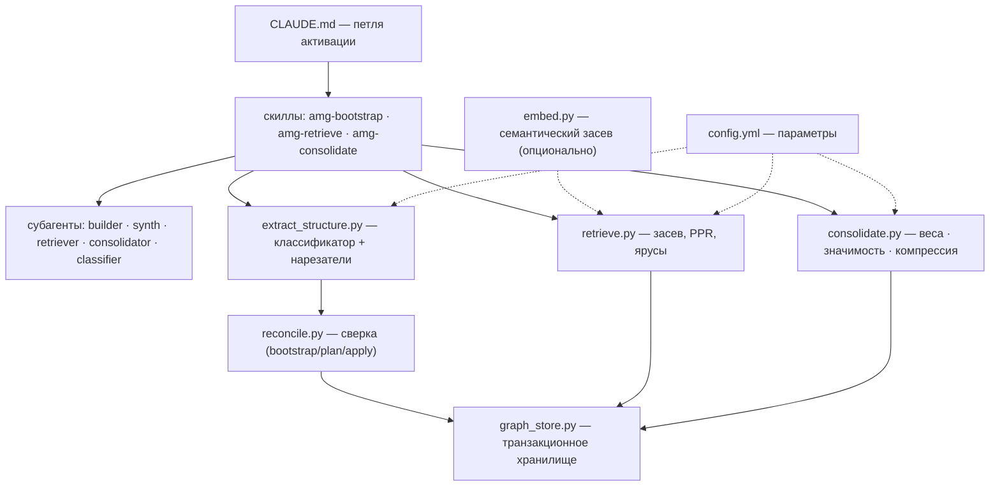
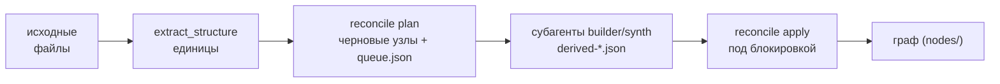
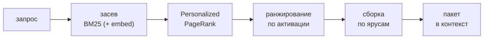
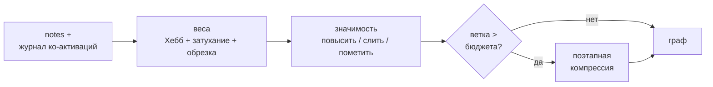

# 01 — Общая картина

Документ даёт обзор системы целиком: из каких модулей она состоит, как они взаимодействуют и какие данные между ними текут. Детали каждого модуля вынесены в профильные документы (ссылки — в конце и в [Карта документации](./README.md)). Здесь — уровень «с высоты птичьего полёта».

## Главный принцип: детерминированный слой и слой суждения

AMG строится на разделении работы на два канала, которые нельзя смешивать.

**Структура — механически, без модели.** Скрипты на Python извлекают скелет данных и выполняют всю детерминированную обработку: разбор файлов на единицы (`extract_structure.py`), транзакционное хранение (`graph_store.py`), сверку графа с источником (`reconcile.py`), извлечение через Personalized PageRank (`retrieve.py`), пересчёт весов (`consolidate.py`). Этот слой дёшев, точен, воспроизводим и не требует языковой модели.

**Смысл — языковой моделью.** Субагенты (изолированные экземпляры модели в собственном контексте) выполняют то, что требует понимания: сводки узлов, смысловые рёбра (`documents`, `depends_on`, `contradicts`), оценку значимости, разрешение спорных случаев классификации. Этот слой добавляет семантику поверх детерминированного скелета.

Граница между слоями экономит главный ресурс — токены модели. Дорогая семантическая работа выполняется только над *изменившимися* единицами: каждая единица хешируется по содержимому, и при повторном прогоне неизменное пропускается (фильтр по хешу; см. [Сверка и семантическое обогащение](./05-reconcile.md)). Скелет можно перестроить в любой момент бесплатно, а семантику — только там, где она устарела.

## Карта модулей

Модули сгруппированы по слоям: оркестрация сверху, функциональные модули в середине, транзакционное хранилище и конфигурация в основании. Сплошные стрелки — вызовы и поток построения; пунктир — чтение параметров и опциональное обогащение.



Назначение каждого модуля и его интерфейс командной строки (подробности — в профильных документах):

| Модуль | Файл | Роль | CLI |
|---|---|---|---|
| Хранилище | `graph_store.py` | транзакционное чтение/запись узлов, журнал, блокировка, восстановление | `init` · `recover` · `verify` |
| Извлечение структуры | `extract_structure.py` | классификация типа файла и нарезка на единицы | `<путь>` · `--stats` |
| Сверка | `reconcile.py` | диф графа с источником, очередь на обогащение, применение | `bootstrap` · `plan` · `apply` |
| Захват заметок | `notes.py` | безопасная запись авторских узлов (решение / вывод / план / открытый вопрос) через транзакцию | `add` |
| Извлечение из графа | `retrieve.py` | засев → PPR → сборка пакета по ярусам | `"<запрос>"` · `--store` |
| Семантический засев | `embed.py` | опциональное обогащение засева эмбеддингами; диагностика | одиночный запуск (диагностика) |
| Консолидация | `consolidate.py` | свёртка весов, значимость, компрессия веток | `weights` · `plan` · `apply` |
| Измерение | `eval_retrieval.py` | recall / precision / hop-recall против лексической базы | `--make-demo` · `--cases` |
| Просмотр | `inspect_graph.py` | список узлов (id, тип, сводка) для разметки и контроля | `--grep` · `--bucket` |

Ключевые модули сопровождаются самотестом (`selftest_*.py`), проверяющим их инварианты: `graph_store`, `reconcile`, `retrieve`, `embed`, `consolidate`, `notes`, `migrate_schema`, а извлечение структуры — через `selftest_extract_overrides` и `selftest_stage2`. У `eval_retrieval.py` и `inspect_graph.py` собственного самотеста нет — они косвенно прогоняются через `selftest_retrieve`/`selftest_consolidate`. Самотесты не входят в рабочий поток и запускаются вручную при изменениях.

Оркестрация описана в разделе [Субагенты и скиллы](./08-agents-skills.md): `CLAUDE.md` задаёт петлю активации (что делать в начале, по ходу и в конце сессии), скиллы — это процедуры (построить, извлечь, консолидировать), субагенты — исполнители семантической работы в изолированном контексте.

## Структура репозитория и оркестрация

Физически система делится на **управляющую плоскость** (переносимый «движок» — код, скиллы, субагенты, конфигурация) и **контентную плоскость** (граф конкретного проекта, создаётся при работе в его `.claude/`). Раскладка управляющей плоскости:

```
config.yml                       параметры по умолчанию
CLAUDE.md                        петля активации (шаблон)
agents/                          субагенты — по файлу на роль
  amg-builder.md                 генерация сводок и смысловых рёбер
  amg-classifier.md              разрешение неоднозначных типов файлов
  amg-consolidator.md            суждение при консолидации памяти
  amg-retriever.md               сборка пакета (только чтение)
  amg-synth.md                   стратегический слой графа + аудит
skills/                          скиллы — процедуры (когда и как)
  amg-bootstrap/
    SKILL.md
    references/consistency-model.md     формальная модель согласованности
    scripts/  extract_structure.py · graph_store.py · reconcile.py · notes.py · selftest_*.py
  amg-retrieve/
    SKILL.md
    scripts/  retrieve.py · embed.py · eval_retrieval.py · inspect_graph.py · selftest_*.py
  amg-consolidate/
    SKILL.md
    scripts/  consolidate.py · selftest_*.py
docs/                            документация (ru / en)
```

Контентная плоскость (граф проекта) создаётся в `.claude/amg/` и описана в разделах [Модель данных](./02-data-model.md) и [Хранилище и транзакции](./03-storage.md): каталоги `nodes/`, `journal/`, `work/`, `cache/`, `archive/`, файлы `LOCK`, `log.md` и локальный `config.yml`. При инициализации создаются только `nodes/<бакет>/` и `journal/`; `work/`, `cache/`, `archive/`, `log.md` и `LOCK` появляются по мере необходимости.

**Скиллы — это процедуры, субагенты — исполнители смысловой работы.** Скилл (файл `SKILL.md`) описывает, *когда* и *как* выполнить операцию: запускает детерминированные скрипты и делегирует понимание субагентам. Субагент (файл в `agents/`) — изолированный экземпляр модели со своим набором инструментов и своей моделью, работающий в отдельном контексте. Что какой скилл запускает:

| Скилл | Запускает скрипты | Вызывает субагентов |
|---|---|---|
| `amg-bootstrap` | `graph_store.py`, `extract_structure.py`, `reconcile.py` | `amg-classifier`, `amg-builder`, `amg-synth` |
| `amg-retrieve` | `retrieve.py`, `embed.py`, `eval_retrieval.py` | `amg-retriever` |
| `amg-consolidate` | `consolidate.py` | `amg-consolidator` |

Роли субагентов (полные промпты и инструкции — в разделе [Субагенты и скиллы](./08-agents-skills.md)):

| Субагент | Модель | Инструменты | Роль |
|---|---|---|---|
| `amg-classifier` | haiku | Read, Grep, Glob | присваивает тип файлам, которые детерминированный классификатор пометил неоднозначными |
| `amg-builder` | sonnet | Read, Grep, Glob, Bash | по пакету единиц из очереди пишет сводку и смысловые рёбра → `derived-*.json` |
| `amg-synth` | opus | Read, Grep, Glob, Bash | строит верхний уровень (хабы, межслойные рёбра, взвешенное мультичленство) и отчёт о пробелах |
| `amg-retriever` | haiku | Read, Grep, Glob, Bash | собирает пакет (только чтение), возвращает путь и краткую сводку |
| `amg-consolidator` | opus | Read, Grep, Glob, Bash | решает, что повысить, слить, подытожить, сгруппировать под под-хаб, укоротить или убрать → actions JSON |

## Потоки данных

Система живёт в трёх процессах, каждый со своим потоком. Они независимы и запускаются в разные моменты.

**Извлечение структуры — построение и обновление графа** (запускается на старте и при изменении источников). Источники читаются строго на чтение; граф меняет только последовательный `apply` под блокировкой.



Детерминированная часть (`extract_structure` → `reconcile plan`) создаёт скелет узлов и кладёт единицы в очередь `queue.json`; семантическая часть (субагенты) читает очередь и пишет результат в отдельные файлы `derived-*.json`; затем `reconcile apply` вносит их в граф. Повторный прогон сверяет, а не дублирует (фильтр по хешу). Подробности — [Извлечение структуры](./04-ingest.md) и [Сверка и семантическое обогащение](./05-reconcile.md).

**Извлечение — сборка пакета на запрос** (на каждую задачу). Полностью детерминированно и без блокировок.



Запрос засевается лексически (BM25) и, опционально, семантически (`embed.py`); активация распространяется по графу (PPR); узлы ранжируются и укладываются по ярусам абстракции под бюджет. Подробности — [Извлечение из графа](./06-retrieval.md).

**Консолидация — обслуживание памяти** (в конце сессии, по запросу или асинхронно). Выполняется отдельным субагентом в чистом контексте.



Журнал совместных активаций сворачивается в веса рёбер; рубрика значимости решает, что повысить, слить или пометить; при превышении бюджета ветки запускается поэтапная компрессия. Подробности — [Консолидация](./07-consolidation.md).

## Управляющая и контентная плоскости

В системе два «языковых слоя». **Управляющая плоскость** — код, скиллы, субагенты, конфигурация и эта документация — ведётся на английском: это переносимый, стандартный для разработки слой. **Контентная плоскость** — то, что хранится в памяти (сводки узлов, тела заметок) — ведётся на рабочем языке проекта, заданном ключом `working_language` в `config.yml` (например, `ru`). Разделение позволяет публиковать и переиспользовать движок независимо от языка хранимого знания.

## Устойчивость к сбоям кратко

Истина — это файловая система; граф — её восстановимая проекция. Записи в граф атомарны (запись во временный файл с последующей атомарной заменой), а журнал упреждающей записи хранит *декларативное целевое состояние*, поэтому повтор восстановления идемпотентен. Единственная блокировка на запись сериализует записи, а чтения идут без блокировок и всегда видят целостный файл. Параллельные субагенты пишут в *раздельные* файлы `derived-*.json`, а вносит их в граф только последовательный `apply` под блокировкой — гонок нет по построению. Полное изложение и формальная модель — [Хранилище и транзакции](./03-storage.md) и `consistency-model.md`.

## Дальше

- [Карта документации](./README.md) — оглавление архитектуры и возврат к началу.
- [02 — Модель данных](./02-data-model.md) — формат узла, типы рёбер, бакеты, каталоги.
- [03 — Хранилище и транзакции](./03-storage.md) — транзакции, журнал, восстановление.
- [04 — Извлечение структуры](./04-ingest.md) — классификатор и нарезатели, включая PDF/DOCX/XLSX.
- [05 — Сверка и семантическое обогащение](./05-reconcile.md) — очередь, `mirror`/`absorb`, идемпотентность.
- [06 — Извлечение из графа](./06-retrieval.md) — засев, эмбеддинги, PPR, ярусы.
- [07 — Консолидация](./07-consolidation.md) — веса, значимость, компрессия.
- [08 — Субагенты и скиллы](./08-agents-skills.md) — субагенты, скиллы, петля активации.
- [09 — Справочник конфигурации](./09-config.md) — полный справочник параметров.
- [10 — Измерение и инструменты](./10-eval-tools.md) — метрики и инструменты.
- [11 — Дорожная карта](./11-roadmap.md) — что ещё не реализовано.
