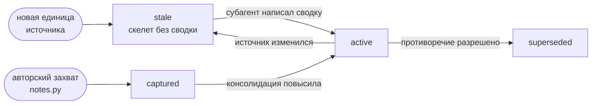
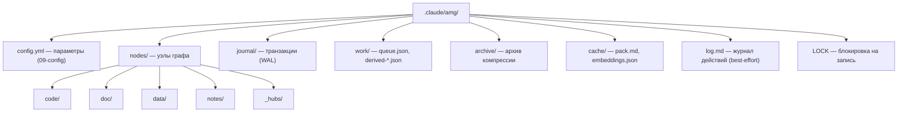

# 02 — Модель данных

Документ описывает, как именно знание представлено на диске: из чего состоит узел, как устроены его поля, идентификаторы, рёбра и членство в иерархии, и как файлы разложены по каталогам. Всё перечисленное — формат файла узла, имена полей, значения по умолчанию — взято непосредственно из кода (`graph_store.py`, `reconcile.py`, `extract_structure.py`). Теоретическое обоснование модели (почему граф, почему типизированные рёбра, что такое узел-энграмма) — в [теории](../THEORY.md), разделы 3–4.

## Узел как файл

Каждый узел графа — это один файл `.md`, состоящий из двух частей: **frontmatter** (метаданные в формате YAML, обрамлённые строками `---`) и **тела** (произвольный текст после второго `---`). Формат фиксирован регулярным выражением `^---\n(.*?)\n---\n?(.*)$`: первая группа — YAML-метаданные, вторая — тело.

Сериализация (`serialize_node`) выводит метаданные через `yaml.safe_dump` с `sort_keys=False` (порядок ключей сохраняется как в словаре) и `allow_unicode=True` (кириллица пишется как есть, без экранирования), затем тело:

```
---
id: code:src/billing.py::charge_card
type: function
summary: Списывает оплату с карты и фиксирует результат транзакции.
...
---
<тело узла, обычно пустое>
```

Разбор (`parse_node`) возвращает словарь метаданных, добавляя в него тело под ключом `_body`. Поля с префиксом подчёркивания (`_body`, `_path`) — **служебные, существуют только в памяти** и не записываются на диск: перед сериализацией они удаляются. `_path` — относительный путь файла узла (проставляется при загрузке `load_nodes`), `_body` — отделённое тело.

**Тело узла, как правило, пустое.** Содержимое узла представлено полем `summary` (сводкой) и указателем `source_path` на источник; для кода тело не заполняется принципиально — функция хранится указателем `путь:строка`, а не дословной копией (см. [теорию](../THEORY.md), раздел 12). Непустое тело имеют в основном синтезированные узлы-хабы, где оно содержит обзорный текст.

## Поля frontmatter

Полный набор полей узла. Столбец «кто проставляет» различает детерминированный слой (`reconcile.py`) и слой суждения (субагент); подробности процесса — в разделе [Сверка и семантическое обогащение](./05-reconcile.md).

| Поле | Тип | Назначение | Кто проставляет |
|---|---|---|---|
| `id` | строка | стабильный идентификатор вида `категория:путь::квалификатор` (см. ниже) | извлечение |
| `type` | строка | форма узла; канонический набор — раздел «Типы узлов» ниже | извлечение / синтез / автор |
| `source_path` | строка | относительный путь к файлу-источнику | извлечение |
| `qualname` | строка | квалификатор единицы внутри файла (имя функции/класса, слаг раздела, `p{i}`, имя листа; пустая строка у файловых и модульных узлов) | извлечение |
| `lineno` | число | номер строки начала единицы в источнике; основа указателя `путь:строка` в выдаче; тихо обновляется при сдвиге единицы без смены содержимого | извлечение |
| `source_kind` | строка | класс узла: `derived_from_file` / `synthesized` / `authored` | `reconcile` / субагент |
| `policy` | строка | политика обработки: `mirror` / `absorb` / `authored` | конфиг (на уровне папки) |
| `source_hash` | строка \| null | хеш содержимого исходной единицы; основа фильтра по хешу (повторно не обогащать неизменное); `null` у синтезированных узлов | `reconcile` |
| `derived_from_hash` | строка \| null | хеш, на котором построена текущая сводка; становится равен `source_hash` после обогащения, `null` — пока сводка не написана | `reconcile` / субагент |
| `part_of` | список `{topic, w}` | членство в иерархии-остове; первичный дом + (после консолидации) доли в других темах | `reconcile` + консолидация |
| `edges` | список `{rel, to, w, coact, …}` | типизированные взвешенные связи к другим узлам | `reconcile` (структурные) + субагент (смысловые) |
| `lang` | строка | рабочий язык содержимого (значение `working_language` из конфига, например `ru`); язык источника в схему намеренно не входит — для зеркал он восстановим из `source_path`, при будущей нужде это отдельное поле `source_lang` | конфиг |
| `status` | строка | состояние узла: `active` / `stale` / `superseded` | `reconcile` / консолидация |
| `summary` | строка | сводка узла в 1–3 фразы на языке `lang`; пустая до обогащения | субагент |
| `updated` | строка | отметка времени последнего изменения в формате `ГГГГ-ММ-ДДTчч:мм:сс` | `reconcile` / `notes` |
| `created` | строка | отметка времени создания узла (тот же формат); ведётся у **авторских** узлов (захват `notes.py`): сохраняется при повторном захвате, тогда как `updated` сдвигается. У проекций-зеркал отдельно не ведётся | `notes` |
| `tags` | список строк | свободные метки **авторской** заметки; входят в индексируемый BM25-текст узла, поэтому заметка находится и по тегу | `notes` (автор) |
| `branch_budget` | число | необязательное, осмысленно у хабов: персональный бюджет ветки **в узлах** вместо `compaction.default_branch_budget_nodes` (бюджет в токенах персонально не задаётся); читает `consolidate.py plan` | автор (вручную; кодом пока не пишется) |

Пользователь, читающий этот список, видит весь состав узла: чего-либо сверх перечисленного во frontmatter нет; запланированные расширения схемы — в следующем подразделе.

### Запланированные поля (не реализованы)

Слой provenance/verification (Этап 13 дорожной карты; замысел — её разделы 4.3 и 4.5) добавит узлам поля доверия. До реализации этих полей нет ни в одном узле, и ни один потребитель их не читает:

- `confidence` — степень уверенности в факте, число 0..1;
- `provenance` — происхождение факта: `kind` (`code` / `doc` / `chat` / `user` / `model_inference`), `source_path`, `source_hash`, `commit`, `line_start` / `line_end`;
- `verification` — состояние проверки: `status` (`verified` / `stale` / `unverified` / `contradicted`), `method` (`grep` / `ast` / `test` / `user` / `doc` / `none`), `last_verified_at`, `last_verified_commit`.

## Идентификаторы

Идентификатор узла (`id`) строится детерминированно из категории, относительного пути и (для под-файловых единиц) квалификатора — имени функции/класса, слага заголовка, номера страницы и т. п. Стабильность идентификатора важна: по нему сверяется существование узла при повторном прогоне, поэтому он не должен «плыть» при несущественных правках.

Формы идентификатора по типам единиц (нарезатели описаны в разделе [Извлечение структуры](./04-ingest.md)):

| Единица | `type` | Форма `id` | Нарезатель |
|---|---|---|---|
| файл целиком (резерв) | `file` | `{категория}:{путь}` | резервный (нет грамматики языка) |
| модуль | `module` | `code:{путь}` | `python` (стандартный `ast`) |
| класс | `class` | `code:{путь}::{квалиф}` | `python` / `treesitter` |
| функция, метод | `function` | `code:{путь}::{квалиф}` | `python` / `treesitter` |
| раздел документа | `section` | `doc:{путь}::{слаг}` | `headings` (markdown) / `docx` |
| абзацный блок | `block` | `doc:{путь}::b{n}` | `paragraphs` (обычный текст) |
| страница | `page` | `doc:{путь}::p{i}` | `pdf` |
| запись | `record` | `data:{путь}::{ключ}` | `json` / `yaml` (ключ обрезается до 48 символов) |
| лист таблицы | `sheet` | `data:{путь}::{имя_листа}` | `xlsx` |

Категория в префиксе (`code` / `doc` / `data`) совпадает с информационным доменом единицы (см. [теорию](../THEORY.md), раздел 11) и определяет бакет хранения (см. ниже).

## Классы узлов и `source_kind`

Поле `source_kind` задаёт происхождение узла и определяет его жизненный цикл при сверке:

- **`derived_from_file`** — узел спроецирован из единицы исходного файла (код, документ, данные). Имеет `source_hash`; обновляется и удаляется по диффу с источником (при политике `mirror`).
- **`synthesized`** — узел создан слоем суждения как обобщение: хаб (узел-концентратор темы), обзор, сводка кластера. Хранится в бакете `_hubs`, имеет `source_hash: null`, `policy: authored`, создаётся сразу в статусе `active`. По диффу источника **не удаляется** (его «источник» — сам граф).
- **`authored`** — авторская заметка: вывод модели по ходу сессии, занесённое решение, фрагмент переписки. По диффу источника не удаляется (см. правило сохранности ниже).

Это разделение — реализация классов узлов из теории (проекция-зеркало против ассимилированного следа; см. [теорию](../THEORY.md), разделы 5 и 12).

## Типы узлов (`type`)

Поле `type` описывает **форму** узла и не несёт происхождения: происхождение задаёт `source_kind` (см. выше). Историческое значение `type: derived` у хабов упразднено — новые узлы его не получают, а старый граф приводит к канону скрипт `migrate_schema.py` (запустить один раз, затем `reconcile.py bootstrap .` — он бесплатно восстановит `lineno`/`qualname` по дрейфу указателя). Канонический набор по классам узлов:

| Класс (`source_kind`) | Типы | Кто создаёт |
|---|---|---|
| `derived_from_file` | `module` / `class` / `function` / `section` / `block` / `page` / `record` / `sheet` / `file` | извлечение (формы id — в таблице выше) |
| `synthesized` | `overview` — верхнеуровневый обзор архитектуры; `hub` — концентратор сквозной темы; `section` — сводка кластера эпизодов от консолидации | `amg-synth` (id вида `hub:{тема}`); действия консолидации `introduce_subhub` и `summarize_episodes` |
| `authored` | `note` — заметка по ходу работы; `decision` — зафиксированное решение; `adr` — architecture decision record; `open_question` — нерешённый вопрос; `plan` — план на будущее | модель или пользователь через безопасный API заметок `notes.py add` (см. [Субагенты и скиллы](./08-agents-skills.md)) |

**Tree-sitter-единицы канонизируются при извлечении:** типы узлов грамматики отображаются картой `_TS_DEF` в `extract_structure.py` в канонические (`function_definition`, `method_declaration`, `function_item`, … → `function`; `class_declaration`, `struct_specifier`, `impl_item`, `interface_declaration`, … → `class`), поэтому не-Python код получает те же ярусы пакета и указатели `путь:строка`, что Python. Грамматические значения `type` могут встретиться только в графе, построенном до канона; их приводит миграция (см. выше) либо ближайшая сверка (тип узла-зеркала принадлежит извлечению и сводится по дрейфу указателя).

Типы — рабочий вход потребителей: извлечение раскладывает узлы по ярусам пакета (`hub` и `overview` — стратегический ярус; см. [Извлечение из графа](./06-retrieval.md)), а консолидация строит ветки от узлов `hub`/`overview`, относит `decision`/`adr` к защищаемым типам (`protect_types`) и считает `section`/`note` эпизодическими кандидатами (см. [Консолидация](./07-consolidation.md)).

## Политики обработки

Поле `policy` определяет, как узел соотносится с источником (полное обоснование — см. [теорию](../THEORY.md), раздел 12; механика диффа — [Сверка и семантическое обогащение](./05-reconcile.md)):

- **`mirror`** — живая проекция: изменился источник → узел обновляется, удалён → узел вычищается;
- **`absorb`** — впитан один раз: удаление источника узел не затрагивает;
- **`authored`** — авторское содержимое без внешнего источника (заметки, синтезированные узлы).

**Правило сохранности.** По диффу источника удаляются **только** узлы с `source_kind = derived_from_file` и `policy = mirror`. Узлы `authored` и впитанные (`absorb`) намеренно остаются нетронутыми — потеря источника не должна означать потерю знания.

## Статусы и жизненный цикл узла

Поле `status` отражает зрелость узла:



- **`stale`** — узел создан или его источник изменился, но семантическое обогащение (сводка, смысловые рёбра) ещё не выполнено. При создании детерминированный слой ставит `stale` и кладёт единицу в очередь; при изменении источника **прежние сводка и рёбра сохраняются**, а статус снова становится `stale` до повторного обогащения — так знание не теряется в промежутке.
- **`active`** — сводка актуальна; `derived_from_hash` равен `source_hash`.
- **`superseded`** — узел вытеснен другим (разрешённое противоречие, связка `contradicts` / `supersedes`); остаётся в графе для истории, но в выдаче **понижается** статусным приоритетом (`status_prior.superseded` = 0.2 — множитель на итоговой активации; `stale` при этом не штрафуется, а помечается в пакете, см. [Извлечение из графа](./06-retrieval.md)).
- **`captured`** — авторская заметка, только что зафиксированная по ходу сессии через `notes.py` (статус по умолчанию при захвате): содержимое уже полное (сводка/тело есть), но узел ещё не отобран консолидацией. В выдаче **не** понижается — `captured` отсутствует в `status_prior`, поэтому множитель равен 1.0 по умолчанию (свежая заметка находится сразу); консолидация может повысить её до `active` действием `promote`. Это «быстрая эпизодическая запись» CLS-модели (см. [теорию](../THEORY.md), разделы 2 и 13), параллельный путь входа рядом с `stale` для проекций-зеркал.

## Рёбра

Ребро — элемент списка `edges` во frontmatter исходного узла. Поля ребра:

| Поле | Назначение |
|---|---|
| `rel` | тип отношения (`calls`, `documents`, `depends_on`, …; полный список и приоритеты проводимости — в [теории](../THEORY.md), раздел 4, и [Справочник конфигурации](./09-config.md)) |
| `to` | идентификатор целевого узла |
| `w` | сила связи, число в диапазоне (0, 1] |
| `coact` | счётчик совместных активаций (вход для Хеббовского обновления; стартует с 0) |
| `last_used` | дата последнего значимого потока через ребро (проставляется консолидацией; опционально) |
| `origin` | происхождение ребра: `structural` (детерминированное извлечение) / `semantic` (обогащение) / `synthesized` (рёбра создаваемых хабов) / `consolidation` (действия консолидации) / `authored` (рёбра авторских заметок из `notes.py`); определяет, какие рёбра пересобираются при изменении источника — структурные заменяются свежим извлечением, остальные сохраняются |

Рёбра возникают из двух источников:

- **Структурные — детерминированно** (`_structural_edges` в `reconcile.py`; помечаются `origin: structural`). Из разобранного кода извлекаются: `imports` с весом `w = 0.6` — для **внутрипроектного** модуля цель резолвится в id его узла (`code:{путь}`) по карте «точечное имя → путь», а импорт stdlib/сторонней библиотеки остаётся точечным именем (`code:{модуль}`); `calls` → `code:{путь}::{вызываемое}` с весом `w = 0.7`. Это начальные веса самих рёбер; их не следует путать с приоритетом проводимости по типу ребра β, который применяется отдельно при извлечении и задаётся в `relation_priors` (например, β для `calls` равен `0.8`; см. [Справочник конфигурации](./09-config.md)). Цель `calls` ищется как функция в том же файле по принципу «насколько возможно»; **рёбра, чья цель-узел не существует, при извлечении просто отбрасываются**, поэтому межфайловые вызовы и внешние импорты игнорируются до разрешения. Дубликаты `(rel, to)` схлопываются.
- **Смысловые — слоем суждения.** Субагент при обогащении добавляет рёбра, требующие понимания: `documents` (док описывает код), `depends_on`, `contradicts`, форвард-связи. Они вносятся при `apply` с объединением по ключу `(rel, to)` (`_merge_edges`).

Рёбра `part_of` (членство в иерархии) хранятся **отдельным** полем, а не в `edges`, — см. следующий раздел.

## Членство в иерархии (`part_of`)

`part_of` — список `{topic, w}`, задающий, в какие темы/хабы входит узел и с какой долей. Первичное членство ставится детерминированно (`_part_of_for`): тема — это родительский каталог `source_path` (или сама категория, если файл в корне), вес `1.0`. Это «дом» узла в остове-дереве (spanning tree), нужный для просмотра и пространства имён.

Взвешенное **множественное** членство (узел на 0.7 относится к одной теме и на 0.3 к другой) проставляет слой суждения: при синтезе его добавляет `amg-synth` (мультичленство по сквозным темам), а консолидация нормализует к симплексу (сумма долей ≤ 1, ключ `part_of_renormalize`) и при действии `introduce_subhub` **заменяет** одну тему-родителя на промежуточный под-хаб, сохраняя прочие членства (см. [Консолидация](./07-consolidation.md)). То есть `part_of` проходит путь «детерминированно по пути → уточнение `amg-synth` → нормализация и под-хаб консолидацией». Именно множественное членство с весами позволяет полииерархию без выбора единственного родителя (механика — см. [теорию](../THEORY.md), раздел 6.4).

## Бакеты: физические каталоги узлов

Узлы физически разложены по пяти каталогам внутри `nodes/`. Бакет определяется детерминированно функцией `_dir_for` по категории единицы; синтезированные узлы всегда идут в `_hubs`:

| Бакет | Что лежит | Правило маршрутизации |
|---|---|---|
| `nodes/code/` | узлы кода | `category == code` |
| `nodes/doc/` | узлы документов (markdown, текст, PDF, DOCX) | `category == doc` |
| `nodes/data/` | узлы данных (JSON, YAML, XLSX) | `category == data` |
| `nodes/notes/` | авторские заметки и всё, что не относится к трём доменам выше | значение по умолчанию в `_dir_for` |
| `nodes/_hubs/` | синтезированные узлы: хабы, обзоры, сводки кластеров | `source_kind == synthesized` |

Каталоги задают **только** остов для просмотра (физический «дом» узла); все ассоциативные связи живут в рёбрах frontmatter, а не в структуре папок (см. [теорию](../THEORY.md), раздел 3).

## Путь файла узла

Путь файла строится из идентификатора функцией `node_relpath`:

```
nodes/{бакет}/{слаг}-{хеш8}.md
```

где **слаг** — «хвост» идентификатора после первого `:`, в котором все символы, кроме букв/цифр/`.`/`-`, заменены на `_`, обрезанный до 48 символов (или `node`, если пусто), а **хеш8** — первые 8 шестнадцатеричных символов `sha256` от полного идентификатора. Слаг даёт человекочитаемое имя файла, а хеш гарантирует отсутствие коллизий при совпадении слагов разных идентификаторов. Пример: `code:src/billing.py::charge_card` → `nodes/code/src_billing.py_charge_card-1a2b3c4d.md` (регулярное выражение `[^\w.-]+` схлопывает каждую цепочку «не-словесных» символов в один подчерк, поэтому `::` даёт один `_`, а не два).

## Раскладка каталогов

Корень хранилища — `.claude/amg/`. При инициализации (`graph_store.init`) создаются только `journal/` и `nodes/<бакет>/` (пять бакетов: `code/ doc/ data/ notes/ _hubs/`). Всё остальное — `work/`, `archive/`, `cache/` и файл `log.md` — рождается по необходимости, при первой записи в него.



| Путь | Содержимое | Когда создаётся |
|---|---|---|
| `config.yml` | конфигурация (см. [Справочник конфигурации](./09-config.md)) | при установке |
| `nodes/<бакет>/*.md` | узлы графа | `init` (каталоги бакетов) |
| `journal/<txid>/` | записи транзакций (журнал упреждающей записи) | `init` (каталог), записи — по ходу |
| `work/queue.json` | очередь единиц на семантическое обогащение | по необходимости |
| `work/derived-*.json` | результаты субагентов до применения | по необходимости |
| `archive/` | оригиналы, вытесненные компрессией (обратимость) | по необходимости |
| `cache/` | последний собранный пакет (`pack.md`), кэш эмбеддингов (`embeddings.json`) | по необходимости (извлечение) |
| `log.md` | человекочитаемый журнал действий консолидации (best-effort, вне транзакции; см. [Консолидация](./07-consolidation.md)) | по необходимости (консолидация) |
| `LOCK` | файл единственной блокировки на запись | при первой записи |

Механика журнала, блокировки и атомарных записей описана в разделе [Хранилище и транзакции](./03-storage.md); очереди и файлов `derived-*.json` — в разделе [Сверка и семантическое обогащение](./05-reconcile.md).

## Дальше

- [Карта документации](./README.md) — оглавление архитектуры и возврат к началу.
- [03 — Хранилище и транзакции](./03-storage.md) — атомарные записи, журнал, блокировка на запись, восстановление и проверка.
- [04 — Извлечение структуры](./04-ingest.md) — классификатор типов и нарезатели, включая PDF/DOCX/XLSX.
- [05 — Сверка и семантическое обогащение](./05-reconcile.md) — режимы `bootstrap`/`plan`/`apply`, очередь, политики `mirror`/`absorb`, идемпотентность.
- [07 — Консолидация](./07-consolidation.md) — свёртка весов, множественное членство, компрессия.
- [09 — Справочник конфигурации](./09-config.md) — параметры и значения по умолчанию.
