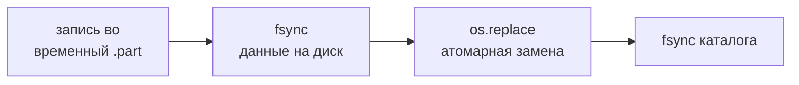
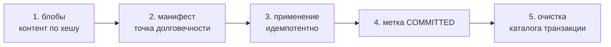
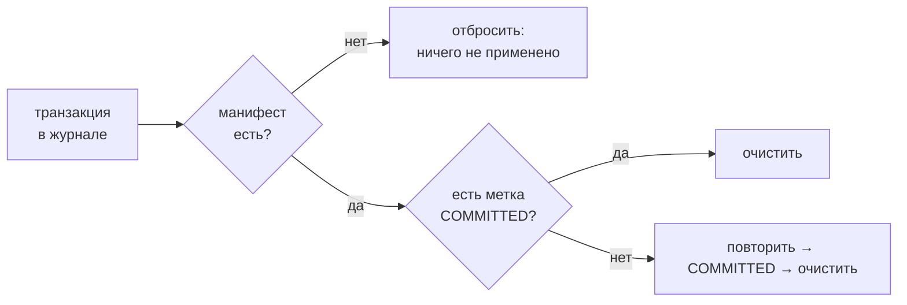
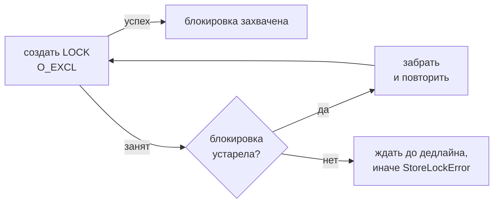

# 03 — Хранилище и транзакции

Слой хранилища (`graph_store.py`) — это фундамент, гарантирующий согласованность данных при сбоях. Он намеренно ничего не знает об узлах, рёбрах и языковых моделях: это универсальное транзакционное хранилище над текстовыми файлами в корне AMG (`.claude/amg/`). Вышестоящие слои (сверка, субагенты) выражают, *что* должно измениться; этот слой гарантирует, что изменение применяется по принципу «всё или ничего» и что хранилище всегда можно привести в согласованное состояние после сбоя. Это конкретизация принципа «истина — файловая система, граф — её восстановимая проекция» (см. [Общая картина](./01-overview.md)). Полное формальное обоснование вынесено в документ `consistency-model.md` (в каталоге скилла `amg-bootstrap/references/`); здесь — устройство реализации.

## Расположение и вызовы

Файл `graph_store.py` лежит в `skills/amg-bootstrap/scripts/`. Это нижний слой: его импортирует `reconcile.py` (`import graph_store`), и через него идут **все** записи графа из сверки и консолидации. Сам он не вызывает других модулей AMG и не обращается к языковой модели. Прямо запускается скиллом `amg-bootstrap` (команды `init` / `recover` / `verify`), косвенно — любой операцией, которая пишет в граф.

## Четыре гарантии

Согласованность обеспечивается сочетанием четырёх свойств; каждое подробно разобрано ниже.

1. **Атомарная запись одного файла.** Файл пишется во временный файл рядом, сбрасывается на диск (`fsync`) и атомарно переименовывается поверх цели (`os.replace`). Читатель никогда не видит наполовину записанный файл: он видит либо старые байты, либо новые.
2. **Журнал упреждающей записи с декларативным повтором** (не откатом). Логическое изменение обычно затрагивает несколько файлов. Мы фиксируем *желаемое конечное состояние* каждого затронутого файла как контентный блоб, делаем намерение долговечным, затем применяем. Поскольку журнал хранит целевое содержимое (адресуемое хешем), повторное применение любое число раз сходится к тому же состоянию.
3. **Восстановление.** При запуске журнал сканируется: транзакция, чьё намерение не стало долговечным, отбрасывается; долговечная, но не отмеченная как зафиксированная — повторно применяется (идемпотентно) и фиксируется; зафиксированная, но не убранная — просто очищается.
4. **Единственная блокировка на запись.** Записи берут эксклюзивную блокировку (файл-блокировку с флагом `O_EXCL` и обнаружением устаревания). Чтения идут без блокировок и безопасны, потому что каждая запись файла атомарна.

## Атомарная запись одного файла

Базовые примитивы не зависят от модели данных и работают с байтами.

`atomic_write_bytes(path, data)` создаёт родительский каталог при необходимости, пишет данные во временный файл с префиксом `.tmp-` и суффиксом `.part` в *том же* каталоге, что и цель, вызывает `flush` и `os.fsync` (данные физически на диске), затем `os.replace(tmp, path)` — атомарную замену (атомарна на POSIX и в пределах одного тома Windows), и в конце сбрасывает запись каталога (`_fsync_dir`), чтобы само переименование пережило сбой питания. Временный файл удаляется в блоке `finally` при любой ошибке. `atomic_write_text` — обёртка, кодирующая строку в UTF-8.

`atomic_delete(path)` удаляет файл, если он есть, и сбрасывает каталог; отсутствие файла — не ошибка (идемпотентность). `_fsync_dir` намеренно «насколько возможно»: на части платформ (например, Windows) сброс каталога не поддерживается, и неудача молча игнорируется.

Контент адресуется хешем: `sha256_bytes` / `sha256_text` дают шестнадцатеричный SHA-256, который используется и как имя блоба, и как защита идемпотентности (см. ниже).

## Журнал упреждающей записи с декларативным повтором

Ключевое решение — **декларативный повтор вместо отката**. Традиционный журнал хранит, как *отменить* частичное изменение; здесь журнал хранит *целевое содержимое* каждого файла, поэтому восстановление — это «доиграть до цели», а не «откатить». Такой повтор по своей природе идемпотентен: применять его можно сколько угодно раз, результат один и тот же, отдельный журнал отмены не нужен.

Каждая запись стадируется как **блоб** — контентно-адресуемый объект: файл в каталоге транзакции `blobs/{sha}`, где `sha` — SHA-256 содержимого. Одинаковое содержимое даёт один блоб (повторная запись блоба пропускается). Намерение целиком описывается **манифестом** (`manifest.json`) — списком операций `ops`, каждая из которых либо `{"op": "write", "path": …, "sha": …}`, либо `{"op": "delete", "path": …}`.

## Транзакция и её фиксация

Объект `Transaction` собирает набор записей и удалений и применяет их атомарно. Методы: `write(relpath, content)` (строка кодируется в UTF-8; запись отменяет ранее запланированное удаление того же пути), `delete(relpath)` (удаление отменяет ранее запланированную запись), `is_empty()`, `node_paths()` (отдаёт `(written, deleted)` — относительные пути под `nodes/`, которые трогает транзакция). По `node_paths()` писатели после фиксации обновляют производный read-индекс `cache/index.sqlite` (см. [Извлечение из графа](./06-retrieval.md)); сам store об индексе ничего не знает — это просто фильтр путей, индексная логика живёт в слое извлечения. Фиксация `commit()` выполняет пять шагов:

1. Сгенерировать `txid` — отметку времени `ГГГГММДДTччммсс` плюс 8 символов случайного UUID — и создать каталог транзакции с подкаталогом `blobs/`.
2. Стадировать каждую запись как блоб, собрать список `ops`.
3. **Записать манифест.** Это *точка долговечности*: пока переименование `manifest.json` не состоялось, в живом хранилище не изменено ничего, поэтому сбой здесь — чистый no-op.
4. Применить декларативное конечное состояние (`_apply_manifest`, идемпотентно).
5. Записать метку-файл `COMMITTED`, затем удалить каталог транзакции.

Пустая транзакция возвращает `None` и ничего не делает. Применение (`_apply_manifest`) для каждой операции либо пишет блоб в цель **с защитой идемпотентности** (если целевой файл уже содержит нужный `sha` — применение пропускается), либо атомарно удаляет файл. Неизвестная операция вызывает ошибку. Есть тестовый хук `_fault_after_apply_ops` — он внедряет искусственный сбой после N применённых операций (имитация падения процесса); в рабочем потоке не используется.

Свойство «всё или ничего» следует из того, что **каждая точка прерывания сходится к согласованному состоянию**:

| Момент сбоя | Состояние живого хранилища | Действие восстановления |
|---|---|---|
| до записи манифеста | не тронуто (записаны лишь блобы во временном каталоге) | отбросить транзакцию (манифеста нет) |
| манифест записан, применение не начато или частично | часть целевых файлов обновлена | повторить к цели (идемпотентно), пометить `COMMITTED`, очистить |
| применение завершено, метки `COMMITTED` нет | целевое состояние достигнуто | повторить (по хеш-защите это no-op), пометить `COMMITTED`, очистить |
| `COMMITTED` записан, очистка не завершена | целевое состояние достигнуто | очистить каталог транзакции |

## Восстановление

`recover()` приводит хранилище в согласованное состояние и **безопасен для повторного запуска в любой момент** — именно он превращает сбой в незначительное событие. Он перебирает каталоги журнала в отсортированном порядке и для каждого применяет одно из трёх решений:

Возвращается список обработанных транзакций с пометками `:discarded`, `:cleaned` или `:redone`. Если каталога журнала нет, список пуст.

**Когда `recover()` запускается и что закрывает.** Его вызывают команды `recover` / `verify --repair` и каждая операция записи перед началом; в автоматическом режиме его на старте сессии гонит хук `SessionStart` (ручной аналог — `/amg repair`). Этим закрывается и худший случай — **жёсткое завершение процесса** (закрыт терминал, `kill`, отказ питания), при котором хук `SessionEnd` отработать не успел: незавершённая запись прошлого прогона остаётся в журнале незакоммиченной и доводится до цели (или отбрасывается) на ближайшем `recover`, а зависшая блокировка снимается. Авторские заметки (`notes.py`), зафиксированные по ходу убитой сессии, при этом не страдают — каждая записана отдельной завершённой транзакцией (правило сохранности — [Модель данных](./02-data-model.md)). Пропущенное хуком обслуживание конца сессии (свёртка весов, обновление дайджеста) не теряется, а лишь откладывается до следующего старта или ручного запуска.

## Единственная блокировка на запись

Записи сериализуются эксклюзивной блокировкой; цель — чтобы граф изменял ровно один процесс одновременно. Контекстный менеджер `lock(stale_seconds=3600, wait_seconds=0.0)` пытается создать файл `LOCK` с флагами `O_CREAT | O_EXCL` (атомарное «создать, только если не существует») и записывает в него `pid`, `host` (имя машины) и `ts` (время). Логика получения:

По умолчанию `wait_seconds = 0.0` — блокировка **не ждёт** и быстро падает с `StoreLockError`, если занята живым процессом; сообщение об ошибке называет владельца (`pid`, `host`) и подсказывает удалить `LOCK`, если процесс мёртв. Блокировка освобождается (файл удаляется) в блоке `finally`.

Устаревание (`_lock_is_stale`) определяется по правилам, и порядок важен:

- **нечитаемая или повреждённая** файл-блокировка считается устаревшей (её можно забрать);
- **собственная блокировка** (совпадают `pid` и `host` текущего процесса) **никогда не считается устаревшей** — иначе операция вроде `verify --repair`, идущая под блокировкой, пометила бы блокировку, которую сама же и взяла;
- блокировка **мёртвого процесса** устарела: живость проверяется `_pid_alive` через `os.kill(pid, 0)` (зонд POSIX); `ProcessLookupError` означает «мёртв», `PermissionError` — «жив, но чужой», а на платформах без такой проверки (например, Windows) процесс консервативно считается живым;
- блокировка **старше порога** `stale_seconds` устарела.

Чтения хранилища блокировку не берут и безопасны без неё, поскольку каждая запись файла атомарна.

## Проверка целостности

`verify(repair=False, referenced_paths=None)` проверяет инварианты хранилища и возвращает словарь проблем с тремя ключами:

| Ключ | Что проверяет | Поведение при `repair=True` |
|---|---|---|
| `pending_transactions` | незавершённые транзакции в журнале | вызывает `recover()`; добавляет ключ `pending_transactions_resolved` |
| `stale_lock` | устаревшая блокировка (порог `stale_seconds` равен `0` при `repair`, иначе `3600`) | удаляет файл-блокировку |
| `dangling_references` | переданные `referenced_paths`, которых нет на диске | не чинит (это уровень сверки, см. [Сверка и семантическое обогащение](./05-reconcile.md)) |

Итоговый флаг `clean` истинен, если пусты все списки проблем (ключи с суффиксом `_resolved` при этом не учитываются). При `repair=True` порог устаревания блокировки опускается до нуля: ремонт под собственной блокировкой безопасен благодаря правилу «собственная блокировка не устаревает».

## Защита пути

`abspath(relpath)` переводит относительный путь в абсолютный и **проверяет, что он не выходит за корень хранилища**: если разрешённый путь не лежит внутри корня, выбрасывается `ValueError`. Это не косметика, а защита: ошибочный или враждебный относительный путь не сможет записать файл за пределами `.claude/amg/`.

## Модель параллелизма

Модель проста и устойчива: **единственный пишущий процесс под блокировкой плюс чтения без блокировок**. Параллельные исполнители (субагенты) при построении графа пишут в *раздельные* файлы и не трогают живой граф; внесение в граф делает только последовательное применение под блокировкой. Поэтому гонок нет по построению — без сложных блокировок на уровне отдельных узлов. Как это устроено в слое сверки — см. [Сверка и семантическое обогащение](./05-reconcile.md).

## Журнал действий `log.md` — транзакционный аудит-след

Отдельно от низкоуровневого журнала `journal/` хранилище ведёт человекочитаемый `log.md` — аудит-след выполненных действий. Метод `GraphStore.append_log(source, msg, txid)` дописывает одну строку вида `## [<время>] <txid> <источник> | <сообщение>` **через транзакцию** (а не обычным дописыванием): весь лог стадируется одним контентно-адресуемым блобом, поэтому повторное проигрывание при восстановлении идемпотентно. Три свойства:

- **дедупликация по `txid`:** если строка с этим `txid` уже есть, запись — no-op, поэтому повтор уже зафиксированной транзакции не задваивает строку;
- **ограниченность ротацией:** как только лог превысил предел строк, старые строки уходят в `archive/log-<время>.md`, а в живом `log.md` остаётся хвост — долгоживущий граф не переписывает неограниченно растущий файл при каждой записи;
- **best-effort:** любая ошибка записи проглатывается — целостность графа держит `journal/`, а не лог, поэтому пропущенная или оборванная строка по-прежнему безвредна.

Пишут лог оба слоя записи: `consolidate.py` (свёртка весов, применённые действия, вердикт eval-предохранителя) и `reconcile.py` (итог `bootstrap`/`apply`, но **только когда дифф реально изменил граф**: при пустом диффе транзакции нет, и строка не добавляется — неизменный прогон остаётся идемпотентным). Источник в строке (`consolidate` / `reconcile`) позволяет `/amg status` выбрать последнюю именно консолидацию (`lifecycle._last_consolidation` фильтрует по нему). Запись идёт под той же блокировкой, что держит вызывающий, и приводит лог к модели «append как часть committed transaction с дедупом по `txid`» (аудит 1.15, реализовано на Этапе 12).

## Интерфейс командной строки

Корень хранилища для всех CLI движка (`graph_store.py`, `reconcile.py`, `consolidate.py`, `notes.py`, `lifecycle.py`) разрешается **единой** цепочкой `resolve_amg_root` (см. ниже). У `graph_store.py` дополнительно есть переменная `AMG_ROOT` — явное переопределение полного пути к хранилищу. Благодаря восходящему поиску конфига даже глобально установленный движок (`~/.claude/skills`) лечит и читает **локальный** граф проекта, если запущен из каталога этого проекта (`.claude`/`CLAUDE.md` здесь — умолчания Claude Code; в иной среде подставляются настроенные имена, например `.agents` / `AGENTS.md`).

`resolve_amg_root` (живёт в `graph_store.py`) разрешает корень без зашитого имени `.claude`: явный `--root <agent_dir>` → переменная `AMG_AGENT_DIR` → поиск `amg/config.yml` вверх от текущего каталога (на каждом уровне проверяются и пресеты каталога агента `<каталог>/.claude/amg/config.yml` и `<каталог>/.agents/amg/config.yml` — так глобально установленный движок находит граф проекта в любой из этих сред) → каталог самого движка, если его `amg/` уже существует → умолчание `.claude/amg`. Эту же функцию используют `retrieve.py`/`inspect_graph.py` для дефолтного `--store`. Подробности применения — [Сверка и семантическое обогащение](./05-reconcile.md).

| Команда | Действие | Блокировка |
|---|---|---|
| `init` | создаёт каркас каталогов (`journal/`, `nodes/<бакет>/`) | — |
| `recover` | проигрывает незавершённые транзакции | под блокировкой |
| `verify [--repair]` | проверяет инварианты; с `--repair` чинит безопасно исправимое | с `--repair` — под блокировкой; без — без блокировки (чтение) |

`verify` завершается кодом `0`, если хранилище чистое, и `1` — если найдены проблемы; это позволяет использовать его в скриптах и хуках.

## Замечания для Windows

Реализация рассчитана и на Windows, где часть POSIX-механизмов работает иначе: сброс каталога (`_fsync_dir`) не поддерживается и выполняется «насколько возможно»; `os.replace` атомарен в пределах одного тома; проверка живости процесса по `pid` недоступна, поэтому процесс консервативно считается живым (блокировка не будет ошибочно «украдена» у живого пишущего процесса). Файлы открываются и пишутся в UTF-8.

## Дальше

- [Карта документации](./README.md) — оглавление архитектуры и возврат к началу.
- [02 — Модель данных](./02-data-model.md) — что именно хранится в этих файлах: формат узла, рёбра, бакеты, каталоги.
- [05 — Сверка и семантическое обогащение](./05-reconcile.md) — кто формирует транзакции и как параллельные исполнители пишут раздельно, а применяются последовательно.
