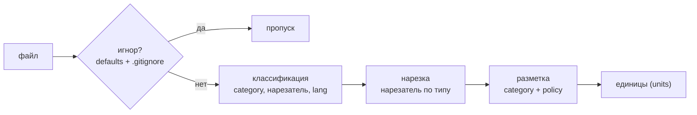
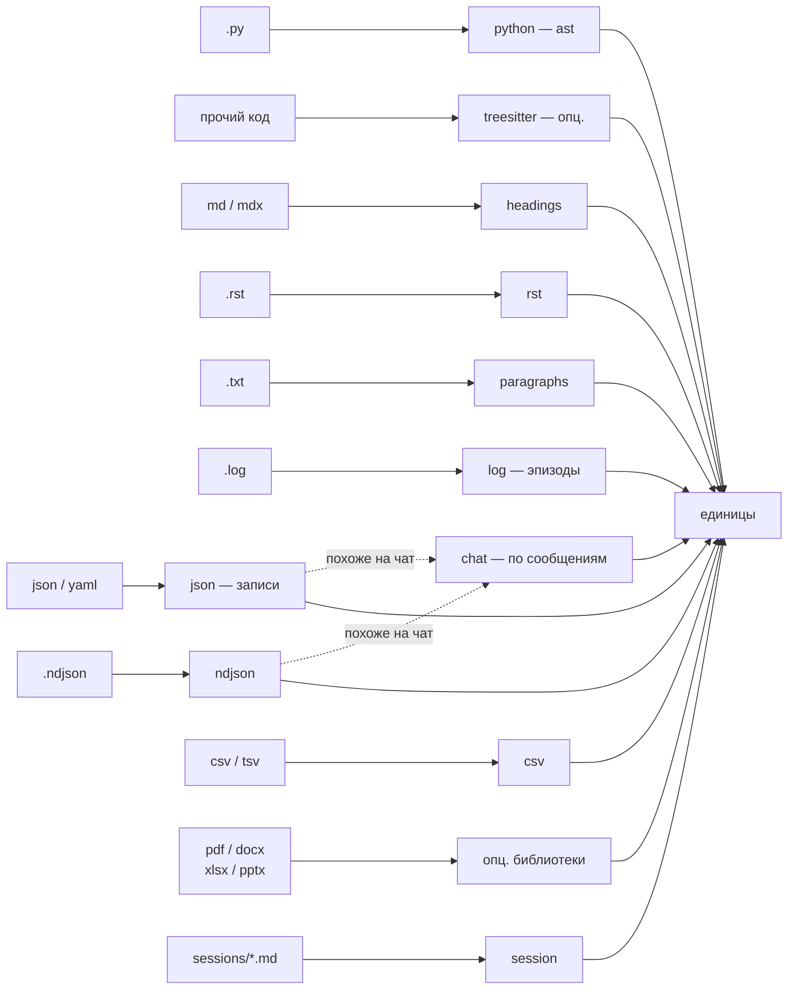

# 04 — Извлечение структуры

Извлечение структуры (`extract_structure.py`) — **единственный зависящий от типа данных** слой системы; движок графа доменно-слеп и одинаково хранит узлы, рёбра и текст независимо от того, откуда пришла единица (обоснование — в [теории](../THEORY.md), раздел 11). Образно это «сенсорная кора»: каждый файл маршрутизируется к нужному **нарезателю** (компоненту, режущему файл на единицы) по его типу, а из результата строится единый ассоциативный граф. Этот слой полностью **детерминированный**: никакой языковой модели здесь нет (см. [Общая картина](./01-overview.md)).

Извлечение работает по конвейеру на каждый файл: **игнор → классификация → нарезка → разметка**.



Результат — список **единиц** (units), каждая из которых несёт **контентный хеш**; именно хеш делает всю систему идемпотентной (сверка сравнивает хеши с графом и решает, что изменилось — см. [Сверка и семантическое обогащение](./05-reconcile.md)).

## Расположение и вызовы

Файл `extract_structure.py` лежит в `skills/amg-bootstrap/scripts/`. Его функции `extract` и `load_config` импортирует `reconcile.py`; файлы, помеченные неоднозначными, передаются субагенту `amg-classifier` для уточнения типа. Зависит от опциональных библиотек (`tree-sitter-language-pack`, `pypdf`, `python-docx`, `openpyxl`) и при их отсутствии корректно понижает детализацию; языковую модель сам не вызывает. Запускается скиллом `amg-bootstrap`.

## Игнорирование: гигиена до смысла

Часть файлов не индексируется вовсе — это вопрос гигиены, а не значимости (до-смысловой фильтр, аналог сенсорной фильтрации; [теория](../THEORY.md), раздел 11). Решают это жёсткие правила, а не модель. Слоёв игнорирования три, и они складываются; ни один не требует, чтобы проект был git-репозиторием.

**1. Встроенный список каталогов (`DEFAULT_IGNORE_DIRS`).** Файл пропускается, если *любая* часть его пути входит в набор: `.git`, `.hg`, `.svn`, `.claude`, `.agents`, `node_modules`, `.venv`, `venv`, `env`, `__pycache__`, `.pytest_cache`, `.mypy_cache`, `.ruff_cache`, `.tox`, `dist`, `build`, `target`, `out`, `.next`, `.nuxt`, `.cache`, `vendor`, `site-packages`, `.idea`, `.vscode`, `.gradle`, `coverage`, `.terraform`, `bin`, `obj` — каталоги кэшей, зависимостей и сборки. Здесь же каталог самого графа: **память не индексирует саму себя**. Оба расхожих имени каталога агента (`.claude` и `.agents`) входят в набор, а к ним функция `_effective_ignore_dirs` добавляет **настроенный** каталог агента, вычисленный от расположения хранилища (`<agent_dir>/amg` → имя `<agent_dir>`), — поэтому самоиндексации не случится и под нестандартным именем каталога (это и есть доводка переносимости 4.9). Слой жёсткий: явное указание источника его **не** отменяет (иначе можно было бы случайно проиндексировать сам граф). Единственное исключение — внутренний источник сессий: у него отдельный обход (см. «Сессии», аудит 1.18).

**2. Файл `.gitignore` проекта — необязательный и git-независимый.** `load_gitignore` читает корневой `.gitignore` **как обычный текстовый файл, если он есть** (нет файла → пустой список, без ошибки; бинарь `git` не вызывается, каталог `.git` не нужен), отбрасывая комментарии (`#`) и правила-исключения (`!`) и срезая хвостовой `/`. Сопоставление (`_gitignored`): файл игнорируется, если шаблон совпал с полным относительным путём или именем файла (`fnmatch`), либо имя-сегмент шаблона встречается где-либо в пути, либо путь подходит под `шаблон/*`. Два уточнения делают этот слой предсказуемым:

- **Явно указанный источник важнее `.gitignore`.** Если *корень* `mirror_path`/`absorb_path` сам подпадает под правило `.gitignore` (скажем, `absorb_path: logs`, а в `.gitignore` есть `logs/`), источник всё равно индексируется — вы выбрали его намеренно (`_gitignore_for_source` отбрасывает для этого источника правила, матчащие его корень). При этом `.gitignore` по-прежнему отсекает мусор *внутри* широких источников (`mirror_path: .` → `dist/`, `*.log`). Без этого правила целиком gitignore-нутая папка молча не попала бы в граф вовсе — а молчаливая потеря материала опаснее лишнего файла.
- **Ключ `respect_gitignore`** (умолчание `true`). При `false` `.gitignore` не читается вовсе — игнор полностью задаётся конфигом. Это для проектов вне git или там, где состав графа держат под строгим контролем.

**3. Конфигурация: `exclude` и его варианты по намерению.** Дополнительные глоб-шаблоны (bash-стиль, как строки `.gitignore`), применяемые тем же `_gitignored`. Ключей три, все необязательные и по умолчанию пустые (без настройки поведение не меняется):

- `exclude` — для **всех** источников;
- `mirror_exclude` — только для зеркал (`mirror_path`);
- `absorb_exclude` — только для впитываемых (`absorb_path`).

Per-intent списки **складываются** с глобальным `exclude` для источников своего намерения (`_excludes_for_policy`), поэтому можно, например, выкидывать тестовые фикстуры из зеркал, не трогая впитываемые дампы. Хвостовой `/` в шаблонах срезается (как в `.gitignore`), так что `raw/scratch/` матчит как ожидается. Полный справочник ключей — [Справочник конфигурации](./09-config.md).

## Классификация

`classify(path)` возвращает кортеж `(category, нарезатель, lang, неоднозначность)`, где `category` ∈ `code | doc | data | binary`, `нарезатель` — ключ из реестра (или `skip`), `lang` — язык/формат (для кода — имя грамматики), а флаг неоднозначности помечает файлы, тип которых установлен догадкой. Решение принимается по расширению, а для файлов без расширения или с неизвестным — по содержимому.

| Класс расширения | `category` | нарезатель | `lang` |
|---|---|---|---|
| `.py` | `code` | `python` | `python` |
| прочий код — таблица `CODE_LANG_BY_EXT` (`.js`, `.jsx`, `.mjs`, `.cjs`, `.ts`, `.tsx`, `.php`, `.c`, `.h`, `.cc`, `.cpp`, `.cxx`, `.hpp`, `.hh`, `.java`, `.go`, `.rs`, `.rb`, `.cs`, `.swift`, `.kt`, `.scala`, `.lua`, `.sh`, `.bash`, `.sql`, `.pl`, `.r`, `.dart`, `.ex`, `.exs`) | `code` | `treesitter` | имя грамматики |
| `.md`, `.mdx`, `.markdown` | `doc` | `headings` | — |
| `.rst` | `doc` | `rst` | — |
| `.txt`, `.text` | `doc` | `paragraphs` | — |
| `.log` | `doc` | `log` | — |
| `.json`, `.yaml`, `.yml` | `data` | `json` | — |
| `.ndjson` | `data` | `ndjson` | — |
| `.csv`, `.tsv` | `data` | `csv` | — |
| `.pdf` | `doc` | `pdf` | `pdf` |
| `.docx` | `doc` | `docx` | `docx` |
| `.pptx` | `doc` | `pptx` | `pptx` |
| `.xlsx`, `.xlsm` | `data` | `xlsx` | `xlsx` |
| бинарные — таблица `BINARY_EXT` (изображения, архивы, медиа, шрифты, исполняемые; устаревшие офисные `.doc`, `.xls`, `.ppt`; `.db`, `.sqlite`, `.pdb`, `.lock`, `.svg`, …) | `binary` | `skip` | — |

**Файлы без расширения или с неизвестным расширением** проходят *досмотр содержимого*: читаются первые 2048 байт. Если файл нечитаем или содержит нулевой байт (`\x00`) — он считается бинарным и пропускается. Иначе это читаемый текст неизвестного рода: он трактуется как проза (`doc`, нарезатель `paragraphs`) и **помечается неоднозначным** — скилл начальной загрузки может затем попросить субагент-классификатор уточнить тип (см. [Субагенты и скиллы](./08-agents-skills.md)).

Важная деталь о форматах. Устаревшие двоичные форматы `.doc`, `.xls`, `.ppt` (до 2007 года) намеренно остаются в `BINARY_EXT`: надёжной чисто-Python библиотеки для их извлечения нет, а распаковка потребовала бы тяжёлых внешних инструментов, что противоречит принципу «опциональные чисто-Python библиотеки». Современные офисные форматы, наоборот, извлекаются опциональными библиотеками — каждая своим нарезателем: `.pdf` (`pypdf`), `.docx` (`python-docx`), `.xlsx`/`.xlsm` (`openpyxl`) и `.pptx` (`python-pptx`). Без нужной библиотеки соответствующий файл мягко пропускается, без ошибки.

Форматы `.rst`, `.ndjson`, `.csv`/`.tsv` и `.log` имеют **собственные нарезатели** (описаны ниже): reStructuredText режется по заголовкам-подчёркиваниям, построчный JSON — по строкам, таблицы CSV — структурным описанием, журналы — по эпизодам. Раньше они шли запасным путём (RST сворачивался в один раздел, NDJSON — в один файловый узел), теперь каждый разбирается по существу.

### Overrides: вердикт классификатора, действующий в коде

Пометка «неоднозначный» — ещё не приговор. Файлы без расширения и с неизвестным расширением детерминированный классификатор по необходимости относит к прозе, но точный тип у них может быть иным: `scripts/run` без расширения — это bash-скрипт, а не проза. Чтобы такой файл попал в правильный нарезатель, а не в `paragraphs` по умолчанию, в дело вступает субагент-классификатор `amg-classifier` (см. [Субагенты и скиллы](./08-agents-skills.md)): он читает первые строки неоднозначных файлов и возвращает их тип. Скилл начальной загрузки записывает этот вердикт в файл

```
.claude/amg/work/classification-overrides.json
```

в формате «путь → тип»:

```json
{
  "scripts/run":  {"category": "code", "language": "bash"},
  "README.old":   {"category": "doc",  "language": null}
}
```

где `category` — один из `code` / `doc` / `data`, а `language` — имя грамматики tree-sitter для кода (или `null`). При следующем извлечении `extract` читает overrides **раньше** собственной классификации (`load_overrides` → `_classify_path`) и направляет файл в нарезатель по вердикту: `code` с грамматикой `python` идёт в `ast`-нарезатель, `code` с другой грамматикой — в tree-sitter, `data` — в нарезатель записей, `doc` — в абзацный. Если для кода грамматика не указана, tree-sitter мягко откатывается к одному файловому узлу — как и для любой недоступной грамматики.

Несколько свойств этого механизма стоит держать в уме. Override **сильнее** детерминированной догадки и применяется даже к файлу с известным расширением — это даёт ручную коррекцию, когда автоматическая классификация ошиблась (например, `.txt`, который на деле является данными). Отсутствующий файл overrides или испорченный JSON в нём трактуются как «overrides нет» (пустая карта): неверный или забытый файл никогда не блокирует начальную загрузку. А команда самодиагностики `--stats` показывает обе стороны картины — какие файлы уже разрешены overrides, какие ещё неоднозначны, — и добавляет подсказку с командой классификатора, если неразрешённые остались. Так `amg-classifier` становится рабочей частью конвейера, а не только описанным промптом.

## Реестр нарезателей

Реестр `CHUNKERS` сопоставляет ключ нарезателя его реализации: `python`, `treesitter`, `headings`, `rst`, `paragraphs`, `log`, `json`, `ndjson`, `csv`, `pdf`, `docx`, `xlsx`, `pptx`, `session`. Для обычных источников файл диспетчеризуется по ключу из классификатора. Три случая решаются не по расширению, а особыми ветками драйвера: нарезатель сессий (`session`) — для каталога сохранённых сессий (подраздел «Сессии»); нарезатель внешнего чата (`_chat_units`) — досмотром структуры над `json`/`ndjson` (подраздел «Внешний чат»); а плоский маркерный дамп, положенный в обычный `.md`/`.txt`, по содержимому уводится в тот же `session`. Нарезатели `log` и `json` дополнительно получают из конфига свои числовые пределы — окно эпизодов и глубину/число узлов рекурсии (подразделы ниже и [Справочник конфигурации](./09-config.md)).



### Python — стандартный модуль `ast` (без зависимостей)

`_python_units` разбирает файл стандартным модулем `ast`, поэтому Python поддержан полностью и без сторонних библиотек. Создаётся узел **модуля** (`id` = `code:путь`, `kind` `module`) с полями `imports` (отсортированный уникальный список из `import` и `from … import`) и `import_bindings` — **привязками импортов**: карта «локальное имя → точечная цель» (`import pkg.mod as pm` → `pm: pkg.mod`; `from util import helper as h` → `h: util.helper`), по которой сверка резолвит межфайловые вызовы и базовые классы через собственные импорты файла, а не по совпадению имён. Затем рекурсивно обходятся определения функций, асинхронных функций и классов: каждое даёт единицу с `id` = `code:путь::квалификатор` (для вложенных — точечный префикс, например `Класс.метод`), `kind` `class` или `function`, номером строки `lineno` и полем `calls` — отсортированным списком **точечных цепочек** вызываемого (`helper`, `util.helper2`, `self.ping`); вызов с невосстановимым получателем (результат вызова, индексация) в список не попадает — его всё равно нельзя детерминированно привязать. У класса дополнительно собирается поле `bases` (цепочки базовых классов из `class X(Base)`; не-именные базы вроде `Generic[T]` пропускаются). Объемлющая единица получает поле `defines` — квалификаторы своих прямых определений (модуль — верхнеуровневые функции/классы, класс — методы): из него сверка строит хребет принадлежности. Классы обходятся вглубь. **Хеш каждой единицы считается по её собственному срезу исходника:** у функции — по тексту её определения, у класса — по всему телу класса, у модуля — по всему файлу. Поэтому правка одной функции меняет хеш её узла, а заодно (её срез вложен) хеш узла объемлющего класса и узла модуля; *соседние* функции и классы, чей текст не изменился, не передеривируются. Синтаксическая ошибка в файле → один файловый узел (без падения).

### Прочий код — tree-sitter (опционально)

`_treesitter_units` даёт функциям/классам прочих языков ту же зернистость и рёбра вызовов, но **только если** установлен `tree-sitter-language-pack` и грамматика загрузилась; иначе функция возвращает `None`, и управляющая функция корректно понижает файл до одного файлового узла (грубее, но без ошибки). Распознаются семейства узлов-определений `_TS_DEF` (функция, метод, класс, структура, `impl`/`trait`, интерфейс, перечисление — широко, под разные грамматики) и вызовов `_TS_CALL`; для каждого определения создаётся единица с `id` = `code:путь::имя`, номером строки и списком `calls`, а её `kind` канонизируется той же картой `_TS_DEF`: типы-функции грамматики (`function_definition`, `method_declaration`, `function_item`, …) дают `function`, типы-контейнеры (`class_declaration`, `struct_specifier`, `impl_item`, `interface_declaration`, …) — `class`. Обход отслеживает вложенность определений и, как у Python, заполняет `defines` (объемлющее определение — либо узел модуля — определяет вложенные), а у классов best-effort собирает `bases` — пробой типовых полей и узлов наследования грамматик (`superclass`, `class_heritage`, `base_class_clause`, `extends_clause`, …); грамматика без таких узлов просто не даёт баз. Таблицы импортов у tree-sitter-файлов нет, поэтому их вызовы резолвятся только внутри файла (голое имя → определение того же файла). Благодаря канонизации не-Python код получает те же ярусы извлечения и указатели `путь:строка`, что Python. Установка для максимума: `pip install tree-sitter tree-sitter-language-pack`. Поддержаны оба поколения биндинга пакета — классический (API py-tree-sitter: `parse(bytes)`, свойства `type`/`children`/`text`) и alef-rewrite ≥ 1.8 (методный API: `parse(str)`, `kind()`/`child(i)`, байтовые смещения); различие определяется на лету, имена типов узлов грамматики в обоих одинаковы.

### Markdown и разметка — `headings`

`_markdown_units` режет файл по заголовкам `#`…`######`: одна единица на раздел (`id` = `doc:путь::слаг`, `kind` `section`, с номером строки начала). Строки внутри **код-ограждений** заголовками не считаются: нарезатель отслеживает блоки ``` ``` ``` и `~~~` (от трёх символов, отступ до трёх пробелов; закрывает блок только тот же символ длиной не меньше открывшего, чужой маркер внутри блока ничего не закрывает), поэтому `# установить зависимости` внутри bash-примера не разрывает раздел и не порождает ложной секции. Текст до первого заголовка становится разделом `_preamble`. Повторяющиеся слаги получают суффикс `-1`, `-2`. Слаг строит `_slug`: нижний регистр, удаление символов кроме букв/цифр/пробелов/дефисов, схлопывание пробелов и дефисов в один дефис, обрезка до 60 символов. Пустой файл → один файловый узел.

### reStructuredText — `rst`

`_rst_units` режет `.rst`-файл по **адорнментам** — служебным линиям из повторяющегося знака препинания, которыми reStructuredText подчёркивает (а иногда и надчёркивает) заголовки. Строка считается заголовком, если следующая за ней линия — ряд одного и того же символа (`= - ~ ^ " # * + . : ' \` _`) длиной не меньше самого заголовка (это и есть правило RST), с необязательной такой же линией сверху. Дальше файл делится на разделы как markdown: одна единица на раздел (`id` = `doc:путь::слаг`, `kind` `section`, с номером строки начала), текст до первого заголовка — раздел `_preamble`, повторяющиеся слаги получают суффикс `-1`, `-2`. Если адорнментов в файле нет вовсе, он сворачивается в один файловый узел. Этот нарезатель и устранил прежний запасной путь, где `.rst` шёл к markdown-нарезателю и, не имея `#`-заголовков, сворачивался в одну сплошную прозу.

### Текст — `paragraphs`

`_text_units` режет текст на блоки по пустым строкам: одна единица на непустой абзац-блок (`id` = `doc:путь::b{n}`, `kind` `block`). Пустой файл → файловый узел. Этот же нарезатель применяется к неоднозначным текстовым файлам без расширения.

### Журналы — `log`

`_log_units` разбирает `.log` на **эпизоды**. Сначала нарезатель убеждается, что перед ним действительно журнал: есть ли строки, начинающиеся с распознаваемой метки времени (ISO-форма `2026-06-18 10:00:00` или с `T`; «голое» `10:00:00`; syslog-форма `Jun 18 10:00:00`). Если таких строк нет — файл журналом не считается и режется как обычная проза (`paragraphs`). Если есть — строки группируются в окна по `log_group_lines` штук (по умолчанию 50), и каждое окно становится одной единицей-эпизодом (`id` = `doc:путь::e{n}`, `kind` `block`, с номером строки начала). Окно снимает сразу обе крайности: длинный журнал не превращается ни в один огромный узел, ни в россыпь «узел на строку», а строки-продолжения (трассировки стека, перенесённые сообщения) едут вместе со своим эпизодом. Текст эпизода кладётся в поле `text` единицы, чтобы сборщик прочитал срез один раз. Размер окна задаёт ключ `log_group_lines` (см. [Справочник конфигурации](./09-config.md)).

### JSON и YAML — `json` (с рекурсией по вложенности)

`_data_units` разбирает файл через `yaml.safe_load` (понимает и JSON, и YAML). Для словаря единицей становится каждая пара верхнего уровня, для списка — каждый элемент (`id` = `data:путь::{ключ}`, ключ обрезается до 48 символов, `kind` `record`). Для мелких и плоских значений это поведение неизменно: обычный конфиг или небольшой массив записей режется ровно как прежде, с теми же id и хешами, — поэтому обновление не задевает существующие графы.

Крупные вложенные структуры больше не теряются. Если значение записи — это словарь или список, чей сериализованный JSON превышает `json_recurse_min_chars` (по умолчанию 2048 символов) **и** который сам содержит вложенные контейнеры, нарезатель **спускается внутрь** и режет его на под-записи по пути ключей (`id` = `data:путь::a.b.c` для словарей, `a.b[0]` для элементов списка) — пока не дойдёт до листа или до предела глубины `json_max_depth` (по умолчанию 4). Длинный путь сворачивается в стабильный квалификатор — читаемая «голова» плюс хеш полного пути, — поэтому разные глубокие пути не сталкиваются после обрезки, а идентификаторы не «плывут» при изменении порядка записей. Спуск нацелен именно на **структуру**: крупный, но плоский список скаляров (скажем, десять тысяч чисел) вложенных контейнеров не имеет и остаётся одной записью, а не взрывается на узел-на-число. Общее число единиц с одного файла ограничено `json_max_nodes` (по умолчанию 500). Значение, не являющееся словарём или списком, а также ошибка разбора → один файловый узел. Все три предела настраиваются (см. [Справочник конфигурации](./09-config.md)).

### NDJSON — `ndjson`

Построчный JSON (`.ndjson`) — это несколько независимых JSON-объектов, по одному на строку, без обрамляющего списка; `yaml.safe_load`, на котором стоит `json`-нарезатель, такой формат не понимает (раньше `.ndjson` откатывался в один файловый узел). `_ndjson_units` разбирает каждую непустую строку отдельно: одна единица-запись на строку (`kind` `record`, `lineno` — реальный номер строки в файле). Идентификатор стабилен: если у объекта есть собственное поле `id`/`key`/`name`/`_id`, оно становится квалификатором (`id` = `data:путь::{это поле}`), иначе берётся порядковый номер записи (`L{n}`). Непарсящиеся строки пропускаются; файл, где не разобралась ни одна строка, сворачивается в один файловый узел. Число записей ограничено тем же `json_max_nodes`.

### CSV и TSV — `csv`

Таблица — это данные, а не проза, поэтому `_csv_units` даёт **один структурный юнит на файл** (как лист XLSX), а не узел на строку: иначе таблица в десять тысяч строк породила бы десять тысяч узлов. В поле `text` единицы кладётся структурное описание — имя файла, число строк и столбцов, заголовки колонок и до трёх образцовых строк (`id` = `data:путь`, `kind` `sheet`). Разделитель определяется по расширению (`\t` для `.tsv`) либо угадывается стандартным `csv.Sniffer` (запятая по умолчанию). Глубокое разбиение по строкам — это уже работа для рекурсивного/данных-нарезателя, а не для этого.

### PDF, DOCX, XLSX, PPTX — опциональные чисто-Python библиотеки

Эти нарезатели извлекают текст из бинарных документов и **несут его в поле `text`** единицы, чтобы субагент-сборщик мог написать сводку, не открывая бинарный файл повторно. Если библиотека отсутствует или файл нечитаем (например, отсканированный PDF без текстового слоя), нарезатель возвращает `None` и файл **пропускается** — без ошибки.

- **PDF** (`pypdf`): одна единица на **страницу** с извлекаемым текстом (`id` = `doc:путь::p{i}`, `kind` `page`). Страницы без текста пропускаются; если их нет вовсе — файл пропущен целиком.
- **DOCX** (`python-docx`): нарезка по абзацам со стилем «Heading»/«Title» — как в markdown, одна единица на раздел (`id` = `doc:путь::слаг`, `kind` `section`); текст до первого заголовка → `_preamble`; повторяющиеся слаги получают суффикс.
- **XLSX/XLSM** (`openpyxl`): одна единица на **лист**, причём таблица — это данные, а не проза, поэтому в `text` кладётся **структурное описание** (имя листа, размер «строк × столбцов», заголовки колонок и до трёх образцовых строк), а не выгрузка всех ячеек (`id` = `data:путь::{имя_листа}`, `kind` `sheet`). Книга открывается в режиме только для чтения.
- **PPTX** (`python-pptx`): одна единица на **слайд** (`id` = `doc:путь::s{i}`, `kind` `section`); в `text` собирается текст всех фигур слайда. Слайды без текста пропускаются. Устаревший `.ppt` (до 2007 года) надёжного чисто-Python чтения не имеет и остаётся в `BINARY_EXT`.

### Сессии — `session`

Сохранённый диалог (выгрузку на `SessionEnd` описывает [Субагенты и скиллы](./08-agents-skills.md), а пользовательскую сторону — [руководство](../GUIDE.md)) — это особый **внутренний** источник: его авто-выгрузка живёт в каталоге `sessions/` внутри самого хранилища, а не в дереве проекта. `_session_units` режет такой дамп **по ходам**: одна единица на ход, границы — маркеры ролей `=== Human ===` / `=== Assistant ===`, которые пишет выгрузчик (`lifecycle.py`); frontmatter перед первым маркером пропускается. Каждый ход получает `id` = `doc:путь::m{n}` (n — порядковый номер хода), `kind` `section` и `lang` `session`. Тип `section` выбран намеренно: он входит в `episodic_types` (см. [Справочник конфигурации](./09-config.md)), поэтому накопившийся чат подхватывает консолидация — сворачивает и сжимает ходы как эпизодическую память (см. [теорию](../THEORY.md), раздел 13). Дамп без маркеров (например, экспорт чата, который выгрузчик не форматировал) откатывается в один файловый узел.

**Формат — общий контракт.** Маркеры ролей `=== Human ===` / `=== Assistant ===` определены в `extract_structure` (`session_role_marker`) и импортируются выгрузчиком, чтобы писатель дампа и нарезатель не разошлись. Опущенные вложения (вызовы инструментов, их результаты, файлы) выгрузчик помечает отдельными нумерованными маркерами `== Attachment N: <тип> ==` (`session_attachment_marker`) — по одному на вложение, чтобы несколько вложений из одного сообщения не схлопывались; нарезатель режет только по маркерам ролей, поэтому маркеры вложений остаются внутри хода как его содержимое.

**Каталог сессий не отбрасывается игнором (исправление аудита 1.18).** Хранилище лежит под каталогом агента (`.claude`), который входит в `DEFAULT_IGNORE_DIRS` и часто в `.gitignore`, поэтому обычный `iter_source_files` молча отбросил бы все дампы. Сессии обходит отдельная функция `_iter_session_files`: каталог сессий — **явно выбранный внутренний источник**, поэтому правила игнора применяются только к мусору *ниже* его корня, а не к префиксу; на обычные источники это не влияет (их игнор-семантика не меняется). Путь каталога **вычисляется** от резолвнутого корня хранилища (`session_dir` → `<store>/sessions`), поэтому корректен при любом каталоге агента; ключ `sessions` — опциональный override (см. [Справочник конфигурации](./09-config.md)).

### Внешний чат — `_chat_units`

Сессии выше — это внутренние дампы AMG в плоском маркерном формате. Внешние **чат-экспорты** (выгрузки переписки из других инструментов) приходят структурированными и с метаданными, поэтому у них отдельный нарезатель. `_chat_units` распознаёт самый распространённый формат — список сообщений в стиле OpenAI/Anthropic: JSON-массив объектов, объект-обёртка с полем `messages` (или `conversation`/`turns`/…), либо построчный NDJSON, где каждая строка — сообщение. Запись считается сообщением, если у неё есть поле роли **и** поле текста; имена полей распознаются терпимо к источнику: роль — `role`/`author`/`speaker`/`from`/`sender`/`name`; текст — `content`/`text`/`message`/`body`/`value`; время — `timestamp`/`created_at`/`create_time`/…; идентификатор — `id`/`message_id`/`uuid`; тред — `conversation_id`/`thread_id`/`session_id`/…. Если файл на список сообщений не похож (обычный массив записей), нарезатель отказывается, и файл уходит к `json`/`ndjson`-нарезателю — так чат не путается с обычными данными.

Каждое сообщение становится одной **эпизодической** единицей-разделом (`kind` `section`, `lang` `chat`). Роль, метка времени и тред складываются в заголовок текста единицы, чтобы сборщик написал сводку **с атрибуцией** — кто сказал, когда, в каком треде. Идентификатор берётся из собственного поля сообщения, когда оно есть (тогда он стабилен при повторных выгрузках), иначе — порядковый `m{n}`. Когда `content` приходит списком блоков (стиль Anthropic/OpenAI), текстовые блоки склеиваются, а нетекстовые (вызов инструмента, изображение) заменяются нумерованным маркером `== Attachment N ==` — той же конвенцией, что в дампе сессии.

Главное, что добавляет этот нарезатель, — **смежность диалога**. Каждое сообщение получает слабое ребро `follows` к предыдущему ходу **того же треда**: нарезатель выставляет поле `follows` единицы, а сверка превращает его в структурное ребро (см. [Сверка и семантическое обогащение](./05-reconcile.md)). Так последовательность ходов становится связной цепью в графе, и при извлечении активация перетекает от найденного хода к соседним — ответ, размазанный по нескольким репликам, собирается целиком (это и есть «извлекать окрестность», а не разрозненные похожие фрагменты; теоретическое обоснование — [теория](../THEORY.md), раздел 13). Ребро намеренно слабое: проводимость `follows` ниже обычных смысловых связей, чтобы длинная цепь не растаскивала массу активации по всему диалогу. Несколько тредов в одном файле дают несколько независимых цепей.

**Плоский дамп как внешний источник.** Если ценный диалог сохранён не структурой, а нашим плоским форматом с маркерами ролей (`=== Human ===` / `=== Assistant ===`) и положен в обычный источник (`mirror_path`/`absorb_path`), его подхватывает детектор `_has_role_markers`: такой `.md`/`.txt` уводится в нарезатель сессий `_session_units` (по ходам), а не к markdown-нарезателю. Так и структурный экспорт, и наш собственный дамп режутся по сообщениям одним и тем же кодом, без дублирования.

## Единица (unit): поля

Каждая единица — это словарь со следующими полями (как они превращаются в поля узла графа — в разделе [Модель данных](./02-data-model.md)):

| Поле | Назначение |
|---|---|
| `id` | идентификатор будущего узла (`категория:путь[::квалификатор]`) |
| `kind` | форма единицы: `file` / `module` / `class` / `function` / `section` / `block` / `record` / `page` / `sheet` (типы узлов грамматики tree-sitter канонизируются в `function`/`class` ещё при извлечении) |
| `source_path` | относительный путь к файлу-источнику |
| `category` | `code` / `doc` / `data` — определяет бакет узла |
| `policy` | `mirror` / `absorb` / `absorb_once` — унаследована от источника |
| `qualname` | квалификатор внутри файла (имя функции, слаг раздела, `b{n}`, `p{i}`, `e{n}`, `m{n}`, ключ или путь ключей, имя листа) |
| `lineno` | номер строки начала в источнике (для кода/markdown/rst/log) |
| `lang` | язык/формат источника (`python`, имя грамматики, `markdown`, `rst`, `text`, `log`, `json`, `ndjson`, `csv`, `pdf`, `docx`, `xlsx`, `pptx`, `session`, `chat`; может быть пустым) |
| `content_sha` | SHA-256 содержимого единицы — ключ идемпотентности |
| `imports` | только Python-модуль: список импортируемых модулей (станет рёбрами `imports`) |
| `import_bindings` | только Python-модуль: карта «локальное имя → точечная цель» импортов — таблица, по которой сверка резолвит межфайловые `calls`/`bases` |
| `calls` | только код: точечные цепочки вызываемого (`helper`, `util.helper2`, `self.ping`); рёбрами становятся **только разрешённые** сверкой цели |
| `bases` | только класс: цепочки базовых классов (`Base`, `mod.Base`) — станут рёбрами `inherits` |
| `defines` | модуль/класс: квалификаторы прямых определений — станут рёбрами `defines` (хребет принадлежности) |
| `follows` | только чат: id предыдущего хода того же треда (станет структурным ребром `follows` — смежность диалога) |
| `text` | собранный текст единицы, чтобы сборщик не открывал источник повторно: PDF/DOCX/XLSX/PPTX (из бинаря), CSV (структурное описание), log (срез эпизода), chat (сообщение с атрибуцией) |

Поля `part_of` (членство) и `edges` (рёбра) здесь **не вычисляются** — их формирует слой сверки и смысловой слой (см. [Модель данных](./02-data-model.md) и [Сверка и семантическое обогащение](./05-reconcile.md)). Поля `imports`/`import_bindings`/`calls`/`bases`/`defines`/`follows` — не готовые рёбра, а **сырьё для детерминированного резолвера сверки**: он связывает их с существующими узлами и строит структурные рёбра, отбрасывая неразрешимое (см. [Модель данных](./02-data-model.md), «Рёбра»).

## Контентный хеш и идемпотентность

`content_sha` — SHA-256 содержимого единицы. Поскольку код хешируется **на уровне отдельного определения**, правка одной функции меняет хеши её узла, объемлющего класса и модуля (их срезы её включают), но не трогает соседние единицы; сверка сравнивает хеши единиц с графом и переизвлекает лишь изменившееся, не тратя вызовы модели впустую. Это основание идемпотентности всей системы.

## Источники и политики

`resolve_sources(config)` возвращает список пар `(путь, политика)`. Предпочтительная форма — ключи `mirror_path`, `absorb_path` и `absorb_once_path` (каждый — строка или список путей); для совместимости поддержана устаревшая форма `sources: {имя: {path, policy}}`. Политика (`mirror` / `absorb` / `absorb_once`) наследуется единицами этого источника; смысл политик — в [теории](../THEORY.md) (раздел 12) и в разделе [Справочник конфигурации](./09-config.md). Обход файлов источника выполняет `iter_source_files` с учётом всех правил игнорирования.

**Пересечение источников.** Один файл может попасть под два корня сразу — например, при `mirror_path: .` и `absorb_path: data` файл из `data/` обходится дважды. Дедупликация по id в сверке оставляет **последний** источник в порядке `resolve_sources`, а порядок выстроен так, что выигрывает **наиболее сохраняющая** политика: `absorb_once` (впитан и заморожен, не удаляется) важнее `absorb` (не удаляется при удалении источника), а та важнее `mirror` (живая проекция, вычищается вслед за источником). Чтобы выбор не оставался молчаливым, `detect_policy_conflicts` помечает такие файлы: в `plan` они выходят полем `policy_conflicts`, в `--stats` — полем `overlapping_sources` с подсказкой (закрытие аудита 1.29). Разрешается пересечение сужением корней или добавлением правила `exclude`.

Каталог сохранённых сессий — отдельный, **внутренний** источник: его добавляет драйвер помимо `resolve_sources`, с политикой из ключа `session_policy` (по умолчанию `absorb`), и обходит без префиксного игнора (подраздел «Сессии» выше). Так что и зеркала/впитываемые из дерева проекта, и сессии из хранилища попадают в граф одним и тем же ингестом.

## Самодиагностика (`--stats`)

Режим `--stats` печатает сводку без построения графа: число файлов по категориям (`by_category`) и по языкам/нарезателям (`by_language`); число файлов **по каждому источнику** (`by_source`: его политика, найден ли путь и сколько файлов прошло игнор — `files: 0` или `found: false` сразу выдаёт молчаливо отфильтрованный либо несуществующий источник, чтобы пропавший материал не остался незамеченным); при пересечении источников — список файлов под двумя политиками (`overlapping_sources`) с подсказкой `overlap_hint`; количество пропущенных бинарных (`skipped_binary`), число найденных дампов сессий (`sessions`), список **ещё** неоднозначных файлов (`ambiguous_files`, первые 20) и список уже разрешённых субагентом-классификатором через overrides (`resolved_by_override`), а при наличии неразрешённых — подсказку `classifier_hint` с командой классификатора и путём к файлу overrides; доступность tree-sitter (реальной попыткой загрузить грамматику) и доступность извлечения PDF/DOCX/XLSX/PPTX по каждому формату (с подсказкой `pip install …`, если библиотека отсутствует). Это быстрый способ увидеть, что именно попадёт в граф, что ещё требует уточнения типа и каких опциональных библиотек не хватает.

## Командная строка

| Команда | Действие |
|---|---|
| `python extract_structure.py <project_root> [<amg_root>]` | вывести единицы в формате JSON в стандартный вывод |
| `python extract_structure.py <project_root> [<amg_root>] --stats` | вывести человекочитаемую сводку |

`amg_root` по умолчанию — `<project_root>/.claude/amg`; конфигурация читается из `amg_root/config.yml`.

## Развитие (планируется)

Слой извлечения структуры доменно-зависим, поэтому новые типы входа добавляются именно здесь, не затрагивая движок. На Этапе 11 реализованы нарезатели reStructuredText, NDJSON, CSV/TSV, журналов и презентаций `.pptx`, рекурсивный разбор глубоко вложенного JSON и нарезатель внешнего чата — все описаны выше. Осталось запланированным:

- **Сегментатор по смысловому дрейфу — измерен, признан не нужным.** Для длинной неструктурированной прозы (расшифровки созвонов, тексты без заголовков, книги) рассматривалась статистическая нарезка на эпизоды по смене темы. Измерение (Этап 17, задача 6) показало: структурные нарезатели выше дают **ограниченные** единицы на реальной прозе — реплики через пустую строку ≈60 токенов, абзацы ≈350, лог-эпизоды ≈3200; раздутая единица возникает **только** на прозе совсем без разрывов (сплошная «простыня» без пустых строк → одна единица ~24 000 токенов), а это узкий и редкий случай, который к тому же надёжнее решать детерминированной нарезкой по размеру/предложениям, чем статистическим порогом дрейфа (тот рискует разрезать связную мысль ради редкого входа). Поэтому сегментатор **не реализован**: структурных нарезателей достаточно, точность важнее экономии токенов. Полный разбор и условия (если боль однажды подтвердится) — [Дорожная карта](./11-roadmap.md), §4.6.
- **Дополнительные грамматики кода** подключаются установкой `tree-sitter-language-pack`, без изменения кода.

Полный список запланированного — в разделе [Дорожная карта](./11-roadmap.md).

## Дальше

- [Карта документации](./README.md) — оглавление архитектуры и возврат к началу.
- [02 — Модель данных](./02-data-model.md) — как единицы становятся узлами: идентификаторы, типы, бакеты, рёбра.
- [05 — Сверка и семантическое обогащение](./05-reconcile.md) — как хеши единиц сверяются с графом, очередь на обогащение, политики `mirror`/`absorb`.
- [08 — Субагенты и скиллы](./08-agents-skills.md) — субагент-классификатор уточняет неоднозначные файлы; сборщик пишет сводки из поля `text`.
- [09 — Справочник конфигурации](./09-config.md) — `mirror_path`, `absorb_path`, `exclude` и прочие ключи.
