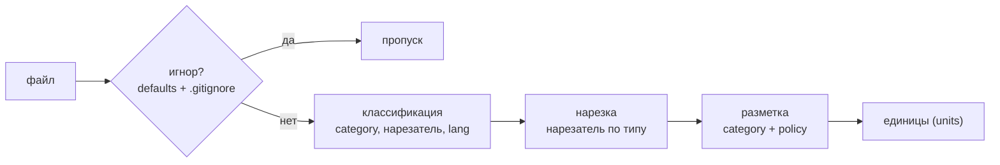
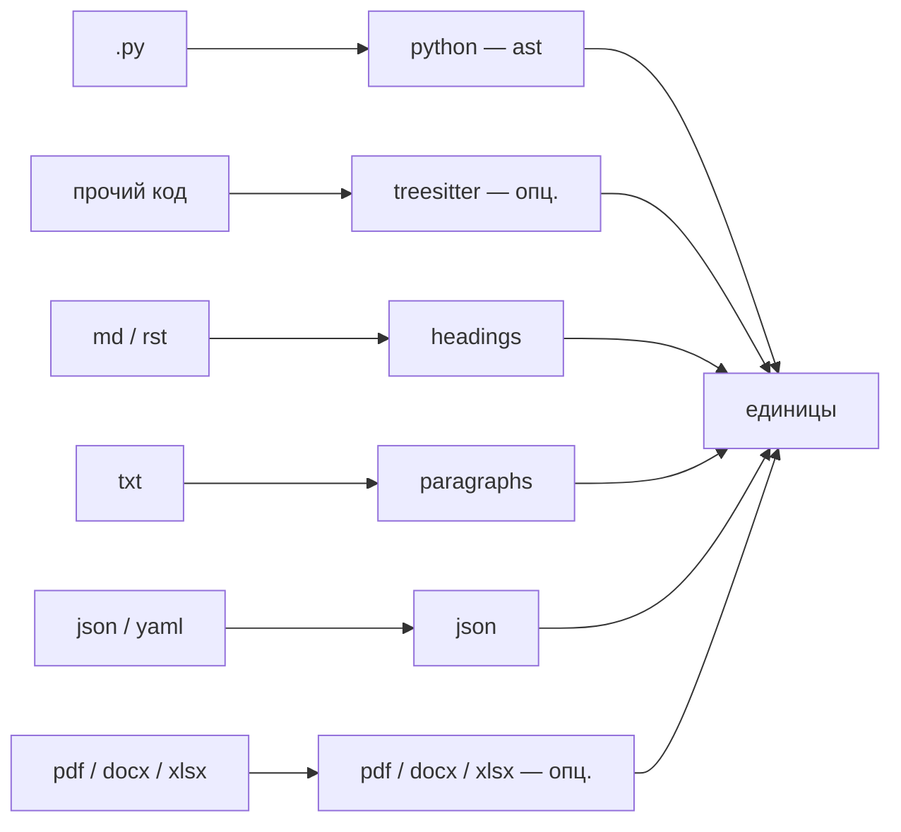

# 04 — Извлечение структуры

Извлечение структуры (`extract_structure.py`) — **единственный зависящий от типа данных** слой системы; движок графа доменно-слеп и одинаково хранит узлы, рёбра и текст независимо от того, откуда пришла единица (обоснование — в [теории](../THEORY.md), раздел 11). Образно это «сенсорная кора»: каждый файл маршрутизируется к нужному **нарезателю** (компоненту, режущему файл на единицы) по его типу, а из результата строится единый ассоциативный граф. Этот слой полностью **детерминированный**: никакой языковой модели здесь нет (см. [Общая картина](./01-overview.md)).

Извлечение работает по конвейеру на каждый файл: **игнор → классификация → нарезка → разметка**.



Результат — список **единиц** (units), каждая из которых несёт **контентный хеш**; именно хеш делает всю систему идемпотентной (сверка сравнивает хеши с графом и решает, что изменилось — см. [Сверка и деривация](./05-reconcile.md)).

## Расположение и вызовы

Файл `extract_structure.py` лежит в `skills/amg-bootstrap/scripts/`. Его функции `extract` и `load_config` импортирует `reconcile.py`; файлы, помеченные неоднозначными, передаются субагенту `amg-classifier` для уточнения типа. Зависит от опциональных библиотек (`tree-sitter-language-pack`, `pypdf`, `python-docx`, `openpyxl`) и при их отсутствии корректно понижает детализацию; языковую модель сам не вызывает. Запускается скиллом `amg-bootstrap`.

## Игнорирование: гигиена до смысла

Часть файлов не индексируется вовсе — это вопрос гигиены, а не значимости (до-смысловой фильтр, аналог сенсорного гейтинга; [теория](../THEORY.md), раздел 11). Решают это жёсткие правила, а не модель. Источники три, и они складываются.

**Встроенный список каталогов `DEFAULT_IGNORE_DIRS`.** Файл пропускается, если *любая* часть его пути входит в набор: `.git`, `.hg`, `.svn`, `.claude`, `node_modules`, `.venv`, `venv`, `env`, `__pycache__`, `.pytest_cache`, `.mypy_cache`, `.ruff_cache`, `.tox`, `dist`, `build`, `target`, `out`, `.next`, `.nuxt`, `.cache`, `vendor`, `site-packages`, `.idea`, `.vscode`, `.gradle`, `coverage`, `.terraform`, `bin`, `obj`. Каталог самого графа (`.claude`) тоже здесь — память не индексирует саму себя.

**`.gitignore` проекта.** `load_gitignore` читает корневой `.gitignore`, отбрасывая комментарии (строки с `#`) и правила-исключения (с `!`) и срезая хвостовой `/`. Сопоставление (`_gitignored`) считает файл игнорируемым, если шаблон совпал с полным относительным путём или с именем файла (`fnmatch`), либо имя-сегмент шаблона встречается где-либо в пути, либо путь подходит под `шаблон/*`.

**Ключ конфигурации `exclude`.** Дополнительные шаблоны (строка или список), применяются тем же механизмом, что и `.gitignore` (см. [Справочник конфигурации](./09-config.md)).

## Классификация

`classify(path)` возвращает кортеж `(category, нарезатель, lang, неоднозначность)`, где `category` ∈ `code | doc | data | binary`, `нарезатель` — ключ из реестра (или `skip`), `lang` — язык/формат (для кода — имя грамматики), а флаг неоднозначности помечает файлы, тип которых установлен догадкой. Решение принимается по расширению, а для файлов без расширения или с неизвестным — по содержимому.

| Класс расширения | `category` | нарезатель | `lang` |
|---|---|---|---|
| `.py` | `code` | `python` | `python` |
| прочий код — таблица `CODE_LANG_BY_EXT` (`.js`, `.jsx`, `.mjs`, `.cjs`, `.ts`, `.tsx`, `.php`, `.c`, `.h`, `.cc`, `.cpp`, `.cxx`, `.hpp`, `.hh`, `.java`, `.go`, `.rs`, `.rb`, `.cs`, `.swift`, `.kt`, `.scala`, `.lua`, `.sh`, `.bash`, `.sql`, `.pl`, `.r`, `.dart`, `.ex`, `.exs`) | `code` | `treesitter` | имя грамматики |
| `.md`, `.mdx`, `.markdown`, `.rst` | `doc` | `headings` | — |
| `.txt`, `.text` | `doc` | `paragraphs` | — |
| `.json`, `.ndjson`, `.yaml`, `.yml` | `data` | `json` | — |
| `.pdf` | `doc` | `pdf` | `pdf` |
| `.docx` | `doc` | `docx` | `docx` |
| `.xlsx`, `.xlsm` | `data` | `xlsx` | `xlsx` |
| бинарные — таблица `BINARY_EXT` (изображения, архивы, медиа, шрифты, исполняемые; устаревшие офисные `.doc`, `.xls`, `.ppt`, `.pptx`; `.db`, `.sqlite`, `.pdb`, `.lock`, `.svg`, …) | `binary` | `skip` | — |

**Файлы без расширения или с неизвестным расширением** проходят *досмотр содержимого*: читаются первые 2048 байт. Если файл нечитаем или содержит нулевой байт (`\x00`) — он считается бинарным и пропускается. Иначе это читаемый текст неизвестного рода: он трактуется как проза (`doc`, нарезатель `paragraphs`) и **помечается неоднозначным** — скилл начальной загрузки может затем попросить субагент-классификатор уточнить тип (см. [Субагенты и скиллы](./08-agents-skills.md)).

Важная деталь о форматах. Устаревшие двоичные форматы `.doc`, `.xls`, `.ppt` (до 2007 года) намеренно в `BINARY_EXT`: надёжной чисто-Python библиотеки для их извлечения нет, а распаковка потребовала бы тяжёлых внешних инструментов, что противоречит принципу «опциональные чисто-Python библиотеки». Современный `.pptx` (презентации) — в `BINARY_EXT` по другой причине: его *можно* поддержать через `python-pptx` (нарезатель слайдов, как для DOCX/XLSX), но такой нарезатель пока не реализован (см. раздел «Развитие» ниже). Извлекаются только `.pdf`, `.docx`, `.xlsx`/`.xlsm`.

## Реестр нарезателей

Реестр `CHUNKERS` сопоставляет ключ нарезателя его реализации: `python`, `treesitter`, `headings`, `paragraphs`, `json`, `pdf`, `docx`, `xlsx`. Управляющая функция диспетчеризует файл по этому ключу.



### Python — стандартный модуль `ast` (без зависимостей)

`_python_units` разбирает файл стандартным модулем `ast`, поэтому Python поддержан полностью и без сторонних библиотек. Создаётся узел **модуля** (`id` = `code:путь`, `kind` `module`) с полем `imports` (отсортированный уникальный список из `import` и `from … import`). Затем рекурсивно обходятся определения функций, асинхронных функций и классов: каждое даёт единицу с `id` = `code:путь::квалификатор` (для вложенных — точечный префикс, например `Класс.метод`), `kind` `class` или `function`, номером строки `lineno` и полем `calls` — отсортированным уникальным списком имён вызываемого (имя функции или атрибут метода). Классы обходятся вглубь. **Хеш считается по исходнику самого определения**, поэтому правка одной функции переизвлекает только её узел, а не весь файл. Синтаксическая ошибка в файле → один файловый узел (без падения).

### Прочий код — tree-sitter (опционально)

`_treesitter_units` даёт функциям/классам прочих языков ту же зернистость и рёбра вызовов, но **только если** установлен `tree-sitter-language-pack` и грамматика загрузилась; иначе функция возвращает `None`, и управляющая функция корректно понижает файл до одного файлового узла (грубее, но без ошибки). Распознаются семейства узлов-определений `_TS_DEF` (функция, метод, класс, структура, `impl`/`trait`, интерфейс, перечисление — широко, под разные грамматики) и вызовов `_TS_CALL`; для каждого определения создаётся единица с `id` = `code:путь::имя`, номером строки и списком `calls`, а её `kind` канонизируется той же картой `_TS_DEF`: типы-функции грамматики (`function_definition`, `method_declaration`, `function_item`, …) дают `function`, типы-контейнеры (`class_declaration`, `struct_specifier`, `impl_item`, `interface_declaration`, …) — `class`. Благодаря канонизации не-Python код получает те же ярусы извлечения и указатели `путь:строка`, что Python. Установка для максимума: `pip install tree-sitter tree-sitter-language-pack`. Поддержаны оба поколения биндинга пакета — классический (API py-tree-sitter: `parse(bytes)`, свойства `type`/`children`/`text`) и alef-rewrite ≥ 1.8 (методный API: `parse(str)`, `kind()`/`child(i)`, байтовые смещения); различие определяется на лету, имена типов узлов грамматики в обоих одинаковы.

### Markdown и разметка — `headings`

`_markdown_units` режет файл по заголовкам `#`…`######`: одна единица на раздел (`id` = `doc:путь::слаг`, `kind` `section`, с номером строки начала). Строки внутри **код-ограждений** заголовками не считаются: нарезатель отслеживает блоки ``` ``` ``` и `~~~` (от трёх символов, отступ до трёх пробелов; закрывает блок только тот же символ длиной не меньше открывшего, чужой маркер внутри блока ничего не закрывает), поэтому `# установить зависимости` внутри bash-примера не разрывает раздел и не порождает ложной секции. Текст до первого заголовка становится разделом `_preamble`. Повторяющиеся слаги получают суффикс `-1`, `-2`. Слаг строит `_slug`: нижний регистр, удаление символов кроме букв/цифр/пробелов/дефисов, схлопывание пробелов и дефисов в один дефис, обрезка до 60 символов. Пустой файл → один файловый узел.

### Текст — `paragraphs`

`_text_units` режет текст на блоки по пустым строкам: одна единица на непустой абзац-блок (`id` = `doc:путь::b{n}`, `kind` `block`). Пустой файл → файловый узел. Этот же нарезатель применяется к неоднозначным текстовым файлам без расширения.

### JSON и YAML — `json`

`_data_units` разбирает файл через `yaml.safe_load` (понимает и JSON, и YAML). Для словаря единицей становится каждая пара верхнего уровня, для списка — каждый элемент (`id` = `data:путь::{ключ}`, ключ обрезается до 48 символов, `kind` `record`). Число записей **ограничено первыми 500** (`items[:500]`). Значение, не являющееся словарём или списком, а также ошибка разбора → один файловый узел. Нарезатель не рекурсирует вглубь: вложенную структуру внутри записи понимает уже смысловой слой при написании сводки (рекурсивный разбор глубокой вложенности — пункт развития, см. ниже).

### PDF, DOCX, XLSX — опциональные чисто-Python библиотеки

Эти три нарезателя извлекают текст из бинарных документов и **несут его в поле `text`** единицы, чтобы субагент-сборщик мог написать сводку, не открывая бинарный файл повторно. Если библиотека отсутствует или файл нечитаем (например, отсканированный PDF без текстового слоя), нарезатель возвращает `None` и файл **пропускается** — без ошибки.

- **PDF** (`pypdf`): одна единица на **страницу** с извлекаемым текстом (`id` = `doc:путь::p{i}`, `kind` `page`). Страницы без текста пропускаются; если их нет вовсе — файл пропущен целиком.
- **DOCX** (`python-docx`): нарезка по абзацам со стилем «Heading»/«Title» — как в markdown, одна единица на раздел (`id` = `doc:путь::слаг`, `kind` `section`); текст до первого заголовка → `_preamble`; повторяющиеся слаги получают суффикс.
- **XLSX/XLSM** (`openpyxl`): одна единица на **лист**, причём таблица — это данные, а не проза, поэтому в `text` кладётся **структурное описание** (имя листа, размер «строк × столбцов», заголовки колонок и до трёх образцовых строк), а не выгрузка всех ячеек (`id` = `data:путь::{имя_листа}`, `kind` `sheet`). Книга открывается в режиме только для чтения.

## Единица (unit): поля

Каждая единица — это словарь со следующими полями (как они превращаются в поля узла графа — в разделе [Модель данных](./02-data-model.md)):

| Поле | Назначение |
|---|---|
| `id` | идентификатор будущего узла (`категория:путь[::квалификатор]`) |
| `kind` | форма единицы: `file` / `module` / `class` / `function` / `section` / `block` / `record` / `page` / `sheet` (типы узлов грамматики tree-sitter канонизируются в `function`/`class` ещё при извлечении) |
| `source_path` | относительный путь к файлу-источнику |
| `category` | `code` / `doc` / `data` — определяет бакет узла |
| `policy` | `mirror` / `absorb` — унаследована от источника |
| `qualname` | квалификатор внутри файла (имя функции, слаг раздела, `b{n}`, `p{i}`, ключ, имя листа) |
| `lineno` | номер строки начала в источнике (для кода/markdown) |
| `lang` | язык/формат (`python`, имя грамматики, `markdown`, `text`, `pdf`, `docx`, `xlsx`; может быть пустым) |
| `content_sha` | SHA-256 содержимого единицы — ключ идемпотентности |
| `imports` | только Python-модуль: список импортируемых модулей (станет рёбрами `imports`) |
| `calls` | только код: список вызываемых имён (станет рёбрами `calls`) |
| `text` | только PDF/DOCX/XLSX: извлечённый текст, чтобы сборщик не открывал бинарь повторно |

Поля `part_of` (членство) и `edges` (рёбра) здесь **не вычисляются** — их формирует слой сверки и смысловой слой (см. [Модель данных](./02-data-model.md) и [Сверка и деривация](./05-reconcile.md)).

## Контентный хеш и идемпотентность

`content_sha` — SHA-256 содержимого единицы. Поскольку код хешируется **на уровне отдельного определения**, правка одной функции меняет хеш только её узла; сверка сравнивает хеши единиц с графом и переизвлекает лишь изменившееся, не трогая остальное и не тратя вызовы модели впустую. Это основание идемпотентности всей системы.

## Источники и политики

`resolve_sources(config)` возвращает список пар `(путь, политика)`. Предпочтительная форма — ключи `mirror_path` и `absorb_path` (каждый — строка или список путей); для совместимости поддержана устаревшая форма `sources: {имя: {path, policy}}`. Политика (`mirror`/`absorb`) наследуется единицами этого источника; смысл политик — в [теории](../THEORY.md) (раздел 12) и в разделе [Справочник конфигурации](./09-config.md). Обход файлов источника выполняет `iter_source_files` с учётом всех правил игнорирования.

## Самодиагностика (`--stats`)

Режим `--stats` печатает сводку без построения графа: число файлов по категориям (`by_category`) и по языкам/нарезателям (`by_language`), количество пропущенных бинарных (`skipped_binary`), список неоднозначных файлов (первые 20), доступность tree-sitter (реальной попыткой загрузить грамматику) и доступность извлечения PDF/DOCX/XLSX по каждому формату (с подсказкой `pip install …`, если библиотека отсутствует). Это быстрый способ увидеть, что именно попадёт в граф и каких опциональных библиотек не хватает.

## Командная строка

| Команда | Действие |
|---|---|
| `python extract_structure.py <project_root> [<amg_root>]` | вывести единицы в формате JSON в стандартный вывод |
| `python extract_structure.py <project_root> [<amg_root>] --stats` | вывести человекочитаемую сводку |

`amg_root` по умолчанию — `<project_root>/.claude/amg`; конфигурация читается из `amg_root/config.yml`.

## Развитие (планируется)

Слой ингеста доменно-зависим, поэтому новые типы входа добавляются именно здесь, не затрагивая движок:

- **Нарезатель стенограмм и чатов (заглушка).** Для диалогов (экспорт чата, авто-дампы в `sessions/`) — нарезка по ходам с атрибуцией ролей; пока такие файлы обрабатываются текстовым нарезателем, а роли считывает смысловой слой. Подробности про формат — в разделе [Сверка и деривация](./05-reconcile.md) и пользовательском руководстве.
- **Рекурсивный нарезатель JSON (заглушка).** Разбор глубокой вложенности крупных записей на под-узлы; сейчас запись верхнего уровня — одна единица, а вложенность осмысляет субагент.
- **Нарезатель презентаций `.pptx` (заглушка).** Одна единица на слайд через `python-pptx` (опционально, с мягким пропуском — как PDF/DOCX/XLSX). Устаревшие `.doc`/`.xls`/`.ppt` потребовали бы тяжёлых внешних конвертеров и пока вне рамок.
- **Дополнительные грамматики кода** подключаются установкой `tree-sitter-language-pack`, без изменения кода.

Полный список запланированного — в разделе [Дорожная карта](./11-roadmap.md).

## Дальше

- [Карта документации](./README.md) — оглавление архитектуры и возврат к началу.
- [02 — Модель данных](./02-data-model.md) — как единицы становятся узлами: идентификаторы, типы, бакеты, рёбра.
- [05 — Сверка и деривация](./05-reconcile.md) — как хеши единиц сверяются с графом, очередь на деривацию, политики `mirror`/`absorb`.
- [08 — Субагенты и скиллы](./08-agents-skills.md) — субагент-классификатор уточняет неоднозначные файлы; сборщик пишет сводки из поля `text`.
- [09 — Справочник конфигурации](./09-config.md) — `mirror_path`, `absorb_path`, `exclude` и прочие ключи.
