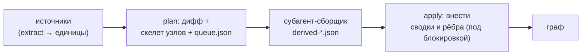
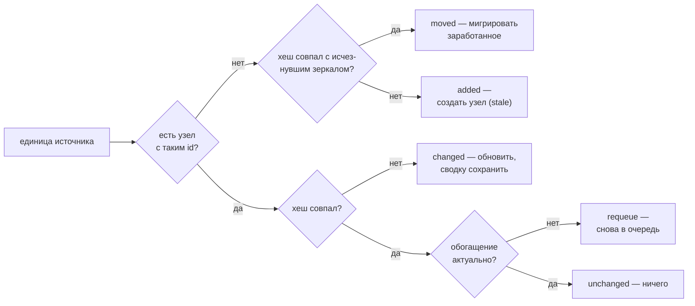
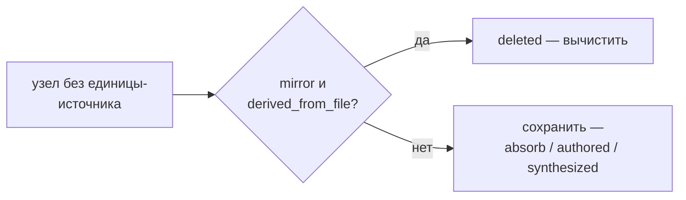

# 05 — Сверка и семантическое обогащение

Сверка (`reconcile.py`) — сердце согласованности: она приводит граф в соответствие с кодом и документами на диске. Все её записи идут через транзакции хранилища (см. [Хранилище и транзакции](./03-storage.md)), поэтому любое прерывание восстановимо, а сравнение по контентным хешам делает её **идемпотентной**: повторный прогон без изменений не пишет ничего и не тратит ни одного вызова модели.

Сверка работает в **две фазы**, разделённые по принципу «детерминированный слой и слой суждения» (см. [Общая картина](./01-overview.md)): сначала детерминированная часть строит скелет узлов и очередь, затем смысловая часть (субагент) пишет сводки и связи, а результат вносится отдельной командой.

Здесь **семантическое обогащение** (англ. derivation, отсюда имена файлов `derived-*.json`) — это смысловое доизвлечение: написание сводки узла и осмысленных рёбер языковой моделью поверх детерминированного скелета.

## Расположение и вызовы

Файл `reconcile.py` лежит в `skills/amg-bootstrap/scripts/`. Импортирует `graph_store` (транзакции, блокировка, восстановление) и `extract` / `load_config` из `extract_structure`. Детерминированную фазу (`plan` / `bootstrap`) и применение (`apply`) запускает скилл `amg-bootstrap`; сводки и рёбра для очереди пишет субагент `amg-builder`, а стратегические узлы создаёт `amg-synth` — их результат вносит в граф команда `apply`.

## Команды

| Команда | Действие |
|---|---|
| `python reconcile.py bootstrap [<project_root>] [--root <agent_dir>]` | построить или свести граф из любого состояния (+ авто-восстановление из кэша обогащения) |
| `python reconcile.py plan [<project_root>] [--root <agent_dir>]` | тот же дифф: детерминированные записи + очередь |
| `python reconcile.py apply <derivation.json\|glob> … [<project_root>] [--root <agent_dir>]` | внести семантический результат: несколько путей и глоб-шаблонов одним вызовом (глобы раскрываются внутри скрипта — оболочка Windows передаёт их как есть), одна транзакция, один агрегированный итог |
| `python reconcile.py apply-derived [<project_root>] [--root <agent_dir>]` | пакетная дверь: применить **все** `work/derived-*.json` (включая контрольные части) одним вызовом (см. «Применение семантики») |
| `python reconcile.py apply-cached [<project_root>] [--root <agent_dir>]` | восстановить обогащение очереди из кэша (см. «Кэш обогащения») |
| `python reconcile.py metrics [<project_root>] [--root <agent_dir>]` | отчёт о связности графа — приёмочный гейт (см. «Метрики связности») |
| `python reconcile.py audit [<project_root>] [--root <agent_dir>]` | read-only свип инвариантов — полевая диагностика (см. «Аудит хранилища») |

`bootstrap` и `plan` вызывают **одну и ту же** функцию `plan()` — это синонимы; «bootstrap» лишь отражает намерение «построить с нуля», а делает он ровно то же, что `plan` (граф строится из любого состояния, в том числе пустого). `project_root` по умолчанию — текущий каталог; это корень **источников** (откуда извлекаются единицы), и он отделён от корня графа.

Корень графа — `<каталог агента>/amg` — разрешается функцией `graph_store.resolve_amg_root` по цепочке (первое совпадение побеждает): явный `--root <agent_dir>` → переменная окружения `AMG_AGENT_DIR` → поиск вверх от `project_root` (на каждом уровне сперва пресеты `<каталог>/{.claude,.agents}/amg/config.yml` — так глобально установленный движок находит граф проекта, — затем «голый» `<каталог>/amg`, только если это инициализированное хранилище) → каталог самого движка, если его `amg/` — инициализированное хранилище (дев-раскладка, локальная установка) → умолчание `<project_root>/.claude/amg`. Кандидат с сигнатурой движка внутри (`skills/`, `agents/`, `install.py`) отвергается как чекаут исходников, а уровень домашнего каталога пропускается — полные правила и обоснование в разделе [Хранилище и транзакции](./03-storage.md). Для типовой установки результат совпадает с прежним: `<project_root>/.claude/amg` (`.claude` — умолчание Claude Code; в иной среде это настроенный каталог агента, например `.agents`).

## Дифф: случаи сверки

Функция `plan()` сравнивает единицы из источников (см. [Извлечение структуры](./04-ingest.md)) с узлами графа. Решает **контентный хеш** (фильтр по хешу — пропуск по совпадению хеша), но сверяется не только источник: учитывается и отставание самого обогащения:

| Случай | Условие | Что делает |
|---|---|---|
| `added` | есть единица, узла с таким `id` нет, перенос не опознан | создать узел (статус `stale`), поставить в очередь на обогащение |
| `changed` | `source_hash` узла ≠ текущий хеш единицы | обновить структурные поля, **пересобрать структурные рёбра**, статус → `stale`, сохранить прежние сводку и смысловые рёбра, поставить в очередь |
| `moved` | исчезнувший узел-зеркало и новая единица с **одинаковым** хешем | мигрировать заработанное на новый id, перенаправить входящие ссылки; выведенный узел приезжает `active` и в очередь не идёт |
| requeue | хеш совпал, но `derived_from_hash` ≠ хешу либо `status: stale` | вернуть единицу в очередь; файл узла не переписывается |
| дрейф указателя | хеш совпал, но `lineno`/`qualname`/`policy`/`type` разошлись с единицей | тихо обновить только эти поля, без повторного обогащения (счётчик `pointer_refreshed`); `type` зеркала принадлежит извлечению — так старые грамматические типы tree-sitter сводятся к канону |
| `deleted` | узел-зеркало, чья единица исчезла и не опознана как перенос | вычистить узел |
| `unchanged` | хеши совпали, обогащение актуально | ничего — ни записи, ни вызова модели (истинная идемпотентность) |
| `frozen` | узел с политикой `absorb_once` уже существует | ничего: источник впитан один раз и заморожен — изменения игнорируются (нет повторного обогащения и дрейфа указателя), удаление узел не вычищает |

Удаление обрабатывается отдельным проходом по узлам, у которых нет соответствующей единицы (узлы, опознанные как перенос, в него не попадают — их старые файлы уже удалены миграцией):

Итог `plan()` — словарь `{added, changed, moved, deleted, unchanged, requeued_stale, pointer_refreshed, edges_refreshed, frozen, auto_summarized, queued_for_semantic}`; `queued_for_semantic` — размер очереди на обогащение (added + changed + requeue + недовыведенные перенесённые), `frozen` — число заморожённых узлов `absorb_once`, чьё изменение проигнорировано, `edges_refreshed` — узлы, переписанные только ради канонизации рёбер (см. «Резолвер и канонизация целей» ниже), `auto_summarized` — тривиальные единицы, выведенные детерминированной авто-сводкой без модели и без очереди (см. «Авто-сводка тривиальных единиц»); CLI `bootstrap`/`plan` дополняет сводку полем `restored_from_cache` и вычитает восстановленное из `queued_for_semantic` (см. «Кэш обогащения»). Дополнительно, когда они есть, добавляются диагностические поля: `policy_conflicts` — файлы, попавшие под две политики сразу (пересечение `mirror`/`absorb`/`absorb_once`), `missing_sources` — перечисленные в конфиге, но не существующие на диске пути источников, чтобы опечатка в `mirror_path` не пряталась за «added: 0», и `leftover_derived` — число неприменённых файлов `work/derived-*.json` от прерванного прогона: только что записанная очередь снова числит их единицы недовыведенными, поэтому правило возобновления — один вызов `apply-derived` **до** любого повторного обогащения (хелперы очереди `partition_queue.py` и `link_candidates.py` печатают то же предупреждение).

## Правила сохранности

Это инварианты, защищающие знание от потери (формальное обоснование — в `consistency-model.md`):

- **Вычищаются только зеркала.** По диффу удаляются исключительно узлы с `source_kind = derived_from_file` **и** `policy = mirror`. Узлы `authored` (заметки, выводы модели), узлы впитанных источников (`absorb`) и синтезированные узлы (хабы) **никогда** не удаляются здесь — удаление папки `data/` не должно стирать впитанное знание.
- **Перенос не стирает заработанное.** Пара «исчезнувшее зеркало + новая единица» с одинаковым контентным хешем — это перенос или переименование: на новый id мигрируют сводка, `lang`, смысловые рёбра с их `coact`, `derived_from_hash` и мультичленство (первичная тема переписывается со старого каталога на новый); цели рёбер внутри переносимого файла переводятся на новый путь, а входящие рёбра и членства остальных узлов перенаправляются. Чистый перенос не тратит ни одного вызова модели. Близнецы (одинаковое содержимое в нескольких файлах) паруются детерминированно по отсортированным id; перенос с одновременной правкой содержимого не распознаётся (хеши разные) — это обычные `deleted`+`added`. Перенос absorb-источника тоже не распознаётся: его узел дифф не удаляет, поэтому остаётся сирота плюс новый узел, а такие почти-дубли сливает консолидация.
- **При изменении прежняя сводка сохраняется.** На случай `changed` обновляются структурные поля и пересобираются структурные рёбра, а заработанные сводка и смысловые рёбра **остаются**, статус лишь переводится в `stale` до тех пор, пока новое обогащение не будет надёжно зафиксировано. Сбой в середине обогащения не теряет ничего: в графе всё ещё лежит прежняя осмысленная версия.
- **`mirror` и `absorb` при *изменении* источника ведут себя одинаково; `absorb_once` — нет.** Пока источник на диске и его содержимое поменялось, узел `mirror` или `absorb` обновляется и ставится в очередь на повторное обогащение **независимо от политики**; различие этих двух проявляется **только при удалении** источника (зеркало вычищается, впитанный узел сохраняется как осиротевшая сводка). То есть обычный `absorb` — это не «один раз и заморожено», а «переживает удаление источника». Третья политика, **`absorb_once`**, как раз и реализует «один раз и заморожено»: после первой загрузки её узел инертен — изменения источника игнорируются (случай `frozen` выше), а удаление, как и у `absorb`, узел не вычищает. `absorb_once` нужен для разового снимка, который не должен пересинхронизироваться даже при правке оригинала.
- **Сохранённые сессии — тот же механизм.** Дамп диалога попадает в граф как обычный источник (нарезатель `session`, см. [Извлечение структуры](./04-ingest.md)), а его политику задаёт ключ `session_policy`: `absorb` (по умолчанию) — диалог становится дистиллятом и переживает удаление файла дампа; `mirror` — узлы существуют, пока существует файл, и любую деталь диалога можно достать целиком. Никакого особого кода сверки сессии не требуют.
- **Все записи транзакционны.** Перед любыми изменениями `plan()` и `apply()` вызывают `recover()` (восстановление недописанных транзакций), а сами изменения идут одной транзакцией — прерывание восстановимо (см. [Хранилище и транзакции](./03-storage.md)).

## Создание узла (детерминированный скелет)

Для случая `added` поля нового узла проставляются механически, без модели: `source_kind` = `derived_from_file`, `policy` наследуется от источника, `qualname`, `lineno` и `line_end` — указатель единицы и её диапазон внутри файла, `source_hash` = хеш единицы, `derived_from_hash` = `null` (ещё не выведено), `part_of` — первичное членство по родительскому каталогу (`_part_of_for`, вес `1.0`), `edges` — структурные рёбра (`_structural_edges`: `imports` с весом `0.6`, `calls` с весом `0.7`, а для ходов чата `follows` с весом `0.3` — ссылка на предыдущий ход того же треда; каждое помечено `origin: structural`), `lang` = `working_language` из конфига (язык будущей сводки), `status` = `stale`, `summary` = пустая строка, `updated` = текущее время. **Слой доверия:** проставляются `provenance` (`kind` = категория единицы `code`/`doc`/`data`, плюс best-effort git-`commit`, вычисляемый один раз на прогон) и `verification` = `{status: unverified, method: none}`; `confidence` на этом шаге не ставится — её даст слой суждения вместе со сводкой (см. ниже «Применение семантики»). Полная схема полей — в разделе [Модель данных](./02-data-model.md). Тело узла записывается пустым; сводку и осмысленные рёбра добавит фаза обогащения.

### Резолвер и канонизация целей

Структурные рёбра строит **детерминированный резолвер** над символьными таблицами всего извлечения (`_build_symbols`: карта модулей, верхнеуровневые определения и квалификаторы по файлам, привязки импортов; принцип — [теория, §4.1](../THEORY.md)):

- `imports` — для **внутрипроектного** модуля цель резолвится в id его узла по карте «точечное имя → путь» (`_module_map`): для каждого Python-модуля регистрируются полный точечный путь и его суффиксы (`src/billing.py` → `src.billing` и `billing`; `pkg/__init__.py` → `pkg`), а неоднозначный суффикс — два одноимённых файла в разных каталогах — не резолвится вовсе: неверное ребро хуже висячего. Импорт stdlib или сторонней библиотеки остаётся точечным именем (`code:json`) — намеренно висячим (фиксирует факт импорта; извлечение отбрасывает);
- `defines` — из поля `defines` единицы; цели существуют по построению;
- `calls` и `inherits` — через `_resolve_symbol`: голое имя → верхнеуровневое определение своего файла, затем привязка импорта (`from util import helper`); квалифицированная ссылка своего файла (`Box.make`) — напрямую; `self.X`/`cls.X` — метод своего класса; точечная цепочка — раскрытие головы по привязкам импортов, затем длиннейший модульный префикс по карте модулей, остаток — квалификатор в том модуле. **Резолв идёт только через собственные импорты файла** — совпадение имени с именем модуля ребра не даёт; неразрешимое (builtins, методы неизвестных объектов, внешние библиотеки) **рёбер не порождает вовсе**.

Поверх резолвера работает **канонизация целей** (`_normalize_edges`): цель любого ребра, не называющая существующий узел, чинится — в порядке убывания конкретности и всегда только при **единственном** кандидате; любая неоднозначность оставляет цель как есть (неверное ребро хуже висячего):

- **по суффиксу пути** — цель без ведущих каталогов (`code:core/foo.py::Bar` → `code:src/pkg/core/foo.py::Bar`) привязывается к единственному узлу, чей путь оканчивается написанным путём на границе `/`;
- **по голому qualname** — цель, записанная голым именем символа вовсе без пути (`code:helper`: слой суждения увидел символ в сводке, не зная его файла), привязывается к единственному узлу, чей id оканчивается на `::helper` (точное совпадение qualname при той же категории). От ложной привязки берегут два гарда: починка **никогда не применяется к рёбрам `imports`** — их висячие цели суть легитимные внешние модули (`code:json`), и одноимённый символ проекта не должен их перехватывать, — и никогда, если имя может читаться и как файл (путь какого-то узла оканчивается на `/<имя>`): два прочтения — нет починки.

Канонизация применяется на `apply` (рёбра слоя суждения), в ветках added/changed/moved и **свипом по всему графу на каждом `plan()`** — включая узлы без единиц (хабы, заметки, впитанные сироты). Свип пишет узел только при фактическом изменении, причём сравнение рёбер порядко-нечувствительно (порядок рёбер смысла не несёт) — поэтому граф, построенный до появления любой из починок, лечится одним `bootstrap` (счётчик `edges_refreshed`), а уже канонический остаётся строгим no-op. Заодно тем же путём у неизменных единиц пересобираются структурные рёбра: улучшение экстракции (новые типы рёбер, снятый шум) доезжает до старых графов без правки исходников.

### Авто-сводка тривиальных единиц

Не всякая единица стоит вызова модели. У **тривиальной** функции — дандера вроде `__repr__`, однострочного геттера, механического тела в пару строк — нет смысла сверх её собственного текста: суждение здесь ничего не добавляет, а на реальном проекте таких единиц сотни. Поэтому функция кода, чьё определение целиком занимает не больше `trivial_unit_max_lines` строк, получает **детерминированную авто-сводку**: её собственный код, схлопнутый в одну строку (до 240 символов). Такая сводка язык-нейтральна (идентификаторы и так пишутся дословно), даёт лексическому засеву честные токены и не может быть выдумана. Узел сразу создаётся выведенным — `derived_from_hash = source_hash`, `status: active` — и в очередь не попадает; указатель и структурные рёбра при этом обычные. Просто *пропустить* такую единицу было бы нельзя: правило повторной постановки (`derived_from_hash` отстал либо `status: stale`) возвращало бы её в очередь вечно — именно поэтому решение оформлено как сводка, а не как пропуск.

Три оговорки держат качество:

- **протокольные дандеры не тривиальны.** Методы, само наличие которых меняет способ употребления класса — `__call__` (объект вызываем), `__enter__`/`__exit__` (контекстный менеджер), `__getattr__`/`__getitem__` и подобные, — уходят к модели при любом размере: шаблон изложил бы механику, но упустил бы ровно эту семантику;
- **кэш побеждает шаблон.** Если для единицы есть попадание в кэше обогащения, она ставится в очередь как обычно — восстановление вернёт заработанную сводку слоя суждения дословно и бесплатно; авто-сводка применяется только при настоящем промахе;
- **уверенность не проставляется.** `confidence` — оценка слоя суждения; детерминированная сводка её не несёт (и порогом «низкой уверенности» в пакете не помечается).

Действует во всех ветках диффа (`added`, `changed`, requeue недовыведенных); счётчик `auto_summarized` — в сводке `plan()` и строке журнала. Умолчание в коде — `0` (выключено), в поставляемом шаблоне `config.yml` — `3`: ещё один случай «код ≠ шаблон» (см. [Справочник конфигурации](./09-config.md)) — реальные установки получают экономию из шаблона, а минимальный рукописный конфиг ведёт себя по-старому. Обоснование границы «детерминированное — прежде модели» — [теория, §4.1](../THEORY.md).

## Обновление при изменении источника (`changed`)

При `changed` обновляются все структурные поля узла (`source_hash`, `type`, `source_path`, `policy`, `qualname`, `lineno`, `line_end`), а **структурные рёбра пересобираются** свежим извлечением (`_refresh_structural_edges`): прежние рёбра с `origin: structural` заменяются новыми — новый вызов даёт ребро, исчезнувший его теряет, — причём ребро, пережившее правку, наследует заработанные вес и счётчик `coact`. Рёбра остальных происхождений не трогаются: заработанная семантика переживает правку источника. Поле `lang` узла намеренно **не** обновляется — это язык уже написанной сводки, он самокорректируется при повторном обогащении. **Верификация обнуляется** (`verification` → `{unverified, none}`): источник сменился, поэтому прежняя проверка факта недействительна (это та же хеш-машина, что метит узел `stale`, поэтому отдельного «срока годности» проверки не нужно); `provenance` пере-проставляется (тот же `kind`, текущий `commit`). На дрейфе указателя (хеш совпал, сдвинулись только `lineno`/`qualname`) обновляется и `line_end`, а верификация сохраняется — содержимое не менялось.

Происхождение ребра хранится в его поле `origin`: `structural` — детерминированное извлечение; `semantic` — рёбра обогащения; `synthesized` — рёбра создаваемых хабов; `consolidation` — рёбра, созданные действиями консолидации (см. [Модель данных](./02-data-model.md)). Рёбра без `origin` (созданные до появления поля) при пересборке трактуются как структурные, если их тип — `imports`/`calls` (единственные структурные типы, существовавшие до появления поля `origin`; новое ребро `follows` от чат-нарезателя всегда помечается `origin: structural` сразу, поэтому в legacy-классификации не нуждается); полную разметку legacy-рёбер выполняет `migrate_schema.py`.

## Очередь обогащения (`queue.json`)

После диффа `plan()` атомарно записывает очередь в `work/queue.json` — это вход для смысловой фазы. Формат: `{"generated": <время>, "units": [ … ]}`. Каждый элемент очереди (`_queue_item`) несёт `id`, `kind`, `source_path`, `category`, `content_sha`, указатель среза `qualname`/`lineno`/`line_end` и `lang` — **язык источника** (`python`, `markdown`, …), не путать с полем `lang` узла (язык сводки).

Главное в элементе — поле **`text`: собственный текст единицы**, тот самый срез, по которому посчитан её хеш (см. [Извлечение структуры](./04-ingest.md) — его прикрепляет каждый нарезатель). Сборщик пишет сводку прямо из очереди и **не открывает источники вовсе**: одно чтение партии вместо чтения файла за файлом. Это не мелочь, а главная статья экономии сборки — каждое обращение субагента к инструменту чтения переотправляет весь его накопленный контекст, поэтому вложить срез в задание кратно дешевле, чем позволить исполнителю перечитывать те же байты самому. Порог `queue_text_max_chars` (по умолчанию 20000 символов; `0` — очередь только с указателями) страхует от аномально крупных единиц — минифицированного бандла, файла-«простыни»: текст свыше порога в очередь не кладётся, и такой элемент, как раньше, несёт лишь указатель — сборщик сам читает срез `lineno`–`line_end`.

Очередь **целиком пересоздаётся каждым `plan()` из состояния графа**: в неё попадают случаи `added` и `changed` плюс все недовыведенные узлы (requeue — `derived_from_hash` отстал или `status: stale`). Поэтому очередь пишется атомарно, но отдельно от транзакции узлов без риска: сбой между транзакцией и записью очереди (или потеря `queue.json`) самовосстанавливается следующим же `bootstrap`. Выведенные `unchanged`-узлы в очередь не идут — это и есть экономия вызовов модели.

Файл остаётся честным и **между** планами: каждое применение сразу переписывает его до единиц, чей узел ещё ждёт обогащения (`_refresh_queue` — единица остаётся, только пока её узел `stale`; единица исчезнувшего узла тоже выбывает, следующий `plan` вернёт её, если источник жив). Без этого сырой файл лгал всем потребителям от применения до следующего плана: `status` печатал сотни «ожидающих» единиц на полностью выведенном графе, `sync-defer` записывал устаревшую цифру, а `partition_queue` заново нарезал бы уже сделанную работу.

## Применение семантики (`apply_derivation`)

Субагент-сборщик читает очередь и пишет результат в файл `derived-*.json` — список элементов; команда `apply` вносит их в граф.

**Пакетная дверь: `apply-derived`.** Исполнители фиксируют вывод множеством небольших файлов-частей, и применение их по одной команде на файл стоило бы оркестратору по одному ходу на файл — с переотправкой всей его беседы на каждом ходу (число ходов — та же валюта, что и объём данных). Поэтому рабочий вход — команда `apply-derived`: она читает **все** `work/derived-*.json` (включая контрольные части `-pNN`) в детерминированном отсортированном порядке, применяет их одним потоком элементов — одна транзакция, один агрегированный итог `{applied, created, skipped_missing, skipped_stale, skipped_invalid, files, queue_remaining}` — и переносит употреблённые файлы в `work/applied/`. Файл с невалидным JSON (контрольная часть, порванная жёстким обрывом) уходит в `work/invalid/` и попадает в `malformed_files`, не прерывая остальное. Повторный `apply-derived` поэтому — дешёвый no-op поверх уже применённого, и он же — путь возобновления после обрыва. Обычная команда `apply` остаётся для точечных случаев и так же принимает несколько путей и глоб-шаблонов одним вызовом (раскрываются внутри скрипта — оболочка Windows глобы не раскрывает; замыкающий существующий каталог — корень проекта). Вернуть файл из `work/applied/` и применить его руками безопасно: применение идемпотентно и проверяет свежесть.

**Память рассуженных пар (пачки линковщика).** Часть линковщика может заканчиваться служебной записью `{"judged": [<id узла>, …]}` — перечнем всех узлов, рассуженных в этой части, включая те, где ничего не подтверждено (они не дают графовых элементов, и без записи их покрытие было бы недоказуемо). Запись не касается графа: `apply-derived` извлекает её до применения (`_pop_judged`; запись, дошедшая до обычного `apply`, отбрасывается молча и браком не считается), собирает id по пачкам по метке в имени части (`derived-links-<пачка>-pNN.json` ↔ `work/link-batch-<пачка>.json`) и, когда собранные id покрывают **каждый** узел пачки, переносит файл пачки в `work/judged/` (`_retire_judged_batches`; итог перечисляет их полем `judged_batches`). Проход номинации (`link_candidates.py`) читает `work/judged/` и считает пары (узел, кандидат) каждой уехавшей пачки уже рассуженными — это память **отклонений**, благодаря которой «повторять до нуля пачек» действительно завершается: рёбра графа помнят только подтверждённую половину суждений, и без этой памяти похожесть переноминировала бы только что отклонённые пары каждой волной, сползая ко всё более слабым кандидатам. Покрытие доказывается в рамках одного вызова `apply-derived` и сознательно не сводится из архива `work/applied/`: метки пачек позиционные (переноминация переиспользует `001`, `002`, …), и архивная часть могла бы ложно закрыть перенумерованную пачку — а молчаливая потеря номинаций хуже пере-суждения хвоста оборванной пачки. Переоткрыть старые суждения — просто удалить файлы из `work/judged/`.

Поддержаны **две формы** элемента:

- **Обновление** — `{id, summary?, lang?, edges?, part_of?, body?, confidence?, content_sha?}` — обновляет узел с этим `id`. Несколько элементов могут адресовать **один и тот же** узел (например, отдельно `part_of`, отдельно ребро `supersedes`) — каждый *накапливается* на узле, не затирая результат предыдущего. В `active` узел переводится **только** если элемент несёт новую `summary` (либо узел не `derived_from_file` — синтезированные и авторские живут `active`): тогда выставляется `derived_from_hash` = `source_hash`. Элемент только с рёбрами или `part_of` оставляет source-узел `stale` — и сверка продолжает возвращать его в очередь, пока сводка не появится: единица считается «выведенной» только когда её сводка надёжно зафиксирована. **Уверенность:** если элемент несёт `confidence`, она клампится в 0..1 и проставляется; если несёт новую `summary` без явной уверенности, узлу даётся `default_confidence` (`verification.default_confidence`, по умолчанию 0.7) — так выведенный узел всегда получает оценку. Верификацию обогащение **не** трогает (сборщик не сверяет с источником — это делает `verify_claims`).

  **Проверка свежести (возобновляемое обогащение).** Элемент может нести `content_sha` — хеш единицы, на котором он построен (его эхоит сборщик, см. [Субагенты и скиллы](./08-agents-skills.md)). Если `content_sha` присутствует и **не равен текущему** `source_hash` узла (источник изменился с момента обогащения), элемент **пропускается** (`skipped_stale`): применить его значило бы привязать сводку к устаревшему содержимому и при этом пометить узел выведенным для нового хеша — слепое обогащение против изменившегося источника. Узел остаётся `stale`, ближайшая сверка вернёт его в очередь. Элемент без `content_sha` применяется как раньше (синтезированные хабы, обратная совместимость).
- **Создание** — `{id, type, summary?, lang?, part_of?, edges?, body?, confidence?, derived_from?}` — если узла с таким `id` нет, узел **создаётся**. Так субагент-синтезатор материализует узлы-хабы и обзоры. Создаётся с `source_kind` = `synthesized` и `policy` = `authored` в бакете `_hubs`, поэтому позднейшая сверка никогда не вычистит его как «исчезнувший источник». **Слой доверия:** ему ставятся `confidence` (из элемента или `default_confidence`), `provenance` = `{kind: model_inference}` плюс опц. `derived_from` (id, из которых синтезирован — его «source ids», ведь файла-источника у хаба нет) и `verification` = `{unverified, none}`.

Если элемент-обновление пришёл на неизвестный `id` и в нём **нет** поля `type` — он пропускается и учитывается в `skipped_missing`, а первые id попадают в выборку `missing_sample` (нельзя обновить то, чего нет, и нельзя понять, как создать, — а выборка сразу показывает, *какие именно* цели выдумал исполнитель, вместо голого счётчика). Рёбра объединяются функцией `_merge_edges` по ключу `(rel, to)`: при совпадении берётся **больший** вес, счётчик совместных активаций `coact` сохраняется; новое ребро получает `coact = 0` и вес по умолчанию `0.5`, если он не задан. Входящие рёбра получают `origin: semantic` (у создаваемых хабов — `synthesized`); существующее ребро свой `origin` сохраняет — структурное ребро, подтверждённое слоем суждения, остаётся структурным (его всё равно можно переизвлечь).

Членства объединяет `_merge_part_of`: темы **накапливаются** — поздний элемент не затирает членство, добавленное ранним; для совпавшей темы побеждает **новый** вес (актуальное суждение слоя — взятие максимума делало бы веса монотонно растущими и мешало бы перебалансировке); если сумма весов превысила 1, доли нормализуются к симплексу (при `weights.part_of_renormalize`, то же правило, что в консолидации). Команда работает под блокировкой и тоже вызывает `recover()` в начале; итог — `{applied, created, skipped_missing, skipped_stale, skipped_invalid}` (`skipped_stale` — элементы, отброшенные проверкой свежести выше; `skipped_invalid` — см. ниже).

**Устойчивость к битым элементам.** Каждый элемент проходит валидацию/нормализацию (`_sanitize_item`) и применяется под собственной защитой — **один испорченный элемент никогда не роняет партию**. Что чинится механически: перепутанные местами поля `confidence`↔`edges` (список рёбер под `confidence`, число под `edges` — меняются обратно), удвоенный категорийный префикс id у create-элемента (`hub:overview:x` при `type: overview` → `overview:x`), кривые записи рёбер и членств (отбрасываются поштучно, остальной элемент применяется), вес вне (0,1] (сбрасывается на умолчание), нестроковые `summary`/`lang`/`body` (поле опускается). Что не чинится — пропускается со счётчиком `skipped_invalid` и краткой причиной в поле `invalid` (до 10 строк): оркестратор видит брак сразу, не разбирая JSON руками. Цели рёбер элементов канонизируются против существующих узлов (см. «Резолвер и канонизация целей»).

Техническая деталь надёжности: для существующего узла путь и тело читаются **без удаления** служебных полей, поэтому повторные элементы на тот же узел накапливаются, а не теряют путь на втором проходе; при записи служебные поля (с префиксом `_`) отбрасываются.

## Кэш обогащения (`cache/derivations/`)

Суждение модели недетерминировано, поэтому пересборка с нуля давала бы каждый раз другой граф и полную повторную оплату (обоснование — [теория, §4.3](../THEORY.md)). Применённые элементы обогащения, несущие `content_sha`, сохраняются в **постоянный кэш**: `cache/derivations/<sha[:2]>/<sha>.json` — файл на хеш содержимого единицы, внутри `{contract, lang, items}` (версия контракта обогащения — константа `DERIVATION_CONTRACT` в `reconcile.py`; `lang` — `working_language` на момент записи). Элементы кладутся санированными, но **до** канонизации целей: резолв всегда выполняется по текущему состоянию графа при восстановлении.

Восстановление: `apply-cached` читает очередь, собирает элементы всех единиц с попаданием (совпали хеш, контракт и язык), применяет их **стандартным путём `apply`** (валидация, канонизация и проверка свежести включены) и переписывает очередь остатком. CLI `bootstrap`/`plan` запускает восстановление автоматически (ключ `derivation_cache: true`), поэтому печатаемый `queued_for_semantic` — это реальная оставшаяся работа модели: пересборка над неизменным контентом не деривирует ничего. Смена `working_language` или версии контракта обесценивает кэш по ключу; выключение ключа или удаление каталога `cache/derivations/` даёт свежее повторное обогащение (например, после смены модели).

## Метрики связности (`metrics`) — приёмочный гейт сборки

`reconcile.py metrics` (read-only; те же цифры — блоком `connectivity` в `/amg status`) считает качество собранного графа: число компонент связности и долю крупнейшей (по той же симметричной проводимости, что у извлечения: рёбра к существующим узлам + членства `part_of`, называющие узел), изолированные узлы, разрешённость рёбер, doc-файлы без ребра `documents` и число `stale`.

Нерезолвнутые цели рёбер разведены **по ответственности**, потому что различаются лекарства. Внешние `imports` (stdlib/сторонние) законно мёртвые — запись факта импорта, никогда не дефект. Висячее **структурное** ребро (`dangling_structural`; `origin: structural` плюс легаси-непомеченные `imports`/`calls`) — собственная корректность движка: резолвер никогда не гадает, поэтому на свежей сборке этот класс нулевой по построению — и именно его гейтует порог `max_dangling_internal`. Висячее **модельное** ребро (`dangling_semantic`; цель слоя суждения, не называющая ни одного узла, — выдуманный слаг, который канонизатор не может привязать) инертно при извлечении (отбрасывается) и не имеет автоматического лекарства, поэтому репортится числом и образцами, но **вердикт не переключает**: гейт, который не может вернуться в `ok`, перестаёт нести сигнал.

Doc-метрика агрегируется **по файлам** (`doc_files_without_documents`): doc-файл считается непривязанным, только когда *ни одна* его секция не несёт исходящего `documents`. Посекционный счёт топил сигнал в структуре — подсекции «контекст/последствия» у ADR сами по себе ничего не документируют; их файл привязан через свою предметную секцию. Файл, все секции которого ещё `stale`, не считается (у него не было шанса), а **файлы сессионных дампов** — `source_path` под каталогом сессий (оба вызывающих передают префикс через общее разрешение `session_dir`) — исключены: у хода диалога предмета нет по природе; файл внешнего экспорта переписки тоже законно без ребра — метрика ориентирующая.

Вердикт `gate: ok | attention` сравнивается с порогами блока `connectivity_gate` конфига и **консультативен**: скелет в середине сборки законно недосвязан, поэтому ничего не падает — скилл начальной загрузки читает вердикт как приёмку и реагирует (перезапустить глобальную линковку, посмотреть образцы). Отложенные `stale`-узлы дефектом не считаются: при ленивом обогащении недовыведенный узел — ожидаемое состояние, а его структурный хребет и так держит связность. Метрики живут в слое сверки намеренно: `graph_store` доменно-слеп и об узлах/рёбрах не знает.

## Аудит хранилища (`audit`) — свип инвариантов

Транзакционный слой гарантирует, что каждая запись ложится целиком, но не видит класс тихих *логических* дефектов, а полевой отладке нужен способ ловить их без россыпи зондов по путям записи. `reconcile.py audit` — этот способ: read-only-свип всего хранилища без блокировки, который проверяет инварианты явно и сообщает каждое нарушение числом и до десяти образцов. Что проверяется: файлы, которые не парсятся или не несут `id`; **дубликаты id** — два файла с одним id, из которых `load_nodes` молча берёт последний распарсенный (класс «узлы незаметно переписывают друг друга»); **расхождение пути и id** — файл, чьё имя не совпадает с выводом `node_relpath` из id и бакета класса (ручная копия, переименование, правленый id); кривая форма `edges`/`part_of`; **рассогласования статуса** у файловых узлов (`active` при отставшем `derived_from_hash` или `stale` при актуальном обогащении); отсутствие полей слоя доверия (домиграционное хранилище — прогнать `migrate_schema.py`); **лгущая очередь** (единицы несуществующих или уже выведенных узлов — сторож над освежением очереди при применении); незавершённые транзакции журнала и маркеры git-конфликтов; нечитаемые judged-пачки. Рядом едут информационные счётчики (ожидающие `derived-*.json` и пачки линковки, размеры `applied/`/`invalid/`/`judged/`). Вердикт — `clean` или `attention`; `attention` значит «нужно взглянуть», а не «сломано»: большинство находок лечатся `repair`, `bootstrap` или `migrate_schema.py`. Свип без блокировки может застать параллельного писателя на середине записи — прежде чем действовать по находке, повторите прогон.

## Идемпотентность и устойчивость к сбоям

Идемпотентность — прямое следствие фильтра по хешу: повторный `plan()` без изменений отнесёт все **выведенные** единицы к `unchanged`, не сделает ни одной записи и не вызовет модель; недовыведенные он лишь снова положит в очередь (без записей в граф) — это не нарушение идемпотентности, а её рабочая форма: очередь каждый раз выводится из состояния графа. Перестроить граф из любого состояния безопасно в любой момент.

Устойчивость к сбоям складывается из трёх вещей: `recover()` в начале каждой команды восстанавливает недописанные транзакции; все изменения идут одной транзакцией хранилища (фиксация атомарна); очередь пишется атомарной записью. Поэтому сбой в любой точке безопасен: упало во время обогащения — структурные узлы остаются `stale` с прежними сводками, очередь сохранена, достаточно перезапустить сборщик и `apply`; упало во время `apply` — транзакция восстановится при следующем запуске. Все исполнители к тому же пишут результат **частями** — нумерованными файлами — контрольными частями (`derived-<партия>-p01.json`, `derived-links-<n>-p01.json`, `derived-synth-p01.json`, …) по мере готовности, — поэтому даже оборванная посреди партии работа оставляет на диске всё уже сделанное: теряются последние несколько единиц, а не часы работы (см. [Субагенты и скиллы](./08-agents-skills.md)). Уцелевшие после сбоя файлы `derived-*.json` применяются **первыми** на следующем прогоне, одним вызовом `apply-derived` (скилл `amg-bootstrap` так и велит; `plan` подсказывает полем `leftover_derived`): проверка `content_sha` пропустит элементы, чей источник изменился, поэтому повторно деривируется лишь остаток, а не вся очередь — возобновляемость без перерасхода токенов. Перенос в `work/applied/` нужен ради экономии ходов, а не корректности: применение идемпотентно и проверяет свежесть, так что повторное применение части безвредно — уборка употреблённых файлов лишь избавляет следующий вызов от их перечитывания.

## Параллельные сборщики

Смысловую фазу можно вести параллельно: несколько сборщиков пишут в **раздельные** файлы `derived-*.json`, не трогая граф, а вносит их **последовательная** команда `apply` под блокировкой. Так гонок нет по построению — это та же модель параллелизма, что описана в разделе [Хранилище и транзакции](./03-storage.md) (единственный пишущий процесс плюс чтения без блокировок).

## Командная строка

| Команда | Аргументы | Блокировка |
|---|---|---|
| `bootstrap` / `plan` | `[<project_root>] [--root <agent_dir>]` | под блокировкой (внутри `plan()`) |
| `apply` | `<derivation.json\|glob> … [<project_root>] [--root <agent_dir>]` | под блокировкой (одна транзакция на весь вызов) |
| `apply-derived` | `[<project_root>] [--root <agent_dir>]` | под блокировкой (одна транзакция; употреблённые файлы → `work/applied/`) |
| `metrics` / `audit` | `[<project_root>] [--root <agent_dir>]` | без блокировки (read-only диагностика) |

Обе фазы выполняются под единственной блокировкой на запись и предваряются восстановлением. Флаг `--root` задаёт каталог агента явно; без него корень графа разрешается цепочкой, описанной в разделе «Команды».

## Дальше

- [Карта документации](./README.md) — оглавление архитектуры и возврат к началу.
- [02 — Модель данных](./02-data-model.md) — полная схема полей узла, идентификаторы, бакеты, статусы, рёбра.
- [03 — Хранилище и транзакции](./03-storage.md) — транзакции, блокировка, восстановление, на которых стоит сверка.
- [04 — Извлечение структуры](./04-ingest.md) — откуда берутся единицы, контентный хеш, политики источников.
- [07 — Консолидация](./07-consolidation.md) — что происходит с весами и сводками после сверки.
- [08 — Субагенты и скиллы](./08-agents-skills.md) — сборщик и синтезатор, читающие очередь и пишущие `derived-*.json`.
