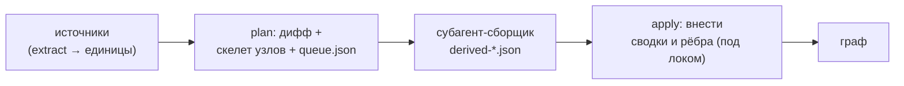
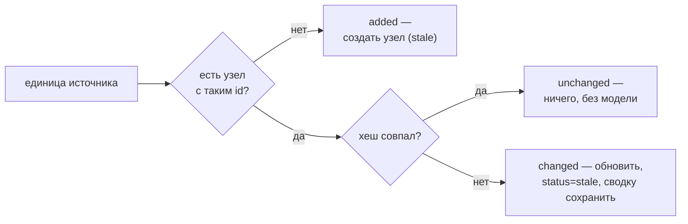
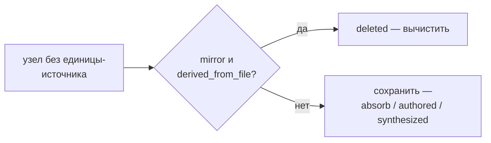

# 05 — Сверка и деривация

Сверка (`reconcile.py`) — сердце согласованности: она приводит граф в соответствие с кодом и документами на диске. Все её записи идут через транзакции хранилища (см. [Хранилище и транзакции](./03-storage.md)), поэтому любое прерывание восстановимо, а сравнение по контентным хешам делает её **идемпотентной**: повторный прогон без изменений не пишет ничего и не тратит ни одного вызова модели.

Сверка работает в **две фазы**, разделённые по принципу «детерминированный слой и слой суждения» (см. [Общая картина](./01-overview.md)): сначала детерминированная часть строит скелет узлов и очередь, затем смысловая часть (субагент) пишет сводки и связи, а результат вносится отдельной командой.

Здесь **деривация** — это смысловое доизвлечение: написание сводки узла и осмысленных рёбер языковой моделью поверх детерминированного скелета.

## Расположение и вызовы

Файл `reconcile.py` лежит в `skills/amg-bootstrap/scripts/`. Импортирует `graph_store` (транзакции, лок, восстановление) и `extract` / `load_config` из `extract_structure`. Детерминированную фазу (`plan` / `bootstrap`) и применение (`apply`) запускает скилл `amg-bootstrap`; сводки и рёбра для очереди пишет субагент `amg-builder`, а стратегические узлы создаёт `amg-synth` — их результат вносит в граф команда `apply`.

## Три команды

| Команда | Действие |
|---|---|
| `python reconcile.py bootstrap [<project_root>]` | построить или свести граф из любого состояния |
| `python reconcile.py plan [<project_root>]` | тот же дифф: детерминированные записи + очередь |
| `python reconcile.py apply <derivation.json> [<project_root>]` | внести семантический результат сборщика |

`bootstrap` и `plan` вызывают **одну и ту же** функцию `plan()` — это синонимы; «bootstrap» лишь отражает намерение «построить с нуля», а делает он ровно то же, что `plan` (граф строится из любого состояния, в том числе пустого). `project_root` по умолчанию — текущий каталог; корень графа — `<project_root>/.claude/amg`.

## Дифф: четыре случая

Функция `plan()` сравнивает единицы из источников (см. [Извлечение структуры](./architecture/04-ingest.md)) с узлами графа и относит каждую к одному из четырёх случаев. Решает **контентный хеш** (хеш-гейт — пропуск по совпадению хеша):

| Случай | Условие | Что делает |
|---|---|---|
| `added` | есть единица, узла с таким `id` нет | создать узел (статус `stale`), поставить в очередь на деривацию |
| `changed` | `source_hash` узла ≠ текущий хеш единицы | обновить структурные поля, статус → `stale`, **сохранить прежние сводку и рёбра**, поставить в очередь |
| `deleted` | узел-зеркало, чья единица-источник исчезла | вычистить узел |
| `unchanged` | хеши совпали | ничего — ни записи, ни вызова модели (истинная идемпотентность) |

Удаление обрабатывается отдельным проходом по узлам, у которых нет соответствующей единицы:

Итог `plan()` — словарь `{added, changed, deleted, unchanged, queued_for_semantic}`, где последнее число — размер очереди на деривацию.

## Правила сохранности

Это инварианты, защищающие знание от потери (формальное обоснование — в `consistency-model.md`):

- **Вычищаются только зеркала.** По диффу удаляются исключительно узлы с `source_kind = derived_from_file` **и** `policy = mirror`. Узлы `authored` (заметки, выводы модели), узлы впитанных источников (`absorb`) и синтезированные узлы (хабы) **никогда** не удаляются здесь — удаление папки `data/` не должно стирать впитанное знание.
- **При изменении прежняя сводка сохраняется.** На случай `changed` обновляются только структурные поля, а заработанные сводка и рёбра **остаются**, статус лишь переводится в `stale` до тех пор, пока новая деривация не будет надёжно зафиксирована. Сбой в середине деривации не теряет ничего: в графе всё ещё лежит прежняя осмысленная версия.
- **`mirror` и `absorb` при *изменении* источника ведут себя одинаково.** Пока источник на диске и его содержимое поменялось, узел обновляется и ставится в очередь на повторную деривацию **независимо от политики**. Различие политик проявляется **только при удалении** источника: зеркало вычищается, впитанный узел сохраняется (остаётся осиротевшая сводка). То есть `absorb` — это не «один раз и заморожено», а «переживает удаление источника».
- **Все записи транзакционны.** Перед любыми изменениями `plan()` и `apply()` вызывают `recover()` (исцеление недописанных транзакций), а сами изменения идут одной транзакцией — прерывание восстановимо (см. [Хранилище и транзакции](./03-storage.md)).

## Создание узла (детерминированный скелет)

Для случая `added` поля нового узла проставляются механически, без модели: `source_kind` = `derived_from_file`, `policy` наследуется от источника, `source_hash` = хеш единицы, `derived_from_hash` = `null` (ещё не выведено), `part_of` — первичное членство по родительскому каталогу (`_part_of_for`, вес `1.0`), `edges` — структурные рёбра (`_structural_edges`: `imports` с весом `0.6`, `calls` с весом `0.7`), `lang` = `working_language` из конфига, `status` = `stale`, `summary` = пустая строка, `updated` = текущее время. Полная схема полей — в разделе [Модель данных](./02-data-model.md). Тело узла записывается пустым; сводку и осмысленные рёбра добавит фаза деривации.

## Очередь деривации (`queue.json`)

После диффа `plan()` атомарно записывает очередь в `work/queue.json` — это вход для смысловой фазы. Формат: `{"generated": <время>, "units": [ … ]}`. Каждый элемент очереди (`_queue_item`) несёт `id`, `kind`, `source_path`, `category`, `content_sha`, а для заранее извлечённых бинарных форматов (PDF/DOCX/XLSX) — ещё и поле `text` с извлечённым текстом, чтобы сборщик написал сводку, **не открывая бинарный файл повторно** (см. [Извлечение структуры](./architecture/04-ingest.md)). В очередь попадают только узлы случаев `added` и `changed`; `unchanged` в неё не идут — это и есть экономия вызовов модели.

## Применение семантики (`apply_derivation`)

Субагент-сборщик читает очередь и пишет результат в файл `derived-*.json` — список элементов; команда `apply` вносит их в граф. Поддержаны **две формы** элемента:

- **Обновление** — `{id, summary?, lang?, edges?, part_of?, body?}` — обновляет узел с этим `id`. Несколько элементов могут адресовать **один и тот же** узел (например, отдельно `part_of`, отдельно ребро `supersedes`) — каждый *накапливается* на узле, не затирая результат предыдущего. Обновление выставляет `derived_from_hash` = `source_hash` и `status` = `active`: единица считается «выведенной» только когда её сводка и рёбра надёжно зафиксированы.
- **Создание** — `{id, type, summary?, lang?, part_of?, edges?, body?}` — если узла с таким `id` нет, узел **создаётся**. Так субагент-синтезатор материализует узлы-хабы и обзоры. Создаётся с `source_kind` = `synthesized` и `policy` = `authored` в бакете `_hubs`, поэтому позднейшая сверка никогда не вычистит его как «исчезнувший источник».

Если элемент-обновление пришёл на неизвестный `id` и в нём **нет** поля `type` — он пропускается и учитывается в `skipped_missing` (нельзя обновить то, чего нет, и нельзя понять, как создать). Рёбра объединяются функцией `_merge_edges` по ключу `(rel, to)`: при совпадении берётся **больший** вес, счётчик совместных активаций `coact` сохраняется; новое ребро получает `coact = 0` и вес по умолчанию `0.5`, если он не задан. Команда работает под локом и тоже вызывает `recover()` в начале; итог — `{applied, created, skipped_missing}`.

Техническая деталь надёжности: для существующего узла путь и тело читаются **без удаления** служебных полей, поэтому повторные элементы на тот же узел накапливаются, а не теряют путь на втором проходе; при записи служебные поля (с префиксом `_`) отбрасываются.

## Идемпотентность и крэш-безопасность

Идемпотентность — прямое следствие хеш-гейта: повторный `plan()` без изменений отнесёт все единицы к `unchanged`, не сделает ни одной записи, не поставит ничего в очередь и не вызовет модель. Перестроить граф из любого состояния безопасно в любой момент.

Крэш-безопасность складывается из трёх вещей: `recover()` в начале каждой команды исцеляет недописанные транзакции; все изменения идут одной транзакцией хранилища (фиксация атомарна); очередь пишется атомарной записью. Поэтому сбой в любой точке безопасен: упало во время деривации — структурные узлы остаются `stale` с прежними сводками, очередь сохранена, достаточно перезапустить сборщик и `apply`; упало во время `apply` — транзакция восстановится при следующем запуске.

## Параллельные сборщики

Смысловую фазу можно вести параллельно: несколько сборщиков пишут в **раздельные** файлы `derived-*.json`, не трогая граф, а вносит их **последовательная** команда `apply` под локом. Так гонок нет по построению — это та же модель параллелизма, что описана в разделе [Хранилище и транзакции](./03-storage.md) (единственный пишущий процесс плюс чтения без блокировок).

## Командная строка

| Команда | Аргументы | Лок |
|---|---|---|
| `bootstrap` / `plan` | `[<project_root>]` | под локом (внутри `plan()`) |
| `apply` | `<derivation.json> [<project_root>]` | под локом |

Обе фазы выполняются под единственным локом на запись и предваряются восстановлением.

## Дальше

- [Карта документации](./README.md) — оглавление архитектуры и возврат к началу.
- [02 — Модель данных](./02-data-model.md) — полная схема полей узла, идентификаторы, бакеты, статусы, рёбра.
- [03 — Хранилище и транзакции](./03-storage.md) — транзакции, лок, восстановление, на которых стоит сверка.
- [04 — Извлечение структуры](./04-ingest.md) — откуда берутся единицы, контентный хеш, политики источников.
- [07 — Консолидация](./07-consolidation.md) — что происходит с весами и сводками после сверки.
- [08 — Субагенты и скиллы](./08-agents-skills.md) — сборщик и синтезатор, читающие очередь и пишущие `derived-*.json`.
