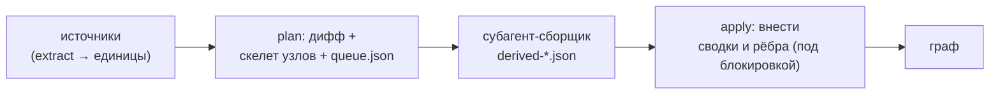
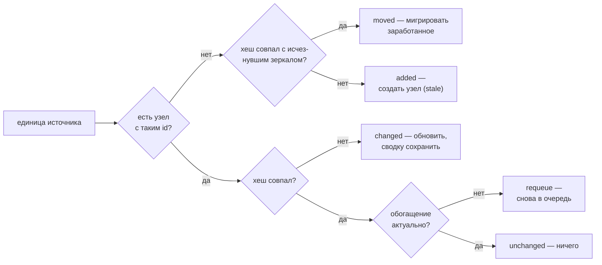
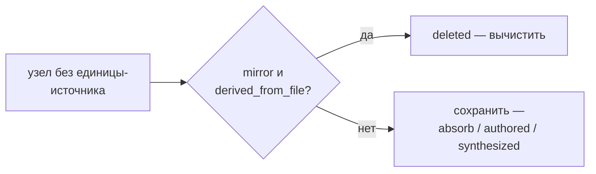

# 05 — Сверка и семантическое обогащение

Сверка (`reconcile.py`) — сердце согласованности: она приводит граф в соответствие с кодом и документами на диске. Все её записи идут через транзакции хранилища (см. [Хранилище и транзакции](./03-storage.md)), поэтому любое прерывание восстановимо, а сравнение по контентным хешам делает её **идемпотентной**: повторный прогон без изменений не пишет ничего и не тратит ни одного вызова модели.

Сверка работает в **две фазы**, разделённые по принципу «детерминированный слой и слой суждения» (см. [Общая картина](./01-overview.md)): сначала детерминированная часть строит скелет узлов и очередь, затем смысловая часть (субагент) пишет сводки и связи, а результат вносится отдельной командой.

Здесь **семантическое обогащение** (англ. derivation, отсюда имена файлов `derived-*.json`) — это смысловое доизвлечение: написание сводки узла и осмысленных рёбер языковой моделью поверх детерминированного скелета.

## Расположение и вызовы

Файл `reconcile.py` лежит в `skills/amg-bootstrap/scripts/`. Импортирует `graph_store` (транзакции, блокировка, восстановление) и `extract` / `load_config` из `extract_structure`. Детерминированную фазу (`plan` / `bootstrap`) и применение (`apply`) запускает скилл `amg-bootstrap`; сводки и рёбра для очереди пишет субагент `amg-builder`, а стратегические узлы создаёт `amg-synth` — их результат вносит в граф команда `apply`.

## Три команды

| Команда | Действие |
|---|---|
| `python reconcile.py bootstrap [<project_root>] [--root <agent_dir>]` | построить или свести граф из любого состояния |
| `python reconcile.py plan [<project_root>] [--root <agent_dir>]` | тот же дифф: детерминированные записи + очередь |
| `python reconcile.py apply <derivation.json> [<project_root>] [--root <agent_dir>]` | внести семантический результат сборщика |

`bootstrap` и `plan` вызывают **одну и ту же** функцию `plan()` — это синонимы; «bootstrap» лишь отражает намерение «построить с нуля», а делает он ровно то же, что `plan` (граф строится из любого состояния, в том числе пустого). `project_root` по умолчанию — текущий каталог; это корень **источников** (откуда извлекаются единицы), и он отделён от корня графа.

Корень графа — `<каталог агента>/amg` — разрешается функцией `graph_store.resolve_amg_root` по цепочке (первое совпадение побеждает): явный `--root <agent_dir>` → переменная окружения `AMG_AGENT_DIR` → поиск `amg/config.yml` вверх от `project_root`, причём на каждом уровне проверяется и `<каталог>/.claude/amg/config.yml` — так глобально установленный движок находит граф проекта → каталог самого движка, если его `amg/` уже существует (дев-раскладка, локальная установка) → умолчание `<project_root>/.claude/amg`. Для типовой установки результат совпадает с прежним: `<project_root>/.claude/amg` (`.claude` — умолчание Claude Code; в иной среде это настроенный каталог агента, например `.agents`).

## Дифф: случаи сверки

Функция `plan()` сравнивает единицы из источников (см. [Извлечение структуры](./04-ingest.md)) с узлами графа. Решает **контентный хеш** (фильтр по хешу — пропуск по совпадению хеша), но сверяется не только источник: учитывается и отставание самого обогащения:

| Случай | Условие | Что делает |
|---|---|---|
| `added` | есть единица, узла с таким `id` нет, перенос не опознан | создать узел (статус `stale`), поставить в очередь на обогащение |
| `changed` | `source_hash` узла ≠ текущий хеш единицы | обновить структурные поля, **пересобрать структурные рёбра**, статус → `stale`, сохранить прежние сводку и смысловые рёбра, поставить в очередь |
| `moved` | исчезнувший узел-зеркало и новая единица с **одинаковым** хешем | мигрировать заработанное на новый id, перенаправить входящие ссылки; выведенный узел приезжает `active` и в очередь не идёт |
| requeue | хеш совпал, но `derived_from_hash` ≠ хешу либо `status: stale` | вернуть единицу в очередь; файл узла не переписывается |
| дрейф указателя | хеш совпал, но `lineno`/`qualname`/`policy`/`type` разошлись с единицей | тихо обновить только эти поля, без повторного обогащения (счётчик `pointer_refreshed`); `type` зеркала принадлежит извлечению — так старые грамматические типы tree-sitter сводятся к канону |
| `deleted` | узел-зеркало, чья единица исчезла и не опознана как перенос | вычистить узел |
| `unchanged` | хеши совпали, обогащение актуально | ничего — ни записи, ни вызова модели (истинная идемпотентность) |

Удаление обрабатывается отдельным проходом по узлам, у которых нет соответствующей единицы (узлы, опознанные как перенос, в него не попадают — их старые файлы уже удалены миграцией):

Итог `plan()` — словарь `{added, changed, moved, deleted, unchanged, requeued_stale, pointer_refreshed, queued_for_semantic}`; последнее число — размер очереди на обогащение (added + changed + requeue + недовыведенные перенесённые).

## Правила сохранности

Это инварианты, защищающие знание от потери (формальное обоснование — в `consistency-model.md`):

- **Вычищаются только зеркала.** По диффу удаляются исключительно узлы с `source_kind = derived_from_file` **и** `policy = mirror`. Узлы `authored` (заметки, выводы модели), узлы впитанных источников (`absorb`) и синтезированные узлы (хабы) **никогда** не удаляются здесь — удаление папки `data/` не должно стирать впитанное знание.
- **Перенос не стирает заработанное.** Пара «исчезнувшее зеркало + новая единица» с одинаковым контентным хешем — это перенос или переименование: на новый id мигрируют сводка, `lang`, смысловые рёбра с их `coact`, `derived_from_hash` и мультичленство (первичная тема переписывается со старого каталога на новый); цели рёбер внутри переносимого файла переводятся на новый путь, а входящие рёбра и членства остальных узлов перенаправляются. Чистый перенос не тратит ни одного вызова модели. Близнецы (одинаковое содержимое в нескольких файлах) паруются детерминированно по отсортированным id; перенос с одновременной правкой содержимого не распознаётся (хеши разные) — это обычные `deleted`+`added`. Перенос absorb-источника тоже не распознаётся: его узел дифф не удаляет, поэтому остаётся сирота плюс новый узел, а такие почти-дубли сливает консолидация.
- **При изменении прежняя сводка сохраняется.** На случай `changed` обновляются структурные поля и пересобираются структурные рёбра, а заработанные сводка и смысловые рёбра **остаются**, статус лишь переводится в `stale` до тех пор, пока новое обогащение не будет надёжно зафиксировано. Сбой в середине обогащения не теряет ничего: в графе всё ещё лежит прежняя осмысленная версия.
- **`mirror` и `absorb` при *изменении* источника ведут себя одинаково.** Пока источник на диске и его содержимое поменялось, узел обновляется и ставится в очередь на повторное обогащение **независимо от политики**. Различие политик проявляется **только при удалении** источника: зеркало вычищается, впитанный узел сохраняется (остаётся осиротевшая сводка). То есть `absorb` — это не «один раз и заморожено», а «переживает удаление источника».
- **Сохранённые сессии — тот же механизм.** Дамп диалога ингестируется как обычный источник (нарезатель `session`, см. [Извлечение структуры](./04-ingest.md)), а его политику задаёт ключ `session_policy`: `absorb` (по умолчанию) — диалог становится дистиллятом и переживает удаление файла дампа; `mirror` — узлы существуют, пока существует файл, и любую деталь диалога можно достать целиком. Никакого особого кода сверки сессии не требуют.
- **Все записи транзакционны.** Перед любыми изменениями `plan()` и `apply()` вызывают `recover()` (восстановление недописанных транзакций), а сами изменения идут одной транзакцией — прерывание восстановимо (см. [Хранилище и транзакции](./03-storage.md)).

## Создание узла (детерминированный скелет)

Для случая `added` поля нового узла проставляются механически, без модели: `source_kind` = `derived_from_file`, `policy` наследуется от источника, `qualname` и `lineno` — указатель единицы внутри файла, `source_hash` = хеш единицы, `derived_from_hash` = `null` (ещё не выведено), `part_of` — первичное членство по родительскому каталогу (`_part_of_for`, вес `1.0`), `edges` — структурные рёбра (`_structural_edges`: `imports` с весом `0.6`, `calls` с весом `0.7`; каждое помечено `origin: structural`), `lang` = `working_language` из конфига (язык будущей сводки), `status` = `stale`, `summary` = пустая строка, `updated` = текущее время. Полная схема полей — в разделе [Модель данных](./02-data-model.md). Тело узла записывается пустым; сводку и осмысленные рёбра добавит фаза обогащения.

Цель ребра `imports` для **внутрипроектного** модуля резолвится в id его узла по карте «точечное имя → путь» (`_module_map`): для каждого Python-модуля проекта регистрируются полный точечный путь и его суффиксы (`src/billing.py` → `src.billing` и `billing`; `pkg/__init__.py` → `pkg`), а неоднозначный суффикс — два одноимённых файла в разных каталогах — не резолвится вовсе: неверное ребро хуже висячего, полный путь остаётся однозначным. Импорт stdlib или сторонней библиотеки остаётся точечным именем (`code:json`) — такое ребро фиксирует факт импорта во frontmatter, а при извлечении отбрасывается как висячее. Цель `calls` ищется как функция в том же файле; межфайловые вызовы по-прежнему игнорируются до разрешения.

## Обновление при изменении источника (`changed`)

При `changed` обновляются все структурные поля узла (`source_hash`, `type`, `source_path`, `policy`, `qualname`, `lineno`), а **структурные рёбра пересобираются** свежим извлечением (`_refresh_structural_edges`): прежние рёбра с `origin: structural` заменяются новыми — новый вызов даёт ребро, исчезнувший его теряет, — причём ребро, пережившее правку, наследует заработанные вес и счётчик `coact`. Рёбра остальных происхождений не трогаются: заработанная семантика переживает правку источника. Поле `lang` узла намеренно **не** обновляется — это язык уже написанной сводки, он самокорректируется при повторном обогащении.

Происхождение ребра хранится в его поле `origin`: `structural` — детерминированное извлечение; `semantic` — рёбра обогащения; `synthesized` — рёбра создаваемых хабов; `consolidation` — рёбра, созданные действиями консолидации (см. [Модель данных](./02-data-model.md)). Рёбра без `origin` (созданные до появления поля) при пересборке трактуются как структурные, если их тип — `imports`/`calls` (единственные типы, которые извлечение когда-либо порождало); полную разметку legacy-рёбер выполняет `migrate_schema.py` (Этап 1, задача 7).

## Очередь обогащения (`queue.json`)

После диффа `plan()` атомарно записывает очередь в `work/queue.json` — это вход для смысловой фазы. Формат: `{"generated": <время>, "units": [ … ]}`. Каждый элемент очереди (`_queue_item`) несёт `id`, `kind`, `source_path`, `category`, `content_sha`, а также `qualname`, `lineno` и `lang`, чтобы сборщик сфокусировался на нужном срезе источника; `lang` здесь — **язык источника** (`python`, `markdown`, …), не путать с полем `lang` узла (язык сводки). Для заранее извлечённых бинарных форматов (PDF/DOCX/XLSX) элемент несёт ещё и поле `text` с извлечённым текстом, чтобы сборщик написал сводку, **не открывая бинарный файл повторно** (см. [Извлечение структуры](./04-ingest.md)).

Очередь **целиком пересоздаётся каждым `plan()` из состояния графа**: в неё попадают случаи `added` и `changed` плюс все недовыведенные узлы (requeue — `derived_from_hash` отстал или `status: stale`). Поэтому очередь пишется атомарно, но отдельно от транзакции узлов без риска: сбой между транзакцией и записью очереди (или потеря `queue.json`) самовосстанавливается следующим же `bootstrap`. Выведенные `unchanged`-узлы в очередь не идут — это и есть экономия вызовов модели.

## Применение семантики (`apply_derivation`)

Субагент-сборщик читает очередь и пишет результат в файл `derived-*.json` — список элементов; команда `apply` вносит их в граф. Поддержаны **две формы** элемента:

- **Обновление** — `{id, summary?, lang?, edges?, part_of?, body?}` — обновляет узел с этим `id`. Несколько элементов могут адресовать **один и тот же** узел (например, отдельно `part_of`, отдельно ребро `supersedes`) — каждый *накапливается* на узле, не затирая результат предыдущего. В `active` узел переводится **только** если элемент несёт новую `summary` (либо узел не `derived_from_file` — синтезированные и авторские живут `active`): тогда выставляется `derived_from_hash` = `source_hash`. Элемент только с рёбрами или `part_of` оставляет source-узел `stale` — и сверка продолжает возвращать его в очередь, пока сводка не появится: единица считается «выведенной» только когда её сводка надёжно зафиксирована.
- **Создание** — `{id, type, summary?, lang?, part_of?, edges?, body?}` — если узла с таким `id` нет, узел **создаётся**. Так субагент-синтезатор материализует узлы-хабы и обзоры. Создаётся с `source_kind` = `synthesized` и `policy` = `authored` в бакете `_hubs`, поэтому позднейшая сверка никогда не вычистит его как «исчезнувший источник».

Если элемент-обновление пришёл на неизвестный `id` и в нём **нет** поля `type` — он пропускается и учитывается в `skipped_missing` (нельзя обновить то, чего нет, и нельзя понять, как создать). Рёбра объединяются функцией `_merge_edges` по ключу `(rel, to)`: при совпадении берётся **больший** вес, счётчик совместных активаций `coact` сохраняется; новое ребро получает `coact = 0` и вес по умолчанию `0.5`, если он не задан. Входящие рёбра получают `origin: semantic` (у создаваемых хабов — `synthesized`); существующее ребро свой `origin` сохраняет — структурное ребро, подтверждённое слоем суждения, остаётся структурным (его всё равно можно переизвлечь).

Членства объединяет `_merge_part_of`: темы **накапливаются** — поздний элемент не затирает членство, добавленное ранним; для совпавшей темы побеждает **новый** вес (актуальное суждение слоя — взятие максимума делало бы веса монотонно растущими и мешало бы перебалансировке); если сумма весов превысила 1, доли нормализуются к симплексу (при `weights.part_of_renormalize`, то же правило, что в консолидации). Команда работает под блокировкой и тоже вызывает `recover()` в начале; итог — `{applied, created, skipped_missing}`.

Техническая деталь надёжности: для существующего узла путь и тело читаются **без удаления** служебных полей, поэтому повторные элементы на тот же узел накапливаются, а не теряют путь на втором проходе; при записи служебные поля (с префиксом `_`) отбрасываются.

## Идемпотентность и устойчивость к сбоям

Идемпотентность — прямое следствие фильтра по хешу: повторный `plan()` без изменений отнесёт все **выведенные** единицы к `unchanged`, не сделает ни одной записи и не вызовет модель; недовыведенные он лишь снова положит в очередь (без записей в граф) — это не нарушение идемпотентности, а её рабочая форма: очередь каждый раз выводится из состояния графа. Перестроить граф из любого состояния безопасно в любой момент.

Устойчивость к сбоям складывается из трёх вещей: `recover()` в начале каждой команды восстанавливает недописанные транзакции; все изменения идут одной транзакцией хранилища (фиксация атомарна); очередь пишется атомарной записью. Поэтому сбой в любой точке безопасен: упало во время обогащения — структурные узлы остаются `stale` с прежними сводками, очередь сохранена, достаточно перезапустить сборщик и `apply`; упало во время `apply` — транзакция восстановится при следующем запуске.

## Параллельные сборщики

Смысловую фазу можно вести параллельно: несколько сборщиков пишут в **раздельные** файлы `derived-*.json`, не трогая граф, а вносит их **последовательная** команда `apply` под блокировкой. Так гонок нет по построению — это та же модель параллелизма, что описана в разделе [Хранилище и транзакции](./03-storage.md) (единственный пишущий процесс плюс чтения без блокировок).

## Командная строка

| Команда | Аргументы | Блокировка |
|---|---|---|
| `bootstrap` / `plan` | `[<project_root>] [--root <agent_dir>]` | под блокировкой (внутри `plan()`) |
| `apply` | `<derivation.json> [<project_root>] [--root <agent_dir>]` | под блокировкой |

Обе фазы выполняются под единственной блокировкой на запись и предваряются восстановлением. Флаг `--root` задаёт каталог агента явно; без него корень графа разрешается цепочкой, описанной в разделе «Три команды».

## Дальше

- [Карта документации](./README.md) — оглавление архитектуры и возврат к началу.
- [02 — Модель данных](./02-data-model.md) — полная схема полей узла, идентификаторы, бакеты, статусы, рёбра.
- [03 — Хранилище и транзакции](./03-storage.md) — транзакции, блокировка, восстановление, на которых стоит сверка.
- [04 — Извлечение структуры](./04-ingest.md) — откуда берутся единицы, контентный хеш, политики источников.
- [07 — Консолидация](./07-consolidation.md) — что происходит с весами и сводками после сверки.
- [08 — Субагенты и скиллы](./08-agents-skills.md) — сборщик и синтезатор, читающие очередь и пишущие `derived-*.json`.
