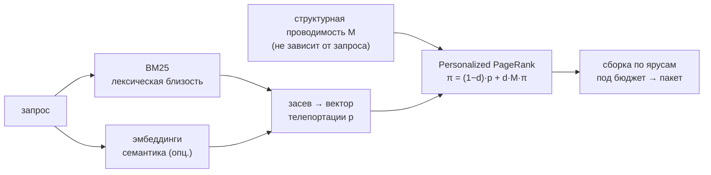
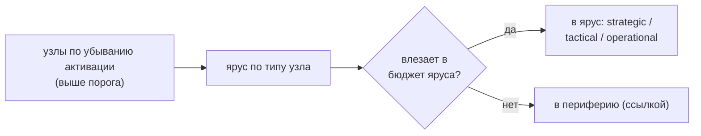

# 06 — Извлечение из графа

Извлечение (`retrieve.py`) по запросу собирает **пакет контекста** под бюджет: модель видит стратегическое окружение плюс оперативные детали, не загружая весь проект. Метод — распространение активации, формализованное как **Personalized PageRank со смещением по запросу** (Haveliwala 2002; та же конструкция, что у HippoRAG 2024 над графом знаний); теоретическое обоснование — в [теории](../THEORY.md), разделы 6–7.

```
π = (1 − d) · p  +  d · M · π
```

Здесь `M` — матрица переходов из **структурной проводимости** рёбер (не зависит от запроса — именно это сохраняет многошаговость), а `p` — **вектор телепортации**, кодирующий релевантность запросу. Релевантность *смещает* распределение активации к нужной области графа, **не перекрывая** рёбра (принцип «смещать, а не запирать» из [теории](../THEORY.md), раздел 6.4). Извлечение **не изменяет граф**: оно никогда не трогает узлы и рёбра, а пишет лишь собственный пакет и журнал ко-активаций (см. ниже).



## Расположение и вызовы

Файлы `retrieve.py` и `embed.py` лежат в `skills/amg-retrieve/scripts/`. `retrieve.py` опционально импортирует `embed` (семантический засев) и обращается к графу **только на чтение**; пишет лишь `cache/pack.md` и `work/coactivation.log`. Запускается скиллом `amg-retrieve` через субагент `amg-retriever`, работающий в изолированном контексте и только на чтение. Рядом в том же каталоге — `eval_retrieval.py` (метрики качества, см. [Измерение и инструменты](./10-eval-tools.md)).

## Загрузка узлов и текст для поиска

`load_nodes` читает все узлы и для каждого собирает «мешок слов» для лексического поиска: хвост идентификатора (с заменой `::`, `/`, `_` на пробелы), сводку, темы из `part_of` и первые 600 символов тела. Токенизация — по **юникодным** словам (`\w+` с флагом Unicode): это критично, потому что поиск только по ASCII молча терял бы кириллицу, CJK и прочие неузкие письменности — и русскоязычный граф был бы невидим для BM25, а любой нелатинский запрос не засевал бы ничего.

## Производный индекс под `load_nodes` (ускорение на больших графах)

`load_nodes` — единственный по-запросный горячий путь, и на больших графах он дорог: полный обход `nodes/*.md` с `yaml.safe_load` каждого файла (на ~7600 узлов — около 8 секунд). Поэтому рядом с пакетом и кэшем эмбеддингов лежит **производный read-индекс** `cache/index.sqlite` — генерируемый, полностью пересобираемый кэш уже разобранных полей узла, чтобы запрос читал одну таблицу SQLite вместо тысяч файлов. Это реализация решения дорожной карты §4.1 («Markdown — канон, SQLite — производный ускоряющий индекс»). Модуль — `index_store.py` рядом с `retrieve.py`.

**Хранит проекцию, не весь граф.** На узел индекс держит ровно то, что нужно `load_nodes` для BM25 и сборки пакета: `id`, `type`, `status`, `summary`, `source_path`, `lineno`, готовый searchable-`text` (тот же «мешок слов»), `edges`/`part_of` (JSON) и тело. Это **не** весь frontmatter (происхождения, хешей, политики, `qualname`, `lang`, поля тегов там нет) и **не** исходные файлы. Markdown остаётся каноном, индекс — одноразовый кэш; **читает его только извлечение** (у `reconcile`/`consolidate` свой полный обход frontmatter). Форма словаря, который отдаёт `load_nodes`, от индекса не зависит (скан и индекс собирают узел общим кодом), поэтому BM25, `build_adjacency` и сборка пакета о нём не знают.

**Только скорость, не качество.** Выход из индекса побайтно совпадает со сканом (токены пересчитываются тем же `WORD_RE`), а при любом рассогласовании, порче или отсутствии файла `load_nodes` **безусловно** откатывается на скан — индекс не отдаёт неверного результата, только более быстрый путь. Извлечение по индексу даёт тот же ранжир и тот же пакет, что скан (на демо `eval --make-demo` hop-recall не меняется).

**Свежесть — дешёвой сигнатурой.** Свежесть проверяется не чтением файлов, а stat-обходом `nodes/` (путь → mtime + size), хеш которого хранится **внутри** того же SQLite (мета-строка — данные и их freshness-тег пишутся атомарно, без отдельного файла-спутника, который мог бы рассинхрониться). Запрос сверяет свежую сигнатуру с хранимой: совпала → читать индекс; нет / порча / нет файла → скан и пересборка. Сигнатуру берут **до** скана, поэтому индекс, собранный сканом, гонявшимся с записью, не будет ошибочно сочтён свежим — следующая проверка его пересоберёт.

**Ведут его сами писатели — автоматически, без настройки.** После фиксации транзакции каждый писатель графа (`reconcile.plan`/`apply_derivation`, `consolidate.fold_weights`/`apply_actions`, `notes.add_note`, `migrate_schema`) под той же блокировкой делает **инкрементальный** upsert изменённых строк и обновляет сигнатуру — одной SQLite-транзакцией, дёшево даже для одиночной заметки (не полная пересборка). Если индекса ещё нет, читатель построит его лениво при первом запросе. **Конфиг-ключа у индекса нет** — он полностью автоматический и одноразовый: «сломался — удалить, пересоберётся». Порог по размеру не вводится: индекс используется всегда, когда свеж. Измеренный выигрыш `load_nodes` ≈ 15× (7600 узлов: ~8 с → ~0.5 с; пересборка ~0.15 с); на малых графах оверхед неощутим — индекс выигрывает уже с нескольких десятков узлов.

## Лексический засев (BM25)

Базовый засев — **BM25** (классическая формула ранжирования по совпадению слов): класс `BM25` с параметрами `k1 = 1.5`, `b = 0.75` и обратной частотой `idf = log(1 + (N − n + 0.5)/(n + 0.5))`. Для запроса он даёт каждому узлу лексическую оценку релевантности; узлы с наибольшим совпадением становятся затравками (`seeds`).

## Семантический засев (эмбеддинги, опционально)

Модуль `embed.py` добавляет к засеву **смысловую** близость — это опциональная надстройка над лексическим засевом. Лексический поиск промахивается на перефразировках: запрос «как обрабатываются сбои оплаты» и узел «повторять при ошибке шлюза» почти не пересекаются по словам, и нужный узел не засевается. Эмбеддинги (числовые векторы смысла) зажигают вектор телепортации **по смыслу, а не только по словам**. Устройство:

- **Бэкенды, от лёгкого к тяжёлому** (`get_embedder` по конфигу `embeddings`): `model2vec` — статические эмбеддинги, быстрые, только CPU, без `torch` (`pip install model2vec`); `sentence-transformers` — полноценные трансформерные эмбеддинги, тяжелее, требуют `torch`. При `backend: auto` бэкенды пробуются **от лёгкого к тяжёлому** (сначала `model2vec`), берётся первый загрузившийся. Модели по умолчанию для английского `working_language` — `minishlab/potion-retrieval-32M` и `all-MiniLM-L6-v2` соответственно (для не-английских проектов выбираются многоязычные модели — см. ниже «Многоязычность»); любую можно переопределить ключом `model`.
- **Что эмбеддится** (`node_text`): сводка узла плюс его идентификатор (идентификаторы несут смысл), с откатом к `id`, пока сводки нет.
- **Кэш с фильтром по хешу** (`node_embeddings`): векторы хранятся на диске в `cache/embeddings.json` и пересчитываются **только для узлов, чей эмбеддируемый текст изменился** (тот же приём content-hash, что и везде в AMG); записи удалённых узлов вычищаются. Поэтому стоимость платится один раз на изменённый узел, а не на каждый запрос.
- **Оценка** (`seed_scores`): косинусная близость запроса к каждому узлу в диапазоне `[0, 1]` (векторы единичные, поэтому скалярное произведение и есть косинус), либо `None`, если бэкенд недоступен.
- **Смешивание только в телепортацию.** `retrieve.py` подмешивает семантику в вектор телепортации с коэффициентом `blend` (0 = чистый BM25, 1 = чистая семантика; по умолчанию `0.5`), нормируя обе оценки: `seed = (1 − blend)·BM25ₙ + blend·эмбеддингиₙ`. Распространение активации (PPR) и сборка пакета при этом **не меняются** — эффект эмбеддингов изолирован и измерим (полнота с эмбеддингами и без), а плохая модель эмбеддингов не может испортить многошаговую структуру.
- **Мягкий откат.** Если бэкенд не установлен или модель не загрузилась, `get_embedder` возвращает `None`, и извлечение остаётся чисто-лексическим (поведение не меняется).
- **Многоязычность.** Диагностическая команда `python embed.py` сообщает, какие бэкенды установлены, грузится ли модель, и проверяет кросс-язычность (близость `routing`↔`роутинг`). Для не-английского `working_language` движок **сам выбирает многоязычную модель по умолчанию** (`model2vec` → `potion-multilingual-128M`; `sentence-transformers` → `paraphrase-multilingual-MiniLM-L12-v2`), иначе семантическая близость между языками будет низкой; для английских проектов берётся retrieval-настроенная `potion-retrieval-32M` (либо `all-MiniLM-L6-v2`). Эмбеддинг — намеренно *лёгкое* обогащение поверх BM25, поэтому в умолчания идут лёгкие, retrieval/многоязычно-настроенные модели, а не тяжёлые лидеры рейтингов; любую модель можно задать ключом `model`. Сравнить выдачу с эмбеддингами и без — `eval_retrieval.py --compare-embeddings` (см. [Измерение и инструменты](./10-eval-tools.md)).

О выборе «лёгкая против тяжёлой» стоит сказать отдельно, потому что вопрос возникает сразу. Лёгкая многоязычная модель по умолчанию (`potion-multilingual-128M`) — не игрушка: на кросс-язычной проверке (английский запрос про ротацию ключей шифрования над русской сводкой, рядом с английским ложным другом «tire rotation») она уверенно вытащила нужный русский узел — ровно так же, как тяжёлая `paraphrase-multilingual-MiniLM-L12-v2`, и там, где чистый BM25 промахивался. Это, однако, **не** доказывает их равенства вообще: проверен один несложный случай, а статическая модель (по существу — заранее выученная таблица векторов) имеет реальный потолок качества по сравнению с полным трансформером, и на более длинных, тонких или многозначных запросах тяжёлая модель обычно выходит вперёд. Поэтому вывод осторожный и практический: лёгкий многоязычный дефолт — **разумная отправная точка даже для русского**, а не заведомо слабый вариант; а нужен ли переход на тяжёлую модель именно на вашем материале, честнее показывает измерение на конкретном графе (`--compare-embeddings`), чем общее правило.

## Вектор телепортации

Итоговый вектор телепортации — это засев плюс «пол» `seed_floor` (по умолчанию `0.0` — чистая релевантность; значение больше нуля раздаёт каждому узлу базовую массу). Внутри PPR вектор нормируется к сумме 1.

## Матрица переходов: структурная проводимость

`build_adjacency` строит матрицу `M` из проводимости рёбер `c(u, v) = w_ребра · β(rel)`, где `w_ребра` — выученная сила связи, а `β(rel)` — приоритет типа ребра. Проводимость **симметризуется** (масса течёт в обе стороны: ассоциация двунаправленна), несколько рёбер между той же парой суммируются, а рёбра, чья цель — не существующий узел, отбрасываются (поэтому строки `part_of`, не называющие узла, просто игнорируются). Членство `part_of` тоже даёт рёбра (с приоритетом типа `part_of`). Ключевое свойство: матрица **не зависит от запроса** — это и сохраняет достижимость по цепочкам рёбер (многошаговость).

Проводимость пересобирается на каждый запрос из загруженных узлов и **не кэшируется отдельно**: измерение показало, что `build_adjacency` — доли процента стоимости `load_nodes` (десятки мс против секунд), а сериализация большого блоба рёбер на крупном графе рискует стоить дороже самой пересборки. Производный индекс под `load_nodes` (выше) уже снимает доминирующую стоимость, а проводимость считается над быстро загруженными из него узлами (решение §4.1; если измерение на десятках тысяч узлов это опровергнет — кэш вернут бинарным форматом, не JSON).

Приоритеты `β` задаются блоком `relation_priors` в конфигурации, со значением по умолчанию `relation_prior_default = 0.5` для не перечисленных типов; полный список и значения — в разделе [Справочник конфигурации](./09-config.md). Ориентировочно: `documents`/`implements`/`specifies` ≈ 0.9, `calls`/`depends_on` ≈ 0.8, `defines`/`part_of` ≈ 0.7, `imports`/`refines`/`exemplifies` ≈ 0.6, `relates_to` ≈ 0.5, `supersedes`/`contradicts` ≈ 0.3 — то есть сильные смысловые связи проводят активацию охотнее слабых, а ссылка на снятое или противоречащее утверждение (`supersedes`/`contradicts`) проводит слабо при обычном поиске.

## Personalized PageRank

`personalized_pagerank` решает уравнение **степенным методом** (итеративно): на каждом шаге узел раздаёт долю своей массы соседям пропорционально проводимости рёбер (множитель `d`), а доля `1 − d` возвращается по вектору телепортации. **Тупиковые узлы** (без исходящих рёбер) отдают свою массу обратно через телепортацию, чтобы вероятность не «утекала». Параметры из конфигурации: `damping` (`d`) `0.85` — насколько далеко растекается активация; `max_hops` `30` — потолок числа итераций (больше итераций → шире охват); `convergence_tol` `1e-6` — порог сходимости по сумме модулей изменений. Сходимость гарантирована: при `0 < d < 1` итерация является сжатием (теорема Перрона–Фробениуса), поэтому несколько проходов сходятся к единственному распределению. Релевантность входит только в `p`, а `M` от запроса не зависит — это и есть «смещать, а не запирать».

## Статусный приоритет

Перед сборкой пакета итоговая активация домножается на **статусный приоритет** узла (`status_prior`, функция `_apply_status_prior`). Это переранжирование по *валидности* узла, а не вентиль на рёбрах: распространение уже прошло, поэтому многошаговость не страдает. По умолчанию: `active` и `stale` — `1.0`; `superseded` — `0.2` (снятое утверждение не должно конкурировать как актуальный факт); запланированный `disputed` — `0.5`. Важная тонкость: `stale` (источник изменился, сводка отстала) **не штрафуется** — такой узел часто самый горячий (свежеправленный код); вместо штрафа он помечается в пакете (см. ниже). Значения переопределяются ключом `retrieval.status_prior` (по отдельным ключам).

## Сборка пакета по ярусам

`assemble_pack` превращает активацию в пакет под бюджет. Сначала отбрасываются узлы ниже порога `activation_threshold` (`0.02`), остальные ранжируются по убыванию активации. Каждый узел попадает в **ярус по своему типу** (`TIER_OF_TYPE`): `hub`/`overview` и авторские решения `decision`/`adr` → `strategic` (решения — ценное стратегическое знание, всплывает рано); `module`/`class`/`package` → `tactical`; `function`/`section`/`file`/`method` → `operational` (тип по умолчанию — `operational`). Узлы добавляются **жадно**: пока в ярусе есть бюджет — узел идёт в ярус, иначе — в **периферию** (списком ссылок). Периферия обрезается до `periphery_links`.



Бюджеты ярусов берутся из конфигурации (`token_budget`; действующие значения — `strategic` 4000, `tactical` 10000, `operational` 24000, `periphery_links` 60; полностью — в разделе [Справочник конфигурации](./09-config.md)). Длина оценивается грубо как ~4 символа на токен. Отрисовка зависит от яруса: в `operational` для кода это строка `путь:строка — имя — сводка` (указатель, а не тело; `строка` берётся из поля `lineno` узла, которое сверка пишет всегда — без него остался бы указатель без номера), для документов и заметок — `### id` + сводка + тело; в `strategic`/`tactical` — `- id — сводка`. Исключение — авторские решения `decision`/`adr` (`DOC_BODY_TYPES`): их тело-мотивировку разворачивают **в любом ярусе**, потому что ценность решения именно в обосновании, а не в ссылке. Узлы со статусом `stale` получают в пакете приписку-предупреждение (`_STALE_MARK`: «сводка устарела — открой источник»), чтобы модель перепроверила их по первоисточнику. Жадная укладка близка к оптимуму: полезность субмодулярна, поэтому результат не хуже `(1 − 1/e)` от оптимума (см. [теорию](../THEORY.md), раздел 7).

## Что извлечение пишет (и чего не трогает)

Относительно графа извлечение **только для чтения**: оно никогда не меняет узлы и рёбра. Его записи необязательны и без блокировок; при выключенных эмбеддингах их две, при включённом семантическом засеве — три:

- **Пакет** `cache/pack.md` — атомарной записью (готовый контекст для модели).
- **Журнал ко-активаций** `work/coactivation.log` — дописыванием (append-only): пары узлов, оказавшихся вместе в пакете и связанных ребром, записываются строкой JSON `{ts, q, coactivated}`. Это хеббовский сигнал «сработали вместе — связь крепнет», который позже сворачивает в веса рёбер консолидация (см. [Консолидация](./07-consolidation.md)). Извлечение веса не меняет — только копит сигнал. **Связка с `--no-pack`:** в CLI журналирование привязано к записи пакета (`log_coactivation = write_pack`), поэтому флаг `--no-pack` выключает *и* запись `cache/pack.md`, *и* этот журнал ко-активаций. Чтобы развести их (собрать пакет без хеббова сигнала или наоборот), вызывают `retrieve()` напрямую с раздельными `write_pack`/`log_coactivation`.
- **Кэш эмбеддингов** `cache/embeddings.json` — только при включённом семантическом засеве; пишется вне транзакций и без `fsync` (для восстановимого кэша это допустимо), пересчитывается лишь для узлов, чей эмбеддируемый текст изменился (фильтр по хешу).
- **Read-индекс** `cache/index.sqlite` — лениво и best-effort: если индекс протух или отсутствует, `load_nodes` пересобирает его после скана (одноразовый кэш, не граф; см. «Производный индекс под `load_nodes`» выше). Это не на каждый запрос, а лишь после изменения `nodes/`; обычно индекс уже свеж (его инкрементально обновили писатели) и запрос только читает.

## Ключи конфигурации

Все ключи берутся из блока `retrieval` конфигурации; при отсутствии действуют встроенные значения по умолчанию (`DEFAULTS`) — конфигурация их переопределяет **по отдельным ключам** (`_deep_merge`): неполный вложенный блок (`relation_priors`, `token_budget`, `status_prior`, `embeddings`) накладывается на умолчания, не заменяя их целиком, поэтому не перечисленный ключ не теряется. Полный справочник — в разделе [Справочник конфигурации](./09-config.md).

| Ключ | Значение | Смысл |
|---|---|---|
| `damping` | 0.85 | дальность растекания активации |
| `max_hops` | 30 | потолок числа итераций |
| `convergence_tol` | 1e-6 | порог сходимости |
| `activation_threshold` | 0.02 | отсечение слабо активированных узлов |
| `seed_floor` | 0.0 | базовая масса каждому узлу (0 = чистая релевантность) |
| `token_budget` | 4000 / 10000 / 24000 / 60 | бюджеты ярусов и предел периферии |
| `relation_priors`, `relation_prior_default` | см. выше / 0.5 | приоритеты `β` проводимости по типу ребра |
| `status_prior` | active/stale 1.0, superseded 0.2 | множитель активации по статусу узла (валидность) |
| `embeddings` | `{enabled, backend, model, blend}` | семантический засев (опционально) |

## Командная строка

| Команда | Действие |
|---|---|
| `python retrieve.py "<запрос>"` | собрать пакет и напечатать его (плюс ранжирование) |
| `python retrieve.py "<запрос>" --store <путь> --top <N> --no-pack` | указать корень графа, число строк ранжирования, не писать пакет на диск |
| `python retrieve.py "<запрос>" --explain` | для верхних узлов показать рёбра с наибольшим вкладом притока массы — объяснимость активации (`inflow(u→v)=d·π[u]·c/outsum[u]`) |
| `python embed.py` | диагностика эмбеддингов: какие бэкенды установлены, грузится ли модель, кросс-язычность |

Корень графа по умолчанию (без `--store`) разрешается восходящим поиском конфига от текущего каталога — той же логикой, что `graph_store.resolve_amg_root` (поиск `amg/config.yml` вверх → каталог движка → умолчание `.claude/amg`), поэтому из каталога проекта находится **локальный** граф даже при глобально установленном движке. Субагент-извлекатель всё равно передаёт `--store` явно; этот дефолт нужен для ручного запуска. (`.claude` — умолчание Claude Code; в иной среде — настроенное имя каталога агента.)

## Дальше

- [Карта документации](./README.md) — оглавление архитектуры и возврат к началу.
- [02 — Модель данных](./02-data-model.md) — узлы и рёбра, по которым течёт активация; типы рёбер и веса.
- [04 — Извлечение структуры](./04-ingest.md) — как наполняется текст узлов и откуда берутся структурные рёбра.
- [07 — Консолидация](./07-consolidation.md) — как журнал ко-активаций сворачивается в веса рёбер.
- [09 — Справочник конфигурации](./09-config.md) — все ключи блока `retrieval` и их значения.
- [08 — Субагенты и скиллы](./08-agents-skills.md) — субагент-извлекатель, вызывающий этот слой только для чтения.
