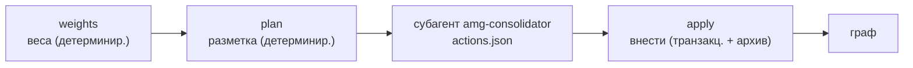
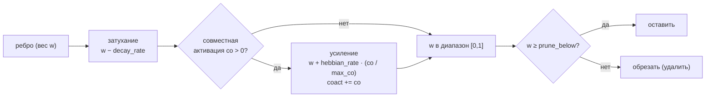

# 07 — Консолидация

Консолидация (`consolidate.py`) замыкает цикл памяти: укрепляет то, что использовалось, отбирает в долговременную память ценные выводы сессии и сжимает раздувшиеся ветки, чтобы граф оставался точным и ограниченным. Как и везде в AMG, работа разделена на детерминированную часть (скрипт) и часть суждения (субагент `amg-consolidator`); все записи идут через журнал хранилища, поэтому прерывание в любой точке восстановимо. Концептуальное обоснование — в [теории](../THEORY.md): укрепление и затухание по Хеббу (раздел 8), рубрика значимости (раздел 9), компрессия и обратимое забывание (раздел 10).

## Расположение и вызовы

Файл `consolidate.py` лежит в `skills/amg-consolidate/scripts/`. Он импортирует транзакционное хранилище `graph_store` (добавляя в путь каталог `amg-bootstrap/scripts/`), а собственной языковой модели не вызывает. Запускается скиллом `amg-consolidate`: детерминированные шаги (`weights`, `plan`) — напрямую, а суждение делегируется субагенту `amg-consolidator`, который читает план и выдаёт список действий; их вносит транзакционно команда `apply`. Источник хеббовского сигнала — журнал `work/coactivation.log`, который дописывает извлечение (см. [Извлечение из графа](./06-retrieval.md)).

## Три задачи

Консолидация делает три дела, в порядке возрастания стоимости и риска: дешёвые детерминированные веса, затем разметка плана, затем применение решений субагента.

## Веса: Хебб, затухание, обрезка, перенормировка

Шаг `weights` (`fold_weights`) — полностью детерминированный, без модели: «что срабатывает вместе — связывается крепче; что не используется — слабеет». Сначала он читает журнал `work/coactivation.log` и считает, сколько раз каждая пара узлов оказывалась вместе в пакете (`pair_counts`), запоминая максимум `max_co`. Затем под локом, после восстановления, в одной транзакции для каждого ребра каждого узла:

То есть: **пассивное затухание** вычитает `decay_rate` (`0.02`) из веса каждого ребра; **хеббовское усиление** прибавляет `hebbian_rate` (`0.10`), умноженный на нормированную частоту совместной активации `co / max_co`, и накапливает счётчик `coact`; вес ограничивается диапазоном `[0, 1]` и округляется; **обрезка** удаляет ребро, чей вес упал ниже `prune_below` (`0.05`). Отдельно выполняется **перенормировка членства** (`part_of_renormalize`): если сумма весов `part_of` узла превысила 1, веса делятся на сумму, чтобы доли членства не превышали единицу (симплекс). После прохода журнал ко-активаций **ротируется в архив** (`archive/coactivation-<время>.log`) и очищается — сигнал учтён, но остаётся для аудита. Результат — `{reinforced_edges, nodes_updated}`. Параметры берутся из блока `weights` конфигурации.

## План: бюджеты, дубли, значимость

Шаг `plan` (`make_plan`) — детерминированный анализ графа; он не меняет граф, а пишет разметку `work/consolidation-plan.json` для субагента. Он вычисляет:

- **Степенную центральность** каждого узла: число рёбер к существующим узлам и от них (`degree`), и максимум `max_deg`. Центральность входит в значимость и определяет, какие узлы защищены от сжатия.
- **Состав веток** (`_branch_members`): для каждого узла-хаба (`type` `hub`/`overview`) — множество узлов, чьё членство `part_of` *транзитивно* доходит до него (обход вверх по темам). Так ветка — это хаб со всем, что под ним.
- **Ветки сверх бюджета** (`over_budget`): для каждого хаба бюджет берётся из его поля `branch_budget` либо из `default_branch_budget_nodes` (`400`); суммарный объём членов сравнивается с `default_branch_budget_tokens` (`200000`). Если превышено число узлов или токенов — ветка попадает в план с её размером, бюджетом, составом и порядком шагов сжатия (`staged_steps`).
- **Кандидаты на слияние** (`near_duplicates`): пары узлов, чья лексическая близость по мере Жаккара (по тексту «сводка + первые 400 символов тела») не ниже `near_duplicate_sim` (`0.82`).
- **Эпизодические кандидаты и значимость**: узлы с `type` из `episodic_types` (`section`, `note`) и не спроецированные из файла (`source_kind` ≠ `derived_from_file`); для каждого считается значимость и флаг «защищён» (тип входит в `protect_types`). Список сортируется по возрастанию значимости (наименее ценные — первыми) и обрезается до 50.

Итог — `{generated, n_nodes, over_budget_branches, near_duplicates, episodic_candidates}`.

## Рубрика значимости

Значимость (`salience`) — детерминированная оценка ценности информации; мягкие сигналы поверх неё оценивает субагент. Это взвешенная сумма пяти сигналов:

| Сигнал | Вес | Что измеряет |
|---|---|---|
| тип (`type_score`) | 0.30 | `1.0`, если тип защищён (`decision`/`adr`), иначе `0.4` — решения и обязательства ценны |
| свежесть (`rec`) | 0.20 | по полю `updated`: `1 − возраст_дней / (stale_age_days · 4)`, не ниже 0 |
| частота (`freq`) | 0.20 | `min(1, накопленный coact / 10)` — как часто узел реально активируется |
| мост (`bridge`) | 0.20 | степенная центральность `degree / max_degree` — насколько узел связывает граф |
| провенанс (`grounded`) | 0.10 | `1.0`, если узел спроецирован из файла или имеет ребро `documents`/`implements`/`specifies`, иначе `0.4` |

Сумма весов равна единице; итог округляется. Низкая значимость — кандидат на свёртку или укорачивание, высокая — на защиту и повышение.

## Применение: транзакционно и с архивацией

Шаг `apply` (`apply_actions`) вносит список действий субагента под локом, в одной транзакции, и **архивирует оригиналы** — ничего не уничтожается молча. Вспомогательная функция `archive(id)` пишет узел в `archive/<имя>.md` и затем удаляет исходный; `redirect_inbound` перенаправляет все рёбра и `part_of`, указывавшие на убранные узлы, на «выжившего». Действия:

- **`promote`** — повысить узел: сменить тип (`new_type`), выставить `status` (по умолчанию `active`), обновить время. Так задним числом важное возвращается в активную память.
- **`retire`** — вывести узел: заархивировать (обратимо).
- **`shorten`** — лоссово укоротить: **сначала** сохранить полную версию как `archive/<имя>.md.full`, затем заменить сводку и тело укороченными. Восстановление возможно из `.full`.
- **`merge`** — слить почти-дубли: оставить `keep_id`, объединить рёбра (без дублей по `(rel, to)`), заархивировать `drop_ids`, перенаправить входящие связи на «выжившего».
- **`summarize_episodes`** — свернуть устаревшие эпизоды: создать новый узел-сводку (`new_id`), заархивировать исходные (`archive_ids`), перенаправить на новый.
- **`introduce_subhub`** — ввести промежуточный под-хаб: создать узел-хаб (`hub_id`) и переподчинить ему членов (`member_ids`), снижая «ширину» ветки без потери узлов.

После фиксации действие записывается в журнал `log.md`. Параметр `archive_dir` (`archive`) задаёт каталог архива.

## Компрессия: когда срабатывает и что защищается

Компрессия сжимает *сам граф* (а не выдачу в окно) и нужна, чтобы раздутая ветка не вносила шум в активацию. Она **запускается только для веток сверх бюджета**: `make_plan` помечает такие ветки, и субагент сжимает их **поэтапно и снизу**, в порядке `steps` (`summarize_episodes` → `merge_near_duplicates` → `introduce_subhub` → `lossy_shorten`), останавливаясь, как только ветка вернулась под бюджет — минимально необходимое сжатие. Флаг `compaction.enabled` присутствует в конфиге (по умолчанию `true`) как переключатель, но сам скрипт опирается на превышение бюджета, а не на флаг; при щедрых бюджетах граф фактически не сжимается.

Высокозначимое не сжимается первым: защищены типы `protect_types` (`decision`, `adr`) и узлы с центральностью выше `protect_min_centrality` (`0.7`), а также узлы с сильным провенансом, недавние и часто активируемые (через рубрику значимости). Забывание обратимо: оригиналы уходят в архив (см. [теорию](../THEORY.md), раздел 10.3), откуда ветку можно восстановить. **Автоматический гейт по полноте** (повтор измерения recall до и после сжатия с ослаблением порога при просадке) — пункт дорожной карты; сам инструмент измерения существует (см. [Измерение и инструменты](./10-eval-tools.md)) и применяется отдельно.

## Субагент `amg-consolidator`

Суждение о судьбе памяти делает субагент `amg-consolidator` (модель `opus`, инструменты Read/Grep/Glob/Bash). Он читает план и тела нужных узлов, применяет рубрику ценности информации к мягким сигналам, уважает бюджеты веток и защищённые типы и выдаёт список действий в формате JSON. Граф он **не** редактирует — действия применяет транзакционно скрипт (поэтому всё крэш-безопасно и обратимо). Полный промпт — в разделе [Субагенты и скиллы](./08-agents-skills.md).

## Ключи конфигурации

Параметры берутся из блоков `weights` и `compaction` конфигурации (а также из ключей верхнего уровня модуля); при отсутствии действуют значения по умолчанию (`DEFAULTS`), которые конфигурация переопределяет. Полный справочник — в разделе [Справочник конфигурации](./09-config.md).

| Ключ | Значение | Смысл |
|---|---|---|
| `weights.hebbian_rate` | 0.10 | сила хеббовского усиления |
| `weights.decay_rate` | 0.02 | пассивное затухание каждого ребра |
| `weights.prune_below` | 0.05 | порог обрезки ослабших рёбер |
| `weights.part_of_renormalize` | true | держать сумму долей членства ≤ 1 |
| `compaction.enabled` | true | переключатель компрессии (план опирается на бюджет) |
| `compaction.default_branch_budget_nodes` | 400 | бюджет ветки в узлах |
| `compaction.default_branch_budget_tokens` | 200000 | бюджет ветки в токенах |
| `compaction.protect_types` | `[decision, adr]` | типы, не сжимаемые первыми |
| `compaction.protect_min_centrality` | 0.7 | порог центральности для защиты |
| `compaction.archive_dir` | `archive` | каталог архива оригиналов |
| `compaction.steps` | 4 шага | порядок поэтапного сжатия |
| `near_duplicate_sim` | 0.82 | порог близости Жаккара для слияния |
| `episodic_types` | `[section, note]` | типы эпизодических кандидатов |
| `stale_age_days` | 30 | основа оценки свежести |

## Командная строка

| Команда | Действие | Лок |
|---|---|---|
| `python consolidate.py weights [<project_root>]` | свернуть журнал ко-активаций в веса | под локом |
| `python consolidate.py plan [<project_root>]` | разметить план для субагента | — (только чтение + запись плана) |
| `python consolidate.py apply <actions.json> [<project_root>]` | внести действия субагента | под локом |

## Дальше

- [Карта документации](./README.md) — оглавление архитектуры и возврат к началу.
- [02 — Модель данных](./02-data-model.md) — рёбра, веса `w`/`coact`, членство `part_of`, над которыми работает консолидация.
- [06 — Извлечение из графа](./06-retrieval.md) — источник журнала ко-активаций (хеббовский сигнал).
- [08 — Субагенты и скиллы](./08-agents-skills.md) — полный промпт субагента `amg-consolidator` и скилл `amg-consolidate`.
- [09 — Справочник конфигурации](./09-config.md) — все ключи блоков `weights` и `compaction`.
