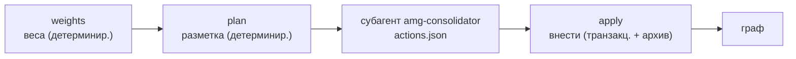
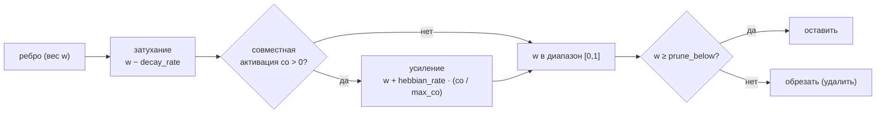
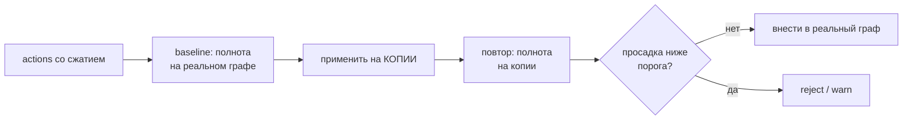

# 07 — Консолидация

Консолидация (`consolidate.py`) замыкает цикл памяти: укрепляет то, что использовалось, отбирает в долговременную память ценные выводы сессии и сжимает раздувшиеся ветки, чтобы граф оставался точным и ограниченным. Как и везде в AMG, работа разделена на детерминированную часть (скрипт) и часть суждения (субагент `amg-consolidator`); все записи идут через журнал хранилища, поэтому прерывание в любой точке восстановимо. Концептуальное обоснование — в [теории](../THEORY.md): укрепление и затухание по Хеббу (раздел 8), рубрика значимости (раздел 9), компрессия и обратимое забывание (раздел 10).

## Расположение и вызовы

Файл `consolidate.py` лежит в `skills/amg-consolidate/scripts/`. Он импортирует транзакционное хранилище `graph_store` (добавляя в путь каталог `amg-bootstrap/scripts/`), а собственной языковой модели не вызывает. Запускается скиллом `amg-consolidate`: детерминированные шаги (`weights`, `plan`) — напрямую, а суждение делегируется субагенту `amg-consolidator`, который читает план и выдаёт список действий; их вносит транзакционно команда `apply`. Источник хеббовского сигнала — журнал `work/coactivation.log`, который дописывает извлечение (см. [Извлечение из графа](./06-retrieval.md)).

## Три задачи

Консолидация делает три дела, в порядке возрастания стоимости и риска: дешёвые детерминированные веса, затем разметка плана, затем применение решений субагента.

## Веса: накопление сигнала, Хебб (опционально), затухание, обрезка

Шаг `weights` (`fold_weights`) — полностью детерминированный, без модели. Сначала он читает журнал `work/coactivation.log` и считает, сколько раз каждая пара узлов оказывалась вместе в пакете (`pair_counts`), запоминая максимум `max_co`. Затем под локом, после восстановления, в одной транзакции обрабатывает рёбра.

**По умолчанию хеббово обновление весов выключено** (`weights.apply_hebbian: false`). В этом режиме шаг только **накапливает** счётчик ко-активаций (`coact += co` на ребре — он питает рубрику значимости, см. ниже), а сам вес `w` **не меняет**: проводимость графа остаётся статической и предсказуемой. Это защита от самоусиления — сигнал ко-активации частично цикличен (веса → выдача → пары → те же веса), поэтому хеббово обновление включают лишь после измеренного выигрыша по eval (обоснование — [теория](../THEORY.md), §8.1).

Когда `apply_hebbian: true` **и** есть новый журнал, для каждого ребра применяется правило:

То есть: **пассивное затухание** вычитает `decay_rate` (`0.02`); **хеббовское усиление** прибавляет `hebbian_rate` (`0.10`), умноженный на нормированную частоту `co / max_co`; вес ограничивается диапазоном `[0, 1]` и округляется; **обрезка** удаляет ребро, чей вес упал ниже `prune_below` (`0.05`). Новое ребро без явного веса стартует с `default_edge_weight` (`0.5`).

Затухание и обрезка привязаны к **наличию журнала**: без новых ко-активаций вес не трогается, поэтому повторный запуск `weights` на неизменном графе не меняет `w` (semantic-idempotent относительно уже учтённого сигнала). Так снята прежняя неточность «`weights` идемпотентен», когда затухание срабатывало на каждый запуск.

**Перенормировка членства** (`part_of_renormalize`) выполняется **всегда**, независимо от `apply_hebbian`: если сумма весов `part_of` узла превысила 1, веса делятся на сумму, чтобы доли членства не превышали единицу (симплекс) — это инвариант, а не хеббово обучение, и он идемпотентен. После прохода журнал ко-активаций **ротируется в архив** (`archive/coactivation-<время>.log`) и очищается — сигнал учтён, но сохранён для аудита. Результат — `{coact_pairs, reinforced_edges, nodes_updated, hebbian_applied}`. Параметры берутся из блока `weights` конфигурации.

## План: бюджеты, дубли, значимость

Шаг `plan` (`make_plan`) — детерминированный анализ графа; он не меняет граф, а пишет разметку `work/consolidation-plan.json` для субагента. Он вычисляет:

- **Степенную центральность** каждого узла: число рёбер к существующим узлам и от них (`degree`), и максимум `max_deg`. Центральность входит в значимость и определяет, какие узлы защищены от сжатия.
- **Состав веток** (`_branch_members`): для каждого узла-хаба (`type` `hub`/`overview`) ветка собирается **двумя путями**. *Вверх*: узлы, чьё членство `part_of` транзитивно доходит до хаба (явное членство, в т. ч. взвешенное мультичленство от синтеза). *Вниз*: от хаба по его «охватывающим» рёбрам (`HUB_DOWN_RELS` — `documents`/`defines`/`specifies`/`implements`/`contains`) транзитивно к не-хаб узлам (хаб документирует модуль, модуль определяет свои функции), со стопом на любом другом хабе (граница ветки). Путь вниз необходим, потому что первичное членство листа указывает на *строку каталога* (`src/billing`), которая узлом графа не является, — без него `over_budget` на реальном графе оставался бы пустым (история — раздел 1.20 дорожной карты).
- **Ветки сверх бюджета** (`over_budget`): считаются **только при `compaction.enabled`** (при `false` план не помечает ни одной ветки — компрессия предсказуемо выключена). Для каждого хаба бюджет берётся из его поля `branch_budget` либо из `default_branch_budget_nodes`; суммарный объём членов сравнивается с `default_branch_budget_tokens`. Действующие значения — из шаблона `config.yml` (`400` узлов / `200000` токенов); встроенные умолчания кода иные (`150` / `60000`), но конфигурация их переопределяет (см. [Справочник конфигурации](./09-config.md)). Если превышено число узлов или токенов — ветка попадает в план с её размером, бюджетом, составом и порядком шагов сжатия (`staged_steps`).
- **Кандидаты на слияние** (`near_duplicates`): пары узлов, чья лексическая близость по мере Жаккара (по тексту «сводка + первые 400 символов тела») не ниже `near_duplicate_sim` (`0.82`).
- **Эпизодические кандидаты и значимость**: узлы с `type` из `episodic_types` (`section`, `note`) и не спроецированные из файла (`source_kind` ≠ `derived_from_file`); для каждого считается значимость и флаг «защищён» (тип входит в `protect_types`). Список сортируется по возрастанию значимости (наименее ценные — первыми) и обрезается до 50.

Итог — `{generated, n_nodes, over_budget_branches, near_duplicates, episodic_candidates}`.

## Рубрика значимости

Значимость (`salience`) — детерминированная оценка ценности информации; мягкие сигналы поверх неё оценивает субагент. Это взвешенная сумма пяти сигналов:

| Сигнал | Вес | Что измеряет |
|---|---|---|
| тип (`type_score`) | 0.30 | `1.0`, если тип защищён (`decision`/`adr`), иначе `0.4` — решения и обязательства ценны |
| свежесть (`rec`) | 0.20 | по полю `updated`: `1 − возраст_дней / (stale_age_days · 4)`, не ниже 0 |
| частота (`freq`) | 0.20 | `min(1, накопленный coact / 10)` — как часто узел реально активируется |
| мост (`bridge`) | 0.20 | степенная центральность `degree / max_degree` — насколько узел связывает граф |
| провенанс (`grounded`) | 0.10 | `1.0`, если узел спроецирован из файла, имеет **исходящее** ребро `documents`/`implements`/`specifies` **или на него указывает входящее** такое ребро (его кто-то документирует/реализует/специфицирует), иначе `0.4` |

Сумма весов равна единице; итог округляется. Низкая значимость — кандидат на свёртку или укорачивание, высокая — на защиту и повышение.

## Применение: транзакционно и с архивацией

Шаг `apply` (`apply_actions`) вносит список действий субагента под локом, в одной транзакции, и **архивирует оригиналы** — ничего не уничтожается молча. Вспомогательная функция `archive(id)` пишет узел в `archive/<имя>.md` и затем удаляет исходный; `redirect_inbound` перенаправляет все рёбра и `part_of`, указывавшие на убранные узлы, на «выжившего», и **дедуплицирует** рёбра затронутых соседей по `(rel, to)` (больший вес, суммарный `coact`), отбрасывая возникший self-edge.

**Два детерминированных предохранителя действуют до применения** (не только в промпте субагента):

- при `compaction.enabled: false` любое компрессионное действие (`summarize_episodes`/`merge`/`introduce_subhub`/`shorten`/`retire`) **пропускается**;
- защищённый узел — тип из `protect_types` (`decision`/`adr`) или с центральностью выше `protect_min_centrality` — **не укорачивается, не выводится и не архивируется** (проверяются `shorten`/`retire`, `drop_ids` у `merge`, `archive_ids` у `summarize_episodes`).

Оба снимаются явным `{"force": true}` в действии. Действия:

- **`promote`** — повысить узел: сменить тип (`new_type`), выставить `status` (по умолчанию `active`), обновить время. Не компрессионное — выполняется всегда.
- **`retire`** — вывести узел: заархивировать (обратимо).
- **`shorten`** — лоссово укоротить: **сначала** сохранить полную версию как `archive/<имя>.md.full`, затем заменить сводку и тело укороченными. Запись `.full` идемпотентна — выполняется, только если его ещё нет, поэтому повторный `apply` не затирает оригинал укороченной версией. Восстановление возможно из `.full`.
- **`merge`** — слить почти-дубли: оставить `keep_id`; объединить рёбра по `(rel, to)` (больший вес, **суммарный** `coact`), отбросив self-edge и рёбра внутрь `drop_ids`; объединить членства `part_of` (симплекс); заархивировать `drop_ids` и перенаправить входящие связи на «выжившего».
- **`summarize_episodes`** — свернуть устаревшие эпизоды: создать новый узел-сводку (`new_id`), заархивировать исходные (`archive_ids`), перенаправить на новый.
- **`introduce_subhub`** — ввести промежуточный под-хаб: создать узел-хаб (`hub_id`) и переподчинить ему членов (`member_ids`); у члена заменяется **только** тема `parent_topic` на под-хаб, прочие членства сохраняются (с перенормировкой), — группировка не стирает заработанную полииерархию.

Создаваемые узлы (`summarize_episodes`, `introduce_subhub`) соответствуют классу `synthesized` модели данных: `policy: authored`, `source_hash`/`derived_from_hash` — `null`, `lang` из `working_language`, и физически лежат в бакете `nodes/_hubs/` (см. [Модель данных](./02-data-model.md)). После фиксации действие записывается в журнал `log.md`. Параметр `archive_dir` (`archive`) задаёт каталог архива.

## Компрессия: когда срабатывает и что защищается

Компрессия сжимает *сам граф* (а не выдачу в окно) и нужна, чтобы раздутая ветка не вносила шум в активацию. Она **запускается только для веток сверх бюджета**: `make_plan` помечает такие ветки, и субагент сжимает их **поэтапно и снизу**, в порядке `steps` (`summarize_episodes` → `merge_near_duplicates` → `introduce_subhub` → `lossy_shorten`), останавливаясь, как только ветка вернулась под бюджет — минимально необходимое сжатие. Флаг `compaction.enabled` (по умолчанию `true`) — **рабочий переключатель**: при `false` план не помечает ни одной ветки, а `apply` пропускает компрессионные действия (без явного `force`), так что граф предсказуемо не сжимается. При включённом флаге сжатие по-прежнему запускается только на превышении бюджета — при щедрых бюджетах граф не трогается.

Высокозначимое не сжимается первым, и это **гарантировано кодом** (предохранители раздела «Применение»), а не только инструкцией субагента: защищены типы `protect_types` (`decision`, `adr`) и узлы с центральностью выше `protect_min_centrality` (`0.7`); рубрика значимости дополнительно бережёт узлы с сильным провенансом, недавние и часто активируемые. Забывание обратимо: оригиналы уходят в архив (см. [теорию](../THEORY.md), раздел 10.3), откуда ветку можно восстановить. Сверх того, компрессия проходит **автоматическую проверку полноты** (eval-предохранитель) — она измеряет результат на копии графа и вносит его в реальный граф только при удержании полноты (следующий раздел).

## Автоматическая проверка полноты (eval-предохранитель)

Компрессия меняет сам граф, поэтому она не должна незаметно ухудшать извлечение. Перед применением компрессионных действий `apply` измеряет полноту **на копии графа** и трогает реальный граф только если полнота удержалась.

Механизм (`_eval_gate` внутри `apply_actions`):

- **baseline** меряется на реальном графе под локом, до построения транзакции, измерительным стендом `eval_retrieval` (см. [Измерение и инструменты](./10-eval-tools.md));
- **проверяемое состояние** — те же действия применяются к временной **копии** графа (`_clone_for_eval`; рекурсивный `apply` с выключенным предохранителем), полнота меряется на ней. Реальный граф не меняется, пока проверка не пройдена, — поэтому «откат уже применённого» не нужен и намеренно не реализуется (он был бы хрупким: слияние и перенаправление входящих рёбер уже переписали бы соседей);
- **метрики** — `pack_recall` (доля эталона в *собранном пакете*: компрессия меняет состав пакета, а не только ранжирование top-K) под порогом `min_recall_delta` и агрегатный `hop_recall` под `min_hop_recall_delta`; сравнивается дельта «после − до»;
- **реакция** `on_fail`: `reject` — транзакция не строится, граф цел; `warn` — изменения вносятся, но просадка фиксируется в логе и отчёте; `revert` — синоним `reject` (по построению откат не нужен);
- **отчёт** `work/eval-gate-report.json` — статус, дельты, пороги и `regressions`: по каждому случаю какие эталонные узлы выпали из пакета и какие действия их затронули (атрибуция).

Предохранитель **робастен к отсутствию разметки**: если файл случаев (`eval_gate.cases`) отсутствует, пуст или ни один его `gold_ids` не существует в графе, проверка **пропускается** с пометкой `skipped` — компрессия не блокируется ложно. Поставляемый `cases.json` — нейтральный шаблон (его `gold_ids` не резолвятся), поэтому установка без разметки безопасно неактивна, пока пользователь не разметит свои случаи (id из `inspect_graph.py`) или не укажет `eval_gate.cases` на свой файл. Предохранитель запускается только при наличии **реально применяемого** компрессионного действия. Ключи блока `eval_gate` — в [Справочнике конфигурации](./09-config.md).

## Субагент `amg-consolidator`

Суждение о судьбе памяти делает субагент `amg-consolidator` (модель `opus`, инструменты Read/Grep/Glob/Bash). Он читает план и тела нужных узлов, применяет рубрику ценности информации к мягким сигналам, уважает бюджеты веток и защищённые типы и выдаёт список действий в формате JSON. Граф он **не** редактирует — действия применяет транзакционно скрипт (поэтому всё крэш-безопасно и обратимо). Полный промпт — в разделе [Субагенты и скиллы](./08-agents-skills.md).

## Ключи конфигурации

Параметры берутся из блоков `weights` и `compaction` конфигурации (а также из ключей верхнего уровня модуля); при отсутствии действуют значения по умолчанию (`DEFAULTS`), которые конфигурация переопределяет. Полный справочник — в разделе [Справочник конфигурации](./09-config.md).

| Ключ | Значение | Смысл |
|---|---|---|
| `weights.apply_hebbian` | false | включить обновление весов `w` (Хебб + затухание + обрезка); при `false` шаг только копит `coact` (см. выше и [теорию](../THEORY.md) §8.1) |
| `weights.default_edge_weight` | 0.5 | начальный вес ребра без явного `w` (используется и при извлечении, и при сборке проводимости) |
| `weights.hebbian_rate` | 0.10 | сила хеббовского усиления (действует при `apply_hebbian`) |
| `weights.decay_rate` | 0.02 | пассивное затухание каждого ребра (действует при `apply_hebbian` и наличии журнала) |
| `weights.prune_below` | 0.05 | порог обрезки ослабших рёбер (действует при `apply_hebbian`) |
| `weights.part_of_renormalize` | true | держать сумму долей членства ≤ 1 (всегда, независимо от `apply_hebbian`) |
| `compaction.enabled` | true | рабочий переключатель компрессии: `false` выключает пометку веток и компрессионные действия |
| `compaction.default_branch_budget_nodes` | 400 | бюджет ветки в узлах (шаблон; умолчание кода — 150) |
| `compaction.default_branch_budget_tokens` | 200000 | бюджет ветки в токенах (шаблон; умолчание кода — 60000) |
| `compaction.protect_types` | `[decision, adr]` | типы, защищённые в коде от сжатия/вывода |
| `compaction.protect_min_centrality` | 0.7 | порог центральности для защиты в коде |
| `compaction.archive_dir` | `archive` | каталог архива оригиналов |
| `compaction.steps` | 4 шага | порядок поэтапного сжатия |
| `near_duplicate_sim` | 0.82 | порог близости Жаккара для слияния (читается из конфига) |
| `episodic_types` | `[section, note]` | типы эпизодических кандидатов (читается из конфига) |
| `stale_age_days` | 30 | основа оценки свежести (читается из конфига) |
| `eval_gate.enabled` | true | включить автоматическую проверку полноты перед компрессией |
| `eval_gate.cases` | путь | размеченные случаи; нерезолвящиеся/отсутствующие → проверка пропускается |
| `eval_gate.min_recall_delta` | −0.02 | допустимая просадка `pack_recall` (после − до) |
| `eval_gate.min_hop_recall_delta` | −0.02 | допустимая просадка `hop_recall` |
| `eval_gate.on_fail` | reject | `reject` (не вносить) / `warn` (внести + зафиксировать) / `revert` (≡ reject) |

## Командная строка

| Команда | Действие | Лок |
|---|---|---|
| `python consolidate.py weights [<project_root>] [--root <agent_dir>]` | свернуть журнал ко-активаций в веса | под локом |
| `python consolidate.py plan [<project_root>] [--root <agent_dir>]` | разметить план для субагента | — (только чтение + запись плана) |
| `python consolidate.py apply <actions.json> [<project_root>] [--root <agent_dir>]` | внести действия субагента | под локом |

Корень графа разрешается цепочкой `graph_store.resolve_amg_root` (`--root` → `AMG_AGENT_DIR` → поиск конфига вверх → каталог движка → умолчание `.claude`; см. [Хранилище и транзакции](./03-storage.md)) — литерал `.claude` в коде не зашит.

## Дальше

- [Карта документации](./README.md) — оглавление архитектуры и возврат к началу.
- [02 — Модель данных](./02-data-model.md) — рёбра, веса `w`/`coact`, членство `part_of`, над которыми работает консолидация.
- [06 — Извлечение из графа](./06-retrieval.md) — источник журнала ко-активаций (хеббовский сигнал).
- [08 — Субагенты и скиллы](./08-agents-skills.md) — полный промпт субагента `amg-consolidator` и скилл `amg-consolidate`.
- [09 — Справочник конфигурации](./09-config.md) — все ключи блоков `weights` и `compaction`.
