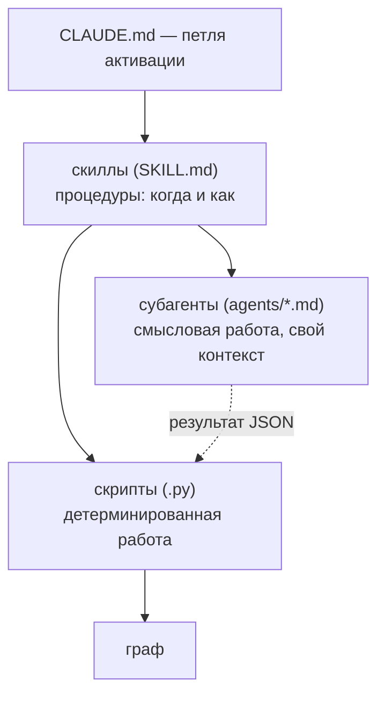

# 08 — Субагенты и скиллы

Этот раздел — про управляющую плоскость: как детерминированные скрипты и языковая модель **оркестрируются** в единый процесс. Управление трёхуровневое: `CLAUDE.md` задаёт петлю активации (что делать в начале сессии, по ходу и в конце), **скиллы** — это процедуры (когда и как выполнить операцию), а **субагенты** — изолированные экземпляры модели, выполняющие смысловую работу в собственном контексте. Ключевой принцип: скилл решает *когда/как*, запускает скрипты и делегирует понимание субагенту; субагент работает в своём контексте, возвращает короткую сводку и **никогда не редактирует граф** — его выход (файл JSON) вносит транзакционно скрипт. Что хранит и как устроен сам граф — в других разделах; здесь — кто им управляет.

## Расположение

- Скиллы — каталоги `skills/<имя>/`, в каждом `SKILL.md` (имя + триггерящее описание), `scripts/` (код) и при необходимости `references/`.
- Субагенты — файлы `agents/<имя>.md` (frontmatter с `model` и `tools` плюс промпт).
- `CLAUDE.md` — небольшой файл памяти проекта, загружаемый в начале каждой сессии (в том числе после `/clear`); при установке его блок дописывается в корневой `CLAUDE.md` проекта.

## Три уровня управления

Субагент не пишет в граф сам: он отдаёт результат файлом JSON, а вносит его в граф детерминированный скрипт под блокировкой (поэтому всё устойчиво к сбоям и обратимо).

## Скиллы

Скилл — это процедура: папка с `SKILL.md`, чьё поле `description` описывает, *когда* скилл применять. Срабатывание — по **смыслу** запроса, а не по точному слову: модель сама выбирает скилл, когда задача подходит под описание. Скиллов три.

### `amg-bootstrap` — построить или свести граф

Срабатывает на «проиндексируй проект», «свери граф», «добавил/изменил/удалил файлы», «граф устарел». Запускается при первой сессии в проекте, в начале сессии если источники могли измениться, после правок и после сбоя (самовосстановление). Рабочий процесс (из корня проекта; чтение единиц делегируется субагентам, чтобы не засорять основной контекст):

1. **Восстановить.** Проиграть незавершённые записи и снять устаревшее состояние: `graph_store.py recover`, затем `graph_store.py verify --repair`.
2. **Дифф и скелет.** `reconcile.py bootstrap .` — посчитать added/changed/deleted, устойчиво к сбоям записать структурные узлы и выгрузить очередь `work/queue.json`. Если `queued_for_semantic` равно 0 — граф актуален, остановиться. Предварительно `extract_structure.py . --stats` показывает классификацию и доступность tree-sitter; если в выводе есть `ambiguous_files`, можно (необязательно) уточнить их тип: запустить субагент `amg-classifier`, записать его вердикт в `work/classification-overrides.json` и повторить `bootstrap` — извлечение прочтёт overrides **раньше** своей резервной классификации и направит файлы в нужные нарезатели. Шаг необязательный: очередь неоднозначностью не блокируется (по умолчанию такой файл обрабатывается как проза).
3. **Семантическое обогащение (массово).** Прочитать `work/queue.json`; если он велик — разбить на партии по поддеревьям и запустить по субагенту `amg-builder` на партию **параллельно**, каждому — его срез и путь вывода `work/derived-<партия>.json`.
4. **Применить обогащение.** Для каждого файла: `reconcile.py apply work/derived-<партия>.json .` — это ставит `derived_from_hash = source_hash` и переводит узлы в `active`.
5. **Синтез и отчёт о пробелах.** Один субагент `amg-synth`: верхнеуровневые узлы-обзоры и хабы, межслойные рёбра, взвешенное мультичленство и **отчёт о пробелах** (`gap-report.md`). Его обогащение применить так же (шаг 4), отчёт показать пользователю.
6. **Журнал.** Скрипты дописывают строку с `txid` в `log.md`; подтвердить пользователю итоговые счётчики и выжимку отчёта.

Уровни моделей для шагов задаются в `config.yml` (блок `models`). Источники только на чтение; повторный прогон на неизменном репозитории бесплатен (фильтр по хешу). Полная механика — в разделах [Извлечение структуры](./04-ingest.md) и [Сверка и семантическое обогащение](./05-reconcile.md).

### `amg-retrieve` — собрать пакет контекста перед задачей

Срабатывает на любую задачу, называющую функцию/модуль/подсистему/фичу: «поработай над/почини/расширь X», «как работает X», «что связано с X». Запускается **до** работы с кодом. Рабочий процесс:

1. **Сформулировать запрос** — задача плюс конкретные идентификаторы, которые она называет.
2. **Запустить субагент `amg-retriever`** — он выполняет `retrieve.py "<запрос>" --store .claude/amg`, который пишет `cache/pack.md`, и возвращает путь пакета и сводку 3–5 строк.
3. **Прочитать пакет** (`cache/pack.md`) и работать по нему. Четыре яруса: *Strategic* (обзоры/хабы), *Tactical* (релевантные модули), *Operational* (указатели на код + тела документов/заметок в фокусе), *Related* (ссылки на следующий круг). Для кода пакет даёт **указатели** `путь:строка` — редактировать нужно реальный файл, граф не копия кода.
4. Если чего-то не хватает — расширить запрос идентификаторами и перезапустить либо пройти по ссылке *Related*.

Скилл также даёт **измерительный стенд**: `eval_retrieval.py` сравнивает пакет AMG с лексической (RAG-подобной) базой top-k и сообщает recall, precision и **hop-recall** (полнота на узлах, не совпадающих с запросом лексически, — то, что добавляет именно распространение активации). Режимы: `--make-demo <путь>` (воспроизводимая демо-разметка) и `--cases cases.json` (свои размеченные случаи `{id, query, gold_ids}`). По числам настраиваются `damping`, `activation_threshold`, `token_budget`, `relation_priors` — не «на глаз». Опциональный семантический засев включается в `config.yml` (`retrieval.embeddings`); без бэкенда извлечение молча остаётся чисто-лексическим. Подробности — в разделе [Извлечение из графа](./06-retrieval.md) и [Измерение и инструменты](./10-eval-tools.md).

### `amg-consolidate` — обслуживание памяти

Срабатывает на «консолидируй/прибери/сожми память», «подведём итоги сессии», а также при зашумлённой выдаче. Запускается в конце сессии (перед `/clear`), по расписанию или по запросу. Рабочий процесс:

1. **Свернуть веса** (детерминированно): `consolidate.py weights .` — хеббовское усиление, затухание, обрезка, перенормировка `part_of`, ротация журнала ко-активаций в архив.
2. **Зафиксировать выводы сессии** — записать решения, выводы, открытые вопросы и планы через безопасный API заметок `notes.py add` (а **не** правкой `nodes/` руками): `notes.py add --type decision --summary "…" [--body "…"] [--tags "…"]`; типы `note`/`decision`/`adr`/`open_question`/`plan`, по умолчанию статус `captured`, запись транзакционная и устойчивая к сбоям. Это эпизодический вход для шага значимости; при сомнении — фиксировать (отбор будет дальше).
3. **План** (детерминированно): `consolidate.py plan .` — пишет `work/consolidation-plan.json` (ветки сверх бюджета, кандидаты-дубли, эпизодические заметки по детерминированной значимости).
4. **Суждение** — субагент `amg-consolidator` по плану решает, что повысить/вывести, что слить, что свернуть, где ввести под-хаб и что укоротить; выдаёт `work/actions.json`. Граф не редактирует.
5. **Применить** (детерминированно, транзакционно, с архивацией): `consolidate.py apply work/actions.json .`

Полная механика весов, рубрики значимости и компрессии — в разделе [Консолидация](./07-consolidation.md).

## Субагенты

Субагент — изолированный экземпляр модели (файл `agents/<имя>.md`) со своей моделью, своим набором инструментов и узким промптом. Он работает в собственном контексте, возвращает вызывающему только короткую сводку и **никогда не редактирует граф или источники** (только чтение); его единственный результат — файл JSON, который применяет скрипт. Сводная таблица:

| Субагент | Модель | Инструменты | Когда | Выход |
|---|---|---|---|---|
| `amg-classifier` | haiku | Read, Grep, Glob | bootstrap, для неоднозначных файлов | JSON: путь → `{category, language}` |
| `amg-builder` | sonnet | Read, Grep, Glob, Bash | bootstrap, по партии очереди (параллельно) | derivation JSON: сводки + рёбра |
| `amg-synth` | opus | Read, Grep, Glob, Bash | bootstrap, после обогащения | derivation JSON (хабы, межслойные рёбра) + `gap-report.md` |
| `amg-retriever` | haiku | Read, Grep, Glob, Bash | начало задачи | путь пакета + сводка 3–5 строк |
| `amg-consolidator` | opus | Read, Grep, Glob, Bash | консолидация | `actions.json` |

### `amg-builder` (sonnet) — семантическое обогащение

**Вход:** партия единиц очереди `{id, kind, source_path, category, content_sha, qualname, lineno, lang}`, где `lang` — язык источника (`python`, `markdown`, …), а `qualname`/`lineno` указывают нужный срез файла (единица может нести поле `text` — заранее извлечённое содержимое из бинарного формата); путь вывода, `working_language`. **Делает:** для каждой единицы — если есть `text`, суммирует по нему (источник бинарный, не открывать); иначе читает нужный срез `source_path` (ориентируясь на `kind`/`qualname`). Пишет **сводку** (1–3 фразы о назначении и роли, не пересказ; в коде идентификаторы и сигнатуры дословно, проза — на `working_language`, без калек) и предлагает **рёбра** (`calls`/`depends_on` к id кода, `documents` на узлах-документах, `refines`/`relates_to` мягче, `contradicts` только при реальном конфликте с малым весом; вес в (0,1]: сильное ~0.8–1.0, попутное ~0.3–0.5; не выдумывать цели). **Выход:** массив JSON из `{id, summary, lang, edges}`. **Правила:** обрабатывать только свою партию (неизменное не трогать); при непонимании — честная короткая сводка без спекулятивных рёбер; вызывающему вернуть только счётчики.

### `amg-synth` (opus) — стратегический слой и аудит

**Вход:** наполненный набор узлов (frontmatter), путь вывода обогащения, путь отчёта о пробелах, `working_language`. Работает поверх готовых сводок, рассуждая обо всём графе, а не о сырых файлах. **Производит:** (1) узлы-обзоры и хабы (`type: overview` у обзора, `type: hub` у тематического хаба; в `nodes/_hubs/`, происхождение — `source_kind: synthesized`, его проставляет применяющий скрипт) — короткий обзор архитектуры и по хабу на значимую сквозную тему; (2) межслойные и сквозные рёбра — `documents` (раздел документа → id кода), `part_of` **с весами** для мультичленства (сумма ≤ 1; наибольший вес — канонический дом), `supersedes`/`contradicts`; (3) **отчёт о пробелах** (`gap-report.md`): недокументированный код (узлы кода без входящего `documents`), рассинхронизированные документы (описывают изменившийся или удалённый код), противоречия. **Выход:** derivation JSON (id хабов вида `hub:<тема>`) + markdown-отчёт. **Правила:** обосновывать каждое ребро, лучше немного качественных хабов, чем много тонких; только чтение; вернуть сводку 3–5 строк и счётчики отчёта.

### `amg-classifier` (haiku) — разрешение неоднозначных типов

**Вход:** короткий список путей (`ambiguous_files` из `extract_structure.py --stats`). **Делает:** читает первые ~50 строк и выбирает ровно одно — `code` (плюс `language` как имя грамматики tree-sitter, если ясно; shebang — сильный сигнал), `doc` (проза) или `data` (структурированные записи), по принципу «как файл лучше нарезать»; при сомнении — `doc` (безопасное умолчание, которое уже использует скрипт). **Выход:** компактное JSON-сопоставление `путь → {category, language}`, которое скилл записывает в `work/classification-overrides.json`; при следующем `extract` оно читается **раньше** резервной классификации (`load_overrides` → `_classify_path`) и направляет файлы в нужные нарезатели — `code`+`python` в `ast`, `code`+грамматика в tree-sitter, `data` в нарезатель записей, `doc` в абзацный. Override сильнее догадки по расширению, а отсутствующий/битый файл overrides трактуется как пустая карта (bootstrap не блокируется). **Правила:** только чтение, только заданные файлы, быстро.

### `amg-retriever` (haiku) — извлечение пакета (только чтение)

**Вход:** строка запроса, путь хранилища. **Делает:** формулирует запрос под лексический засев (добавляет конкретные идентификаторы и близкие синонимы; одна строка; не выдумывать маловероятные термины); запускает `retrieve.py "<запрос>" --store .claude/amg`; бегло проверяет ранжирование и при промахе перезапускает один раз (не более двух попыток). **Возвращает:** путь `cache/pack.md` и сводку 3–5 строк (какие подсистемы активировались, топ 4–6 узлов, заметное — например, решение или противоречие); сам пакет целиком не вставляет. **Правила:** только чтение; максимум две попытки; если граф пуст или путь отсутствует — прямо сказать и остановиться.

### `amg-consolidator` (opus) — суждение при обслуживании памяти

**Вход:** `work/consolidation-plan.json` (ветки сверх бюджета, кандидаты-дубли, эпизодические заметки по значимости), тела нужных узлов, `working_language`. **Принципы:** ценность информации, а не тема — хранить и повышать решения, обязательства, планы, синтез, мосты между кластерами, переиспользуемые принципы; понижать и сжимать дубли, разовую болтовню, вытесненные утверждения, многословие с низким переиспользованием; необоснованные догадки — как открытые вопросы, не факты. **Защита:** не сворачивать и не укорачивать узлы защищённых типов (`decision`/`adr`) и сильно связанные; при сомнении — сохранять (повышение и фиксация обратимы, потеря смысла — нет). **Компрессия:** только помеченные планом ветки, поэтапно, со **стопом**, как только ветка вернулась под бюджет. **Выход:** `actions.json` — массив действий `promote` / `merge` / `summarize_episodes` / `introduce_subhub` / `shorten` / `retire` (формы — в разделе [Консолидация](./07-consolidation.md)); `merge`/`summarize_episodes`/`retire` архивируют оригиналы автоматически, входящие рёбра перенаправляет скрипт. **Возвращает:** 3–5 строк (счётчики по типам действий, какие ветки сжаты и почему, что заметное повышено). Сжатие **автоматически проверяется предохранителем**: применяющий скрипт меряет полноту до и после на копии графа и отклоняет (или применяет с предупреждением) при просадке, поэтому ручная сверка не требуется — субагент предлагает минимально достаточное сжатие, а предохранитель ловит избыточное (см. [Консолидация](./07-consolidation.md), «Автоматическая проверка полноты»).

## Петля активации (`CLAUDE.md`)

`CLAUDE.md` — небольшой файл памяти проекта, загружаемый в начале каждой сессии. Он несёт петлю активации AMG (текущее поведение):

- **Проверка активации.** В начале сессии проверить, есть ли `.claude/amg/config.yml` с `active: true`. Нет или `active: false` → AMG выключен, обычная сессия Claude Code, граф не создаётся. Есть и активен → работать по петле.
- **Рабочая петля (когда включён).** (1) **Восстановить, затем синхронизировать** — проиграть незавершённую запись (`graph_store.py recover`, `verify --repair`), затем, если источники могли измениться или это первая сессия, запустить скилл `amg-bootstrap` до работы. (2) **Извлечь до работы** — на каждую задачу сначала собрать контекст скиллом `amg-retrieve`. (3) **Фиксировать по ходу, консолидировать в конце** — решения, открытые вопросы и планы фиксировать через `notes.py add` (а не правкой `nodes/` руками; это дёшево и не требует bootstrap, который только для файлов-источников), а в конце сессии или перед `/clear` один раз запустить `amg-consolidate` (выводы, оставшиеся только в чате, теряются при `/clear`).
- **Мягкий барьер.** Собственные скиллы, агенты и скрипты AMG — инфраструктура; **не редактировать** их в рамках задачи. Если виден баг или ограничение — сообщить пользователю, а не править на ходу, чтобы каноническая протестированная версия оставалась авторитетной.
- **Восстановление.** При любой несогласованности — `recover` + `verify --repair` + `reconcile.py bootstrap .`.

## Слой жизненного цикла: хуки, команды и дайджест

Петля активации выше описывает, что делает **модель**. Поверх неё лежит слой жизненного цикла: он выполняет рутину **детерминированно, без участия модели** (через хуки Claude Code) и даёт **явные команды** для ручного управления. Его собирает один тонкий скрипт-оркестратор — `lifecycle.py` (в `skills/amg-bootstrap/scripts/`): он не несёт собственной логики графа, а вызывает уже описанные модули — `graph_store` для исцеления и `consolidate` для свёртки весов и дайджеста.

### Флаг `automation`

Ключ `automation` в `config.yml` (булев, по умолчанию `true`, как `active`) — главный выключатель самостоятельности:

- `true` — модель ведёт петлю сама, а хуки `SessionStart`/`SessionEnd` автоматически исцеляют хранилище, сворачивают веса, обновляют дайджест и выгружают стенограмму сессии;
- `false` — **ничего не происходит само**: работают только команды `/amg …`, прямые скиллы и явные запросы.

`lifecycle.py` в начале каждой хук-операции проверяет связку «`active: true` И `automation: true`»; если любое условие ложно — хук тихо завершается без действий. Так `automation: false` гарантирует полностью ручной режим.

### Хуки `SessionStart` / `SessionEnd`

Хук Claude Code — это **shell-команда**, привязанная к событию сессии и настраиваемая в `settings.json` (это **не** `config.yml`: разные механизмы; `settings.json` лежит в каталоге агента). Две команды туда прописывает установщик (Этап 10; в дев-песочнице — ручной предшественник `sync_testbed.py`):

- **`SessionStart` → `lifecycle.py session-start`**: проигрывает незавершённые записи и снимает устаревшую блокировку (`recover` + `verify --repair`), затем обновляет дайджест. Дешёвое исцеление в начале сессии, делающее прерванный прошлый прогон незаметным. Если что-то залечил — печатает дружелюбную заметку о неаккуратном завершении прошлой сессии (иначе молчит, без пер-сессионного шума; см. ниже).
- **`SessionEnd` → `lifecycle.py session-end`**: детерминированно сворачивает журнал ко-активаций в веса (`consolidate weights`), обновляет дайджест и **выгружает стенограмму сессии** в `sessions/` (см. ниже).

Принципиальное ограничение, заданное самой механикой: **хук не может запустить субагента.** Поэтому хуки делают только детерминированную половину обслуживания; «суждательная» половина консолидации (субагент `amg-consolidator` — повышение, слияние, компрессия) остаётся за моделью — её ведёт петля активации, а не хук. Выгрузка же стенограммы детерминирована (парсинг `.jsonl` без модели), поэтому живёт прямо в `session-end`. При дефолтном `apply_hebbian: false` свёртка весов хуком безопасна: она лишь копит счётчик `coact`, не трогая проводимость (см. [Консолидация](./07-consolidation.md)).

**Когда `SessionEnd` срабатывает.** На `/clear` (причина `clear`) и на чистом выходе из среды (`logout` / `prompt_input_exit` / `other`) — `settings.json` без матчера ловит все причины. **Жёсткое завершение** (закрыто окно терминала, `kill`, отказ ОС) `SessionEnd` **не вызывает**: тогда обслуживание конца сессии (свёртка весов, обновление дайджеста и выгрузка стенограммы) просто не выполняется в этот раз. Это не теряется — следующий `SessionStart` исцеляет хранилище (`recover` + `verify --repair`, см. [Хранилище и транзакции](./03-storage.md)) и освежает дайджест, а ближайшая консолидация догоняет веса (неразрушающе, лишь отложенно). Главная же страховка от потери выводов — фиксация по ходу через `notes.py add`: каждая заметка пишется отдельной завершённой транзакцией и переживает любой kill, поэтому полагаться на `SessionEnd` для сохранности не нужно.

### Выгрузка сессии (`SessionEnd`)

В конце сессии `session-end` сохраняет диалог, чтобы выводы не терялись на `/clear`. Claude Code подаёт хуку на stdin JSON с путём к стенограмме сессии (`transcript_path`) и причиной завершения; `lifecycle.py` парсит этот `.jsonl` и пишет markdown-дамп в `sessions/ГГГГ-ММ-ДД-ЧЧММ.md`:

- сохраняются **тексты** ходов человека и ассистента с маркерами ролей `=== Human ===` / `=== Assistant ===`;
- **сырые размышления** модели (`thinking`) вырезаются — они не хранятся;
- механический материал (вызовы инструментов и их результаты, вложения) не воспроизводится: каждое вложение получает отдельный нумерованный маркер `== Attachment N: <тип> ==` (так несколько вложений из одного сообщения не схлопываются в один счётчик);
- служебные обёртки (слэш-команды, режим `!`-bash, мета-вставки среды) отфильтровываются.

Дальше дамп — обычный источник: ближайший `bootstrap` нарезает его по ходам (нарезатель `session`) и вносит в граф под политикой `session_policy` (`absorb` по умолчанию — диалог становится дистиллятом; `mirror` — узлы живут, пока есть файл; см. [Извлечение структуры](./04-ingest.md) и [Сверку](./05-reconcile.md)). Формат маркеров — общий контракт писателя дампа и нарезателя.

**Переносимость.** Парсинг `.jsonl` и сам хук `SessionEnd` — механизмы именно Claude Code. В среде без них авто-выгрузки нет; переносимая страховка «диалог не потерян» — захват заметок по ходу (`notes.py`), переживающих даже жёсткий kill. Каталог сессий **вычисляется** от корня хранилища, поэтому корректен при любом каталоге агента; где путь стенограммы известен, выгрузку можно вызвать вручную: `lifecycle.py session-end --transcript <путь>`.

### Сообщение о неаккуратном завершении

Жёсткое завершение пропускает `SessionEnd`, поэтому свёртка/дайджест/выгрузка в тот раз не выполняются, а хранилище самовосстанавливается лишь на следующем `SessionStart` — и молча. Чтобы это не осталось незамеченным, `session-start` и `repair` **обнаруживают** залеченный сбой — проигранные незавершённые транзакции или снятую устаревшую блокировку (по read-only проверке *до* взятия блокировки: её захват сам крадёт устаревшую, а `recover` опустошает журнал, поэтому позже улики уже стёрты) — и выдают дружелюбную заметку: «прошлая сессия завершилась некорректно: …; восстановлено, продолжаю; заметки через `notes.py` целы». `session-start` печатает её **только когда что-то залечил**; чистый старт молчит.

### Команды `/amg` — единая точка входа

Слэш-команда `/amg <verb>` (файл `commands/amg.md` в каталоге агента) — единая «парадная дверь» ко всем операциям AMG. Глаголы делятся на два класса:

- **управляющие** (`status` / `on` / `off` / `repair`) — выполняются скриптом `lifecycle.py` напрямую:
  - `status` — однострочный отчёт о состоянии (ниже);
  - `on` / `off` — переключают `active` в `config.yml`. Важно: `on` лишь поднимает флаг — **построение графа — это `sync`**, а не `on`;
  - `repair` — `recover` + `verify --repair` по запросу (ручной аналог хука `SessionStart`, работает независимо от `automation`);
- **рабочие** (`sync` / `retrieve` / `consolidate`) — делегируют соответствующему скиллу (`amg-bootstrap` / `amg-retrieve` / `amg-consolidate`): им нужны суждение модели и субагенты, чего команда-скрипт дать не может.

Команда помечена `disable-model-invocation: true` — её вызывает **только пользователь** (модель не запускает управляющие глаголы сама: выключение памяти или починка должны быть осознанным действием человека, а не догадкой). Сами рабочие скиллы при этом остаются и напрямую вызываемыми (`/amg-bootstrap` и т. д.), и срабатывающими по смыслу запроса.

**Гибкие словесные триггеры.** Помимо точных команд, операции вызываются обычным языком, и модель сопоставляет **намерение и синонимы**, а не дословные глаголы: «включи / активируй / запусти AMG» → `on`; «построй / обнови / синхронизируй граф» → `sync`; «подведём итоги / прибери память» → `consolidate`. Фуззи-привязку несут таблица операций в блоке активации и `description` скиллов (срабатывают по смыслу). Полная таблица «операция → команда / скилл / словесный повод» — в блоке активации и [руководстве](../GUIDE.md).

### `/amg status` — состояние без чтения файлов

`status` собирает в один экран то, что иначе пришлось бы выуживать из файлов: `active` и `automation` (из `config.yml`), корень графа (разрешённый `resolve_amg_root`), число узлов и `stale` (из `nodes/`), незавершённые транзакции и устаревшую блокировку (`graph_store.verify`), размер очереди (`work/queue.json`), время последнего пакета (`cache/pack.md`), последнюю консолидацию (последняя строка `log.md`) и сводку eval-предохранителя (`work/eval-gate-report.json`, если есть).

### Always-on дайджест

Главный отказ петли памяти — **«память есть, но к ней не обратились»**: ответ лежит в графе, но модель не запустила извлечение. Страховка от него — маленький авто-генерируемый блок рядом с точкой входа, загружаемый в **каждую** сессию.

Его производит консолидация: `consolidate.py` (функция `write_digest`, команда `digest`) пишет `<agent_dir>/amg/digest.md` — 5–10 самых значимых **стоящих решений и открытых вопросов**. Отбор переиспользует ту же рубрику значимости (`salience`), что и весь модуль: берутся узлы типов `decision`/`adr`/`open_question` со статусом `active`/`captured` (вытесненные `superseded` исключены), ранжируются по значимости, и в блок идут до 6 решений и до 4 вопросов; если их ещё нет — короткий плейсхолдер.

Подключается дайджест **импортом** в точке входа: строка `@.claude/amg/digest.md` в блоке активации — Claude Code разворачивает её содержимое в контекст при каждом старте. Это работает **до хуков и помимо них**: дайджест грузит сам всегда-загружаемый файл точки входа, даже если хуки не настроены или `automation: false`. Свежим его держат консолидация (`weights`/`apply` обновляют дайджест) и хуки `SessionStart`/`SessionEnd`.

### Ручное и автоматическое: паритет

У **каждой** автоматической операции есть ручной аналог: исцеление хука ↔ `/amg repair`; свёртка весов хука ↔ скилл `amg-consolidate` (или `consolidate.py weights`); дайджест ↔ `consolidate.py digest`. Поэтому `automation: false` ничего не отнимает — лишь передаёт инициативу пользователю.

### Переносимость управляющего слоя

Важная оговорка о среде: **хуки `settings.json`, слэш-команды и `@`-импорт точки входа — механизмы именно Claude Code.** В других агентских средах (например, OpenAI Codex с `.agents`/`AGENTS.md`) их может не быть. Переносимый субстрат, работающий везде, — это **модель-ведомая петля активации + словесные триггеры + прямой вызов `lifecycle.py` и скиллов**: они не требуют ни хуков, ни слэш-команд. Хуки и команды — удобная Claude-Code-надстройка над этим субстратом. Имена `.claude` (каталог агента) и `CLAUDE.md` (точка входа) — умолчания Claude Code; в иной среде берутся её имена. Поэтому установщик (Этап 10) не только подставляет пути в `settings.json`/`commands`/импорте из `agent_dir`/`entrypoint`, но и **разворачивает механизм, подходящий среде**: где хуков и слэш-команд нет — опирается на петлю активации и словесные триггеры, а удобную автоматику оставляет тем средам, что её поддерживают (см. [Дорожная карта](./11-roadmap.md), 4.9 и Этап 10).

## Планируется (дорожная карта)

Следующее в управляющей плоскости спроектировано, но **ещё не реализовано** (полностью — в разделе [Дорожная карта](./11-roadmap.md)):

- **Маркеры слияния точки входа** — при установке блок AMG дописывается в **конец** существующего файла точки входа между `<!-- AMG:BEGIN -->` и `<!-- AMG:END -->` (инструкции проекта остаются первыми; переустановка заменяет только этот блок; нет файла — создаётся с одним блоком). Реализуется установщиком (Этап 10).

## Дальше

- [Карта документации](./README.md) — оглавление архитектуры и возврат к началу.
- [01 — Общая картина](./01-overview.md) — карта оркестрации и структура репозитория.
- [04 — Извлечение структуры](./04-ingest.md) — вход для `amg-classifier` и `amg-builder`.
- [05 — Сверка и семантическое обогащение](./05-reconcile.md) — как применяются результаты обогащения `amg-builder` и `amg-synth`.
- [07 — Консолидация](./07-consolidation.md) — что делает `amg-consolidator` и формы действий.
- [09 — Справочник конфигурации](./09-config.md) — `active`, `models`, `automation`, `session_policy` и прочие ключи.
