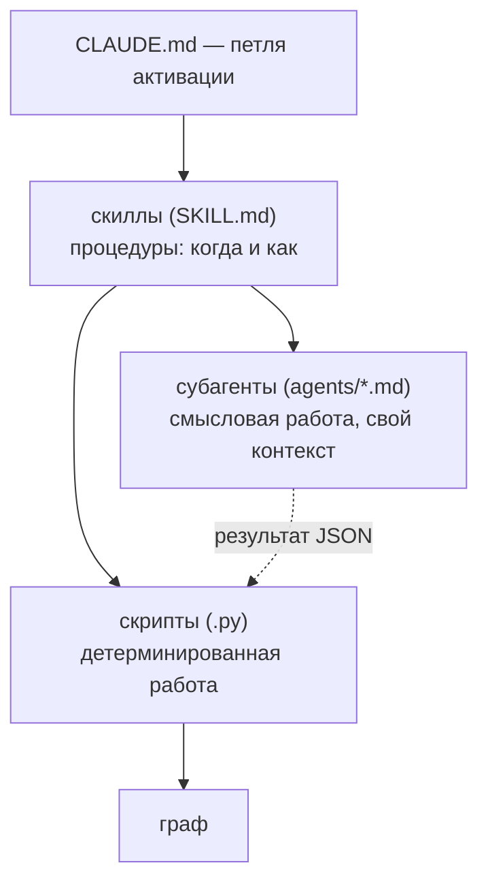

# 08 — Субагенты и скиллы

Этот раздел — про управляющую плоскость: как детерминированные скрипты и языковая модель **оркестрируются** в единый процесс. Управление трёхуровневое: `CLAUDE.md` задаёт петлю активации (что делать в начале сессии, по ходу и в конце), **скиллы** — это процедуры (когда и как выполнить операцию), а **субагенты** — изолированные экземпляры модели, выполняющие смысловую работу в собственном контексте. Ключевой принцип: скилл решает *когда/как*, запускает скрипты и делегирует понимание субагенту; субагент работает в своём контексте, возвращает короткую сводку и **никогда не редактирует граф** — его выход (файл JSON) вносит транзакционно скрипт. Что хранит и как устроен сам граф — в других разделах; здесь — кто им управляет.

## Расположение

- Скиллы — каталоги `skills/<имя>/`, в каждом `SKILL.md` (имя + триггерящее описание), `scripts/` (код) и при необходимости `references/`.
- Субагенты — файлы `agents/<имя>.md` (фронтматтер с `model` и `tools` плюс промпт).
- `CLAUDE.md` — небольшой файл памяти проекта, загружаемый в начале каждой сессии (в том числе после `/clear`); при установке его блок дописывается в корневой `CLAUDE.md` проекта.

## Три уровня управления

Субагент не пишет в граф сам: он отдаёт результат файлом JSON, а вносит его в граф детерминированный скрипт под локом (поэтому всё крэш-безопасно и обратимо).

## Скиллы

Скилл — это процедура: папка с `SKILL.md`, чьё поле `description` описывает, *когда* скилл применять. Срабатывание — по **смыслу** запроса, а не по точному слову: модель сама выбирает скилл, когда задача подходит под описание. Скиллов три.

### `amg-bootstrap` — построить или свести граф

Срабатывает на «проиндексируй проект», «свери граф», «добавил/изменил/удалил файлы», «граф устарел». Запускается при первой сессии в проекте, в начале сессии если источники могли измениться, после правок и после сбоя (самоисцеление). Рабочий процесс (из корня проекта; чтение единиц делегируется субагентам, чтобы не засорять основной контекст):

1. **Исцелить.** Проиграть незавершённые записи и снять устаревшее состояние: `graph_store.py recover`, затем `graph_store.py verify --repair`.
2. **Дифф и скелет.** `reconcile.py bootstrap .` — посчитать added/changed/deleted, крэш-безопасно записать структурные узлы и выгрузить очередь `work/queue.json`. Если `queued_for_semantic` равно 0 — граф актуален, остановиться. Предварительно `extract_structure.py . --stats` показывает классификацию и доступность tree-sitter; если в выводе есть `ambiguous_files`, можно (необязательно) запустить субагент `amg-classifier`, чтобы разметить их до деривации.
3. **Деривация (массово).** Прочитать `work/queue.json`; если он велик — разбить на партии по поддеревьям и запустить по субагенту `amg-builder` на партию **параллельно**, каждому — его срез и путь вывода `work/derived-<партия>.json`.
4. **Применить деривации.** Для каждого файла: `reconcile.py apply work/derived-<партия>.json .` — это ставит `derived_from_hash = source_hash` и переводит узлы в `active`.
5. **Синтез и отчёт о пробелах.** Один субагент `amg-synth`: верхнеуровневые узлы-обзоры и хабы, межслойные рёбра, взвешенное мультичленство и **отчёт о пробелах** (`gap-report.md`). Его деривацию применить так же (шаг 4), отчёт показать пользователю.
6. **Журнал.** Скрипты дописывают строку с `txid` в `log.md`; подтвердить пользователю итоговые счётчики и выжимку отчёта.

Уровни моделей для шагов задаются в `config.yml` (блок `models`). Источники только на чтение; повторный прогон на неизменном репозитории бесплатен (хеш-гейт). Полная механика — в разделах [Извлечение структуры](./04-ingest.md) и [Сверка и деривация](./05-reconcile.md).

### `amg-retrieve` — собрать пакет контекста перед задачей

Срабатывает на любую задачу, называющую функцию/модуль/подсистему/фичу: «поработай над/почини/расширь X», «как работает X», «что связано с X». Запускается **до** работы с кодом. Рабочий процесс:

1. **Сформулировать запрос** — задача плюс конкретные идентификаторы, которые она называет.
2. **Запустить субагент `amg-retriever`** — он выполняет `retrieve.py "<запрос>" --store .claude/amg`, который пишет `cache/pack.md`, и возвращает путь пакета и сводку 3–5 строк.
3. **Прочитать пакет** (`cache/pack.md`) и работать по нему. Четыре яруса: *Strategic* (обзоры/хабы), *Tactical* (релевантные модули), *Operational* (указатели на код + тела документов/заметок в фокусе), *Related* (ссылки на следующий круг). Для кода пакет даёт **указатели** `путь:строка` — редактировать нужно реальный файл, граф не копия кода.
4. Если чего-то не хватает — расширить запрос идентификаторами и перезапустить либо пройти по ссылке *Related*.

Скилл также даёт **харнесс измерения**: `eval_retrieval.py` сравнивает пакет AMG с лексической (RAG-подобной) базой top-k и сообщает recall, precision и **hop-recall** (полнота на узлах, не совпадающих с запросом лексически, — то, что добавляет именно распространение активации). Режимы: `--make-demo <путь>` (воспроизводимая демо-разметка) и `--cases cases.json` (свои размеченные случаи `{id, query, gold_ids}`). По числам настраиваются `damping`, `activation_threshold`, `token_budget`, `relation_priors` — не «на глаз». Опциональный семантический засев включается в `config.yml` (`retrieval.embeddings`); без бэкенда извлечение молча остаётся чисто-лексическим. Подробности — в разделе [Извлечение из графа](./06-retrieval.md) и [Измерение и инструменты](./10-eval-tools.md).

### `amg-consolidate` — обслуживание памяти

Срабатывает на «консолидируй/прибери/сожми память», «подведём итоги сессии», а также при зашумлённой выдаче. Запускается в конце сессии (перед `/clear`), по расписанию или по запросу. Рабочий процесс:

1. **Свернуть веса** (детерминированно): `consolidate.py weights .` — хеббовское усиление, затухание, обрезка, перенормировка `part_of`, ротация журнала ко-активаций в архив.
2. **Зафиксировать выводы сессии** — записать решения, выводы и планы как узлы `notes` (статус `captured`). Это эпизодический вход для шага значимости; при сомнении — фиксировать (отбор будет дальше).
3. **План** (детерминированно): `consolidate.py plan .` — пишет `work/consolidation-plan.json` (ветки сверх бюджета, кандидаты-дубли, эпизодические заметки по детерминированной значимости).
4. **Суждение** — субагент `amg-consolidator` по плану решает, что повысить/вывести, что слить, что свернуть, где ввести под-хаб и что укоротить; выдаёт `work/actions.json`. Граф не редактирует.
5. **Применить** (детерминированно, транзакционно, с архивацией): `consolidate.py apply work/actions.json .`

Полная механика весов, рубрики значимости и компрессии — в разделе [Консолидация](./07-consolidation.md).

## Субагенты

Субагент — изолированный экземпляр модели (файл `agents/<имя>.md`) со своей моделью, своим набором инструментов и узким промптом. Он работает в собственном контексте, возвращает вызывающему только короткую сводку и **никогда не редактирует граф или источники** (только чтение); его единственный результат — файл JSON, который применяет скрипт. Сводная таблица:

| Субагент | Модель | Инструменты | Когда | Выход |
|---|---|---|---|---|
| `amg-classifier` | haiku | Read, Grep, Glob | bootstrap, для неоднозначных файлов | JSON: путь → `{category, language}` |
| `amg-builder` | sonnet | Read, Grep, Glob, Bash | bootstrap, по партии очереди (параллельно) | derivation JSON: сводки + рёбра |
| `amg-synth` | opus | Read, Grep, Glob, Bash | bootstrap, после деривации | derivation JSON (хабы, межслойные рёбра) + `gap-report.md` |
| `amg-retriever` | haiku | Read, Grep, Glob, Bash | начало задачи | путь пакета + сводка 3–5 строк |
| `amg-consolidator` | opus | Read, Grep, Glob, Bash | консолидация | `actions.json` |

### `amg-builder` (sonnet) — деривация смысла

**Вход:** партия единиц очереди `{id, kind, source_path, category, content_sha, qualname, lineno, lang}`, где `lang` — язык источника (`python`, `markdown`, …), а `qualname`/`lineno` указывают нужный срез файла (единица может нести поле `text` — заранее извлечённое содержимое из бинарного формата); путь вывода, `working_language`. **Делает:** для каждой единицы — если есть `text`, суммирует по нему (источник бинарный, не открывать); иначе читает нужный срез `source_path` (ориентируясь на `kind`/`qualname`). Пишет **сводку** (1–3 фразы о назначении и роли, не пересказ; в коде идентификаторы и сигнатуры дословно, проза — на `working_language`, без калек) и предлагает **рёбра** (`calls`/`depends_on` к id кода, `documents` на узлах-документах, `refines`/`relates_to` мягче, `contradicts` только при реальном конфликте с малым весом; вес в (0,1]: сильное ~0.8–1.0, попутное ~0.3–0.5; не выдумывать цели). **Выход:** массив JSON из `{id, summary, lang, edges}`. **Правила:** обрабатывать только свою партию (неизменное не трогать); при непонимании — честная короткая сводка без спекулятивных рёбер; вызывающему вернуть только счётчики.

### `amg-synth` (opus) — стратегический слой и аудит

**Вход:** наполненный набор узлов (фронтматтер), путь вывода деривации, путь отчёта о пробелах, `working_language`. Работает поверх готовых сводок, рассуждая обо всём графе, а не о сырых файлах. **Производит:** (1) узлы-обзоры и хабы (`type: derived`, в `nodes/_hubs/`) — короткий обзор архитектуры и по хабу на значимую сквозную тему; (2) межслойные и сквозные рёбра — `documents` (раздел документа → id кода), `part_of` **с весами** для мультичленства (сумма ≤ 1; наибольший вес — канонический дом), `supersedes`/`contradicts`; (3) **отчёт о пробелах** (`gap-report.md`): недокументированный код (узлы кода без входящего `documents`), «уплывшие» документы (описывают изменившийся или удалённый код), противоречия. **Выход:** derivation JSON (id хабов вида `hub:<тема>`) + markdown-отчёт. **Правила:** обосновывать каждое ребро, лучше немного качественных хабов, чем много тонких; только чтение; вернуть сводку 3–5 строк и счётчики отчёта.

### `amg-classifier` (haiku) — разрешение неоднозначных типов

**Вход:** короткий список путей (`ambiguous_files` из `extract_structure.py --stats`). **Делает:** читает первые ~50 строк и выбирает ровно одно — `code` (плюс `language` как имя грамматики tree-sitter, если ясно; shebang — сильный сигнал), `doc` (проза) или `data` (структурированные записи), по принципу «как файл лучше нарезать»; при сомнении — `doc` (безопасное умолчание, которое уже использует скрипт). **Выход:** компактное JSON-сопоставление `путь → {category, language}`. **Правила:** только чтение, только заданные файлы, быстро.

### `amg-retriever` (haiku) — извлечение пакета (только чтение)

**Вход:** строка запроса, путь хранилища. **Делает:** формулирует запрос под лексический засев (добавляет конкретные идентификаторы и близкие синонимы; одна строка; не выдумывать маловероятные термины); запускает `retrieve.py "<запрос>" --store .claude/amg`; бегло проверяет ранжирование и при промахе перезапускает один раз (не более двух попыток). **Возвращает:** путь `cache/pack.md` и сводку 3–5 строк (какие подсистемы активировались, топ 4–6 узлов, заметное — например, решение или противоречие); сам пакет целиком не вставляет. **Правила:** только чтение; максимум две попытки; если граф пуст или путь отсутствует — прямо сказать и остановиться.

### `amg-consolidator` (opus) — суждение при обслуживании памяти

**Вход:** `work/consolidation-plan.json` (ветки сверх бюджета, кандидаты-дубли, эпизодические заметки по значимости), тела нужных узлов, `working_language`. **Принципы:** ценность информации, а не тема — хранить и повышать решения, обязательства, планы, синтез, мосты между кластерами, переиспользуемые принципы; понижать и сжимать дубли, разовую болтовню, вытесненные утверждения, многословие с низким переиспользованием; необоснованные догадки — как открытые вопросы, не факты. **Защита:** не сворачивать и не укорачивать узлы защищённых типов (`decision`/`adr`) и сильно связанные; при сомнении — сохранять (повышение и фиксация обратимы, потеря смысла — нет). **Компрессия:** только помеченные планом ветки, поэтапно, со **стопом**, как только ветка вернулась под бюджет. **Выход:** `actions.json` — массив действий `promote` / `merge` / `summarize_episodes` / `introduce_subhub` / `shorten` / `retire` (формы — в разделе [Консолидация](./07-consolidation.md)); `merge`/`summarize_episodes`/`retire` архивируют оригиналы автоматически, входящие рёбра перенаправляет скрипт. **Возвращает:** 3–5 строк (счётчики по типам действий, какие ветки сжаты и почему, что заметное повышено) и напоминание сверить полноту харнессом до/после.

## Петля активации (`CLAUDE.md`)

`CLAUDE.md` — небольшой файл памяти проекта, загружаемый в начале каждой сессии. Он несёт петлю активации AMG (текущее поведение):

- **Гейт активации.** В начале сессии проверить, есть ли `.claude/amg/config.yml` с `active: true`. Нет или `active: false` → AMG выключен, обычная сессия Claude Code, граф не создаётся. Есть и активен → работать по петле.
- **Рабочая петля (когда включён).** (1) **Исцелить, затем синхронизировать** — проиграть незавершённую запись (`graph_store.py recover`, `verify --repair`), затем, если источники могли измениться или это первая сессия, запустить скилл `amg-bootstrap` до работы. (2) **Извлечь до работы** — на каждую задачу сначала собрать контекст скиллом `amg-retrieve`. (3) **Фиксировать по ходу, консолидировать в конце** — решения и планы писать узлами `notes` (это дёшево и не требует bootstrap, который только для файлов-источников), а в конце сессии или перед `/clear` один раз запустить `amg-consolidate` (выводы, оставшиеся только в чате, теряются при `/clear`).
- **Мягкий барьер.** Собственные скиллы, агенты и скрипты AMG — инфраструктура; **не редактировать** их в рамках задачи. Если виден баг или ограничение — сообщить пользователю, а не править на ходу, чтобы каноническая протестированная версия оставалась авторитетной.
- **Восстановление.** При любой несогласованности — `recover` + `verify --repair` + `reconcile.py bootstrap .`.

## Планируется (дорожная карта)

Следующее в управляющей плоскости спроектировано, но **ещё не реализовано** (полностью — в разделе [Дорожная карта](./11-roadmap.md)):

- **Хуки `SessionStart` / `SessionEnd`** — автоматизируют исцеление на старте и консолидацию плюс сохранение сессии в конце. Честная оговорка: жёсткое завершение процесса может не вызвать `SessionEnd`, поэтому фиксация по ходу (`notes`) остаётся страховкой, а журнал ловит недописанные транзакции.
- **Сохранение сессий** — `SessionEnd` выгружает диалог в `sessions/ГГГГ-ММ-ДД-ЧЧММ.md` (markdown с маркерами ролей, без сырых размышлений) в absorb-папку; путь и `session_policy` (`absorb`|`mirror`, по умолчанию `absorb`) — в конфиге.
- **Команды `/amg on | off | repair | status`** — у каждой автоматической операции есть ручная; триггеры гибкие (через `description` скиллов модель ловит намерение, а не точный глагол).
- **Флаг `automation: on | off`** — при `off` модель ничего не делает сама, только по `/amg ...` или явному запросу.
- **Маркеры слияния `CLAUDE.md`** — при установке блок AMG дописывается в **конец** существующего `CLAUDE.md` между `<!-- AMG:BEGIN -->` и `<!-- AMG:END -->` (инструкции проекта остаются первыми; переустановка заменяет только этот блок; нет файла — создаётся с одним блоком).

## Дальше

- [Карта документации](./README.md) — оглавление архитектуры и возврат к началу.
- [01 — Общая картина](./01-overview.md) — карта оркестрации и структура репозитория.
- [04 — Извлечение структуры](./04-ingest.md) — вход для `amg-classifier` и `amg-builder`.
- [05 — Сверка и деривация](./05-reconcile.md) — как применяются деривации `amg-builder` и `amg-synth`.
- [07 — Консолидация](./07-consolidation.md) — что делает `amg-consolidator` и формы действий.
- [09 — Справочник конфигурации](./09-config.md) — `active`, `models`, `automation`, `session_policy` и прочие ключи.
