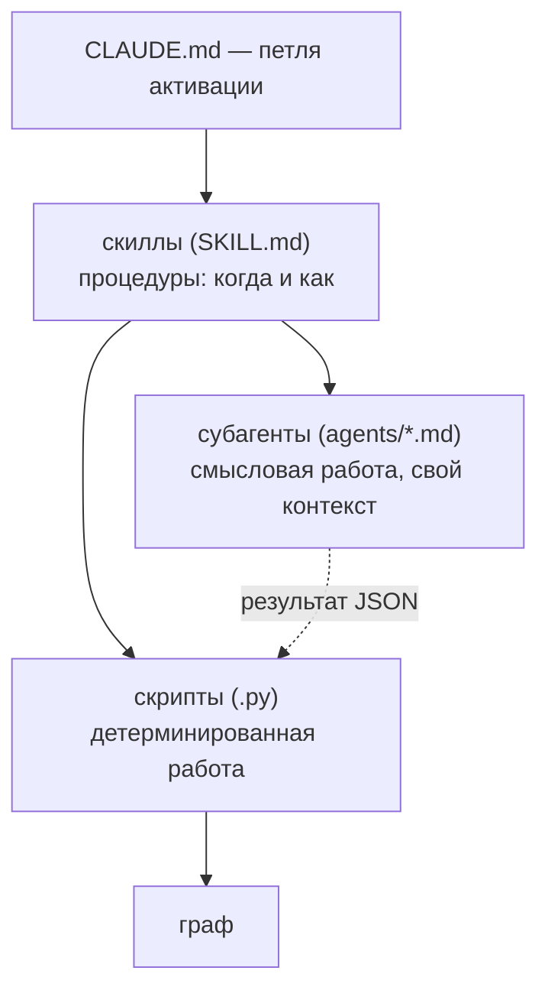

# 08 — Субагенты и скиллы

Этот раздел — про управляющую плоскость: как детерминированные скрипты и языковая модель **оркестрируются** в единый процесс. Управление трёхуровневое: `CLAUDE.md` задаёт петлю активации (что делать в начале сессии, по ходу и в конце), **скиллы** — это процедуры (когда и как выполнить операцию), а **субагенты** — изолированные экземпляры модели, выполняющие смысловую работу в собственном контексте. Ключевой принцип: скилл решает *когда/как*, запускает скрипты и делегирует понимание субагенту; субагент работает в своём контексте, возвращает короткую сводку и **никогда не редактирует граф** — его выход (файл JSON) вносит транзакционно скрипт. Что хранит и как устроен сам граф — в других разделах; здесь — кто им управляет.

## Расположение

- Скиллы — каталоги `skills/<имя>/`, в каждом `SKILL.md` (имя + триггерящее описание), `scripts/` (код) и при необходимости `references/`.
- Субагенты — файлы `agents/<имя>.md` (frontmatter с `model` и `tools` плюс промпт).
- `CLAUDE.md` — небольшой файл памяти проекта, загружаемый в начале каждой сессии (в том числе после `/clear`); при установке его блок дописывается в корневой `CLAUDE.md` проекта.

## Три уровня управления

Субагент не пишет в граф сам: он отдаёт результат файлом JSON, а вносит его в граф детерминированный скрипт под блокировкой (поэтому всё устойчиво к сбоям и обратимо).

## Скиллы

Скилл — это процедура: папка с `SKILL.md`, чьё поле `description` описывает, *когда* скилл применять. Срабатывание — по **смыслу** запроса, а не по точному слову: модель сама выбирает скилл, когда задача подходит под описание. Скиллов три.

### `amg-bootstrap` — построить или свести граф

Срабатывает на «проиндексируй проект», «свери граф», «добавил/изменил/удалил файлы», «граф устарел». Запускается при первой сессии в проекте, в начале сессии если источники могли измениться, после правок и после сбоя (самовосстановление). Оркестрация ведётся **тонко**: всё, что лежит в контексте оркестратора, переотправляется на каждом его ходу, поэтому субагентам передаются **пути** файлов (очередь и результаты они читают в собственных изолированных контекстах), осмотр идёт только агрегатами (`inspect_queue.py`, счётчики команд), а по-партийные результаты сводятся к одной строке статуса — сырые листинги и содержимое файлов в разговор не попадают. **Число ходов — та же валюта, что и объём данных** (каждая команда оркестратора переотправляет весь его контекст), поэтому дисциплина явная: один вызов `apply-derived` на раунд (никогда — по применению на файл-часть), субагенты раунда запускаются одним сообщением волнами по 5–10, конфиг читается один раз, и `working_language` передаётся исполнителям **прямо в задании** (исполнитель, открывший `config.yml`, тратит целый ход с переотправкой контекста ради одного слова), а **самодельные скрипты, трогающие граф, запрещены** — поставляемый CLI покрывает каждый шаг конвейера, и кажущийся недостающим шаг сообщается пользователю, а не импровизируется. Ещё одна граница: выводы о самом движке AMG (заподозренная ошибка, ограничение) идут пользователю в отчёте и никогда — в граф проекта через `notes.py`: они засорили бы дайджест. Рабочий процесс (из корня проекта):

1. **Восстановить.** Проиграть незавершённые записи и снять устаревшее состояние: `graph_store.py recover`, затем `graph_store.py verify --repair`.
2. **Дифф и скелет.** `reconcile.py bootstrap .` — посчитать added/changed/deleted, устойчиво к сбоям записать структурные узлы (с детерминированным хребтом рёбер: `imports`/`defines`/`inherits` + разрешённые резолвером `calls`) и выгрузить очередь `work/queue.json`; деривации, уже лежащие в кэше, восстанавливаются автоматически (`restored_from_cache`), а тривиальные единицы кода выводятся детерминированной авто-сводкой на месте (`auto_summarized`; см. [Сверку](./05-reconcile.md)) — так что `queued_for_semantic` — реальная оставшаяся работа модели. Если он равен 0 и граф уже линкован — остановиться. Предварительно `extract_structure.py . --stats` показывает классификацию и доступность tree-sitter; если в выводе есть `ambiguous_files`, можно (необязательно) уточнить их тип: запустить субагент `amg-classifier`, записать его вердикт в `work/classification-overrides.json` и повторить `bootstrap` — извлечение прочтёт overrides **раньше** своей резервной классификации и направит файлы в нужные нарезатели. Шаг необязательный: очередь неоднозначностью не блокируется (по умолчанию такой файл обрабатывается как проза).
3. **Семантическое обогащение (массово).** Осмотреть очередь хелпером `inspect_queue.py` (счётчики по category/поддереву/kind + блок `progress`), не читая `queue.json` в собственный контекст; разбить `partition_queue.py`: он группирует по поддеревьям **и ограничивает каждую партию** капами по числу единиц и оценке объёма (`config.yml → builder`), дробя плотный каталог на части `work/queue-<партия>[-NN].json`. Запустить по субагенту `amg-builder` на партию **параллельно, волнами по 5–10 агентов в одном сообщении**, каждому — путь его партии, путь вывода и значение `working_language`. Единицы очереди несут собственный `text`, поэтому сборщик пишет сводки прямо из партии, не открывая источники (единственное законное чтение исходника, которое не отменяет никакая волновая инструкция, — **сверхкрупная** единица, пришедшая только указателем: сборщик читает её срез `lineno`–`line_end`); результат он **чекпоинтит частями** `derived-<партия>-p01.json`, `-p02.json`, … (записанная часть переживает любой обрыв) и завершает строкой `BATCH COMPLETE: N/M` либо `BATCH PARTIAL: N/M` — честный сигнал вместо ложного «готово» (см. ниже § `amg-builder`).
4. **Применить раунд — одним вызовом — и сверить счётчики.** Когда раунд исполнителей вернулся: `reconcile.py apply-derived .` — потребляет **все** `work/derived-*.json` (включая чекпоинт-части) одной транзакцией с одним агрегированным итогом, переносит употреблённые файлы в `work/applied/` (рваную часть — в `work/invalid/`), ставит `derived_from_hash = source_hash` и переводит узлы в `active`. Применение файлов-частей по одной команде — ровно та утечка числа ходов, которую пакетная дверь и закрывает. Битый элемент чинится или пропускается поэлементно (`skipped_invalid` + причины), партия не падает; применённое ложится в кэш дериваций (пересборка восстановит бесплатно). Слову сборщика о завершении оркестратор **не верит**: агрегированное `applied + skipped_*` сверяется с числом единиц раунда, недостача (или `BATCH PARTIAL`) означает оборванную партию — добрать остаток повторным сборщиком либо просто повторить шаг 2 (недовыведенная единица вернётся в очередь по построению, ничего не теряется). **Каждый промежуточный отчёт пользователю несёт процент прогресса** (`inspect_queue.py .` → `progress.derived_percent`) и явно называет оборванную партию.
5. **Синтез и отчёт о пробелах — хабы ДО линковки.** Сначала два детерминированных входа: `link_candidates.py --hubs .` — стабильные якоря хабов из структуры каталогов (`work/hub-candidates.json`) — и `link_candidates.py --synth-input .` — **весь слой сводок одним листом** (`work/synth-input.json`: id/type/qualname/summary/part_of по поддеревьям, точные счётчики, плюс готовое сырьё `gaps` — недокументированный код, рассинхронизированные ссылки документов, пары противоречий; с капом объёма: сверх бюджета сначала обрезаются сводки, затем группы оставляют выборки при точных счётчиках). Затем один субагент `amg-synth`, работающий **только от этих двух файлов** — он никогда не сканирует `nodes/` и не открывает источники (пофайловый скан в изолированном агенте переотправляет всё прочитанное на каждом ходу — тот самый квадратичный сток токенов, который лист устраняет): верхнеуровневые узлы-обзоры и хабы, **заякоренные** на стабильные подсказанные id (таксономия не пересобирается заново при каждой пересборке), рёбра хаб→члены, взвешенное мультичленство, **узлы-паттерны** (при настоящих повторяющихся паттернах) и **отчёт о пробелах** (`gap-report.md`, пишется из блока `gaps` листа). Его обогащение применить тем же единственным вызовом `apply-derived` (шаг 4), отчёт показать пользователю.
6. **Глобальная смысловая линковка (параллельно).** Билдеры заперты своими партиями, поэтому кросс-доменные связи (док↔код, пример↔руководство, ADR→код) достраивает глобальный пасс: `link_candidates.py .` номинирует каждому выведенному узлу top-K похожих из других доменов/файлов (близость по кэшу эмбеддингов, без бэкенда — лексический фолбэк) в ограниченные пачки `work/link-batch-*.json` с глобальным списком хабов; по субагенту `amg-linker` на пачку **параллельно, волнами по 5–10 в одном сообщении**, вывод пишется чекпоинт-частями `work/derived-links-<n>-p01.json`, … (оборванная пачка сохраняет уже рассуженные узлы), применяется тем же единственным вызовом `apply-derived`. После каждой волны оркестратор докладывает «X/Y пачек рассужено» (называя PARTIAL поимённо). Пасс инкрементально ре-запускаем и **сходится**: уже связанные пары не переноминируются, а отклонения тоже запоминаются — каждая часть заканчивается служебной записью `{"judged": [...]}`, и `apply-derived` уводит пачку, все узлы которой покрыты записями, в `work/judged/`, чьи пары номинатор больше не предлагает (недокрытая — оборванная — пачка остаётся и честно переноминируется). Поэтому встроенный критерий полноты достижим: повторять `link_candidates.py` + волну, пока он не выдаст ноль новых пачек либо `metrics` не скажет `gate: ok`, — обычно одна-две волны, и вторая несёт только действительно новые пары. Переоткрыть старые суждения — удалить файлы из `work/judged/`.
7. **Приёмочный гейт связности + штамп верификации.** `reconcile.py metrics .` — компоненты, внутренние висячие цели, doc-узлы без `documents`; вердикт `gate: ok | attention`. На `attention` — посмотреть образцы и обычно перезапустить шаг 6 по оставшимся островам; внешние `imports` (stdlib/сторонние) законны и не флагуются. Тот же вердикт виден в `/amg status`. Затем один детерминированный свип — `verify_claims.py --all --write` (секунды, без модели: пере-нарезка и сверка хешей по файлам) — штампует свежим узлам `verified`: свежевыведенная сводка совпадает с источником по построению, и после свипа пометка `unverified`/`stale` в пакете означает «изменилось с последней сверки», а не горит на каждом узле.

**Стратегия деривации (`config.yml → derivation`).** По умолчанию `eager` — деривировать все узлы очереди (шаги 3–4 над всей `queue.json`), затем синтез. Опциональный `lazy` (осмыслен лишь на графе много большем, чем опрашивается) строит структурную **карту** сразу, а листовую детализацию откладывает: после шага 2 очередь делится `partition_queue.py --priority .` на приоритетную партию (module/class/package/file) и отложенный остаток (function/section/record); шаги 3–4 идут только над приоритетной, синтез (шаг 5) выполняется **всегда**. **Предохранители:** структурный скелет и стратегический синтез не откладываются никогда; отложенный узел деривируется **на первом касании** — когда запрос его активирует, скилл `amg-retrieve` доводит `stale_in_pack` сборщиком до ответа (см. [Извлечение из графа](./06-retrieval.md)); фоновый добор по `usage.log` (`--priority --usage`). Ветвление — на уровне скилла и инструментов; движок на флаг не ветвится. Полная спецификация — [Дорожная карта, §4.10](./11-roadmap.md).
8. **Журнал.** Скрипты дописывают строку с `txid` в `actions.log`; подтвердить пользователю итоговые счётчики, выжимку отчёта о пробелах и вердикт гейта.

Уровни моделей для шагов задаются в `config.yml` (блок `models`) — установщик рендерит их в определения субагентов (frontmatter `agents/*.md` или TOML Codex; см. [Справочник конфигурации](./09-config.md)). Источники только на чтение; повторный прогон на неизменном репозитории бесплатен (фильтр по хешу). Полная механика — в разделах [Извлечение структуры](./04-ingest.md) и [Сверка и семантическое обогащение](./05-reconcile.md).

### `amg-retrieve` — собрать пакет контекста перед задачей

Срабатывает на любую задачу, называющую функцию/модуль/подсистему/фичу: «поработай над/почини/расширь X», «как работает X», «что связано с X». Запускается **до** работы с кодом. Рабочий процесс:

1. **Сформулировать запрос** — задача плюс конкретные идентификаторы, которые она называет.
2. **Запустить извлечение напрямую** (умолчание): `retrieve.py "<запрос>" --store .claude/amg` — напечатанный пакет становится рабочим контекстом за один ход, и тот же пакет пишется в `cache/pack.md`; намерение history/конфликты вызывающий распознаёт сам и передаёт флагом `--intent history|conflict`. **Субагент `amg-retriever` — вариант изоляции**: его спавнят только когда пакет не должен попадать в окно вызывающего (вопрос-выжимка к памяти; уже перегруженный контекст) — он выполняет ту же команду в своём контексте и возвращает путь пакета плюс выжимку 3–5 строк, ценой собственного фиксированного оверхеда на каждом шаге, потому он исключение, а не умолчание.
3. **Работать по пакету** (напечатанному или из `cache/pack.md`). Четыре яруса: *Strategic* (обзоры/хабы), *Tactical* (релевантные модули), *Operational* (указатели на код + тела документов/заметок в фокусе), *Related* (ссылки на следующий круг). Для кода пакет даёт **указатели** `путь:строка` — редактировать нужно реальный файл, граф не копия кода.
4. Если чего-то не хватает — расширить запрос идентификаторами и перезапустить либо пройти по ссылке *Related*.

Скилл также даёт **измерительный стенд**: `eval_retrieval.py` сравнивает пакет AMG с лексической (RAG-подобной) базой top-k и сообщает recall, precision и **hop-recall** (полнота на узлах, не совпадающих с запросом лексически, — то, что добавляет именно распространение активации). Режимы: `--make-demo <путь>` (воспроизводимая демо-разметка) и `--cases cases.json` (свои размеченные случаи `{id, query, gold_ids}`). По числам настраиваются `damping`, `activation_threshold`, `token_budget`, `relation_priors` — не «на глаз». Опциональный семантический засев включается в `config.yml` (`retrieval.embeddings`); без бэкенда извлечение молча остаётся чисто-лексическим. Подробности — в разделе [Извлечение из графа](./06-retrieval.md) и [Измерение и инструменты](./10-eval-tools.md).

### `amg-consolidate` — обслуживание памяти

Срабатывает на «консолидируй/прибери/сожми память», «подведём итоги сессии», а также при зашумлённой выдаче. Запускается в конце сессии (перед `/clear`), по расписанию или по запросу. Рабочий процесс:

1. **Свернуть веса** (детерминированно): `consolidate.py weights .` — хеббовское усиление, затухание, обрезка, перенормировка `part_of`, ротация журнала ко-активаций в архив.
2. **Зафиксировать выводы сессии** — записать решения, выводы, открытые вопросы и планы через безопасный API заметок `notes.py add` (а **не** правкой `nodes/` руками): `notes.py add --type decision --summary "…" [--body "…"] [--tags "…"]`; типы `note`/`decision`/`adr`/`open_question`/`plan`, по умолчанию статус `captured`, запись транзакционная и устойчивая к сбоям. Это эпизодический вход для шага значимости; при сомнении — фиксировать (отбор будет дальше).
3. **План** (детерминированно): `consolidate.py plan .` — пишет `work/consolidation-plan.json`: ветки сверх бюджета (с `members_preview` — id/type/summary), кандидаты-дубли (каждый с **обеими сводками**), эпизодические заметки по детерминированной значимости (с типом и сводкой) и кандидаты арбитража со входами сравнения — план несёт сводку каждого кандидата, чтобы судья работал только от него.
4. **Суждение** — субагент `amg-consolidator` по плану (тела узлов открываются только для финалистов разрушительного действия) решает, что повысить/вывести, что слить, что свернуть, где ввести под-хаб и что укоротить; выдаёт `work/actions.json`. Граф не редактирует.
5. **Применить** (детерминированно, транзакционно, с архивацией): `consolidate.py apply work/actions.json .`

Полная механика весов, рубрики значимости и компрессии — в разделе [Консолидация](./07-consolidation.md).

## Субагенты

Субагент — изолированный экземпляр модели (файл `agents/<имя>.md`) со своей моделью, своим набором инструментов и узким промптом. Он работает в собственном контексте, возвращает вызывающему только короткую сводку и **никогда не редактирует граф или источники** (только чтение); его единственный результат — файл JSON, который применяет скрипт. Сводная таблица:

| Субагент | Модель | Инструменты | Когда | Выход |
|---|---|---|---|---|
| `amg-classifier` | haiku | Read, Grep, Glob | bootstrap, для неоднозначных файлов | JSON: путь → `{category, language}` |
| `amg-builder` | sonnet | Read, Grep, Glob, Bash, Write | bootstrap, по партии очереди (параллельно) | derivation JSON: сводки + рёбра |
| `amg-synth` | opus | Read, Grep, Glob, Bash, Write | bootstrap, после обогащения (хабы — до линковки) | derivation JSON (хабы, межслойные рёбра) + `gap-report.md` |
| `amg-linker` | sonnet | Read, Grep, Glob, Bash, Write | bootstrap, после синтеза — по пачке кандидатов (параллельно) | derivation JSON: подтверждённые кросс-доменные рёбра + членства в хабах |
| `amg-retriever` | haiku | Read, Grep, Glob, Bash | начало задачи | путь пакета + сводка 3–5 строк |
| `amg-consolidator` | opus | Read, Grep, Glob, Bash, Write | консолидация | `actions.json` |

Исполнители, производящие JSON-артефакты (билдер, линковщик, синтез, консолидатор), несут **инструмент Write ровно для этих артефактов** — чекпоинт-частей под `work/`, отчёта о пробелах, `actions.json` — и пишут их именно им, никогда bash-heredoc'ом: сводки несут кавычки, апострофы и обратные кавычки, и heredoc рвётся на них посреди файла (полевой сбой, превративший партию из ~7 вызовов в десятки починочных). Записанные части валидируются **одним вызовом в конце, разом по всем** (глоб по частям партии в одном `python -c`) — никогда по команде на часть (каждая команда — ход с переотправкой всего контекста агента) и никогда Read-ом собственного вывода (он заливает в контекст JSON, который агент и так держит); рваную часть к тому же карантинит применяющий скрипт, не прерывая остального. Всё остальное — источники и граф — для каждого исполнителя остаётся только чтением: единственный путь в граф — детерминированный скрипт, применяющий JSON транзакционно.

### `amg-builder` (sonnet) — семантическое обогащение

**Вход:** партия единиц очереди `{id, kind, source_path, category, content_sha, qualname, lineno, line_end, lang, text?}`, где `lang` — язык источника (`python`, `markdown`, …), а `text` — **собственное содержимое единицы**, уже нарезанное для сборщика (исходник функции, раздел документа, сериализованная запись, страница PDF, срез лога, сообщение чата); путь вывода, `working_language`. **Делает:** суммирует по `text` — он есть почти у каждой единицы и авторитетен, **источники при его наличии не открываются вовсе** (перечитывание уже переданного — главная статья расхода сборки); только у сверхкрупной единицы, пришедшей без `text` (порог `queue_text_max_chars`), читается ровно срез `lineno`–`line_end` файла `source_path`. Пишет **сводку** (1–3 фразы о назначении и роли, не пересказ; в коде идентификаторы и сигнатуры дословно, проза — на `working_language`, без калек) и предлагает **рёбра**: `depends_on` сверх детерминированных (imports/calls/defines/inherits эмитит сверка — их не повторять), `documents` **обязателен** у doc-единицы с реальным предметом (гейт связности считает doc-узлы без него), `refines`/`exemplifies`/`relates_to` мягче, `contradicts` только при реальном конфликте с малым весом; вес в (0,1]: сильное ~0.8–1.0, попутное ~0.3–0.5. **Направление ребра закреплено конвенцией**: `id` элемента — узел-источник отношения, `to` — его цель: `documents` — doc-единица → код, который она описывает; `exemplifies` — конкретный случай → понятие; `depends_on` — зависимый → то, что он использует (поле показало: без конвенции исполнители выводили её, подглядывая в чужие файлы результатов). Цель пишется максимально конкретным путём — цель без ведущих каталогов (или голое имя символа) резолвер привяжет к единственному каноническому id, но выдуманный символ останется висячим (не выдумывать); doc-цель всегда именует конкретную секцию (`doc:<путь>::<slug>`) — файловых doc-узлов не существует, и цель на весь файл висяча по построению; кросс-доменная полнота — не его работа (её даёт глобальный линковщик после всех сводок). **Выход:** массивы JSON из `{id, summary, lang, confidence, edges, content_sha}`, записываемые **частями-чекпоинтами** `derived-<партия>-p01.json`, `-p02.json`, … по мере готовности (~10 единиц на часть): записанная часть долговечна, обрыв — лимит, разрыв связи, потолок вывода — теряет лишь единицы после последнего чекпоинта, а не партию (`content_sha` — эхо хеша единицы из очереди: `reconcile apply` пропускает элемент, чей источник изменился с момента деривации (`skipped_stale`), поэтому уцелевшие части применяются безопасно, а повторно деривируется лишь остаток — возобновляемость; `confidence` 0..1 — оценка уверенности в сводке, при отсутствии узлу даётся `default_confidence`). **Правила:** обрабатывать только свою партию (неизменное не трогать); при непонимании — честная короткая сводка с **низкой** `confidence` и без спекулятивных рёбер; финальная строка — строго `BATCH COMPLETE: N/M` (все единицы покрыты записанными частями) либо `BATCH PARTIAL: N/M` с указанием последней части — **завершение есть проверяемое утверждение, а не рапорт**: оркестратор сверяет счётчики применения с размером партии, поэтому честный `PARTIAL` дёшев, а ложный `COMPLETE` молча терял бы единицы.

### `amg-synth` (opus) — стратегический слой и аудит

**Вход:** два подготовленных файла и ничего больше — **лист синтеза** `work/synth-input.json` (весь слой сводок одним сгруппированным файлом: id/type/qualname/summary/part_of по поддеревьям, точные счётчики групп, `stale`-строки помечены, плюс готовое сырьё `gaps`; его пишет `link_candidates.py --synth-input` через индексный загрузчик) и **якоря хабов** `work/hub-candidates.json` (детерминированные подсказки из структуры каталогов + существующие хабы — `link_candidates.py --hubs`); путь вывода обогащения, путь отчёта о пробелах, `working_language` (передан в задании). Скан `nodes/` и открытие источников **запрещены**: изолированный агент переотправляет всё прочитанное на каждом ходу, и пофайловый скан сотен узлов — квадратичный сток токенов, а лист доставляет тот же слой сводок один раз. Работает поверх готовых сводок, рассуждая обо всём графе, а не о сырых файлах, и **до** глобального линковщика — хабы должны существовать раньше линковки. **Производит:** (1) узлы-обзоры и хабы (`type: overview` у обзора, `type: hub` у тематического хаба; в `nodes/_hubs/`, происхождение — `source_kind: synthesized`, его проставляет применяющий скрипт), **заякоренные на стабильные id** (переиспользовать существующий хаб при совпадении темы, брать `suggested_id` кандидата для каталожной темы, изобретать новый id только для настоящей сквозной темы, которой каталог не отражает) — так стратегический слой не пересобирается заново на каждой пересборке; (2) рёбра стратегического слоя — `documents` от хаба/обзора к покрываемым модулям и ключевым разделам (по-узловая кросс-доменная линковка — работа `amg-linker`), `part_of` **с весами** для мультичленства (сумма ≤ 1; наибольший вес — канонический дом), `supersedes`/`contradicts`; (3) **узлы-паттерны** — при *настоящем повторяющемся* паттерне проекта: `architectural_pattern` / `recurring_fix` / `anti_pattern` / `migration_recipe` (синтезированные, как хабы, id вида `pattern:<слаг>`), с ребром `exemplifies` **на каждом экземпляре** (concrete → pattern). Консервативно: паттерн — при нескольких реальных экземплярах; **никогда не связывать экземпляр, который не подходит** (ложная аналогия хуже пропущенной — её ловит eval `false_analogy_rate`). Перенос опыта внутри проекта (теория — [§13](../THEORY.md)); (4) **отчёт о пробелах** (`gap-report.md`): недокументированный код (узлы кода без входящего `documents`), рассинхронизированные документы (описывают изменившийся или удалённый код), противоречия — все три пишутся из блока `gaps` листа, без собственного скана рёбер. **Выход:** derivation JSON (id хабов вида `hub:<тема>`, паттернов — `pattern:<слаг>`; каждый хаб несёт `confidence` 0..1 — насколько синтез обоснован членами — и опц. `derived_from` — id, из которых он выведен, его провенанс) + markdown-отчёт; на большом графе деривация пишется **частями-чекпоинтами** по мере готовности разделов (`derived-synth-p01.json` — хабы, `-p02` — членства, `-p03` — паттерны): записанная часть переживает обрыв, применяются части независимо. **Правила:** обосновывать каждое ребро, лучше немного качественных хабов, чем много тонких; только чтение; финальное сообщение начинается с `SYNTH COMPLETE` либо `SYNTH PARTIAL` (что записано / чего не хватает — обрыв не выдаётся за успех), затем сводка 3–5 строк и счётчики отчёта.

### `amg-linker` (sonnet) — глобальная смысловая линковка

**Вход:** одна пачка `work/link-batch-<n>.json` — узлы с кандидатами-соседями, номинированными близостью сводок по всему графу (`link_candidates.py`: косинус по кэшу эмбеддингов либо лексический фолбэк), плюс глобальный список хабов; путь вывода `work/derived-links-<n>.json`. **Зачем:** билдер заперт своей партией и кросс-доменную полноту дать не может — линковщик подтверждает связи между доменами и файлами по слою сводок (исходники ему не нужны — сводка и есть сжатие узла; теория — [§4.2](../THEORY.md)). Близость лишь **номинирует** — решает он. **Делает:** подтверждает реальные связи типами `documents` (док/ADR → код, 0.8–1.0; `specifies`, если предписывает), `exemplifies` (пример → понятие, 0.6–0.8), `depends_on`, `relates_to` (0.4–0.6), `contradicts` (низкий вес, победителя не выбирает — это арбитраж); отклоняет случайные совпадения слов; узлу, явно принадлежащему теме хаба сверх первичного дома, добавляет членство `{topic: <hub id>, w ≤ 0.3}`. Хабы **не создаёт** — они уже существуют (их родил `amg-synth` до линковки). Конвенция **направления ребра** — та же, что у билдера: `id` элемента — источник отношения, `to` — цель (`documents`: док → код; `exemplifies`: случай → понятие); если настоящее отношение идёт в обратную сторону (КАНДИДАТ описывает узел), элемент эмитится под id кандидата. **Выход:** массив update-элементов (без create); цели — только из пачки и списка хабов, doc-цель всегда с секцией `::<slug>` (цель на весь файл висяча по построению); пишется **чекпоинт-частями** `derived-links-<n>-p01.json`, `-p02.json`, … по ~10 рассуженных узлов — тот же протокол, что у билдера, поэтому обрыв теряет максимум узлы после последней части, а не пачку (до появления частей упавший линковщик начинал пачку заново: пасс-уровневое возобновление переноминировало его пары, но подтверждённое до обрыва выбрасывалось). **Каждая часть заканчивается своей записью суждений** — `{"judged": [<id узла>, …]}` со всеми узлами, рассуженными в этой части, включая те, где ничего не подтверждено: запись не касается графа; `apply-derived` собирает записи по пачкам и уводит полностью покрытую пачку в `work/judged/` — память отклонений, дающая проходу номинации сойтись (узел, пропущенный без записи, будет номинирован снова). **Правила:** ложная связь хуже пропущенной — при сомнении пропускать; экземпляры работают параллельно, каждый строго по своей пачке; источники и граф только на чтение; вызывающему — одна строка, начинающаяся `BATCH COMPLETE: judged N/M` со счётчиками (либо `BATCH PARTIAL: judged N/M, written parts cover the first N`, если что-то оборвало работу, — обрыв не выдаётся за успех).

### `amg-classifier` (haiku) — разрешение неоднозначных типов

**Вход:** короткий список путей (`ambiguous_files` из `extract_structure.py --stats`). **Делает:** читает первые ~50 строк и выбирает ровно одно — `code` (плюс `language` как имя грамматики tree-sitter, если ясно; shebang — сильный сигнал), `doc` (проза) или `data` (структурированные записи), по принципу «как файл лучше нарезать»; при сомнении — `doc` (безопасное умолчание, которое уже использует скрипт). **Выход:** компактное JSON-сопоставление `путь → {category, language}`, которое скилл записывает в `work/classification-overrides.json`; при следующем `extract` оно читается **раньше** резервной классификации (`load_overrides` → `_classify_path`) и направляет файлы в нужные нарезатели — `code`+`python` в `ast`, `code`+грамматика в tree-sitter, `data` в нарезатель записей, `doc` в абзацный. Override сильнее догадки по расширению, а отсутствующий/битый файл overrides трактуется как пустая карта (bootstrap не блокируется). **Правила:** только чтение, только заданные файлы, быстро.

### `amg-retriever` (haiku) — изолированное извлечение пакета (только чтение)

**Вход:** строка запроса, путь хранилища. **Роль:** вариант изоляции для извлечения — его спавнят, когда пакет не должен попадать в окно вызывающего (путь по умолчанию — прямой вызов `retrieve.py` самим вызывающим, см. скилл выше). **Делает:** формулирует запрос под лексический засев (добавляет конкретные идентификаторы и близкие синонимы; одна строка; не выдумывать маловероятные термины); запускает `retrieve.py "<запрос>" --store .claude/amg`; бегло проверяет ранжирование и при промахе перезапускает один раз (не более двух попыток). **Возвращает:** путь `cache/pack.md` и сводку 3–5 строк (какие подсистемы активировались, топ 4–6 узлов, заметное — например, решение или противоречие); сам пакет целиком не вставляет. **Отсутствие называет прямо:** граф ранжирует ближайшее из имеющегося, и отсутствующее неотличимо от ненайденного, пока об этом не сказано, — когда запрос ищет конкретный артефакт и прямого узла нет, ответ начинается с «в памяти нет ничего о X как таковом», а ближайшие соседи подаются как соседи, никогда как подтверждение существования. **Помечает узлы без доверия:** если у верхних узлов в пакете стоит приписка `⟨stale / unverified / contradicted / low confidence⟩` (слой доверия), называет их, чтобы вызывающий подтвердил факт по источнику — code-утверждение дёшево проверяется `.claude/skills/amg-retrieve/scripts/verify_claims.py <id>` (file/symbol/hash, только чтение; промпт цитирует полный путь, чтобы вызывающего не отправляли в чужой каталог). **Правила:** только чтение; максимум две попытки; если граф пуст или путь отсутствует — прямо сказать и остановиться.

### `amg-consolidator` (opus) — суждение при обслуживании памяти

**Вход:** `work/consolidation-plan.json` — и план есть **рабочий слой** судьи: он уже несёт сводку каждого кандидата (обе стороны дубля и противоречия, эпизодические заметки с типом и сводкой, `members_preview` переполненных веток), поэтому тела узлов открываются точечно и **только для финалистов разрушительного действия** (выживающий текст merge, сохраняемая суть shorten) — никакого по-узлового обхода и скана `nodes/`; плюс `working_language` (передан в задании). **Принципы:** ценность информации, а не тема — хранить и повышать решения, обязательства, планы, синтез, мосты между кластерами, переиспользуемые принципы; понижать и сжимать дубли, разовую болтовню, вытесненные утверждения, многословие с низким переиспользованием; необоснованные догадки — как открытые вопросы, не факты. **Защита:** не сворачивать и не укорачивать узлы защищённых типов (`decision`/`adr`) и сильно связанные; при сомнении — сохранять (повышение и фиксация обратимы, потеря смысла — нет). **Компрессия:** только помеченные планом ветки, поэтапно, со **стопом**, как только ветка вернулась под бюджет. **Арбитраж противоречий:** для каждого кандидата сравнить стороны по иерархии источников (актуальный код > доки > ADR > сессия > legacy > догадка), свежести и уверенности, при сомнении сверив код живой проверкой (`verify_claims.py`), и вынести **недеструктивный** вердикт; при сомнении выбирать `dispute`, а не `supersede`; основание (`reason`/`sources`) пишется в `arbitration.md` (детали — [Консолидация](./07-consolidation.md), «Арбитраж противоречий»; теория — [§15.7](../THEORY.md)). **Выход:** `actions.json` — массив действий `promote` / `merge` / `summarize_episodes` / `introduce_subhub` / `shorten` / `retire`, плюс вердикты арбитража `supersede` / `dispute` / `reject` / `keep_both_with_context` / `ask_user` (формы — в разделе [Консолидация](./07-consolidation.md)); `merge`/`summarize_episodes`/`retire` архивируют оригиналы автоматически, входящие рёбра перенаправляет скрипт, а вердикты арбитража лишь меняют статус и ставят связь (ничего не удаляют). **Возвращает:** 3–5 строк (счётчики по типам действий, какие ветки сжаты и почему, что заметное повышено). Сжатие **автоматически проверяется предохранителем**: применяющий скрипт меряет полноту до и после на копии графа и отклоняет (или применяет с предупреждением) при просадке, поэтому ручная сверка не требуется — субагент предлагает минимально достаточное сжатие, а предохранитель ловит избыточное (см. [Консолидация](./07-consolidation.md), «Автоматическая проверка полноты»).

## Петля активации (`CLAUDE.md`)

`CLAUDE.md` — небольшой файл памяти проекта, загружаемый в начале каждой сессии. Он несёт петлю активации AMG (текущее поведение):

- **Проверка активации.** В начале сессии проверить, есть ли `.claude/amg/config.yml` с `active: true`. Нет или `active: false` → AMG выключен, обычная сессия Claude Code, граф не создаётся. Есть и активен → работать по петле.
- **Рабочая петля (когда включён).** (1) **Восстановить, затем детерминированная стартовая проверка** — исцеление за хуком (или `graph_store.py recover` + `verify --repair` руками); собственный шаг модели — один бесплатный вызов `reconcile.py plan .`: он сводит структурный скелет и печатает, сколько осталось смысловой половине, и при ненулевом остатке модель **спрашивает пользователя**, синхронизировать сейчас или отложить, — платная половина не стартует молча («источники могли измениться» — не суждение, которое модель способна вынести; дифф — способна). (2) **Извлечь до работы** — на каждую задачу прямой вызов `retrieve.py` по умолчанию (напечатанный пакет и есть контекст; субагент `amg-retriever` — исключение изоляции), с выбором профиля по природе запроса (точечный указательный вопрос → `--compact`; вход в незнакомое → полный пакет), декомпозицией многотемного промпта, повторным извлечением при смене фокуса и исключением каталога агента из сплошного поиска. (3) **Фиксировать по ходу, консолидировать по сигналу завершения** — решения, открытые вопросы и планы фиксировать через `notes.py add` (а не правкой `nodes/` руками; это дёшево и не требует bootstrap, который только для файлов-источников); конец сессии модели не виден, пока пользователь его не обозначил, поэтому триггер — слова пользователя о завершении работы: тогда один раз запустить `amg-consolidate` (выводы, оставшиеся только в чате, теряются при `/clear`), а пропущенный судейский проход всплывает однострочным напоминанием следующего старта.
- **Мягкий барьер: использовать память, но не править её механизм по ходу задачи.** Использование AMG и разработка AMG — разные режимы, смешивать их внутри одной задачи нельзя (в блоке активации это выделено отдельным разделом «Boundaries»). Барьер тройной: (1) источники (`mirror_path`/`absorb_path`) при обслуживании графа — **только для чтения**, меняются лишь когда их меняет сама задача пользователя; (2) собственные скиллы, агенты и скрипты AMG — инфраструктура, а не поверхность задачи: **не редактировать** их в рамках задачи, а увиденный баг или ограничение — сообщить пользователю, потому что установленная копия обязана совпадать с канонической протестированной версией, а правка движка, который сейчас и исполняется, — прямой путь к молчаливой порче используемой памяти; (3) служебное состояние хранилища (узлы и одноразовые кэши `cache/`/`work/`) пишут только скрипты транзакционно — при несогласованности запускают `repair`/`sync` и дают движку пересобрать, а не правят руками (кэши производны и безопасно пересоздаются).
- **Восстановление.** При любой несогласованности — `recover` + `verify --repair` + `reconcile.py bootstrap .`.

## Слой жизненного цикла: хуки, команды и дайджест

Петля активации выше описывает, что делает **модель**. Поверх неё лежит слой жизненного цикла: он выполняет рутину **детерминированно, без участия модели** (через хуки Claude Code) и даёт **явные команды** для ручного управления. Его собирает один тонкий скрипт-оркестратор — `lifecycle.py` (в `skills/amg-bootstrap/scripts/`): он не несёт собственной логики графа, а вызывает уже описанные модули — `graph_store` для исцеления и `consolidate` для свёртки весов и дайджеста.

### Флаг `automation`

Ключ `automation` в `config.yml` (булев, по умолчанию `true`, как `active`) — главный выключатель самостоятельности:

- `true` — модель ведёт петлю сама, а хуки `SessionStart`/`SessionEnd` автоматически исцеляют хранилище, сворачивают веса, обновляют дайджест и выгружают стенограмму сессии;
- `false` — **ничего не происходит само**: работают только команды `/amg …`, прямые скиллы и явные запросы.

`lifecycle.py` в начале каждой хук-операции проверяет связку «`active: true` И `automation: true`»; если любое условие ложно — хук тихо завершается без действий. Так `automation: false` гарантирует полностью ручной режим.

### Хуки `SessionStart` / `SessionEnd` / `UserPromptSubmit`

Хук Claude Code — это **shell-команда**, привязанная к событию сессии и настраиваемая в `settings.json` (это **не** `config.yml`: разные механизмы; `settings.json` лежит в каталоге агента). Три команды туда прописывает установщик (в дев-песочнице — ручной предшественник `sync_testbed.py`):

- **`SessionStart` → `lifecycle.py session-start`**: проигрывает незавершённые записи и снимает устаревшую блокировку (`recover` + `verify --repair`), затем обновляет дайджест. Дешёвое исцеление в начале сессии, делающее прерванный прошлый прогон незаметным. Если что-то залечил — печатает дружелюбную заметку о неаккуратном завершении прошлой сессии (иначе молчит, без пер-сессионного шума; см. ниже). Он же несёт **напоминание о судейской консолидации**: когда после последней строки `consolidation applied` в журнале действий накопилось несколько детерминированных свёрток весов (планка — три) либо в `work/` лежит неприменённый `consolidation-plan.json`/`actions.json` новее той строки, хук печатает одну строку — «memory upkeep is overdue…», — чтобы модель предложила проход при завершении работы. Напоминание — чистая арифметика по журналу (узлы не загружаются), и ту же формулировку отдаёт `status` для сред без хуков.
- **`SessionEnd` → `lifecycle.py session-end`**: детерминированно сворачивает журнал ко-активаций в веса (`consolidate weights`), обновляет дайджест, **выгружает стенограмму сессии** в `sessions/` (см. ниже) и записывает **провенанс использования** в `work/usage.log` (см. ниже).
- **`UserPromptSubmit` → `lifecycle.py prompt-hint`**: **гейтованное напоминание середины сессии**. Дисциплина извлечения затухает по ходу работы, а собственный дрейф модели не виден ей самой — поэтому момент «пора обратиться к графу», как и дайджест на старте, должен приходить извне. Хук печатает **одну короткую строку** («AMG: memory has not been consulted this session / the last memory pack is N min old — a new topic starts with a retrieval») и только при прохождении **всех** гейтов: включены `active` и `automation`; промпт похож на задачу (длиннее ~200 знаков — более короткие в основном ответы и уточнения); сессионный `work/pack-log.jsonl` отсутствует либо старше ~15 минут (журнал потребляется в конце сессии, так что его наличие и возраст означают «обращались в *этой* сессии и насколько давно»); и с прошлого напоминания прошло не меньше ~10 минут (файл-кулдаун `work/hint-stamp`, обновляемый при каждом напоминании). На всех остальных промптах он не печатает ничего и не вносит ни одного токена — именно гейты удерживают его сигналом, а не пер-промптным налогом, который модель научится игнорировать. stdout хука `UserPromptSubmit` добавляется в контекст модели; блок активации велит модели воспринимать строку как напоминание самой петли, а не текст пользователя.

Принципиальное ограничение, заданное самой механикой: **хук не может запустить субагента.** Поэтому хуки делают только детерминированную половину обслуживания; «суждательная» половина консолидации (субагент `amg-consolidator` — повышение, слияние, компрессия) остаётся за моделью — её ведёт петля активации, а не хук. Выгрузка же стенограммы детерминирована (парсинг `.jsonl` без модели), поэтому живёт прямо в `session-end`. При дефолтном `apply_hebbian: false` свёртка весов хуком безопасна: она лишь копит счётчик `coact`, не трогая проводимость (см. [Консолидация](./07-consolidation.md)).

**Когда `SessionEnd` срабатывает.** На `/clear` (причина `clear`) и на чистом выходе из среды (`logout` / `prompt_input_exit` / `other`) — `settings.json` без матчера ловит все причины. **Жёсткое завершение** (закрыто окно терминала, `kill`, отказ ОС) `SessionEnd` **не вызывает**: тогда обслуживание конца сессии (свёртка весов, обновление дайджеста и выгрузка стенограммы) просто не выполняется в этот раз. Это не теряется — следующий `SessionStart` исцеляет хранилище (`recover` + `verify --repair`, см. [Хранилище и транзакции](./03-storage.md)) и освежает дайджест, а ближайшая консолидация догоняет веса (неразрушающе, лишь отложенно). Главная же страховка от потери выводов — фиксация по ходу через `notes.py add`: каждая заметка пишется отдельной завершённой транзакцией и переживает любой kill, поэтому полагаться на `SessionEnd` для сохранности не нужно.

### Выгрузка сессии (`SessionEnd`)

В конце сессии `session-end` сохраняет диалог, чтобы выводы не терялись на `/clear`. Claude Code подаёт хуку на stdin JSON с путём к стенограмме сессии (`transcript_path`) и причиной завершения; `lifecycle.py` парсит этот `.jsonl` и пишет markdown-дамп в `sessions/ГГГГ-ММ-ДД-ЧЧММ.md`:

- сохраняются **тексты** ходов человека и ассистента с маркерами ролей `=== Human ===` / `=== Assistant ===`;
- **сырые размышления** модели (`thinking`) вырезаются — они не хранятся;
- механический материал (вызовы инструментов и их результаты, вложения) не воспроизводится: каждое вложение получает отдельный нумерованный маркер `== Attachment N: <тип> ==` (так несколько вложений из одного сообщения не схлопываются в один счётчик);
- служебные обёртки (слэш-команды, режим `!`-bash, мета-вставки среды) отфильтровываются.

Дальше дамп — обычный источник: ближайший `bootstrap` нарезает его по ходам (нарезатель `session`) и вносит в граф под политикой `session_policy` (`absorb` по умолчанию — диалог становится дистиллятом; `mirror` — узлы живут, пока есть файл; см. [Извлечение структуры](./04-ingest.md) и [Сверку](./05-reconcile.md)). Формат маркеров — общий контракт писателя дампа и нарезателя.

**Переносимость.** Парсинг `.jsonl` и сам хук `SessionEnd` — механизмы именно Claude Code. В среде без них авто-выгрузки нет; переносимая страховка «диалог не потерян» — захват заметок по ходу (`notes.py`), переживающих даже жёсткий kill. Каталог сессий **вычисляется** от корня хранилища, поэтому корректен при любом каталоге агента; где путь стенограммы известен, выгрузку можно вызвать вручную: `lifecycle.py session-end --transcript <путь>`.

### Провенанс использования (`usage.log`)

В конце сессии `session-end` записывает и **провенанс использования** — какие узлы памяти были не просто извлечены, а **реально использованы** (теория — [§15.5](../THEORY.md)). Из той же стенограммы он собирает файлы, которые правили инструменты редактирования (`Edit`/`Write`/`MultiEdit`/`NotebookEdit`), и пересекает их с составом пакетов сессии (журнал `work/pack-log.jsonl`, который пишет извлечение). Узлы, чей `source_path` попал в правки, считаются использованными и дописываются в `work/usage.log` строкой `{used, edited_files, outcome}`; `pack-log` — посессионный, поэтому на этом шаге потребляется (очищается).

Зачем отдельно от слепого `coactivation.log`: членство в пакете циркулярно (веса → пакет → пары → веса, §8.1 теории), а использование приходит **извне петли** — от того, что человек сделал с узлом. Поэтому `usage.log` — честный, не само-подтверждающийся субстрат под хеббово правило: свёртка весов читает его при включённом `apply_hebbian` (по умолчанию правило выключено, и журнал просто копится; см. [Консолидацию](./07-consolidation.md)). Исход (`outcome`) сейчас грубый (`completed` — работа дошла до правок при штатном завершении); точная градация (принято / смержено / откат) — задача арбитража. Переносимость та же, что у выгрузки: атрибуция опирается на стенограмму Claude Code; без хука usage не пишется, и переносимый сигнал — заметки по ходу.

### Сообщение о неаккуратном завершении

Жёсткое завершение пропускает `SessionEnd`, поэтому свёртка/дайджест/выгрузка в тот раз не выполняются, а хранилище самовосстанавливается лишь на следующем `SessionStart` — и молча. Чтобы это не осталось незамеченным, `session-start` и `repair` **обнаруживают** залеченный сбой — проигранные незавершённые транзакции или снятую устаревшую блокировку (по read-only проверке *до* взятия блокировки: её захват сам крадёт устаревшую, а `recover` опустошает журнал, поэтому позже улики уже стёрты) — и выдают дружелюбную заметку: «прошлая сессия завершилась некорректно: …; восстановлено, продолжаю; заметки через `notes.py` целы». `session-start` печатает её **только когда что-то залечил**; чистый старт молчит.

### Команды `/amg` — единая точка входа

Слэш-команда `/amg <verb>` (файл `commands/amg.md` в каталоге агента) — единая «парадная дверь» ко всем операциям AMG. Глаголы делятся на два класса:

- **управляющие** (`status` / `on` / `off` / `repair`) — выполняются скриптом `lifecycle.py` напрямую:
  - `status` — однострочный отчёт о состоянии (ниже);
  - `on` / `off` — переключают `active` в `config.yml`. Важно: `on` лишь поднимает флаг — **построение графа — это `sync`**, а не `on`;
  - `repair` — `recover` + `verify --repair` по запросу (ручной аналог хука `SessionStart`, работает независимо от `automation`);
- **рабочие** (`sync` / `retrieve` / `consolidate`) — делегируют соответствующему скиллу (`amg-bootstrap` / `amg-retrieve` / `amg-consolidate`): им нужны суждение модели и субагенты, чего команда-скрипт дать не может;
- **просмотр** (`view`) — прямой запуск `export_graph.py --store <agent_dir>/amg --open`: экспорт графа в самодостаточный офлайновый 3D-вьюер `cache/graph.html` (только чтение; `--json` — выгрузка для сторонних инструментов); доступен и через скилл `amg-retrieve`.

Команда помечена `disable-model-invocation: true` — её вызывает **только пользователь** (модель не запускает управляющие глаголы сама: выключение памяти или починка должны быть осознанным действием человека, а не догадкой). Сами рабочие скиллы при этом остаются и напрямую вызываемыми (`/amg-bootstrap` и т. д.), и срабатывающими по смыслу запроса.

**Гибкие словесные триггеры.** Помимо точных команд, операции вызываются обычным языком, и модель сопоставляет **намерение и синонимы**, а не дословные глаголы: «включи / активируй / запусти AMG» → `on`; «построй / обнови / синхронизируй граф» → `sync`; «подведём итоги / прибери память» → `consolidate`. Фуззи-привязку несут таблица операций в блоке активации и `description` скиллов (срабатывают по смыслу). Полная таблица «операция → команда / скилл / словесный повод» — в блоке активации и [руководстве](../GUIDE.md).

### `/amg status` — состояние без чтения файлов

`status` собирает в один экран то, что иначе пришлось бы выуживать из файлов: `active` и `automation` (из `config.yml`), корень графа (разрешённый `resolve_amg_root`), текущие git-ветку и коммит (`None` вне git), число узлов, `stale` и разбивку по статусам (из `nodes/`), незавершённые транзакции и устаревшую блокировку (`graph_store.verify`), узлы с git-конфликт-маркерами (`find_conflict_markers`), размер очереди (`work/queue.json`), время последнего пакета (`cache/pack.md`), историю консолидации в разбивке по половинам — последнюю её строку, последний **судейский** проход (`consolidation applied`) с числом свёрток весов после него, неприменённые остатки plan/actions в `work/` и готовую строку-напоминание при отставании судейской (та же формулировка, что печатает хук `SessionStart`; в среде без хуков стартовая проверка блока активации читает её отсюда), — сводку eval-предохранителя (`work/eval-gate-report.json`, если есть) и блок `connectivity` — метрики связности с вердиктом гейта (компоненты, доля крупнейшей, изолированные, внутренние висячие, doc-узлы без `documents`).

### Always-on дайджест

Главный отказ петли памяти — **«память есть, но к ней не обратились»**: ответ лежит в графе, но модель не запустила извлечение. Страховка от него — маленький авто-генерируемый блок рядом с точкой входа, загружаемый в **каждую** сессию.

Его производит консолидация: `consolidate.py` (функция `write_digest`, команда `digest`) пишет `<agent_dir>/amg/digest.md` — 5–10 самых значимых **стоящих решений и открытых вопросов**. Отбор переиспользует ту же рубрику значимости (`salience`), что и весь модуль: берутся узлы типов `decision`/`adr`/`open_question` со статусом `active`/`captured` (вытесненные `superseded` исключены), ранжируются по значимости, и в блок идут до 6 решений и до 4 вопросов; если их ещё нет — короткий плейсхолдер.

Подключается дайджест **импортом** в точке входа: строка `@.claude/amg/digest.md` в блоке активации — Claude Code разворачивает её содержимое в контекст при каждом старте. Это работает **до хуков и помимо них**: дайджест грузит сам всегда-загружаемый файл точки входа, даже если хуки не настроены или `automation: false`. Свежим его держат консолидация (`weights`/`apply` обновляют дайджест) и хуки `SessionStart`/`SessionEnd`.

### Ручное и автоматическое: паритет

У **каждой** автоматической операции есть ручной аналог: исцеление хука ↔ `/amg repair`; свёртка весов хука ↔ скилл `amg-consolidate` (или `consolidate.py weights`); дайджест ↔ `consolidate.py digest`. Поэтому `automation: false` ничего не отнимает — лишь передаёт инициативу пользователю.

### Переносимость управляющего слоя

Важная оговорка о среде: **хуки `settings.json`, слэш-команды и `@`-импорт точки входа — механизмы именно Claude Code.** В других агентских средах (Codex, Qwen Coder и прочие, читающие `AGENTS.md`) их может не быть. Переносимый субстрат, работающий везде, — это **модель-ведомая петля активации + словесные триггеры + прямой вызов скриптов**: обычные Python-скрипты, не требующие ни хуков, ни слэш-команд, ни изолированных субагентов (`agents/*.md` модель в такой среде просто читает как инструкцию). Хуки и команды — удобная Claude-Code-надстройка над этим субстратом. Имена `.claude` (каталог агента) и `CLAUDE.md` (точка входа) — умолчания Claude Code; в иной среде берутся её имена.

Поэтому установщик (`install.py`, флаг `--env`) **разворачивает механизм под среду**, а не только подставляет пути. Три режима:

- **`claude-code`** (умолчание) — блок со скиллами + хуки `settings.json` + слэш-команда `/amg`; выбор моделей рендерится во frontmatter `agents/amg-*.md`.
- **`codex`** — OpenAI Codex: среда **со** скиллами и субагентами, но без Claude-хуков, слэш-команды и `@`-импорта. Скиллы кладутся в `.agents/skills`, субагенты рендерятся как **TOML в `.codex/agents`** (с `model`/`model_reasoning_effort` из блока `models`), вливается skill-aware блок из шаблона `entrypoint/AGENTS.codex.md`; петлю и чтение дайджеста ведёт модель.
- **`generic`** — любая иная AGENTS.md-среда **без** скиллов (например Qwen Coder): отдельный блок без скиллов из `entrypoint/AGENTS.md`, хуки и команда не пишутся.

При этом сами **промпты движка переносимы**: установщик рендерит `.claude`-пути в `SKILL.md` и `agents/*.md` (для Codex — в тела TOML-субагентов) под выбранный каталог агента, как и шаблоны точки входа — копировать их дословно значило бы оставить в иной среде неверные пути. Базовая работоспособность памяти от среды не зависит, набор удобств — зависит.

**Как ведётся петля без скиллов (режим `generic`).** В режиме `codex` скиллы и субагенты работают штатно — как в Claude Code, только без хуков и слэш-команды. В режиме `generic` скиллов нет, поэтому те же три операции выполняются модель-ведомо, прямыми вызовами скриптов, а роли субагентов исполняет сам основной экземпляр модели, читая их промпты как инструкцию:

- **синхронизация** — `graph_store.py recover` + `verify --repair`, затем `reconcile.py bootstrap`; если очередь непуста, модель **сама** пишет сводки и смысловые рёбра по `work/queue.json`, ориентируясь на промпты `agents/amg-builder.md` (посводочно) и `agents/amg-synth.md` (обзор, хабы, межслойные рёбра, отчёт о пробелах), кладёт результат в `work/derived-*.json` и вносит его `reconcile.py apply`;
- **извлечение** — `retrieve.py "<запрос>" --store <agent_dir>/amg`, затем чтение `cache/pack.md`;
- **консолидация** — `consolidate.py weights`/`plan`, суждение по `agents/amg-consolidator.md`, затем `consolidate.py apply`.

Так субагенты заменяются **чтением их промптов как инструкций**, скиллы — **прямыми вызовами скриптов**, хук `@`-импорта дайджеста — тем, что модель сама **читает** `<agent_dir>/amg/digest.md` в начале сессии, а хуки `SessionStart`/`SessionEnd` — **дисциплиной петли** (модель сама исцеляет на старте и консолидирует в конце). Полный текст — шаблон `entrypoint/AGENTS.md`. **Важно:** этот режим для не-Claude-Code-сред (Codex, Qwen Coder и др.) **пока не протестирован, стабильность не гарантирована** — все тесты проводились в Claude Code; проверка этих сред — отдельный этап дорожной карты впереди (см. также [Дорожная карта](./11-roadmap.md), §4.9).

## Установка управляющего слоя

Управляющую плоскость раскладывает установщик `install.py` (полностью — [Установка](../../../INSTALL_RU.md) и [Дорожная карта](./11-roadmap.md)). Он рендерит шаблоны точки входа (`entrypoint/CLAUDE.md` или `entrypoint/AGENTS.codex.md`/`AGENTS.md` по `--env`), `entrypoint/settings.json` и `entrypoint/commands/amg.md`, а также **сами промпты движка** — `SKILL.md` и `agents/amg-*.md` (для Codex — тела TOML-субагентов в `.codex/agents`) — под выбранные `agent_dir`/`entrypoint`, и вливает **блок активации** в конец файла точки входа между маркерами `<!-- AMG:BEGIN -->` и `<!-- AMG:END -->`: инструкции проекта остаются выше, переустановка заменяет только блок (нет файла — создаётся с одним блоком; стандартная преамбула «# Project memory» из шаблона при инъекции срезается). Хуки `settings.json` **сливаются** с существующими (чужие хуки и ключи целы), команда `commands/amg.md` и пустой `digest.md` кладутся на место, чтобы импорт дайджеста резолвился до первой консолидации. При глобальной установке пути к движку в блоке абсолютные, а граф и `config.yml` остаются локальными; в средах без хуков и слэш-команд работает переносимый субстрат — петля активации и словесные триггеры (см. «Переносимость управляющего слоя» выше).

## Дальше

- [Карта документации](./README.md) — оглавление архитектуры и возврат к началу.
- [01 — Общая картина](./01-overview.md) — карта оркестрации и структура репозитория.
- [04 — Извлечение структуры](./04-ingest.md) — вход для `amg-classifier` и `amg-builder`.
- [05 — Сверка и семантическое обогащение](./05-reconcile.md) — как применяются результаты обогащения `amg-builder` и `amg-synth`.
- [07 — Консолидация](./07-consolidation.md) — что делает `amg-consolidator` и формы действий.
- [09 — Справочник конфигурации](./09-config.md) — `active`, `models`, `automation`, `session_policy` и прочие ключи.
