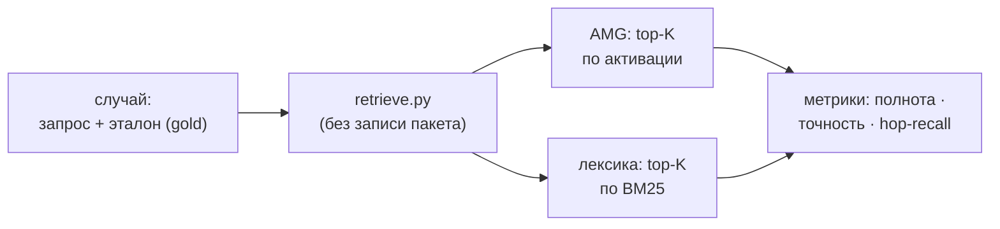

# 10 — Измерение и инструменты

Качество извлечения — не дело вкуса, его измеряют. Для этого есть два инструмента в `skills/amg-retrieve/scripts/`, оба **только для чтения**: `eval_retrieval.py` (измеряет полноту/точность извлечения и сравнивает с лексической базой) и `inspect_graph.py` (просмотр узлов, в том числе чтобы выбрать эталонные `gold_ids` для случаев измерения). Третий инструмент там же, `bench.py`, меряет не качество, а **скорость** на масштабе (раздел ниже). Четвёртый, `export_graph.py`, ничего не измеряет — он **показывает** граф: выгружает его в JSON и в самодостаточный 3D-вьюер (раздел ниже). Что именно измеряется — выдача распространения активации из раздела [Извлечение из графа](./06-retrieval.md); измерительный стенд предоставляет скилл `amg-retrieve` (см. [Субагенты и скиллы](./08-agents-skills.md)).

## Расположение и вызовы

Оба файла лежат в `skills/amg-retrieve/scripts/` и импортируют `retrieve.py` (переиспользуют тот же загрузчик узлов, `load_config` и функцию `retrieve`), поэтому меряют ровно тот же тракт, что работает в реальной выдаче. Запускаются вручную или через скилл `amg-retrieve`. «Только для чтения» относится к **существующему** графу: узлы и рёбра рабочего графа не меняются. Единственное исключение — режим `eval_retrieval.py --make-demo <путь>`, который **создаёт** новый размеченный демо-граф в указанном каталоге (рабочий граф он не трогает).

## Зачем измерять

Цель — превратить вопрос «лучше ли это, чем RAG?» из мнения в **число** и получить сигнал для настройки весов, порогов и рубрики значимости. Поэтому ручки извлечения (`damping`, `activation_threshold`, `token_budget`, `relation_priors`) крутят по числам, а не «на глаз».

## `eval_retrieval.py` — метрики и сравнение с базой

Инструмент берёт **размеченные случаи** (эталон — те узлы, что *должны* попасть в выдачу) и считает на каждом три метрики:

- **Полнота (recall)** = доля эталона, попавшая в выдачу.
- **Точность (precision)** = доля выдачи, попавшая в эталон.
- **Hop-recall** = полнота, ограниченная эталонными узлами, которые **не совпадают с запросом лексически** (достижимы только по рёбрам). Это изолирует ровно то, что добавляет распространение активации поверх обычного лексического или векторного top-k.

Сравниваются два извлекателя при **равной экспозиции** K (= число эталонных узлов, в стиле R-precision): **лексический** (top-K только по BM25 — заместитель обычного RAG top-k) и **AMG** (пакет из `retrieve.py` на основе Personalized PageRank).

Для измерения `evaluate_case` вызывает `retrieve` с выключенными записью пакета и журналированием ко-активаций — измерение не загрязняет ни пакет, ни хеббовский сигнал. Берётся top-K ранжирования по активации (AMG) и top-K по BM25 (лексика); **hop-эталон** — это эталонные узлы, оказавшиеся в лексическом ранжировании ниже K (то есть лексически недостижимые). Дополнительно считается `pack_recall` — содержит ли *собранный пакет* (все ярусы) эталон — и `missed_by_amg` (что AMG не достал). `run` усредняет по случаям, `print_report` печатает таблицу по случаям и строку средних.

### Демонстрация (`--make-demo`)

Режим `--make-demo <путь>` строит синтетический размеченный граф из двух подсистем (id в каноне `doc:`/`code:`) и сразу прогоняет измерение — воспроизводимое доказательство преимущества на hop-recall. Граф устроен так: в подсистеме биллинга **два эталонных узла достижимы только по рёбрам** (решение о повторах через `relates_to`, расчёт суммы через `calls`) и не имеют общих слов с запросом про «отклонённую карту»; рядом — **отвлекающие узлы**, которые совпадают с запросом по словам, но не связаны с потоком оплаты и не входят в эталон (на них чистый лексический ранжировщик тратит бюджет, вытесняя верные многошаговые узлы); подсистема аутентификации — отвлекающая, не должна попадать в выдачу (проверка точности). Так демо показывает: лексика проседает на многошаговых узлах, а активация их достаёт.

### Сравнение эмбеддингов (`--compare-embeddings`)

Режим `--compare-embeddings <путь>` строит **отдельный** маленький граф (изолированную кросс-язычную пару: русскоязычный эталон против англоязычного «ложного друга», совпадающего лишь по слову) и прогоняет случаи **дважды** — с эмбеддингами `off` и `on`, печатая обе сводки. Так вклад семантического засева измеряется числом: видно, поднимает ли он полноту (на этом графе — recall `0.00 → 1.00`). Эмбеддинг-граф держат **отдельно** от multi-hop демо намеренно: в общем графе связный кейс перетягивал бы массу PPR у изолированного через тупиковую перераздачу (dangling), искажая измерение. На своём графе сравнение запускают теми же `--store`/`--cases`.

### Метрики узлов-паттернов (`--pattern-demo`)

Узлы-паттерны (перенос опыта внутри проекта; [Модель данных](./02-data-model.md), [теория §13](../THEORY.md)) меряются тремя сторожевыми метриками (`pattern_metrics`); `--pattern-demo <путь>` строит размеченный демо-граф (анти-паттерн с корректными экземплярами плюс подставная ложная аналогия; рецепт миграции со всеми снятыми экземплярами) и печатает их:

- **transfer_recall** — активировав один экземпляр запросом, поднимает ли пакет сам паттерн и его аналоги-соседи (работает ли перенос по аналогии; выше — лучше);
- **false_analogy_rate** — доля рёбер `exemplifies`, НЕ входящих в размеченный «правильный» набор, — ложная аналогия, введённая синтезом (главный сторож DoD: ложные аналогии не должны проходить незамеченными; ниже — лучше; на демо ловит ровно подставную связь — `0.167`);
- **stale_pattern_rate** — доля паттернов, чьи экземпляры в большинстве неактивны (`stale`/`superseded`/исчезли): паттерн больше не держится.

На реальном графе «правильный» набор экземпляров задаёт ревью (файл `pattern-labels.json`); без разметки долю ложных аналогий знать неоткуда — в этом и смысл сторожа.

### `cases.json` и настройка

На своём графе измеряют на собственной разметке: `cases.json` — список `{"id", "query", "gold_ids": [...], "note"?}`. Размечают горсть реальных задач теми id, что *должны* всплыть (id берут из `inspect_graph.py`, см. ниже). Практика — мерить **до и после**: прогнать eval, изменить `damping`/`activation_threshold`/`token_budget`/`relation_priors`, прогнать снова и сравнить дельту — так настройку ведут по числам, а не на глаз. Безопасность сжатия на консолидации проверяют тем же измерительным стендом, тоже полнотой до и после (см. ниже).

### Командная строка

| Команда | Действие |
|---|---|
| `python eval_retrieval.py --make-demo <путь>` | построить размеченный демо-граф (multi-hop) и прогнать измерение |
| `python eval_retrieval.py --compare-embeddings <путь>` | сравнить выдачу с эмбеддингами `off` против `on` (на отдельном кросс-язычном демо либо на своём `--store`/`--cases`) |
| `python eval_retrieval.py --pattern-demo <путь>` | построить размеченный демо-граф паттернов и напечатать метрики (transfer / false-analogy / stale) |
| `python eval_retrieval.py --store <путь> --cases cases.json` | прогнать на своём графе и разметке |
| `python eval_retrieval.py --store <путь> --cases cases.json --out results.json` | то же и сохранить отчёт в JSON |

## `inspect_graph.py` — просмотр графа

Инструмент показывает, что лежит в графе, и помогает выбрать `gold_ids` для случаев. Он печатает по каждому узлу его `id`, тип и сводку (для не выведенных узлов — пометку, что сводки ещё нет, узел `stale`). **Печатаемый `id` — ровно то, что идёт в `gold_ids`.**

| Команда | Действие |
|---|---|
| `python inspect_graph.py` | все узлы, сводки усечены |
| `python inspect_graph.py --grep <строка>` | только узлы, чей `id` или сводка совпадают |
| `python inspect_graph.py --bucket <doc\|code\|data\|notes\|_hubs>` | только узлы бакета (по реальному каталогу файла узла `nodes/<бакет>/`) |
| `python inspect_graph.py --grep <строка> --full` | полные сводки |

Путь хранилища задаётся `--store`; по умолчанию он разрешается восходящим поиском от текущего каталога (`retrieve._default_store` — зеркало `resolve_amg_root`, см. [Хранилище](./03-storage.md)).

## `bench.py` — скорость на масштабе

`eval_retrieval` меряет качество, `bench.py` — **скорость**: во что обходятся горячие пути на большом графе и насколько их ускоряет производный индекс ([Извлечение из графа](./06-retrieval.md)). Относительно графа он тоже только для чтения (пишет лишь одноразовый `cache/index.sqlite`, который и так пересобираем).

Мерит (best-of-N, эмбеддинги принудительно `off` — это стоимость операций графа, а не загрузки модели): `load_nodes` сканом против чтения из индекса (главная метрика — выигрыш виден сразу), `build_adjacency`, полный `retrieve` на запрос (с выключенной записью — не загрязняет пакет и журнал ко-активаций), `eval` и, по флагу `--project`, bootstrap (`reconcile.plan` во временное хранилище). Назначение — регрессия скорости «до/после»: запустить до изменения горячего пути и после.

Стенд самодостаточен: `--make-bench <путь> --nodes N --seed S` детерминированно генерирует синтетический граф нужного размера прямо в `nodes/` (офлайн, воспроизводимо, развязано с хеббовым стендом `amg-bigtest`), либо наведите `--store` на реальный граф. На ~7600 узлах измерено: `load_nodes` скан ~8 с → индекс ~0.5 с (≈15×).

| Команда | Действие |
|---|---|
| `python bench.py --make-bench <путь> --nodes N` | сгенерировать синтетический граф и замерить |
| `python bench.py --store <путь> [--project <корень>]` | замерить на своём графе (+ bootstrap по `--project`) |

## `export_graph.py` — экспорт и 3D-просмотр графа

Назначение — не измерить, а **показать** структуру памяти (кластеры, хабы, конфликты, связи). Скрипт **только для чтения** относительно графа: сканирует `nodes/*.md` и собирает документ `{meta, nodes, links}`; единственная запись — выходной файл (по умолчанию в одноразовом пересобираемом `cache/`). Два выхода из общего ядра `build_graph_data`:

- **JSON** (`--json [путь]`, по умолчанию `cache/graph.json`) — данные графа для сторонних инструментов анализа (graph-библиотеки, скрипты);
- **самодостаточный HTML-вьюер** (по умолчанию `cache/graph.html`; `--open` открывает в браузере) — данные графа, библиотека `3d-force-graph` и glue-скрипт **вшиты в один файл**, поэтому он работает офлайн и без сервера. Тонкость: страница по `file://` не может подгрузить соседний `.json` (CORS), поэтому данные инлайнятся в узел `<script type="application/json">` (с экранированием `</` → `<\/`), а не загружаются отдельным запросом.

**Что несёт экспорт (из модели данных).** В отличие от `retrieve.load_nodes` (узкая проекция под BM25/PPR), экспорт читает **полный frontmatter** каждого узла — боковая панель вьюера показывает его целиком. На узле: `id`, `type`, `status`, `summary`, `bucket` (по реальному каталогу `nodes/<бакет>/`), `group` (ключ кластеризации — самая весомая тема `part_of`), `degree` (число инцидентных связей), тело и весь frontmatter. Связи (`links`) строятся из `edges` (несут `rel`/`w`/`coact`/`origin`) и из `part_of`, чья тема разрешается в существующий узел-хаб; **висячие рёбра** (цель-узел отсутствует — внешний импорт, неразрешённый вызов) **отбрасываются**, как и при извлечении. `meta` несёт счётчики (`types`/`statuses`/`buckets`/`rels`), имя проекта и блок `viewer` из конфига.

**Вьюер** (каталог `viewer/` рядом со скриптом: вендоренная `3d-force-graph.min.js`, шаблон `viewer.template.html`, glue `viewer.js`): цвет узла по бакету с подсветкой вердиктов арбитража (`disputed` янтарный / `rejected` красный / `superseded` серый / `stale` приглушён), размер по `degree` (хабы крупнее), толщина ребра по `w` с выделением конфликтных `contradicts`/`supersedes`; клик по узлу → панель с полным frontmatter и рёбрами; фильтры (type/status/bucket), поиск, светлая/тёмная тема; на большом графе — старт с хабов и expand-on-click, чтобы не было «каши». Настройки — блок `viewer` в `config.yml` (см. [Справочник конфигурации](./09-config.md)): `quality`, `large_graph_mode`, `large_graph_nodes`, `min_edge_weight` и сквозной passthrough `options` в саму библиотеку. Запуск — CLI, скилл `amg-retrieve`, команда `/amg view` или словесно («открой граф»).

| Команда | Действие |
|---|---|
| `python export_graph.py --store <путь> --open` | собрать вьюер `cache/graph.html` и открыть его в браузере |
| `python export_graph.py --store <путь> --json [файл]` | выгрузить граф в JSON для сторонних инструментов |

## Метрики связности сборки — `reconcile.py metrics`

Пятый измерительный вход живёт не здесь, а в слое сверки (он читает модель данных): `reconcile.py metrics` — **приёмочный гейт качества сборки**. Он считает компоненты связности и долю крупнейшей, изолированные узлы, нерезолвнутые **внутренние** цели рёбер (отдельно от законных внешних `imports`) и doc-узлы без `documents`, и выносит консультативный вердикт `ok | attention` по порогам `connectivity_gate`. Фрагментация графа видна числом сразу после сборки — не только глазами в 3D-вьюере; тот же блок показывает `/amg status`. Состав метрик и семантика — [Сверка и семантическое обогащение](./05-reconcile.md), «Метрики связности».

## Роль в консолидации

Этот же измерительный стенд — основа **автоматической проверки полноты** (eval-предохранителя) при компрессии. Перед применением компрессионных действий `consolidate.py apply` измеряет полноту на **копии** графа и вносит изменения в реальный граф только при её удержании: `baseline` на реальном графе → те же действия на копии → повтор измерения. Ключевая метрика — **`pack_recall`** (содержит ли *собранный пакет* эталон): компрессия меняет состав пакета, а не только ранжирование top-K. Для атрибуции `evaluate_case` отдаёт `pack_gold` (какие эталонные узлы попали в пакет), а отчёт показывает, какие из них выпали и после каких действий. При просадке ниже порога действие отклоняется (`reject`), вносится с предупреждением (`warn`) или эквивалентно отклоняется (`revert` ≡ `reject` — измерение до коммита делает откат ненужным). Полное описание — в разделе [Консолидация](./07-consolidation.md), «Автоматическая проверка полноты».

## Дальше

- [Карта документации](./README.md) — оглавление архитектуры и возврат к началу.
- [06 — Извлечение из графа](./06-retrieval.md) — конвейер извлечения, качество которого измеряет измерительный стенд.
- [07 — Консолидация](./07-consolidation.md) — проверка безопасности компрессии по полноте.
- [08 — Субагенты и скиллы](./08-agents-skills.md) — скилл `amg-retrieve`, дающий доступ к измерению.
