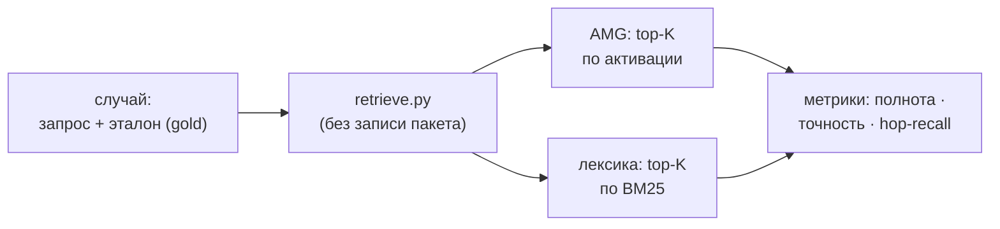

# 10 — Измерение и инструменты

Качество извлечения — не дело вкуса, его измеряют. Для этого есть два инструмента в `skills/amg-retrieve/scripts/`, оба **только для чтения**: `eval_retrieval.py` (измеряет полноту/точность извлечения и сравнивает с лексической базой) и `inspect_graph.py` (просмотр узлов, в том числе чтобы выбрать эталонные `gold_ids` для случаев измерения). Что именно измеряется — выдача распространения активации из раздела [Извлечение из графа](./06-retrieval.md); харнесс измерения предоставляет скилл `amg-retrieve` (см. [Субагенты и скиллы](./08-agents-skills.md)).

## Расположение и вызовы

Оба файла лежат в `skills/amg-retrieve/scripts/` и импортируют `retrieve.py` (переиспользуют тот же загрузчик узлов, `load_config` и функцию `retrieve`), поэтому меряют ровно тот же тракт, что работает в реальной выдаче. Запускаются вручную или через скилл `amg-retrieve`; граф не изменяют.

## Зачем измерять

Цель — превратить вопрос «лучше ли это, чем RAG?» из мнения в **число** и получить сигнал для настройки весов, порогов и рубрики значимости. Поэтому ручки извлечения (`damping`, `activation_threshold`, `token_budget`, `relation_priors`) крутят по числам, а не «на глаз».

## `eval_retrieval.py` — метрики и сравнение с базой

Инструмент берёт **размеченные случаи** (эталон — те узлы, что *должны* попасть в выдачу) и считает на каждом три метрики:

- **Полнота (recall)** = доля эталона, попавшая в выдачу.
- **Точность (precision)** = доля выдачи, попавшая в эталон.
- **Hop-recall** = полнота, ограниченная эталонными узлами, которые **не совпадают с запросом лексически** (достижимы только по рёбрам). Это изолирует ровно то, что добавляет распространение активации поверх обычного лексического или векторного top-k.

Сравниваются два извлекателя при **равной экспозиции** K (= число эталонных узлов, в стиле R-precision): **лексический** (top-K только по BM25 — заместитель обычного RAG top-k) и **AMG** (пакет из `retrieve.py` на основе Personalized PageRank).

Для измерения `evaluate_case` вызывает `retrieve` с выключенными записью пакета и журналированием ко-активаций — измерение не загрязняет ни пакет, ни хеббовский сигнал. Берётся top-K ранжирования по активации (AMG) и top-K по BM25 (лексика); **hop-эталон** — это эталонные узлы, оказавшиеся в лексическом ранжировании ниже K (то есть лексически недостижимые). Дополнительно считается `pack_recall` — содержит ли *собранный пакет* (все ярусы) эталон — и `missed_by_amg` (что AMG не достал). `run` усредняет по случаям, `print_report` печатает таблицу по случаям и строку средних.

### Демонстрация (`--make-demo`)

Режим `--make-demo <путь>` строит синтетический размеченный граф из двух подсистем и сразу прогоняет измерение — воспроизводимое доказательство преимущества на hop-recall. Граф устроен так: в подсистеме биллинга **два эталонных узла достижимы только по рёбрам** (решение о повторах через `relates_to`, расчёт суммы через `calls`) и не имеют общих слов с запросом про «отклонённую карту»; рядом — **отвлекающие узлы**, которые совпадают с запросом по словам, но не связаны с потоком оплаты и не входят в эталон (на них чистый лексический ранжировщик тратит бюджет, вытесняя верные многошаговые узлы); подсистема аутентификации — отвлекающая, не должна попадать в выдачу (проверка точности). Так демо показывает: лексика проседает на многошаговых узлах, а активация их достаёт.

### `cases.json` и настройка

На своём графе измеряют на собственной разметке: `cases.json` — список `{"id", "query", "gold_ids": [...], "note"?}`. Размечают горсть реальных задач теми id, что *должны* всплыть (id берут из `inspect_graph.py`, см. ниже), затем крутят ручки извлечения по числам. Безопасность сжатия на консолидации проверяют тем же харнессом — полнотой до и после (см. ниже).

### Командная строка

| Команда | Действие |
|---|---|
| `python eval_retrieval.py --make-demo <путь>` | построить размеченный демо-граф и прогнать измерение |
| `python eval_retrieval.py --store <путь> --cases cases.json` | прогнать на своём графе и разметке |
| `python eval_retrieval.py --store <путь> --cases cases.json --out results.json` | то же и сохранить отчёт в JSON |

## `inspect_graph.py` — просмотр графа

Инструмент показывает, что лежит в графе, и помогает выбрать `gold_ids` для случаев. Он печатает по каждому узлу его `id`, тип и сводку (для не выведенных узлов — пометку, что сводки ещё нет, узел `stale`). **Печатаемый `id` — ровно то, что идёт в `gold_ids`.**

| Команда | Действие |
|---|---|
| `python inspect_graph.py` | все узлы, сводки усечены |
| `python inspect_graph.py --grep <строка>` | только узлы, чей `id` или сводка совпадают |
| `python inspect_graph.py --bucket <doc\|code\|data\|notes\|_hubs>` | только узлы бакета (по префиксу id или типу) |
| `python inspect_graph.py --grep <строка> --full` | полные сводки |

Путь хранилища задаётся `--store` (по умолчанию вычисляется относительно скрипта).

## Роль в консолидации

Этот же харнесс — основа **гейта безопасности** компрессии: после сжатия ветки полноту меряют до и после на размеченных случаях; если полнота просела — сжатие слишком агрессивно, бюджет ослабляют или откатывают (архив и история git делают откат тривиальным). **Автоматический** гейт (повтор измерения с автоослаблением порога) — пункт дорожной карты; сейчас проверка выполняется этим инструментом отдельно. Подробности — в разделе [Консолидация](./07-consolidation.md).

## Дальше

- [Карта документации](./README.md) — оглавление архитектуры и возврат к началу.
- [06 — Извлечение из графа](./06-retrieval.md) — тракт, который измеряет харнесс.
- [07 — Консолидация](./07-consolidation.md) — гейт безопасности компрессии по полноте.
- [08 — Субагенты и скиллы](./08-agents-skills.md) — скилл `amg-retrieve`, дающий доступ к измерению.
