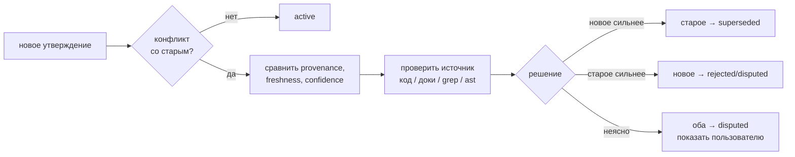
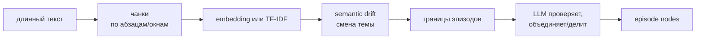

# 11 — Дорожная карта

Этот раздел фиксирует, что в AMG уже реализовано, какие расхождения выявлены аудитом и в каком порядке проект доводится до согласованного состояния. Дорожная карта теперь выполняет две функции:

1. **Стабилизация текущей реализации** — исправить несоответствия между кодом, промптами и документацией, а также реальные ошибки ядра.
2. **План развития** — добавить запланированные функции жизненного цикла, установки, визуализации, проверки качества, верификации памяти и масштабирования.

Правило ведения roadmap: документация проекта ведётся **опережающе** — она намеренно описывает целевое состояние системы, включая ещё не реализованные функции, чтобы не вписывать одно и то же дважды. Единственный источник правды о том, что реализовано, а что нет, — этот roadmap: раздел 2 связывает каждое опережающее место документации с этапом, на котором оно сверяется с готовым кодом. До своего этапа опережающие описания не удаляются и не правятся; всё частично реализованное фиксируется в roadmap с конкретным списком доработок.

---

## Уже реализовано

Базовый тракт AMG реализован и требует стабилизации по пунктам аудита ниже:

- **Транзакционное файловое хранилище** (`graph_store.py`): атомарные записи, журнал упреждающей записи, восстановление, единый лок на запись.
- **Извлечение структуры** (`extract_structure.py`): классификация файлов, нарезка Python-кода через `ast`, markdown/text/data-нарезатели, опциональное извлечение PDF/DOCX/XLSX.
- **Сверка графа с источниками** (`reconcile.py`): создание структурных узлов, очередь на смысловую деривацию, применение результатов субагентов.
- **Извлечение из графа** (`retrieve.py`): BM25-засев, опциональный semantic seed через embeddings, Personalized PageRank, сборка пакета по ярусам.
- **Консолидация** (`consolidate.py`): свёртка ко-активаций в веса, планирование кандидатов на сжатие, применение действий консолидации с архивированием.
- **Измерительный стенд retrieval** (`eval_retrieval.py`, `inspect_graph.py`): recall, precision, hop-recall, демо-граф, собственные размеченные случаи.
- **Субагенты и скиллы**: `amg-bootstrap`, `amg-retrieve`, `amg-consolidate` и субагенты `amg-builder`, `amg-synth`, `amg-classifier`, `amg-retriever`, `amg-consolidator`.
- **Документация**: теория, руководство пользователя и архитектурные разделы существуют, но нуждаются в синхронизации с кодом и разделении текущих возможностей от planned-функций.

---

## Состояние старых этапов

Старые этапы сведены в единый канон:

| Старый этап | Текущее состояние | Что остаётся сделать |
|---|---|---|
| Stage 1.5 — embedding-засев | Реализован через `embed.py` и `retrieval.embeddings` | Согласовать defaults, проверить многоязычные модели, включить eval-сравнение `off`/`on` |
| Stage 2 — text extraction PDF/DOCX/XLSX | Реализовано в `extract_structure.py` | Уточнить документацию, добавить недостающие форматы позже |
| Stage 3 — архитектурная документация | Черновик реализован | Сверять с кодом поэтапно через раздел 2; базовая синхронизация уже реализованного — Этап 7 |
| Stage 4 — автоматический eval-gate | Реализовано (Этап 4, v0.6.0) | Автоматическая проверка полноты до/после компрессии встроена в `consolidate.apply_actions` |
| Stage 5 — lifecycle & control | Не реализовано | Хуки `SessionStart`/`SessionEnd`, сохранение сессий, `/amg` commands, `automation` |
| Stage 6 — packaging/install | Реализовано (Этап 10, v1.0.0): установщик `install.py`, `INSTALL.md` синхронизирован | — |
| Stage 7 — 3D graph viewer | Не реализовано | Экспорт JSON + self-contained HTML viewer |
| Optimization | Не реализовано | `partition_queue.py`, `inspect_queue.py`, lazy derivation, generated indexes |

---

# Аудит: обязательные исправления перед дальнейшим развитием

Этот раздел фиксирует проблемы, выявленные аудитом. Они не являются «идеями на потом»: это задачи стабилизации. Пока они не закрыты, документация и поведение системы остаются рассинхронизированными.

---

## 1. Согласованность кода, промптов и архитектуры

### 1.1. Stale-узлы должны повторно попадать в очередь деривации

Исправлено на Этапе 0 (задача 1); детали → `05-reconcile.md` («Дифф: случаи сверки», «Очередь деривации», «Идемпотентность»); regression — `selftest_reconcile.py`, сценарии 2–4 (включая «повторный `plan()` не опустошает очередь»).

---

### 1.2. В узлах нужно сохранять `lineno` и `qualname`

Исправлено на Этапе 0 (задача 2); детали → `05-reconcile.md` («Создание узла», «Очередь деривации»), `02-data-model.md` (таблица полей), `08-agents-skills.md` (§ `amg-builder`); regression — `selftest_reconcile.py`, сценарии 1, 5, 15 (`path:line` в pack без `:None`). Правки `06-retrieval.md`/`GUIDE.md` про указатели — Этап 7 (база уже корректна).

---

### 1.3. При изменении источника нужно обновлять структурные рёбра

Исправлено на Этапе 0 (задачи 3–4); детали → `05-reconcile.md` («Обновление при изменении источника» — пересборка structural-рёбер, поле `origin`, почему `lang` не обновляется), `02-data-model.md` (таблица рёбер); regression — `selftest_reconcile.py`, сценарии 7–9. `defines` в legacy-fallback не включён (извлечение его не порождает); `source_path`/первичное `part_of` для того же id неизменны по построению — переносы решены задачей 7.

---

### 1.4. Типы хабов должны быть `hub` / `overview`, а не `derived`

Исправлено на Этапе 1 (задача 3): `amg-synth` (промпт и § в 08-agents-skills.md) задаёт `type: overview`/`hub`, происхождение — `source_kind: synthesized`; `retrieve.TIER_OF_TYPE` и `consolidate._branch_members` уже относили hub/overview к strategic-ярусу и веткам (код не менялся). Канон типов → `02-data-model.md`, раздел «Типы узлов».

---

### 1.5. Нормализовать таксономию `source_kind`

Исправлено на Этапах 0 (задача 5: код больше не пишет `derived`) и 1 (задача 7: `migrate_schema.py` переводит старые узлы `source_kind: derived` → `synthesized`). Канон (`derived_from_file` / `synthesized` / `authored`) → `02-data-model.md`; устаревший класс `derived` в `consistency-model.md` — пункт 2.14 (Этап 7).

---

### 1.6. `part_of` в `apply_derivation()` должен накапливаться или документироваться как замена

Исправлено на Этапе 0 (задача 6): `_merge_part_of` — темы накапливаются, для совпавшей темы побеждает новое значение (обоснование выбора режима — `05-reconcile.md`, «Применение семантики»), симплекс-нормализация при `weights.part_of_renormalize`; regression — `selftest_reconcile.py`, сценарий 10.

---

### 1.7. Узел нельзя преждевременно переводить в `active`

Исправлено на Этапе 0 (задача 6): `active` только при новой `summary` либо для не-`derived_from_file` узлов; элемент только с рёбрами/`part_of` оставляет узел `stale` и в очереди; детали → `05-reconcile.md` («Применение семантики») и докстринг `apply_derivation`; regression — `selftest_reconcile.py`, сценарий 11.

---

### 1.8. `compaction.enabled` должен реально выключать компрессию

Исправлено на Этапе 3 (задача 1): `make_plan` не помечает `over_budget` при `enabled:false`, `apply_actions` пропускает компрессионные действия (`COMPACTION_ACTIONS`) без `force:true`. Детали → `07-consolidation.md` («Применение», «Компрессия»), `09-config.md`; regression — `selftest_consolidate.py` (`test_enabled_gate`).

---

### 1.9. Консолидация должна быть описана как crash-safe, но не полностью идемпотентная

Исправлено на Этапе 3 (задачи 5–6): decay/Хебб/обрезка применяются только при наличии нового журнала ко-активаций (вариант 2), поэтому повторный `weights` без журнала не меняет `w`; `last_decay_at`/календарное затухание отвергнуты (Хебб про использование, не календарь). Детали → `07-consolidation.md` («Веса»), `THEORY.md` §8.1; regression — `selftest_consolidate.py` (`test_weights`, два режима).

---

### 1.10. `shorten` должен сохранять оригинал идемпотентно

Исправлено на Этапе 3 (задача 4): `.full` пишется только если ещё не существует — повторный `apply` не затирает оригинал. Детали → `07-consolidation.md` («Применение»); regression — `selftest_consolidate.py` (`test_shorten_idempotent`).

---

### 1.11. Защита `decision` и `adr` должна enforced в коде

Исправлено на Этапе 3 (задачи 2–3): `_is_protected` в `apply_actions` бережёт `protect_types` и high-centrality узлы (`degree/max_deg > protect_min_centrality`) от `shorten`/`retire`/`merge`-drop/`summarize`-archive без `force`. Детали → `07-consolidation.md` («Применение», «Компрессия»); regression — `selftest_consolidate.py` (`test_protect_and_force`, `test_centrality_protect`).

---

### 1.12. `status: superseded` должен влиять на retrieval

Исправлено на Этапе 2 (задача 1): `retrieve._apply_status_prior` — множитель на финальной активации (`superseded` 0.2; `stale` 1.0 + пометка `_STALE_MARK`; `disputed` 0.5; `rejected` 0.1); ключ `status_prior`. **Снятие понижения снятых статусов по намерению запроса — закрыто на Этапе 14** (флаг `--intent history|conflict` → `lift`; намерение распознаёт модель, не код); детали → `06-retrieval.md` («Статусный приоритет и намерение запроса»), `02-data-model.md`; regression — `selftest_retrieve.py` (`test_intent_and_conflict`).

---

### 1.13. Результат `amg-classifier` должен применяться кодом

Исправлено на Этапе 6 (задачи 1–5): `extract_structure` читает `work/classification-overrides.json` (`load_overrides`/`_route_override`/`_classify_path`) **до** fallback-классификации, override сильнее догадки по расширению и маршрутизирует файл по нарезателям; битый/отсутствующий файл → пустая карта (bootstrap не блокируется); `--stats` показывает `resolved_by_override`/`ambiguous_files`/`classifier_hint`. Детали → `04-ingest.md` («Overrides: вердикт классификатора, действующий в коде»), `08-agents-skills.md` (§ `amg-classifier`/`amg-bootstrap`); regression — `selftest_extract_overrides.py`.

---

### 1.14. `models` в `config.yml` должен работать

**Реализовано** в подэтапе между Этапами 10 и 11 (доводка управляющего слоя/переносимости). Структурная форма `models.<роль>: {model, reasoning_effort}` (обратносовместима с плоской строкой) рендерится установщиком в определения субагентов: Claude Code — `model`/`effort` во frontmatter `agents/amg-*.md`; Codex — `model`/`model_reasoning_effort` в TOML `.codex/agents`. `reasoning_effort` (`minimal|low|medium|high|xhigh|max`) клампится по среде (без `off`; не задан — опускается); `model` — непрозрачная строка пас-сквозь (мульти-провайдер — уровень развёртывания: gateway/Bedrock/Vertex, не имя модели; кастомный микро-формат версии не вводится). Карта ролей→агенты: discovery→{classifier,retriever}, module_summary→{builder}, synthesis→{synth,consolidator}. Баг апстрима [#44385](https://github.com/anthropics/claude-code/issues/44385) (frontmatter `model:` действует лишь при явной передаче модели; `effort` работает) задокументирован. Детали → `09-config.md` («Модели субагентов»), `12-install.md`, `08-agents-skills.md`, `GUIDE.md`; regression — `selftest_install.py` (`test_models_render`, `test_codex_env`).

**Привязка открытых §1 (по запросу пользователя — каждому пункту свой этап):** 1.15 (транзакционный `log.md`) → Этап 12; 1.16 (формулировка `absorb`) — исправлено на Этапе 7; 1.27 (квадратичный поиск дублей) → Этап 12; 1.28 (`--no-pack`↔журнал) — закрыто документированием на Этапе 7; 1.29 (пересечение `mirror`/`absorb`) → Этап 11; 1.30 (несуществующий путь источника) — в основном на Этапе 10 (`by_source`), остаток → Этап 11; 1.31 (`mypy --strict`) → Этап 12; 1.32 (переносимость промптов) → этот подэтап.

---

### 1.15. `log.md` должен соответствовать заявленным гарантиям

Исправлено на Этапе 12 (задача 14): транзакционный `GraphStore.append_log` (дедуп по `txid` + ротация в `archive/`); пишут `consolidate` и `reconcile` (последний — только при непустом диффе, иначе транзакции нет и строка не добавляется — неизменный прогон остаётся идемпотентным). Обоснование/детали → `03-storage` («Журнал действий — транзакционный аудит-след»), `consistency-model §11`, `02-data-model`/`THEORY §9` (формулировка «транзакционный»); regression — `selftest_graph_store.case_action_log`.

---

### 1.16. Семантика `absorb` должна быть описана одинаково везде

Исправлено на Этапе 7: формулировка «`absorb` — источник можно удалить без удаления знания; пока он существует, его изменения пересверяются» синхронизирована во всех доках (THEORY §12, GUIDE, README/README_RU, 09-config, INSTALL; `05-reconcile.md` объяснял верно изначально); детали → реестр 2.1 п.2.

---

### 1.17. Магические константы в consolidate.py

Исправлено на Этапе 3 (задача 11): `consolidate.load_config` читает `near_duplicate_sim`/`episodic_types`/`stale_age_days` из конфига (ключи верхнего уровня), они добавлены в шаблон `config.yml`. Детали → `09-config.md` («Настройки плана консолидации»).

---

### 1.18. Источник внутри хранилища отбрасывался игнором (блокер сессий)

Исправлено на Этапе 9: каталог сессий лежит под игнор-каталогом агента (`.claude` в `DEFAULT_IGNORE_DIRS`, часто и в `.gitignore`), из-за чего `iter_source_files` молча отбросил бы все дампы. Решение — отдельный обход `_iter_session_files` для внутреннего источника: префиксный игнор не применяется, фильтруется лишь мусор ниже корня источника; обычные источники не затронуты (anchored-правила сохранены). Путь сессий вычисляется от резолвнутого корня (а не от литерала `.claude`), поэтому переносим (4.9). Детали → `04-ingest.md` («Сессии», «Игнорирование»); regression — `selftest_sessions.py`.

---

Пункты 1.19–1.30 добавлены вторым проходом аудита (сверка кода с документацией поверх первоначального списка).

---

### 1.19. Рёбра `imports` никогда не резолвятся

Исправлено на Этапе 0 (задача 8): `_module_map` резолвит внутрипроектные импорты в id узла модуля (внешние остаются висячими и отбрасываются при извлечении); детали → `05-reconcile.md` («Создание узла»), `02-data-model.md` («Рёбра»); regression — `selftest_reconcile.py`, сценарий 12. THEORY о связности — сверка на Этапе 7.

---

### 1.20. Бюджеты веток и компрессия фактически инертны

Исправлено на Этапе 3 (задача 12, развилка A): `_branch_members` дополнен обходом **вниз** от хаба по `HUB_DOWN_RELS` (`documents`/`defines`/`specifies`/`implements`/`contains`) со стопом на чужом хабе — ветка вычисляется, даже когда первичное `part_of` листа указывает на каталожную строку (вверх-путь сохранён). Выбран этот вариант (не переписывание синтеза) как локальный в `consolidate.py`. Детали → `07-consolidation.md` («План»), `THEORY.md` §10.2; regression — `selftest_consolidate.py` (`test_branch_downward`).

---

### 1.21. `introduce_subhub` уничтожает мультичленство

Исправлено на Этапе 3 (задача 13): заменяется только тема `parent_topic` → `hub_id`, прочие членства сохраняются, `_combine_part_of` ренормирует к симплексу. Детали → `07-consolidation.md` («Применение»); regression — `selftest_consolidate.py` (`test_subhub_keeps_memberships`).

---

### 1.22. `redirect_inbound` создаёт дубли рёбер

Исправлено на Этапе 3 (задача 9): `_dedup_edges` после `redirect_inbound` схлопывает рёбра соседа по `(rel, to)` (больший вес, суммарный `coact`) и отбрасывает self-edge. Детали → `07-consolidation.md` («Применение»); regression — `selftest_consolidate.py` (`test_merge_quality`).

---

### 1.23. `weights.default_edge_weight` — мёртвый ключ конфигурации

Исправлено на Этапе 3 (задача 11, развилка D): ключ проброшен в `reconcile._merge_edges` (новые смысловые рёбра), `retrieve.build_adjacency` (проводимость) и `consolidate.fold_weights` — больше не декоративный. Детали → `09-config.md` (блок `weights`).

---

### 1.24. Markdown-нарезатель режет по «заголовкам» внутри код-блоков

Исправлено на Этапе 0 (задача 9): `_markdown_units` отслеживает код-ограждения; детали → `04-ingest.md` (раздел «Markdown и разметка»); regression — `selftest_reconcile.py`, сценарий 14.

---

### 1.25. Tree-sitter-узлы выпадают из ярусов и формата указателей

Исправлено на Этапе 1 (задача 8): `_TS_DEF` в `extract_structure.py` канонизирует типы узлов грамматики в `function`/`class` ещё при извлечении, поэтому не-Python код попадает в существующие `TIER_OF_TYPE`/`CODE_TYPES` (retrieve.py не менялся); дрейф указателя `reconcile.py` сводит `type` старых зеркал. Детали → `04-ingest.md` («Прочий код — tree-sitter»), `02-data-model.md` («Типы узлов»); regression — `selftest_stage2.py` (живой JS-прогон). Описание tier mapping в `06-retrieval.md` сверяется на Этапе 2 (пункт 2.7.2).

---

### 1.26. `inspect_graph.py --bucket notes` не работает

Исправлено на Этапе 2 (задача 11): `retrieve.load_nodes` отдаёт `_path` (`nodes/<бакет>/…`), а `inspect_graph._in_bucket` фильтрует по реальному каталогу файла узла (работает и для `notes`/`_hubs` без id-префикса). Детали → `10-eval-tools.md`; regression — `selftest_retrieve.py`.

---

### 1.27. Квадратичный поиск дублей в `make_plan`

Исправлено на Этапе 12 (Группа 3): `make_plan` считает близость Жаккара только по эпизодическим не-derived узлам (те, что и сливает `merge_near_duplicates`) — O(k²) по эпизодическим вместо O(n²) по всему графу; больше не предлагаются футильные слияния зеркал (сверка их пересоздаёт). MinHash/LSH-предфильтр оставлен опцией при измеренном большом k. Обоснование/детали → `07-consolidation` («План»); regression — `selftest_consolidate.test_near_dup_scope`.

---

### 1.28. `--no-pack` молча отключает хеббов сигнал

Закрыто документированием на Этапе 7 (из варианта «отдельный флаг ИЛИ описать связку» выбран второй): связка `--no-pack` ↔ журнал ко-активаций описана в `06-retrieval.md` и `GUIDE.md`; детали → реестр 2.7. Отдельный флаг `--no-coactivation` не вводится.

---

### 1.29. Пересечение `mirror_path` и `absorb_path` не определено

Исправлено на Этапе 11 (Группа D): `extract_structure.detect_policy_conflicts` помечает id под >1 политикой — в `reconcile.plan` (`policy_conflicts`) и `--stats` (`overlapping_sources` + `overlap_hint`); дедуп по id оставляет наиболее сохраняющую политику (`absorb_once` > `absorb` > `mirror`), конфликт не разрешается молча. Детали → `04-ingest.md` («Источники и политики»), `09-config.md`; regression — `selftest_ignore.test_overlap_warns`.

---

### 1.30. Несуществующий путь источника пропускается без диагностики

Исправлено на Этапах 10 и 11 (Группа D): `--stats` показывает `by_source` (`found`/`files`, Этап 10), `reconcile.plan` выводит `missing_sources` (Этап 11) — опечатка в `mirror_path` не маскируется под «added: 0». Детали → `05-reconcile.md`; regression — `selftest_ignore.test_missing_in_plan`.

---

### 1.31. Скрипты не проходят `mypy --strict`

Исправлено на Этапе 12 (задача 12): движок приведён к `mypy --strict` единым проходом (параметризованы дженерики, установлен `types-PyYAML`, снят `union-attr` на `stdout.reconfigure`, обёрнуты `Any`-возвраты `yaml.safe_load`). Гейт — `mypy.ini` (`files=` фиксирует движок; `python -m mypy` без аргументов), к закрытию этапа **15 модулей** (добавлены `bench`/`index_store`/`partition_queue`/`inspect_queue`); селфтесты исключены из гейта (test-код; решение §5 Этап 12). Обоснование/детали → `mypy.ini`, CLAUDE.md §6.9.

---

### 1.32. Промпты движка зашивают `.claude`; установщик копирует их непрозрачно

**Реализовано** в подэтапе между Этапами 10 и 11: (1) `install.py` (`place_engine`) рендерит промпты движка — `SKILL.md` и `agents/amg-*.md`, а для Codex — тела TOML-субагентов — через `render_control_text`, как и шаблоны точки входа (раньше копировал дословно, оставляя неверные `.claude`-пути в иной среде); (2) `resolve_amg_root` (`graph_store.py`/`retrieve.py`) пробует пресеты `.claude`+`.agents`; (3) `eval_gate.cases` переносим — `consolidate.load_config` выводит дефолт от корня хранилища, `install.write_config` рендерит значение под каталог агента. Детали → `12-install.md`, `08-agents-skills.md`; regression — `selftest_install.py` (`test_agents_env`, `test_codex_env`), `selftest_reconcile.py` (root +`.agents`).

---

### 1.33. Жёстко вшитый рабочий язык в коде движка

Обнаружено на Этапе 14: детекция намерения запроса (history/conflict) была сделана **списком ключевых слов с en+ru-основами в коде** — привязка к языку *конкретного* проекта, не работающая при китайском, испанском и т. п. Это нарушает инвариант: движок доменно- и **язык-универсален**, любая зависимость от языка обязана быть config-driven (через `working_language`) или отдана модели, но не зашита списком в коде.

**Исправлено на Этапе 14**: распознавание намерения перенесено на сторону модели — субагент-извлекатель читает запрос на любом языке и передаёт структурный флаг (`retrieve.py --intent history|conflict`), а код лишь применяет механику (снять понижение снятых статусов / досеять conflict-subgraph); языковых списков в коде нет (тот же принцип «смысл — модель, механика — код»). Беглый аудит на Этапе 14 показал, что это был **единственный** такой дефект: выбор модели эмбеддингов в `embed.py` уже config-driven (английский дефолт + мультиязычная модель при не-английском `working_language`); BM25 без англо-стоп-слов (`\w+` в Unicode); классификатор маршрутизирует по расширению, а не по словам содержимого; кириллица в коде — только тест-фикстуры и диагностика.

Остаётся **систематический сквозной проход** (назначен в Этап 18, задача ниже): пройти весь код движка на любые зашитые языковые допущения (списки слов, стоп-слова, англо-эвристики классификации/маршрутизации) и подтвердить, что всё язык-зависимое идёт через `working_language` или модель. Попутная мелочь: пример `--grep роутинг` в докстринге `inspect_graph.py` нейтрализовать на язык-нейтральный.

---

### 1.34. Жёстко вшитые не-английские (русские) примеры в промптах движка и блоках точки входа

Обнаружено на Этапе 15. Тот же инвариант, что в §1.33, но для **промптов**, а не кода: управляющий слой ведётся на английском (базовый язык), а намерение пользователя на любом языке модель распознаёт **семантически** — блоки активации это прямо предписывают («Match intent and synonyms, not the exact word»). Поэтому захардкоженные русскоязычные примеры команд в промптах противоречат инварианту и вдобавок избыточны: модель и так ловит смысл на любом языке, а один зашитый язык лишь смещает к нему.

Найдено в `entrypoint/CLAUDE.md` (блок Claude Code): столбец «Verbal intent» таблицы операций и две пары синонимов («включи / активируй / запусти AMG», «построй / обнови / сверь граф») заданы по-русски. Прочие блоки (`entrypoint/AGENTS.md`, `AGENTS.codex.md`, `commands/amg.md`) и промпты `agents/*.md` уже только на английском; `skills/amg-retrieve/SKILL.md` — русские триггеры вьюера введены и тут же убраны на Этапе 15 (его собственная правка не оставила следа).

Исправление назначено в **Этап 18** (сквозной язык-проход, рядом с §1.33): перевести все примеры намерения в `entrypoint/CLAUDE.md` на английский, сохранив инструкцию «сопоставляй смысл на любом языке», и подтвердить, что в промптах скиллов/агентов и блоках не осталось захардкоженного не-английского (кроме намеренно русской документации `docs/ru`).

---

### 1.35. Словесные команды памяти не привязаны к ключу «AMG» — риск ложного срабатывания

Обнаружено на Этапе 15. Словесные триггеры операций (петля активации в `entrypoint/CLAUDE.md`/`AGENTS.md`/`AGENTS.codex.md` и таблицы команд в GUIDE) заданы общими фразами без явной привязки к памяти: «подведём итоги», «открой граф», «собери контекст по X», «почини граф» и т. п. Блоки предписывают «сопоставляй смысл, а не точное слово», поэтому такая фраза может **ложно запустить** операцию `/amg`, когда разработчик имеет в виду другое (свой собственный граф в коде, подведение итогов не по памяти и пр.).

Инвариант: словесный вызов операции памяти должен срабатывать, только когда запрос **явно относится к памяти/AMG** (упоминает память, граф памяти или AMG), а не на любую похожую по смыслу фразу. Команда `/amg <verb>` и прямые скиллы однозначны по построению — проблема только у бесключевых словесных триггеров.

Исправление назначено в **Этап 18** (рядом с §1.33/§1.34, проход по промптам): во всех блоках активации и в документации (GUIDE, READMEs) сделать словесные примеры **привязанными к ключу** (память / граф памяти / AMG) и добавить явное правило «считать запрос операцией памяти только при явной ссылке на память». Касается и триггеров вьюера, добавленных на Этапе 15 («открой граф» → «открой граф памяти» и т. п.).

---

### 1.36. Аудит-журнал `log.md` ведётся как markdown, хотя это плоский лог

Обнаружено на Этапе 16. `graph_store.append_log` пишет аудит-след в `log.md` строками-заголовками `## [<ts>] <txid> <source> | <msg>`. Настоящей разметки в лог не попадает — единственный markdown-элемент это префикс `## ` на каждой строке; это плоский append-журнал, а не документ для чтения. Префикс не нагружен кодом: дедуп смотрит на `txid`, ротация — на число строк, `lifecycle._last_consolidation` фильтрует по подстроке `" consolidate |"`, селфтест `case_action_log` проверяет часть `source |` и позиции строк (не `## `).

**Решение (по выбору пользователя):** вести как обычный лог-файл — расширение `.log`, строки без markdown-заголовка (формат `[<ts>] <txid> <source> | <msg>`). Затрагивает: `graph_store.append_log` (имя файла + формат строки + ротация в `archive/`), упоминания `log.md` в `lifecycle._last_consolidation`/`status` и `verify_claims --write`/`consolidate`/`reconcile` (вызовы `append_log` не меняются — меняется writer), `selftest_graph_store.case_action_log`, и документация, называющая `log.md` (`02-data-model` раскладка, `03-storage` «Журнал действий», `consistency-model §11`, `01-overview`). Косметика, не дефект целостности (её держит `journal/`, не лог).

**Дом:** отдельное косметическое исправление между этапами (bump `z`) либо проход Этапа 18 (он и так правит эти доки). **Вне периметра Этапа 16** (записано по CLAUDE.md §4.3). Связано: при «графе в git» лог-файл попадает в рекомендованный `.gitignore` хранилища (Этап 16).

---

### 1.37. Глобальный `config.yml` и наследование локальным не реализованы (расходится с INSTALL.md)

Обнаружено на Этапе 17 (при сверке замысла глобальной установки). `INSTALL.md` (раздел «Локально и глобально») обещает: «если у проекта есть и глобальный, и локальный `config.yml`, система читает сперва глобальный, затем локальный — локальный переопределяет по отдельным ключам, недостающее наследуется из глобального». В коде этого **нет**: `install.write_config` пишет только локальный конфиг из шаблона (глобального `~/<agent_dir>/amg/config.yml` не создаёт), а все три загрузчика (`retrieve.load_config` / `consolidate.load_config` / `extract_structure.load_config`) читают только локальный `<amg_root>/config.yml` — ни один не читает и не сливает глобальный (подтверждено поиском: домашний путь в `skills/` нигде не читается). Глобально ставится лишь движок (скиллы/агенты/блок/хуки) — это верно; граф и конфиг локальны — тоже верно; но **наследования конфига из глобального нет**.

**Решение пользователя — (A): реализовать обещанный мерж.** Установщик пишет глобальный конфиг общих умолчаний, загрузчики читают глобальный → локальный с переопределением по ключам (тот же `_deep_merge`, что уже есть в `retrieve`). Учесть при реализации:

- **Разные корневые папки сред.** Память ставится в разные агентские среды, у каждой свой каталог агента, поэтому глобальный конфиг лежит по `~/<agent_dir>/amg/config.yml`, где `agent_dir` — каталог среды (`.claude` Claude Code, `.agents` Codex и пр.); путь резолвится так же, как корень в `resolve_amg_root` (env → расположение → дефолт), а не литералом `.claude`.
- **Project-vs-personal ключи.** Локальный конфиг (часть git-канона при «графе в git») переопределяет глобальный, поэтому проектные настройки (`mirror_path`, `working_language`) шарятся командой через git, а личные умолчания одной машины (`models`, бэкенд эмбеддингов) живут в глобальном и в репозиторий не попадают. Продумать, какие ключи уместны в каждом слое и не навязываются команде.

Альтернатива (B) — убрать ложное обещание из `INSTALL.md` — **отклонена** (контракт удобен и уже задокументирован). **Вне периметра Этапа 17** (config/install-территория); дом — отдельная сессия/мелкий этап между Этапами 17 и 18. Записано по CLAUDE.md §4.3.

---

### 1.38. Рекомендованный `.gitignore` (Этап 16) не покрывает движок при локальной установке

Обнаружено на Этапе 17. Рекомендованный для «графа в git» `.gitignore` (GUIDE «Граф в git») игнорирует только производные каталоги под `<agent_dir>/amg/` (`journal`/`cache`/`work`/`archive`/`LOCK`/`log.md`), а **движок** (`<agent_dir>/skills/`, `agents/`, `settings.json`, `commands/`, блок в точке входа) не упоминает. При **глобальной** установке проблемы нет: движок лежит в `~/<agent_dir>` вне проекта и в git не попадает — чистейший случай, в проекте только канон графа + локальный конфиг. При **локальной** установке движок лежит в `<проект>/<agent_dir>/` и был бы **закоммичен**: это шум, а в смешанной команде (часть локально, часть глобально) ещё и дублирование движка (`<проект>/<agent_dir>/skills` и `~/<agent_dir>/skills` одновременно, который грузится дважды).

**Решение:** в GUIDE «Граф в git» добавить, что для командной работы предпочтительна **глобальная** установка (движок вне репозитория), а при локальной — либо игнорировать движок в `.gitignore` (`<agent_dir>/skills/`, `agents/`, `settings.json`, `commands/`) и ставить его каждому самостоятельно, либо коммитить осознанно и единообразно (все локально). Чисто документационная правка, код не затронут. **Вне периметра Этапа 17**; дом — рядом с §1.37 (config/install-сессия) или Этап 18.

---

# 2. Исправления и доработка документации по файлам

Этот раздел — **реестр контрольных точек документации**, а не приказ на немедленную правку и тем более не на удаление. Документация намеренно опережает код (см. правило ведения roadmap в начале файла): описания ещё не реализованных функций **не удаляются** — иначе их пришлось бы вписывать заново после реализации. Семантика блоков «Нужно исправить» такая:

- каждый пункт **закрывается на том этапе, где реализуется соответствующий механизм**: в этот момент описанное место сверяется с фактическим кодом — что-то подтверждается и остаётся как есть, что-то корректируется под реальное поведение, и только явно лишнее удаляется;
- пункты про **уже реализованное сегодня** поведение (расхождения «код ↔ текст» базового тракта, язык, ссылки, диаграммы) закрываются один раз на Этапе 7 (базовая синхронизация);
- до своего этапа ни один пункт не исполняется; формулировки вида «описывать как planned», «не описывать, пока не реализовано», «разделить текущее и planned» исполняются **не** как немедленная пометка или перестройка документации, а как сверка на этапе реализации: к моменту закрытия пункта функция уже существует, и описание либо подтверждается, либо корректируется.

Закрытые пункты помечаются выполненными и теряют содержимое (для чистоты и компактности раздела), чтобы roadmap всегда отражал текущее состояние планов. Момент и порядок сворачивания — правило гранулярности в начале §5: сначала синхронизируется документация, и только затем урезается текст пункта.

README.md и README_RU.md лежат в корне как заглушки — содержимое предстоит написать на своём этапе. В них: первый абзац = первый абзац теории (что такое AMG); 2–3 абзаца «как устроено» (две плоскости, граф-над-деревом, активация→PPR→пакет, консолидация); несколько практических моментов из гайда (mirror/absorb, что само запускается; консервативные умолчания: хеббово обучение весов выключено — `weights.apply_hebbian` off, проводимость учится только после измеренного выигрыша eval; компрессия не трогает граф, пока ветка в пределах бюджета); карта (теория / архитектура / гайд / INSTALL) и как установить и активировать, также добавить однострочный quick-start (установить → active: true → первая сверка → первый запрос) и строку про опциональные зависимости — включая **бэкенды эмбеддингов и их модели по умолчанию** (model2vec `potion-retrieval-32M` / `potion-multilingual-128M`, sentence-transformers) с оговоркой, что для не-английских (в т. ч. русских) проектов нужна мультиязычная модель; детали — в GUIDE (см. 2.12 п. 8). **README_RU.md и его английский перевод README.md написаны на Этапе 7** (опережающе, включая ещё не реализованные функции); на Этапе 18 README.md не создаётся заново, а лишь **до-синхронизируется** с переведённой документацией.

README.md — английская версия, ссылается на переводы документов в `docs/en/*` (файлов ещё нет — их наполняет Этап 18, но ссылки уже проставлены); README_RU.md — русская версия, ссылающаяся на существующие `docs/ru/*`.  

---

## 2.1. `docs/ru/THEORY.md`

1. **Разрешение противоречий** — закрыто: слой доверия сверен на Этапе 13 (THEORY §15), а **цикл эпистемического арбитража** — на Этапе 14 (THEORY §15.7 «Эпистемический арбитраж»: детекция → сравнение по иерархии источников/свежести/уверенности → недеструктивные вердикты `supersede`/`dispute`/`reject`/`keep_both`/`ask_user` с видимым аудит-следом; surfacing снятого/спорного по намерению запроса). Опережающих описаний по этой теме не осталось.
2. Закрыты на Этапе 7: `absorb` как «переживает удаление источника» (1.16); §12 mirror — 4-й случай «перенесён/переименован → заработанный след следует за содержимым» по хешу (2.1.8); §5 «веса не обучаются градиентным спуском» (обновляются эвристиками Хебба/затухания/суждения); журнал решений памяти помечен planned (4.3) — `log.md` best-effort, без оценки/причины; язык §3. Типы рёбер (§4) и объяснимость (§14.2) закрыты на Этапе 2.

---

## 2.2. `docs/ru/architecture/01-overview.md`

1. **`models`** — опережающее: не описывать как реально управляющий выбором модели, пока нет проброса (1.14); помечено declarative.
2. Закрыты на Этапе 7: `log.md` best-effort (детали — 02/03/07); формулировка самотестов исправлена (у `eval_retrieval`/`inspect_graph` своих нет — прогон через `selftest_retrieve`/`selftest_consolidate`); `archive/`/`work/`/`cache/`/`log.md` — «по необходимости». Разделение детерминированного слоя и оркестрации, типы хабов `hub`/`overview` и слоистая диаграмма модулей уже соответствуют коду.

---

## 2.3. `docs/ru/architecture/02-data-model.md`

Закрыт целиком (Этапы 0–2 и 7): канон `type`/`source_kind`, все поля и planned-поля, рёбра (`coact`/`last_used`/`origin`), резолвер imports, понижение `superseded`, путь файла узла; на Этапе 7 — жизненный цикл `part_of` (детерминированно по пути → уточнение `amg-synth` → нормализация консолидацией → subhub при `introduce_subhub`) и раскладка каталогов с `cache/` (pack.md, embeddings.json) и `log.md`.

---

## 2.4. `docs/ru/architecture/03-storage.md`

Закрыт целиком (Этапы 0 и 7): гарантия транзакции (сходимость к цели после `recover()`), `dangling_references` как проверка переданных файловых путей (не рёбер графа), `recover()` под блокировкой, `resolve_amg_root`; на Этапе 7 добавлен раздел «Журнал действий `log.md` — вне транзакции»: best-effort, пишет только консолидация (решение 1.15).

---

## 2.5. `docs/ru/architecture/04-ingest.md`

Закрыт целиком (Этапы 0, 6 и 7): код-ограждения markdown, overrides классификатора; на Этапе 7 — RST (нарезатель `headings` видит только `#`) и NDJSON (`yaml.safe_load`) описаны как запасной путь с привязкой к Этапу 11; точная формулировка хешей (функция/класс/модуль, срез вложен); planned-нарезатели дополнены (semantic-drift, CSV/log, RST/NDJSON, PPTX); CSV/logs не заявлены как supported.

---

## 2.6. `docs/ru/architecture/05-reconcile.md`

Закрыт целиком на Этапе 0 — документ синхронизирован с реализованным ядром сверки: исправлены относительные ссылки; описаны все случаи диффа (`moved`, requeue недовыведенных, дрейф указателя), пересборка структурных рёбер с полем `origin`, поля очереди (`qualname`/`lineno`/`lang` — язык источника) и её самовосстановление полной пересборкой из состояния графа, merge `part_of` (новое значение побеждает, симплекс), условия перевода в `active` (только при новой `summary`), правило сохранности при переносе, резолвер imports, разрешение корня графа (`resolve_amg_root`) и флаг `--root`.

---

## 2.7. `docs/ru/architecture/06-retrieval.md`

Закрыт целиком (Этапы 2 и 7): статусный приоритет, tier mapping, relation priors, `cache/embeddings.json`, относительные ссылки; на Этапе 7 — указатель `path:line` опирается на поле `lineno` (пишется всегда) и описана связка `--no-pack` ↔ журнал ко-активаций (1.28).

---

## 2.8. `docs/ru/architecture/07-consolidation.md`

Пункты 1–6 закрыты на Этапе 3: `07-consolidation.md` синхронизирован с кодом — `compaction.enabled` как рабочий флаг (п.1), честная idempotency весов без обещания строгой (п.2, decay при журнале), idempotent archive `shorten` (п.3), защита `decision`/`adr`/high-centrality enforced в коде (п.4), узлы консолидации к канону synthesized + бакет `_hubs` (п.5), inbound-grounding в salience (п.6). Пункт 8 закрыт на Этапе 0 (`--root`). Пункт 7 закрыт на Этапе 4: автоматическая проверка полноты (eval-предохранитель) — клон-измерение `pack_recall`+`hop_recall`, `on_fail` `reject`/`warn` (`revert`≡`reject`), отчёт `eval-gate-report.json` с атрибуцией, робастный skip без разметки; описание → `07-consolidation.md` («Автоматическая проверка полноты»), `09-config.md` (`eval_gate`), `10-eval-tools.md` («Роль в консолидации»), `THEORY.md` §8.1/§10.3.

---

## 2.9. `docs/ru/architecture/08-agents-skills.md`

1. Закрыты (Этапы 0, 1, 5, 6): типы хабов, поля очереди, петля классификатора, безопасный API заметок `notes.py add`; пункт 4 (`amg-synth` не редактирует `nodes/`, но пишет `gap-report.md`) 08 уже корректно описывает — сверено на Этапе 7.
2. Хуки, команды `/amg`, `automation`, always-on дайджест — **закрыты на Этапе 8** (раздел «Слой жизненного цикла» в 08: `lifecycle.py`, хуки `settings.json`, единая `/amg`-дверь, синонимы, дайджест, переносимость управляющего слоя). Сохранение сессий **закрыто на Этапе 9** (08: подразделы «Выгрузка сессии на SessionEnd» и «Сообщение о неаккуратном завершении»). Маркеры слияния точки входа остаются опережающими (Этап 10 — раздел «Планируется» в документе).

---

## 2.10. `docs/ru/architecture/09-config.md`

Закрыт целиком (Этапы 2, 3 и 7): дефолты эмбеддингов, `compaction.enabled`, «код ≠ шаблон» (`token_budget`, бюджеты веток), `near_duplicate_sim`/`episodic_types`/`stale_age_days`, `convergence_tol`/`seed_floor`/`status_prior`, `weights.default_edge_weight`; на Этапе 7 — `models` помечен declarative (1.14) и добавлены planned-ключи (`agent_dir`/`entrypoint` → Этап 10, `absorb_once` → Этап 11, `verification` → Этап 13; `automation`/`session_policy`/`sessions` уже были).

---

## 2.11. `docs/ru/architecture/10-eval-tools.md`

Закрыт целиком (Этапы 2 и 7): hop-recall определён точно, demo id в каноне `doc:`; на Этапе 7 уточнено, что read-only относится к существующему графу (`--make-demo` создаёт демо-граф), и добавлена практика измерения до/после настройки и компрессии.

---

## 2.12. `docs/ru/GUIDE.md`

1. Закрыты (Этапы 2, 5 и 7): API заметок `notes.py add`, выбор моделей эмбеддингов; на Этапе 7 — ссылка на `README_RU.md`, согласование `absorb`, язык §3, **отчёт о пробелах `gap-report.md`** (2.12.6), привязка опережающих разделов пометками «Планируется». На **Этапе 8** закрыты разделы «Активация и режимы» и «Что происходит автоматически» (снята пометка «Планируется (Этап 8)»): единая команда `/amg` с синонимами и таблицей операций, `automation: true`, хуки `SessionStart`/`SessionEnd`, always-on дайджест, ручные аналоги, оговорка про среды кроме Claude Code. Сессии **закрыты на Этапе 9** (раздел «Сессии»: выгрузка на `SessionEnd`, срез thinking/счёт вложений, политика записи `session_policy`, переносимость через `notes`). Раздел «3D-просмотр графа» **закрыт на Этапе 15** (сверен с реализованным вьюером: запуск, что показывает, блок `viewer` в 09-config). Осталось опережающим: structured `models` (1.14).
2. **Параметризация среды** (4.9): `.claude`/`CLAUDE.md` как умолчания Claude Code — сквозной проход на Этапе 10 (2.15); README уже несёт оговорку про `.agents`/`AGENTS.md`.

---

## 2.13. `INSTALL.md`

Закрыт на Этапе 10: `INSTALL.md` переписан под установщик `install.py` — авто (силами модели по «установи AMG по INSTALL.md») и ручная (CLI / полностью вручную) установка; local/global с мержем глобального→локального конфига по ключам; reinstall (меняет только блок + `amg-*`, конфиг и граф целы) и uninstall (`--scope global` / `--purge-graph` / `--project-only`); вопрос активации (`/amg on` ≠ build, есть `--build`); `mirror`/`absorb` не обязательны одновременно; ключи конфига; опц. зависимости группами; переносимость сред. Пункты 1–9 (включая закрытые ещё на Этапах 7/9) свёрнуты сюда.

---

## 2.14. `consistency-model.md`

Закрыт целиком на Этапе 7: убраны фантомные `index.md`/`graph.json` (§4/§6/§7/§12 и докстринг `graph_store.py`); раскладка `code/ doc/ data/ notes/ _hubs/`; класс `derived`→`synthesized`; absorb как `derived_from_file`+`policy: absorb` (выживание решает `policy`, не `source_kind`); §11 logging — best-effort вне транзакции (1.15); id-префикс `doc:`. Тест «раскладка == `graph_store.init()`» — `selftest_graph_store.case_documented_layout`.

---

## 2.15. Сквозное: пути `.claude` и `CLAUDE.md` во всей документации

Закрыт на Этапе 10 (задача 9): сквозная оговорка «`.claude`/`CLAUDE.md` — умолчания Claude Code, в иной среде настроенные имена (`.agents` / `AGENTS.md`)» при первом упоминании во всех доках (THEORY §11, GUIDE, INSTALL, README/README_RU, architecture README + 01/02/03/05/06/07/09, consistency-model); шаблоны `entrypoint/*` рендерятся установщиком по `agent_dir`/`entrypoint` (`render_control_text`); код портативен — `resolve_amg_root` (резолв корня) и `_effective_ignore_dirs` (`.agents` + настроенный agent_dir в игноре, нет самоиндексации). Стало явным и code-accuracy: `graph_store`/`retrieve` CLI резолвят корень восходящим поиском (03/06).

---

## 2.16. `entrypoint/CLAUDE.md` (блок активации)

Блок активации — особый случай реестра: в отличие от документации, модель целевого проекта **исполняет его как инструкции**, поэтому опережающее описание здесь недопустимо — несуществующая команда или механизм в блоке означает галлюцинированное поведение. Блок всегда описывает только реализованное и обновляется на этапах, меняющих петлю:

1. Закрыт на Этапе 5: петля захвата фиксирует решения/выводы/вопросы/планы через `notes.py add`, а не правкой `nodes/` руками (блок активации обновлён).
2. Этап 6 (первый живой запуск блока в песочнице): сверить блок с фактическим движком на этот момент; вычистить упоминания нереализованного, если успели появиться.
3. Закрыт на Этапе 8: блок несёт импорт дайджеста `@.claude/amg/digest.md`, полную таблицу операций (`/amg <verb>` + скилл + словесный повод с синонимами), поведение `automation: true|false`, заметки про хуки `SessionStart`/`SessionEnd` в петле и оговорку про среды кроме Claude Code. **Новые управляющие артефакты Этапа 8 — `entrypoint/settings.json` (хуки) и `entrypoint/commands/amg.md` (слэш-команда)** — тоже опережающе несут `.claude`-пути; их рендеринг по `agent_dir`/`entrypoint` — Этап 10 (п. 5 ниже и задача 8 Этапа 10).
4. Закрыт на Этапе 9: блок описывает выгрузку стенограммы на `SessionEnd`, каталог `sessions/` в раскладке хранилища и оговорку про переносимость (без хука диалог сохраняют заметки `notes`).
5. Закрыт на Этапе 10: блок стал шаблоном, рендеримым `install.py` (`render_control_text` подставляет `agent_dir`/`entrypoint`; преамбула «# Project memory» срезается при инъекции `_block_body`; для Claude Code результат совпадает с прежним; при global — абсолютный путь к движку, `@digest`-импорт → заметка). См. 2.15.
6. Закрыт на Этапе 12 (задача 10): барьер «использовать память, не править её механизм по ходу задачи» усилен и выделен отдельным разделом «Boundaries» во всех трёх блоках активации (`entrypoint/CLAUDE.md`/`AGENTS.md`/`AGENTS.codex.md`) с обоснованием — источники read-only; движок (скиллы/агенты/скрипты) не правится в рамках задачи (иначе расхождение с канонической протестированной версией и порча используемого графа); служебное состояние (узлы, кэши `cache/`/`work/`) пересобирается `repair`/`sync`, а не правится руками. Зеркально усилен в `08-agents-skills.md` (петля).

Текущее состояние: блок реализует петлю захвата через `notes.py add` (Этап 5), команды `/amg`, `automation` и always-on дайджест (Этап 8), выгрузку стенограммы на `SessionEnd` (Этап 9), рендерится установщиком по `agent_dir`/`entrypoint` (Этап 10), барьер «не править инфраструктуру по ходу задачи» усилен (Этап 12, п. 6); описание журнала/архива/`log.md`/`sessions/` соответствует коду. Опережающих описаний в блоке не осталось.

---

# 3. Язык, термины и диаграммы

Документация должна быть на естественном русском техническом языке. Устоявшиеся термины разработки сохраняются, кальки и случайные английские вставки убираются.

---

## 3.1. Термины, которые остаются

Эти термины допустимы и не требуют искусственного перевода:

- `frontmatter` — при первом упоминании пояснять как YAML-заголовок;
- `endpoint`;
- `callback`;
- `top-k`;
- `multi-hop` — с пояснением «многошаговый»;
- `BM25`;
- `PageRank`;
- `Personalized PageRank`;
- `embedding` / эмбеддинг;
- `hop-recall`;
- и другие устоявшиеся в языке (особенно названия метрик).

---

## 3.2. Термины, которые заменить

| Было | Стало |
|---|---|
| крэш-безопасность / крэш-безопасный | устойчивость к сбоям / отказоустойчивость |
| исцелить граф | восстановить граф |
| Лок / Взять лок / Под локом | Блокировка |
| Хеш-гейт / Хеш-гейтинг | Фильтр по хешу / проверка хеша / хеш-барьер |
| авто-гейт eval | автоматическая проверка качества / eval-предохранитель |
| харнесс | измерительный стенд / стенд оценки / инструментарий тестирования / среда измерения |
| Деривация / Деривировать | Семантическое обогащение / генерация сводок |
| лоссово укоротить | укоротить с потерей деталей / сжать с потерями |
| лоссовый шаг | шаг с потерей деталей / шаг с потерями |
| уплывшие документы | рассинхронизированные документы / не связанные документы |
| Ингест | Загрузка данных / извлечение структуры |
| Бакет | каталог-категория / раздел хранения (либо оставить «бакет» как принятый) |
| «Трюк» (заголовок в GUIDE) | практический приём (унифицировать с THEORY, §12) |
| по-ключево | слиянием по отдельным ключам |
| «пол» (seed_floor) | базовая масса / нижняя добавка |
| сниппет | блок / фрагмент |

И подобные по концепции слова и выражения. Заменить во всех документах.

При замене терминов, отражённых в именах файлов и команд (деривация → `derived-*.json`, измерительный стенд → `eval_retrieval.py`), при первом упоминании сохранять английский оригинал в скобках — иначе рвётся связь текста с артефактами кода.

---

## 3.3. Диаграммы

Правила для всех Mermaid-диаграмм:

- pipeline/process — `flowchart LR`;
- иерархии/деревья — `flowchart TD`;
- слишком длинные процессы разбивать на фазы;
- без пёстрых заливок, чтобы диаграммы читались в светлой и тёмной теме;
- не делать вертикальные «простыни», требующие долгой прокрутки.

Текущие диаграммы в основном соответствуют этому правилу.

---

## 3.4. Читаемость: документация пишется для людей

Грамотного технического языка недостаточно — текст должен ещё и **легко читаться человеком**. Сухое, телеграфно-тезисное изложение (россыпь обрывочных фраз, плотные абзацы из одних терминов без связок и интуиции) формально может быть верным, но утомляет и плохо доносит смысл: читатель вынужден его *дешифровать*, а не читать. Поэтому в любой документации — от теории до руководства — действует правило письма для людей:

- **повествование, а не конспект.** Мысль разворачивается связным текстом: её вводят, поясняют на интуиции или примере, затем формализуют. Между фактами стоят смысловые связки («поэтому», «отсюда», «но стоило…»), а не просто соседство пунктов;
- **объяснять, а не только называть.** Каждый нетривиальный механизм сопровождается коротким «почему так», аналогией или следствием, чтобы читатель понял идею, а не только запомнил термин;
- **без воды.** «Писать для людей» не означает лить пустые слова, повторять очевидное или раздувать объём — это означает давать ровно столько связного контекста, чтобы текст читался легко;
- **списки — для перечислимого** (параметры, шаги, варианты), но не как замена объяснению: связную идею не дробят на россыпь тезисов.

Требование действует одинаково при письме с нуля, правке и переписывании, и проверяется наравне с чеклистом «Принципы документации» (корневой `CLAUDE.md`, §7) — на сверках Этапа 7 и при переводе Этапа 18.

---

# 4. Архитектурные решения (улучшения) по итогам аудита

Этот раздел фиксирует решения, которые становятся частью плана развития.

---

## 4.1. Markdown остаётся каноническим хранилищем; SQLite — производный ускоряющий индекс

Каноническая память остаётся в markdown-файлах:

```txt
.claude/amg/nodes/**/*.md
```

Причины:

- человекочитаемость;
- git diff;
- простое восстановление;
- ручной аудит;
- переносимость;
- отсутствие обязательной внешней базы.

Никакой индекс не заменяет Markdown как source of truth. Мотивация для индекса — масштаб: текущий `retrieve.py` на каждый запрос делает

```py
for p in nodes_dir.rglob("*.md"):
    ...
```

то есть читает все node-файлы графа. Для сотен и нескольких тысяч узлов это нормально; для десятков тысяч — уже заметно; для сотен тысяч — проблема.

Поэтому для крупных графов добавляется производный read-index:

```txt
nodes/*.md          каноническая память (source of truth)
index.sqlite        восстановимый сгенерированный кэш
embeddings cache    восстановимый семантический кэш
```

`index.sqlite` может хранить: id узла, type/status, summary, searchable text, FTS-таблицу, adjacency, source hash, ссылку на embedding. Индекс полностью пересобирается из Markdown и не считается источником истины: если SQLite сломался — удалить и пересобрать.

---

## 4.2. Детерминированные рёбра извлекаются до обращения к LLM

LLM не должна тратить токены на связи, которые можно получить точно.

Детерминированно извлекать:

- Python imports/calls;
- tree-sitter symbols/calls;
- Markdown links;
- file paths in docs;
- code identifiers in prose;
- heading hierarchy;
- JSON/YAML references;
- speaker turns / timestamps in transcripts;
- session/message adjacency;
- git co-change после появления git-режима.

LLM остаётся для:

- смысловых рёбер `documents`, `depends_on`, `relates_to`, `contradicts`;
- разрешения неоднозначности;
- синтеза хабов;
- обобщения;
- оценки значимости.

---

## 4.3. Вводится слой provenance, confidence и verification

Приоритетный принцип: уверенно-ложная память опаснее отсутствующей. Сводка, написанная три рефакторинга назад и поданная как факт, хуже пустого графа — модель ответит убедительно и неверно. Поэтому лёгкое правило верификации вводится уже на Этапе 2 (поведенческое: перепроверять утверждения о коде grep'ом и хешем до ответа), а этот раздел описывает полный слой.

Нужна модель доверия:

```txt
код в current main > актуальная документация > ADR > свежая сессия > legacy docs > догадка модели
```

Каждый важный факт должен знать происхождение и степень доверия.

Planned-поля:

```yaml
confidence: 0.82
provenance:
  kind: code | doc | chat | user | model_inference
  source_path: src/app/service.py
  source_hash: ...
  commit: ...
  line_start: 10
  line_end: 42
verification:
  status: verified | stale | unverified | contradicted
  method: grep | ast | test | user | doc | none
  last_verified_at: 2026-06-07T12:00:00
  last_verified_commit: ...
```

Retrieval и answer-подготовка должны учитывать:

- низкую уверенность;
- устаревший source hash;
- `superseded`;
- `contradicted`;
- отсутствие verification.

Для спорных случаев лучше:

- создать `contradicts`;
- пометить оба факта;
- запустить verification;
- для high-impact изменений спросить пользователя.

---

## 4.4. Противоречия разрешаются через эпистемический арбитраж

Новый факт, противоречащий старому, не должен просто добавлять `contradicts`. Нужен процесс:



Правило приоритетов задаётся явно, например:

```txt
актуальный код > актуальная документация > ADR > свежая сессия > legacy docs > догадка модели
```

---

## 4.5. Confidence + verification

Для памяти LLM это критично: модель не должна уверенно отвечать по устаревшему воспоминанию.

Нужны:

```yaml
confidence: 0.0..1.0
last_verified_at: ...
last_verified_commit: ...
source_hash: ...
derived_from_hash: ...
verification:
  method: grep | ast | test | user | doc
  result: pass | fail | unknown
```

И поведение retrieval:

- низкая confidence → показать предупреждение;
- stale source hash → проверить перед ответом;
- code claim → grep/tree-sitter verification;
- contradicted claim → surfaced as conflict, not fact.

---

## 4.6. Semantic drift используется как сегментатор длинной прозы

**Статус (Этап 11): отложено, спецификация сохранена — задача 2 этапа.** Этап 11 реализовал структурные нарезатели — chat/session (по сообщениям и ходам), log (эпизоды по метке времени), recursive JSON (по вложенности), RST, NDJSON/CSV/PPTX. Они покрывают подавляющую часть реальных входов **структурно** — точно и без модели, — поэтому статистическая нарезка по смысловому дрейфу в этап НЕ вошла и его Definition of done не блокирует. Это осознанное решение, а не пропуск: **точность важнее экономии токенов**, а явная структура (роли, заголовки, метки времени, ключи) задаёт более надёжные границы эпизодов, чем статистический порог по дрейфу темы (тот может разрезать связную мысль или склеить разные). Semantic drift вводится позже и только при выполнении ВСЕХ трёх условий:

- **реальная измеренная боль.** Остались длинные неструктурированные источники (часовые расшифровки созвонов, plain-text без заголовков, книги), где chat/log/RST-нарезатели на практике дают слишком крупные единицы, и это видно по eval (просадка полноты либо раздутые единицы у сборщика), — а не «может пригодиться»;
- **последним по очереди.** Среди расширений ingest это самый поздний шаг: сначала исчерпать структурные нарезатели;
- **под автоматической проверкой полноты (Этап 4).** Включение проходит eval-предохранитель на копии графа (recall и hop-recall до/после); просадка → отклонить, как при компрессии.

**Дом переоценки и условной реализации — Этап 17, задача 6.** Там стабилизируются embeddings и eval, на которых стоит сегментатор, и там же измеряется, осталась ли реальная боль у длинной неструктурированной прозы после структурных нарезателей Этапа 11. Решение принимается измерением: либо сегментатор реализуется под eval-гейтом, либо боль не подтверждена и он обоснованно не нужен.

Полная спецификация механизма ниже сохранена как вход для будущей реализации (предложение к рассмотрению, не финал). Для длинных неструктурированных источников вводится статистическая нарезка эпизодов:

- длинных расшифровок созвонов;
- экспортов чатов;
- книг;
- длинных plain text документов без заголовков;
- session dumps;
- prose.

То есть для тех входов, где нет явной структуры.

### Где не нужно

Для кода, Markdown-документации, DOCX с заголовками, JSON/YAML, XLSX лучше использовать структуру:

```txt
AST > headings > records > sheets > semantic drift
```

Semantic drift не должен заменять структурные нарезатели.

### Поможет ли снизить токены?

Да, если сейчас builder получает слишком большие куски текста.

Pipeline:



Это снижает токены, потому что LLM читает не часовую простыню, а смысловые сегменты.

### Потеряет ли качество?

Может потерять, если сделать жёстко. Поэтому обязательно нужны предохранители (качество превыше всего):

- min segment length;
- max segment length;
- overlap между сегментами;
- adaptive threshold, а не фиксированный;
- сохранение `boundary_confidence`;
- возможность LLM объединить соседние сегменты;
- исходный файл остаётся доступен.

Можно сделать так (лишь предложение на рассмотрение):

```yaml
episode:
  id: ...
  source_path: ...
  start_offset: ...
  end_offset: ...
  boundary_confidence: 0.74
  segmentation_method: semantic_drift
```

И рёбра от алгоритма ставить не как сильное `relates_to`, а как слабое:

```yaml
rel: co_occurs
w: 0.2
```

Либо вообще не добавлять в основной graph до LLM-проверки.

### Итог

Механизм:

- ускорит обработку длинной прозы;
- уменьшит токены;
- даст builder более чистые единицы;
- не заменит LLM для смысловых рёбер;
- не нужно для уже структурированных источников.

Semantic drift не заменяет LLM-смысловые рёбра. Он только готовит более компактные и связные кандидаты для builder/consolidator.

---

## 4.7. Слои памяти внутри проекта (по источнику)

Память одного проекта естественно расслаивается по областям-**источникам**:

```txt
project memory      конкретный репозиторий
user memory         предпочтения пользователя
global patterns     обобщённые инженерные принципы
session memory      свежий эпизод
```

Смысл расслоения — чтобы модель понимала, **откуда** знание, и обращалась с ним сообразно источнику: факт о коде проверяем по источнику, предпочтение пользователя — основание само по себе, эпизод сессии транзитен.

**Бо́льшая часть этого уже реализована** слоем доверия (Этап 13): поле `provenance.kind` (`code` / `doc` / `data` / `chat` / `user` / `model_inference`) фиксирует происхождение каждого узла — `project` ≈ `code`/`doc`/`data`, `user` ≈ `kind: user` (заметки разработчика; `notes.py` уже различает `user` и `model_inference`), `session` ≈ `chat` и эпизодические узлы. Поэтому **отдельная подсистема «scopes» не нужна**: поверх существующей атрибуции она ничего не улучшила бы (YAGNI). Доделать остаётся немногое, и оба пункта узкие:

- **`global` (обобщённые паттерны)** — единственный слой, которого ещё нет: переносимое инженерное знание, узнанное **внутри** проекта (архитектурный паттерн, повторяющийся фикс, анти-паттерн, рецепт миграции). Вводится не подсистемой, а как **содержимое** — узлами-паттернами (Этап 17, задача 3) на уже существующей машине synthesized-узлов.
- **Приватность личной памяти** осмысленна только когда граф **общий** (командный git-режим, Этап 16): личные заметки не должны попадать в общий канон. У одиночки локальный граф и так приватен, поэтому это **опциональный наследник Этапа 16** (метка «личный узел, не в общий граф»), а не часть слоёв сама по себе.

**Памяти, общей между репозиториями, здесь нет и не предполагается.** Граф всегда локален и между проектами не делится (инвариант `INSTALL.md` / `GUIDE.md` / `12-install.md`). Идея межрепозиторной общей памяти рассматривалась и **отклонена** — обоснование в §8 «Возможное развитие на будущее».

---

## 4.8. Evaluation always on

Наверное, не стоит доверять памяти без eval:

- recall;
- precision;
- hop-recall;
- stale-claim rate;
- verification failure rate;
- compression loss.

То есть не «кажется, стало лучше», а измерение.

---

## 4.9. Переносимость движка: каталог агента и точка входа — параметры, а не константы

Сейчас AMG жёстко привязан к Claude Code двумя зашитыми именами: каталог `.claude` и файл точки входа `CLAUDE.md`. Скиллы и агенты по содержанию универсальны; для прочих сред (OpenAI Codex и подобных) достаточно `.agents` и `AGENTS.md`.

Вводится единая параметризация:

```txt
agent_dir:  .claude     # каталог движка и графа (умолчание — Claude Code)
entrypoint: CLAUDE.md   # файл точки входа (умолчание — Claude Code)
```

Разрешение значения `agent_dir` (по убыванию приоритета):

1. явный аргумент CLI (`--root`);
2. переменная окружения `AMG_AGENT_DIR` — необязательный override для CI и хуков (кто её не задаёт, того она не касается);
3. поиск конфигурации вверх от текущего каталога: первый каталог, содержащий `amg/config.yml`, и есть каталог агента. Это и есть «взять из конфига», но без круговой зависимости: ключ `agent_dir` внутри config.yml нельзя прочитать, пока конфиг не найден, поэтому первичен не ключ, а расположение файла. Заодно это чинит глобальную установку, где расположение скриптов (`~/.claude/skills`) не совпадает с корнем графа проекта;
4. расположение самих скриптов (`graph_store._default_root` и `retrieve._default_store` уже вычисляют корень относительно файла скрипта: движок в `.agents/skills/…` автоматически даёт корень `.agents/amg`) — покрывает локальную установку и дев-раскладку;
5. умолчание `.claude`.

Имя `entrypoint` хранится ключом в `config.yml` и читается оттуда — здесь круговой зависимости нет. Ключи `agent_dir`/`entrypoint` записывает в конфиг installer; `agent_dir` в конфиге фиксирует выбор декларативно (для installer и документации), корень же ищется по расположению конфига.

Что зашито сейчас и требует параметризации:

- `reconcile.py` и `consolidate.py`: литерал `project_root / ".claude" / "amg"` — вычислять от `agent_dir`;
- `DEFAULT_IGNORE_DIRS`: игнорировать настроенный каталог агента, а не литерал `.claude` (иначе в чужой среде граф проиндексирует сам себя);
- installer (Этап 10): вопрос «каталог агента / точка входа» с умолчанием `.claude` / `CLAUDE.md` и пресетом `.agents` / `AGENTS.md`;
- блок активации (его шаблон — `entrypoint/CLAUDE.md`, см. ниже про раскладку) дописывается в указанный entrypoint между теми же маркерами `<!-- AMG:BEGIN -->` / `<!-- AMG:END -->`;
- **управляющие артефакты Этапа 8** — `entrypoint/settings.json` (хуки `SessionStart`/`SessionEnd`), `entrypoint/commands/amg.md` (слэш-команда `/amg`) и строка импорта дайджеста `@.claude/amg/digest.md` в блоке: все несут пути `.claude/...` как умолчание и рендерятся установщиком из `agent_dir`; установщик также засевает пустой `digest.md`, чтобы импорт резолвился до первой консолидации (сейчас это делает `sync_testbed.py`);
- документация: `.claude` и `CLAUDE.md` описываются как значения по умолчанию для Claude Code; при установке в другую среду подставляются её имена.

**Механизмы управляющего слоя — Claude-Code-специфичны.** Переносимость здесь шире простой замены имени папки. Хуки (`settings.json`), слэш-команды (`<agent_dir>/commands/`) и `@`-импорт точки входа — функции именно Claude Code; в иной среде (например, Codex с `.agents`/`AGENTS.md`) их может не быть вовсе. Универсальный субстрат, работающий везде, — это **модель-ведомая петля активации в точке входа + словесные триггеры + прямой вызов `lifecycle.py` и скиллов** (обычные скрипты, не требующие ни хуков, ни команд); хуки и команды — лишь удобная надстройка над ним. Поэтому установщик (Этап 10) не только подставляет пути из `agent_dir`/`entrypoint`, но и **разворачивает механизм, подходящий среде**: где хуков/команд нет — опирается на петлю и словесные триггеры, оставляя автоматику за блоком активации.

Границы режимов установки по средам: локальная установка работает в любой среде — каталог агента это просто файлы проекта, на которые ссылается блок активации, и среде не нужно «знать» этот каталог. Глобальная установка опирается на нативную загрузку движка средой (`~/.claude/skills` в Claude Code); у сред без такого механизма (например, Codex: глобально только `~/.codex/`, проектно — `AGENTS.md`) умолчанием остаётся локальная установка, а глобальный вариант — размещение движка в выбранном пользователем каталоге с явными путями в блоке активации (допустимо отложить как уточнение Этапа 10). Графа и локального config.yml это не касается: они всегда в проекте.

**Результат:** память работает в любой агентной среде без правки кода; Claude Code остаётся умолчанием.

### Раскладка репозитория-источника и песочница разработки

Разработка самого AMG ведётся в обычном каталоге без магических имён сред: Claude Code не должен принимать недописанные скиллы, агентов и управляющий блок за собственную живую конфигурацию, а данные графа не должны рождаться внутри поставляемого дерева.

Канонический вид репозитория (GitHub):

```txt
README.md            # английский; ссылки на README_RU.md и docs/en/*
README_RU.md         # русский; ссылки на docs/ru/*
INSTALL.md
CLAUDE.md            # инструкции ДЛЯ РАЗРАБОТКИ AMG; его подхватывают дев-сессии Claude Code
config.yml           # шаблон конфига: installer копирует (global → глобально + локально, local → только <project>/<agent_dir>/amg/config.yml)
entrypoint/
  CLAUDE.md          # шаблон блока активации памяти; installer вливает его в точку входа целевого проекта между маркерами
skills/              # движок; installer копирует в <agent_dir>/skills/
agents/              # субагенты; installer копирует в <agent_dir>/agents/
docs/ru/…  docs/en/… # документация (en — Этап 18)
amg/                 # НЕ в репозитории: данные локальных прогонов; создаётся скриптами; в .gitignore
```

Следствия:

- корневой `CLAUDE.md` репозитория — правила разработки, а не управляющий слой памяти; поставляемый блок живёт в `entrypoint/CLAUDE.md` и средой разработки не исполняется;
- `graph_store._default_root`/`retrieve._default_store` вычисляют корень от расположения скрипта, поэтому в дев-раскладке (`<repo>/skills/...`) данные ложатся в `<repo>/amg/`; чтобы так же работали `reconcile.py`/`consolidate.py`, разрешение корня (env → расположение скрипта → `.claude`) реализуется уже на Этапе 0, а не ждёт Этапа 10;
- интеграционные проверки (скиллы, субагенты, хуки, команды) идут не на репозитории-источнике, а в песочнице `amg-testbed/` — отдельном проекте с игрушечными mirror/absorb-источниками; движок копируется туда в `<testbed>/.claude/` небольшим sync-скриптом — ручным предшественником installer, который на Этапе 10 вырастает в настоящий;
- безголовые проверки (селфтесты, CLI-циклы на фикстурах во временных каталогах) живут в самом репозитории и среды не требуют.

---

## 4.10. Ленивая / on-demand семантическая деривация

**Статус: отложено с Этапа 12 (задача 7), спецификация сохранена здесь; дом реализации — Этап 17, задача 7.** Этап 12 сознательно не вводит ленивую деривацию в код, а закладывает её строительные блоки и фиксирует полный план доводки до финального состояния. Причина: преждевременный конфиг-переключатель, который сейчас нельзя обоснованно включить, противоречил бы принципу «не плодить спекулятивную настройку» (CLAUDE.md §6.3), а измерить выигрыш можно только на большом графе с производным индексом и стабилизированным eval, которых к Этапу 12 ещё нет.

### Что это и какую боль решает

Сейчас деривация **жадная (eager)**: `bootstrap` создаёт структурный скелет всех узлов и кладёт их в `work/queue.json`, после чего субагенты-сборщики пишут сводки и смысловые рёбра для **всей** очереди. На большом графе, который опрашивается лишь частично (репозиторий на 100 000 узлов, а трогается 5 %), это сжигает токены модели на сводки, которые никто не прочтёт. Ленивая (on-demand) деривация откладывает смысловое обогащение узла до момента, когда узел реально понадобится — активирован извлечением или помечен важным, — и тогда платит за него один раз, кэшируя результат.

### Честный разбор: лень всегда стоит качества (до первого касания)

Это **не бесплатный выигрыш**, и важно не выдавать его за таковой. Относительно жадной базы ленивая деривация может только сравнять или **ухудшить** немедленное качество извлечения для ещё-не-деривированных узлов, но никогда не улучшить. Не-деривированный узел (`stale`, без сводки) теряет конкретно:

- **лексический засев (BM25):** у кода тело пустое (хранится указатель), поэтому без сводки searchable-текст узла — лишь слова идентификатора и темы; перефразная полнота сводки теряется (у документов и данных тело есть — деградация меньше);
- **смысловые рёбра** (`documents`/`depends_on`/`relates_to`/`contradicts`) ставит слой суждения, поэтому у не-деривированного узла их нет — и **многошаговость проседает**; структурные рёбра (`imports`/`calls`/`follows`/`part_of`) есть и так после `bootstrap`, поэтому каркас достижимости сохраняется, но именно смысловые связи дают графу преимущество над плоским RAG;
- **рендер пакета:** сводки в ярусах пустые, хотя указатель `путь:строка` работает — модель откроет источник.

Что лень **даёт** — это контроль стоимости на графах много больше, чем реально опрашивается: цена сводки платится только при активации узла, поэтому качество хуже **только на первом касании** не-деривированного узла, после чего узел деривирован, закэширован, и установившееся качество сходится к жадному. Формула честнее звучит так: «хуже на первом касании, дальше — как у eager, но дешевле в сумме на редко-опрашиваемом графе». На малом графе (где опрашивается почти всё) у лени апсайда практически нет, а даунсайд по качеству есть — поэтому дефолт обязан остаться `eager`, пока измерение на большом графе не подтвердит приемлемость размена.

### Предпосылки (почему не на Этапе 12)

Ленивая деривация стоит на трёх вещах, появляющихся не раньше Этапов 12–17:

1. **Производный SQLite-индекс (Этап 12, задачи 1–3)** — чтобы дешёвый «структурный» граф из stale-узлов быстро читался и активировался без полного парса; без индекса on-demand деривация теряет смысл, потому что полный скан всё равно дорог.
2. **Стабилизированные embeddings и eval (Этап 17, задача 1)** — чтобы измерить просадку качества от лени и принять решение о дефолте числом, а не на глаз; тот же измерительный протокол, что у Хебба и semantic-drift.
3. **Провенанс ИСПОЛЬЗОВАНИЯ (Этап 13, задача 9, `usage.log`)** — сигнал «какие узлы реально использованы», который приоритизирует, что деривировать в фоне: важное и часто используемое — раньше.

И опирается на **бенчмарки Этапа 12 (задача 9)** — кривую «узлы → время/токены», на которой видно, с какого масштаба жадная деривация становится дорогой.

### Что Этап 12 уже даёт как строительные блоки

Полную лень разбили на части, и безопасные части реализуются раньше, потому что полезны и без неё:

- **структурный-граф-первым уже существует by construction:** `bootstrap` создаёт скелет и очередь, а смысловая деривация — отдельный шаг (`reconcile apply` поверх `derived-*.json`). Откладывать второй шаг технически уже можно — не хватает лишь политики «что и когда»;
- **scoping деривации подмножеством** даёт `partition_queue.py` (Этап 12, задачи 5/6): очередь делится по поддеревьям, и модель может деривировать только нужные партии — это и есть «деривировать не всё», но под процедурным контролем, без скрытого переключателя;
- **возобновляемость без перерасхода токенов** даёт задача 13: главный безопасный токен-выигрыш (не переплачивать за уже выведенные единицы) приходит отсюда — **без** потери качества, поэтому именно она, а не лень, несёт основную экономию на Этапе 12.

### Полный план доводки до финального состояния (Этап 17, задача 7)

Реализуется фазами, каждая под измерением; дефолт переключается последним и только по eval:

- **Фаза A — механизм и квоты.** Ключ `config.yml` `derivation: eager | lazy` (умолчание `eager`). В режиме `lazy` `bootstrap` строит структурный скелет и очередь, но **не** запускает сборщиков на всю очередь; вместо этого деривируется лишь приоритетное подмножество (квота важности ниже), а остальное остаётся `stale` и ждёт активации.
- **Фаза B — деривация по активации (синхронная).** Извлечение, активировав узел без сводки (`stale`, `derived_from_hash: null`), **до выдачи ответа** дешёво деривирует именно его (и при необходимости ближайшую окрестность) синхронно: так запрошенный узел всегда отвечает деривированным, и «первое касание» получает корректную сводку в тот же заход. Это и есть «derive on demand»: цена платится при первом обращении, не на bootstrap. Реализация: `retrieve` помечает активированные stale-узлы, скилл `amg-retrieve` доводит их сборщиком и `reconcile apply` перед чтением пакета.
- **Фаза C — фоновая очередь (асинхронная).** Низкоприоритетный фоновый проход добивает оставшийся backlog очереди в простое, приоритизируя по провенансу использования (`usage.log`, Этап 13) и центральности: важное и часто используемое деривируется раньше. Так граф со временем сходится к полностью деривированному без пикового расхода токенов на bootstrap. Фоновая очередь — самостоятельный под-механизм, который roadmap и в исходной формулировке задачи 7 относил «на потом» («background queue позже»).
- **Фаза D — переключение дефолта (только по eval).** Дефолт `derivation: lazy` ставится **только** при устойчиво измеренном приемлемом размене на большом графе: протокол off (eager) vs on (lazy) тем же стендом, что у Хебба (`../amg-bigtest`, расширенный до десятков тысяч узлов), плюс реальные опросные траектории. Критерий: на **опрашиваемом** подмножестве recall/hop-recall/pack-recall не падают ниже порога (первое касание деривирует синхронно, поэтому установившееся качество держится), а суммарная экономия токенов на bootstrap **материальна**. Не подтвердилось — дефолт остаётся `eager`, лень доступна как явный выбор.

### Предохранители качества (обязательны на всех фазах)

- **структурный скелет всегда строится сразу** — каркас достижимости (структурные рёбра, `part_of`) не откладывается никогда; лень касается только смыслового слоя;
- **важное не откладывается:** узлы защищённых и стратегических типов (`decision`/`adr`/`hub`/`overview`) и узлы с сильным провенансом деривируются в приоритетной квоте Фазы A, не дожидаясь активации, — память не должна быть «слепа» к ключевым решениям из-за лени;
- **первое касание — синхронно:** запрошенный узел деривируется до ответа (Фаза B), поэтому пользователь никогда не видит пустую сводку по узлу, который сам же активировал;
- **деривация не разрушительна:** в отличие от компрессии, откладывание ничего не теряет (источник на диске, структурный узел есть), поэтому архив и обратимость не нужны — «забыли деривировать» лечится деривацией;
- **под eval-предохранителем:** переключение дефолта (Фаза D) проходит измерение off/on, и просадка означает «не переключать» — та же дисциплина, что у Хебба (§8.1) и semantic-drift (§4.6).

### Итоговый критерий (Definition of done ленивой деривации)

- `derivation: lazy` строит дешёвый структурный граф и деривирует смысл по активации, не теряя качества на опрашиваемом подмножестве (первое касание синхронно);
- важные узлы деривированы заранее, не дожидаясь запроса;
- фоновая очередь сводит граф к полной деривации без пикового расхода токенов;
- дефолт переключён на `lazy` **только** при измеренном приемлемом размене на большом графе (иначе остаётся `eager`, а лень — явный выбор);
- весь главный безопасный токен-выигрыш Этапа 12 (возобновляемость) уже получен задачей 13 независимо от этого механизма.

---

# 5. Этапы работ

Ниже — новый порядок этапов. Этапы стабилизации идут раньше новых функций: сначала привести текущий тракт в корректное состояние, затем расширять.

Сквозное правило для всех этапов: в Definition of done каждого этапа неявно входит закрытие пунктов раздела 2, привязанных к этому этапу, — документация по только что реализованному сверяется с кодом сразу, пока контекст решений свеж. Опережающие описания будущих этапов при этом не трогаются. Так промежуточная информация не теряется, а правка документации никогда не отстаёт от реализации больше чем на один этап и никогда не забегает вперёд удалениями.

Гранулярность ведения (этап выполняется несколькими сессиями по 2–4 задачи):

**После каждой сессии**, включая промежуточные: отметить выполненные задачи этапа прямо в их списке («— выполнено»); если в сессии всплыла деталь, обязанная попасть в документацию (изменённое умолчание, краевой случай, причина решения, отвергнутый вариант), — сразу дописать её одной строкой к соответствующему пункту раздела 2; если пункт уже закрываем независимо от остатка этапа — можно закрыть его целиком (раньше своего этапа закрывать можно, позже — нельзя); обновить STATUS.md. Документацию целиком в промежуточных сессиях не переписывать.

**Закрывающая сессия этапа** (последняя, может быть отдельной полноценной сессией) — строго в этом порядке:

1. закрыть все пункты раздела 2 этапа: синхронизировать документацию с реализованным кодом, влив накопленные построчные пометки; **если этап ввёл новые теоретические или концептуальные решения** (механизм, метрика, инвариант, обоснование выбора, отвергнутая альтернатива с причиной) — занести их в `docs/ru/THEORY.md` в соответствующий раздел, а не только в архитектурные документы: архитектура отвечает «как сделано», теория — «почему так». Чисто инструментальное обнажение уже описанного механизма (диагностический флаг над существующей формулой) новой теорией не считается — это её подтверждение;
2. прогнать Definition of done этапа и селфтесты;
3. только после этого — сворачивание: тело этапа в §5 урезается до заголовка и однострочной сводки «Выполнено: <что/когда>»; закрытые пункты раздела 2 — до одной строки; исправленные этим этапом пункты раздела 1 — до строки «исправлено на Этапе N; обоснование/детали → <раздел документации или код>». Перед урезанием убедиться, что содержательная часть каждого пункта обрела новый дом (раздел документации, комментарий в коде, тест), — сворачивание не должно уничтожать сведения, которых больше нигде нет;
4. выпуск: поднять версию в `VERSION`, дополнить `CHANGELOG.md` сводкой этапа (Added/Changed/Fixed), закоммитить (`chore(release): v0.y.0 — этап N закрыт`), проставить аннотированный git-тег `v0.y.0` и отправить в remote вместе с тегами.

Порядок «документация → сворачивание» обязателен: он и есть защита от потери деталей. Побочный эффект: roadmap худеет по мере работ, и стоимость его полной загрузки в каждую сессию снижается.

Версионирование: проект следует SemVer; версия хранится в `VERSION`, история — в `CHANGELOG.md` (формат Keep a Changelog). До закрытия Этапа 10 действует режим `0.y.z`: закрывающая сессия этапа поднимает `y` (шаг 4 выше), исправления между закрытиями поднимают `z`. `v1.0.0` выпускается закрывающей сессией Этапа 10 (стабильная схема данных + рабочая установка); после 1.0 закрытые этапы поднимают MINOR, если не ломают контракт данных (схема узлов и рёбер, раскладка хранилища, ключи конфига, блок активации, интерфейсы скиллов/агентов — слом любого из них без миграции = MAJOR). Версия меняется только в точках выпуска, а не в каждом коммите; правила сообщений коммитов (Conventional Commits) — в корневом CLAUDE.md.

---

## Этап 0 — стабилизация ядра сверки

Выполнено (закрыт 2026-06-13, v0.2.0): stale requeue с самовосстановлением очереди из состояния графа; `lineno`/`qualname` во frontmatter и `qualname`/`lineno`/`lang` в очереди; пересборка структурных рёбер на `changed` и поле `origin` рёбер (`structural | semantic | synthesized | consolidation`); merge `part_of` и перевод в `active` только при новой `summary`; `source_kind` нормализован (без `derived`); обнаружение переносов с миграцией earned-полей и перенаправлением входящих ссылок; резолвер `imports`; код-ограждения в markdown-нарезателе; разрешение корня по цепочке 4.9 (`graph_store.resolve_amg_root`, флаг `--root`, литералы `.claude` устранены). DoD выполнен полностью; regression — `selftest_reconcile.py` (16 сценариев). Детали → `05-reconcile.md` (основной), `04-ingest.md`, `02-data-model.md`, `03-storage.md`, `07-consolidation.md`, `08-agents-skills.md`; решения этапа — свёрнутые пункты 1.1–1.3, 1.5–1.7, 1.19, 1.24 и пометка к 2.3, п. 2 (семантика `lang`).

---

## Этап 1 — стабилизация модели данных

Выполнено (закрыт 2026-06-13, v0.3.0): node schema приведена к одному канону. Типы узлов закреплены по классам `source_kind` (раздел «Типы узлов» 02-data-model.md); `type: derived` упразднён (`amg-synth` → `overview`/`hub`, происхождение в `source_kind: synthesized`); поля `lineno`/`qualname`/`branch_budget`/`origin` и planned-поля `confidence`/`provenance`/`verification` задокументированы; `migrate_schema.py` идемпотентно (одной транзакцией под локом) приводит старые графы к канону — `source_kind`/`type: derived`, грамматические `kind`, разметка `origin` рёбер по классу узла-владельца, `lineno` добирает следующий `bootstrap` дрейфом указателя; tree-sitter `kind` канонизируется в `function`/`class` при извлечении (`_TS_DEF`-карта + адаптер двух поколений биндинга `tree-sitter-language-pack`), дрейф указателя сводит `type` старых зеркал. DoD выполнен: миграция старого графа (`selftest_migrate.py`); `retrieve.TIER_OF_TYPE` и `consolidate._branch_members` одинаково понимают hub/overview; схема == frontmatter. Regression — шесть селфтестов (добавлен `selftest_migrate.py`). Детали → `02-data-model.md` (основной), `04-ingest.md`, `05-reconcile.md`, `08-agents-skills.md`; решения этапа — свёрнутые пункты 1.4, 1.5, 1.25 раздела 1 и закрытые пункты 2.3 (пп. 1–4, 8), 2.9 п. 1.

---

## Этап 2 — стабилизация retrieval

Выполнено (закрыт 2026-06-13, v0.4.0): retrieval приведён в соответствие с моделью данных. Статусный prior `status_prior` множителем на **финальной** активации (`_apply_status_prior`: `superseded` 0.2, `stale` 1.0 + пометка `_STALE_MARK`, `disputed` 0.5 — опережающий, Этап 14; не гейт телепортации); tier mapping `decision`/`adr` → strategic с разворотом тела-мотивировки в любом ярусе (`DOC_BODY_TYPES`); слияние конфига **по-ключево** (`_deep_merge`) — снят корень рассогласования `relation_priors`; типы рёбер `refines`/`exemplifies`/`supersedes` согласованы во всех источниках (β 0.6/0.6/**0.3**; `supersedes` понижен с 0.5 до паритета с `contradicts`; `exemplifies` теперь эмитит `amg-builder`); выбор модели эмбеддингов по `working_language` (en → `potion-retrieval-32M`; не-en → `potion-multilingual-128M` / `paraphrase-multilingual-MiniLM-L12-v2`; принцип «лёгкое обогащение поверх BM25, не ~8B-лидеры MTEB»; имена — по веб-поиску июня 2026); demo id в каноне `doc:`; режим `eval_retrieval.py --compare-embeddings` (off vs on) на отдельном изолированном графе (multi-hop и эмбеддинг-демо разнесены — связный кейс иначе перетягивает массу PPR); `--explain` (декомпозиция притока массы на сыром PPR); `inspect_graph --bucket` по реальному каталогу узла; правило «verify code claim before answer» в `amg-retrieve`/`amg-retriever`. DoD выполнен: demo hop-recall 1.00 vs лексика 0.00; recall не деградирует; superseded не поднимается как active; пакет помечает `stale`; `--explain` показывает вклад рёбер; преимущество описано как измеримое (`--compare-embeddings`). Regression — `selftest_retrieve.py` (новый, 7 проверок) и `selftest_embed.py` (мультиязычный выбор, off-vs-on); семь селфтестов зелёные. Детали → `06-retrieval.md` (основной), `09-config.md`, `02-data-model.md`, `10-eval-tools.md`, `GUIDE.md`, THEORY §4/§14.2; решения этапа — свёрнутые пункты 1.12, 1.26 и закрытые пункты 2.1.4/2.1.7/2.3 п. 6/2.7/2.10.1/2.10.4/2.10.7/2.12 п. 8. Среда: sentence-transformers у пользователя не грузился (сломан torch C-ext на Python 3.14) — мягкий откат в BM25 сработал штатно.

---

## Этап 3 — стабилизация консолидации

Выполнено (закрыт 2026-06-14, v0.5.0): compaction сделана безопасной, обратимой и честно документированной; веса — под измерением. `compaction.enabled` — рабочий переключатель (гейт `over_budget` в `make_plan` и компрессионных действий `COMPACTION_ACTIONS` в `apply_actions`, override `force:true`); защита `protect_types`/high-centrality enforced в коде (`_is_protected`/общий `_degree_map`), не только в промпте; `shorten` идемпотентен (`.full` пишется один раз); `merge` переписан (`_fold` — max-вес + сумма `coact`; `_combine_part_of` — симплекс; без self-edge; `_dedup_edges` соседей после `redirect_inbound`, закрывает 1.22); `introduce_subhub` сохраняет прочие членства (заменяется только `parent_topic`→`hub_id`, 1.21); создаваемые узлы — канон synthesized (`policy: authored`, `source_hash`/`derived_from_hash: null`, `lang`) в бакете `_hubs`; `salience.grounded` учитывает inbound `documents`/`implements`/`specifies` (`_inbound_grounded`); ветки вычислимы — `_branch_members` идёт и **вниз** от хаба по `HUB_DOWN_RELS` со стопом на чужом хабе (1.20); `near_duplicate_sim`/`episodic_types`/`stale_age_days` читаются из конфига (1.17); `default_edge_weight` проброшен в `reconcile._merge_edges`/`retrieve.build_adjacency`/`consolidate.fold_weights` (1.23). **Ключевое теоретическое решение:** хеббово обновление весов по умолчанию **выключено** (`weights.apply_hebbian: false`) из-за частичной цикличности сигнала ко-активаций («богатые богатеют») — `fold_weights` лишь копит `coact` (питает значимость), проводимость статична; включается явно после измеренного выигрыша eval, decay привязан к журналу → semantic-idempotent. DoD выполнен. Regression — `selftest_consolidate.py` (13 проверок); семь селфтестов зелёные. Детали → `07-consolidation.md` (основной), `09-config.md`, `THEORY.md` §8.1/§13, `GUIDE.md`, `config.yml`; решения этапа — свёрнутые пункты 1.8–1.11, 1.17, 1.20–1.23 раздела 1 и закрытые 2.8/2.10. Будущее: хеббов сигнал от исхода задачи (Этап 13/14); включение Хебба под eval-gate (Этап 4).

---

## Этап 4 — автоматический eval-gate для консолидации

Выполнено (закрыт 2026-06-14, v0.6.0): компрессия не может незаметно ухудшить извлечение — она проходит автоматическую проверку полноты (eval-предохранитель). `_eval_gate` в `consolidate.apply_actions`: baseline на реальном графе под локом → те же действия применяются к **копии** графа (`_clone_for_eval`, рекурсивный `apply` с `_run_gate=False`) → повтор измерения; реальный граф меняется только при удержании полноты, поэтому откат не нужен (`revert`≡`reject` — решение пользователя; откат-из-archive отвергнут как хрупкий, `redirect_inbound`/`merge` уже переписали бы соседей). Метрика — `pack_recall` (компрессия меняет состав пакета, не только ранжирование top-K) + агрегатный `hop_recall`, пороги `eval_gate.min_recall_delta`/`min_hop_recall_delta`; `on_fail` `reject`/`warn`/`revert`. Отчёт `work/eval-gate-report.json` (дельты + `regressions` с per-case `lost_gold` и атрибуцией к действиям через `_action_ids`). Робастность: нет/пустые/мёртвые cases → `skipped` без ложного reject; `evals/cases.json` переделан в нейтральный шаблон (`evaluate_case` отдаёт `pack_gold`). **Ключевое решение:** дефолт `weights.apply_hebbian` **остаётся `false`** — `build_hebbian_demo` доказывает лишь *корректность* механизма (gold за слабым ребром: off hop-recall 0 → on 1; негативный контроль — Хебб не роняет recall на хороших весах), но подыгрывающая синтетика не доказывает среднюю пользу (симметрия ложно+/ложно−); продуктовое включение требует измерения «веса on/off» на реальном/репрезентативном графе с реальным журналом (Этап 6+; инструмент готов). DoD выполнен. Regression — `selftest_consolidate.py` (16 проверок: +`test_eval_gate`/`test_gate_robust`/`test_hebbian_demo`); семь селфтестов зелёные. Детали → `07-consolidation.md` («Автоматическая проверка полноты»), `09-config.md` (`eval_gate`), `10-eval-tools.md` («Роль в консолидации»), `THEORY.md` §8.1/§10.3; закрыт пункт 2.8 п.7.

---

## Этап 5 — safe note capture API

Выполнено (закрыт 2026-06-14, v0.7.0): безопасный захват авторских узлов без ручной правки `nodes/`. Новый `notes.py add` (типы `note`/`decision`/`adr`/`open_question`/`plan`) пишет через `graph_store.Transaction` под локом (recover → атомарный commit → крэш-безопасно), переиспользуя хелперы `reconcile` (`serialize_node`/`node_relpath`/`_merge_edges`/`_merge_part_of`). Поля: `source_kind: authored` + `policy: authored` (правило сохранности — заметка переживает любой `bootstrap`, deleted/move-проходы её не трогают), `status: captured` (дефолт; нет в `status_prior` → множитель 1.0, не прячется; консолидация повышает в `active` через `promote`), плюс `created`/`updated`/`lang`/`tags`/`part_of`/`edges`. **Ключевые решения:** (1) id `note:<slug>-<hash8>` — нейтральный namespace + контентно-адресуемый хеш (идентичный повторный захват → один узел, не дубль; `--id` для стабильного живого узла); namespace нейтрален намеренно — `promote` меняет `type`, а id неизменен; (2) `open_question`/`plan` добавлены в `episodic_types` — транзитные состояния обязаны пересматриваться консолидацией (вопрос отвечён → повысить/вывести), иначе отвеченный вопрос остаётся «активным» = уверенно-ложная память; `decision`/`adr` не эпизодичны (защищены `protect_types`); (3) `tags` индексируются в BM25 (`retrieve.load_nodes`), origin рёбер заметок — `authored`. DoD выполнен: модель не правит `nodes/` руками (захват через API в `SKILL amg-consolidate`/`entrypoint`/`08`); capture переживает сбой (транзакция + `recover`); notes появляются в retrieval и consolidation plan. Regression — `selftest_notes.py` (7 проверок); восемь селфтестов зелёные. Детали → `02-data-model.md` (типы/статус `captured`/поля `created`+`tags`/origin `authored`), `09-config.md` (`episodic_types`), `08-agents-skills.md` / `SKILL amg-consolidate` / `entrypoint/CLAUDE.md` (петля захвата), `GUIDE.md`, `THEORY §13`; закрыты пункты 2.9 п.5, 2.12 п.4, 2.16 п.1.

---

## Этап 6 — интеграция `amg-classifier`

Выполнено (закрыт 2026-06-15, v0.8.0): вердикт классификатора стал рабочей частью конвейера; собрана песочница; измерены хеббовы веса. `extract_structure` читает `work/classification-overrides.json` **до** fallback-классификации (`load_overrides`/`_route_override`/`_classify_path`): override `{путь: {category, language}}` сильнее догадки по расширению и маршрутизирует файл в нужный нарезатель (code+python→ast, code+грамматика→treesitter, data→json, doc→paragraphs), отсутствующий/битый файл → пустая карта (bootstrap не блокируется); `--stats` отдаёт `resolved_by_override`/`ambiguous_files`/`classifier_hint`; workflow — `amg-bootstrap/SKILL.md` и `agents/amg-classifier.md` (закрыт аудит 1.13). Песочница `../amg-testbed` (delivery-service; движок копирует `sync_testbed.py`, включая `notes.py`) воспроизвела цикл классификации целиком и остаётся для интеграционных проверок этапов 8–10. **Ключевое решение:** дефолт `weights.apply_hebbian` остаётся `false` — **по измерению**: на малом плотном графе (33 узла) слепой Хебб инертен (off≡on, веса почти не влияют), на большом разрежённом (`../amg-bigtest`, 190 узлов, цепочки `depends_on`) — монотонно **вредит** полноте (recall −0.10, hop −0.14 за 8 фолдов по всем засевам BM25/model2vec/ST), эффект «магистралей» §8.1; полезный Хебб требует переработанного правила (outcome-gated + различающее) под измерением на собранном стенде (Этап 14 задача 8; субстрат сигнала — Этап 13 задача 9; стенд `amg-bigtest` с README — НЕ удалять). Попутно по эмбеддингам: исправлено расхождение doc↔код дефолтной модели (`potion-retrieval-32M`); измерено, что лёгкая мультиязычная `potion-multilingual-128M` валидна для русского (порядок бэкендов менять не нужно, ST — опц. апгрейд; гайд установщика — Этап 10). DoD выполнен (classifier влияет на нарезатель; ambiguous не блокируют bootstrap; `--stats` различает авто/override; цикл в песочнице; решение по `apply_hebbian` принято измерением). Regression — `selftest_extract_overrides.py`; девять селфтестов зелёные. Детали → `04-ingest.md` («Overrides: вердикт классификатора…»), `08-agents-skills.md` (§ `amg-classifier`/`amg-bootstrap`), `THEORY.md` §8.2 (измеренный вред Хебба, принцип seed-vs-spread), `07-consolidation.md`, `06-retrieval.md`/`GUIDE.md` (эмбеддинги), §3.4 (читаемость документации); решения этапа — свёрнутый пункт 1.13 и закрытые 2.5 п.4 / 2.9 п.3.

---

## Этап 7 — базовая синхронизация документации

Выполнено (закрыт 2026-06-15, v0.9.0): документация один раз сведена с реализованным трактом этапов 0–6, опережающие описания сохранены и привязаны к этапам. Написаны `README_RU.md` и английский `README.md` (опережающе, ссылки на `docs/en/*` — Этап 18). Язык §3 вычищен во всех доках грамматически-корректно, с сохранением код-идентификаторов (`деривация`→`семантическое обогащение`, `лок`→`блокировка`, `крэш-безопасность`→`устойчивость к сбоям`, `харнесс`→`измерительный стенд`, `хеш-гейт`→`фильтр по хешу`, `сырьё`→`материал` и пр.; 05 переименован «Сверка и семантическое обогащение»). Architecture 01–10 и `consistency-model.md` синхронизированы с кодом: раскладка с `cache/`+`log.md`, честная формулировка самотестов, RST/NDJSON-fallback и точные хеши (функция/класс/модуль), связка `--no-pack`↔ко-активации, `models` declarative, `log.md` best-effort (1.15), убраны фантомные `index.md`/`graph.json`, absorb через `policy`, layout-тест `case_documented_layout`. THEORY — `absorb`/mirror-перенос/веса/журнал-решений-planned; GUIDE — `gap-report`, привязки опережающих разделов. Relative links целы; §3.4 применён к правкам. DoD выполнен; девять селфтестов зелёные. Решения этапа — свёрнутые пункты раздела 2 (2.1–2.5, 2.7, 2.9–2.12, 2.14); коммиты `c9ff39e`/`212addb`/`73a224b`/`616b8f6`/`fe24173`.

---

## Этап 8 — жизненный цикл и команды управления

Выполнено (закрыт 2026-06-15, v0.10.0): AMG управляется автоматически и вручную, без неявного поведения. Новый тонкий оркестратор `lifecycle.py` (в `skills/amg-bootstrap/scripts/`) несёт хук-точки `session-start`/`session-end` (гейт «`active` И `automation`») и ручные `/amg`-операции `status`/`on`/`off`/`repair`; логики графа не дублирует — зовёт `graph_store` (исцеление) и `consolidate` (веса, дайджест). Хуки Claude Code в `entrypoint/settings.json` (`SessionStart`→исцеление+дайджест, `SessionEnd`→свёртка весов+дайджест) делают только детерминированную половину — **субагента хук запустить не может**, поэтому суждательная консолидация и выгрузка сессии (Этап 9) остаются за моделью; при `apply_hebbian:false` авто-свёртка безопасна (лишь копит `coact`). Слэш-команда `entrypoint/commands/amg.md` — единая «парадная дверь»: управляющие глаголы → `lifecycle.py`, рабочие (`sync`/`retrieve`/`consolidate`) → профильные скиллы; `disable-model-invocation` (вызывает только пользователь), синонимо-толерантные словесные триггеры — в блоке активации. `/amg status` собирает все поля без чтения файлов (`graph_store.verify` + узлы/`stale`/очередь/pack/log/eval-report). **Always-on дайджест:** `consolidate.write_digest` пишет `<amg>/digest.md` (5–10 значимых `decision`/`adr`/`open_question` по `salience`, до 6+4), точка входа грузит его импортом `@.claude/amg/digest.md` в каждую сессию — страховка «память есть, но к ней не обратились», работает до хуков и помимо них. `config.yml`: `automation: true`. `sync_testbed.py` раскладывает `settings.json`+`commands/` и засевает `digest.md`. **Решения этапа:** (1) `/amg` расширена до единой двери поверх roadmap-набора (задачи 4–5) — рабочие глаголы делегируют скиллам без дублирования; (2) `automation` — булев `true`/`false`, не `on`/`off`, ради единообразия с `active`; (3) Claude Code-механика сверена с актуальной докой (схема хуков `settings.json`, `$ARGUMENTS` слэш-команд, `@`-импорт точки входа); (4) параметризация `agent_dir`/`entrypoint` для новых артефактов оставлена Этапу 10 (карта — в 2.15/2.16/Этап 10): код уже портативен (`resolve_amg_root`), литералы `.claude` живут только в шаблонах, как во всём репозитории; **хуки/слэш-команды/`@`-импорт — механизмы Claude Code, переносимый субстрат = петля активации + словесные триггеры + прямой вызов `lifecycle.py`/скиллов**. DoD выполнен (каждая авто-операция имеет ручной аналог; `automation` отключаем; статус без чтения файлов; дайджест генерируется консолидацией и подключён). Regression — `selftest_lifecycle.py` (новый, 7 проверок); десять селфтестов зелёные. Детали → `08-agents-skills.md` («Слой жизненного цикла» — основной), `09-config.md` (`automation`), `02-data-model.md` (`digest.md`), `GUIDE.md`, `THEORY.md` §13 (дайджест как пассивный канал памяти), README/README_RU; закрыты пункты 2.9 п.6, 2.12 п.1, 2.16 п.3.

---

## Этап 9 — сохранение сессий

Выполнено (закрыт 2026-06-16, v0.11.0): ценные диалоги не теряются при `/clear`. `lifecycle.py session-end` читает stdin хука `SessionEnd` (`transcript_path`/`reason`) или флаг `--transcript`, парсит `.jsonl` Claude Code и пишет markdown-дамп в `<store>/sessions/ГГГГ-ММ-ДД-ЧЧММ.md` (маркеры ролей, **срез thinking**, по нумерованному маркеру `== Attachment N ==` на каждое вложение, фильтр мета/слэш-команд/`!`-bash/task-notification — перечислены по 49 реальным стенограммам); `.jsonl`-парсер изолирован как Claude-Code-адаптер. Нарезатель `_session_units` (`extract_structure`, реестр `CHUNKERS`) режет дамп по ходам — один `section`-узел на ход (`doc:путь::m{n}`), тип `section` ⇒ эпизодический, консолидация сжимает накопившийся чат; маркеры формата (`session_role_marker`/`session_attachments_marker`) общие с писателем (контракт). Каталог сессий **вычисляется** от резолвнутого корня (`session_dir` → `<store>/sessions`) — переносим при любом каталоге агента; ключ `sessions` — опциональный override, `session_policy` (`absorb`/`mirror`, дефолт `absorb`). **Фикс 1.18:** сессии — внутренний источник, обходится `_iter_session_files` без префиксного игнора (`DEFAULT_IGNORE_DIRS`/`.gitignore`), обычные источники не затронуты (anchored-правила вроде `src/secret.py` по-прежнему действуют). `reconcile` потребляет юниты как обычный mirror/absorb (без правок). **Задача 9:** `_heal` делает read-only `verify` ДО лока (захват крадёт устаревшую блокировку, `recover` чистит журнал → улики стёрты), `session-start`/`repair` дружелюбно сообщают о залеченном сбое (`format_heal_note`); `session-start` печатает только при залеченном, иначе молчит. **Переносимость (по вопросу пользователя):** авто-выгрузка Claude-Code-специфична (хук + формат `.jsonl`); в средах без хука диалог сохраняют заметки `notes` (универсальная страховка) — отражено во всех доках. DoD выполнен (авто-сохранение; mirror для важных; ingest как обычный источник; внутренний источник не отброшен игнором). Regression — `selftest_sessions.py` (новый: нарезка + фикс 1.18 + портативность `.agents` + round-trip дампа) и `selftest_lifecycle.py` (+heal-note/+unclean); одиннадцать селфтестов зелёные. Детали → `04-ingest.md` (основной — нарезатель/фикс игнора), `08-agents-skills.md` (выгрузка на SessionEnd + сообщение о сбое), `02-data-model.md`, `05-reconcile.md`, `09-config.md`, `GUIDE.md`/`README*`, `THEORY.md` §13 (сессия как широкий эпизодический канал, захват vs выгрузка); решения этапа — свёрнутый пункт 1.18 и закрытые 2.9 п.2 / 2.12 / 2.13 п.6 / 2.16 п.4.

---

## Этап 10 — упаковка и установка

Выполнено (закрыт 2026-06-16, v1.0.0): AMG ставится локально/глобально без ручного копирования. Установщик `install.py` (преемник `sync_testbed.py`, оставшегося для дев-песочницы) копирует только `amg-*` скиллы/агенты (чужие в общем `~/.claude` целы), рендерит шаблоны `entrypoint/CLAUDE.md`/`settings.json`/`commands/amg.md` по `agent_dir`/`entrypoint` (`render_control_text`; global → абсолютный путь к движку, `@digest`-импорт → заметка, граф локален), вливает блок между маркерами `<!-- AMG:BEGIN/END -->` (reinstall меняет только блок, преамбула «# Project memory» срезается), сливает `settings.json` (чужие хуки целы), пишет `config.yml` из шаблона (`_set_scalar`/`_set_list` правят реальные ключи, не прозу комментариев; существующий не затирает), ставит deps по группам, финал — `verify --repair` **без авто-build**. Опции `--build` (структурный bootstrap сразу), `--project-only` (проект к глобальной установке), `--uninstall [--scope global] [--purge-graph]`. `requirements.txt` (base/embeddings/text/treesitter). **Параметризация среды (4.9 доведена):** `DEFAULT_IGNORE_DIRS` +`.agents` + настроенный agent_dir (`_effective_ignore_dirs`); `graph_store.main`/`retrieve._default_store`/`inspect_graph` через `resolve_amg_root` — глобальный движок лечит/читает **локальный** граф. **Управление игнором по намерениям (новая задача):** `mirror_exclude`/`absorb_exclude` (аддитивно к `exclude`), `respect_gitignore` (git-независимо), «явный источник важнее `.gitignore`» (`_gitignore_for_source` — `absorb_path: logs`, где `logs/` в `.gitignore`, всё равно попадает), per-source `by_source` в `--stats`. **Активация:** `/amg on` ≠ построение графа (только флаг; строит петля / `/amg sync`); установщик спрашивает активацию, не индексирует молча. **Адаптация под среду (флаг `--env`):** для Claude Code (умолчание) — блок со скиллами + хуки + `/amg`; для любой иной AGENTS.md-среды (`--env generic`: Codex, Qwen Coder и др.) — отдельный блок без скиллов из шаблона `entrypoint/AGENTS.md` (петля прямыми вызовами скриптов, `agents/*.md` как инструкция, дайджест читается, исцеление/консолидация — дисциплиной петли), хуки/команда не пишутся; дефолт `claude-code` = прежнее поведение **байт-в-байт**. **Не-Claude-Code-среды не протестированы — вынесено в Этап 19.** DoD выполнен: fresh install local+global; reinstall не дублит блок и бережёт чужие скиллы/граф; движок работает на `.agents`/`AGENTS.md` без правки кода. Regression — `selftest_ignore.py` (5) + `selftest_install.py` (9); **13 селфтестов зелёные**. Детали → `INSTALL.md` (основной), `04-ingest.md` (игнор), `09-config.md` (ключи `respect_gitignore`/`mirror_exclude`/`absorb_exclude`/`agent_dir`/`entrypoint`), `08-agents-skills.md` («Установка управляющего слоя»), `03-storage.md`/`06-retrieval.md` (резолв корня), README*/GUIDE/THEORY §11; решения этапа — закрытые пункты 2.13/2.15/2.16.

---

## Этап 11 — расширение ingest

Выполнено (закрыт 2026-06-18, v1.2.0): AMG лучше работает с неструктурированными и смешанными источниками. Новые нарезатели в `extract_structure.py` (все маппятся на канонические типы `record`/`sheet`/`block`/`section` — нулевой риск для `retrieve`/`consolidate`): RST (подчёркивания/надчёркивания → `section`), журналы (эпизоды-окна `log_group_lines` строк по метке времени → `block`), NDJSON (запись на строку JSON), CSV/TSV (один структурный `sheet` со структурным описанием, как XLSX), PPTX (слайд → `section`, опц. `python-pptx`, мягкий пропуск; `.pptx` выведен из `BINARY_EXT`); **recursive JSON** (`_data_units` дробит крупный вложенный контейнер по пути ключей под лимитами `json_max_depth`/`json_recurse_min_chars`/`json_max_nodes` со стабильными id; мелкое/плоское значение сохраняет прежнюю форму одной записи и хеш, плоский список скаляров не взрывается); **внешний чат** (`_chat_units`: JSON-массив/`{messages}`/NDJSON со списком сообщений → эпизодический `section` на сообщение, роль/время/тред в тексте с атрибуцией, слабое ребро `follows` к предыдущему ходу того же треда — смежность диалога, β 0.4; детект структуры над json/ndjson; плоский маркерный дамп `=== Human ===` → `_session_units` по `_has_role_markers`, без дублирования). Новая политика **`absorb_once`** (ключ `absorb_once_path`): впитать один раз и заморозить — изменения источника игнорируются, удаление не вычищает (гейт `frozen` в `reconcile.plan`). Гигиена источников: `detect_policy_conflicts` (1.29: пересечение → `policy_conflicts`/`overlapping_sources`, приоритет `absorb_once`>`absorb`>`mirror`), `missing_sources` в `plan` (1.30). **Semantic-drift (задача 2) отложен на Этап 17 (задача 6)** со спецификацией и условиями включения в §4.6 — не блокирует DoD: структурные нарезатели закрывают подавляющую часть входов, точность важнее экономии токенов. DoD выполнен (длинные тексты → ограниченные эпизоды; вложенные данные не теряют структуру; новые форматы мягко пропускаются без зависимостей). Regression — новый `selftest_chunkers.py` (+`reconcile`-buckets) и дополнения `selftest_stage2`/`selftest_ignore`/`selftest_reconcile`; 13 селфтестов зелёные. Детали → `04-ingest.md` (основной), `05-reconcile.md` (`frozen`/`follows`/диагностика), `09-config.md` (новые ключи + β `follows`), `02-data-model.md` (`absorb_once`/`follows`), `THEORY.md` §11–§13, `GUIDE.md`, README*; решения этапа — свёрнутые пункты 1.29/1.30. Коммиты `ebe0854`/`830d8e7`/`9132dcc`/`f34d566`/`196c37d`.

---

## Этап 12 — производительность и масштабирование

Выполнено (закрыт 2026-06-21, v1.3.0): большие графы остаются быстрыми без отказа от Markdown-канона. **Производный SQLite read-индекс** `cache/index.sqlite` (новый `index_store.py`) под `retrieve.load_nodes`: хранит проекцию полей узла (id/type/status/summary/source_path/lineno/searchable-text/edges/part_of/body), читатель сверяет дешёвую сигнатуру `nodes/` (stat-обход, в мета-таблице sqlite, берётся ДО скана) → читает индекс при свежести, иначе **безусловный** скан + пересборка; писатели (`reconcile`/`consolidate`/`notes`/`migrate`) после commit под локом инкрементально обновляют его через новый `graph_store.Transaction.node_paths()`; форма `load_nodes` идентична (общий `_node_from_meta`), BM25/PPR/пакет не тронуты; **измерено 15×** (7600 узлов: 7.9 → 0.52 с), `eval --make-demo` hop-recall 1.00; индекс одноразовый, без конфиг-ключа, scan-fallback гарантирует корректность. Adjacency-кэш сознательно **не введён** (измерение: `build_adjacency` <1% стоимости `load_nodes`, сериализация блоба рискует net-negative). **Возобновляемая деривация:** `amg-builder` эхоит `content_sha`, `reconcile.apply_derivation` сверяет с текущим `source_hash` → `skipped_stale` (нет слепой деривации против изменившегося источника). **Хелперы очереди** `partition_queue.py`/`inspect_queue.py`. **Тиринг моделей:** `config.yml models` структурный с `reasoning_effort` (discovery low / synthesis high; module_summary плоский — питает извлечение), протокол замера в `09-config`, живой замер отложен. **Бенчмарк** `bench.py` (scan vs index; самодостаточный генератор). **mypy --strict** единым проходом, гейт `mypy.ini` (15 модулей; селфтесты исключены). **Транзакционный `log.md`** (`append_log`: дедуп по txid + ротация). Мягкий **барьер** «не править движок по ходу задачи» усилен в трёх блоках активации + 08. DoD выполнен (малый граф прост; большой не парсит все `.md`; индекс удаляем/пересобираем). Regression — новые `selftest_index`/`selftest_bench`/`selftest_queue` + `test_near_dup_scope`/`case_resume_freshness`; 16 селфтестов движка + `selftest_install` зелёные. Детали → `06-retrieval` (индекс — основной), `02-data-model`/`03-storage`/`consistency-model §4` (раскладка/`node_paths`), `05-reconcile` (`content_sha`/`skipped_stale`), `07-consolidation` (near-dup §1.27 + дрейф `episodic_types`), `09-config`/`GUIDE` (тиринг + протокол), `10-eval-tools`/`GUIDE` (bench), `01-overview` (карта модулей), READMEs; решения этапа — свёрнутые пункты 1.15/1.27/1.31 раздела 1 и закрытый 2.16 п.6. Коммиты `291b082`/`a44f21a`/`e03303b`/`c6d8cd1`/`5021b96`/`58301b8`/`a20d736` + релиз.

---

## Этап 13 — provenance, confidence и verification

Выполнено (закрыт 2026-06-22, v1.4.0): добавлен **слой доверия** — память не отвечает уверенно устаревшими/непроверенными фактами. **Схема:** поля `line_end`, `confidence`, `provenance{kind, commit?, derived_from?}`, `verification{status, method, last_verified_at?}` (schema_version→3). Ключевое решение — **без дублирования**: у файлового узла происхождение и есть плоские `source_path`/`source_hash`/`lineno`/`line_end`; блок `provenance` добавляет лишь `kind`+`commit`, а `derived_from` («source ids», задача 3) несут синтез/заметки. **Заполнение:** `extract_structure` считает `line_end`; `reconcile` ставит provenance+`verification:unverified` на added/changed/move и **сбрасывает verification при `changed`** (та же хеш-машина, что метит `stale`, — отдельного срока годности не нужно); `apply_derivation` берёт `confidence` билдера (дефолт `default_confidence` 0.7); `notes` различает `kind: user|model_inference` (user→`verified/user`; флаги `--kind`/`--confidence`); `migrate_schema` идемпотентно добивает старые графы; индекс синхронно проецирует `confidence`/`verification`/`line_end`. **Верификация (задачи 4–8):** новый `verify_claims.py` (read-only + опц. `--write`) пере-нарезает источник и сверяет файл/символ/хеш → `verified`/`stale`/`contradicted`/`skipped`, ловя дрейф ещё до сверки; `retrieve._trust_marks` **помечает** (не понижает активацию) `stale`/`unverified`/`contradicted`/low-confidence и рендерит диапазон `path:start-end`; блок конфига `verification` (`enabled`/`verify_code_claims`/`warn_on_unverified`/`min_confidence_warn`/`default_confidence`). **Провенанс использования (задача 9):** `retrieve._log_pack`→`work/pack-log.jsonl`, `lifecycle.session-end` пересекает его с правленными файлами стенограммы → `work/usage.log` (использованные узлы + грубый исход), **отдельно** от слепого `coactivation.log` и **не читаемый** консолидацией — честный субстрат под хеббово правило Этапа 14 (разрыв циркулярности §8.1). Промпты (`amg-builder`/`amg-synth`/`amg-retriever`/SKILL/entrypoint) и `.claude`-пути рендерятся под `agent_dir`; DRY-рефактор `extract_structure._units_for_path`+`units_for_file`. **Новая теория** — THEORY §15 «Модель доверия» (иерархия источников `код > доки > ADR > сессия > legacy > догадка`; «уверенно-ложная память опаснее отсутствующей»; флаг-не-понижение; разрыв циркулярности usage). DoD выполнен: устаревший факт помечается, не подаётся как актуальный; stale source ловится `verify_claims` до ответа; пользователь видит предупреждение; `usage.log` копится отдельно от `coact`. **18 селфтестов движка** (+`selftest_verify`/`selftest_usage`) + `selftest_install` + `mypy --strict` (16 модулей) зелёные; eval-демо pack-recall 1.00. Детали → THEORY §15, `02-data-model` («Слой доверия»), `06-retrieval` (пометки/`verify_claims`/pack-log), `05-reconcile`, `09-config` (`verification`), `08-agents-skills` (usage в session-end), `03-storage`/`consistency-model §4`, `01-overview`, `GUIDE`, READMEs. Коммиты `e1ed94d`/`77f3bab`/`ed739c9` + релиз. Хвост на Этап 14: usage→правило весов (задача 8); `verification.status: contradicted` и `disputed`→арбитраж; THEORY-чекпойнт 2.1.1 (цикл противоречий) закрывается на 14.

---

## Этап 14 — эпистемический арбитраж противоречий

Выполнено (закрыт 2026-06-22, v1.5.0): память сама поддерживает актуальность при конфликтах и учится на исходе задачи. **Эпистемический арбитраж** — слой суждения над консолидацией: `make_plan` детектит кандидатов (`contradictions` — пары по `contradicts`/`supersedes` с входами сравнения `source_rank`/`confidence`/`updated`/`verification`; `source_contradicted` — проваленная верификация), `apply_actions` применяет **недеструктивные** вердикты субагента `supersede`/`dispute`/`reject`/`keep_both_with_context`/`ask_user` (статус + связывающее ребро, аудит-след `arbitration.md`); статусы `disputed`/`rejected` в жизненном цикле, `status_prior` 0.5/0.1. **Извлечение**: намерение распознаёт **модель** (флаг `--intent history|conflict`, без языковых списков — §1.33), history/conflict снимает понижение снятых статусов (`lift`), conflict досевает conflict-subgraph (`_conflict_nodes`); пометки `disputed`/`rejected`. **Улучшенное хеббово правило** (закрывает отложенное с Этапа 6): outcome-gated reward `hebbian_rate·(1−w)` по co-used узлам принятой сессии из `usage.log` + exposure-gated decay показанных-но-не-использованных рёбер; измерено на `../amg-bigtest` (монотонный рост recall/hop по всем засевам — инверсия слепого правила) и dogfood `../amg-testbed` (без вреда), но **дефолт `apply_hebbian` остаётся `false`** (сигнал исхода синтетический; свёртка вне eval-gate) — флип на реальном usage вынесен в Этап 17, задача 8. Промпты `amg-consolidator`/`amg-synth`/`amg-retriever` + SKILL-ы обновлены. **Новая теория** — THEORY §15.7 «Эпистемический арбитраж» (продолжает §15); §8.1/§8.2 дополнены измерением нового правила. DoD выполнен: факты вытесняются провенансом (не частотой), конфликты не скрываются, основание решения видимо, правило перемерено. 18 селфтестов движка (+`test_contradiction_plan`/`test_arbitration`/`test_intent_and_conflict`) + `selftest_install` + mypy (16) + eval-демо 1.00 зелёные. Детали → THEORY §15.7/§8.2, `07-consolidation` («Арбитраж противоречий»/«Веса»), `06-retrieval` («Статусный приоритет и намерение»), `02-data-model` (статусы), `08-agents-skills` (§ consolidator), `09-config`, GUIDE/READMEs. Решения этапа — свёрнутый §1.12 и закрытый чекпойнт 2.1.1; открыт §1.33 (язык-универсальность, проход → Этап 18). Коммиты `492926c`/`c412e8c`/`f2c0716`/`3949188`/`e5860d6`/`64cecbf` + докоммиты практики и релиз. **Стенды `../amg-bigtest` и `../amg-testbed` НЕ удалять** (нужны для замера Хебба на реальном usage, Этап 17 з.8).

---

## Этап 15 — 3D-просмотр графа

Выполнено (закрыт 2026-06-24, v1.6.0): структуру памяти можно открыть как **самодостаточный офлайновый 3D-вьюер**. Новый `export_graph.py` (read-only) сканирует `nodes/*.md` и собирает `{meta, nodes, links}` с **полным frontmatter** (не узкая проекция `retrieve.load_nodes` — боковой панели нужен весь узел); связи из `edges` + `part_of`-к-хабу, висячие отброшены (как в извлечении); ядро `build_graph_data` питает два выхода — **JSON** (`--json`, для сторонних инструментов) и **инлайн-HTML** (данные + вендоренная `3d-force-graph` 1.80.0 MIT + glue в одном файле; данные в `<script application/json>` с экранированием `</`, т.к. `file://`+`fetch` блокирован CORS). Вьюер (`viewer/`): цвет по бакету с подсветкой вердиктов арбитража (`disputed`/`rejected`/`superseded`/`stale`), размер по степени (хабы крупнее), толщина ребра по `w` (+ `coact` в панели), фильтры/поиск/кластер/тема (светлая-тёмная, GitHub-палитра), large-graph mode (hubs-first + expand-on-click + скрытие слабых рёбер) — против «каши» и зависания; CPU WebGL-цикла гасится паузой на скрытой вкладке; кроссбраузерность (`-webkit-backdrop-filter`, Firefox-скроллбары). **Запуск:** CLI, скилл `amg-retrieve`, `/amg view` (прямой read-only вызов, не через lifecycle), словесно. **Конфиг** — блок `viewer` (тонкий слой над библиотекой): `quality` (auto-по-размеру/high/medium/low), `large_graph_mode` (auto/on/off, запекается в HTML), `large_graph_nodes`, `min_edge_weight` и сквозной passthrough `options` в саму библиотеку (без перечисления её ключей). **Новой теории нет** — визуализация инструментальна над существующей моделью. DoD выполнен: без сервера, открывается файлом, граф не меняется (пишется лишь `cache/graph.html`), на больших графах не «каша». Regression — новый `selftest_export.py` (8 проверок: полный frontmatter, отброс висячих, part_of хаб-vs-каталог, статусы/конфликты Этапа 14, read-only, самодостаточность HTML с экранированием `</script>` + round-trip, блок `viewer` в `meta`, CLI HTML-по-умолчанию); 19 селфтестов движка + `selftest_install` + mypy(17) + eval-демо pack-recall 1.00 зелёные. Детали → `10-eval-tools` (основной — экспортёр/вьюер), `09-config` (блок `viewer`), `01-overview`/`02-data-model` (карта модулей / `cache/graph.html`), GUIDE «3D-просмотр графа», READMEs; закрыт чекпойнт 2.12 (GUIDE «3D»). **Найдены §1.34** (захардкоженные русские примеры намерения в `entrypoint/CLAUDE.md` — своё на этапе исправлено) **и §1.35** (словесные команды не привязаны к ключу AMG — риск ложного срабатывания); оба фикса назначены в Этап 18. Коммиты `a885408`/`d9e5a48`/`bfed389`/`9ad77b9`/`94b0db4`/`bd1d3dd`/`9d5f60d`/`eb77654`/`8e8d65f`/`dd11ddb` + релиз.

---

## Этап 16 — командная работа и git-граф

Выполнено (закрыт 2026-06-26, v1.7.0): простая командная работа без усложнения одиночного режима, двумя каналами — **общая папка** (single-writer lock, низкая конкурентность, чтения без блокировок) и **опциональный граф-в-git** (канон `nodes/*.md`+`config.yml`+`digest.md` под git; ветка несёт свою память, слияние — обычный git-merge markdown). Это **существующий git проекта, read-only** (AMG не делает авто-`commit`/`merge`); своей VCS нет. **Хранилище под общую папку:** `graph_store._lock_is_stale` стал **host-aware** — проба живости pid осмысленна лишь на той же машине, поэтому чужой-host lock больше не крадётся локальной пробой (только по возрасту), а одномашинный путь байт-идентичен; при живом чужом писателе автоматическое обслуживание мягко переживает `StoreLockError` (`lifecycle._heal`/`session_end`/`repair` и `graph_store` CLI `recover`/`verify --repair`), явные писатели падают с сообщением о владельце. **Устойчивость к конфликтам:** три парсера (`reconcile.parse_node`/`retrieve._parse`/`consolidate._parse`) защищены от `yaml.YAMLError`+non-dict — узел с git-конфликт-маркерами пропускается, а не валит весь `load_nodes` (раньше валил все read-пути; `export_graph` был защищён — прецедент); `reconcile.find_conflict_markers` детектит `<<<<<<<`/`|||||||`/`>>>>>>>` (`=======` исключён ради setext) и выводит их в `plan`/`status`/`repair`. **Git-aware:** `reconcile._git_branch`+`_git_changed_since` (best-effort, `--relative`); ветка/commit в `lifecycle.status`; `verify_claims.verify_by_commit`+`--by-commit` — актуальность источника по коммиту (один `git diff` на distinct коммит извлечения, без пере-нарезки, **дополняет** хеш-сверку). **Ключевые решения:** командный режим **минимально-аддитивен** (сравнение веток — документированный git-паттерн `git diff`/`export_graph --json`, без нового кода; «граф по веткам» — git-настройка `.gitignore`); ветка — **на уровне store**, `_provenance` не тронут (нет раздувания frontmatter / работы `migrate_schema`); сложная многозапись намеренно не строится (задача 5); все правки — в **универсальных скриптах**, не в хуках, поэтому работают и в средах без сессионных хуков (generic AGENTS.md, Codex — петлю ведёт модель прямыми вызовами); markdown-канон делает git субстратом обмена, движок добавляет лишь детекцию и пересборку, не своё слияние. Не тронуты `migrate_schema`/`index_store`/`extract_structure`/логика `consolidate`/`embed`. **Новой теории нет** (git над markdown-каноном §4.1 — инструментально). DoD выполнен (одиночный режим не усложнён; командный опирается на git/provenance; конфликты обнаруживаются и чинятся разрешением маркеров + `bootstrap`). Regression — новые `case_lock_cross_host`/`case_shared_folder_contention`/`case_merge_conflict_resilience`/`test_conflict_skip`/`case_merge_conflict_surfaced`/`case_freshness_by_commit` + расширен `case_status`; 20 селфтестов (19 движка + `selftest_install`) + mypy(17) + eval-демо pack-recall 1.00 зелёные. Детали → `consistency-model.md` §9/§12, `03-storage`, `02-data-model`, `06-retrieval`, GUIDE «Командная работа», READMEs. **Найден §1.36** (аудит-лог `log.md` — плоский лог, не markdown-документ → вести `.log` без `## `-заголовков; вне периметра, отложен). Коммиты `326d59b`/`3503460`/`f4f17f7`/`bd483ed`/`5e70640`/`fd8c00a`/`33eeeb8` + релиз.

---

## Этап 17 — продвинутый semantic layer

Цель: созревание семантического слоя **одного проекта** без риска для базового retrieval — стабильные embeddings и eval, проектные узлы-паттерны (перенос опыта и аналогии **внутри** проекта), ленивая деривация, и решения по хеббову правилу и semantic-drift, принятые измерением. Межрепозиторной памяти нет (см. §4.7).

Задачи:

1. Стабилизировать обычные embeddings и eval. — **выполнено (Группа A):** верифицировано (off/on-протокол — это config-threaded `eval_retrieval.run`; дефолты согласованы, мультиязычная модель мостит языки); нового кода не потребовалось (YAGNI).
2. *(растворено — см. §4.7.)* Расслоение памяти по источнику (`project`/`user`/`global`/`session`) уже обеспечено полем `provenance.kind` (Этап 13); отдельная подсистема scopes не нужна (YAGNI). Содержимое слоя `global` вводится как узлы-паттерны (задача 3); приватность личной памяти в общем графе — опциональный наследник Этапа 16. Межрепозиторная общая память рассмотрена и **отклонена** (§8 «Возможное развитие на будущее»).
3. Ввести узлы-паттерны (pattern nodes) — **проектно-локальные**, как содержимое слоя `global` из §4.7 — **код Группы B готов** (`retrieve.PATTERN_TYPES` + strategic-ярус; эмиссия в `amg-synth` через create-элемент + `exemplifies`-рёбра на экземплярах, без нового кода движка; dogfood-проверка и доки 02-data-model/THEORY — на закрытии):
   - architectural pattern;
   - recurring fix;
   - anti-pattern;
   - migration recipe.
4. Исследовать hypervector / symbolic-connectionist layer как экспериментальный generated index, не как replacement graph. **Решение этапа:** оформить исследовательской заметкой с рекомендацией (THEORY/карта), без кода — масштаб графов AMG реализацию не оправдывает, «база — source of truth» сохраняется.
5. Проверять пользу только через eval — **выполнено (Группа B):** `eval_retrieval.pattern_metrics` + `build_pattern_demo` + CLI `--pattern-demo` + `selftest_pattern` (4/4); на демо false-аналогия ловится (0.167), stale-паттерн считается (0.5), transfer 1.0:
   - transfer recall;
   - false analogy rate;
   - stale pattern rate.
6. **Переоценить и при подтверждённой боли реализовать semantic-drift сегментатор (отложенная задача 2 Этапа 11; спецификация — §4.6).** Сначала *измерить боль*: на реальных/dogfood-графах проверить по eval, оставляют ли структурные нарезатели Этапа 11 (chat/log/recursive-JSON/RST) слишком крупные единицы у длинной неструктурированной прозы (расшифровки созвонов, plain-text без заголовков, книги) — раздутые единицы у сборщика либо просадка полноты. Реализовывать сегментатор (и любые дополнительные нарезатели) **только** при подтверждённой боли и **только** под автоматической проверкой полноты (Этап 4): включение проходит eval-предохранитель до/после, просадка → отклонить. Этот этап — естественный дом: его задача 1 стабилизирует embeddings и eval, на которых сегментатор и стоит, и это последний функциональный этап (правило «реализовывать последним» из §4.6).
7. **Реализовать ленивую / on-demand семантическую деривацию (отложенная задача 7 Этапа 12; полная спецификация — §4.10).** Этот этап — естественный дом: задача 1 стабилизирует eval, на котором стоит решение о дефолте, а производный индекс (Этап 12) и провенанс использования (`usage.log`, Этап 13, задача 9) уже доступны. Фазы (детали и предохранители — §4.10): (A) ключ `derivation: eager|lazy` + приоритетная квота важности; (B) синхронная деривация по активации (запрошенный stale-узел доводится до ответа); (C) фоновая очередь добивает backlog по провенансу использования; (D) переключение дефолта на `lazy` **только** при измеренном приемлемом размене на большом графе (протокол off/on, как у Хебба). Дефолт остаётся `eager`, пока eval не подтвердит; безопасный токен-выигрыш возобновляемости уже получен задачей 13 Этапа 12. — **код Группы C готов (A–C):** ключ `derivation: eager|lazy` (config.yml); `partition_queue.priority_split` + CLI `--priority`/`--usage` (A: структурная карта `module/class/package/file`; C: фоновый добор по `usage.log`); `retrieve.stale_in_pack` + CLI-вывод (B); промпты `amg-bootstrap`/`amg-retrieve` SKILL; тесты `selftest_queue.test_priority` + `stale_in_pack` в `selftest_retrieve`. Предохранители §4.10 (скелет+синтез не откладываются, первое касание синхронно). Дефолт **`eager`** (фаза D — флип только по измерению на большом графе, которого в dev нет). Доки на закрытии.
8. **Перемерить улучшенное хеббово правило на РЕАЛЬНОМ `usage.log` и решить дефолт `apply_hebbian`.** Правило (outcome-gated reward `rate·(1−w)` + exposure-gated decay) реализовано и измерено на Этапе 14, но **на синтетическом сигнале исхода** (gold-as-used): это доказало корректность и пользу *на графе* (на `amg-bigtest` recall/hop монотонно росли по всем трём засевам — BM25/model2vec/ST; на плотном dogfood `amg-testbed` — без вреда), но **не** среднюю пользу при настоящем, более шумном `usage.log`, а свёртка весов идёт **вне eval-предохранителя** (в отличие от компрессии). Поэтому дефолт оставлен `false`. Здесь: накопить РЕАЛЬНЫЙ `usage.log` из настоящих принятых сессий (dogfood на живом проекте, не синтетика), перемерить тем же протоколом off/on (стенд `amg-bigtest` + реальный граф) и **перевести дефолт в `true` только при удержании/росте** полноты. По итогам — обновить рекомендации «когда включать» в GUIDE/READMEs реальными числами. Не подтвердилось — дефолт обоснованно остаётся `false`, правило доступно явным включением (оно безопасно: no-op без `usage.log`, outcome-gated, ограничено потолком). Дом тот же, что у задач 6–7: задача 1 стабилизирует eval, на котором стоит решение.

Definition of done:

- semantic layer помогает находить аналогии;
- ложные аналогии не попадают в ответ без проверки;
- базовая symbolic graph memory остаётся source of truth;
- по semantic-drift принято решение измерением: либо реализован под eval-гейтом при подтверждённой боли, либо боль не подтверждена и сегментатор обоснованно не нужен (структурные нарезатели достаточны);
- по ленивой деривации принято решение измерением: либо реализована по §4.10 с переключением дефолта на `lazy` при измеренном приемлемом размене, либо размен не подтверждён и дефолт обоснованно остаётся `eager` (механизм доступен явным выбором);
- по хеббову правилу принято решение измерением на **реальном** `usage.log`: дефолт `apply_hebbian` переведён в `true` при подтверждённом удержании/росте полноты, иначе обоснованно остаётся `false`; рекомендации «когда включать» в GUIDE/READMEs обновлены реальными числами.

---

## Этап 18 — Перевод документации на английский язык

Абсолютно всю документацию на русском языке, начиная с корневого README_RU и все файлы из docs/ru/\* перевести на грамотный технический английский на уровне носителя языка без калек с русского. При этом задача ничего не упустить, ни одной детали, смысл передать один в один, как в русских текстах, каждого документа. Исключения составляют идиомы и конструкции, которые присущи только целевым языкам.

Корневой `README.md` (английский) уже создан на Этапе 7 как перевод `README_RU.md` со ссылками на ещё не существующие `docs/en/*`, которые этот этап и наполняет. Поэтому README.md здесь **не создаётся заново**, а до-синхронизируется с переведённой документацией и сверяется с обновившимся за этапы 8–17 `README_RU.md`.

**Финальный сквозной проход качества документации (уровня Этапа 7) — выполнить перед переводом или в его рамках.** Этап 7 синхронизировал документацию только с базой этапов 0–6; этапы 8–17 вносят собственные правки по сквозному правилу (раздел 2), но **без** разового целостного прохода. Поэтому повторить полную проверку всей русской документации, как на Этапе 7, по всем накопившимся к этому моменту изменениям: чеклист «Принципы документации» (корневой `CLAUDE.md` §7) и §3.4 (читаемость) к каждому файлу; язык — раздел 3 (кальки, неуместные англицизмы, диаграммы); сверка чисел, имён, дефолтов и краевых случаев с фактическим кодом (за этапы 8–17 он изменится); привязка оставшихся опережающих описаний к их этапам. Расхождения чинить в русском оригинале **до** перевода, чтобы английский не зафиксировал устаревшее.

**Дополнительно к проходу качества (по запросу пользователя), оба — до перевода:**

- **Нейтрализация `.claude/*` во всех документах.** Жёстких `.claude/...` в доках много, отчего возникает ощущение «только для Claude Code». Сделать гибрид: в копипастящихся командах оставить конкретный `.claude/...` (чтобы команды работали как есть), а в прозе, структурных описаниях и заголовках — нейтральное `<agent_dir>` / «каталог агента», плюс заметная ведущая оговорка в каждом файле. Цель — чтобы документация читалась средо-нейтрально.
- **Применить §7-чеклист, особенно пункт 7 (регистр прозы), ко ВСЕЙ документации.** Пункт 7 «Prose register — complete and plain, neither stubs nor purple prose» добавлен в `CLAUDE.md` §7 поздно (Этап 9) и к старым докам массово не применялся; финальный проход обязан пройти каждый файл на полноту и связность фраз (не обрубки-тезисы и не художественность) наравне с остальными шестью пунктами чеклиста.
- **Аудит язык-универсальности кода движка (§1.33).** Пройти весь код движка на жёстко вшитые языковые допущения — списки ключевых слов, стоп-слова, англо-эвристики классификации/маршрутизации: всё язык-зависимое обязано идти через `working_language` или отдаваться модели, а не зашиваться. На Этапе 14 найден и исправлен единственный случай (детекция намерения → model-side, флаг `--intent`); этот проход подтверждает, что других не осталось, и нейтрализует язык-специфичные примеры в докстрингах (напр. `--grep роутинг` в `inspect_graph.py`). Естественно лечь сюда: это последний сквозной проход по коду перед переводом и проверкой сред (Этап 19).
- **Очистка не-английских примеров в промптах и блоках точки входа (§1.34).** Перевести русскоязычные примеры намерения в `entrypoint/CLAUDE.md` (столбец «Verbal intent» таблицы операций и пары синонимов) на английский, сохранив инструкцию «сопоставляй смысл на любом языке», и подтвердить, что в промптах скиллов/агентов (`SKILL.md`, `agents/*.md`) и блоках точки входа не осталось захардкоженного не-английского (намеренно русская `docs/ru` — не в счёт). Английский — база; отдельная локализация не нужна, намерение модель распознаёт на любом языке.
- **Привязка словесных команд к ключу «AMG»/«память» (§1.35).** Во всех блоках активации (`CLAUDE.md`/`AGENTS.md`/`AGENTS.codex.md`) и в документации (GUIDE, READMEs) сделать словесные триггеры памяти срабатывающими только при явной ссылке на память / граф памяти / AMG (а не на любую похожую фразу), добавив явное правило; включая триггеры вьюера, добавленные на Этапе 15.

---

## Этап 19 — тестирование в не-Claude-Code-средах

Цель: подтвердить, что память реально работает в средах помимо Claude Code (Codex, Qwen Coder и прочие AGENTS.md-агенты), для которых установщик кладёт блок без скиллов (`--env generic`, шаблон `entrypoint/AGENTS.md`). До этого этапа поддержка этих сред заявлена, но **не протестирована, стабильность не гарантирована** (все тесты — в Claude Code).

Задачи:

1. Установить AMG в реальном Codex-проекте (`--env generic --agent-dir .agents --entrypoint AGENTS.md`) и пройти полный цикл: активация → bootstrap → семантическое обогащение модель-ведомо по `agents/amg-builder.md`/`amg-synth.md` → apply → retrieve → notes → consolidate. Проверить, что среда корректно следует блоку `AGENTS.md` и запускает скрипты.
2. То же для ≥1 иной AGENTS.md-среды (например, Qwen Coder).
3. Зафиксировать расхождения: где блок без скиллов недостаточно явен, где среда запускает скрипты не так, где чтение `agents/*.md` как инструкции работает хуже изолированного субагента; внести правки в `entrypoint/AGENTS.md` и установщик.
4. Если у среды есть собственный механизм расширения (аналог скиллов/субагентов/команд) — оценить адаптацию под него как улучшение (для базовой работоспособности не обязательно).
5. По итогам снять или смягчить оговорку «не протестировано» в README*/INSTALL/08/GUIDE для подтверждённых сред.

Definition of done:

- полный цикл памяти воспроизведён в Codex и ≥1 иной AGENTS.md-среде;
- расхождения блока/установщика исправлены либо задокументированы;
- оговорка о непроверенности снята для подтверждённых сред.

---

# 6. Порядок выполнения

Рекомендуемый порядок работ:

1. **Этап 0 — стабилизация ядра сверки.**
2. **Этап 1 — стабилизация модели данных.**
3. **Этап 2 — стабилизация retrieval.**
4. **Этап 3 — стабилизация консолидации.**
5. **Этап 4 — автоматический eval-gate.**
6. **Этап 5 — safe note capture API.**
7. **Этап 6 — интеграция `amg-classifier`.**
8. **Этап 7 — базовая синхронизация документации.**
9. **Этап 8 — жизненный цикл и команды управления.**
10. **Этап 9 — сохранение сессий.**
11. **Этап 10 — упаковка и установка.**
12. **Этап 11 — расширение ingest.**
13. **Этап 12 — производительность и масштабирование.**
14. **Этап 13 — provenance, confidence и verification.**
15. **Этап 14 — эпистемический арбитраж противоречий.**
16. **Этап 15 — 3D-просмотр графа.**
17. **Этап 16 — командная работа и git-граф.**
18. **Этап 17 — продвинутый semantic layer.**
19. **Этап 18 — перевод документации на английский язык.**
20. **Этап 19 — тестирование в не-Claude-Code-средах (Codex и др.).**

Правило: новые функции не добавляются поверх рассинхронизированной базы. Сначала correctness, затем базовая синхронизация документации (только по уже реализованному), затем lifecycle/install, затем масштабирование и исследовательские расширения, перевод документации, и в самом конце — проверка переносимости в иных средах на живых проектах.

---

# 7. Definition of done для всей дорожной карты

AMG считается приведённым к цельному состоянию, когда:

1. Код, prompts и документация описывают одну и ту же систему.
2. Все пункты раздела 2 закрыты на своих этапах: опережающих описаний не осталось, каждая описанная функция подтверждается кодом.
3. `bootstrap` сам восстанавливает stale queue после сбоя.
4. Retrieval выдаёт корректные `path:line`.
5. Structural edges обновляются при изменении кода.
6. Хабы имеют `type: hub` / `overview` и участвуют в strategic tier.
7. `source_kind` нормализован.
8. `compaction.enabled` работает.
9. Защищённые типы enforced кодом.
10. `shorten` не теряет оригинал при повторном apply.
11. `superseded` и `stale` учитываются retrieval.
12. `amg-classifier` реально влияет на ingest.
13. `models` либо работает, либо явно planned.
14. `absorb` описан одинаково во всех документах.
15. Eval используется перед/после retrieval tuning и compaction.
16. Документация и перевод проходят чеклист:
    - полная;
    - последовательная;
    - от общего к частному;
    - с пояснением терминов;
    - без неуместных англицизмов и калек;
    - с деталями из кода;
    - с читаемыми диаграммами.
17. Переименование или перенос файла-источника не стирает заработанные сводки и рёбра.
18. Рёбра `imports` резолвятся во внутрипроектные модули (нет полностью висячего класса рёбер).
19. Ветки достижимы от хабов: бюджеты считаются, компрессия реально срабатывает на переполнении.
20. Движок параметризован по каталогу агента и точке входа и работает вне Claude Code.
21. Хеббово обновление весов включено только после измеренного выигрыша по eval.
22. Действует лёгкая верификация утверждений о коде перед ответом; `stale`-узлы помечаются в пакете.

---

# 8. Возможное развитие на будущее (идеи, не этапы)

Этот раздел собирает направления, которые обсуждались, но **намеренно не входят в этапы**: их реализация не запланирована и может не состояться никогда. Раздел существует, чтобы зафиксировать обоснование решений — особенно отклонённых идей — и не возвращаться к одному спору заново. Этапы (§5) — это план; здесь — память о развилках и о том, почему выбран текущий курс.

## 8.1. Межрепозиторная общая память — рассмотрена и отклонена

В одной из ранних сессий идея «расслоения памяти» (§4.7) была ошибочно расширена до **общей памяти между несколькими проектами** — единого смыслового слоя, разделяемого разными репозиториями; формулировка «cross-project semantic memory» попала в §4.7 и в задачу 2 Этапа 17. При пересмотре выяснилось, что это была неверная интерпретация: исходный замысел касался слоёв **внутри одного проекта** (по источнику факта), а не общего графа между репозиториями. Идею пересмотрели и **отклонили** по совокупности причин:

- **Противоречие инварианту системы.** Документация трижды заявляет обратное — граф всегда локален и между проектами не делится (`INSTALL.md`, `GUIDE.md`, `12-install.md`). Общая межрепозиторная память сломала бы этот инвариант.
- **Конфликт с командным git-режимом (Этап 16).** Этап 16 сделал граф git-версионируемым артефактом **одного** репозитория: ветка несёт свою память, слияние — обычный git-merge узлов. У общего межпроектного графа нет ни владельца-репозитория, ни ветки — семантика версионирования разрушается.
- **Проектный источник истины.** Согласованность AMG держится на сверке узла с источником на диске (`reconcile`) и проверке утверждений по живому коду (`verify_claims`); «источник истины» существует только внутри одного репозитория, у межпроектной памяти такого субстрата нет.
- **Приватность.** Смешивать память рабочих, личных и клиентских проектов — заметный риск утечки, требующий хрупкого слоя границ.
- **Нет данных и нельзя отладить.** Польза проявилась бы только у разработчика, ведущего много AMG-проектов с накопленным переносимым знанием (тот же пробел, что с реальным `usage.log` для Хебба); а даже одиночный режим пока проверен только в Claude Code (Этап 19).

**Узкий случай, где это могло бы пригодиться.** Если разработчик «на конвейере» делает много **похожих** проектов (например, однотипные сайты), опыт из одного полезен в следующем. Но и тогда есть рабочая альтернатива без новой подсистемы: подать похожий проект как `mirror`/`absorb` в граф нового и перенять опыт обычным извлечением. У альтернативы своя цена — впитывать общее знание в каждый новый проект заново, — которую общая память сэкономила бы; но эта экономия не перевешивает перечисленных издержек и рисков. Вывод: межрепозиторная память **не делается** ни сейчас, ни запланированным этапом; если когда-нибудь появится реальный мульти-проектный сценарий с измеримой болью, отправной точкой станет этот разбор, а не повторное расширение слоёв.

## 8.2. Граф как общая память для множества подграфов-проектов — спекуляция

Ещё дальше идёт идея «графа-агрегатора»: один граф, выступающий общей памятью сразу для множества других графов-проектов (подграфов). Она наследует все трудности §8.1 и добавляет свою: смешение командного git-версионирования (у каждого подграфа своё) с общим слоем над ними даёт трудноразличимое состояние и обилие краевых случаев — отлаживать это без ошибок практически нереально. Идея зафиксирована как мысль, без проработки и без рекомендации к реализации.
