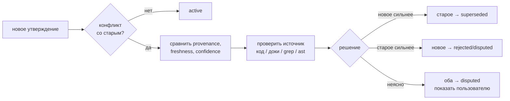
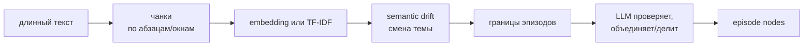

# 11 — Дорожная карта

Этот раздел фиксирует, что в AMG уже реализовано, какие расхождения выявлены аудитом и в каком порядке проект доводится до согласованного состояния. Дорожная карта теперь выполняет две функции:

1. **Стабилизация текущей реализации** — исправить несоответствия между кодом, промптами и документацией, а также реальные ошибки ядра.
2. **План развития** — добавить запланированные функции жизненного цикла, установки, визуализации, проверки качества, верификации памяти и масштабирования.

Правило ведения roadmap: документация проекта ведётся **опережающе** — она намеренно описывает целевое состояние системы, включая ещё не реализованные функции, чтобы не вписывать одно и то же дважды. Единственный источник правды о том, что реализовано, а что нет, — этот roadmap: раздел 2 связывает каждое опережающее место документации с этапом, на котором оно сверяется с готовым кодом. До своего этапа опережающие описания не удаляются и не правятся; всё частично реализованное фиксируется в roadmap с конкретным списком доработок.

---

## Уже реализовано

Базовый тракт AMG реализован и требует стабилизации по пунктам аудита ниже:

- **Транзакционное файловое хранилище** (`graph_store.py`): атомарные записи, журнал упреждающей записи, восстановление, единый лок на запись.
- **Извлечение структуры** (`extract_structure.py`): классификация файлов, нарезка Python-кода через `ast`, markdown/text/data-нарезатели, опциональное извлечение PDF/DOCX/XLSX.
- **Сверка графа с источниками** (`reconcile.py`): создание структурных узлов, очередь на смысловую деривацию, применение результатов субагентов.
- **Извлечение из графа** (`retrieve.py`): BM25-засев, опциональный semantic seed через embeddings, Personalized PageRank, сборка пакета по ярусам.
- **Консолидация** (`consolidate.py`): свёртка ко-активаций в веса, планирование кандидатов на сжатие, применение действий консолидации с архивированием.
- **Измерительный стенд retrieval** (`eval_retrieval.py`, `inspect_graph.py`): recall, precision, hop-recall, демо-граф, собственные размеченные случаи.
- **Субагенты и скиллы**: `amg-bootstrap`, `amg-retrieve`, `amg-consolidate` и субагенты `amg-builder`, `amg-synth`, `amg-classifier`, `amg-retriever`, `amg-consolidator`.
- **Документация**: теория, руководство пользователя и архитектурные разделы существуют, но нуждаются в синхронизации с кодом и разделении текущих возможностей от planned-функций.

---

## Состояние старых этапов

Старые этапы сведены в единый канон:

| Старый этап | Текущее состояние | Что остаётся сделать |
|---|---|---|
| Stage 1.5 — embedding-засев | Реализован через `embed.py` и `retrieval.embeddings` | Согласовать defaults, проверить многоязычные модели, включить eval-сравнение `off`/`on` |
| Stage 2 — text extraction PDF/DOCX/XLSX | Реализовано в `extract_structure.py` | Уточнить документацию, добавить недостающие форматы позже |
| Stage 3 — архитектурная документация | Черновик реализован | Сверять с кодом поэтапно через раздел 2; базовая синхронизация уже реализованного — Этап 7 |
| Stage 4 — автоматический eval-gate | Не реализовано | Встроить автоматическую проверку полноты до/после компрессии |
| Stage 5 — lifecycle & control | Не реализовано | Хуки `SessionStart`/`SessionEnd`, сохранение сессий, `/amg` commands, `automation` |
| Stage 6 — packaging/install | Частично описано в `INSTALL.md`, установщика нет | Реализовать установщик и привести инструкции к реальному состоянию |
| Stage 7 — 3D graph viewer | Не реализовано | Экспорт JSON + self-contained HTML viewer |
| Optimization | Не реализовано | `partition_queue.py`, `inspect_queue.py`, lazy derivation, generated indexes |

---

# Аудит: обязательные исправления перед дальнейшим развитием

Этот раздел фиксирует проблемы, выявленные аудитом. Они не являются «идеями на потом»: это задачи стабилизации. Пока они не закрыты, документация и поведение системы остаются рассинхронизированными.

---

## 1. Согласованность кода, промптов и архитектуры

### 1.1. Stale-узлы должны повторно попадать в очередь деривации

Исправлено на Этапе 0 (задача 1); детали → `05-reconcile.md` («Дифф: случаи сверки», «Очередь деривации», «Идемпотентность»); regression — `selftest_reconcile.py`, сценарии 2–4 (включая «повторный `plan()` не опустошает очередь»).

---

### 1.2. В узлах нужно сохранять `lineno` и `qualname`

Исправлено на Этапе 0 (задача 2); детали → `05-reconcile.md` («Создание узла», «Очередь деривации»), `02-data-model.md` (таблица полей), `08-agents-skills.md` (§ `amg-builder`); regression — `selftest_reconcile.py`, сценарии 1, 5, 15 (`path:line` в pack без `:None`). Правки `06-retrieval.md`/`GUIDE.md` про указатели — Этап 7 (база уже корректна).

---

### 1.3. При изменении источника нужно обновлять структурные рёбра

Исправлено на Этапе 0 (задачи 3–4); детали → `05-reconcile.md` («Обновление при изменении источника» — пересборка structural-рёбер, поле `origin`, почему `lang` не обновляется), `02-data-model.md` (таблица рёбер); regression — `selftest_reconcile.py`, сценарии 7–9. `defines` в legacy-fallback не включён (извлечение его не порождает); `source_path`/первичное `part_of` для того же id неизменны по построению — переносы решены задачей 7.

---

### 1.4. Типы хабов должны быть `hub` / `overview`, а не `derived`

Исправлено на Этапе 1 (задача 3): `amg-synth` (промпт и § в 08-agents-skills.md) задаёт `type: overview`/`hub`, происхождение — `source_kind: synthesized`; `retrieve.TIER_OF_TYPE` и `consolidate._branch_members` уже относили hub/overview к strategic-ярусу и веткам (код не менялся). Канон типов → `02-data-model.md`, раздел «Типы узлов».

---

### 1.5. Нормализовать таксономию `source_kind`

Исправлено на Этапах 0 (задача 5: код больше не пишет `derived`) и 1 (задача 7: `migrate_schema.py` переводит старые узлы `source_kind: derived` → `synthesized`). Канон (`derived_from_file` / `synthesized` / `authored`) → `02-data-model.md`; устаревший класс `derived` в `consistency-model.md` — пункт 2.14 (Этап 7).

---

### 1.6. `part_of` в `apply_derivation()` должен накапливаться или документироваться как замена

Исправлено на Этапе 0 (задача 6): `_merge_part_of` — темы накапливаются, для совпавшей темы побеждает новое значение (обоснование выбора режима — `05-reconcile.md`, «Применение семантики»), симплекс-нормализация при `weights.part_of_renormalize`; regression — `selftest_reconcile.py`, сценарий 10.

---

### 1.7. Узел нельзя преждевременно переводить в `active`

Исправлено на Этапе 0 (задача 6): `active` только при новой `summary` либо для не-`derived_from_file` узлов; элемент только с рёбрами/`part_of` оставляет узел `stale` и в очереди; детали → `05-reconcile.md` («Применение семантики») и докстринг `apply_derivation`; regression — `selftest_reconcile.py`, сценарий 11.

---

### 1.8. `compaction.enabled` должен реально выключать компрессию

Исправлено на Этапе 3 (задача 1): `make_plan` не помечает `over_budget` при `enabled:false`, `apply_actions` пропускает компрессионные действия (`COMPACTION_ACTIONS`) без `force:true`. Детали → `07-consolidation.md` («Применение», «Компрессия»), `09-config.md`; regression — `selftest_consolidate.py` (`test_enabled_gate`).

---

### 1.9. Консолидация должна быть описана как crash-safe, но не полностью идемпотентная

Исправлено на Этапе 3 (задачи 5–6): decay/Хебб/обрезка применяются только при наличии нового журнала ко-активаций (вариант 2), поэтому повторный `weights` без журнала не меняет `w`; `last_decay_at`/календарное затухание отвергнуты (Хебб про использование, не календарь). Детали → `07-consolidation.md` («Веса»), `THEORY.md` §8.1; regression — `selftest_consolidate.py` (`test_weights`, два режима).

---

### 1.10. `shorten` должен сохранять оригинал идемпотентно

Исправлено на Этапе 3 (задача 4): `.full` пишется только если ещё не существует — повторный `apply` не затирает оригинал. Детали → `07-consolidation.md` («Применение»); regression — `selftest_consolidate.py` (`test_shorten_idempotent`).

---

### 1.11. Защита `decision` и `adr` должна enforced в коде

Исправлено на Этапе 3 (задачи 2–3): `_is_protected` в `apply_actions` бережёт `protect_types` и high-centrality узлы (`degree/max_deg > protect_min_centrality`) от `shorten`/`retire`/`merge`-drop/`summarize`-archive без `force`. Детали → `07-consolidation.md` («Применение», «Компрессия»); regression — `selftest_consolidate.py` (`test_protect_and_force`, `test_centrality_protect`).

---

### 1.12. `status: superseded` должен влиять на retrieval

Исправлено на Этапе 2 (задача 1): `retrieve._apply_status_prior` — множитель на финальной активации (`superseded` 0.2; `stale` 1.0 + пометка `_STALE_MARK`; `disputed` 0.5 — опережающий; это переранжирование по валидности, не гейт телепортации); ключ `status_prior`. Снятие понижения `superseded` для запросов про историю/аудит — опережающая задача Этапа 14 (раздел задачи 6). Детали → `06-retrieval.md` («Статусный приоритет»), `02-data-model.md`; regression — `selftest_retrieve.py`.

---

### 1.13. Результат `amg-classifier` должен применяться кодом

**Файлы:**

- `agents/amg-classifier.md`
- `skills/amg-bootstrap/SKILL.md`
- `extract_structure.py`
- `docs/ru/architecture/04-ingest.md`
- `docs/ru/architecture/08-agents-skills.md`

`extract_structure.py --stats` показывает `ambiguous_files`. Скилл говорит, что можно запустить `amg-classifier`.

Но в коде нет:

- файла override-классификации;
- аргумента CLI для подстановки результата classifier;
- чтения `work/classification-overrides.json`;
- повторного extract с уточнённой категорией.

То есть classifier сейчас концептуально описан, но не интегрирован.

Требуется добавить, например:

```txt
.claude/amg/work/classification-overrides.json
```

Формат:

```json
{
  "scripts/run": {"category": "code", "language": "bash"},
  "README.old": {"category": "doc", "language": null}
}
```

`extract_structure.py` должен:

1. читать overrides;
2. применять их до fallback-классификации;
3. показывать в `--stats`, какие ambiguous files разрешены override-ом.

**Результат:** `amg-classifier` становится рабочей частью bootstrap, а не только описанным prompt.

---

### 1.14. `models` в `config.yml` должен работать

**Файлы:** 

- `config.yml`
- `agents/*.md`
- `docs/ru/architecture/09-config.md`
- `docs/ru/GUIDE.md`

В `config.yml` есть:

```yaml
models:
  discovery: haiku
  module_summary: sonnet
  synthesis: opus
```

Но реальные модели зашиты во frontmatter агентов:

```yaml
model: sonnet
```

Скрипты не читают `models`, и нет механизма проброса модели при запуске субагента.

То есть текущий `models` — декларация, а не рабочая настройка.

Необходимо:

1. Реализовать механизм установки/генерации agent frontmatter из `config.yml`.
2. Ввести структурную форму (с параметром thinking: low, medium, high, extra, max) с возможностью в имени модели задавать ее версию (например, sonnet_4_6):

```yaml
models:
  module_summary:
    model: sonnet
    thinking: low
```
3. Claude Code позволяет использовать в качестве агентов любые другие модели других провайдеров, реализовать возможность использования не только моделей семейства Claude.

4. Создать механизм применения формы при запуске субагентов.

**Результат:** конфигурация реально позволяет управлять выбором моделей.

---

### 1.15. `log.md` должен соответствовать заявленным гарантиям

**Файлы:**

- `docs/ru/architecture/01-overview.md`
- `docs/ru/architecture/03-storage.md`
- `docs/ru/architecture/07-consolidation.md`
- `skills/amg-bootstrap/SKILL.md`
- `reconcile.py`
- `consolidate.py`
- `consistency-model.md`

Документация говорит, что скрипты дописывают txid-строку в `log.md`.

В коде:

- `reconcile.py` вообще не пишет `log.md`;
- `consolidate.py` пишет через обычный append вне транзакции:

```py
with open(store.root / "log.md", "a", encoding="utf-8") as f:
    f.write(line)
```

Это не соответствует описанной модели «append как часть committed transaction с de-dup по txid».

Нужно реализовать транзакционный лог:
   - читать текущий `log.md`;
   - добавлять строку с `txid`;
   - писать через `tx.write`;
   - предотвращать дубли по `txid`.

**Результат:** логирование не противоречит модели crash-safety.

---

### 1.16. Семантика `absorb` должна быть описана одинаково везде

**Файлы:** 

- `GUIDE.md`
- `THEORY.md`
- `INSTALL.md`
- `09-config.md`
- `05-reconcile.md`
- `reconcile.py`

В нескольких местах написано: `absorb_path` «впитывается один раз».

Но реальный код делает так:

- если absorb-файл существует и изменился, узел обновляется и ставится в очередь;
- если absorb-файл удалён, узел сохраняется.

То есть текущая политика — не «один раз и заморожено», а:

> отслеживать изменения, пока источник существует; не удалять узел при исчезновении источника.

`05-reconcile.md` это объясняет правильно, остальные файлы — нет.

Необходимо везде заменить формулировку:

```txt
absorb — впитывается один раз
```

на:

```txt
absorb — источник можно удалить без удаления знания; пока источник существует, его изменения могут пересверяться.
```

**Результат:** пользователь понимает, что `absorb` защищает от удаления источника, но не обязательно замораживает его изменения.

---

### 1.17. Магические константы в consolidate.py

Исправлено на Этапе 3 (задача 11): `consolidate.load_config` читает `near_duplicate_sim`/`episodic_types`/`stale_age_days` из конфига (ключи верхнего уровня), они добавлены в шаблон `config.yml`. Детали → `09-config.md` («Настройки плана консолидации»).

---

### 1.18. Логические шероховатости

extract_structure.py и .claude: В DEFAULT_IGNORE_DIRS указан .claude. Это правильно (память не индексирует саму себя). Но если пользователь положит absorb_path: .claude/amg/sessions (когда сессии появятся), они будут проигнорированы. 

Этот edge-case стоит упомянуть в 04-ingest.md, но одного упоминания мало: это прямой блокер этапа сохранения сессий — `iter_source_files` молча отбросит такой источник. Снимается кодом (исключение для путей внутри собственного хранилища, если они явно перечислены в источниках) — задача внесена в Этап 9. С учётом параметризации каталога агента (см. 4.9) игнорировать нужно настроенный каталог, а не литерал `.claude`.

---

Пункты 1.19–1.30 добавлены вторым проходом аудита (сверка кода с документацией поверх первоначального списка).

---

### 1.19. Рёбра `imports` никогда не резолвятся

Исправлено на Этапе 0 (задача 8): `_module_map` резолвит внутрипроектные импорты в id узла модуля (внешние остаются висячими и отбрасываются при извлечении); детали → `05-reconcile.md` («Создание узла»), `02-data-model.md` («Рёбра»); regression — `selftest_reconcile.py`, сценарий 12. THEORY о связности — сверка на Этапе 7.

---

### 1.20. Бюджеты веток и компрессия фактически инертны

Исправлено на Этапе 3 (задача 12, развилка A): `_branch_members` дополнен обходом **вниз** от хаба по `HUB_DOWN_RELS` (`documents`/`defines`/`specifies`/`implements`/`contains`) со стопом на чужом хабе — ветка вычисляется, даже когда первичное `part_of` листа указывает на каталожную строку (вверх-путь сохранён). Выбран этот вариант (не переписывание синтеза) как локальный в `consolidate.py`. Детали → `07-consolidation.md` («План»), `THEORY.md` §10.2; regression — `selftest_consolidate.py` (`test_branch_downward`).

---

### 1.21. `introduce_subhub` уничтожает мультичленство

Исправлено на Этапе 3 (задача 13): заменяется только тема `parent_topic` → `hub_id`, прочие членства сохраняются, `_combine_part_of` ренормирует к симплексу. Детали → `07-consolidation.md` («Применение»); regression — `selftest_consolidate.py` (`test_subhub_keeps_memberships`).

---

### 1.22. `redirect_inbound` создаёт дубли рёбер

Исправлено на Этапе 3 (задача 9): `_dedup_edges` после `redirect_inbound` схлопывает рёбра соседа по `(rel, to)` (больший вес, суммарный `coact`) и отбрасывает self-edge. Детали → `07-consolidation.md` («Применение»); regression — `selftest_consolidate.py` (`test_merge_quality`).

---

### 1.23. `weights.default_edge_weight` — мёртвый ключ конфигурации

Исправлено на Этапе 3 (задача 11, развилка D): ключ проброшен в `reconcile._merge_edges` (новые смысловые рёбра), `retrieve.build_adjacency` (проводимость) и `consolidate.fold_weights` — больше не декоративный. Детали → `09-config.md` (блок `weights`).

---

### 1.24. Markdown-нарезатель режет по «заголовкам» внутри код-блоков

Исправлено на Этапе 0 (задача 9): `_markdown_units` отслеживает код-ограждения; детали → `04-ingest.md` (раздел «Markdown и разметка»); regression — `selftest_reconcile.py`, сценарий 14.

---

### 1.25. Tree-sitter-узлы выпадают из ярусов и формата указателей

Исправлено на Этапе 1 (задача 8): `_TS_DEF` в `extract_structure.py` канонизирует типы узлов грамматики в `function`/`class` ещё при извлечении, поэтому не-Python код попадает в существующие `TIER_OF_TYPE`/`CODE_TYPES` (retrieve.py не менялся); дрейф указателя `reconcile.py` сводит `type` старых зеркал. Детали → `04-ingest.md` («Прочий код — tree-sitter»), `02-data-model.md` («Типы узлов»); regression — `selftest_stage2.py` (живой JS-прогон). Описание tier mapping в `06-retrieval.md` сверяется на Этапе 2 (пункт 2.7.2).

---

### 1.26. `inspect_graph.py --bucket notes` не работает

Исправлено на Этапе 2 (задача 11): `retrieve.load_nodes` отдаёт `_path` (`nodes/<бакет>/…`), а `inspect_graph._in_bucket` фильтрует по реальному каталогу файла узла (работает и для `notes`/`_hubs` без id-префикса). Детали → `10-eval-tools.md`; regression — `selftest_retrieve.py`.

---

### 1.27. Квадратичный поиск дублей в `make_plan`

**Файл:** `consolidate.py`

Близость Жаккара считается по всем парам узлов: на 10⁴ узлов это ~5·10⁷ сравнений множеств — план консолидации упрётся в это раньше, чем retrieval в полный обход `.md`.

Нужно ограничить кандидатов (например, только эпизодические/notes-узлы) либо ввести MinHash/LSH-предфильтр; задача внесена в Этап 12.

**Результат:** `plan` масштабируется вместе с графом.

---

### 1.28. `--no-pack` молча отключает хеббов сигнал

**Файлы:**

- `retrieve.py`
- `docs/ru/GUIDE.md`

В CLI `log_coactivation=write_pack`: флаг, описанный как «не писать пакет на диск», заодно выключает журнал ко-активаций. Связка нигде не документирована.

Нужно либо отдельный флаг `--no-coactivation`, либо явно описать связку в GUIDE и 06-retrieval.

**Результат:** побочные эффекты команд предсказуемы.

---

### 1.29. Пересечение `mirror_path` и `absorb_path` не определено

**Файлы:**

- `extract_structure.py`
- `reconcile.py`
- `docs/ru/architecture/09-config.md`
- `INSTALL.md`

Файл, попавший под оба корня, обходится дважды; дедупликация по id в `plan()` молча оставляет политику последнего источника (absorb — по порядку `resolve_sources`).

Нужно валидировать пересечения источников (предупреждение в `plan`/`--stats`) и документировать приоритет политик.

**Результат:** конфликт политик не разрешается молча.

---

### 1.30. Несуществующий путь источника пропускается без диагностики

**Файлы:**

- `extract_structure.py`
- `reconcile.py`

`iter_source_files()` для отсутствующего пути просто возвращает пустоту: опечатка в `mirror_path` даёт «граф построен, added: 0» без объяснения причины.

Нужно в выводе `plan` и `--stats` показывать счётчик файлов по каждому источнику, включая явное «путь не найден».

**Результат:** ошибки конфигурации видны сразу, а не маскируются под пустой дифф.

---

# 2. Исправления и доработка документации по файлам

Этот раздел — **реестр контрольных точек документации**, а не приказ на немедленную правку и тем более не на удаление. Документация намеренно опережает код (см. правило ведения roadmap в начале файла): описания ещё не реализованных функций **не удаляются** — иначе их пришлось бы вписывать заново после реализации. Семантика блоков «Нужно исправить» такая:

- каждый пункт **закрывается на том этапе, где реализуется соответствующий механизм**: в этот момент описанное место сверяется с фактическим кодом — что-то подтверждается и остаётся как есть, что-то корректируется под реальное поведение, и только явно лишнее удаляется;
- пункты про **уже реализованное сегодня** поведение (расхождения «код ↔ текст» базового тракта, язык, ссылки, диаграммы) закрываются один раз на Этапе 7 (базовая синхронизация);
- до своего этапа ни один пункт не исполняется; формулировки вида «описывать как planned», «не описывать, пока не реализовано», «разделить текущее и planned» исполняются **не** как немедленная пометка или перестройка документации, а как сверка на этапе реализации: к моменту закрытия пункта функция уже существует, и описание либо подтверждается, либо корректируется.

Закрытые пункты помечаются выполненными и теряют содержимое (для чистоты и компактности раздела), чтобы roadmap всегда отражал текущее состояние планов. Момент и порядок сворачивания — правило гранулярности в начале §5: сначала синхронизируется документация, и только затем урезается текст пункта.

README.md и README_RU.md лежат в корне как заглушки — содержимое предстоит написать на своём этапе. В них: первый абзац = первый абзац теории (что такое AMG); 2–3 абзаца «как устроено» (две плоскости, граф-над-деревом, активация→PPR→пакет, консолидация); несколько практических моментов из гайда (mirror/absorb, что само запускается; консервативные умолчания: хеббово обучение весов выключено — `weights.apply_hebbian` off, проводимость учится только после измеренного выигрыша eval; компрессия не трогает граф, пока ветка в пределах бюджета); карта (теория / архитектура / гайд / INSTALL) и как установить и активировать, также добавить однострочный quick-start (установить → active: true → первая сверка → первый запрос) и строку про опциональные зависимости — включая **бэкенды эмбеддингов и их модели по умолчанию** (model2vec `potion-retrieval-32M` / `potion-multilingual-128M`, sentence-transformers) с оговоркой, что для не-английских (в т. ч. русских) проектов нужна мультиязычная модель; детали — в GUIDE (см. 2.12 п. 8). Для README_RU — на Этапе 7, для README — на Этапе 18.

README.md - английская версия, ссылается на еще отсутствующие переводы (которые будут идти последним этапом) документов в docs/en/\*, а README_RU.md - аналогичная русская версия, ссылающаяся на уже существующие docs/ru/\*.  

---

## 2.1. `docs/ru/THEORY.md`

Нужно исправить:

1. **Разрешение противоречий.** Сейчас теория описывает `contradicts` / `supersedes` / `status` как почти готовый цикл. Закрывается на Этапах 13–14: сверить описание с реализованными provenance/verification и арбитражем; до того текст остаётся опережающим (текущий минимум в коде — рёбра и статусы существуют).
2. **Лог решений памяти.** Утверждение, что каждое решение памяти логируется с оценкой и причиной, оставить только после реализации такого журнала. Пока это planned.
3. **`absorb`.** Описать как «переживает удаление источника», а не как строго one-shot.
4. **Типы рёбер.** Закрыт на Этапе 2: `refines`/`exemplifies`/`supersedes` внесены в список §4 THEORY (β 0.6/0.6/0.3; эмитенты — `amg-builder`/`amg-synth`).
5. **Веса.** Заменить конфликтующую формулировку «веса не выучиваются» на:
   > веса не обучаются градиентным спуском; они обновляются эвристическими правилами Хебба, затухания и суждением модели.
6. **Термины.** Убрать кальки и неуместные англицизмы:
   - `лоссово` → «с потерей деталей»;
   - `харнесс` → «измерительный стенд»;
   - `авто-гейт` → «автоматическая проверка качества»;
   - `крэш-безопасность` → «устойчивость к сбоям».
7. **Объяснимость (§14.2).** Закрыт на Этапе 2: реализован `retrieve.py --explain` (рёбра с наибольшим вкладом притока массы); формулировка §14.2 оставлена (стала истинной) и дополнена ссылкой на флаг.
8. (добавлено на Этапе 0) **§12, mirror.** К тройке «добавлен → узел; изменён → обновлён; удалён → вычищен» добавить четвёртый случай: «перенесён/переименован → заработанный след следует за содержимым» — идентичность следа контентная, а не адресная (хеш-парование deleted+added), память переживает рефакторинг носителя без повторной деривации. Реализация — Этап 0 (задача 7), механика → 05-reconcile.md; закрыть на Этапе 7 вместе с базовой сверкой THEORY.

---

## 2.2. `docs/ru/architecture/01-overview.md`

Нужно исправить:

1. `models` не описывать как реально управляющий agent model, пока нет механизма проброса.
2. `log.md` описать как best-effort или реализовать транзакционный лог.
3. Зафиксировать типы хабов: `hub` и `overview`.
4. Уточнить, что `archive/`, `work/`, `cache/`, `log.md` создаются по мере необходимости.
5. Ясно разделить:
   - deterministic CLI (`plan`, `apply`);
   - оркестрацию Claude Code через скиллы и субагентов.
6. При необходимости разбить диаграмму модулей на две: orchestration layer и script/storage layer.
7. «Рядом с каждым модулем лежит самотест» — преувеличение: у `reconcile.py`, `retrieve.py`, `eval_retrieval.py` собственных самотестов нет. Исправить формулировку или закрыть пробел тестами Этапа 0.

---

## 2.3. `docs/ru/architecture/02-data-model.md`

Нужно исправить:

1. Закрыт на Этапе 1 (задачи 1–2): канон `type` — раздел «Типы узлов» 02-data-model.md; tree-sitter-типы — допустимое расширение до канонизации (задача 8 Этапа 1).
2. Закрыт на Этапе 1 (задачи 5–7; `lineno`/`qualname`/`origin` — ещё Этап 0): все поля и planned-поля — в таблицах и подразделе «Запланированные поля» 02-data-model.md; legacy-разметку `origin` выполняет `migrate_schema.py`; решение по `lang` (язык источника в схему не входит, при будущей нужде — отдельное поле `source_lang`) — строка `lang` таблицы полей.
3. Закрыт на Этапе 1: `coact` и `last_used` описаны как поля рёбер в таблице «Рёбра» 02-data-model.md.
4. Закрыт на Этапе 1 (задача 4; код — Этап 0, задача 5): канон — разделы «Классы узлов и `source_kind`» и «Типы узлов» 02-data-model.md; миграция старых узлов — задача 7 Этапа 1.
5. Описать, что `part_of` может:
   - создаваться детерминированно по пути;
   - уточняться `amg-synth`;
   - нормализоваться консолидацией;
   - заменяться на subhub при `introduce_subhub`.
6. Закрыт на Этапе 2: `superseded` реально понижается (`status_prior` 0.2) — отражено в 02-data-model и 06-retrieval.
7. Дополнить раскладку каталогов: в схеме отсутствуют `cache/` (pack.md, embeddings.json) и `log.md`.
8. Закрыт на Этапе 1: пример пути файла узла исправлен на `nodes/code/src_billing.py_charge_card-…` (одинарный подчерк вместо двойного) — 02-data-model.md, раздел «Путь файла узла».
9. Закрыт на Этапе 0: резолвер imports, поле `origin` рёбер и строки `qualname`/`lineno` отражены в 02-data-model.md (таблицы полей и рёбер, раздел «Рёбра»).

---

## 2.4. `docs/ru/architecture/03-storage.md`

Нужно исправить:

1. Уточнить гарантию transaction:
   > до recovery живое хранилище может быть частично применено; после `recover()` оно сходится к целевому состоянию.
2. Не описывать `dangling_references` как проверку graph edge targets. Сейчас это проверка переданных файловых путей.
3. Уточнить: метод `recover()` безопасен, но при конкурентных writes должен вызываться под lock; CLI так и делает.
4. Согласовать `log.md` с фактической реализацией после выбора решения по пункту `1.15`.
5. Закрыт на Этапе 0: `resolve_amg_root` описан в разделе «Интерфейс командной строки» 03-storage.md.

---

## 2.5. `docs/ru/architecture/04-ingest.md`

Нужно исправить:

1. RST сейчас не имеет полноценного RST heading parser. Документировать как prose fallback или реализовать RST-разбор.
2. `.ndjson` классифицируется как data, но line-delimited JSON не разбирается. Нужно либо реализовать NDJSON, либо описать fallback.
3. Формулировку «правка одной функции переизвлекает только её узел» заменить на точную:
   - function hash меняется у функции;
   - class hash меняется у всего class body;
   - module hash меняется у всего файла.
4. Описать, что `amg-classifier` требует `classification-overrides.json`.
5. Не заявлять CSV/logs как supported data, пока нет классификатора и нарезателя.
6. Добавить planned:
   - chat/session chunker;
   - semantic drift segmenter;
   - recursive JSON;
   - CSV/log parser;
   - PPTX slide parser.
7. Закрыт на Этапе 0: отслеживание код-ограждений описано в разделе «Markdown и разметка — headings» 04-ingest.md.

---

## 2.6. `docs/ru/architecture/05-reconcile.md`

Закрыт целиком на Этапе 0 — документ синхронизирован с реализованным ядром сверки: исправлены относительные ссылки; описаны все случаи диффа (`moved`, requeue недовыведенных, дрейф указателя), пересборка структурных рёбер с полем `origin`, поля очереди (`qualname`/`lineno`/`lang` — язык источника) и её самовосстановление полной пересборкой из состояния графа, merge `part_of` (новое значение побеждает, симплекс), условия перевода в `active` (только при новой `summary`), правило сохранности при переносе, резолвер imports, разрешение корня графа (`resolve_amg_root`) и флаг `--root`.

---

## 2.7. `docs/ru/architecture/06-retrieval.md`

Нужно исправить:

1. Закрыт на Этапе 2: влияние `status` описано — раздел «Статусный приоритет» + ключ `status_prior` (06-retrieval).
2. Закрыт на Этапе 2: tier mapping описан полностью (`decision`/`adr` → strategic; тело рулингов рендерится в любом ярусе) — 06-retrieval.
3. Закрыт на Этапе 2: relation priors `refines`/`exemplifies`/`supersedes` описаны; формулировка слияния поправлена на по-ключевое (`_deep_merge`) — 06-retrieval.
4. Исправить неправильные относительные ссылки. (Этап 2: попутно починена ссылка на 07-consolidation в разделе «Что извлечение пишет».)
5. Уточнить `path:line`: работает только если `lineno` пишется в node frontmatter.
6. Закрыт на Этапе 2: третья запись `cache/embeddings.json` описана в 06-retrieval («Что извлечение пишет»); SKILL.md уже упоминает кэш векторов.

---

## 2.8. `docs/ru/architecture/07-consolidation.md`

Пункты 1–6 закрыты на Этапе 3: `07-consolidation.md` синхронизирован с кодом — `compaction.enabled` как рабочий флаг (п.1), честная idempotency весов без обещания строгой (п.2, decay при журнале), idempotent archive `shorten` (п.3), защита `decision`/`adr`/high-centrality enforced в коде (п.4), узлы консолидации к канону synthesized + бакет `_hubs` (п.5), inbound-grounding в salience (п.6). Пункт 8 закрыт на Этапе 0 (`--root`). Осталось опережающим:

7. Автоматический eval-gate: закрывается на Этапе 4 — сверить описание с реализованным механизмом.

---

## 2.9. `docs/ru/architecture/08-agents-skills.md`

Нужно исправить:

1. Закрыт на Этапе 1 (задача 3): `agents/amg-synth.md` и § `amg-synth` в 08-agents-skills.md задают `type: overview` для обзора и `type: hub` для хабов; происхождение — `source_kind: synthesized`, проставляется при `apply`.
2. Закрыт на Этапе 0: поля `qualname`/`lineno`/`lang` добавлены в очередь; вход синхронизирован и в промпте `amg-builder.md`, и в § `amg-builder` файла 08-agents-skills.md (`lang` на входе — язык источника, в выходе — язык сводки).
3. Описать применение `amg-classifier` через overrides.
4. Уточнить, что `amg-synth` не редактирует `nodes/`, но может писать `gap-report.md`.
5. Добавить отдельный safe API для capture notes. До его реализации не описывать notes capture как полностью готовую ручную операцию.
6. Хуки, команды `/amg`, sessions и `automation`: описания сверяются на Этапах 8–9 (закрытие пункта там); до того остаются опережающими.

---

## 2.10. `docs/ru/architecture/09-config.md`

Нужно исправить:

1. Закрыт на Этапе 2: дефолт модели эмбеддингов зависит от `working_language` (en → `potion-retrieval-32M`; не-en → `potion-multilingual-128M` / `paraphrase-multilingual-MiniLM-L12-v2`); принцип «лёгкое обогащение, не ~8B-лидеры», override и `--compare-embeddings` описаны в 09-config/06/GUIDE (README — на Этапах 7/18, см. 2.12 п. 8). Имена — по веб-поиску июня 2026.
2. Уточнить, что `models` пока declarative/planned, если нет механизма проброса.
3. Закрыт на Этапе 3: `compaction.enabled` описан в 09-config как рабочий переключатель (`false` выключает пометку веток и компрессионные действия).
4. Закрыт на Этапе 2: «код-fallback ≠ шаблон» разведено в 09-config для `token_budget` (код 1200/2500/6000/40) и бюджетов веток (код 150/60000 ≠ шаблон 400/200000); слияние `retrieval` переформулировано как по-ключевое (`_deep_merge`).
5. Закрыт на Этапе 3: `near_duplicate_sim`/`episodic_types`/`stale_age_days` читаются из конфига, добавлены в шаблон и описаны в 09-config (раздел «Настройки плана консолидации»).
6. Добавить planned-поля:
   - `automation`;
   - `session_policy`;
   - `sessions`;
   - `absorb_freeze` или `absorb_once`, если вводится;
   - `agent_dir` / `entrypoint` (пишет installer, см. 4.9: `entrypoint` читается кодом из конфига, `agent_dir` фиксирует выбор декларативно — корень ищется по расположению самого конфига);
   - `confidence`/`verification` config, если появится.
7. Закрыт на Этапе 2: `convergence_tol`/`seed_floor`/`status_prior` и типы `refines`/`exemplifies`/`supersedes` внесены в таблицу `retrieval` 09-config.
8. Закрыт на Этапе 3: `weights.default_edge_weight` проброшен в код (`reconcile`/`retrieve`/`consolidate`) и описан в 09-config как рабочий (см. 1.23).

---

## 2.11. `docs/ru/architecture/10-eval-tools.md`

Нужно исправить:

1. `eval_retrieval.py --make-demo` не read-only: он создаёт демо-граф. Уточнить, что read-only относится к existing graph mode.
2. Hop-recall определить точно:
   > полнота по gold-узлам, которые lexical baseline не достал в top-$K$.
3. В demo graph привести id-префиксы к канону `doc:` вместо `docs:`, если это не ломает тест.
4. Добавить практику: eval запускается до/после retrieval tuning и до/после compaction.

---

## 2.12. `docs/ru/GUIDE.md`

Нужно исправить:

1. Места, закрываемые на своих этапах (сверка описания с реализацией; до того — опережающий текст):
   - `/amg on/off/status/repair`, `automation`, hooks `SessionStart` / `SessionEnd` — Этап 8;
   - sessions, `session_policy` — Этап 9;
   - 3D viewer — Этап 15;
   - structured model config — по реализации 1.14.
2. Исправить ссылку на несуществующий `README_RU.md`.
3. Согласовать описание `absorb`.
4. Добавить безопасный способ создания `notes` после реализации note API.
5. Убрать/заменить неудачные термины:
   - «исцелить граф» → «восстановить граф»;
   - «харнесс» → «измерительный стенд»;
   - «гейт» → «проверка качества».
6. Описать отчёт о пробелах (`gap-report.md`): один из главных пользовательских выходов bootstrap полностью отсутствует в руководстве — прямое нарушение требования «перечислены ВСЕ возможности».
7. После параметризации среды (см. 4.9) указать, что `.claude` и `CLAUDE.md` — значения по умолчанию для Claude Code; в других средах используются их имена (например, `.agents` / `AGENTS.md`).
8. Закрыт на Этапе 2: выбор моделей эмбеддингов описан в GUIDE (опциональность и зависимости; per-language дефолты с именами; автоподбор многоязычной модели для не-английских проектов; принцип «лёгкое обогащение, не ~8B-лидеры»; override и `--compare-embeddings`). Имена в README — на Этапах 7/18 (см. спецификацию README в преамбуле раздела 2).

---

## 2.13. `INSTALL.md`

Нужно исправить:

1. Автоматическая установка силами модели: закрывается на Этапе 10 — сверить раздел с реализованным installer.
2. Добавить или сгенерировать `requirements.txt`, если инструкция на него ссылается.
3. Развести локальную и глобальную установку:
   - локальная: команды через `<project>/.claude/skills/...`;
   - глобальная: engine в `~/.claude/skills/...`, graph в `<project>/.claude/amg/`.
4. Конфиг:
   - пустые поля → значения по умолчанию, кроме обязательных absorb/mirror (переспросить);
   - при глобальной установке сначала системой должен читаться глобальный конфиг, потом локальный, локальный переопределяет по-ключево, недостающее наследуется из глобального;
   - даже при глобальной установке создаётся локальный config.yml (под проект — как минимум absorb/зеркала), а данные — всегда в проекте (nodes/, work/, sessions/, journal/, archive/).
5. `mirror_path` и `absorb_path` не делать одновременно обязательными: код допускает любой из них.
6. Sessions и `SessionEnd` в install snippet: закрывается на Этапе 9 — сверить с реализацией.
7. Описать merge блока `CLAUDE.md` между маркерами как planned или реализованное поведение установщика после его появления. Шаблон блока лежит в `entrypoint/CLAUDE.md` репозитория (английский, как весь управляющий слой); корневой `CLAUDE.md` репозитория — инструкции разработки AMG; installer дописывает содержимое шаблона в точку входа целевого проекта между маркерами.
8. После параметризации среды (см. 4.9): добавить вопрос «каталог агента / файл точки входа» (по умолчанию `.claude` / `CLAUDE.md`; пресет для прочих сред — `.agents` / `AGENTS.md`).

---

## 2.14. `consistency-model.md`

Документ выпал из аудита, а это самый ответственный текст слоя гарантий — рассинхрон именно здесь опаснее всего.

Нужно исправить:

1. Убрать фантомные файлы `index.md` («catalog») и `graph.json` («connectome») из §4, §7 и §12: их не пишет и не читает ни одна строка кода. Либо реализовать, либо вычистить из модели.
2. Исправить раскладку: `nodes/` содержит `code/ doc/ data/ notes/ _hubs/` — в документе указан `docs/` и пропущен `data/`; сверить с `graph_store.init()`.
3. §2: absorb-источники описаны как «read once into authored notes» — код создаёт такие узлы как `derived_from_file` + `policy: absorb`, и выживание при удалении источника обеспечивает проверка `policy`, а не `source_kind`. Исправить описание механизма (02-data-model описывает его верно).
4. Добавить проверку «документированная раскладка == `graph_store.init()`» в тесты (Этап 7).

---

## 2.15. Сквозное: пути `.claude` и `CLAUDE.md` во всей документации

Во всех файлах документации (THEORY, GUIDE, INSTALL, README, architecture 01–11, consistency-model) пути и команды жёстко привязаны к `.claude/...`, а точка входа — к `CLAUDE.md`, тогда как память предназначена не только для Claude Code. После параметризации среды (4.9; код — Этапы 0 и 10) выполняется сквозной проход по всем документам:

1. `.claude` и `CLAUDE.md` подаются как значения по умолчанию для Claude Code.
2. При первом упоминании в каждом файле — короткая оговорка: в иных средах используются настроенные имена (каталог агента, например `.agents`, и его точка входа, например `AGENTS.md`).
3. Примеры команд остаются с `.claude` как иллюстрацией умолчания — переписывать каждый путь на плейсхолдеры не нужно.

Закрывается на Этапе 10 (задача 9).

---

## 2.16. `entrypoint/CLAUDE.md` (блок активации)

Блок активации — особый случай реестра: в отличие от документации, модель целевого проекта **исполняет его как инструкции**, поэтому опережающее описание здесь недопустимо — несуществующая команда или механизм в блоке означает галлюцинированное поведение. Блок всегда описывает только реализованное и обновляется на этапах, меняющих петлю:

1. Этап 5: петля захвата — фиксация решений через notes-API, а не правкой `nodes/` руками.
2. Этап 6 (первый живой запуск блока в песочнице): сверить блок с фактическим движком на этот момент; вычистить упоминания нереализованного, если успели появиться.
3. Этап 8: команды `/amg on/off/status/repair`, словесные триггеры, поведение `automation`, подключение always-on дайджеста.
4. Этап 9: сохранение сессий и `session_policy` — что происходит на `SessionEnd`.
5. Этап 10: блок становится шаблоном, рендеримым installer'ом: пути подставляются из `agent_dir`/`entrypoint`, а не зашиты на `.claude/...` (для Claude Code результат совпадает с сегодняшним); см. 2.15.
6. Этап 12: доработка барьера «не править инфраструктуру AMG во время её использования» (задача 10 этапа).

Текущее состояние (по аудиту): блок честен — сессии, команды `/amg` и `automation` в нём не упомянуты, описание журнала/архива/`log.md` соответствует коду; немедленных правок не требует.

---

# 3. Язык, термины и диаграммы

Документация должна быть на естественном русском техническом языке. Устоявшиеся термины разработки сохраняются, кальки и случайные английские вставки убираются.

---

## 3.1. Термины, которые остаются

Эти термины допустимы и не требуют искусственного перевода:

- `frontmatter` — при первом упоминании пояснять как YAML-заголовок;
- `endpoint`;
- `callback`;
- `top-k`;
- `multi-hop` — с пояснением «многошаговый»;
- `BM25`;
- `PageRank`;
- `Personalized PageRank`;
- `embedding` / эмбеддинг;
- `hop-recall`;
- и другие устоявшиеся в языке (особенно названия метрик).

---

## 3.2. Термины, которые заменить

| Было | Стало |
|---|---|
| крэш-безопасность / крэш-безопасный | устойчивость к сбоям / отказоустойчивость |
| исцелить граф | восстановить граф |
| Лок / Взять лок / Под локом | Блокировка |
| Хеш-гейт / Хеш-гейтинг | Фильтр по хешу / проверка хеша / хеш-барьер |
| авто-гейт eval | автоматическая проверка качества / eval-предохранитель |
| харнесс | измерительный стенд / стенд оценки / инструментарий тестирования / среда измерения |
| Деривация / Деривировать | Семантическое обогащение / генерация сводок |
| лоссово укоротить | укоротить с потерей деталей / сжать с потерями |
| лоссовый шаг | шаг с потерей деталей / шаг с потерями |
| уплывшие документы | рассинхронизированные документы / не связанные документы |
| Ингест | Загрузка данных / извлечение структуры |
| Бакет | каталог-категория / раздел хранения (либо оставить «бакет» как принятый) |
| «Трюк» (заголовок в GUIDE) | практический приём (унифицировать с THEORY, §12) |
| по-ключево | слиянием по отдельным ключам |
| «пол» (seed_floor) | базовая масса / нижняя добавка |
| сниппет | блок / фрагмент |

И подобные по концепции слова и выражения. Заменить во всех документах.

При замене терминов, отражённых в именах файлов и команд (деривация → `derived-*.json`, измерительный стенд → `eval_retrieval.py`), при первом упоминании сохранять английский оригинал в скобках — иначе рвётся связь текста с артефактами кода.

---

## 3.3. Диаграммы

Правила для всех Mermaid-диаграмм:

- pipeline/process — `flowchart LR`;
- иерархии/деревья — `flowchart TD`;
- слишком длинные процессы разбивать на фазы;
- без пёстрых заливок, чтобы диаграммы читались в светлой и тёмной теме;
- не делать вертикальные «простыни», требующие долгой прокрутки.

Текущие диаграммы в основном соответствуют этому правилу.

---

# 4. Архитектурные решения (улучшения) по итогам аудита

Этот раздел фиксирует решения, которые становятся частью плана развития.

---

## 4.1. Markdown остаётся каноническим хранилищем; SQLite — производный ускоряющий индекс

Каноническая память остаётся в markdown-файлах:

```txt
.claude/amg/nodes/**/*.md
```

Причины:

- человекочитаемость;
- git diff;
- простое восстановление;
- ручной аудит;
- переносимость;
- отсутствие обязательной внешней базы.

Никакой индекс не заменяет Markdown как source of truth. Мотивация для индекса — масштаб: текущий `retrieve.py` на каждый запрос делает

```py
for p in nodes_dir.rglob("*.md"):
    ...
```

то есть читает все node-файлы графа. Для сотен и нескольких тысяч узлов это нормально; для десятков тысяч — уже заметно; для сотен тысяч — проблема.

Поэтому для крупных графов добавляется производный read-index:

```txt
nodes/*.md          каноническая память (source of truth)
index.sqlite        восстановимый сгенерированный кэш
embeddings cache    восстановимый семантический кэш
```

`index.sqlite` может хранить: id узла, type/status, summary, searchable text, FTS-таблицу, adjacency, source hash, ссылку на embedding. Индекс полностью пересобирается из Markdown и не считается источником истины: если SQLite сломался — удалить и пересобрать.

---

## 4.2. Детерминированные рёбра извлекаются до обращения к LLM

LLM не должна тратить токены на связи, которые можно получить точно.

Детерминированно извлекать:

- Python imports/calls;
- tree-sitter symbols/calls;
- Markdown links;
- file paths in docs;
- code identifiers in prose;
- heading hierarchy;
- JSON/YAML references;
- speaker turns / timestamps in transcripts;
- session/message adjacency;
- git co-change после появления git-режима.

LLM остаётся для:

- смысловых рёбер `documents`, `depends_on`, `relates_to`, `contradicts`;
- разрешения неоднозначности;
- синтеза хабов;
- обобщения;
- оценки значимости.

---

## 4.3. Вводится слой provenance, confidence и verification

Приоритетный принцип: уверенно-ложная память опаснее отсутствующей. Сводка, написанная три рефакторинга назад и поданная как факт, хуже пустого графа — модель ответит убедительно и неверно. Поэтому лёгкое правило верификации вводится уже на Этапе 2 (поведенческое: перепроверять утверждения о коде grep'ом и хешем до ответа), а этот раздел описывает полный слой.

Нужна модель доверия:

```txt
код в current main > актуальная документация > ADR > свежая сессия > legacy docs > догадка модели
```

Каждый важный факт должен знать происхождение и степень доверия.

Planned-поля:

```yaml
confidence: 0.82
provenance:
  kind: code | doc | chat | user | model_inference
  source_path: src/app/service.py
  source_hash: ...
  commit: ...
  line_start: 10
  line_end: 42
verification:
  status: verified | stale | unverified | contradicted
  method: grep | ast | test | user | doc | none
  last_verified_at: 2026-06-07T12:00:00
  last_verified_commit: ...
```

Retrieval и answer-подготовка должны учитывать:

- низкую уверенность;
- устаревший source hash;
- `superseded`;
- `contradicted`;
- отсутствие verification.

Для спорных случаев лучше:

- создать `contradicts`;
- пометить оба факта;
- запустить verification;
- для high-impact изменений спросить пользователя.

---

## 4.4. Противоречия разрешаются через эпистемический арбитраж

Новый факт, противоречащий старому, не должен просто добавлять `contradicts`. Нужен процесс:



Правило приоритетов задаётся явно, например:

```txt
актуальный код > актуальная документация > ADR > свежая сессия > legacy docs > догадка модели
```

---

## 4.5. Confidence + verification

Для памяти LLM это критично: модель не должна уверенно отвечать по устаревшему воспоминанию.

Нужны:

```yaml
confidence: 0.0..1.0
last_verified_at: ...
last_verified_commit: ...
source_hash: ...
derived_from_hash: ...
verification:
  method: grep | ast | test | user | doc
  result: pass | fail | unknown
```

И поведение retrieval:

- низкая confidence → показать предупреждение;
- stale source hash → проверить перед ответом;
- code claim → grep/tree-sitter verification;
- contradicted claim → surfaced as conflict, not fact.

---

## 4.6. Semantic drift используется как сегментатор длинной прозы

**Важно.** Не реализовывать, пока chat/session-нарезатель (Этап 11) не покажет на практике, что осталась реальная боль: структурные нарезатели закрывают подавляющую часть входов, а точность стоит выше экономии токенов. Если реализовывать — последним этапом и только под автоматической проверкой качества (Этап 4).

Для длинных неструктурированных источников вводится статистическая нарезка эпизодов:

- длинных расшифровок созвонов;
- экспортов чатов;
- книг;
- длинных plain text документов без заголовков;
- session dumps;
- prose.

То есть для тех входов, где нет явной структуры.

### Где не нужно

Для кода, Markdown-документации, DOCX с заголовками, JSON/YAML, XLSX лучше использовать структуру:

```txt
AST > headings > records > sheets > semantic drift
```

Semantic drift не должен заменять структурные нарезатели.

### Поможет ли снизить токены?

Да, если сейчас builder получает слишком большие куски текста.

Pipeline:



Это снижает токены, потому что LLM читает не часовую простыню, а смысловые сегменты.

### Потеряет ли качество?

Может потерять, если сделать жёстко. Поэтому обязательно нужны предохранители (качество превыше всего):

- min segment length;
- max segment length;
- overlap между сегментами;
- adaptive threshold, а не фиксированный;
- сохранение `boundary_confidence`;
- возможность LLM объединить соседние сегменты;
- исходный файл остаётся доступен.

Можно сделать так (лишь предложение на рассмотрение):

```yaml
episode:
  id: ...
  source_path: ...
  start_offset: ...
  end_offset: ...
  boundary_confidence: 0.74
  segmentation_method: semantic_drift
```

И рёбра от алгоритма ставить не как сильное `relates_to`, а как слабое:

```yaml
rel: co_occurs
w: 0.2
```

Либо вообще не добавлять в основной graph до LLM-проверки.

### Итог

Механизм:

- ускорит обработку длинной прозы;
- уменьшит токены;
- даст builder более чистые единицы;
- не заменит LLM для смысловых рёбер;
- не нужно для уже структурированных источников.

Semantic drift не заменяет LLM-смысловые рёбра. Он только готовит более компактные и связные кандидаты для builder/consolidator.

---

## 4.7. Separate memory scopes

Память разделяется на области (scopes):

```txt
project memory      конкретный репозиторий
user memory         предпочтения пользователя
global patterns     обобщённые инженерные принципы
session memory      свежий эпизод
```

AMG сейчас проектный, и это правильно для старта. Решение по итогам аудита: разделение нужно, но с явными границами приватности. Память о проекте и память о человеке — разные обязательства: user-слой создаётся только с явного согласия, без автоматического засева из проектных запросов; связи между областями — только явными рёбрами. Рассеивание внимания не угроза: телепортация и так смещает массу активации к релевантной области. Разделение областей — пререквизит кросс-проектного семантического слоя (Этап 17).

---

## 4.8. Evaluation always on

Наверное, не стоит доверять памяти без eval:

- recall;
- precision;
- hop-recall;
- stale-claim rate;
- verification failure rate;
- compression loss.

То есть не «кажется, стало лучше», а измерение.

---

## 4.9. Переносимость движка: каталог агента и точка входа — параметры, а не константы

Сейчас AMG жёстко привязан к Claude Code двумя зашитыми именами: каталог `.claude` и файл точки входа `CLAUDE.md`. Скиллы и агенты по содержанию универсальны; для прочих сред (OpenAI Codex и подобных) достаточно `.agents` и `AGENTS.md`.

Вводится единая параметризация:

```txt
agent_dir:  .claude     # каталог движка и графа (умолчание — Claude Code)
entrypoint: CLAUDE.md   # файл точки входа (умолчание — Claude Code)
```

Разрешение значения `agent_dir` (по убыванию приоритета):

1. явный аргумент CLI (`--root`);
2. переменная окружения `AMG_AGENT_DIR` — необязательный override для CI и хуков (кто её не задаёт, того она не касается);
3. поиск конфигурации вверх от текущего каталога: первый каталог, содержащий `amg/config.yml`, и есть каталог агента. Это и есть «взять из конфига», но без круговой зависимости: ключ `agent_dir` внутри config.yml нельзя прочитать, пока конфиг не найден, поэтому первичен не ключ, а расположение файла. Заодно это чинит глобальную установку, где расположение скриптов (`~/.claude/skills`) не совпадает с корнем графа проекта;
4. расположение самих скриптов (`graph_store._default_root` и `retrieve._default_store` уже вычисляют корень относительно файла скрипта: движок в `.agents/skills/…` автоматически даёт корень `.agents/amg`) — покрывает локальную установку и дев-раскладку;
5. умолчание `.claude`.

Имя `entrypoint` хранится ключом в `config.yml` и читается оттуда — здесь круговой зависимости нет. Ключи `agent_dir`/`entrypoint` записывает в конфиг installer; `agent_dir` в конфиге фиксирует выбор декларативно (для installer и документации), корень же ищется по расположению конфига.

Что зашито сейчас и требует параметризации:

- `reconcile.py` и `consolidate.py`: литерал `project_root / ".claude" / "amg"` — вычислять от `agent_dir`;
- `DEFAULT_IGNORE_DIRS`: игнорировать настроенный каталог агента, а не литерал `.claude` (иначе в чужой среде граф проиндексирует сам себя);
- installer (Этап 10): вопрос «каталог агента / точка входа» с умолчанием `.claude` / `CLAUDE.md` и пресетом `.agents` / `AGENTS.md`;
- блок активации (его шаблон — `entrypoint/CLAUDE.md`, см. ниже про раскладку) дописывается в указанный entrypoint между теми же маркерами `<!-- AMG:BEGIN -->` / `<!-- AMG:END -->`;
- документация: `.claude` и `CLAUDE.md` описываются как значения по умолчанию для Claude Code; при установке в другую среду подставляются её имена.

Границы режимов установки по средам: локальная установка работает в любой среде — каталог агента это просто файлы проекта, на которые ссылается блок активации, и среде не нужно «знать» этот каталог. Глобальная установка опирается на нативную загрузку движка средой (`~/.claude/skills` в Claude Code); у сред без такого механизма (например, Codex: глобально только `~/.codex/`, проектно — `AGENTS.md`) умолчанием остаётся локальная установка, а глобальный вариант — размещение движка в выбранном пользователем каталоге с явными путями в блоке активации (допустимо отложить как уточнение Этапа 10). Графа и локального config.yml это не касается: они всегда в проекте.

**Результат:** память работает в любой агентной среде без правки кода; Claude Code остаётся умолчанием.

### Раскладка репозитория-источника и песочница разработки

Разработка самого AMG ведётся в обычном каталоге без магических имён сред: Claude Code не должен принимать недописанные скиллы, агентов и управляющий блок за собственную живую конфигурацию, а данные графа не должны рождаться внутри поставляемого дерева.

Канонический вид репозитория (GitHub):

```txt
README.md            # английский; ссылки на README_RU.md и docs/en/*
README_RU.md         # русский; ссылки на docs/ru/*
INSTALL.md
CLAUDE.md            # инструкции ДЛЯ РАЗРАБОТКИ AMG; его подхватывают дев-сессии Claude Code
config.yml           # шаблон конфига: installer копирует (global → глобально + локально, local → только <project>/<agent_dir>/amg/config.yml)
entrypoint/
  CLAUDE.md          # шаблон блока активации памяти; installer вливает его в точку входа целевого проекта между маркерами
skills/              # движок; installer копирует в <agent_dir>/skills/
agents/              # субагенты; installer копирует в <agent_dir>/agents/
docs/ru/…  docs/en/… # документация (en — Этап 18)
amg/                 # НЕ в репозитории: данные локальных прогонов; создаётся скриптами; в .gitignore
```

Следствия:

- корневой `CLAUDE.md` репозитория — правила разработки, а не управляющий слой памяти; поставляемый блок живёт в `entrypoint/CLAUDE.md` и средой разработки не исполняется;
- `graph_store._default_root`/`retrieve._default_store` вычисляют корень от расположения скрипта, поэтому в дев-раскладке (`<repo>/skills/...`) данные ложатся в `<repo>/amg/`; чтобы так же работали `reconcile.py`/`consolidate.py`, разрешение корня (env → расположение скрипта → `.claude`) реализуется уже на Этапе 0, а не ждёт Этапа 10;
- интеграционные проверки (скиллы, субагенты, хуки, команды) идут не на репозитории-источнике, а в песочнице `amg-testbed/` — отдельном проекте с игрушечными mirror/absorb-источниками; движок копируется туда в `<testbed>/.claude/` небольшим sync-скриптом — ручным предшественником installer, который на Этапе 10 вырастает в настоящий;
- безголовые проверки (селфтесты, CLI-циклы на фикстурах во временных каталогах) живут в самом репозитории и среды не требуют.

---

# 5. Этапы работ

Ниже — новый порядок этапов. Этапы стабилизации идут раньше новых функций: сначала привести текущий тракт в корректное состояние, затем расширять.

Сквозное правило для всех этапов: в Definition of done каждого этапа неявно входит закрытие пунктов раздела 2, привязанных к этому этапу, — документация по только что реализованному сверяется с кодом сразу, пока контекст решений свеж. Опережающие описания будущих этапов при этом не трогаются. Так промежуточная информация не теряется, а правка документации никогда не отстаёт от реализации больше чем на один этап и никогда не забегает вперёд удалениями.

Гранулярность ведения (этап выполняется несколькими сессиями по 2–4 задачи):

**После каждой сессии**, включая промежуточные: отметить выполненные задачи этапа прямо в их списке («— выполнено»); если в сессии всплыла деталь, обязанная попасть в документацию (изменённое умолчание, краевой случай, причина решения, отвергнутый вариант), — сразу дописать её одной строкой к соответствующему пункту раздела 2; если пункт уже закрываем независимо от остатка этапа — можно закрыть его целиком (раньше своего этапа закрывать можно, позже — нельзя); обновить STATUS.md. Документацию целиком в промежуточных сессиях не переписывать.

**Закрывающая сессия этапа** (последняя, может быть отдельной полноценной сессией) — строго в этом порядке:

1. закрыть все пункты раздела 2 этапа: синхронизировать документацию с реализованным кодом, влив накопленные построчные пометки; **если этап ввёл новые теоретические или концептуальные решения** (механизм, метрика, инвариант, обоснование выбора, отвергнутая альтернатива с причиной) — занести их в `docs/ru/THEORY.md` в соответствующий раздел, а не только в архитектурные документы: архитектура отвечает «как сделано», теория — «почему так». Чисто инструментальное обнажение уже описанного механизма (диагностический флаг над существующей формулой) новой теорией не считается — это её подтверждение;
2. прогнать Definition of done этапа и селфтесты;
3. только после этого — сворачивание: тело этапа в §5 урезается до заголовка и однострочной сводки «Выполнено: <что/когда>»; закрытые пункты раздела 2 — до одной строки; исправленные этим этапом пункты раздела 1 — до строки «исправлено на Этапе N; обоснование/детали → <раздел документации или код>». Перед урезанием убедиться, что содержательная часть каждого пункта обрела новый дом (раздел документации, комментарий в коде, тест), — сворачивание не должно уничтожать сведения, которых больше нигде нет;
4. выпуск: поднять версию в `VERSION`, дополнить `CHANGELOG.md` сводкой этапа (Added/Changed/Fixed), закоммитить (`chore(release): v0.y.0 — этап N закрыт`), проставить аннотированный git-тег `v0.y.0` и отправить в remote вместе с тегами.

Порядок «документация → сворачивание» обязателен: он и есть защита от потери деталей. Побочный эффект: roadmap худеет по мере работ, и стоимость его полной загрузки в каждую сессию снижается.

Версионирование: проект следует SemVer; версия хранится в `VERSION`, история — в `CHANGELOG.md` (формат Keep a Changelog). До закрытия Этапа 10 действует режим `0.y.z`: закрывающая сессия этапа поднимает `y` (шаг 4 выше), исправления между закрытиями поднимают `z`. `v1.0.0` выпускается закрывающей сессией Этапа 10 (стабильная схема данных + рабочая установка); после 1.0 закрытые этапы поднимают MINOR, если не ломают контракт данных (схема узлов и рёбер, раскладка хранилища, ключи конфига, блок активации, интерфейсы скиллов/агентов — слом любого из них без миграции = MAJOR). Версия меняется только в точках выпуска, а не в каждом коммите; правила сообщений коммитов (Conventional Commits) — в корневом CLAUDE.md.

---

## Этап 0 — стабилизация ядра сверки

Выполнено (закрыт 2026-06-13, v0.2.0): stale requeue с самовосстановлением очереди из состояния графа; `lineno`/`qualname` во frontmatter и `qualname`/`lineno`/`lang` в очереди; пересборка структурных рёбер на `changed` и поле `origin` рёбер (`structural | semantic | synthesized | consolidation`); merge `part_of` и перевод в `active` только при новой `summary`; `source_kind` нормализован (без `derived`); обнаружение переносов с миграцией earned-полей и перенаправлением входящих ссылок; резолвер `imports`; код-ограждения в markdown-нарезателе; разрешение корня по цепочке 4.9 (`graph_store.resolve_amg_root`, флаг `--root`, литералы `.claude` устранены). DoD выполнен полностью; regression — `selftest_reconcile.py` (16 сценариев). Детали → `05-reconcile.md` (основной), `04-ingest.md`, `02-data-model.md`, `03-storage.md`, `07-consolidation.md`, `08-agents-skills.md`; решения этапа — свёрнутые пункты 1.1–1.3, 1.5–1.7, 1.19, 1.24 и пометка к 2.3, п. 2 (семантика `lang`).

---

## Этап 1 — стабилизация модели данных

Выполнено (закрыт 2026-06-13, v0.3.0): node schema приведена к одному канону. Типы узлов закреплены по классам `source_kind` (раздел «Типы узлов» 02-data-model.md); `type: derived` упразднён (`amg-synth` → `overview`/`hub`, происхождение в `source_kind: synthesized`); поля `lineno`/`qualname`/`branch_budget`/`origin` и planned-поля `confidence`/`provenance`/`verification` задокументированы; `migrate_schema.py` идемпотентно (одной транзакцией под локом) приводит старые графы к канону — `source_kind`/`type: derived`, грамматические `kind`, разметка `origin` рёбер по классу узла-владельца, `lineno` добирает следующий `bootstrap` дрейфом указателя; tree-sitter `kind` канонизируется в `function`/`class` при извлечении (`_TS_DEF`-карта + адаптер двух поколений биндинга `tree-sitter-language-pack`), дрейф указателя сводит `type` старых зеркал. DoD выполнен: миграция старого графа (`selftest_migrate.py`); `retrieve.TIER_OF_TYPE` и `consolidate._branch_members` одинаково понимают hub/overview; схема == frontmatter. Regression — шесть селфтестов (добавлен `selftest_migrate.py`). Детали → `02-data-model.md` (основной), `04-ingest.md`, `05-reconcile.md`, `08-agents-skills.md`; решения этапа — свёрнутые пункты 1.4, 1.5, 1.25 раздела 1 и закрытые пункты 2.3 (пп. 1–4, 8), 2.9 п. 1.

---

## Этап 2 — стабилизация retrieval

Выполнено (закрыт 2026-06-13, v0.4.0): retrieval приведён в соответствие с моделью данных. Статусный prior `status_prior` множителем на **финальной** активации (`_apply_status_prior`: `superseded` 0.2, `stale` 1.0 + пометка `_STALE_MARK`, `disputed` 0.5 — опережающий, Этап 14; не гейт телепортации); tier mapping `decision`/`adr` → strategic с разворотом тела-мотивировки в любом ярусе (`DOC_BODY_TYPES`); слияние конфига **по-ключево** (`_deep_merge`) — снят корень рассогласования `relation_priors`; типы рёбер `refines`/`exemplifies`/`supersedes` согласованы во всех источниках (β 0.6/0.6/**0.3**; `supersedes` понижен с 0.5 до паритета с `contradicts`; `exemplifies` теперь эмитит `amg-builder`); выбор модели эмбеддингов по `working_language` (en → `potion-retrieval-32M`; не-en → `potion-multilingual-128M` / `paraphrase-multilingual-MiniLM-L12-v2`; принцип «лёгкое обогащение поверх BM25, не ~8B-лидеры MTEB»; имена — по веб-поиску июня 2026); demo id в каноне `doc:`; режим `eval_retrieval.py --compare-embeddings` (off vs on) на отдельном изолированном графе (multi-hop и эмбеддинг-демо разнесены — связный кейс иначе перетягивает массу PPR); `--explain` (декомпозиция притока массы на сыром PPR); `inspect_graph --bucket` по реальному каталогу узла; правило «verify code claim before answer» в `amg-retrieve`/`amg-retriever`. DoD выполнен: demo hop-recall 1.00 vs лексика 0.00; recall не деградирует; superseded не поднимается как active; пакет помечает `stale`; `--explain` показывает вклад рёбер; преимущество описано как измеримое (`--compare-embeddings`). Regression — `selftest_retrieve.py` (новый, 7 проверок) и `selftest_embed.py` (мультиязычный выбор, off-vs-on); семь селфтестов зелёные. Детали → `06-retrieval.md` (основной), `09-config.md`, `02-data-model.md`, `10-eval-tools.md`, `GUIDE.md`, THEORY §4/§14.2; решения этапа — свёрнутые пункты 1.12, 1.26 и закрытые пункты 2.1.4/2.1.7/2.3 п. 6/2.7/2.10.1/2.10.4/2.10.7/2.12 п. 8. Среда: sentence-transformers у пользователя не грузился (сломан torch C-ext на Python 3.14) — мягкий откат в BM25 сработал штатно.

---

## Этап 3 — стабилизация консолидации

Выполнено (закрыт 2026-06-14, v0.5.0): compaction сделана безопасной, обратимой и честно документированной; веса — под измерением. `compaction.enabled` — рабочий переключатель (гейт `over_budget` в `make_plan` и компрессионных действий `COMPACTION_ACTIONS` в `apply_actions`, override `force:true`); защита `protect_types`/high-centrality enforced в коде (`_is_protected`/общий `_degree_map`), не только в промпте; `shorten` идемпотентен (`.full` пишется один раз); `merge` переписан (`_fold` — max-вес + сумма `coact`; `_combine_part_of` — симплекс; без self-edge; `_dedup_edges` соседей после `redirect_inbound`, закрывает 1.22); `introduce_subhub` сохраняет прочие членства (заменяется только `parent_topic`→`hub_id`, 1.21); создаваемые узлы — канон synthesized (`policy: authored`, `source_hash`/`derived_from_hash: null`, `lang`) в бакете `_hubs`; `salience.grounded` учитывает inbound `documents`/`implements`/`specifies` (`_inbound_grounded`); ветки вычислимы — `_branch_members` идёт и **вниз** от хаба по `HUB_DOWN_RELS` со стопом на чужом хабе (1.20); `near_duplicate_sim`/`episodic_types`/`stale_age_days` читаются из конфига (1.17); `default_edge_weight` проброшен в `reconcile._merge_edges`/`retrieve.build_adjacency`/`consolidate.fold_weights` (1.23). **Ключевое теоретическое решение:** хеббово обновление весов по умолчанию **выключено** (`weights.apply_hebbian: false`) из-за частичной цикличности сигнала ко-активаций («богатые богатеют») — `fold_weights` лишь копит `coact` (питает значимость), проводимость статична; включается явно после измеренного выигрыша eval, decay привязан к журналу → semantic-idempotent. DoD выполнен. Regression — `selftest_consolidate.py` (13 проверок); семь селфтестов зелёные. Детали → `07-consolidation.md` (основной), `09-config.md`, `THEORY.md` §8.1/§13, `GUIDE.md`, `config.yml`; решения этапа — свёрнутые пункты 1.8–1.11, 1.17, 1.20–1.23 раздела 1 и закрытые 2.8/2.10. Будущее: хеббов сигнал от исхода задачи (Этап 13/14); включение Хебба под eval-gate (Этап 4).

---

## Этап 4 — автоматический eval-gate для консолидации

Цель: compaction не должна ухудшать retrieval незаметно.

Задачи:

1. Перед compression сохранять baseline eval по размеченным cases.
2. После proposed actions прогонять eval повторно.
3. Если recall или hop-recall падает ниже порога:
   - отклонить actions;
   - ослабить compression;
   - или автоматически revert из archive.
4. Писать отчёт:
   - какие cases просели;
   - какие gold_ids пропали;
   - какие actions вызвали деградацию.
5. Добавить config:

```yaml
eval_gate:
  enabled: true
  cases: .claude/skills/amg-retrieve/evals/cases.json
  min_recall_delta: -0.02
  min_hop_recall_delta: -0.02
  on_fail: reject | revert | warn
```

6. **Размеченные случаи (cases).** Текущий `skills/amg-retrieve/evals/cases.json` ссылается на устаревший тестовый проект FastMVC (его граф удалён, `gold_ids` висячие) — заменить. Для **selftest/regression** использовать воспроизводимый демо-граф `eval_retrieval.build_demo_store` (billing/auth, declined-card), на котором `selftest_consolidate.test_apply_and_recall` уже меряет recall до/после (прото-gate — расширить). Постоянный `evals/cases.json` сделать **примером-шаблоном** (формат `{id, query, gold_ids, note}` + пояснение «разметьте свои случаи, id из `inspect_graph.py`, либо укажите `eval_gate.cases` на свой файл»), не привязанным к конкретному графу. Gate обязан быть **робастен**: при отсутствующих/пустых cases или нерезолвящихся `gold_ids` — пропускать измерение с понятным предупреждением, не блокируя compaction ложно (дефолтная установка без разметки безопасна).
7. **Решение о дефолте `apply_hebbian` (связь с задачей 14 Этапа 3).** Два РАЗНЫХ вопроса, не смешивать:
   - **Корректность механизма** (selftest): отдельный синтетический граф — *позитивный контроль*, спроектированный так, что Хебб ОБЯЗАН помочь: gold-узел достижим только через **слабое** структурное ребро (без усиления — ниже `activation_threshold`/бюджета, в пакет не попадает), журнал ко-активаций повторяет нужную пару; тогда `apply_hebbian` off даёт recall/**hop-recall** 0, а on (свёрнутый журнал поднял вес ребра) — 1 (аналогия `build_embeddings_demo` 0→1; hop-recall изолирует вклад Хебба). Плюс *негативный контроль*: на графе с уже-хорошими весами Хебб не должен ронять recall (decay управляем). `build_demo_store` (billing/auth) для этого НЕ годится — там веса расставлены вручную оптимально (тест PPR без Хебба), Хебб даст **ложноотрицательный** результат; нужен новый `build_hebbian_demo`.
   - **Решение о дефолте** (продуктовое): синтетика доказывает лишь «механизм работает и способен дать выигрыш», но НЕ «Хебб полезен в среднем» — подыгрывающий граф дал бы **ложноположительный**. Поэтому дефолт `weights.apply_hebbian: true` (шаблон `config.yml` + THEORY §8.1/GUIDE) ставится только по измерению на **реальном/репрезентативном** графе с реальным журналом ко-активаций (приём `run(cfg=...)`-override как у `--compare-embeddings`); при неубедительном/отрицательном — оставить off с записью измерения. Обе ошибки симметрично опасны: плохо подобранный граф топит хороший Хебб (ложно−), подыгрывающий — хвалит плохой (ложно+); синтетика = gate на корректность, дефолт = решение на реальных данных.

Definition of done:

- compaction self-reverts или reject-ится при падении качества;
- ручная проверка eval остаётся доступной;
- результат записывается в action log;
- gate безопасен при отсутствии разметки: нет/пустые/мёртвые cases → пропуск с предупреждением, без ложного reject;
- решение о дефолте `apply_hebbian` принято по измерению weights off/on (или явно отложено с обоснованием).

---

## Этап 5 — safe note capture API

Цель: решения, выводы и планы должны записываться в graph безопасно, без ручного редактирования node-файлов.

Задачи:

1. Добавить CLI:

```bash
python .claude/skills/amg-bootstrap/scripts/notes.py add \
  --type decision \
  --summary "..." \
  --body "..." \
  --tags "routing,controllers"
```

2. Поддержать типы:
   - `note`;
   - `decision`;
   - `adr`;
   - `open_question`;
   - `plan`.
3. Писать через `graph_store.Transaction`.
4. Добавлять:
   - `source_kind: authored`;
   - `policy: authored`;
   - `status: captured` или `active`;
   - `created`;
   - `updated`;
   - `lang`.
5. Позволить указывать `part_of` и `edges`.
6. Обновить `amg-consolidate` workflow: capture по ходу сессии делается через этот API.

Definition of done:

- модель не редактирует nodes руками;
- capture переживает сбой;
- notes появляются в retrieval и consolidation plan.

---

## Этап 6 — интеграция `amg-classifier`

Цель: ambiguous files должны уточняться не только в prompt, но и в pipeline.

Задачи:

1. Добавить `classification-overrides.json`.
2. Научить `extract_structure.py` читать overrides.
3. Добавить команду:

```bash
python .claude/skills/amg-bootstrap/scripts/extract_structure.py . --stats
```

которая показывает:

- unresolved ambiguous files;
- resolved by override;
- suggested classifier command.

4. Обновить `amg-bootstrap` workflow:
   - если ambiguous files есть, можно запустить `amg-classifier`;
   - результат записать в overrides;
   - повторить extract/plan.
5. Добавить tests.
6. Подготовить песочницу `amg-testbed/` (см. 4.9): отдельный тест-проект с игрушечными mirror/absorb-источниками и sync-скрипт, копирующий движок из репозитория-источника в `<testbed>/.claude/`; прогнать в ней цикл классификации целиком. Дальше песочница обслуживает этапы 8–10 (хуки, команды, сессии, установка).

Definition of done:

- classifier реально влияет на chunker choice;
- ambiguous files не блокируют bootstrap;
- пользователь видит, что было классифицировано автоматически, а что уточнено;
- цикл этапа воспроизведён в песочнице `amg-testbed`.

---

## Этап 7 — базовая синхронизация документации

Цель: после стабилизации этапов 0–6 один раз свести документацию с **уже реализованным** поведением. Опережающие описания будущих функций (lifecycle, команды `/amg`, сессии, 3D-viewer и т. п.) **не удаляются и не перестраиваются** — они остаются в тексте как целевое состояние и сверяются с кодом на своих этапах по сквозному правилу.

Задачи:

1. Закрыть пункты раздела 2, относящиеся к уже реализованному тракту и к итогам этапов 0–6: семантика `absorb` (1.16), `source_kind` и типы хабов, статусы и tier mapping, structural edges и `lineno`/`qualname`, `compaction.enabled` и честные гарантии консолидации, `log.md` по выбранному в 1.15 решению.
2. Переписать architecture files `01–10` и `consistency-model.md` по соответствующим пунктам аудита (включая 2.14); добавить проверку «документированная раскладка == `graph_store.init()`».
3. Разметить оставшиеся (опережающие) места документации привязкой к этапам: к каждому незакрытому пункту раздела 2 проставить номер этапа, на котором он сверяется с кодом, — чтобы дальнейшее закрытие шло механически по сквозному правилу.
4. Исправить все relative links.
5. Убрать кальки и неуместные англицизмы (раздел 3): правка языка не зависит от реализации и безопасна для опережающих описаний.
6. Добавить маленькие блок-схемы там, где сейчас много текста без структуры, если они уместны.
7. В каждом файле проверить:
   - полноту возможностей;
   - соответствие коду для реализованного;
   - edge cases;
   - defaults;
   - first-use explanation for terms.
8. Не повреждать удачные фрагменты: теория PPR, CLS, graph-vs-tree, crash-safety остаются как основа, а также всё, что уже описано в соответствии с требованиями. Описания будущих функций — тоже «удачные фрагменты»: их не трогать.
9. Наполнить README_RU.md, README.md будет писаться на 18 этапе при создании перевода на английский язык всей документации.

Definition of done:

- всё реализованное на этапах 0–6 описано в документации так, как работает в коде;
- ни одно опережающее описание не удалено; каждое привязано к своему этапу;
- русский язык вычищен от калек;
- дальнейшая правка документации идёт по сквозному правилу: этап реализован → его пункты раздела 2 закрыты.

---

## Этап 8 — жизненный цикл и команды управления

Цель: AMG управляется автоматически и вручную, без неявного поведения.

Задачи:

1. Реализовать hooks Claude Code:
   - `SessionStart`;
   - `SessionEnd`.
2. `SessionStart`:
   - `graph_store.py recover`;
   - `graph_store.py verify --repair`;
   - optional `reconcile.py bootstrap .`, если источники могли измениться.
3. `SessionEnd`:
   - сохранить сессию;
   - запустить consolidation;
   - optionally run eval-gate.
4. Реализовать commands:
   - `/amg on`;
   - `/amg off`;
   - `/amg repair`;
   - `/amg status`.
5. Добавить гибкие verbal triggers:
   - «включи AMG»;
   - «выключи память»;
   - «проверь граф»;
   - «почини граф»;
   - «покажи статус памяти».
6. Добавить config:

```yaml
automation: on
```

Поведение:

- `automation: on` — модель сама выполняет lifecycle loop;
- `automation: off` — только команды или явный запрос.

7. `/amg status` должен показывать:
   - active;
   - automation;
   - graph root;
   - число узлов;
   - stale count;
   - pending transactions;
   - stale lock;
   - queue size;
   - last pack;
   - last consolidation;
   - eval summary, если есть.
8. Always-on дайджест: маленький авто-генерируемый консолидацией блок (5–10 активных решений и открытых вопросов) рядом с точкой входа, загружаемый в каждую сессию. Это страховка от главного отказа петли до хуков и помимо них: память есть, но к ней не обратились.

Definition of done:

- каждая автоматическая операция имеет ручной аналог;
- automation можно отключить;
- пользователь видит статус без чтения файлов;
- дайджест генерируется консолидацией и подключён.

---

## Этап 9 — сохранение сессий

Цель: ценные диалоги не теряются при `/clear` или завершении сессии.

Задачи:

1. Добавить каталог:

```txt
.claude/amg/sessions/
```

2. Формат файла:

```txt
sessions/YYYY-MM-DD-HHMM.md
```

3. Содержимое:
   - markdown;
   - маркеры ролей (`=== Asistant ===`, `=== Human ===`, `== Attachments <Number> == ... ===`);
   - без сырых скрытых рассуждений модели;
   - с кратким frontmatter.
4. Добавить config:

```yaml
sessions: .claude/amg/sessions
session_policy: absorb
```

5. Поддержать политики:
   - `absorb` — сессия превращается в дистиллят, source-файл можно удалить;
   - `mirror` — source-файл остаётся каноническим, узлы существуют пока файл есть.
6. Добавить session chunker:
   - по сообщениям;
   - по ролям;
   - позже — semantic drift episodes.
7. Интегрировать session dump в `SessionEnd`.
8. Снять блокер игнорирования (см. 1.18): `DEFAULT_IGNORE_DIRS` содержит `.claude` (после 4.9 — настроенный каталог агента), поэтому `iter_source_files` молча отбросит `absorb_path: .claude/amg/sessions`. Добавить исключение для путей внутри собственного хранилища, если они явно перечислены в источниках; без этого Definition of done этапа невыполним.

Definition of done:

- сессия сохраняется автоматически;
- важные сессии можно вести как mirror;
- session files попадают в graph через обычный ingest;
- источники внутри собственного хранилища не отбрасываются игнором.

---

## Этап 10 — упаковка и установка

Цель: AMG устанавливается локально или глобально без ручного копирования файлов.

Задачи:

0. Доработать INSTALL.md (два раздела: ручная установка и автоматическая, возможности reinstall и uninstall)
1. Реализовать installer.
2. Installer запускается по запросу:
   - «установи AMG по `INSTALL.md`»;
   - или CLI-команда - ручная установка по installer.
3. Installer спрашивает:
   - local или global;
   - каталог агента и точка входа (`agent_dir` / `entrypoint`; по умолчанию `.claude` / `CLAUDE.md`, пресет для прочих сред — `.agents` / `AGENTS.md`, см. 4.9);
   - `mirror_path`;
   - `absorb_path`;
   - `automation`;
   - `working_language`;
   - embeddings backend;
   - session policy;
   - бюджеты ярусов; 
   - опциональные зависимости.
4. Правила:
   - local → engine в `<project>/.claude/`;
   - global → engine в `~/.claude/`;
   - graph всегда в `<project>/.claude/amg/`;
   - пустые поля → значения по умолчанию, кроме обязательных absorb/mirror (переспросить);
   - при глобальной установке сначала системой должен читаться глобальный конфиг, потом локальный, локальный переопределяет по-ключево, недостающее наследуется из глобального;
   - даже при глобальной установке создаётся локальный config.yml (под проект — как минимум absorb/зеркала), а данные — всегда в проекте (nodes/, work/, sessions/, journal/, archive/).
5. `CLAUDE.md` merge:
   - блок AMG добавляется в конец;
   - между `<!-- AMG:BEGIN -->` и `<!-- AMG:END -->`;
   - reinstall заменяет только marked block;
   - пользовательские инструкции остаются выше;
   - шаблон блока лежит в `entrypoint/CLAUDE.md` репозитория (английский, как весь управляющий слой); корневой `CLAUDE.md` репозитория — инструкции разработки AMG и в установку не попадает; installer вливает шаблон в точку входа целевого проекта между маркерами.
6. Сгенерировать `requirements.txt` или documented optional dependency groups:
   - base;
   - embeddings;
   - text extraction;
   - tree-sitter.
7. После реализации installer обновить `INSTALL.md`, чтобы он описывал реально существующее поведение; до реализации автоматическая установка остаётся помеченной как planned.
8. Параметризация среды (см. 4.9): разрешение корня и устранение литералов `.claude` выполнены ещё на Этапе 0 — здесь довести до конца: `DEFAULT_IGNORE_DIRS` получает настроенный каталог агента; installer задаёт вопрос про `agent_dir`/`entrypoint` и записывает ответы ключами в config.yml (глобальный и/или локальный); блок активации берётся из шаблона `entrypoint/CLAUDE.md` и пишется в файл точки входа, указанный в конфиге, между теми же маркерами.
9. Обновить документацию по 2.15 — сквозной проход по всем файлам (THEORY, GUIDE, INSTALL, README, architecture, consistency-model): `.claude` и `CLAUDE.md` — значения по умолчанию для Claude Code; для других сред — их имена (например, `.agents` / `AGENTS.md`).

Definition of done:

- fresh project installs локально;
- global engine works across projects;
- each project graph remains local;
- reinstall не дублирует AMG block;
- движок ставится и работает вне Claude Code (например, `.agents` / `AGENTS.md`) без правки кода.

---

## Этап 11 — расширение ingest

Цель: AMG лучше работает с неструктурированными и смешанными источниками.

Задачи:

1. Chat/session chunker:
   - роль;
   - timestamp;
   - message id;
   - thread/session id.
2. Semantic drift segmenter:
   - sliding windows;
   - embeddings or TF-IDF;
   - adaptive threshold;
   - overlap;
   - `boundary_confidence`.
3. Recursive JSON chunker:
   - крупные вложенные структуры;
   - лимиты глубины;
   - лимиты числа узлов;
   - stable ids.
4. NDJSON parser.
5. CSV parser.
6. Log parser:
   - timestamp;
   - level;
   - message;
   - grouping by episode.
7. RST heading parser.
8. PPTX parser через `python-pptx`.
9. Optional true absorb freeze:
   - `absorb_once`;
   - или `absorb_freeze`.

Definition of done:

- длинные тексты не превращаются в огромные случайные blocks;
- structured data не теряет вложенность;
- новые форматы мягко пропускаются без dependencies.

---

## Этап 12 — производительность и масштабирование

Цель: большие графы остаются быстрыми без отказа от Markdown.

Задачи:

1. Добавить generated SQLite/FTS index:
   - полностью восстановимый;
   - не source of truth;
   - пересборка из nodes.
2. Ускорить `load_nodes()`:
   - читать index, если актуален;
   - fallback на Markdown scan.
3. Добавить generated adjacency cache.
4. Добавить embedding cache validation по node text hash.
5. Реализовать helpers, чтобы модель не переписывала разовые _partition.py/_inspect.py каждый прогон (экономит токены и убирает возню с однострочниками на Windows). После семантического засева и под контролем eval-гейта поставить в скиллы готовые:
   - `partition_queue.py`;
   - `inspect_queue.py`.
6. Убрать необходимость писать ad-hoc partition scripts в `work/`.
7. Lazy/on-demand derivation:
   - сначала structural graph;
   - semantic derivation только для активированных/важных узлов;
   - background queue позже.
8. Оптимизировать модельные затраты:
   - cheap model только там, где eval не проседает;
   - reasoning субагентов не урезать, если качество падает.
9. Добавить performance benchmarks:
   - число узлов;
   - время retrieval;
   - время bootstrap;
   - время eval;
   - время index rebuild.
10. Мягкий барьер на запрет править инфраструктуру AMG в момент её использования (уже действует в CLAUDE.md, проверить, доработать).
11. Ограничить кандидатов near-duplicate в `make_plan` (см. 1.27): только эпизодические/notes-узлы либо MinHash/LSH-предфильтр — квадратичный Жаккар по всем парам узлов не масштабируется.

Definition of done:

- на малых графах Markdown path остаётся простым;
- на больших графах retrieval не упирается в полный parse всех `.md`;
- индекс можно удалить и пересобрать.

---

## Этап 13 — provenance, confidence и verification

Цель: память не должна уверенно отвечать устаревшими или непроверенными фактами.

Задачи:

1. Добавить поля provenance/confidence/verification в schema.
2. При ingest source-derived nodes заполнять:
   - source path;
   - hash;
   - line range;
   - optional commit.
3. При builder derivation сохранять:
   - derived_from_hash;
   - source ids;
   - confidence estimate.
4. При retrieval surfaced facts маркировать:
   - verified;
   - stale;
   - unverified;
   - contradicted.
5. Перед ответом по code fact выполнять lightweight verification:
   - file exists;
   - hash matches;
   - symbol exists;
   - grep/tree-sitter confirms.
6. Добавить `verify_claims.py` или встроить в retrieval/consolidation.
7. Добавить config:

```yaml
verification:
  enabled: true
  verify_code_claims: true
  warn_on_unverified: true
```

8. Лёгкое правило верификации из Этапа 2 расширяется здесь до полного слоя (поля схемы, статусы, `verify_claims.py`).

Definition of done:

- устаревший факт не подаётся как актуальный;
- stale source запускает проверку;
- пользователь видит предупреждение, если память не уверена.

---

## Этап 14 — эпистемический арбитраж противоречий

Цель: память сама поддерживает актуальность при конфликтующих утверждениях.

Задачи:

1. Detect contradictions:
   - LLM-suggested `contradicts`;
   - hash drift;
   - source conflict;
   - incompatible claims.
2. Сравнить:
   - provenance;
   - freshness;
   - confidence;
   - source priority.
3. Проверить источники:
   - current code;
   - docs;
   - ADR;
   - session.
4. Действия:
   - `supersede`;
   - `dispute`;
   - `reject`;
   - `ask_user`;
   - `keep_both_with_context`.
5. Добавить статусы:
   - `active`;
   - `stale`;
   - `superseded`;
   - `disputed`;
   - `rejected`.
6. Retrieval:
   - `superseded` понижается (статусный множитель Этапа 2 уже это делает);
   - `disputed` surfaced как конфликт (значение `status_prior.disputed` уже заведено);
   - query «покажи противоречия» активирует conflict subgraph;
   - запросы про историю/аудит/противоречия должны **снимать** понижение `superseded` (surfaced по намерению запроса) — исключение из статусного множителя Этапа 2 (см. 1.12); требует детекции намерения запроса.
7. Audit log:
   - что решено;
   - почему;
   - какие источники сравнивались.

Definition of done:

- старые факты вытесняются не частотой запросов, а проверяемым provenance;
- конфликтующие знания не скрываются молча;
- пользователь может увидеть основание решения.

---

## Этап 15 — 3D-просмотр графа

Цель: пользователь может визуально понять структуру памяти.

Задачи:

1. Экспорт графа в JSON:
   - nodes;
   - edges;
   - type;
   - status;
   - summary;
   - part_of;
   - source_path.
2. Self-contained HTML viewer.
3. Библиотека: `3d-force-graph`.
4. Возможности:
   - rotate;
   - zoom;
   - pan;
   - click node → side panel;
   - show summary;
   - show frontmatter;
   - show edges;
   - filter by type/status/bucket;
   - search by id/summary.
5. Large graph mode:
   - clustering;
   - hide low-weight edges;
   - show hubs first;
   - expand on click.
6. Запуск:
   - CLI;
   - skill;
   - verbal request «открой граф».
7. Read-only guarantee.

Definition of done:

- viewer не требует сервера;
- открывается в браузере;
- не изменяет graph;
- на больших графах не превращается в нечитаемую кашу.

---

## Этап 16 — командная работа и git-граф

Цель: поддержать простую командную работу без усложнения базового режима.

Задачи:

1. Сначала поддержать простой общий путь:
   - shared folder;
   - single writer lock;
   - low concurrency.
2. Git-aware graph mode:
   - commit id in provenance;
   - branch awareness;
   - source freshness by commit.
3. Merge strategy:
   - markdown-level git merge;
   - graph verification after merge;
   - conflict report.
4. Optional command mode:
   - project graph per branch;
   - compare memory between branches.
5. Не реализовывать сложную многозапись до появления реальной необходимости.

Definition of done:

- одиночный пользовательский режим не усложнён;
- командный режим опирается на git/provenance;
- конфликтующие graph states обнаруживаются и чинятся.

---

## Этап 17 — продвинутый semantic layer

Цель: усилить перенос опыта и аналогии без риска для базового retrieval.

Задачи:

1. Стабилизировать обычные embeddings и eval.
2. Добавить cross-project semantic memory только после разделения scopes (см. 4.7):
   - project memory;
   - user memory;
   - global patterns.
3. Ввести pattern nodes:
   - architectural pattern;
   - recurring fix;
   - anti-pattern;
   - migration recipe.
4. Исследовать hypervector / symbolic-connectionist layer как экспериментальный generated index, не как replacement graph.
5. Проверять пользу только через eval:
   - transfer recall;
   - false analogy rate;
   - stale pattern rate.

Definition of done:

- semantic layer помогает находить аналогии;
- ложные аналогии не попадают в ответ без проверки;
- базовая symbolic graph memory остаётся source of truth.

---

## Этап 18 — Перевод документации на английский язык

Абсолютно всю документацию на русском языке, начиная с корневого README_RU и все файлы из docs/ru/\* перевести на грамотный технический английский на уровне носителя языка без калек с русского. При этом задача ничего не упустить, ни одной детали, смысл передать один в один, как в русских текстах, каждого документа. Исключения составляют идиомы и конструкции, которые присущи только целевым языкам.

---

# 6. Порядок выполнения

Рекомендуемый порядок работ:

1. **Этап 0 — стабилизация ядра сверки.**
2. **Этап 1 — стабилизация модели данных.**
3. **Этап 2 — стабилизация retrieval.**
4. **Этап 3 — стабилизация консолидации.**
5. **Этап 4 — автоматический eval-gate.**
6. **Этап 5 — safe note capture API.**
7. **Этап 6 — интеграция `amg-classifier`.**
8. **Этап 7 — базовая синхронизация документации.**
9. **Этап 8 — жизненный цикл и команды управления.**
10. **Этап 9 — сохранение сессий.**
11. **Этап 10 — упаковка и установка.**
12. **Этап 11 — расширение ingest.**
13. **Этап 12 — производительность и масштабирование.**
14. **Этап 13 — provenance, confidence и verification.**
15. **Этап 14 — эпистемический арбитраж противоречий.**
16. **Этап 15 — 3D-просмотр графа.**
17. **Этап 16 — командная работа и git-граф.**
18. **Этап 17 — продвинутый semantic layer.**
19. **Этап 18 — перевод документации на английский язык.**

Правило: новые функции не добавляются поверх рассинхронизированной базы. Сначала correctness, затем базовая синхронизация документации (только по уже реализованному), затем lifecycle/install, затем масштабирование и исследовательские расширения, и в конце — перевод документации.

---

# 7. Definition of done для всей дорожной карты

AMG считается приведённым к цельному состоянию, когда:

1. Код, prompts и документация описывают одну и ту же систему.
2. Все пункты раздела 2 закрыты на своих этапах: опережающих описаний не осталось, каждая описанная функция подтверждается кодом.
3. `bootstrap` сам восстанавливает stale queue после сбоя.
4. Retrieval выдаёт корректные `path:line`.
5. Structural edges обновляются при изменении кода.
6. Хабы имеют `type: hub` / `overview` и участвуют в strategic tier.
7. `source_kind` нормализован.
8. `compaction.enabled` работает.
9. Защищённые типы enforced кодом.
10. `shorten` не теряет оригинал при повторном apply.
11. `superseded` и `stale` учитываются retrieval.
12. `amg-classifier` реально влияет на ingest.
13. `models` либо работает, либо явно planned.
14. `absorb` описан одинаково во всех документах.
15. Eval используется перед/после retrieval tuning и compaction.
16. Документация и перевод проходят чеклист:
    - полная;
    - последовательная;
    - от общего к частному;
    - с пояснением терминов;
    - без неуместных англицизмов и калек;
    - с деталями из кода;
    - с читаемыми диаграммами.
17. Переименование или перенос файла-источника не стирает заработанные сводки и рёбра.
18. Рёбра `imports` резолвятся во внутрипроектные модули (нет полностью висячего класса рёбер).
19. Ветки достижимы от хабов: бюджеты считаются, компрессия реально срабатывает на переполнении.
20. Движок параметризован по каталогу агента и точке входа и работает вне Claude Code.
21. Хеббово обновление весов включено только после измеренного выигрыша по eval.
22. Действует лёгкая верификация утверждений о коде перед ответом; `stale`-узлы помечаются в пакете.
