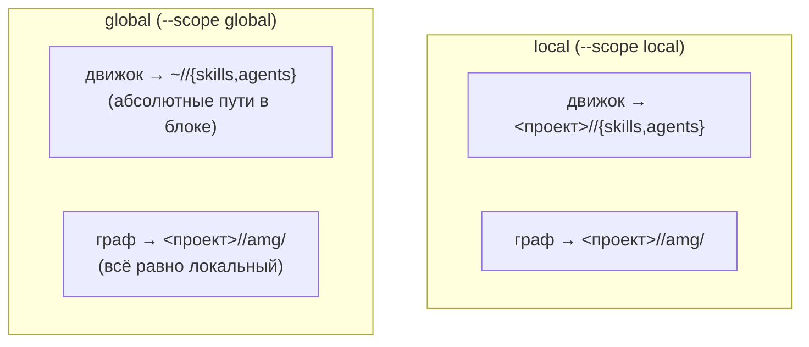
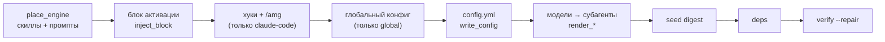

# 12 — Установщик (`install.py`)

Документ описывает **внутреннее устройство установщика** `install.py`: как движок попадает в проект, как шаблоны рендерятся под среду, как блок активации вливается в точку входа и почему переустановка и удаление безопасны. Это взгляд «как сделано»; «как пользоваться» (порядок установки, флаги для пользователя, переустановка/удаление по шагам) — в корневом [INSTALL.md](../../INSTALL.md). Дублирования между ними нет: здесь — механизмы и инварианты, там — рецепты.

> **Об именах путей.** `.claude` (каталог агента) и `CLAUDE.md` (точка входа) — умолчания Claude Code; установщик подставляет настроенные имена (например `.agents` / `AGENTS.md`). В шаблонах репозитория эти имена записаны как `.claude`/`CLAUDE.md` и служат **плейсхолдерами**, которые установщик заменяет.

## Что делает установщик

`install.py` — детерминированный, управляемый параметрами скрипт: модель ведёт диалог по [INSTALL.md](../../INSTALL.md) и вызывает его с ответами, а файловую работу делает скрипт. По шагам он размещает движок, рендерит шаблоны точки входа и **сами промпты движка** под выбранный каталог агента, вливает блок активации между маркерами, сливает `settings.json`, при глобальной установке пишет **глобальный конфиг личных умолчаний**, пишет локальный `config.yml`, рендерит блок `models` в определения субагентов, засевает пустой `digest.md`, по желанию ставит зависимости и проверяет хранилище. Граф он **не строит** — активация остаётся выбором пользователя, а структурную сборку ведёт петля или `/amg sync` (флаг `--build` — явное исключение).

Запускается установщик **из каталога-чекаута AMG**, который может лежать где угодно — предпочтительно вне устанавливаемого проекта: движок копируется в каталог агента (`REPO = Path(__file__).parent` — источники берутся от расположения самого скрипта), и после установки чекаут не нужен. Чекаут внутри проекта не опасен — разрешение store отличает его от установленного хранилища по сигнатуре движка (см. «Как движок находит граф») — но и не нужен: он лишь захламляет проект.

## Две плоскости: движок и граф

Установка различает **движок** (переносимый код: скиллы, субагенты, конфигурация-шаблон) и **граф** (память конкретного проекта). Ключевой инвариант: **граф всегда локальный** — он лежит в `<проект>/<agent_dir>/amg/`, потому что память относится к проекту и между проектами не делится. Движок же можно поставить локально (в проект) или глобально (один на все проекты).



В коде это разводят три пути в `install()`: `engine_root` (`Path.home()` при `global`/`project_only`, иначе `target`), `engine_agent_dir = engine_root/agent_dir` (куда лёг движок) и `graph_agent_dir = target/agent_dir` (корень графа — всегда от `target`). Точка входа — `engine_root/entrypoint`.

## Среды установки: три режима `--env`

Переносимость шире замены имени папки: хуки, слэш-команды и `@`-импорт — механизмы именно Claude Code. Поэтому установщик не только подставляет пути, но и **разворачивает механизм под среду** (классификатор `_env_kind`):

| `--env` | Среда | Что разворачивается |
|---|---|---|
| `claude-code` (умолчание) | Claude Code | блок со скиллами + хуки `settings.json` + слэш-команда `/amg`; модели → frontmatter `agents/amg-*.md` |
| `codex` | OpenAI Codex (есть скиллы и субагенты) | скиллы в `.agents/skills`, субагенты — **TOML в `.codex/agents`** (`model`/`model_reasoning_effort`), skill-aware блок `entrypoint/AGENTS.codex.md`; хуки и `/amg` не пишутся |
| `generic` | прочие AGENTS.md-среды (Qwen Coder, …) | переносимый блок без скиллов `entrypoint/AGENTS.md`; хуки и команда не пишутся |

Каталог агента и точку входа установщик подставляет по среде, если они не заданы явно: Claude Code → `.claude`/`CLAUDE.md`, иначе → `.agents`/`AGENTS.md`. **Режимы кроме Claude Code пока не протестированы** (проверка сред — отдельный этап дорожной карты).

## Конвейер установки



Ниже — каждый механизм по отдельности.

### Размещение движка и рендер промптов (`place_engine`)

Копируются **только** скиллы `amg-*` (`SKILL_NAMES`) и субагенты `amg-*`, поэтому в общем каталоге (особенно глобальном `~/.claude`) чужие скиллы и агенты целы, а переустановка обновляет лишь AMG. Скилл копируется целиком (`copytree`, без `__pycache__`); затем его `SKILL.md` и файлы `agents/amg-*.md` **рендерятся** функцией `render_control_text` под выбранный каталог агента (1.32). Дословное копирование оставило бы в иной среде неверные командные пути `.claude/...` и относительные пути скриптов, ломающиеся при глобальной установке. Reference-документы (`references/*.md`) остаются как есть — это документация; её средо-нейтрализация — этап перевода. Для `--env codex` файлы `agents/*.md` **не копируются**: субагенты Codex рендерятся отдельно как TOML (см. ниже).

### Рендер путей (`render_control_text`)

Единая функция замены плейсхолдеров в управляющем файле. Для **глобальной** установки пути к движку (`.claude/skills`, `.claude/agents`) становятся **абсолютными** (движок в домашнем каталоге), а пути графа (`.claude/amg`) и строка импорта дайджеста остаются проектно-локальными; `@`-импорт при global заменяется заметкой (глобальная точка входа не может импортировать пер-проектный граф). Затем `@.claude/amg`→`@<agent_dir>/amg`, `.claude`→`<agent_dir>`, `CLAUDE.md`→`<entrypoint>`. Для умолчаний Claude Code (`.claude`/`CLAUDE.md`, локально) результат совпадает с исходным шаблоном байт-в-байт.

### Блок активации (`inject_block`, `_block_body`)

Блок вливается в **конец** файла точки входа между маркерами `<!-- AMG:BEGIN -->` / `<!-- AMG:END -->`: инструкции пользователя остаются выше. `_block_body` срезает из шаблона стандартную преамбулу «# Project memory» (она нужна лишь для дев-копии), начиная с первого заголовка `## `. Переустановка заменяет **только** область между маркерами (идемпотентно: повторный запуск не дублирует блок); если файла нет — он создаётся с одним блоком.

### Хуки и команда (только Claude Code)

Для `--env claude-code` установщик сливает хуки `SessionStart`/`SessionEnd` из шаблона `entrypoint/settings.json` с существующим `settings.json` (`merge_settings`): чужие хуки и ключи сохраняются, прежние AMG-хуки заменяются (по сигнатуре `lifecycle.py` в команде). Слэш-команда `entrypoint/commands/amg.md` рендерится в `<agent_dir>/commands/`. Для `codex`/`generic` ни хуки, ни команда не пишутся — их роль берёт петля активации.

### Слои конфигурации: глобальный конфиг личных умолчаний (`write_global_config`)

При `--scope global` (и `--project-only` — он относится к уже существующей глобальной установке) установщик заводит **глобальный конфиг** `~/<agent_dir>/amg/config.yml` — слой личных, машинных умолчаний, который каждый установленный проект наследует по отдельным ключам (аудит 1.37). Его содержимое — блоки `models` и `retrieval.embeddings` со значениями из шаблона плюс ответы `--set-global` (точечные пути вида `retrieval.embeddings.enabled=auto`); заголовочный комментарий объясняет роль файла. Существующий глобальный конфиг **не перезаписывается** (то же правило, что у локального).

Чтобы наследование реально работало, локальный конфиг глобальной установки пишется **без** этих двух блоков — `_strip_top_block("models")` и `_strip_sub_block("retrieval", "embeddings")` вырезают ключ, его блок и баннерный комментарий над ним (полный шаблон затенял бы глобальный слой каждым своим ключом). Локальная установка (`--scope local`) самодостаточна: полный шаблон, глобальный файл не создаётся, `--set-global` игнорируется с пояснением.

Читают слои сами загрузчики движка (`retrieve` / `consolidate` / `extract_structure` — `load_config`): глобальный конфиг подкладывается **под** локальный слиянием по отдельным ключам (`_deep_merge`; вложенные блоки сливаются рекурсивно, локальное значение побеждает). Путь к глобальному слою выводится из ключа `agent_dir` **локального** конфига: он и называет домашний каталог среды (`~/<agent_dir>/amg/config.yml` — у каждой среды свой), и служит признаком «конфиг записан установщиком» — минимальный рукописный конфиг без `agent_dir` глобальный слой не читает, что держит тестовые фикстуры и ручные эксперименты герметичными. Каталог `~/<agent_dir>/amg/` при этом — носитель одного файла, **не хранилище**: графы в нём не создаются, а разрешение store его кандидатом не считает (см. «Как движок находит граф»). Установщик рендерит субагентов из того же объединённого взгляда (`_read_models` сливает глобальный слой под локальный), поэтому тиринг, заданный глобально, действует и без локального блока `models`.

### Шаблонизация `config.yml` (`write_config`)

`config.yml` копируется из шаблона репозитория, после чего заполняются отвеченные ключи. Правки точечные и **не трогают прозу комментариев**: `_set_scalar`/`_set_list` редактируют реальные строки-ключи (по якорю `^(# ?)?ключ:`), а не похожие фразы в комментариях. Заполняются `mirror_path`/`absorb_path`/`absorb_once_path` (флаг `--absorb-once`)/`exclude` (как flow-списки, элементы в кавычках — глобы остаются валидным YAML), скалярные ответы (`--set ключ=значение`; ключ с точками — например `retrieval.embeddings.enabled` — сеттер `_set_nested` находит по отступам внутри родительских блоков и меняет, сохраняя строчный комментарий), а также `agent_dir`/`entrypoint` (фиксируют выбор декларативно и включают наследование глобального слоя). Для не-`.claude` каталога единственное путь-значение `eval_gate.cases` тоже рендерится в выбранный каталог (1.32). **Существующий `config.yml` не затирается** — переустановка бережёт конфиг и граф проекта, а чтобы сохранённое состояние не оставалось невидимым, установщик печатает действующие значения существующего конфига строкой `in force:` (аудит 1.49) — установочный поток показывает их пользователю для подтверждения.

### Тиринг моделей в субагентов (`render_agent_models` / `render_codex_agents`)

Блок `config.yml → models` — единственный источник правды по выбору моделей (audit 1.14). Карта ролей → субагенты: `discovery`→{`amg-classifier`,`amg-retriever`}, `module_summary`→{`amg-builder`,`amg-linker`}, `synthesis`→{`amg-synth`,`amg-consolidator`}, `structural_extraction`→нет субагента. Значение роли — плоская строка-модель или `{model, reasoning_effort}`.

- **Claude Code** (`render_agent_models`): пишет поля `model`/`effort` во frontmatter `agents/amg-*.md` (точечной правкой, сохраняя `description`/`tools`/тело).
- **Codex** (`render_codex_agents`): рендерит `agents/amg-*.md` в TOML-субагентов `.codex/agents/amg-*.toml` — `name`, `description`, `developer_instructions` (тело промпта, пути отрендерены в `.agents`), и из конфига `model_reasoning_effort` плюс `model` (если это реальный id, а не Claude-алиас: дефолтные Claude-алиасы для Codex опускаются — Codex берёт модель сессии). Переустановка заменяет набор `amg-*.toml`, не дублируя.

`reasoning_effort` **клампится по среде** (`_clamp_effort`): Claude Code `effort` = `low|medium|high|xhigh|max` (`minimal`→`low`), Codex `model_reasoning_effort` = `minimal|low|medium|high|xhigh` (`max`→`xhigh`); не задан — поле опускается. Полная семантика, кламп и апстрим-баг Claude Code [#44385](https://github.com/anthropics/claude-code/issues/44385) — в [Справочнике конфигурации](./09-config.md), «Модели субагентов».

### Засев дайджеста, зависимости, проверка

- **`seed_digest`** кладёт пустой `digest.md` (плейсхолдер), чтобы импорт/чтение дайджеста резолвились до первой консолидации; реальный дайджест не затирается.
- **`install_deps`** ставит запрошенные группы (`--deps`): `base` (`pyyaml` — единственная обязательная), `embeddings` (`model2vec`), `embeddings-st` (`sentence-transformers`), `text` (`pypdf`/`python-docx`/`openpyxl`), `treesitter` (`tree-sitter`/`tree-sitter-language-pack`); те же группы документированы в `requirements.txt`.
- **`verify_store`** инициализирует и проверяет **локальный** граф **установленным** движком (`graph_store.py init` + `verify --repair`) — **без сборки графа**. Флаг `--build` дополнительно строит структурный скелет (`reconcile.py bootstrap`); семантическое обогащение остаётся модель-ведомым.

## Переустановка, удаление, добавление проекта

- **Переустановка** — это просто повторный запуск `install.py`, идемпотентный по построению: `place_engine` заменяет только `amg-*`, `inject_block` переписывает область между маркерами, `merge_settings` заменяет только AMG-хуки, `write_config` бережёт существующий конфиг (и печатает его действующие значения), рендер моделей переприменяется. Граф проекта не затрагивается.
- **Удаление** (`--uninstall [--scope global] [--purge-graph]`) срезает блок активации (контент пользователя цел), удаляет `amg-*` скиллы/агентов/команду и TOML-субагентов Codex (`.codex/agents/amg-*.toml`), снимает AMG-хуки из `settings.json`. Граф **сохраняется**, если не передан `--purge-graph`; глобальный конфиг личных умолчаний тоже сохраняется (это данные предпочтений пользователя — установщик сообщает об этом и оставляет удаление за человеком).
- **`--project-only`** добавляет проект к уже существующей (обычно глобальной) установке: пишется только локальный `config.yml` + `digest.md` (и досоздаётся глобальный конфиг, если его ещё нет), движок/блок/хуки не трогаются.

## Как движок находит граф

Установщик фиксирует `agent_dir` в конфиге декларативно, но рабочий корень графа скрипты ищут **по расположению** (`graph_store.resolve_amg_root`, цепочка 4.9): явный `--root` → `AMG_AGENT_DIR` → поиск вверх от текущего каталога (на каждом уровне сперва пресеты `<каталог>/{.claude,.agents}/amg/config.yml`, затем «голый» `<каталог>/amg` — только если это инициализированное хранилище) → расположение движка → умолчание `.claude`. Кандидат с сигнатурой движка (`skills/`, `agents/` или `install.py` внутри) отвергается как чекаут, уровень домашнего каталога пропускается (там живёт глобальный конфиг, не store). Поэтому глобальный движок лечит и читает **локальный** граф проекта, а чекаут AMG рядом с проектом ничего не перехватывает. Полные правила — [Хранилище и транзакции](./03-storage.md).

## Справочник флагов CLI

```
python install.py --target <проект> [--scope local|global]
    [--agent-dir .claude] [--entrypoint CLAUDE.md] [--env claude-code|codex|generic]
    [--mirror a,b] [--absorb c,d] [--absorb-once e,f] [--exclude "*.x,*.y"]
    [--set ключ=значение]...        # ключ с точками = вложенный (retrieval.embeddings.enabled)
    [--set-global ключ=значение]... # в глобальный конфиг личных умолчаний (global/project-only)
    [--deps base,embeddings,text,treesitter]
    [--no-verify] [--build] [--project-only]
python install.py --target <проект> --uninstall [--scope global] [--purge-graph]
```

Назначение каждого флага и сценарии — в [INSTALL.md](../../INSTALL.md).

## Дальше

- [Карта документации](./README.md) — оглавление архитектуры и возврат к началу.
- [08 — Субагенты и скиллы](./08-agents-skills.md) — что устанавливается (скиллы, субагенты, блок, петля) и переносимость по средам.
- [09 — Справочник конфигурации](./09-config.md) — ключи `config.yml`, блок `models`, `agent_dir`/`entrypoint`.
- [03 — Хранилище и транзакции](./03-storage.md) — разрешение корня графа (`resolve_amg_root`).
- [INSTALL.md](../../INSTALL.md) — как пользоваться установщиком (ручная и авто-установка, переустановка, удаление).
